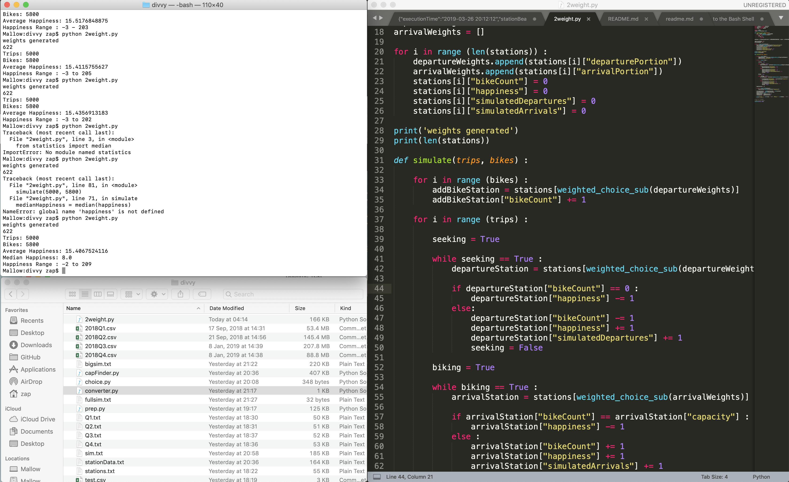

##### Week 08 TOC
- [Python History and Philosophy](readme.md)
- [Terminal Basics](terminal.md)
- [Intro to Python](python.md)
- [Modeling a Bikeshare System](bikeshare.md)

-----

### Intro to Python

##### Working in Python

The process for creating and running Python code is a bit obtuse. We will need easy access to a directory full of Python files and other assets, a Terminal emulator (the built-in [Terminal](https://support.apple.com/guide/terminal/welcome/mac) application for macOS or Linux, or [Cygwin](https://www.cygwin.com) for Windows) to run our completed code, as well as some sort of text editor for actually writing code (such as the cross-platform [Sublime](https://www.sublimetext.com)).

Setting up your desktop with the following format as a starting point is advisable.



-----

##### Printing to the Console and Running Python Code

The standard [Hello world](https://en.wikipedia.org/wiki/%22Hello,_World!%22_program) program, often used to demonstrate basic competency in a new programming language, is super easy in Python.

```python
print("Hello world")
```

We will need to type that bit of code into a new file in Sublime and save it as the file `hello.py`. To unify our processes, let's all make a new folder called `python_intro` on our Desktop. We can move into this new folder in our Terminal.


> `cd ~/Desktop/python_intro/`

To run our Python code, we simply use the Terminal command `python`.


> `python hello.py`

```
Hello World
```

We have officially written and executed Python code! :clap:

-----

##### Comments

Comments are text that are humand-readable, and ignored by the computer. Take notes by using comments directly in code!

You can write comments in Python by typing the `#` character and following it up with text on a single line.

```python
# this is a note that the computer doesn't see!
print("Hello world") #this prints text to the console
```

Multi-line comments use three quotation characters to begin and end the comment.

```python
"""
This says hello
to everyone
all over the planet
"""

print("Hello " + "World") 
#we can glue text together with the addition sign
```

-----

##### Variables
It is easy to make a container for information, called a `variable` in Python -- and you don't even need to know what kind of information it will store (unlike many other programming languages). The technical term for this behavior is that Python is a *dynamically-typed* language.

```python
name = "Zach"
siblingCount = "1"

print(name + " has " + str(siblingCount) + "sibling")
```

Note that, in order to print `siblingCount`, we must convert it to a String (text) format with `str()`. Variables can hold whatever data, but in Python it is often necessary to force a data type when the information is used.

-----

##### Indentation and Simple Loops
Some languages use curly braces `{}` and parentheses `()` or other formatting characters to determine which code is subordinated to other code. Often, programmers use indentation to show these relationships, as these formatting characters can be easily missed. Python does not use curly braces, and instead just makes use of indentation directly. Note the important colon `:`.

```python
# run a loop 10 times, starting at 0 and ending at 9
for i in range(10) :
    print("Hello " + str(i) + " times")
```

```
Hello 0 times
Hello 1 times
Hello 2 times
Hello 3 times
Hello 4 times
Hello 5 times
Hello 6 times
Hello 7 times
Hello 8 times
Hello 9 times
```

Note the indentation of the print statement, which tells Python that the `print()` code should be included in the loop.

The variable `i` is called the *iterator*. It is, by default increased by one for each loop. Also, by default, our `range()` starts at `0` and ends before the given argument (here 10).

We can control all these behaviors by providing more arguments to `range()`.

```python
# run a loop 10 times, starting at 5 and ending at 11, jumping up by 3
for i in range(5,12,3) :
    print("Hello " + str(i) + " times")
```

```
Hello 5 times
Hello 8 times
Hello 11 times
```

-----

##### Conditions

Conditions work the same way as loops.

A simple conditional might have only a single check.

```python
# weather model
tempThreshold = 72

tempToday = 35

if tempToday < tempThreshold :
    print("It's cold today")
else :
    print("It's hot today")
```

A more advanced conditional might have many branching options. Note that Python uses the strange `elif` rather than spelling out `else if`. 

```python
# better weather model
tempHigh = 85
tempLow = 65

tempToday = 73

if tempToday < tempLow :
    print("It's cold today")
elif tempToday > tempLow and tempToday < tempHigh :
    print("It's pleasant today")
else :
    print("It's hot today")
```

You can use the following comparison operators in conditionals

```
a == b : true if a is exactly equal to b
a < b  : true if a is less than b
a <= b : true if a is less than or equal to b
a >= b : true if a is greater than or equal to b
a > b  : true if a is greater than b
a != b : true if a does not equal b
```

-----

##### Random 

We can add a bit of functionality to the core Python library by *importing* different functionalities. Random numbers cannot be generated by core Python, so we need to bring a bit of additional code into our Python program.

If we want random integers, we can use `random.randint()`.

```python
import random

for i in range(10) :
	#print a random integer between 0 and 5, inclusive
	print(random.randint(0,5))
```

```
0
5
4
4
1
0
1
4
2
1
```

If we want a random number with decimals (called a "floating point number" by developers), we can instead use `random.uniform()`.

```python
import random

for i in range(10) :
	#print a random number, uniformly weighted, between 0 and 1, inclusive
	print(random.uniform(0,1))
```
```
0.8481560825317095
0.4862262467005589
0.7584955629755024
0.1872005446615962
0.3192872946043329
0.5031837342933824
0.5734300895869947
0.7422321630327087
0.8537804130068116
0.0239247940520823
```

-----

##### Lists

Variables can hold many pieces of information as a list, demarcated by square brackets and separated by commas.

```python
myList = ["hello","greetings","good day","hey","allo","good morning"]
```

You can access individual items in a list by their `index` and square brackets. The first item in the list has the index `[0]`, the second item has the index `[1]`, the last item has the index `[-1]`, and the second to last item in the list has the index `[-2]`...

```python
myList = ["hello","greetings","good day","hey","allo","good morning"]

print(myList[2])
print(myList[0])
print(myList[4])
print(myList[-1])
```

```
good day
hello
allo
good morning	
```

You can ask Python to determine the number (or "length") of items in the list.

```python
myList = ["hello","greetings","good day","hey","allo","good morning"]

print( len(myList) )
```

If we run this, the computer will calculate the number of items in the list.

```
6	
```

This is very useful for looping, and critical for any data manipulation! 

```python
myList = ["hello","greetings","good day","hey","allo","good morning"]

for i in range( len(myList) ) : 
	print( myList[i] )
```

```
hello
greetings
good day
hey
allo
good morning	
```

-----

##### Dictionaries

Often, we want a bit more structure for our data in Python. Dictionaries, called "Objects" in many other programming languages, allow us to associate parameters (called "keys") of entities with values associated with those parameters. Dictionaries are bounded by curly braces `{}`, keys and values are associated with colons `:`, and multiple keys are separated by commas `,`. 


```python
dog = {"family":"canidae", "genus":"canis", "species":"canis lupus", "subspecies":"canis l. familiaris", "common name":"doggy"}
cat = {"family":"felidae", "genus":"felis", "species":"felis catus", "subspecies":"felis c. familiaris", "common name":"kitty"}
```

We can access values of an object with square brackets; it is very similar to accessing an item in a list by index.

```python
dog = {"family":"canidae", "genus":"canis", "species":"canis lupus", "subspecies":"canis l. familiaris", "common name":"doggy"}
cat = {"family":"felidae", "genus":"felis", "species":"felis catus", "subspecies":"felis c. familiaris", "common name":"kitty"}

print( "My " + dog["common name"] + " is part of the zoologic family " + dog["family"] )
```

-----

##### Lists of Dictionaries!

For data modeling purposes, lists of dictionaries should be considered the fundamental and most important data structure. They allow use to keep track of a *population* of *entities*, each of which has its own set of *parameters*.

```python
pets = [ {"family":"canidae", "genus":"canis", "species":"canis lupus", "subspecies":"canis l. familiaris", "common name":"doggy"}, {"family":"felidae", "genus":"felis", "species":"felis catus", "subspecies":"felis c. familiaris", "common name":"kitty"}, {"family":"suidae", "genus":"sus", "species":"sus scrofa", "subspecies":"sus s. domesticus", "common name":"piggy"}, {"family":"leporidae", "genus":"Oryctolagus", "species":"oryctolagus cuniculus", "subspecies":"oryctolagus c. domesticus", "common name":"bunny"}]

for i in range( len(pets) ): 
	print( "My " + pets[i]["common name"] + " is part of the zoologic family " + pets[i]["family"] )
```

```
My doggy is part of the zoologic family canidae
My kitty is part of the zoologic family felidae
My piggy is part of the zoologic family suidae
My bunny is part of the zoologic family leporidae
```

Note the double bracketing `[i]["common name"]` which tells Python to access a specific entity in the list, and then retrieve a specific value by key name. 
