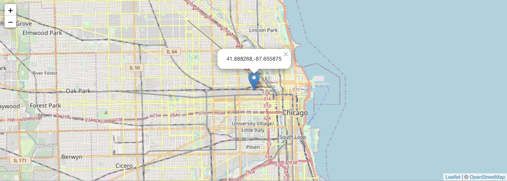

##### Week 09 TOC
- [Homework Answers from Last Week](answers.md)
- [Introduction](readme.md)
- [Homework for Next Week](homework.md)

-----

### Homework Answers from Last Week

1. What was the total arrival count, and departure count, for all Divvy stations, in 2018?

```python
# station data list
stations = [{'name': 'Damen Ave & Pierce Ave', 'arrivals': 19736, 'longitude': -87.6776919292, 'departures': 18413, 'latitude': 41.9093960065, 'capacity': 23, 'ID': 69}, {'name': 'Claremont Ave & Hirsch St', 'arrivals': 2683, 'longitude': -87.685854, 'departures': 2895, 'latitude': 41.907781, 'capacity': 11, 'ID': 159}, {'name': 'Winthrop Ave & Lawrence Ave', 'arrivals': 4391, 'longitude': -87.657659, 'departures': 4411, 'latitude': 41.968812, 'capacity': 15, 'ID': 253}, {'name': 'Clark St & Winnemac Ave (Temp)', 'arrivals': 5917, 'longitude': -87.6697, 'departures': 5966, 'latitude': 41.973255, 'capacity': 19, 'ID': 325}, {'name': 'LaSalle St & Washington St', 'arrivals': 10944, 'longitude': -87.63253, 'departures': 12358, 'latitude': 41.882664, 'capacity': 15, 'ID': 98}, {'name': 'Troy St & North Ave', 'arrivals': 1426, 'longitude': -87.7052804871, 'departures': 1375, 'latitude': 41.90976930169, 'capacity': 15, 'ID': 509}, {'name': 'Rush St & Hubbard St', 'arrivals': 12824, 'longitude': -87.626185, 'departures': 12030, 'latitude': 41.890173, 'capacity': 23, 'ID': 125}, {'name': 'Larrabee St & Oak St', 'arrivals': 9412, 'longitude': -87.6429854676, 'departures': 9239, 'latitude': 41.90021949323, 'capacity': 19, 'ID': 364}, {'name': 'Blue Island Ave & 18th St', 'arrivals': 5533, 'longitude': -87.661535, 'departures': 5208, 'latitude': 41.857556, 'capacity': 15, 'ID': 129}, {'name': 'Paulina St & 18th St', 'arrivals': 3582, 'longitude': -87.668745, 'departures': 3453, 'latitude': 41.857901, 'capacity': 15, 'ID': 205}, {'name': 'Broadway & Waveland Ave', 'arrivals': 9713, 'longitude': -87.648636, 'departures': 9141, 'latitude': 41.949074, 'capacity': 15, 'ID': 304}, {'name': 'Halsted St & Roscoe St', 'arrivals': 11601, 'longitude': -87.64895, 'departures': 11605, 'latitude': 41.94367, 'capacity': 15, 'ID': 299}, {'name': 'Franklin St & Lake St', 'arrivals': 14988, 'longitude': -87.6355, 'departures': 16090, 'latitude': 41.885837, 'capacity': 27, 'ID': 164}, {'name': 'Canal St & Madison St', 'arrivals': 31154, 'longitude': -87.639833, 'departures': 34188, 'latitude': 41.882091, 'capacity': 35, 'ID': 174}, {'name': 'Wells St & Elm St', 'arrivals': 12810, 'longitude': -87.634324, 'departures': 12916, 'latitude': 41.903222, 'capacity': 23, 'ID': 182}, {'name': 'McClurg Ct & Erie St', 'arrivals': 16256, 'longitude': -87.617854, 'departures': 16332, 'latitude': 41.894503, 'capacity': 31, 'ID': 142}, {'name': 'Lake Shore Dr & Ohio St', 'arrivals': 12578, 'longitude': -87.614492, 'departures': 12990, 'latitude': 41.89257, 'capacity': 19, 'ID': 99}, {'name': 'Wilton Ave & Diversey Pkwy', 'arrivals': 13807, 'longitude': -87.652705, 'departures': 13624, 'latitude': 41.932418, 'capacity': 35, 'ID': 13}, {'name': 'Clark St & Drummond Pl', 'arrivals': 14766, 'longitude': -87.644336, 'departures': 12849, 'latitude': 41.931248, 'capacity': 23, 'ID': 220}, {'name': 'Broadway & Belmont Ave', 'arrivals': 12440, 'longitude': -87.645451, 'departures': 10554, 'latitude': 41.940106, 'capacity': 19, 'ID': 296}, {'name': 'Michigan Ave & Oak St', 'arrivals': 31316, 'longitude': -87.62377664, 'departures': 29374, 'latitude': 41.90096039, 'capacity': 23, 'ID': 85}, {'name': 'State St & Pearson St', 'arrivals': 10816, 'longitude': -87.628722, 'departures': 11941, 'latitude': 41.897448, 'capacity': 27, 'ID': 106}, {'name': 'Winchester (Ravenswood) Ave & Balmoral Ave', 'arrivals': 2502, 'longitude': -87.67753, 'departures': 2202, 'latitude': 41.979762, 'capacity': 15, 'ID': 462}, {'name': 'Wolcott (Ravenswood) Ave & Montrose Ave (*)', 'arrivals': 3517, 'longitude': -87.676169, 'departures': 3491, 'latitude': 41.961406, 'capacity': 16, 'ID': 238}, {'name': 'Sedgwick St & North Ave', 'arrivals': 12162, 'longitude': -87.638677, 'departures': 12770, 'latitude': 41.911386, 'capacity': 19, 'ID': 118}, {'name': 'Wells St & Evergreen Ave', 'arrivals': 12664, 'longitude': -87.63483, 'departures': 12672, 'latitude': 41.906724, 'capacity': 19, 'ID': 291}, {'name': 'Clark St & Grace St', 'arrivals': 7081, 'longitude': -87.659172, 'departures': 7394, 'latitude': 41.95078, 'capacity': 23, 'ID': 165}, {'name': 'Broadway & Sheridan Rd', 'arrivals': 5616, 'longitude': -87.649993, 'departures': 5920, 'latitude': 41.952833, 'capacity': 15, 'ID': 256}, {'name': 'Green St & Madison St', 'arrivals': 17588, 'longitude': -87.648789, 'departures': 16259, 'latitude': 41.881892, 'capacity': 27, 'ID': 198}, {'name': 'Financial Pl & Congress Pkwy (Temp)', 'arrivals': 8008, 'longitude': -87.632882, 'departures': 8242, 'latitude': 41.874618, 'capacity': 15, 'ID': 89}, {'name': 'Leavitt St & North Ave', 'arrivals': 4290, 'longitude': -87.68229, 'departures': 4368, 'latitude': 41.910153, 'capacity': 15, 'ID': 213}, {'name': 'Wilton Ave & Belmont Ave', 'arrivals': 18073, 'longitude': -87.65304, 'departures': 17911, 'latitude': 41.94018, 'capacity': 27, 'ID': 117}, {'name': 'Clark St & Wellington Ave', 'arrivals': 11263, 'longitude': -87.6475386582, 'departures': 11192, 'latitude': 41.9364968219, 'capacity': 15, 'ID': 156}, {'name': 'Lake Shore Dr & Monroe St', 'arrivals': 30049, 'longitude': -87.616743, 'departures': 36174, 'latitude': 41.880958, 'capacity': 39, 'ID': 76}, {'name': 'Dearborn St & Monroe St', 'arrivals': 19830, 'longitude': -87.6295209193, 'departures': 20477, 'latitude': 41.881319815, 'capacity': 39, 'ID': 49}, {'name': 'Paulina Ave & North Ave', 'arrivals': 6611, 'longitude': -87.670072, 'departures': 6925, 'latitude': 41.910337, 'capacity': 15, 'ID': 16}, {'name': 'Pine Grove Ave & Waveland Ave', 'arrivals': 10448, 'longitude': -87.646303, 'departures': 10327, 'latitude': 41.949275, 'capacity': 23, 'ID': 232}, {'name': 'Dearborn St & Erie St', 'arrivals': 24191, 'longitude': -87.629318, 'departures': 23829, 'latitude': 41.893992, 'capacity': 27, 'ID': 110}, {'name': 'Halsted St & Clybourn Ave (*)', 'arrivals': 14178, 'longitude': -87.648128, 'departures': 13469, 'latitude': 41.909668, 'capacity': 28, 'ID': 331}, {'name': 'Orleans St & Chestnut St (NEXT Apts)', 'arrivals': 7540, 'longitude': -87.637536, 'departures': 8299, 'latitude': 41.898203, 'capacity': 15, 'ID': 620}, {'name': 'Glenwood Ave & Morse Ave', 'arrivals': 3989, 'longitude': -87.6655023944, 'departures': 3816, 'latitude': 42.00797192287, 'capacity': 15, 'ID': 447}, {'name': 'Western Ave & Lunt Ave', 'arrivals': 1140, 'longitude': -87.6904922389, 'departures': 1125, 'latitude': 42.0085943972, 'capacity': 15, 'ID': 467}, {'name': 'Clark St & Berwyn Ave', 'arrivals': 7549, 'longitude': -87.6680471047, 'departures': 7269, 'latitude': 41.9779966544, 'capacity': 19, 'ID': 463}, {'name': 'State St & 29th St', 'arrivals': 468, 'longitude': -87.626938, 'departures': 589, 'latitude': 41.841707, 'capacity': 11, 'ID': 193}, {'name': 'Wentworth Ave & Cermak Rd (Temp)', 'arrivals': 5136, 'longitude': -87.630578, 'departures': 4514, 'latitude': 41.853005, 'capacity': 19, 'ID': 120}, {'name': 'Clarendon Ave & Gordon Ter', 'arrivals': 7368, 'longitude': -87.649519, 'departures': 7388, 'latitude': 41.957879, 'capacity': 15, 'ID': 312}, {'name': 'Sheffield Ave & Waveland Ave', 'arrivals': 15382, 'longitude': -87.654529, 'departures': 13565, 'latitude': 41.949399, 'capacity': 27, 'ID': 114}, {'name': 'Wentworth Ave & 35th St', 'arrivals': 1462, 'longitude': -87.632504, 'departures': 1439, 'latitude': 41.830777, 'capacity': 15, 'ID': 405}, {'name': 'Wallace St & 35th St', 'arrivals': 1711, 'longitude': -87.64129, 'departures': 1689, 'latitude': 41.830629, 'capacity': 15, 'ID': 278}, {'name': 'Delano Ct & Roosevelt Rd', 'arrivals': 5705, 'longitude': -87.63219, 'departures': 6474, 'latitude': 41.867491, 'capacity': 19, 'ID': 626}, {'name': 'California Ave & North Ave', 'arrivals': 2498, 'longitude': -87.6972, 'departures': 2356, 'latitude': 41.91044, 'capacity': 11, 'ID': 276}, {'name': 'Kedzie Ave & Milwaukee Ave', 'arrivals': 10213, 'longitude': -87.707857, 'departures': 9460, 'latitude': 41.929567, 'capacity': 35, 'ID': 260}, {'name': 'Damen Ave & Thomas St (Augusta Blvd)', 'arrivals': 6409, 'longitude': -87.677409, 'departures': 6685, 'latitude': 41.901315, 'capacity': 23, 'ID': 183}, {'name': 'Damen Ave & Chicago Ave', 'arrivals': 11040, 'longitude': -87.67722, 'departures': 9847, 'latitude': 41.895769, 'capacity': 19, 'ID': 128}, {'name': 'Shore Dr & 55th St', 'arrivals': 7598, 'longitude': -87.580715, 'departures': 7512, 'latitude': 41.795212, 'capacity': 19, 'ID': 247}, {'name': 'Ellis Ave & 53rd St', 'arrivals': 4102, 'longitude': -87.6009581145, 'departures': 4179, 'latitude': 41.79933626261, 'capacity': 11, 'ID': 418}, {'name': 'Halsted St & Archer Ave', 'arrivals': 1463, 'longitude': -87.646795, 'departures': 1553, 'latitude': 41.847203, 'capacity': 15, 'ID': 206}, {'name': 'Emerald Ave & 31st St', 'arrivals': 3214, 'longitude': -87.645143, 'departures': 2868, 'latitude': 41.838198, 'capacity': 11, 'ID': 339}, {'name': 'Wabash Ave & 16th St', 'arrivals': 10105, 'longitude': -87.625813, 'departures': 9090, 'latitude': 41.860384, 'capacity': 39, 'ID': 72}, {'name': 'Franklin St & Jackson Blvd', 'arrivals': 18852, 'longitude': -87.6353211408, 'departures': 19477, 'latitude': 41.8777079559, 'capacity': 39, 'ID': 36}, {'name': 'Broadway & Cornelia Ave', 'arrivals': 11370, 'longitude': -87.646439, 'departures': 11231, 'latitude': 41.945529, 'capacity': 23, 'ID': 303}, {'name': 'Sheffield Ave & Webster Ave', 'arrivals': 11667, 'longitude': -87.653818, 'departures': 11404, 'latitude': 41.92154, 'capacity': 19, 'ID': 327}, {'name': 'Sheffield Ave & Wrightwood Ave', 'arrivals': 7624, 'longitude': -87.653833, 'departures': 7634, 'latitude': 41.928712, 'capacity': 31, 'ID': 302}, {'name': 'Michigan Ave & 18th St', 'arrivals': 9885, 'longitude': -87.62455, 'departures': 9412, 'latitude': 41.857813, 'capacity': 23, 'ID': 273}, {'name': 'Calumet Ave & 18th St', 'arrivals': 8213, 'longitude': -87.619407, 'departures': 7590, 'latitude': 41.857611, 'capacity': 15, 'ID': 338}, {'name': 'Rush St & Cedar St', 'arrivals': 12480, 'longitude': -87.627690528, 'departures': 12169, 'latitude': 41.90230870122, 'capacity': 11, 'ID': 172}, {'name': 'St. Clair St & Erie St', 'arrivals': 24178, 'longitude': -87.622663, 'departures': 19036, 'latitude': 41.894448, 'capacity': 19, 'ID': 211}, {'name': 'Kingsbury St & Erie St', 'arrivals': 18108, 'longitude': -87.641527, 'departures': 19812, 'latitude': 41.893626, 'capacity': 23, 'ID': 74}, {'name': 'McClurg Ct & Illinois St', 'arrivals': 17983, 'longitude': -87.617532, 'departures': 19011, 'latitude': 41.890359, 'capacity': 31, 'ID': 26}, {'name': 'Clark St & Lake St', 'arrivals': 15455, 'longitude': -87.6308760584, 'departures': 16580, 'latitude': 41.88602082773, 'capacity': 27, 'ID': 38}, {'name': 'Wabash Ave & Wacker Pl', 'arrivals': 12670, 'longitude': -87.62603, 'departures': 12462, 'latitude': 41.886875, 'capacity': 19, 'ID': 194}, {'name': 'Bissell St & Armitage Ave', 'arrivals': 13880, 'longitude': -87.65222, 'departures': 12895, 'latitude': 41.91844, 'capacity': 15, 'ID': 113}, {'name': 'Lake Shore Dr & North Blvd', 'arrivals': 36194, 'longitude': -87.626804, 'departures': 31203, 'latitude': 41.911722, 'capacity': 39, 'ID': 268}, {'name': 'Larrabee St & Armitage Ave', 'arrivals': 6405, 'longitude': -87.643749, 'departures': 6728, 'latitude': 41.918084, 'capacity': 14, 'ID': 288}, {'name': 'Shedd Aquarium', 'arrivals': 19941, 'longitude': -87.6153553902, 'departures': 23282, 'latitude': 41.86722595682, 'capacity': 55, 'ID': 3}, {'name': 'Federal St & Polk St', 'arrivals': 12692, 'longitude': -87.6295437729, 'departures': 12174, 'latitude': 41.87207763285, 'capacity': 19, 'ID': 41}, {'name': 'Field Blvd & South Water St', 'arrivals': 10207, 'longitude': -87.6175165471, 'departures': 10590, 'latitude': 41.88634906269, 'capacity': 19, 'ID': 7}, {'name': 'Canal St & Adams St', 'arrivals': 59179, 'longitude': -87.639904, 'departures': 62654, 'latitude': 41.879255, 'capacity': 47, 'ID': 192}, {'name': 'Shields Ave & 28th Pl', 'arrivals': 1131, 'longitude': -87.635491, 'departures': 1030, 'latitude': 41.842733, 'capacity': 11, 'ID': 401}, {'name': 'Milwaukee Ave & Grand Ave', 'arrivals': 13202, 'longitude': -87.648384, 'departures': 13847, 'latitude': 41.891578, 'capacity': 19, 'ID': 84}, {'name': 'Mies van der Rohe Way & Chicago Ave', 'arrivals': 13699, 'longitude': -87.621743, 'departures': 13639, 'latitude': 41.89691, 'capacity': 15, 'ID': 173}, {'name': 'Sheridan Rd & Irving Park Rd', 'arrivals': 11783, 'longitude': -87.654406, 'departures': 11542, 'latitude': 41.954245, 'capacity': 27, 'ID': 240}, {'name': 'Clinton St & Madison St', 'arrivals': 50068, 'longitude': -87.641066, 'departures': 51692, 'latitude': 41.882242, 'capacity': 31, 'ID': 77}, {'name': 'Wells St & Huron St', 'arrivals': 17987, 'longitude': -87.634362, 'departures': 19181, 'latitude': 41.894722, 'capacity': 27, 'ID': 53}, {'name': 'State St & Randolph St', 'arrivals': 18374, 'longitude': -87.6277335692, 'departures': 19001, 'latitude': 41.8847302006, 'capacity': 27, 'ID': 44}, {'name': 'Halsted St & Willow St', 'arrivals': 6052, 'longitude': -87.648755, 'departures': 6047, 'latitude': 41.913865, 'capacity': 19, 'ID': 224}, {'name': 'Western Ave & Walton St', 'arrivals': 6057, 'longitude': -87.6865960164, 'departures': 5964, 'latitude': 41.89841768945, 'capacity': 23, 'ID': 374}, {'name': 'Damen Ave & Clybourn Ave', 'arrivals': 3790, 'longitude': -87.677856, 'departures': 3393, 'latitude': 41.931931, 'capacity': 15, 'ID': 163}, {'name': 'Racine Ave & Fullerton Ave', 'arrivals': 7915, 'longitude': -87.65840426, 'departures': 7990, 'latitude': 41.92556258, 'capacity': 19, 'ID': 87}, {'name': 'Clifton Ave & Armitage Ave', 'arrivals': 7109, 'longitude': -87.656936, 'departures': 7051, 'latitude': 41.918216, 'capacity': 15, 'ID': 223}, {'name': 'Lincoln Ave & Waveland Ave', 'arrivals': 3872, 'longitude': -87.675278, 'departures': 3467, 'latitude': 41.948797, 'capacity': 15, 'ID': 257}, {'name': 'Lincoln Ave & Roscoe St', 'arrivals': 9200, 'longitude': -87.67097, 'departures': 8199, 'latitude': 41.94334, 'capacity': 19, 'ID': 230}, {'name': 'Franklin St & Chicago Ave', 'arrivals': 12729, 'longitude': -87.635633, 'departures': 14189, 'latitude': 41.896776, 'capacity': 23, 'ID': 31}, {'name': 'Desplaines St & Randolph St', 'arrivals': 10785, 'longitude': -87.6445705849, 'departures': 11277, 'latitude': 41.88461618962, 'capacity': 23, 'ID': 96}, {'name': 'Wabash Ave & Roosevelt Rd', 'arrivals': 22662, 'longitude': -87.625961, 'departures': 21464, 'latitude': 41.867227, 'capacity': 23, 'ID': 59}, {'name': 'Clinton St & Roosevelt Rd', 'arrivals': 6602, 'longitude': -87.6410879593, 'departures': 5959, 'latitude': 41.8671177825, 'capacity': 15, 'ID': 57}, {'name': 'Marshfield Ave & Cortland St', 'arrivals': 14871, 'longitude': -87.668879, 'departures': 15413, 'latitude': 41.916017, 'capacity': 23, 'ID': 58}, {'name': 'Damen Ave & Cortland St', 'arrivals': 8854, 'longitude': -87.677335, 'departures': 8666, 'latitude': 41.915983, 'capacity': 19, 'ID': 219}, {'name': 'Ritchie Ct & Banks St', 'arrivals': 7248, 'longitude': -87.626217, 'departures': 7611, 'latitude': 41.906866, 'capacity': 15, 'ID': 180}, {'name': 'Green St & Randolph St', 'arrivals': 16034, 'longitude': -87.64867, 'departures': 14206, 'latitude': 41.883668, 'capacity': 15, 'ID': 112}, {'name': 'Wells St & Walton St', 'arrivals': 5125, 'longitude': -87.63443007, 'departures': 6805, 'latitude': 41.89993001, 'capacity': 19, 'ID': 46}, {'name': 'Damen Ave & Division St', 'arrivals': 7064, 'longitude': -87.678435, 'departures': 6772, 'latitude': 41.903266, 'capacity': 19, 'ID': 130}, {'name': 'Clark St & Congress Pkwy', 'arrivals': 11922, 'longitude': -87.6305845355, 'departures': 11920, 'latitude': 41.8759326655, 'capacity': 35, 'ID': 50}, {'name': 'Canal St & Jackson Blvd', 'arrivals': 12349, 'longitude': -87.639366, 'departures': 11981, 'latitude': 41.877245, 'capacity': 39, 'ID': 75}, {'name': 'Morgan Ave & 14th Pl', 'arrivals': 4756, 'longitude': -87.651062, 'departures': 4875, 'latitude': 41.862378, 'capacity': 15, 'ID': 137}, {'name': 'Franklin St & Quincy St', 'arrivals': 12063, 'longitude': -87.634793, 'departures': 12987, 'latitude': 41.878724, 'capacity': 23, 'ID': 286}, {'name': 'Paulina St & Montrose Ave', 'arrivals': 2544, 'longitude': -87.671387, 'departures': 2608, 'latitude': 41.961507, 'capacity': 15, 'ID': 297}, {'name': 'Western Ave & Leland Ave', 'arrivals': 6302, 'longitude': -87.688487, 'departures': 5842, 'latitude': 41.966555, 'capacity': 19, 'ID': 239}, {'name': 'Southport Ave & Wellington Ave', 'arrivals': 10927, 'longitude': -87.663576, 'departures': 10959, 'latitude': 41.935733, 'capacity': 19, 'ID': 153}, {'name': 'Sheffield Ave & Wellington Ave', 'arrivals': 12662, 'longitude': -87.652662, 'departures': 12089, 'latitude': 41.936266, 'capacity': 23, 'ID': 115}, {'name': 'Wabash Ave & 9th St', 'arrivals': 11740, 'longitude': -87.625734, 'departures': 12223, 'latitude': 41.870769, 'capacity': 19, 'ID': 321}, {'name': 'Sedgwick St & Webster Ave', 'arrivals': 12078, 'longitude': -87.638888, 'departures': 12253, 'latitude': 41.922167, 'capacity': 15, 'ID': 143}, {'name': 'Clark St & Wrightwood Ave', 'arrivals': 15302, 'longitude': -87.643118, 'departures': 15237, 'latitude': 41.929546, 'capacity': 15, 'ID': 340}, {'name': 'Damen Ave & Leland Ave', 'arrivals': 5111, 'longitude': -87.679028, 'departures': 5528, 'latitude': 41.967094, 'capacity': 15, 'ID': 242}, {'name': 'Clark St & Columbia Ave', 'arrivals': 1729, 'longitude': -87.6724024047, 'departures': 1910, 'latitude': 42.00445062934, 'capacity': 15, 'ID': 449}, {'name': 'State St & 33rd St', 'arrivals': 8800, 'longitude': -87.625813, 'departures': 8234, 'latitude': 41.834734, 'capacity': 15, 'ID': 148}, {'name': 'State St & 35th St', 'arrivals': 3801, 'longitude': -87.62688, 'departures': 3270, 'latitude': 41.83104, 'capacity': 15, 'ID': 184}, {'name': 'Broadway & Barry Ave', 'arrivals': 16793, 'longitude': -87.644095, 'departures': 15840, 'latitude': 41.937725, 'capacity': 19, 'ID': 300}, {'name': 'Broadway & Wilson Ave', 'arrivals': 6329, 'longitude': -87.658139, 'departures': 5941, 'latitude': 41.965221, 'capacity': 23, 'ID': 293}, {'name': 'Dearborn Pkwy & Delaware Pl', 'arrivals': 17516, 'longitude': -87.629912, 'departures': 16553, 'latitude': 41.898969, 'capacity': 19, 'ID': 140}, {'name': 'Sheffield Ave & Willow St', 'arrivals': 9158, 'longitude': -87.652855, 'departures': 8936, 'latitude': 41.913688, 'capacity': 15, 'ID': 93}, {'name': 'Clark St & Chicago Ave', 'arrivals': 9985, 'longitude': -87.630931, 'departures': 10827, 'latitude': 41.896544, 'capacity': 19, 'ID': 337}, {'name': 'Pine Grove Ave & Irving Park Rd', 'arrivals': 9516, 'longitude': -87.648043, 'departures': 9755, 'latitude': 41.954383, 'capacity': 14, 'ID': 254}, {'name': 'Sheridan Rd & Montrose Ave', 'arrivals': 7914, 'longitude': -87.65464, 'departures': 6857, 'latitude': 41.96167, 'capacity': 23, 'ID': 231}, {'name': 'Spaulding Ave & Armitage Ave', 'arrivals': 3777, 'longitude': -87.7103566522, 'departures': 3561, 'latitude': 41.91718375155, 'capacity': 15, 'ID': 506}, {'name': 'Spaulding Ave & Division St', 'arrivals': 985, 'longitude': -87.709219571, 'departures': 1003, 'latitude': 41.90270659438, 'capacity': 11, 'ID': 510}, {'name': 'Damen Ave & Charleston St', 'arrivals': 4091, 'longitude': -87.677855, 'departures': 4106, 'latitude': 41.920082, 'capacity': 11, 'ID': 310}, {'name': 'Wood St & Milwaukee Ave', 'arrivals': 10799, 'longitude': -87.672552, 'departures': 10332, 'latitude': 41.907655, 'capacity': 19, 'ID': 61}, {'name': 'Clark St & Elm St', 'arrivals': 24170, 'longitude': -87.63128, 'departures': 23368, 'latitude': 41.902973, 'capacity': 39, 'ID': 176}, {'name': 'Ashland Ave & Division St', 'arrivals': 17279, 'longitude': -87.667747, 'departures': 17460, 'latitude': 41.90345, 'capacity': 27, 'ID': 210}, {'name': 'Damen Ave & Sunnyside Ave', 'arrivals': 2372, 'longitude': -87.679258, 'departures': 2254, 'latitude': 41.96325, 'capacity': 19, 'ID': 316}, {'name': 'Peoria St & Jackson Blvd', 'arrivals': 12928, 'longitude': -87.649633, 'departures': 13783, 'latitude': 41.877749, 'capacity': 19, 'ID': 134}, {'name': 'Adler Planetarium', 'arrivals': 14146, 'longitude': -87.607267, 'departures': 14953, 'latitude': 41.866095, 'capacity': 39, 'ID': 341}, {'name': 'Southport Ave & Waveland Ave', 'arrivals': 10349, 'longitude': -87.66394, 'departures': 10228, 'latitude': 41.94815, 'capacity': 23, 'ID': 227}, {'name': 'Fairbanks Ct & Grand Ave', 'arrivals': 22166, 'longitude': -87.62062, 'departures': 21593, 'latitude': 41.89186, 'capacity': 15, 'ID': 24}, {'name': 'University Ave & 57th St', 'arrivals': 11828, 'longitude': -87.599861, 'departures': 11693, 'latitude': 41.791478, 'capacity': 31, 'ID': 423}, {'name': 'Halsted St & Wrightwood Ave', 'arrivals': 9111, 'longitude': -87.649077, 'departures': 9250, 'latitude': 41.929143, 'capacity': 15, 'ID': 349}, {'name': 'Sheridan Rd & Noyes St (NU)', 'arrivals': 2830, 'longitude': -87.677432, 'departures': 2933, 'latitude': 42.058239, 'capacity': 15, 'ID': 604}, {'name': 'Desplaines St & Jackson Blvd', 'arrivals': 14231, 'longitude': -87.643909, 'departures': 14218, 'latitude': 41.878287, 'capacity': 27, 'ID': 107}, {'name': 'Clark St & Schreiber Ave', 'arrivals': 1478, 'longitude': -87.6713773393, 'departures': 1371, 'latitude': 41.99925182186, 'capacity': 15, 'ID': 453}, {'name': 'Wells St & Polk St', 'arrivals': 7449, 'longitude': -87.633502, 'departures': 7635, 'latitude': 41.872596, 'capacity': 19, 'ID': 175}, {'name': 'Halsted St & Roosevelt Rd', 'arrivals': 5510, 'longitude': -87.648625, 'departures': 5011, 'latitude': 41.867324, 'capacity': 23, 'ID': 55}, {'name': 'Canal St & Harrison St', 'arrivals': 3005, 'longitude': -87.639573, 'departures': 3662, 'latitude': 41.874255, 'capacity': 15, 'ID': 169}, {'name': 'Southport Ave & Clark St', 'arrivals': 2417, 'longitude': -87.664199, 'departures': 2714, 'latitude': 41.957081, 'capacity': 11, 'ID': 292}, {'name': 'Ashland Ave & Belle Plaine Ave', 'arrivals': 1301, 'longitude': -87.668835, 'departures': 1444, 'latitude': 41.956057, 'capacity': 11, 'ID': 246}, {'name': 'Racine Ave & Wrightwood Ave', 'arrivals': 4657, 'longitude': -87.658971, 'departures': 4956, 'latitude': 41.928887, 'capacity': 15, 'ID': 343}, {'name': 'Greenview Ave & Fullerton Ave', 'arrivals': 7120, 'longitude': -87.6658, 'departures': 6421, 'latitude': 41.92533, 'capacity': 15, 'ID': 188}, {'name': 'LaSalle St & Illinois St', 'arrivals': 21293, 'longitude': -87.631697, 'departures': 19816, 'latitude': 41.890762, 'capacity': 31, 'ID': 181}, {'name': 'Ogden Ave & Race Ave', 'arrivals': 7485, 'longitude': -87.658751, 'departures': 6678, 'latitude': 41.891795, 'capacity': 15, 'ID': 186}, {'name': 'Honore St & Division St', 'arrivals': 7528, 'longitude': -87.673935, 'departures': 7566, 'latitude': 41.903119, 'capacity': 23, 'ID': 17}, {'name': 'Southport Ave & Clybourn Ave', 'arrivals': 8253, 'longitude': -87.663712, 'departures': 7512, 'latitude': 41.920771, 'capacity': 15, 'ID': 307}, {'name': 'Streeter Dr & Grand Ave', 'arrivals': 78221, 'longitude': -87.612043, 'departures': 66944, 'latitude': 41.892278, 'capacity': 47, 'ID': 35}, {'name': 'Columbus Dr & Randolph St', 'arrivals': 22743, 'longitude': -87.619521, 'departures': 35342, 'latitude': 41.884728, 'capacity': 55, 'ID': 195}, {'name': 'Wacker Dr & Washington St', 'arrivals': 16885, 'longitude': -87.637321, 'departures': 18218, 'latitude': 41.883132, 'capacity': 19, 'ID': 18}, {'name': 'Michigan Ave & 14th St', 'arrivals': 9308, 'longitude': -87.623727, 'departures': 9025, 'latitude': 41.864059, 'capacity': 19, 'ID': 168}, {'name': 'Ashland Ave & Grand Ave', 'arrivals': 4276, 'longitude': -87.666611, 'departures': 3970, 'latitude': 41.891072, 'capacity': 15, 'ID': 277}, {'name': 'Morgan St & Polk St', 'arrivals': 14370, 'longitude': -87.65103, 'departures': 14497, 'latitude': 41.871737, 'capacity': 19, 'ID': 241}, {'name': 'Morgan St & 18th St', 'arrivals': 4550, 'longitude': -87.651073, 'departures': 3959, 'latitude': 41.858086, 'capacity': 15, 'ID': 14}, {'name': 'Orleans St & Merchandise Mart Plaza', 'arrivals': 22381, 'longitude': -87.63639, 'departures': 29082, 'latitude': 41.888243, 'capacity': 35, 'ID': 100}, {'name': 'Wells St & Concord Ln', 'arrivals': 21725, 'longitude': -87.634656, 'departures': 20963, 'latitude': 41.912133, 'capacity': 19, 'ID': 289}, {'name': 'Clybourn Ave & Division St', 'arrivals': 6536, 'longitude': -87.640552, 'departures': 6550, 'latitude': 41.904613, 'capacity': 15, 'ID': 138}, {'name': 'Aberdeen St & Monroe St', 'arrivals': 10364, 'longitude': -87.655519, 'departures': 9875, 'latitude': 41.880419, 'capacity': 19, 'ID': 80}, {'name': 'Greenview Ave & Jarvis Ave', 'arrivals': 2058, 'longitude': -87.66857, 'departures': 1939, 'latitude': 42.015962, 'capacity': 19, 'ID': 520}, {'name': 'Ashland Ave & Wrightwood Ave', 'arrivals': 4669, 'longitude': -87.668507, 'departures': 4449, 'latitude': 41.92883, 'capacity': 15, 'ID': 166}, {'name': 'Sheffield Ave & Fullerton Ave', 'arrivals': 16407, 'longitude': -87.6537080423, 'departures': 16841, 'latitude': 41.9256018819, 'capacity': 27, 'ID': 67}, {'name': 'State St & 19th St', 'arrivals': 2547, 'longitude': -87.627542, 'departures': 2433, 'latitude': 41.856594, 'capacity': 15, 'ID': 178}, {'name': 'Paulina St & Howard St', 'arrivals': 2324, 'longitude': -87.673573, 'departures': 2071, 'latitude': 42.019159, 'capacity': 19, 'ID': 515}, {'name': 'Clark St & North Ave', 'arrivals': 9510, 'longitude': -87.631942, 'departures': 9212, 'latitude': 41.911974, 'capacity': 15, 'ID': 126}, {'name': 'Clark St & Lincoln Ave', 'arrivals': 18511, 'longitude': -87.6346, 'departures': 17883, 'latitude': 41.915689, 'capacity': 23, 'ID': 141}, {'name': 'Bosworth Ave & Howard St', 'arrivals': 701, 'longitude': -87.669563, 'departures': 714, 'latitude': 42.019537, 'capacity': 11, 'ID': 522}, {'name': 'Burling St (Halsted) & Diversey Pkwy (Temp)', 'arrivals': 8349, 'longitude': -87.64776, 'departures': 7488, 'latitude': 41.93314, 'capacity': 19, 'ID': 332}, {'name': 'Calumet Ave & 33rd St', 'arrivals': 2892, 'longitude': -87.61793, 'departures': 3126, 'latitude': 41.8349, 'capacity': 11, 'ID': 149}, {'name': 'Rhodes Ave & 32nd St', 'arrivals': 1764, 'longitude': -87.613533, 'departures': 1773, 'latitude': 41.836208, 'capacity': 11, 'ID': 263}, {'name': 'Halsted St & Maxwell St', 'arrivals': 6741, 'longitude': -87.647071, 'departures': 6381, 'latitude': 41.864883, 'capacity': 15, 'ID': 282}, {'name': 'Burnham Harbor', 'arrivals': 11670, 'longitude': -87.613348, 'departures': 11544, 'latitude': 41.856268, 'capacity': 23, 'ID': 4}, {'name': 'Noble St & Milwaukee Ave', 'arrivals': 6664, 'longitude': -87.6626, 'departures': 7018, 'latitude': 41.90068, 'capacity': 15, 'ID': 29}, {'name': 'Desplaines St & Kinzie St', 'arrivals': 16702, 'longitude': -87.6444478533, 'departures': 19112, 'latitude': 41.888716036, 'capacity': 27, 'ID': 56}, {'name': 'Clark St & Armitage Ave', 'arrivals': 20331, 'longitude': -87.636282, 'departures': 19848, 'latitude': 41.918306, 'capacity': 31, 'ID': 94}, {'name': 'State St & Harrison St', 'arrivals': 8436, 'longitude': -87.627716, 'departures': 8156, 'latitude': 41.874053, 'capacity': 23, 'ID': 5}, {'name': 'May St & Taylor St', 'arrivals': 9577, 'longitude': -87.6554864, 'departures': 9437, 'latitude': 41.8694821, 'capacity': 15, 'ID': 22}, {'name': 'Ashland Ave & Lake St (Temp)', 'arrivals': 4218, 'longitude': -87.66717, 'departures': 4566, 'latitude': 41.88592, 'capacity': 19, 'ID': 119}, {'name': 'Mies van der Rohe Way & Chestnut St', 'arrivals': 13569, 'longitude': -87.6219152258, 'departures': 14231, 'latitude': 41.8985866514, 'capacity': 19, 'ID': 145}, {'name': 'Larrabee St & Kingsbury St', 'arrivals': 22254, 'longitude': -87.642884, 'departures': 21352, 'latitude': 41.897764, 'capacity': 43, 'ID': 48}, {'name': 'Kingsbury St & Kinzie St', 'arrivals': 34655, 'longitude': -87.6385057718, 'departures': 34589, 'latitude': 41.88917683258, 'capacity': 31, 'ID': 133}, {'name': 'Clinton St & Lake St', 'arrivals': 23755, 'longitude': -87.641823, 'departures': 23175, 'latitude': 41.885637, 'capacity': 23, 'ID': 66}, {'name': 'Lincoln Ave & Leavitt St', 'arrivals': 4681, 'longitude': -87.684781, 'departures': 4468, 'latitude': 41.963004, 'capacity': 15, 'ID': 243}, {'name': 'Leavitt St & Armitage Ave', 'arrivals': 3604, 'longitude': -87.682437, 'departures': 3863, 'latitude': 41.917805, 'capacity': 11, 'ID': 309}, {'name': 'Lincoln Ave & Fullerton Ave', 'arrivals': 9732, 'longitude': -87.64926, 'departures': 9473, 'latitude': 41.925905, 'capacity': 15, 'ID': 127}, {'name': 'Lakefront Trail & Bryn Mawr Ave', 'arrivals': 9193, 'longitude': -87.6523104689, 'departures': 9004, 'latitude': 41.98403669612, 'capacity': 19, 'ID': 459}, {'name': 'Wolcott Ave & Polk St', 'arrivals': 9032, 'longitude': -87.673688, 'departures': 9389, 'latitude': 41.871262, 'capacity': 23, 'ID': 342}, {'name': 'Hermitage Ave & Polk St', 'arrivals': 6096, 'longitude': -87.669886, 'departures': 6080, 'latitude': 41.871514, 'capacity': 15, 'ID': 261}, {'name': 'Ravenswood Ave & Lawrence Ave', 'arrivals': 14071, 'longitude': -87.674237, 'departures': 14037, 'latitude': 41.96909, 'capacity': 47, 'ID': 344}, {'name': 'Drake Ave & Fullerton Ave', 'arrivals': 2361, 'longitude': -87.7154410355, 'departures': 2080, 'latitude': 41.924398819, 'capacity': 15, 'ID': 503}, {'name': 'Broadway & Granville Ave', 'arrivals': 4334, 'longitude': -87.6602845349, 'departures': 4069, 'latitude': 41.9947796884, 'capacity': 23, 'ID': 454}, {'name': 'Campbell Ave & North Ave', 'arrivals': 3374, 'longitude': -87.689556, 'departures': 3302, 'latitude': 41.910535, 'capacity': 15, 'ID': 160}, {'name': 'Kedzie Ave & Palmer Ct', 'arrivals': 3629, 'longitude': -87.707322, 'departures': 3692, 'latitude': 41.921525, 'capacity': 15, 'ID': 290}, {'name': 'Talman Ave & Addison St', 'arrivals': 2373, 'longitude': -87.694614758, 'departures': 2181, 'latitude': 41.9466358306, 'capacity': 15, 'ID': 491}, {'name': 'Sangamon St & Washington Blvd (*)', 'arrivals': 7584, 'longitude': -87.6511, 'departures': 8110, 'latitude': 41.883165, 'capacity': 16, 'ID': 233}, {'name': 'Michigan Ave & Pearson St', 'arrivals': 9887, 'longitude': -87.62351, 'departures': 10197, 'latitude': 41.89766, 'capacity': 23, 'ID': 25}, {'name': 'Field Museum', 'arrivals': 7294, 'longitude': -87.617867, 'departures': 9184, 'latitude': 41.865312, 'capacity': 55, 'ID': 97}, {'name': 'Clark St & Bryn Mawr Ave', 'arrivals': 4423, 'longitude': -87.669154, 'departures': 4150, 'latitude': 41.983593, 'capacity': 15, 'ID': 460}, {'name': 'Sheridan Rd & Loyola Ave', 'arrivals': 4026, 'longitude': -87.6611982433, 'departures': 3830, 'latitude': 42.00104377979, 'capacity': 23, 'ID': 451}, {'name': 'Lake Shore Dr & Wellington Ave', 'arrivals': 11839, 'longitude': -87.636794, 'departures': 11240, 'latitude': 41.936669, 'capacity': 15, 'ID': 157}, {'name': 'Sheridan Rd & Greenleaf Ave', 'arrivals': 1760, 'longitude': -87.6624120948, 'departures': 1748, 'latitude': 42.01058656284, 'capacity': 15, 'ID': 354}, {'name': 'Dearborn St & Adams St', 'arrivals': 11726, 'longitude': -87.6297910363, 'departures': 12069, 'latitude': 41.8793563587, 'capacity': 19, 'ID': 37}, {'name': 'Racine Ave & 18th St', 'arrivals': 4338, 'longitude': -87.656495, 'departures': 4049, 'latitude': 41.858166, 'capacity': 15, 'ID': 15}, {'name': 'LaSalle St & Jackson Blvd', 'arrivals': 25860, 'longitude': -87.631929, 'departures': 27665, 'latitude': 41.878166, 'capacity': 35, 'ID': 283}, {'name': 'Lake Shore Dr & Diversey Pkwy', 'arrivals': 11136, 'longitude': -87.636427, 'departures': 11034, 'latitude': 41.932588, 'capacity': 23, 'ID': 329}, {'name': 'Lakeview Ave & Fullerton Pkwy', 'arrivals': 14060, 'longitude': -87.638973, 'departures': 13453, 'latitude': 41.925858, 'capacity': 19, 'ID': 313}, {'name': 'Michigan Ave & Lake St', 'arrivals': 22386, 'longitude': -87.624117, 'departures': 22198, 'latitude': 41.886024, 'capacity': 35, 'ID': 52}, {'name': 'Cottage Grove Ave & 78th St', 'arrivals': 131, 'longitude': -87.605026, 'departures': 126, 'latitude': 41.753174, 'capacity': 11, 'ID': 575}, {'name': 'Eberhart (Vernon) Ave & 79th St', 'arrivals': 74, 'longitude': -87.612568, 'departures': 60, 'latitude': 41.751345, 'capacity': 11, 'ID': 574}, {'name': 'Canal St & Taylor St', 'arrivals': 7316, 'longitude': -87.639474, 'departures': 7620, 'latitude': 41.870257, 'capacity': 15, 'ID': 414}, {'name': 'Clinton St & Polk St (*)', 'arrivals': 2692, 'longitude': -87.6409491327, 'departures': 2118, 'latitude': 41.87146651779, 'capacity': 16, 'ID': 103}, {'name': 'Larrabee St & Webster Ave', 'arrivals': 12129, 'longitude': -87.64414, 'departures': 11928, 'latitude': 41.921822, 'capacity': 19, 'ID': 144}, {'name': 'Damen Ave & Grand Ave', 'arrivals': 5456, 'longitude': -87.67686, 'departures': 5287, 'latitude': 41.89122, 'capacity': 23, 'ID': 214}, {'name': 'California Ave & Altgeld St', 'arrivals': 3050, 'longitude': -87.697668, 'departures': 2867, 'latitude': 41.92669, 'capacity': 15, 'ID': 502}, {'name': 'Wabash Ave & Grand Ave', 'arrivals': 21357, 'longitude': -87.626761, 'departures': 21029, 'latitude': 41.891466, 'capacity': 31, 'ID': 199}, {'name': 'Millennium Park', 'arrivals': 36256, 'longitude': -87.62408432, 'departures': 32483, 'latitude': 41.8810317, 'capacity': 47, 'ID': 90}, {'name': 'Clarendon Ave & Leland Ave', 'arrivals': 3856, 'longitude': -87.650001, 'departures': 3817, 'latitude': 41.967968, 'capacity': 15, 'ID': 251}, {'name': 'Clark St & Randolph St', 'arrivals': 16813, 'longitude': -87.63188991, 'departures': 16427, 'latitude': 41.884576228, 'capacity': 39, 'ID': 51}, {'name': 'Western Ave & Winnebago Ave', 'arrivals': 7552, 'longitude': -87.687022, 'departures': 7576, 'latitude': 41.91552, 'capacity': 15, 'ID': 116}, {'name': 'Logan Blvd & Elston Ave', 'arrivals': 4215, 'longitude': -87.684158, 'departures': 3977, 'latitude': 41.929465, 'capacity': 27, 'ID': 258}, {'name': 'Humboldt Blvd & Armitage Ave', 'arrivals': 4040, 'longitude': -87.7018089555, 'departures': 3960, 'latitude': 41.91751339399, 'capacity': 19, 'ID': 507}, {'name': 'California Ave & Milwaukee Ave', 'arrivals': 9450, 'longitude': -87.697153, 'departures': 9724, 'latitude': 41.922695, 'capacity': 15, 'ID': 123}, {'name': 'Morgan St & Lake St', 'arrivals': 19055, 'longitude': -87.6523048564, 'departures': 17005, 'latitude': 41.8854833079, 'capacity': 23, 'ID': 71}, {'name': 'Clark St & 9th St (AMLI)', 'arrivals': 4600, 'longitude': -87.631246, 'departures': 4283, 'latitude': 41.870816, 'capacity': 15, 'ID': 394}, {'name': 'Morgan St & 31st St', 'arrivals': 1827, 'longitude': -87.65114, 'departures': 1645, 'latitude': 41.8378, 'capacity': 11, 'ID': 280}, {'name': 'Halsted St & 35th St (*)', 'arrivals': 1355, 'longitude': -87.647172, 'departures': 1212, 'latitude': 41.830661, 'capacity': 16, 'ID': 279}, {'name': 'Kimbark Ave & 53rd St', 'arrivals': 8017, 'longitude': -87.594747, 'departures': 7704, 'latitude': 41.799568, 'capacity': 19, 'ID': 322}, {'name': 'Eckhart Park', 'arrivals': 7276, 'longitude': -87.66098386, 'departures': 7049, 'latitude': 41.89637337, 'capacity': 19, 'ID': 86}, {'name': 'Troy St & Elston Ave', 'arrivals': 2074, 'longitude': -87.7066499009, 'departures': 1927, 'latitude': 41.94524356848, 'capacity': 15, 'ID': 490}, {'name': 'Ellis Ave & 60th St', 'arrivals': 7661, 'longitude': -87.6010727606, 'departures': 7898, 'latitude': 41.78509714636, 'capacity': 19, 'ID': 426}, {'name': 'Ogden Ave & Chicago Ave', 'arrivals': 8061, 'longitude': -87.6540612729, 'departures': 8381, 'latitude': 41.896362458, 'capacity': 19, 'ID': 54}, {'name': 'Halsted St & North Branch St', 'arrivals': 1957, 'longitude': -87.6484798752, 'departures': 2179, 'latitude': 41.89936843921, 'capacity': 15, 'ID': 365}, {'name': 'Ashland Ave & Augusta Blvd', 'arrivals': 5765, 'longitude': -87.6677, 'departures': 5672, 'latitude': 41.899643, 'capacity': 15, 'ID': 30}, {'name': 'Evans Ave & 75th St', 'arrivals': 391, 'longitude': -87.606685, 'departures': 350, 'latitude': 41.758308, 'capacity': 11, 'ID': 570}, {'name': 'Vernon Ave & 75th St', 'arrivals': 103, 'longitude': -87.614138, 'departures': 111, 'latitude': 41.758361, 'capacity': 11, 'ID': 571}, {'name': 'Larrabee St & Division St', 'arrivals': 8838, 'longitude': -87.6433534936, 'departures': 9575, 'latitude': 41.90348607004, 'capacity': 23, 'ID': 359}, {'name': 'Dayton St & North Ave', 'arrivals': 10381, 'longitude': -87.6494219288, 'departures': 10077, 'latitude': 41.9105780349, 'capacity': 19, 'ID': 60}, {'name': 'Racine Ave & Congress Pkwy', 'arrivals': 6693, 'longitude': -87.65703, 'departures': 6432, 'latitude': 41.87464, 'capacity': 19, 'ID': 32}, {'name': 'Ellis Ave & 58th St', 'arrivals': 5982, 'longitude': -87.601334, 'departures': 6008, 'latitude': 41.788746, 'capacity': 19, 'ID': 328}, {'name': 'Lincoln Ave & Winona St', 'arrivals': 1335, 'longitude': -87.6925025594, 'departures': 1408, 'latitude': 41.97491129677, 'capacity': 15, 'ID': 472}, {'name': 'Francisco Ave & Foster Ave', 'arrivals': 1485, 'longitude': -87.7014194389, 'departures': 1412, 'latitude': 41.97563272521, 'capacity': 15, 'ID': 471}, {'name': 'Racine Ave (May St) & Fulton St', 'arrivals': 7473, 'longitude': -87.656919, 'departures': 6507, 'latitude': 41.886926, 'capacity': 15, 'ID': 217}, {'name': 'Lincoln Ave & Diversey Pkwy', 'arrivals': 7439, 'longitude': -87.658617, 'departures': 7721, 'latitude': 41.932225, 'capacity': 15, 'ID': 152}, {'name': 'Lincoln Ave & Addison St', 'arrivals': 2240, 'longitude': -87.673308, 'departures': 2044, 'latitude': 41.946176, 'capacity': 19, 'ID': 330}, {'name': 'Clinton St & Tilden St', 'arrivals': 6707, 'longitude': -87.640795, 'departures': 6998, 'latitude': 41.875885, 'capacity': 23, 'ID': 68}, {'name': 'Artesian Ave & Hubbard St', 'arrivals': 3887, 'longitude': -87.6882193648, 'departures': 5306, 'latitude': 41.88949181977, 'capacity': 35, 'ID': 376}, {'name': 'Michigan Ave & Washington St', 'arrivals': 37969, 'longitude': -87.6246491409, 'departures': 38029, 'latitude': 41.8838927658, 'capacity': 43, 'ID': 43}, {'name': 'Aberdeen St & Jackson Blvd', 'arrivals': 11620, 'longitude': -87.65478743, 'departures': 12056, 'latitude': 41.87772613, 'capacity': 23, 'ID': 21}, {'name': 'Stetson Ave & South Water St', 'arrivals': 10887, 'longitude': -87.62232, 'departures': 13396, 'latitude': 41.886835, 'capacity': 19, 'ID': 264}, {'name': 'Lincoln Ave & Belmont Ave', 'arrivals': 7085, 'longitude': -87.668385, 'departures': 7001, 'latitude': 41.939365, 'capacity': 15, 'ID': 131}, {'name': 'Lake Shore Dr & Belmont Ave', 'arrivals': 13553, 'longitude': -87.639192, 'departures': 13189, 'latitude': 41.940775, 'capacity': 19, 'ID': 334}, {'name': 'Sheffield Ave & Kingsbury St', 'arrivals': 10361, 'longitude': -87.653106, 'departures': 9504, 'latitude': 41.910522, 'capacity': 15, 'ID': 20}, {'name': 'Chicago Ave & Washington St', 'arrivals': 3096, 'longitude': -87.679101, 'departures': 2991, 'latitude': 42.032562, 'capacity': 15, 'ID': 597}, {'name': 'Calumet Ave & 35th St', 'arrivals': 997, 'longitude': -87.618034, 'departures': 968, 'latitude': 41.831379, 'capacity': 15, 'ID': 335}, {'name': 'Indiana Ave & Roosevelt Rd', 'arrivals': 19211, 'longitude': -87.623041, 'departures': 20165, 'latitude': 41.867888, 'capacity': 39, 'ID': 255}, {'name': 'LaSalle St & Adams St', 'arrivals': 6432, 'longitude': -87.6319852213, 'departures': 6855, 'latitude': 41.87934437346, 'capacity': 15, 'ID': 40}, {'name': 'Halsted St & Polk St', 'arrivals': 8428, 'longitude': -87.64664, 'departures': 8606, 'latitude': 41.87184, 'capacity': 19, 'ID': 108}, {'name': 'State St & Kinzie St', 'arrivals': 20146, 'longitude': -87.627754, 'departures': 18246, 'latitude': 41.889187, 'capacity': 31, 'ID': 47}, {'name': 'Wabash Ave & Cermak Rd', 'arrivals': 3060, 'longitude': -87.626488, 'departures': 2787, 'latitude': 41.852619, 'capacity': 11, 'ID': 42}, {'name': 'Clinton St & Washington Blvd', 'arrivals': 47638, 'longitude': -87.64117, 'departures': 48669, 'latitude': 41.88338, 'capacity': 31, 'ID': 91}, {'name': 'Michigan Ave & Congress Pkwy', 'arrivals': 7033, 'longitude': -87.624426, 'departures': 7802, 'latitude': 41.876243, 'capacity': 15, 'ID': 45}, {'name': 'Ravenswood Ave & Irving Park Rd', 'arrivals': 4871, 'longitude': -87.67393, 'departures': 4497, 'latitude': 41.95469, 'capacity': 19, 'ID': 244}, {'name': 'Sedgwick St & Schiller St', 'arrivals': 2758, 'longitude': -87.638566, 'departures': 2861, 'latitude': 41.907626, 'capacity': 15, 'ID': 236}, {'name': 'Jefferson St & Monroe St', 'arrivals': 8246, 'longitude': -87.642746, 'departures': 8621, 'latitude': 41.880422, 'capacity': 19, 'ID': 73}, {'name': 'Canal St & Monroe St (*)', 'arrivals': 12286, 'longitude': -87.639507, 'departures': 14039, 'latitude': 41.880381, 'capacity': 28, 'ID': 191}, {'name': 'Michigan Ave & Jackson Blvd', 'arrivals': 14441, 'longitude': -87.62408, 'departures': 14263, 'latitude': 41.87785, 'capacity': 23, 'ID': 284}, {'name': 'Wabash Ave & Adams St', 'arrivals': 12262, 'longitude': -87.6256886059, 'departures': 11752, 'latitude': 41.87947235235, 'capacity': 23, 'ID': 39}, {'name': 'Sheridan Rd & Lawrence Ave', 'arrivals': 3642, 'longitude': -87.654691, 'departures': 3441, 'latitude': 41.969517, 'capacity': 19, 'ID': 323}, {'name': 'Larrabee St & North Ave', 'arrivals': 3966, 'longitude': -87.6435, 'departures': 4146, 'latitude': 41.91021, 'capacity': 19, 'ID': 27}, {'name': 'Wisconsin Ave & Madison St (Temp)', 'arrivals': 17, 'longitude': False, 'departures': 14, 'latitude': False, 'capacity': False, 'ID': 613}, {'name': 'Marion St & South Blvd', 'arrivals': 40, 'longitude': False, 'departures': 40, 'latitude': False, 'capacity': False, 'ID': 610}, {'name': 'Rush St & Superior St', 'arrivals': 12189, 'longitude': -87.6259080327, 'departures': 12433, 'latitude': 41.89576474564, 'capacity': 23, 'ID': 161}, {'name': 'Franklin St & Monroe St', 'arrivals': 28499, 'longitude': -87.635185, 'departures': 33125, 'latitude': 41.880317, 'capacity': 27, 'ID': 287}, {'name': 'Racine Ave & 15th St', 'arrivals': 2541, 'longitude': -87.656625, 'departures': 2556, 'latitude': 41.861267, 'capacity': 15, 'ID': 274}, {'name': 'Ashland Ave & Blackhawk St', 'arrivals': 6803, 'longitude': -87.667252, 'departures': 6925, 'latitude': 41.907066, 'capacity': 15, 'ID': 333}, {'name': 'California Ave & Byron St', 'arrivals': 1441, 'longitude': -87.698051113, 'departures': 1305, 'latitude': 41.95216219326, 'capacity': 19, 'ID': 487}, {'name': 'Drake Ave & Addison St', 'arrivals': 1517, 'longitude': -87.717582, 'departures': 1528, 'latitude': 41.947326, 'capacity': 15, 'ID': 489}, {'name': 'Ada St & Washington Blvd', 'arrivals': 7636, 'longitude': -87.661206, 'departures': 7811, 'latitude': 41.88283, 'capacity': 15, 'ID': 346}, {'name': 'Ashland Ave & Harrison St', 'arrivals': 4750, 'longitude': -87.667246, 'departures': 4808, 'latitude': 41.874291, 'capacity': 23, 'ID': 383}, {'name': 'Monticello Ave & Irving Park Rd', 'arrivals': 1152, 'longitude': -87.7191281797, 'departures': 1210, 'latitude': 41.95400483876, 'capacity': 15, 'ID': 484}, {'name': 'Loomis St & Jackson Blvd', 'arrivals': 4464, 'longitude': -87.662007, 'departures': 4531, 'latitude': 41.877945, 'capacity': 19, 'ID': 146}, {'name': 'Broadway & Berwyn Ave', 'arrivals': 5987, 'longitude': -87.659753, 'departures': 5529, 'latitude': 41.978353, 'capacity': 15, 'ID': 294}, {'name': 'Greenview Ave & Diversey Pkwy', 'arrivals': 3743, 'longitude': -87.665939, 'departures': 3689, 'latitude': 41.932595, 'capacity': 15, 'ID': 319}, {'name': 'Cannon Dr & Fullerton Ave', 'arrivals': 6563, 'longitude': -87.6344287848, 'departures': 6162, 'latitude': 41.9267559875, 'capacity': 15, 'ID': 34}, {'name': 'Theater on the Lake', 'arrivals': 33838, 'longitude': -87.630834, 'departures': 30679, 'latitude': 41.926277, 'capacity': 31, 'ID': 177}, {'name': 'Michigan Ave & Madison St', 'arrivals': 10450, 'longitude': -87.625125, 'departures': 10464, 'latitude': 41.882134, 'capacity': 19, 'ID': 197}, {'name': 'Racine Ave & Belmont Ave', 'arrivals': 7142, 'longitude': -87.658865, 'departures': 7209, 'latitude': 41.939743, 'capacity': 15, 'ID': 226}, {'name': 'Sedgwick St & Huron St', 'arrivals': 11456, 'longitude': -87.638437, 'departures': 11442, 'latitude': 41.894666, 'capacity': 27, 'ID': 111}, {'name': 'Benson Ave & Church St', 'arrivals': 4937, 'longitude': -87.683485, 'departures': 4971, 'latitude': 42.048214, 'capacity': 15, 'ID': 596}, {'name': 'University Library (NU)', 'arrivals': 3210, 'longitude': -87.673447, 'departures': 3151, 'latitude': 42.052939, 'capacity': 15, 'ID': 605}, {'name': 'Southport Ave & Wrightwood Ave', 'arrivals': 6121, 'longitude': -87.663913, 'departures': 6058, 'latitude': 41.928773, 'capacity': 15, 'ID': 190}, {'name': 'Keystone Ave & Fullerton Ave', 'arrivals': 685, 'longitude': -87.728231, 'departures': 702, 'latitude': 41.924377, 'capacity': 11, 'ID': 619}, {'name': 'Wood St & Taylor St', 'arrivals': 6040, 'longitude': -87.671045, 'departures': 5987, 'latitude': 41.869154, 'capacity': 23, 'ID': 317}, {'name': 'Michigan Ave & 8th St', 'arrivals': 10541, 'longitude': -87.623981, 'departures': 11494, 'latitude': 41.872773, 'capacity': 43, 'ID': 623}, {'name': 'Daley Center Plaza', 'arrivals': 34427, 'longitude': -87.629634, 'departures': 33968, 'latitude': 41.884241, 'capacity': 39, 'ID': 81}, {'name': 'State St & Van Buren St', 'arrivals': 10939, 'longitude': -87.627844, 'departures': 11570, 'latitude': 41.877181, 'capacity': 27, 'ID': 33}, {'name': 'Kimball Ave & Belmont Ave', 'arrivals': 1511, 'longitude': -87.711561, 'departures': 1473, 'latitude': 41.939398, 'capacity': 15, 'ID': 497}, {'name': 'Southport Ave & Roscoe St', 'arrivals': 12985, 'longitude': -87.66402, 'departures': 11924, 'latitude': 41.943739, 'capacity': 19, 'ID': 229}, {'name': 'Lake Park Ave & 56th St', 'arrivals': 4719, 'longitude': -87.587782, 'departures': 4522, 'latitude': 41.793242, 'capacity': 19, 'ID': 345}, {'name': 'Woodlawn Ave & Lake Park Ave', 'arrivals': 1026, 'longitude': -87.5970051479, 'departures': 1010, 'latitude': 41.81409271048, 'capacity': 15, 'ID': 413}, {'name': 'Ellis Ave & 55th St', 'arrivals': 7879, 'longitude': -87.6014497734, 'departures': 7944, 'latitude': 41.79430062054, 'capacity': 19, 'ID': 420}, {'name': 'Pulaski Rd & Eddy St (Temp)', 'arrivals': 545, 'longitude': -87.731023, 'departures': 443, 'latitude': 41.946264, 'capacity': 11, 'ID': 488}, {'name': 'Kilbourn Ave & Milwaukee Ave', 'arrivals': 501, 'longitude': -87.74002, 'departures': 603, 'latitude': 41.948818, 'capacity': 15, 'ID': 591}, {'name': 'Kedzie Ave & Bryn Mawr Ave', 'arrivals': 554, 'longitude': -87.7089225202, 'departures': 438, 'latitude': 41.98239708485, 'capacity': 15, 'ID': 494}, {'name': 'Kedzie Ave & Leland Ave', 'arrivals': 1389, 'longitude': -87.7080519806, 'departures': 1382, 'latitude': 41.96668636205, 'capacity': 15, 'ID': 476}, {'name': 'Orleans St & Elm St (*)', 'arrivals': 4535, 'longitude': -87.637715, 'departures': 4613, 'latitude': 41.902924, 'capacity': 16, 'ID': 23}, {'name': 'Milwaukee Ave & Wabansia Ave', 'arrivals': 9255, 'longitude': -87.681391, 'departures': 8944, 'latitude': 41.912616, 'capacity': 15, 'ID': 158}, {'name': 'Wells St & Hubbard St', 'arrivals': 17917, 'longitude': -87.634266, 'departures': 17307, 'latitude': 41.889906, 'capacity': 31, 'ID': 212}, {'name': 'Dearborn St & Van Buren St (*)', 'arrivals': 4905, 'longitude': -87.629155, 'departures': 5046, 'latitude': 41.876268, 'capacity': 16, 'ID': 624}, {'name': '900 W Harrison St', 'arrivals': 5755, 'longitude': -87.649807, 'departures': 6187, 'latitude': 41.874754, 'capacity': 19, 'ID': 109}, {'name': 'Damen Ave & Foster Ave', 'arrivals': 3465, 'longitude': -87.6794590387, 'departures': 3375, 'latitude': 41.97561480459, 'capacity': 15, 'ID': 464}, {'name': 'Halsted St & Dickens Ave', 'arrivals': 9566, 'longitude': -87.64883, 'departures': 8997, 'latitude': 41.919936, 'capacity': 23, 'ID': 225}, {'name': 'Winchester Ave & Elston Ave', 'arrivals': 3236, 'longitude': -87.6764600747, 'departures': 3034, 'latitude': 41.92409085038, 'capacity': 15, 'ID': 505}, {'name': 'Western Ave & Roscoe St', 'arrivals': 3000, 'longitude': -87.687288, 'departures': 3008, 'latitude': 41.943034, 'capacity': 11, 'ID': 493}, {'name': 'Broadway & Ridge Ave', 'arrivals': 4305, 'longitude': -87.6602738295, 'departures': 4044, 'latitude': 41.9840446107, 'capacity': 15, 'ID': 461}, {'name': 'Western Ave & Division St', 'arrivals': 4983, 'longitude': -87.687275, 'departures': 4659, 'latitude': 41.902893, 'capacity': 23, 'ID': 305}, {'name': 'Western Ave & Howard St', 'arrivals': 628, 'longitude': -87.690048, 'departures': 617, 'latitude': 42.018901, 'capacity': 15, 'ID': 527}, {'name': 'Clark St & Montrose Ave', 'arrivals': 4046, 'longitude': -87.666036, 'departures': 4236, 'latitude': 41.961588, 'capacity': 19, 'ID': 234}, {'name': 'Budlong Woods Library', 'arrivals': 511, 'longitude': -87.6964225611, 'departures': 447, 'latitude': 41.98366470886, 'capacity': 11, 'ID': 468}, {'name': 'Dodge Ave & Church St', 'arrivals': 668, 'longitude': -87.698224, 'departures': 751, 'latitude': 42.048308, 'capacity': 15, 'ID': 600}, {'name': 'Clark St & Lunt Ave', 'arrivals': 3211, 'longitude': -87.67419, 'departures': 3097, 'latitude': 42.009074, 'capacity': 19, 'ID': 432}, {'name': 'Damen Ave & Coulter St', 'arrivals': 417, 'longitude': -87.67564, 'departures': 394, 'latitude': 41.8492, 'capacity': 7, 'ID': 167}, {'name': 'Halsted St & 18th St', 'arrivals': 2471, 'longitude': -87.646277, 'departures': 2322, 'latitude': 41.857499, 'capacity': 15, 'ID': 202}, {'name': 'Kilbourn Ave & Irving Park Rd', 'arrivals': 602, 'longitude': -87.740569, 'departures': 656, 'latitude': 41.953733, 'capacity': 11, 'ID': 590}, {'name': 'Princeton Ave & Garfield Blvd', 'arrivals': 338, 'longitude': -87.633124, 'departures': 379, 'latitude': 41.794982, 'capacity': 11, 'ID': 385}, {'name': 'Campbell Ave & Montrose Ave', 'arrivals': 2409, 'longitude': -87.6911650414, 'departures': 2274, 'latitude': 41.96152593287, 'capacity': 15, 'ID': 482}, {'name': 'Rockwell St & Eastwood Ave', 'arrivals': 2285, 'longitude': -87.6936384935, 'departures': 1939, 'latitude': 41.96590013976, 'capacity': 15, 'ID': 478}, {'name': 'Clark St & Leland Ave', 'arrivals': 4259, 'longitude': -87.667429, 'departures': 4664, 'latitude': 41.967096, 'capacity': 19, 'ID': 326}, {'name': 'Southport Ave & Belmont Ave', 'arrivals': 5045, 'longitude': -87.66378, 'departures': 4960, 'latitude': 41.93949, 'capacity': 15, 'ID': 154}, {'name': 'Racine Ave & Randolph St', 'arrivals': 8038, 'longitude': -87.656853, 'departures': 7959, 'latitude': 41.884069, 'capacity': 19, 'ID': 88}, {'name': 'Cityfront Plaza Dr & Pioneer Ct', 'arrivals': 11930, 'longitude': -87.622072, 'departures': 13036, 'latitude': 41.890573, 'capacity': 31, 'ID': 196}, {'name': 'Lake Park Ave & 35th St', 'arrivals': 1799, 'longitude': -87.6087991946, 'departures': 1731, 'latitude': 41.83127423549, 'capacity': 19, 'ID': 406}, {'name': 'Ravenswood Ave & Berteau Ave', 'arrivals': 3619, 'longitude': -87.673567, 'departures': 3885, 'latitude': 41.957921, 'capacity': 15, 'ID': 314}, {'name': 'Indiana Ave & 31st St', 'arrivals': 3821, 'longitude': -87.621857, 'departures': 3962, 'latitude': 41.838842, 'capacity': 11, 'ID': 272}, {'name': 'Larrabee St & Menomonee St', 'arrivals': 5021, 'longitude': -87.64332, 'departures': 5205, 'latitude': 41.91468, 'capacity': 15, 'ID': 28}, {'name': 'Greenwood Ave & 47th St', 'arrivals': 1296, 'longitude': -87.599383, 'departures': 1353, 'latitude': 41.809835, 'capacity': 15, 'ID': 252}, {'name': 'Blackstone Ave & Hyde Park Blvd', 'arrivals': 2879, 'longitude': -87.590368, 'departures': 3196, 'latitude': 41.802562, 'capacity': 19, 'ID': 121}, {'name': 'Ashland Ave & 13th St', 'arrivals': 2616, 'longitude': -87.666507, 'departures': 2261, 'latitude': 41.865234, 'capacity': 15, 'ID': 275}, {'name': 'Oakley Ave & Irving Park Rd', 'arrivals': 2034, 'longitude': -87.6860796243, 'departures': 1895, 'latitude': 41.95434085219, 'capacity': 15, 'ID': 486}, {'name': 'Ridge Blvd & Howard St', 'arrivals': 563, 'longitude': -87.68452, 'departures': 643, 'latitude': 42.019276, 'capacity': 11, 'ID': 514}, {'name': 'Southport Ave & Irving Park Rd', 'arrivals': 4753, 'longitude': -87.664358, 'departures': 4837, 'latitude': 41.954177, 'capacity': 15, 'ID': 318}, {'name': 'Wood St & Hubbard St', 'arrivals': 3858, 'longitude': -87.671956, 'departures': 3742, 'latitude': 41.889587, 'capacity': 19, 'ID': 285}, {'name': 'Ashland Ave & Chicago Ave', 'arrivals': 6849, 'longitude': -87.667747, 'departures': 6521, 'latitude': 41.895966, 'capacity': 15, 'ID': 350}, {'name': 'Seeley Ave & Roscoe St', 'arrivals': 3100, 'longitude': -87.679618, 'departures': 3095, 'latitude': 41.943403, 'capacity': 11, 'ID': 308}, {'name': 'Elston Ave & Wabansia Ave', 'arrivals': 2710, 'longitude': -87.664169, 'departures': 2598, 'latitude': 41.912919, 'capacity': 23, 'ID': 315}, {'name': 'Loomis St & Archer Ave', 'arrivals': 742, 'longitude': -87.6574349533, 'departures': 712, 'latitude': 41.84163253965, 'capacity': 11, 'ID': 366}, {'name': 'Cornell Ave & Hyde Park Blvd', 'arrivals': 5029, 'longitude': -87.586924, 'departures': 5193, 'latitude': 41.802406, 'capacity': 19, 'ID': 417}, {'name': 'Lincoln Ave & Belle Plaine Ave', 'arrivals': 4456, 'longitude': -87.679259, 'departures': 4048, 'latitude': 41.955927, 'capacity': 15, 'ID': 298}, {'name': 'Albany Ave & Bloomingdale Ave', 'arrivals': 3693, 'longitude': -87.705126462, 'departures': 3808, 'latitude': 41.91402671273, 'capacity': 15, 'ID': 511}, {'name': 'Clinton St & 18th St', 'arrivals': 2320, 'longitude': -87.640826, 'departures': 2238, 'latitude': 41.85795, 'capacity': 15, 'ID': 170}, {'name': 'Carpenter St & Huron St', 'arrivals': 5181, 'longitude': -87.653449, 'departures': 6013, 'latitude': 41.894556, 'capacity': 19, 'ID': 92}, {'name': 'Loomis St & Lexington St', 'arrivals': 10738, 'longitude': -87.661501, 'departures': 11610, 'latitude': 41.872187, 'capacity': 19, 'ID': 320}, {'name': 'Halsted St & 21st St', 'arrivals': 1512, 'longitude': -87.64665, 'departures': 1384, 'latitude': 41.85378, 'capacity': 11, 'ID': 135}, {'name': 'Clark St & Elmdale Ave', 'arrivals': 2225, 'longitude': -87.669758, 'departures': 2117, 'latitude': 41.990887, 'capacity': 19, 'ID': 457}, {'name': 'Clark St & Touhy Ave', 'arrivals': 458, 'longitude': -87.6743671152, 'departures': 459, 'latitude': 42.01256011541, 'capacity': 15, 'ID': 353}, {'name': 'Eastlake Ter & Rogers Ave', 'arrivals': 1956, 'longitude': -87.665086, 'departures': 2168, 'latitude': 42.021019, 'capacity': 15, 'ID': 523}, {'name': 'Broadway & Thorndale Ave', 'arrivals': 4305, 'longitude': -87.6601406209, 'departures': 3944, 'latitude': 41.98974251144, 'capacity': 19, 'ID': 458}, {'name': 'Harper Ave & 59th St', 'arrivals': 2452, 'longitude': -87.5883151702, 'departures': 2788, 'latitude': 41.78794281287, 'capacity': 15, 'ID': 425}, {'name': 'Western Ave & 21st St', 'arrivals': 1365, 'longitude': -87.685838, 'departures': 1326, 'latitude': 41.854109, 'capacity': 15, 'ID': 203}, {'name': 'Western Ave & Monroe St', 'arrivals': 1228, 'longitude': -87.686112808, 'departures': 1077, 'latitude': 41.8797877089, 'capacity': 15, 'ID': 381}, {'name': 'Sheridan Rd & Buena Ave', 'arrivals': 4680, 'longitude': -87.654966, 'departures': 4716, 'latitude': 41.958494, 'capacity': 19, 'ID': 306}, {'name': 'McCormick Place', 'arrivals': 5604, 'longitude': -87.6188346489, 'departures': 5774, 'latitude': 41.8513751729, 'capacity': 27, 'ID': 62}, {'name': 'Clark St & Schiller St', 'arrivals': 11130, 'longitude': -87.631501, 'departures': 12117, 'latitude': 41.907993, 'capacity': 19, 'ID': 301}, {'name': 'MLK Jr Dr & 29th St', 'arrivals': 9068, 'longitude': -87.617, 'departures': 10210, 'latitude': 41.842052, 'capacity': 19, 'ID': 237}, {'name': 'California Ave & 23rd Pl', 'arrivals': 918, 'longitude': -87.6951398068, 'departures': 898, 'latitude': 41.84910969176, 'capacity': 11, 'ID': 442}, {'name': 'California Ave & 21st St', 'arrivals': 1040, 'longitude': -87.695445, 'departures': 973, 'latitude': 41.854016, 'capacity': 15, 'ID': 348}, {'name': 'California Ave & Francis Pl', 'arrivals': 3316, 'longitude': -87.696972, 'departures': 3355, 'latitude': 41.918121, 'capacity': 15, 'ID': 259}, {'name': 'Leavitt St & Addison St', 'arrivals': 1853, 'longitude': -87.683359, 'departures': 1760, 'latitude': 41.946655, 'capacity': 15, 'ID': 492}, {'name': 'Leavitt St & Lawrence Ave', 'arrivals': 2238, 'longitude': -87.684001, 'departures': 2520, 'latitude': 41.968885, 'capacity': 19, 'ID': 311}, {'name': 'Shields Ave & 31st St', 'arrivals': 2133, 'longitude': -87.635406, 'departures': 2140, 'latitude': 41.838464, 'capacity': 15, 'ID': 402}, {'name': 'Richmond St & Diversey Ave', 'arrivals': 2170, 'longitude': -87.7011951301, 'departures': 2199, 'latitude': 41.93190196886, 'capacity': 15, 'ID': 501}, {'name': 'Loomis St & Taylor St (*)', 'arrivals': 8109, 'longitude': -87.659141, 'departures': 8186, 'latitude': 41.868968, 'capacity': 16, 'ID': 19}, {'name': 'Ashland Ave & 21st St', 'arrivals': 1281, 'longitude': -87.665897, 'departures': 1005, 'latitude': 41.85381, 'capacity': 15, 'ID': 208}, {'name': 'Damen Ave & Melrose Ave', 'arrivals': 2948, 'longitude': -87.6785, 'departures': 2818, 'latitude': 41.9406, 'capacity': 15, 'ID': 228}, {'name': 'Campbell Ave & Fullerton Ave', 'arrivals': 2712, 'longitude': -87.6893070063, 'departures': 2571, 'latitude': 41.92463247165, 'capacity': 15, 'ID': 504}, {'name': 'Woodlawn Ave & 55th St', 'arrivals': 3344, 'longitude': -87.596471, 'departures': 3488, 'latitude': 41.795264, 'capacity': 19, 'ID': 248}, {'name': 'Wells St & 19th St', 'arrivals': 1566, 'longitude': -87.633879, 'departures': 1587, 'latitude': 41.856802, 'capacity': 11, 'ID': 218}, {'name': 'Ashland Ave & Grace St', 'arrivals': 4091, 'longitude': -87.6687, 'departures': 4258, 'latitude': 41.950687, 'capacity': 15, 'ID': 347}, {'name': 'Broadway & Argyle St', 'arrivals': 5181, 'longitude': -87.65966, 'departures': 4907, 'latitude': 41.973815, 'capacity': 19, 'ID': 295}, {'name': 'Milwaukee Ave & Rockwell St', 'arrivals': 3032, 'longitude': -87.693033, 'departures': 2829, 'latitude': 41.920195, 'capacity': 19, 'ID': 222}, {'name': 'Calumet Ave & 21st St', 'arrivals': 3528, 'longitude': -87.6191537415, 'departures': 3371, 'latitude': 41.85418424947, 'capacity': 15, 'ID': 370}, {'name': 'Stockton Dr & Wrightwood Ave', 'arrivals': 10813, 'longitude': -87.638742, 'departures': 10125, 'latitude': 41.93132, 'capacity': 15, 'ID': 324}, {'name': 'Oak Park Ave & Harrison St', 'arrivals': 7, 'longitude': False, 'departures': 3, 'latitude': False, 'capacity': False, 'ID': 616}, {'name': 'Damen Ave & Cullerton St', 'arrivals': 2032, 'longitude': -87.675726, 'departures': 1811, 'latitude': 41.855048, 'capacity': 15, 'ID': 124}, {'name': 'East Ave & Madison St', 'arrivals': 12, 'longitude': False, 'departures': 12, 'latitude': False, 'capacity': False, 'ID': 614}, {'name': 'Marine Dr & Ainslie St', 'arrivals': 4451, 'longitude': -87.650154, 'departures': 4333, 'latitude': 41.9716, 'capacity': 23, 'ID': 465}, {'name': 'Clarendon Ave & Junior Ter', 'arrivals': 5421, 'longitude': -87.649603, 'departures': 5002, 'latitude': 41.961004, 'capacity': 23, 'ID': 245}, {'name': 'Forest Ave & Lake St', 'arrivals': 21, 'longitude': False, 'departures': 25, 'latitude': False, 'capacity': False, 'ID': 609}, {'name': 'Forest Ave & Chicago Ave', 'arrivals': 36, 'longitude': False, 'departures': 37, 'latitude': False, 'capacity': False, 'ID': 606}, {'name': 'Manor Ave & Leland Ave', 'arrivals': 1025, 'longitude': -87.700825, 'departures': 1008, 'latitude': 41.965875, 'capacity': 11, 'ID': 477}, {'name': 'Kedzie Ave & 21st St', 'arrivals': 408, 'longitude': -87.7050730318, 'departures': 453, 'latitude': 41.85353363213, 'capacity': 11, 'ID': 439}, {'name': 'Washtenaw Ave & Ogden Ave (*)', 'arrivals': 1222, 'longitude': -87.693511, 'departures': 1127, 'latitude': 41.861894, 'capacity': 16, 'ID': 437}, {'name': 'Kedzie Ave & Foster Ave', 'arrivals': 923, 'longitude': -87.709261, 'departures': 904, 'latitude': 41.975672, 'capacity': 11, 'ID': 470}, {'name': 'Elmwood Ave & Austin St', 'arrivals': 877, 'longitude': -87.684107, 'departures': 762, 'latitude': 42.025784, 'capacity': 15, 'ID': 598}, {'name': 'Stave St & Armitage Ave', 'arrivals': 2119, 'longitude': -87.691392, 'departures': 2151, 'latitude': 41.917741, 'capacity': 11, 'ID': 185}, {'name': 'Chicago Ave & Dempster St', 'arrivals': 1852, 'longitude': -87.680687, 'departures': 1849, 'latitude': 42.041691, 'capacity': 15, 'ID': 625}, {'name': 'Cuyler Ave & Augusta St', 'arrivals': 21, 'longitude': False, 'departures': 18, 'latitude': False, 'capacity': False, 'ID': 607}, {'name': 'Ridgeland Ave & Lake St', 'arrivals': 6, 'longitude': False, 'departures': 11, 'latitude': False, 'capacity': False, 'ID': 612}, {'name': 'Western Ave & 24th St', 'arrivals': 627, 'longitude': -87.685109, 'departures': 599, 'latitude': 41.84847, 'capacity': 7, 'ID': 281}, {'name': 'Emerald Ave & 28th St', 'arrivals': 1717, 'longitude': -87.645368, 'departures': 1740, 'latitude': 41.84358, 'capacity': 15, 'ID': 207}, {'name': 'California Ave & Montrose Ave', 'arrivals': 1528, 'longitude': -87.695439, 'departures': 1261, 'latitude': 41.961068, 'capacity': 15, 'ID': 481}, {'name': 'Ashland Ave & Wellington Ave', 'arrivals': 3699, 'longitude': -87.669807, 'departures': 3334, 'latitude': 41.936083, 'capacity': 19, 'ID': 250}, {'name': 'Ogden Ave & Roosevelt Rd', 'arrivals': 2331, 'longitude': -87.68469707, 'departures': 2160, 'latitude': 41.86650148316, 'capacity': 19, 'ID': 434}, {'name': 'Prairie Ave & Garfield Blvd', 'arrivals': 1386, 'longitude': -87.618691, 'departures': 1374, 'latitude': 41.794853, 'capacity': 11, 'ID': 204}, {'name': 'Dorchester Ave & 49th St', 'arrivals': 791, 'longitude': -87.592464, 'departures': 760, 'latitude': 41.805772, 'capacity': 15, 'ID': 416}, {'name': 'Oak Park Ave & South Blvd', 'arrivals': 22, 'longitude': False, 'departures': 24, 'latitude': False, 'capacity': False, 'ID': 611}, {'name': 'California Ave & Cortez St', 'arrivals': 3871, 'longitude': -87.696704, 'departures': 3828, 'latitude': 41.900363, 'capacity': 15, 'ID': 622}, {'name': 'Kedzie Ave & 24th St', 'arrivals': 197, 'longitude': -87.7054137458, 'departures': 224, 'latitude': 41.84819094491, 'capacity': 11, 'ID': 441}, {'name': 'Albany Ave & 26th St', 'arrivals': 230, 'longitude': -87.7020130128, 'departures': 195, 'latitude': 41.84447501366, 'capacity': 11, 'ID': 444}, {'name': 'Central Park Ave & North Ave', 'arrivals': 1350, 'longitude': -87.7166319516, 'departures': 1343, 'latitude': 41.90965687563, 'capacity': 15, 'ID': 508}, {'name': 'Central Park Ave & Elbridge Ave', 'arrivals': 1223, 'longitude': -87.7168892935, 'departures': 1327, 'latitude': 41.93533728263, 'capacity': 15, 'ID': 500}, {'name': 'Washtenaw Ave & Lawrence Ave', 'arrivals': 1726, 'longitude': -87.696027, 'departures': 1673, 'latitude': 41.968987, 'capacity': 15, 'ID': 475}, {'name': 'Western Blvd & 48th Pl', 'arrivals': 138, 'longitude': -87.683392, 'departures': 185, 'latitude': 41.805661, 'capacity': 11, 'ID': 594}, {'name': 'Hoyne Ave & 47th St', 'arrivals': 263, 'longitude': -87.67718, 'departures': 220, 'latitude': 41.808227, 'capacity': 11, 'ID': 551}, {'name': 'Lake Park Ave & 53rd St', 'arrivals': 4081, 'longitude': -87.5864498959, 'departures': 3859, 'latitude': 41.79949429373, 'capacity': 15, 'ID': 419}, {'name': 'Wentworth Ave & 24th St', 'arrivals': 1649, 'longitude': -87.631715, 'departures': 1334, 'latitude': 41.849237, 'capacity': 15, 'ID': 132}, {'name': 'Cottage Grove Ave & 63rd St', 'arrivals': 713, 'longitude': -87.606112388, 'departures': 717, 'latitude': 41.78059901484, 'capacity': 15, 'ID': 427}, {'name': 'Damen Ave & Wellington Ave', 'arrivals': 3554, 'longitude': -87.67842, 'departures': 3325, 'latitude': 41.93588, 'capacity': 15, 'ID': 162}, {'name': 'Lombard Ave & Madison St', 'arrivals': 15, 'longitude': False, 'departures': 8, 'latitude': False, 'capacity': False, 'ID': 615}, {'name': 'Lombard Ave & Garfield St', 'arrivals': 6, 'longitude': False, 'departures': 13, 'latitude': False, 'capacity': False, 'ID': 618}, {'name': 'Ogden Ave & Congress Pkwy', 'arrivals': 1350, 'longitude': -87.67328, 'departures': 1681, 'latitude': 41.87501, 'capacity': 15, 'ID': 122}, {'name': 'Kosciuszko Park', 'arrivals': 2008, 'longitude': -87.7237773635, 'departures': 1795, 'latitude': 41.93058537138, 'capacity': 15, 'ID': 499}, {'name': 'Sawyer Ave & Irving Park Rd', 'arrivals': 1039, 'longitude': -87.7093107999, 'departures': 931, 'latitude': 41.95358617895, 'capacity': 15, 'ID': 485}, {'name': 'May St & Cullerton St', 'arrivals': 2001, 'longitude': -87.654127, 'departures': 2097, 'latitude': 41.855136, 'capacity': 11, 'ID': 171}, {'name': 'Keystone Ave & Montrose Ave', 'arrivals': 830, 'longitude': -87.7289701012, 'departures': 750, 'latitude': 41.96110801623, 'capacity': 11, 'ID': 495}, {'name': 'Christiana Ave & Lawrence Ave', 'arrivals': 1483, 'longitude': -87.7118306675, 'departures': 1334, 'latitude': 41.96835449363, 'capacity': 15, 'ID': 474}, {'name': 'Ashland Ave & McDowell Ave', 'arrivals': 312, 'longitude': -87.66454, 'departures': 350, 'latitude': 41.80887, 'capacity': 11, 'ID': 552}, {'name': 'Ashland Ave & Pershing Rd', 'arrivals': 351, 'longitude': -87.665577, 'departures': 261, 'latitude': 41.823465, 'capacity': 11, 'ID': 547}, {'name': 'Damen Ave & Madison St', 'arrivals': 2484, 'longitude': -87.67493, 'departures': 2531, 'latitude': 41.88137, 'capacity': 15, 'ID': 215}, {'name': 'DuSable Museum', 'arrivals': 542, 'longitude': -87.6078521774, 'departures': 582, 'latitude': 41.79156801058, 'capacity': 11, 'ID': 422}, {'name': 'Leavitt St & Archer Ave', 'arrivals': 809, 'longitude': -87.6806044594, 'departures': 761, 'latitude': 41.82879201994, 'capacity': 15, 'ID': 9}, {'name': 'Chicago Ave & Sheridan Rd', 'arrivals': 2267, 'longitude': -87.677821, 'departures': 2417, 'latitude': 42.050491, 'capacity': 15, 'ID': 603}, {'name': 'Valli Produce - Evanston Plaza', 'arrivals': 575, 'longitude': -87.699413, 'departures': 422, 'latitude': 42.039742, 'capacity': 15, 'ID': 599}, {'name': 'Kedzie Ave & Chicago Ave', 'arrivals': 798, 'longitude': -87.7061278837, 'departures': 634, 'latitude': 41.89546530305, 'capacity': 11, 'ID': 373}, {'name': 'Avondale Ave & Irving Park Rd', 'arrivals': 1633, 'longitude': -87.732002, 'departures': 1679, 'latitude': 41.953393, 'capacity': 19, 'ID': 483}, {'name': 'Warren Park East', 'arrivals': 722, 'longitude': -87.6806661451, 'departures': 728, 'latitude': 42.00454962194, 'capacity': 11, 'ID': 448}, {'name': 'Ashland Ave & Archer Ave', 'arrivals': 419, 'longitude': -87.6656098589, 'departures': 483, 'latitude': 41.83920868403, 'capacity': 15, 'ID': 368}, {'name': 'State St & 76th St', 'arrivals': 82, 'longitude': -87.624621, 'departures': 99, 'latitude': 41.756971, 'capacity': 11, 'ID': 572}, {'name': 'Lake Park Ave & 47th St', 'arrivals': 1657, 'longitude': -87.591875, 'departures': 1526, 'latitude': 41.809443, 'capacity': 15, 'ID': 267}, {'name': 'Milwaukee Ave & Cuyler Ave', 'arrivals': 470, 'longitude': -87.749594, 'departures': 361, 'latitude': 41.954468, 'capacity': 11, 'ID': 589}, {'name': 'Racine Ave & 13th St', 'arrivals': 1150, 'longitude': -87.656959, 'departures': 1250, 'latitude': 41.865054, 'capacity': 15, 'ID': 136}, {'name': 'Western Ave & Congress Pkwy', 'arrivals': 1692, 'longitude': -87.6864452757, 'departures': 1754, 'latitude': 41.87474885079, 'capacity': 19, 'ID': 382}, {'name': 'California Ave & Division St', 'arrivals': 2242, 'longitude': -87.697474, 'departures': 2024, 'latitude': 41.903029, 'capacity': 15, 'ID': 216}, {'name': 'MLK Jr Dr & Pershing Rd', 'arrivals': 947, 'longitude': -87.61678, 'departures': 874, 'latitude': 41.8246, 'capacity': 15, 'ID': 179}, {'name': 'Indiana Ave & 40th St', 'arrivals': 420, 'longitude': -87.6216, 'departures': 478, 'latitude': 41.82168, 'capacity': 11, 'ID': 201}, {'name': 'Indiana Ave & 26th St', 'arrivals': 2110, 'longitude': -87.622481, 'departures': 2296, 'latitude': 41.845687, 'capacity': 15, 'ID': 147}, {'name': '2112 W Peterson Ave', 'arrivals': 551, 'longitude': -87.683593, 'departures': 456, 'latitude': 41.991178, 'capacity': 11, 'ID': 456}, {'name': 'Dusable Harbor', 'arrivals': 11110, 'longitude': -87.612813, 'departures': 13515, 'latitude': 41.886976, 'capacity': 39, 'ID': 6}, {'name': 'Conservatory Dr & Lake St', 'arrivals': 588, 'longitude': -87.716866, 'departures': 565, 'latitude': 41.885502, 'capacity': 11, 'ID': 518}, {'name': 'Austin Blvd & Lake St', 'arrivals': 321, 'longitude': -87.774446, 'departures': 380, 'latitude': 41.887919, 'capacity': 11, 'ID': 532}, {'name': 'Austin Blvd & Chicago Ave', 'arrivals': 156, 'longitude': -87.774704, 'departures': 122, 'latitude': 41.894887, 'capacity': 7, 'ID': 524}, {'name': 'Buckingham Fountain', 'arrivals': 7900, 'longitude': -87.62034, 'departures': 9062, 'latitude': 41.87647, 'capacity': 39, 'ID': 2}, {'name': 'Fort Dearborn Dr & 31st St', 'arrivals': 7352, 'longitude': -87.608218, 'departures': 7305, 'latitude': 41.838556, 'capacity': 27, 'ID': 150}, {'name': 'California Ave & Fletcher St', 'arrivals': 1967, 'longitude': -87.698007756, 'departures': 1609, 'latitude': 41.93842879148, 'capacity': 19, 'ID': 498}, {'name': 'Princeton Ave & 47th St', 'arrivals': 239, 'longitude': -87.633449288, 'departures': 366, 'latitude': 41.80931770924, 'capacity': 11, 'ID': 412}, {'name': 'Halsted St & 47th Pl', 'arrivals': 270, 'longitude': -87.6456165545, 'departures': 240, 'latitude': 41.80813391481, 'capacity': 11, 'ID': 411}, {'name': 'Central Ave & Lake St', 'arrivals': 103, 'longitude': -87.765469, 'departures': 104, 'latitude': 41.887664, 'capacity': 11, 'ID': 531}, {'name': 'Avers Ave & Belmont Ave', 'arrivals': 1054, 'longitude': -87.723574, 'departures': 968, 'latitude': 41.939408, 'capacity': 11, 'ID': 496}, {'name': 'Oakley Ave & Touhy Ave', 'arrivals': 334, 'longitude': -87.688243, 'departures': 424, 'latitude': 42.012342, 'capacity': 11, 'ID': 526}, {'name': 'Jeffery Blvd & 67th St', 'arrivals': 448, 'longitude': -87.5771428255, 'departures': 451, 'latitude': 41.77351755125, 'capacity': 11, 'ID': 352}, {'name': 'Stony Island Ave & 67th St', 'arrivals': 322, 'longitude': -87.5853397391, 'departures': 314, 'latitude': 41.77345849948, 'capacity': 11, 'ID': 102}, {'name': 'California Ave & Lake St', 'arrivals': 635, 'longitude': -87.6962981368, 'departures': 606, 'latitude': 41.88445395657, 'capacity': 11, 'ID': 378}, {'name': 'Central Ave & Chicago Ave', 'arrivals': 48, 'longitude': -87.764902, 'departures': 43, 'latitude': 41.894958, 'capacity': 11, 'ID': 550}, {'name': 'State St & 79th St', 'arrivals': 226, 'longitude': -87.624424, 'departures': 252, 'latitude': 41.750794, 'capacity': 11, 'ID': 573}, {'name': 'Central Park Ave & 24th St', 'arrivals': 147, 'longitude': -87.715068, 'departures': 149, 'latitude': 41.8481, 'capacity': 11, 'ID': 440}, {'name': 'Central Park Ave & Ogden Ave', 'arrivals': 268, 'longitude': -87.7154058381, 'departures': 246, 'latitude': 41.85420431327, 'capacity': 15, 'ID': 438}, {'name': 'Montrose Harbor', 'arrivals': 13096, 'longitude': -87.638181, 'departures': 12888, 'latitude': 41.963982, 'capacity': 31, 'ID': 249}, {'name': 'Sacramento Blvd & Franklin Blvd', 'arrivals': 459, 'longitude': -87.70103, 'departures': 483, 'latitude': 41.889727, 'capacity': 11, 'ID': 375}, {'name': 'Cottage Grove Ave & 51st St', 'arrivals': 657, 'longitude': -87.606615, 'departures': 703, 'latitude': 41.803038, 'capacity': 15, 'ID': 351}, {'name': 'Wentworth Ave & 33rd St', 'arrivals': 1653, 'longitude': -87.6318229814, 'departures': 1540, 'latitude': 41.83452988563, 'capacity': 15, 'ID': 403}, {'name': 'Western Ave & 28th St', 'arrivals': 174, 'longitude': -87.6851314409, 'departures': 193, 'latitude': 41.84151770807, 'capacity': 11, 'ID': 446}, {'name': 'Stony Island Ave & 71st St', 'arrivals': 239, 'longitude': -87.5864608775, 'departures': 225, 'latitude': 41.7664929373, 'capacity': 11, 'ID': 356}, {'name': 'Stony Island Ave & 75th St', 'arrivals': 211, 'longitude': -87.586882871, 'departures': 204, 'latitude': 41.7586696704, 'capacity': 11, 'ID': 270}, {'name': 'Eberhart Ave & 61st St', 'arrivals': 222, 'longitude': -87.6133078304, 'departures': 210, 'latitude': 41.78414169317, 'capacity': 11, 'ID': 431}, {'name': 'Jeffery Blvd & 71st St', 'arrivals': 388, 'longitude': -87.5764501141, 'departures': 396, 'latitude': 41.76663823695, 'capacity': 11, 'ID': 11}, {'name': 'Glenwood Ave & Touhy Ave', 'arrivals': 779, 'longitude': -87.666058, 'departures': 841, 'latitude': 42.012701, 'capacity': 15, 'ID': 525}, {'name': 'Normal Ave & Archer Ave', 'arrivals': 1049, 'longitude': -87.640591, 'departures': 1086, 'latitude': 41.849527, 'capacity': 11, 'ID': 209}, {'name': 'DIVVY Map Frame B/C Station', 'arrivals': 269, 'longitude': False, 'departures': 71, 'latitude': False, 'capacity': False, 'ID': 360}, {'name': 'Humphrey Ave & Ontario St', 'arrivals': 6, 'longitude': False, 'departures': 2, 'latitude': False, 'capacity': False, 'ID': 608}, {'name': 'Central St & Girard Ave', 'arrivals': 1086, 'longitude': -87.686152, 'departures': 1213, 'latitude': 42.064313, 'capacity': 15, 'ID': 602}, {'name': 'Central St Metra', 'arrivals': 1369, 'longitude': -87.69873, 'departures': 1144, 'latitude': 42.063598, 'capacity': 15, 'ID': 601}, {'name': 'Kedzie Ave & Lake St', 'arrivals': 696, 'longitude': -87.7063037436, 'departures': 657, 'latitude': 41.88460328501, 'capacity': 15, 'ID': 377}, {'name': 'Stony Island Ave & South Chicago Ave', 'arrivals': 66, 'longitude': -87.585337, 'departures': 64, 'latitude': 41.751173, 'capacity': 11, 'ID': 577}, {'name': 'Racine Ave & Garfield Blvd', 'arrivals': 41, 'longitude': -87.655073, 'departures': 51, 'latitude': 41.794228, 'capacity': 11, 'ID': 559}, {'name': 'Halsted St & 37th St', 'arrivals': 581, 'longitude': -87.64572, 'departures': 532, 'latitude': 41.827059, 'capacity': 11, 'ID': 262}, {'name': 'Cottage Grove Ave & 71st St', 'arrivals': 63, 'longitude': -87.604959713, 'departures': 63, 'latitude': 41.76571903697, 'capacity': 11, 'ID': 400}, {'name': 'Ridge Blvd & Touhy Ave', 'arrivals': 693, 'longitude': -87.6829126443, 'departures': 719, 'latitude': 42.01213227742, 'capacity': 11, 'ID': 466}, {'name': 'St. Louis Ave & Balmoral Ave', 'arrivals': 761, 'longitude': -87.7161149615, 'departures': 845, 'latitude': 41.98039423475, 'capacity': 15, 'ID': 469}, {'name': 'South Shore Dr & 74th St', 'arrivals': 512, 'longitude': -87.55927465, 'departures': 512, 'latitude': 41.76218896038, 'capacity': 11, 'ID': 399}, {'name': 'Saginaw Ave & Exchange Ave', 'arrivals': 288, 'longitude': False, 'departures': 244, 'latitude': False, 'capacity': False, 'ID': 397}, {'name': 'Fairfield Ave & Roosevelt Rd', 'arrivals': 450, 'longitude': -87.694521, 'departures': 450, 'latitude': 41.866624, 'capacity': 11, 'ID': 436}, {'name': 'Drake Ave & Montrose Ave', 'arrivals': 1455, 'longitude': -87.7165690733, 'departures': 1373, 'latitude': 41.96115407569, 'capacity': 15, 'ID': 479}, {'name': 'Museum of Science and Industry', 'arrivals': 3604, 'longitude': -87.583945009, 'departures': 3498, 'latitude': 41.79172820953, 'capacity': 27, 'ID': 424}, {'name': 'South Shore Dr & 71st St', 'arrivals': 575, 'longitude': -87.5656875719, 'departures': 556, 'latitude': 41.7664094567, 'capacity': 15, 'ID': 12}, {'name': 'Exchange Ave & 79th St', 'arrivals': 304, 'longitude': -87.552812, 'departures': 311, 'latitude': 41.751731, 'capacity': 11, 'ID': 580}, {'name': 'Albany Ave & Montrose Ave', 'arrivals': 926, 'longitude': -87.705866, 'departures': 751, 'latitude': 41.961041, 'capacity': 11, 'ID': 480}, {'name': 'Stony Island Ave & 64th St', 'arrivals': 247, 'longitude': -87.586647, 'departures': 242, 'latitude': 41.778881, 'capacity': 11, 'ID': 95}, {'name': 'Knox Ave & Montrose Ave', 'arrivals': 470, 'longitude': -87.745359, 'departures': 581, 'latitude': 41.960631, 'capacity': 11, 'ID': 592}, {'name': 'Wolcott Ave & Fargo Ave', 'arrivals': 212, 'longitude': -87.677725, 'departures': 192, 'latitude': 42.016977, 'capacity': 11, 'ID': 519}, {'name': 'Clark St & Jarvis Ave', 'arrivals': 763, 'longitude': -87.675005, 'departures': 782, 'latitude': 42.015963, 'capacity': 11, 'ID': 517}, {'name': 'East Ave & Garfield St', 'arrivals': 11, 'longitude': False, 'departures': 9, 'latitude': False, 'capacity': False, 'ID': 617}, {'name': 'California Ave & 26th St', 'arrivals': 306, 'longitude': -87.6952959227, 'departures': 325, 'latitude': 41.84404003127, 'capacity': 11, 'ID': 445}, {'name': 'Greenwood Ave & 79th St', 'arrivals': 43, 'longitude': -87.597552, 'departures': 45, 'latitude': 41.751294, 'capacity': 11, 'ID': 576}, {'name': 'Western Ave & Granville Ave', 'arrivals': 712, 'longitude': -87.689438282, 'departures': 569, 'latitude': 41.99416136902, 'capacity': 11, 'ID': 452}, {'name': 'Cottage Grove Ave & Oakwood Blvd', 'arrivals': 1064, 'longitude': -87.6071, 'departures': 1002, 'latitude': 41.822985, 'capacity': 15, 'ID': 265}, {'name': 'Millard Ave & 26th St', 'arrivals': 372, 'longitude': -87.7159103081, 'departures': 352, 'latitude': 41.84456684891, 'capacity': 7, 'ID': 443}, {'name': 'MLK Jr Dr & 56th St (*)', 'arrivals': 233, 'longitude': -87.6158532619, 'departures': 301, 'latitude': 41.79342945658, 'capacity': 12, 'ID': 421}, {'name': 'Perry Ave & 69th St', 'arrivals': 134, 'longitude': -87.6281959291, 'departures': 135, 'latitude': 41.76929308995, 'capacity': 11, 'ID': 392}, {'name': 'Calumet Ave & 71st St', 'arrivals': 46, 'longitude': -87.616917925, 'departures': 47, 'latitude': 41.76550800581, 'capacity': 11, 'ID': 393}, {'name': 'MLK Jr Dr & 47th St', 'arrivals': 414, 'longitude': -87.616279, 'departures': 406, 'latitude': 41.809851, 'capacity': 11, 'ID': 200}, {'name': 'Dorchester Ave & 63rd St', 'arrivals': 450, 'longitude': -87.5914159893, 'departures': 463, 'latitude': 41.7804056457, 'capacity': 11, 'ID': 428}, {'name': 'Warren Park West', 'arrivals': 674, 'longitude': -87.688829, 'departures': 568, 'latitude': 42.001785, 'capacity': 11, 'ID': 450}, {'name': 'Maplewood Ave & Peterson Ave', 'arrivals': 358, 'longitude': -87.6933696402, 'departures': 330, 'latitude': 41.99023602867, 'capacity': 11, 'ID': 455}, {'name': 'Austin Blvd & Madison St', 'arrivals': 110, 'longitude': -87.774453, 'departures': 150, 'latitude': 41.880281, 'capacity': 11, 'ID': 544}, {'name': 'Cottage Grove Ave & 47th St', 'arrivals': 807, 'longitude': -87.606755, 'departures': 845, 'latitude': 41.809855, 'capacity': 15, 'ID': 336}, {'name': 'Halsted St & 63rd St', 'arrivals': 408, 'longitude': -87.6446208145, 'departures': 384, 'latitude': 41.77938114228, 'capacity': 11, 'ID': 388}, {'name': 'Wentworth Ave & 63rd St', 'arrivals': 167, 'longitude': -87.6297463052, 'departures': 246, 'latitude': 41.78007963264, 'capacity': 11, 'ID': 390}, {'name': 'Elizabeth St & 47th St', 'arrivals': 165, 'longitude': -87.656526, 'departures': 156, 'latitude': 41.80839, 'capacity': 11, 'ID': 553}, {'name': 'Racine Ave & 35th St', 'arrivals': 784, 'longitude': -87.6559759116, 'departures': 672, 'latitude': 41.83069611252, 'capacity': 15, 'ID': 367}, {'name': 'Prairie Ave & 43rd St', 'arrivals': 497, 'longitude': -87.6194124619, 'departures': 392, 'latitude': 41.81665889302, 'capacity': 15, 'ID': 410}, {'name': 'State St & Pershing Rd', 'arrivals': 179, 'longitude': -87.6265680185, 'departures': 164, 'latitude': 41.82301523798, 'capacity': 11, 'ID': 407}, {'name': 'Stony Island Ave & 82nd St', 'arrivals': 54, 'longitude': -87.586005, 'departures': 55, 'latitude': 41.746559, 'capacity': 11, 'ID': 583}, {'name': 'Pulaski Rd & Congress Pkwy', 'arrivals': 124, 'longitude': -87.725704, 'departures': 88, 'latitude': 41.874325, 'capacity': 11, 'ID': 535}, {'name': 'Calumet Ave & 51st St', 'arrivals': 511, 'longitude': -87.6180535802, 'departures': 541, 'latitude': 41.80229465088, 'capacity': 11, 'ID': 415}, {'name': 'Kedzie Ave & Harrison St', 'arrivals': 82, 'longitude': -87.7048707493, 'departures': 69, 'latitude': 41.87359967462, 'capacity': 11, 'ID': 433}, {'name': 'Cottage Grove Ave & 67th St', 'arrivals': 284, 'longitude': -87.60563486, 'departures': 250, 'latitude': 41.77372095205, 'capacity': 11, 'ID': 429}, {'name': 'Halsted St & 69th St', 'arrivals': 177, 'longitude': -87.6446135779, 'departures': 173, 'latitude': 41.76906172032, 'capacity': 11, 'ID': 391}, {'name': 'Racine Ave & 65th St', 'arrivals': 21, 'longitude': -87.654308, 'departures': 23, 'latitude': 41.775393, 'capacity': 11, 'ID': 564}, {'name': 'Ashland Ave & 63rd St', 'arrivals': 73, 'longitude': -87.664843, 'departures': 73, 'latitude': 41.779374, 'capacity': 11, 'ID': 563}, {'name': 'Ashland Ave & 50th St', 'arrivals': 91, 'longitude': -87.664699, 'departures': 82, 'latitude': 41.803023, 'capacity': 11, 'ID': 555}, {'name': 'South Chicago Ave & 83rd St', 'arrivals': 39, 'longitude': -87.575225, 'departures': 60, 'latitude': 41.743921, 'capacity': 11, 'ID': 588}, {'name': '63rd St Beach', 'arrivals': 939, 'longitude': -87.5761197602, 'departures': 956, 'latitude': 41.78101637196, 'capacity': 15, 'ID': 101}, {'name': 'Shields Ave & 43rd St', 'arrivals': 32, 'longitude': -87.6348193497, 'departures': 35, 'latitude': 41.81620767856, 'capacity': 11, 'ID': 409}, {'name': 'Woodlawn Ave & 75th St', 'arrivals': 36, 'longitude': -87.595751, 'departures': 30, 'latitude': 41.75916, 'capacity': 11, 'ID': 569}, {'name': 'Cicero Ave & Flournoy St', 'arrivals': 24, 'longitude': -87.746619, 'departures': 25, 'latitude': 41.872131, 'capacity': 11, 'ID': 538}, {'name': 'Central Ave & Harrison St', 'arrivals': 59, 'longitude': -87.764499, 'departures': 67, 'latitude': 41.872993, 'capacity': 11, 'ID': 541}, {'name': 'Damen Ave & Pershing Rd', 'arrivals': 222, 'longitude': -87.676597, 'departures': 200, 'latitude': 41.823192, 'capacity': 11, 'ID': 546}, {'name': 'Wood St & 35th St', 'arrivals': 497, 'longitude': -87.6702983089, 'departures': 428, 'latitude': 41.83010465416, 'capacity': 11, 'ID': 369}, {'name': 'South Shore Dr & 67th St', 'arrivals': 641, 'longitude': -87.567514, 'departures': 713, 'latitude': 41.773643, 'capacity': 15, 'ID': 355}, {'name': 'Union Ave & Root St', 'arrivals': 402, 'longitude': -87.643278, 'departures': 363, 'latitude': 41.819102, 'capacity': 11, 'ID': 408}, {'name': 'Damen Ave & 51st St', 'arrivals': 78, 'longitude': -87.674684, 'departures': 59, 'latitude': 41.800908, 'capacity': 7, 'ID': 554}, {'name': 'Cottage Grove Ave & 43rd St', 'arrivals': 578, 'longitude': -87.606582, 'departures': 497, 'latitude': 41.816499, 'capacity': 11, 'ID': 271}, {'name': 'Laramie Ave & Gladys Ave', 'arrivals': 27, 'longitude': -87.755285, 'departures': 32, 'latitude': 41.875806, 'capacity': 11, 'ID': 543}, {'name': 'Laramie Ave & Madison St', 'arrivals': 28, 'longitude': -87.755337, 'departures': 19, 'latitude': 41.880207, 'capacity': 11, 'ID': 540}, {'name': 'MLK Jr Dr & 63rd St', 'arrivals': 124, 'longitude': -87.6159428567, 'departures': 113, 'latitude': 41.78008063659, 'capacity': 11, 'ID': 430}, {'name': 'Seeley Ave & Garfield Blvd', 'arrivals': 25, 'longitude': -87.675478, 'departures': 29, 'latitude': 41.794087, 'capacity': 11, 'ID': 557}, {'name': 'Kedzie Ave & Roosevelt Rd', 'arrivals': 171, 'longitude': -87.7064961757, 'departures': 146, 'latitude': 41.86649278172, 'capacity': 11, 'ID': 435}, {'name': 'Phillips Ave & 79th St', 'arrivals': 69, 'longitude': -87.565211, 'departures': 75, 'latitude': 41.75182, 'capacity': 11, 'ID': 579}, {'name': 'Halsted St & 59th St', 'arrivals': 38, 'longitude': -87.644874, 'departures': 32, 'latitude': 41.787539, 'capacity': 11, 'ID': 593}, {'name': 'Halsted St & 56th St', 'arrivals': 66, 'longitude': -87.6449900565, 'departures': 66, 'latitude': 41.79292964599, 'capacity': 11, 'ID': 386}, {'name': 'Cottage Grove Ave & 83rd St', 'arrivals': 166, 'longitude': -87.604786, 'departures': 146, 'latitude': 41.744053, 'capacity': 11, 'ID': 585}, {'name': 'Cicero Ave & Quincy St', 'arrivals': 24, 'longitude': -87.745405, 'departures': 33, 'latitude': 41.877613, 'capacity': 11, 'ID': 539}, {'name': 'Kostner Ave & Lake St', 'arrivals': 33, 'longitude': -87.73541, 'departures': 41, 'latitude': 41.885928, 'capacity': 11, 'ID': 536}, {'name': 'Wabash Ave & 83rd St', 'arrivals': 74, 'longitude': -87.622849, 'departures': 80, 'latitude': 41.743316, 'capacity': 11, 'ID': 587}, {'name': 'Central Ave & Madison St', 'arrivals': 21, 'longitude': -87.763238, 'departures': 29, 'latitude': 41.880121, 'capacity': 11, 'ID': 542}, {'name': 'BBB ~ Divvy Parts Testing', 'arrivals': 6, 'longitude': False, 'departures': 5, 'latitude': False, 'capacity': False, 'ID': 512}, {'name': 'Marshfield Ave & 44th St', 'arrivals': 74, 'longitude': -87.666589, 'departures': 65, 'latitude': 41.813996, 'capacity': 11, 'ID': 549}, {'name': 'Pulaski Rd & Lake St', 'arrivals': 77, 'longitude': -87.726491, 'departures': 110, 'latitude': 41.885409, 'capacity': 11, 'ID': 528}, {'name': 'Halsted St & 51st St', 'arrivals': 45, 'longitude': -87.645213904, 'departures': 48, 'latitude': 41.80183164049, 'capacity': 11, 'ID': 384}, {'name': 'Wabash Ave & 87th St', 'arrivals': 97, 'longitude': -87.622634, 'departures': 87, 'latitude': 41.736646, 'capacity': 11, 'ID': 595}, {'name': 'Ashland Ave & 69th St', 'arrivals': 84, 'longitude': -87.664069, 'departures': 83, 'latitude': 41.768726, 'capacity': 11, 'ID': 566}, {'name': 'Laramie Ave & Kinzie St', 'arrivals': 82, 'longitude': -87.755527, 'departures': 65, 'latitude': 41.887832, 'capacity': 11, 'ID': 530}, {'name': 'Throop St & 52nd St', 'arrivals': 13, 'longitude': -87.657195, 'departures': 13, 'latitude': 41.799659, 'capacity': 7, 'ID': 556}, {'name': 'May St & 69th St', 'arrivals': 121, 'longitude': -87.652934, 'departures': 123, 'latitude': 41.768938, 'capacity': 11, 'ID': 567}, {'name': 'TS ~ DIVVY PARTS TESTING', 'arrivals': 0, 'longitude': False, 'departures': 1, 'latitude': False, 'capacity': False, 'ID': 363}, {'name': 'Jeffery Blvd & 76th St', 'arrivals': 133, 'longitude': -87.5758393587, 'departures': 131, 'latitude': 41.75712006802, 'capacity': 11, 'ID': 395}, {'name': 'Yates Blvd & 75th St', 'arrivals': 131, 'longitude': -87.56644, 'departures': 103, 'latitude': 41.758768, 'capacity': 11, 'ID': 396}, {'name': 'LaSalle Dr & Huron St (*)', 'arrivals': 7404, 'longitude': -87.632326, 'departures': 7949, 'latitude': 41.894877, 'capacity': 20, 'ID': 627}, {'name': 'Kostner Ave & Adams St', 'arrivals': 91, 'longitude': -87.735737, 'departures': 87, 'latitude': 41.877917, 'capacity': 11, 'ID': 545}, {'name': 'Central Park Blvd & 5th Ave', 'arrivals': 70, 'longitude': -87.71547, 'departures': 61, 'latitude': 41.875679, 'capacity': 11, 'ID': 533}, {'name': 'MLK Jr Dr & 83rd St', 'arrivals': 163, 'longitude': -87.6148, 'departures': 137, 'latitude': 41.743116, 'capacity': 11, 'ID': 586}, {'name': 'Ellis Ave & 83rd St', 'arrivals': 42, 'longitude': -87.599034, 'departures': 37, 'latitude': 41.744123, 'capacity': 11, 'ID': 584}, {'name': 'Racine Ave & 61st St', 'arrivals': 12, 'longitude': -87.654372, 'departures': 8, 'latitude': 41.783189, 'capacity': 11, 'ID': 562}, {'name': 'Bennett Ave & 79th St', 'arrivals': 39, 'longitude': -87.578496, 'departures': 72, 'latitude': 41.751785, 'capacity': 11, 'ID': 578}, {'name': 'Rainbow Beach', 'arrivals': 155, 'longitude': -87.54938625, 'departures': 168, 'latitude': 41.75787144829, 'capacity': 15, 'ID': 398}, {'name': 'Karlov Ave & Madison St', 'arrivals': 134, 'longitude': -87.727907, 'departures': 123, 'latitude': 41.88085, 'capacity': 11, 'ID': 534}, {'name': 'Damen Ave & 59th St', 'arrivals': 35, 'longitude': -87.674167, 'departures': 31, 'latitude': 41.78602, 'capacity': 11, 'ID': 561}, {'name': 'Morgan St & Pershing Rd', 'arrivals': 59, 'longitude': -87.650931, 'departures': 61, 'latitude': 41.823613, 'capacity': 7, 'ID': 548}, {'name': 'DIVVY CASSETTE REPAIR MOBILE STATION', 'arrivals': 146, 'longitude': False, 'departures': 141, 'latitude': False, 'capacity': False, 'ID': 361}, {'name': 'Cicero Ave & Lake St', 'arrivals': 68, 'longitude': -87.745261, 'departures': 54, 'latitude': 41.886841, 'capacity': 11, 'ID': 529}, {'name': 'Kenton Ave & Madison St', 'arrivals': 11, 'longitude': -87.741018, 'departures': 14, 'latitude': 41.880708, 'capacity': 11, 'ID': 537}, {'name': 'Aberdeen St & Randolph St', 'arrivals': 6869, 'longitude': -87.654264, 'departures': 6602, 'latitude': 41.884114, 'capacity': 15, 'ID': 621}, {'name': 'Marshfield Ave & 59th St', 'arrivals': 18, 'longitude': -87.666215, 'departures': 23, 'latitude': 41.786833, 'capacity': 11, 'ID': 560}, {'name': 'Normal Ave & 72nd St', 'arrivals': 49, 'longitude': -87.637297, 'departures': 50, 'latitude': 41.763462, 'capacity': 11, 'ID': 568}, {'name': 'Ashland Ave & Garfield Blvd', 'arrivals': 33, 'longitude': -87.664429, 'departures': 23, 'latitude': 41.792822, 'capacity': 11, 'ID': 558}, {'name': 'Phillips Ave & 83rd St', 'arrivals': 45, 'longitude': -87.56506, 'departures': 35, 'latitude': 41.744531, 'capacity': 11, 'ID': 582}, {'name': 'Commercial Ave & 83rd St', 'arrivals': 52, 'longitude': -87.551208, 'departures': 38, 'latitude': 41.744615, 'capacity': 11, 'ID': 581}, {'name': 'Ashland Ave & 66th St', 'arrivals': 10, 'longitude': -87.663815, 'departures': 15, 'latitude': 41.774074, 'capacity': 7, 'ID': 565}, {'name': 'Walsh Park', 'arrivals': 361, 'longitude': -87.667968, 'departures': 423, 'latitude': 41.91461, 'capacity': 23, 'ID': 628}, {'name': 'Malcolm X College', 'arrivals': 403, 'longitude': -87.673895, 'departures': 524, 'latitude': 41.877618, 'capacity': 19, 'ID': 631}, {'name': 'Kildare Ave & Montrose Ave', 'arrivals': 58, 'longitude': -87.73569, 'departures': 60, 'latitude': 41.96108, 'capacity': 15, 'ID': 630}, {'name': 'Leavitt St & Chicago Ave', 'arrivals': 590, 'longitude': -87.682017, 'departures': 562, 'latitude': 41.895501, 'capacity': 15, 'ID': 659}, {'name': 'Wood St & Augusta Blvd', 'arrivals': 854, 'longitude': -87.6722, 'departures': 871, 'latitude': 41.899181, 'capacity': 15, 'ID': 657}, {'name': 'Lakefront Trail & Wilson Ave', 'arrivals': 433, 'longitude': -87.645361, 'departures': 442, 'latitude': 41.965845, 'capacity': 15, 'ID': 639}, {'name': 'Orleans St & Hubbard St (*)', 'arrivals': 1719, 'longitude': -87.636618, 'departures': 1677, 'latitude': 41.890028, 'capacity': 12, 'ID': 636}, {'name': 'Fairbanks St & Superior St (*)', 'arrivals': 1484, 'longitude': -87.620104, 'departures': 1346, 'latitude': 41.895748, 'capacity': 12, 'ID': 635}, {'name': 'Clinton St & Jackson Blvd (*)', 'arrivals': 3361, 'longitude': -87.640977, 'departures': 3061, 'latitude': 41.878419, 'capacity': 32, 'ID': 638}, {'name': 'Wood St & Chicago Ave (*)', 'arrivals': 684, 'longitude': -87.672069, 'departures': 601, 'latitude': 41.895634, 'capacity': 16, 'ID': 637}, {'name': 'Smith Park (*)', 'arrivals': 128, 'longitude': -87.689397, 'departures': 119, 'latitude': 41.892048, 'capacity': 16, 'ID': 643}, {'name': 'State St & 54th St', 'arrivals': 10, 'longitude': -87.625923, 'departures': 17, 'latitude': 41.796642, 'capacity': 11, 'ID': 646}, {'name': 'Hoyne Ave & Balmoral Ave', 'arrivals': 184, 'longitude': -87.681932, 'departures': 150, 'latitude': 41.979851, 'capacity': 15, 'ID': 655}, {'name': 'Central Park Ave & Bloomingdale Ave', 'arrivals': 196, 'longitude': -87.716755, 'departures': 175, 'latitude': 41.914166, 'capacity': 11, 'ID': 641}, {'name': 'Leavitt St & Division St (*)', 'arrivals': 207, 'longitude': -87.683825, 'departures': 147, 'latitude': 41.902997, 'capacity': 16, 'ID': 658}, {'name': 'Sheridan Rd & Columbia Ave', 'arrivals': 184, 'longitude': -87.661406, 'departures': 200, 'latitude': 42.004583, 'capacity': 15, 'ID': 660}, {'name': 'Bernard St & Elston Ave', 'arrivals': 46, 'longitude': -87.713949, 'departures': 43, 'latitude': 41.949923, 'capacity': 11, 'ID': 640}, {'name': 'Western Ave & Fillmore St (*)', 'arrivals': 61, 'longitude': -87.686234, 'departures': 41, 'latitude': 41.868563, 'capacity': 12, 'ID': 644}, {'name': 'Racine Ave & Washington Blvd (*)', 'arrivals': 463, 'longitude': -87.656952, 'departures': 507, 'latitude': 41.883073, 'capacity': 12, 'ID': 654}, {'name': 'Stewart Ave & 63rd St (*)', 'arrivals': 7, 'longitude': -87.634774, 'departures': 5, 'latitude': 41.779835, 'capacity': 12, 'ID': 649}, {'name': 'Eggleston Ave & 69th St (*)', 'arrivals': 17, 'longitude': -87.635876, 'departures': 15, 'latitude': 41.768898, 'capacity': 12, 'ID': 650}, {'name': 'Damen Ave & Walnut (Lake) St (*)', 'arrivals': 137, 'longitude': -87.677009, 'departures': 117, 'latitude': 41.885951, 'capacity': 16, 'ID': 656}, {'name': 'Carpenter St & 63rd St', 'arrivals': 1, 'longitude': -87.650919, 'departures': 2, 'latitude': 41.77987, 'capacity': 7, 'ID': 648}, {'name': 'Dodge Ave & Mulford St', 'arrivals': 43, 'longitude': -87.699595, 'departures': 46, 'latitude': 42.023463, 'capacity': 15, 'ID': 662}, {'name': 'Evanston Civic Center', 'arrivals': 17, 'longitude': -87.686554, 'departures': 25, 'latitude': 42.057044, 'capacity': 15, 'ID': 661}, {'name': 'Lincolnwood Dr & Central St', 'arrivals': 77, 'longitude': -87.715297, 'departures': 68, 'latitude': 42.064854, 'capacity': 15, 'ID': 663}, {'name': 'Clark St & Newport St', 'arrivals': 164, 'longitude': -87.654678, 'departures': 194, 'latitude': 41.94454, 'capacity': 15, 'ID': 632}, {'name': 'Michigan Ave & 71st St', 'arrivals': 0, 'longitude': -87.621748, 'departures': 1, 'latitude': 41.765286, 'capacity': 7, 'ID': 651}, {'name': 'Elizabeth St & 59th St', 'arrivals': 1, 'longitude': -87.655859, 'departures': 0, 'latitude': 41.786691, 'capacity': 7, 'ID': 647}, {'name': 'Leavitt St & Belmont Ave (*)', 'arrivals': 18, 'longitude': -87.683282, 'departures': 22, 'latitude': 41.939354, 'capacity': 16, 'ID': 664}, {'name': 'Cornell Dr & Hayes Dr', 'arrivals': 0, 'longitude': -87.584846, 'departures': 1, 'latitude': 41.780595, 'capacity': 11, 'ID': 653}]

# variables for counting up
arrivals = 0
departures = 0

# loop through dataset
for i in range ( len(stations) ) :
	# add arrivals from the current station on to the counter variable
	arrivals += stations[i]["arrivals"]
	# add departures from the current station on to the counter variable
	departures += stations[i]["departures"]

# show results
print("Arrivals: " + str(arrivals))
print("Departures: " + str(departures))
```	

```
Arrivals: 3603082
Departures: 3603082
```

-----

2. What was the average count for arrivals to Divvy stations in 2018? What was the average count for departures?

```python
# station data list
stations = [{'name': 'Damen Ave & Pierce Ave', 'arrivals': 19736, 'longitude': -87.6776919292, 'departures': 18413, 'latitude': 41.9093960065, 'capacity': 23, 'ID': 69}, {'name': 'Claremont Ave & Hirsch St', 'arrivals': 2683, 'longitude': -87.685854, 'departures': 2895, 'latitude': 41.907781, 'capacity': 11, 'ID': 159}, {'name': 'Winthrop Ave & Lawrence Ave', 'arrivals': 4391, 'longitude': -87.657659, 'departures': 4411, 'latitude': 41.968812, 'capacity': 15, 'ID': 253}, {'name': 'Clark St & Winnemac Ave (Temp)', 'arrivals': 5917, 'longitude': -87.6697, 'departures': 5966, 'latitude': 41.973255, 'capacity': 19, 'ID': 325}, {'name': 'LaSalle St & Washington St', 'arrivals': 10944, 'longitude': -87.63253, 'departures': 12358, 'latitude': 41.882664, 'capacity': 15, 'ID': 98}, {'name': 'Troy St & North Ave', 'arrivals': 1426, 'longitude': -87.7052804871, 'departures': 1375, 'latitude': 41.90976930169, 'capacity': 15, 'ID': 509}, {'name': 'Rush St & Hubbard St', 'arrivals': 12824, 'longitude': -87.626185, 'departures': 12030, 'latitude': 41.890173, 'capacity': 23, 'ID': 125}, {'name': 'Larrabee St & Oak St', 'arrivals': 9412, 'longitude': -87.6429854676, 'departures': 9239, 'latitude': 41.90021949323, 'capacity': 19, 'ID': 364}, {'name': 'Blue Island Ave & 18th St', 'arrivals': 5533, 'longitude': -87.661535, 'departures': 5208, 'latitude': 41.857556, 'capacity': 15, 'ID': 129}, {'name': 'Paulina St & 18th St', 'arrivals': 3582, 'longitude': -87.668745, 'departures': 3453, 'latitude': 41.857901, 'capacity': 15, 'ID': 205}, {'name': 'Broadway & Waveland Ave', 'arrivals': 9713, 'longitude': -87.648636, 'departures': 9141, 'latitude': 41.949074, 'capacity': 15, 'ID': 304}, {'name': 'Halsted St & Roscoe St', 'arrivals': 11601, 'longitude': -87.64895, 'departures': 11605, 'latitude': 41.94367, 'capacity': 15, 'ID': 299}, {'name': 'Franklin St & Lake St', 'arrivals': 14988, 'longitude': -87.6355, 'departures': 16090, 'latitude': 41.885837, 'capacity': 27, 'ID': 164}, {'name': 'Canal St & Madison St', 'arrivals': 31154, 'longitude': -87.639833, 'departures': 34188, 'latitude': 41.882091, 'capacity': 35, 'ID': 174}, {'name': 'Wells St & Elm St', 'arrivals': 12810, 'longitude': -87.634324, 'departures': 12916, 'latitude': 41.903222, 'capacity': 23, 'ID': 182}, {'name': 'McClurg Ct & Erie St', 'arrivals': 16256, 'longitude': -87.617854, 'departures': 16332, 'latitude': 41.894503, 'capacity': 31, 'ID': 142}, {'name': 'Lake Shore Dr & Ohio St', 'arrivals': 12578, 'longitude': -87.614492, 'departures': 12990, 'latitude': 41.89257, 'capacity': 19, 'ID': 99}, {'name': 'Wilton Ave & Diversey Pkwy', 'arrivals': 13807, 'longitude': -87.652705, 'departures': 13624, 'latitude': 41.932418, 'capacity': 35, 'ID': 13}, {'name': 'Clark St & Drummond Pl', 'arrivals': 14766, 'longitude': -87.644336, 'departures': 12849, 'latitude': 41.931248, 'capacity': 23, 'ID': 220}, {'name': 'Broadway & Belmont Ave', 'arrivals': 12440, 'longitude': -87.645451, 'departures': 10554, 'latitude': 41.940106, 'capacity': 19, 'ID': 296}, {'name': 'Michigan Ave & Oak St', 'arrivals': 31316, 'longitude': -87.62377664, 'departures': 29374, 'latitude': 41.90096039, 'capacity': 23, 'ID': 85}, {'name': 'State St & Pearson St', 'arrivals': 10816, 'longitude': -87.628722, 'departures': 11941, 'latitude': 41.897448, 'capacity': 27, 'ID': 106}, {'name': 'Winchester (Ravenswood) Ave & Balmoral Ave', 'arrivals': 2502, 'longitude': -87.67753, 'departures': 2202, 'latitude': 41.979762, 'capacity': 15, 'ID': 462}, {'name': 'Wolcott (Ravenswood) Ave & Montrose Ave (*)', 'arrivals': 3517, 'longitude': -87.676169, 'departures': 3491, 'latitude': 41.961406, 'capacity': 16, 'ID': 238}, {'name': 'Sedgwick St & North Ave', 'arrivals': 12162, 'longitude': -87.638677, 'departures': 12770, 'latitude': 41.911386, 'capacity': 19, 'ID': 118}, {'name': 'Wells St & Evergreen Ave', 'arrivals': 12664, 'longitude': -87.63483, 'departures': 12672, 'latitude': 41.906724, 'capacity': 19, 'ID': 291}, {'name': 'Clark St & Grace St', 'arrivals': 7081, 'longitude': -87.659172, 'departures': 7394, 'latitude': 41.95078, 'capacity': 23, 'ID': 165}, {'name': 'Broadway & Sheridan Rd', 'arrivals': 5616, 'longitude': -87.649993, 'departures': 5920, 'latitude': 41.952833, 'capacity': 15, 'ID': 256}, {'name': 'Green St & Madison St', 'arrivals': 17588, 'longitude': -87.648789, 'departures': 16259, 'latitude': 41.881892, 'capacity': 27, 'ID': 198}, {'name': 'Financial Pl & Congress Pkwy (Temp)', 'arrivals': 8008, 'longitude': -87.632882, 'departures': 8242, 'latitude': 41.874618, 'capacity': 15, 'ID': 89}, {'name': 'Leavitt St & North Ave', 'arrivals': 4290, 'longitude': -87.68229, 'departures': 4368, 'latitude': 41.910153, 'capacity': 15, 'ID': 213}, {'name': 'Wilton Ave & Belmont Ave', 'arrivals': 18073, 'longitude': -87.65304, 'departures': 17911, 'latitude': 41.94018, 'capacity': 27, 'ID': 117}, {'name': 'Clark St & Wellington Ave', 'arrivals': 11263, 'longitude': -87.6475386582, 'departures': 11192, 'latitude': 41.9364968219, 'capacity': 15, 'ID': 156}, {'name': 'Lake Shore Dr & Monroe St', 'arrivals': 30049, 'longitude': -87.616743, 'departures': 36174, 'latitude': 41.880958, 'capacity': 39, 'ID': 76}, {'name': 'Dearborn St & Monroe St', 'arrivals': 19830, 'longitude': -87.6295209193, 'departures': 20477, 'latitude': 41.881319815, 'capacity': 39, 'ID': 49}, {'name': 'Paulina Ave & North Ave', 'arrivals': 6611, 'longitude': -87.670072, 'departures': 6925, 'latitude': 41.910337, 'capacity': 15, 'ID': 16}, {'name': 'Pine Grove Ave & Waveland Ave', 'arrivals': 10448, 'longitude': -87.646303, 'departures': 10327, 'latitude': 41.949275, 'capacity': 23, 'ID': 232}, {'name': 'Dearborn St & Erie St', 'arrivals': 24191, 'longitude': -87.629318, 'departures': 23829, 'latitude': 41.893992, 'capacity': 27, 'ID': 110}, {'name': 'Halsted St & Clybourn Ave (*)', 'arrivals': 14178, 'longitude': -87.648128, 'departures': 13469, 'latitude': 41.909668, 'capacity': 28, 'ID': 331}, {'name': 'Orleans St & Chestnut St (NEXT Apts)', 'arrivals': 7540, 'longitude': -87.637536, 'departures': 8299, 'latitude': 41.898203, 'capacity': 15, 'ID': 620}, {'name': 'Glenwood Ave & Morse Ave', 'arrivals': 3989, 'longitude': -87.6655023944, 'departures': 3816, 'latitude': 42.00797192287, 'capacity': 15, 'ID': 447}, {'name': 'Western Ave & Lunt Ave', 'arrivals': 1140, 'longitude': -87.6904922389, 'departures': 1125, 'latitude': 42.0085943972, 'capacity': 15, 'ID': 467}, {'name': 'Clark St & Berwyn Ave', 'arrivals': 7549, 'longitude': -87.6680471047, 'departures': 7269, 'latitude': 41.9779966544, 'capacity': 19, 'ID': 463}, {'name': 'State St & 29th St', 'arrivals': 468, 'longitude': -87.626938, 'departures': 589, 'latitude': 41.841707, 'capacity': 11, 'ID': 193}, {'name': 'Wentworth Ave & Cermak Rd (Temp)', 'arrivals': 5136, 'longitude': -87.630578, 'departures': 4514, 'latitude': 41.853005, 'capacity': 19, 'ID': 120}, {'name': 'Clarendon Ave & Gordon Ter', 'arrivals': 7368, 'longitude': -87.649519, 'departures': 7388, 'latitude': 41.957879, 'capacity': 15, 'ID': 312}, {'name': 'Sheffield Ave & Waveland Ave', 'arrivals': 15382, 'longitude': -87.654529, 'departures': 13565, 'latitude': 41.949399, 'capacity': 27, 'ID': 114}, {'name': 'Wentworth Ave & 35th St', 'arrivals': 1462, 'longitude': -87.632504, 'departures': 1439, 'latitude': 41.830777, 'capacity': 15, 'ID': 405}, {'name': 'Wallace St & 35th St', 'arrivals': 1711, 'longitude': -87.64129, 'departures': 1689, 'latitude': 41.830629, 'capacity': 15, 'ID': 278}, {'name': 'Delano Ct & Roosevelt Rd', 'arrivals': 5705, 'longitude': -87.63219, 'departures': 6474, 'latitude': 41.867491, 'capacity': 19, 'ID': 626}, {'name': 'California Ave & North Ave', 'arrivals': 2498, 'longitude': -87.6972, 'departures': 2356, 'latitude': 41.91044, 'capacity': 11, 'ID': 276}, {'name': 'Kedzie Ave & Milwaukee Ave', 'arrivals': 10213, 'longitude': -87.707857, 'departures': 9460, 'latitude': 41.929567, 'capacity': 35, 'ID': 260}, {'name': 'Damen Ave & Thomas St (Augusta Blvd)', 'arrivals': 6409, 'longitude': -87.677409, 'departures': 6685, 'latitude': 41.901315, 'capacity': 23, 'ID': 183}, {'name': 'Damen Ave & Chicago Ave', 'arrivals': 11040, 'longitude': -87.67722, 'departures': 9847, 'latitude': 41.895769, 'capacity': 19, 'ID': 128}, {'name': 'Shore Dr & 55th St', 'arrivals': 7598, 'longitude': -87.580715, 'departures': 7512, 'latitude': 41.795212, 'capacity': 19, 'ID': 247}, {'name': 'Ellis Ave & 53rd St', 'arrivals': 4102, 'longitude': -87.6009581145, 'departures': 4179, 'latitude': 41.79933626261, 'capacity': 11, 'ID': 418}, {'name': 'Halsted St & Archer Ave', 'arrivals': 1463, 'longitude': -87.646795, 'departures': 1553, 'latitude': 41.847203, 'capacity': 15, 'ID': 206}, {'name': 'Emerald Ave & 31st St', 'arrivals': 3214, 'longitude': -87.645143, 'departures': 2868, 'latitude': 41.838198, 'capacity': 11, 'ID': 339}, {'name': 'Wabash Ave & 16th St', 'arrivals': 10105, 'longitude': -87.625813, 'departures': 9090, 'latitude': 41.860384, 'capacity': 39, 'ID': 72}, {'name': 'Franklin St & Jackson Blvd', 'arrivals': 18852, 'longitude': -87.6353211408, 'departures': 19477, 'latitude': 41.8777079559, 'capacity': 39, 'ID': 36}, {'name': 'Broadway & Cornelia Ave', 'arrivals': 11370, 'longitude': -87.646439, 'departures': 11231, 'latitude': 41.945529, 'capacity': 23, 'ID': 303}, {'name': 'Sheffield Ave & Webster Ave', 'arrivals': 11667, 'longitude': -87.653818, 'departures': 11404, 'latitude': 41.92154, 'capacity': 19, 'ID': 327}, {'name': 'Sheffield Ave & Wrightwood Ave', 'arrivals': 7624, 'longitude': -87.653833, 'departures': 7634, 'latitude': 41.928712, 'capacity': 31, 'ID': 302}, {'name': 'Michigan Ave & 18th St', 'arrivals': 9885, 'longitude': -87.62455, 'departures': 9412, 'latitude': 41.857813, 'capacity': 23, 'ID': 273}, {'name': 'Calumet Ave & 18th St', 'arrivals': 8213, 'longitude': -87.619407, 'departures': 7590, 'latitude': 41.857611, 'capacity': 15, 'ID': 338}, {'name': 'Rush St & Cedar St', 'arrivals': 12480, 'longitude': -87.627690528, 'departures': 12169, 'latitude': 41.90230870122, 'capacity': 11, 'ID': 172}, {'name': 'St. Clair St & Erie St', 'arrivals': 24178, 'longitude': -87.622663, 'departures': 19036, 'latitude': 41.894448, 'capacity': 19, 'ID': 211}, {'name': 'Kingsbury St & Erie St', 'arrivals': 18108, 'longitude': -87.641527, 'departures': 19812, 'latitude': 41.893626, 'capacity': 23, 'ID': 74}, {'name': 'McClurg Ct & Illinois St', 'arrivals': 17983, 'longitude': -87.617532, 'departures': 19011, 'latitude': 41.890359, 'capacity': 31, 'ID': 26}, {'name': 'Clark St & Lake St', 'arrivals': 15455, 'longitude': -87.6308760584, 'departures': 16580, 'latitude': 41.88602082773, 'capacity': 27, 'ID': 38}, {'name': 'Wabash Ave & Wacker Pl', 'arrivals': 12670, 'longitude': -87.62603, 'departures': 12462, 'latitude': 41.886875, 'capacity': 19, 'ID': 194}, {'name': 'Bissell St & Armitage Ave', 'arrivals': 13880, 'longitude': -87.65222, 'departures': 12895, 'latitude': 41.91844, 'capacity': 15, 'ID': 113}, {'name': 'Lake Shore Dr & North Blvd', 'arrivals': 36194, 'longitude': -87.626804, 'departures': 31203, 'latitude': 41.911722, 'capacity': 39, 'ID': 268}, {'name': 'Larrabee St & Armitage Ave', 'arrivals': 6405, 'longitude': -87.643749, 'departures': 6728, 'latitude': 41.918084, 'capacity': 14, 'ID': 288}, {'name': 'Shedd Aquarium', 'arrivals': 19941, 'longitude': -87.6153553902, 'departures': 23282, 'latitude': 41.86722595682, 'capacity': 55, 'ID': 3}, {'name': 'Federal St & Polk St', 'arrivals': 12692, 'longitude': -87.6295437729, 'departures': 12174, 'latitude': 41.87207763285, 'capacity': 19, 'ID': 41}, {'name': 'Field Blvd & South Water St', 'arrivals': 10207, 'longitude': -87.6175165471, 'departures': 10590, 'latitude': 41.88634906269, 'capacity': 19, 'ID': 7}, {'name': 'Canal St & Adams St', 'arrivals': 59179, 'longitude': -87.639904, 'departures': 62654, 'latitude': 41.879255, 'capacity': 47, 'ID': 192}, {'name': 'Shields Ave & 28th Pl', 'arrivals': 1131, 'longitude': -87.635491, 'departures': 1030, 'latitude': 41.842733, 'capacity': 11, 'ID': 401}, {'name': 'Milwaukee Ave & Grand Ave', 'arrivals': 13202, 'longitude': -87.648384, 'departures': 13847, 'latitude': 41.891578, 'capacity': 19, 'ID': 84}, {'name': 'Mies van der Rohe Way & Chicago Ave', 'arrivals': 13699, 'longitude': -87.621743, 'departures': 13639, 'latitude': 41.89691, 'capacity': 15, 'ID': 173}, {'name': 'Sheridan Rd & Irving Park Rd', 'arrivals': 11783, 'longitude': -87.654406, 'departures': 11542, 'latitude': 41.954245, 'capacity': 27, 'ID': 240}, {'name': 'Clinton St & Madison St', 'arrivals': 50068, 'longitude': -87.641066, 'departures': 51692, 'latitude': 41.882242, 'capacity': 31, 'ID': 77}, {'name': 'Wells St & Huron St', 'arrivals': 17987, 'longitude': -87.634362, 'departures': 19181, 'latitude': 41.894722, 'capacity': 27, 'ID': 53}, {'name': 'State St & Randolph St', 'arrivals': 18374, 'longitude': -87.6277335692, 'departures': 19001, 'latitude': 41.8847302006, 'capacity': 27, 'ID': 44}, {'name': 'Halsted St & Willow St', 'arrivals': 6052, 'longitude': -87.648755, 'departures': 6047, 'latitude': 41.913865, 'capacity': 19, 'ID': 224}, {'name': 'Western Ave & Walton St', 'arrivals': 6057, 'longitude': -87.6865960164, 'departures': 5964, 'latitude': 41.89841768945, 'capacity': 23, 'ID': 374}, {'name': 'Damen Ave & Clybourn Ave', 'arrivals': 3790, 'longitude': -87.677856, 'departures': 3393, 'latitude': 41.931931, 'capacity': 15, 'ID': 163}, {'name': 'Racine Ave & Fullerton Ave', 'arrivals': 7915, 'longitude': -87.65840426, 'departures': 7990, 'latitude': 41.92556258, 'capacity': 19, 'ID': 87}, {'name': 'Clifton Ave & Armitage Ave', 'arrivals': 7109, 'longitude': -87.656936, 'departures': 7051, 'latitude': 41.918216, 'capacity': 15, 'ID': 223}, {'name': 'Lincoln Ave & Waveland Ave', 'arrivals': 3872, 'longitude': -87.675278, 'departures': 3467, 'latitude': 41.948797, 'capacity': 15, 'ID': 257}, {'name': 'Lincoln Ave & Roscoe St', 'arrivals': 9200, 'longitude': -87.67097, 'departures': 8199, 'latitude': 41.94334, 'capacity': 19, 'ID': 230}, {'name': 'Franklin St & Chicago Ave', 'arrivals': 12729, 'longitude': -87.635633, 'departures': 14189, 'latitude': 41.896776, 'capacity': 23, 'ID': 31}, {'name': 'Desplaines St & Randolph St', 'arrivals': 10785, 'longitude': -87.6445705849, 'departures': 11277, 'latitude': 41.88461618962, 'capacity': 23, 'ID': 96}, {'name': 'Wabash Ave & Roosevelt Rd', 'arrivals': 22662, 'longitude': -87.625961, 'departures': 21464, 'latitude': 41.867227, 'capacity': 23, 'ID': 59}, {'name': 'Clinton St & Roosevelt Rd', 'arrivals': 6602, 'longitude': -87.6410879593, 'departures': 5959, 'latitude': 41.8671177825, 'capacity': 15, 'ID': 57}, {'name': 'Marshfield Ave & Cortland St', 'arrivals': 14871, 'longitude': -87.668879, 'departures': 15413, 'latitude': 41.916017, 'capacity': 23, 'ID': 58}, {'name': 'Damen Ave & Cortland St', 'arrivals': 8854, 'longitude': -87.677335, 'departures': 8666, 'latitude': 41.915983, 'capacity': 19, 'ID': 219}, {'name': 'Ritchie Ct & Banks St', 'arrivals': 7248, 'longitude': -87.626217, 'departures': 7611, 'latitude': 41.906866, 'capacity': 15, 'ID': 180}, {'name': 'Green St & Randolph St', 'arrivals': 16034, 'longitude': -87.64867, 'departures': 14206, 'latitude': 41.883668, 'capacity': 15, 'ID': 112}, {'name': 'Wells St & Walton St', 'arrivals': 5125, 'longitude': -87.63443007, 'departures': 6805, 'latitude': 41.89993001, 'capacity': 19, 'ID': 46}, {'name': 'Damen Ave & Division St', 'arrivals': 7064, 'longitude': -87.678435, 'departures': 6772, 'latitude': 41.903266, 'capacity': 19, 'ID': 130}, {'name': 'Clark St & Congress Pkwy', 'arrivals': 11922, 'longitude': -87.6305845355, 'departures': 11920, 'latitude': 41.8759326655, 'capacity': 35, 'ID': 50}, {'name': 'Canal St & Jackson Blvd', 'arrivals': 12349, 'longitude': -87.639366, 'departures': 11981, 'latitude': 41.877245, 'capacity': 39, 'ID': 75}, {'name': 'Morgan Ave & 14th Pl', 'arrivals': 4756, 'longitude': -87.651062, 'departures': 4875, 'latitude': 41.862378, 'capacity': 15, 'ID': 137}, {'name': 'Franklin St & Quincy St', 'arrivals': 12063, 'longitude': -87.634793, 'departures': 12987, 'latitude': 41.878724, 'capacity': 23, 'ID': 286}, {'name': 'Paulina St & Montrose Ave', 'arrivals': 2544, 'longitude': -87.671387, 'departures': 2608, 'latitude': 41.961507, 'capacity': 15, 'ID': 297}, {'name': 'Western Ave & Leland Ave', 'arrivals': 6302, 'longitude': -87.688487, 'departures': 5842, 'latitude': 41.966555, 'capacity': 19, 'ID': 239}, {'name': 'Southport Ave & Wellington Ave', 'arrivals': 10927, 'longitude': -87.663576, 'departures': 10959, 'latitude': 41.935733, 'capacity': 19, 'ID': 153}, {'name': 'Sheffield Ave & Wellington Ave', 'arrivals': 12662, 'longitude': -87.652662, 'departures': 12089, 'latitude': 41.936266, 'capacity': 23, 'ID': 115}, {'name': 'Wabash Ave & 9th St', 'arrivals': 11740, 'longitude': -87.625734, 'departures': 12223, 'latitude': 41.870769, 'capacity': 19, 'ID': 321}, {'name': 'Sedgwick St & Webster Ave', 'arrivals': 12078, 'longitude': -87.638888, 'departures': 12253, 'latitude': 41.922167, 'capacity': 15, 'ID': 143}, {'name': 'Clark St & Wrightwood Ave', 'arrivals': 15302, 'longitude': -87.643118, 'departures': 15237, 'latitude': 41.929546, 'capacity': 15, 'ID': 340}, {'name': 'Damen Ave & Leland Ave', 'arrivals': 5111, 'longitude': -87.679028, 'departures': 5528, 'latitude': 41.967094, 'capacity': 15, 'ID': 242}, {'name': 'Clark St & Columbia Ave', 'arrivals': 1729, 'longitude': -87.6724024047, 'departures': 1910, 'latitude': 42.00445062934, 'capacity': 15, 'ID': 449}, {'name': 'State St & 33rd St', 'arrivals': 8800, 'longitude': -87.625813, 'departures': 8234, 'latitude': 41.834734, 'capacity': 15, 'ID': 148}, {'name': 'State St & 35th St', 'arrivals': 3801, 'longitude': -87.62688, 'departures': 3270, 'latitude': 41.83104, 'capacity': 15, 'ID': 184}, {'name': 'Broadway & Barry Ave', 'arrivals': 16793, 'longitude': -87.644095, 'departures': 15840, 'latitude': 41.937725, 'capacity': 19, 'ID': 300}, {'name': 'Broadway & Wilson Ave', 'arrivals': 6329, 'longitude': -87.658139, 'departures': 5941, 'latitude': 41.965221, 'capacity': 23, 'ID': 293}, {'name': 'Dearborn Pkwy & Delaware Pl', 'arrivals': 17516, 'longitude': -87.629912, 'departures': 16553, 'latitude': 41.898969, 'capacity': 19, 'ID': 140}, {'name': 'Sheffield Ave & Willow St', 'arrivals': 9158, 'longitude': -87.652855, 'departures': 8936, 'latitude': 41.913688, 'capacity': 15, 'ID': 93}, {'name': 'Clark St & Chicago Ave', 'arrivals': 9985, 'longitude': -87.630931, 'departures': 10827, 'latitude': 41.896544, 'capacity': 19, 'ID': 337}, {'name': 'Pine Grove Ave & Irving Park Rd', 'arrivals': 9516, 'longitude': -87.648043, 'departures': 9755, 'latitude': 41.954383, 'capacity': 14, 'ID': 254}, {'name': 'Sheridan Rd & Montrose Ave', 'arrivals': 7914, 'longitude': -87.65464, 'departures': 6857, 'latitude': 41.96167, 'capacity': 23, 'ID': 231}, {'name': 'Spaulding Ave & Armitage Ave', 'arrivals': 3777, 'longitude': -87.7103566522, 'departures': 3561, 'latitude': 41.91718375155, 'capacity': 15, 'ID': 506}, {'name': 'Spaulding Ave & Division St', 'arrivals': 985, 'longitude': -87.709219571, 'departures': 1003, 'latitude': 41.90270659438, 'capacity': 11, 'ID': 510}, {'name': 'Damen Ave & Charleston St', 'arrivals': 4091, 'longitude': -87.677855, 'departures': 4106, 'latitude': 41.920082, 'capacity': 11, 'ID': 310}, {'name': 'Wood St & Milwaukee Ave', 'arrivals': 10799, 'longitude': -87.672552, 'departures': 10332, 'latitude': 41.907655, 'capacity': 19, 'ID': 61}, {'name': 'Clark St & Elm St', 'arrivals': 24170, 'longitude': -87.63128, 'departures': 23368, 'latitude': 41.902973, 'capacity': 39, 'ID': 176}, {'name': 'Ashland Ave & Division St', 'arrivals': 17279, 'longitude': -87.667747, 'departures': 17460, 'latitude': 41.90345, 'capacity': 27, 'ID': 210}, {'name': 'Damen Ave & Sunnyside Ave', 'arrivals': 2372, 'longitude': -87.679258, 'departures': 2254, 'latitude': 41.96325, 'capacity': 19, 'ID': 316}, {'name': 'Peoria St & Jackson Blvd', 'arrivals': 12928, 'longitude': -87.649633, 'departures': 13783, 'latitude': 41.877749, 'capacity': 19, 'ID': 134}, {'name': 'Adler Planetarium', 'arrivals': 14146, 'longitude': -87.607267, 'departures': 14953, 'latitude': 41.866095, 'capacity': 39, 'ID': 341}, {'name': 'Southport Ave & Waveland Ave', 'arrivals': 10349, 'longitude': -87.66394, 'departures': 10228, 'latitude': 41.94815, 'capacity': 23, 'ID': 227}, {'name': 'Fairbanks Ct & Grand Ave', 'arrivals': 22166, 'longitude': -87.62062, 'departures': 21593, 'latitude': 41.89186, 'capacity': 15, 'ID': 24}, {'name': 'University Ave & 57th St', 'arrivals': 11828, 'longitude': -87.599861, 'departures': 11693, 'latitude': 41.791478, 'capacity': 31, 'ID': 423}, {'name': 'Halsted St & Wrightwood Ave', 'arrivals': 9111, 'longitude': -87.649077, 'departures': 9250, 'latitude': 41.929143, 'capacity': 15, 'ID': 349}, {'name': 'Sheridan Rd & Noyes St (NU)', 'arrivals': 2830, 'longitude': -87.677432, 'departures': 2933, 'latitude': 42.058239, 'capacity': 15, 'ID': 604}, {'name': 'Desplaines St & Jackson Blvd', 'arrivals': 14231, 'longitude': -87.643909, 'departures': 14218, 'latitude': 41.878287, 'capacity': 27, 'ID': 107}, {'name': 'Clark St & Schreiber Ave', 'arrivals': 1478, 'longitude': -87.6713773393, 'departures': 1371, 'latitude': 41.99925182186, 'capacity': 15, 'ID': 453}, {'name': 'Wells St & Polk St', 'arrivals': 7449, 'longitude': -87.633502, 'departures': 7635, 'latitude': 41.872596, 'capacity': 19, 'ID': 175}, {'name': 'Halsted St & Roosevelt Rd', 'arrivals': 5510, 'longitude': -87.648625, 'departures': 5011, 'latitude': 41.867324, 'capacity': 23, 'ID': 55}, {'name': 'Canal St & Harrison St', 'arrivals': 3005, 'longitude': -87.639573, 'departures': 3662, 'latitude': 41.874255, 'capacity': 15, 'ID': 169}, {'name': 'Southport Ave & Clark St', 'arrivals': 2417, 'longitude': -87.664199, 'departures': 2714, 'latitude': 41.957081, 'capacity': 11, 'ID': 292}, {'name': 'Ashland Ave & Belle Plaine Ave', 'arrivals': 1301, 'longitude': -87.668835, 'departures': 1444, 'latitude': 41.956057, 'capacity': 11, 'ID': 246}, {'name': 'Racine Ave & Wrightwood Ave', 'arrivals': 4657, 'longitude': -87.658971, 'departures': 4956, 'latitude': 41.928887, 'capacity': 15, 'ID': 343}, {'name': 'Greenview Ave & Fullerton Ave', 'arrivals': 7120, 'longitude': -87.6658, 'departures': 6421, 'latitude': 41.92533, 'capacity': 15, 'ID': 188}, {'name': 'LaSalle St & Illinois St', 'arrivals': 21293, 'longitude': -87.631697, 'departures': 19816, 'latitude': 41.890762, 'capacity': 31, 'ID': 181}, {'name': 'Ogden Ave & Race Ave', 'arrivals': 7485, 'longitude': -87.658751, 'departures': 6678, 'latitude': 41.891795, 'capacity': 15, 'ID': 186}, {'name': 'Honore St & Division St', 'arrivals': 7528, 'longitude': -87.673935, 'departures': 7566, 'latitude': 41.903119, 'capacity': 23, 'ID': 17}, {'name': 'Southport Ave & Clybourn Ave', 'arrivals': 8253, 'longitude': -87.663712, 'departures': 7512, 'latitude': 41.920771, 'capacity': 15, 'ID': 307}, {'name': 'Streeter Dr & Grand Ave', 'arrivals': 78221, 'longitude': -87.612043, 'departures': 66944, 'latitude': 41.892278, 'capacity': 47, 'ID': 35}, {'name': 'Columbus Dr & Randolph St', 'arrivals': 22743, 'longitude': -87.619521, 'departures': 35342, 'latitude': 41.884728, 'capacity': 55, 'ID': 195}, {'name': 'Wacker Dr & Washington St', 'arrivals': 16885, 'longitude': -87.637321, 'departures': 18218, 'latitude': 41.883132, 'capacity': 19, 'ID': 18}, {'name': 'Michigan Ave & 14th St', 'arrivals': 9308, 'longitude': -87.623727, 'departures': 9025, 'latitude': 41.864059, 'capacity': 19, 'ID': 168}, {'name': 'Ashland Ave & Grand Ave', 'arrivals': 4276, 'longitude': -87.666611, 'departures': 3970, 'latitude': 41.891072, 'capacity': 15, 'ID': 277}, {'name': 'Morgan St & Polk St', 'arrivals': 14370, 'longitude': -87.65103, 'departures': 14497, 'latitude': 41.871737, 'capacity': 19, 'ID': 241}, {'name': 'Morgan St & 18th St', 'arrivals': 4550, 'longitude': -87.651073, 'departures': 3959, 'latitude': 41.858086, 'capacity': 15, 'ID': 14}, {'name': 'Orleans St & Merchandise Mart Plaza', 'arrivals': 22381, 'longitude': -87.63639, 'departures': 29082, 'latitude': 41.888243, 'capacity': 35, 'ID': 100}, {'name': 'Wells St & Concord Ln', 'arrivals': 21725, 'longitude': -87.634656, 'departures': 20963, 'latitude': 41.912133, 'capacity': 19, 'ID': 289}, {'name': 'Clybourn Ave & Division St', 'arrivals': 6536, 'longitude': -87.640552, 'departures': 6550, 'latitude': 41.904613, 'capacity': 15, 'ID': 138}, {'name': 'Aberdeen St & Monroe St', 'arrivals': 10364, 'longitude': -87.655519, 'departures': 9875, 'latitude': 41.880419, 'capacity': 19, 'ID': 80}, {'name': 'Greenview Ave & Jarvis Ave', 'arrivals': 2058, 'longitude': -87.66857, 'departures': 1939, 'latitude': 42.015962, 'capacity': 19, 'ID': 520}, {'name': 'Ashland Ave & Wrightwood Ave', 'arrivals': 4669, 'longitude': -87.668507, 'departures': 4449, 'latitude': 41.92883, 'capacity': 15, 'ID': 166}, {'name': 'Sheffield Ave & Fullerton Ave', 'arrivals': 16407, 'longitude': -87.6537080423, 'departures': 16841, 'latitude': 41.9256018819, 'capacity': 27, 'ID': 67}, {'name': 'State St & 19th St', 'arrivals': 2547, 'longitude': -87.627542, 'departures': 2433, 'latitude': 41.856594, 'capacity': 15, 'ID': 178}, {'name': 'Paulina St & Howard St', 'arrivals': 2324, 'longitude': -87.673573, 'departures': 2071, 'latitude': 42.019159, 'capacity': 19, 'ID': 515}, {'name': 'Clark St & North Ave', 'arrivals': 9510, 'longitude': -87.631942, 'departures': 9212, 'latitude': 41.911974, 'capacity': 15, 'ID': 126}, {'name': 'Clark St & Lincoln Ave', 'arrivals': 18511, 'longitude': -87.6346, 'departures': 17883, 'latitude': 41.915689, 'capacity': 23, 'ID': 141}, {'name': 'Bosworth Ave & Howard St', 'arrivals': 701, 'longitude': -87.669563, 'departures': 714, 'latitude': 42.019537, 'capacity': 11, 'ID': 522}, {'name': 'Burling St (Halsted) & Diversey Pkwy (Temp)', 'arrivals': 8349, 'longitude': -87.64776, 'departures': 7488, 'latitude': 41.93314, 'capacity': 19, 'ID': 332}, {'name': 'Calumet Ave & 33rd St', 'arrivals': 2892, 'longitude': -87.61793, 'departures': 3126, 'latitude': 41.8349, 'capacity': 11, 'ID': 149}, {'name': 'Rhodes Ave & 32nd St', 'arrivals': 1764, 'longitude': -87.613533, 'departures': 1773, 'latitude': 41.836208, 'capacity': 11, 'ID': 263}, {'name': 'Halsted St & Maxwell St', 'arrivals': 6741, 'longitude': -87.647071, 'departures': 6381, 'latitude': 41.864883, 'capacity': 15, 'ID': 282}, {'name': 'Burnham Harbor', 'arrivals': 11670, 'longitude': -87.613348, 'departures': 11544, 'latitude': 41.856268, 'capacity': 23, 'ID': 4}, {'name': 'Noble St & Milwaukee Ave', 'arrivals': 6664, 'longitude': -87.6626, 'departures': 7018, 'latitude': 41.90068, 'capacity': 15, 'ID': 29}, {'name': 'Desplaines St & Kinzie St', 'arrivals': 16702, 'longitude': -87.6444478533, 'departures': 19112, 'latitude': 41.888716036, 'capacity': 27, 'ID': 56}, {'name': 'Clark St & Armitage Ave', 'arrivals': 20331, 'longitude': -87.636282, 'departures': 19848, 'latitude': 41.918306, 'capacity': 31, 'ID': 94}, {'name': 'State St & Harrison St', 'arrivals': 8436, 'longitude': -87.627716, 'departures': 8156, 'latitude': 41.874053, 'capacity': 23, 'ID': 5}, {'name': 'May St & Taylor St', 'arrivals': 9577, 'longitude': -87.6554864, 'departures': 9437, 'latitude': 41.8694821, 'capacity': 15, 'ID': 22}, {'name': 'Ashland Ave & Lake St (Temp)', 'arrivals': 4218, 'longitude': -87.66717, 'departures': 4566, 'latitude': 41.88592, 'capacity': 19, 'ID': 119}, {'name': 'Mies van der Rohe Way & Chestnut St', 'arrivals': 13569, 'longitude': -87.6219152258, 'departures': 14231, 'latitude': 41.8985866514, 'capacity': 19, 'ID': 145}, {'name': 'Larrabee St & Kingsbury St', 'arrivals': 22254, 'longitude': -87.642884, 'departures': 21352, 'latitude': 41.897764, 'capacity': 43, 'ID': 48}, {'name': 'Kingsbury St & Kinzie St', 'arrivals': 34655, 'longitude': -87.6385057718, 'departures': 34589, 'latitude': 41.88917683258, 'capacity': 31, 'ID': 133}, {'name': 'Clinton St & Lake St', 'arrivals': 23755, 'longitude': -87.641823, 'departures': 23175, 'latitude': 41.885637, 'capacity': 23, 'ID': 66}, {'name': 'Lincoln Ave & Leavitt St', 'arrivals': 4681, 'longitude': -87.684781, 'departures': 4468, 'latitude': 41.963004, 'capacity': 15, 'ID': 243}, {'name': 'Leavitt St & Armitage Ave', 'arrivals': 3604, 'longitude': -87.682437, 'departures': 3863, 'latitude': 41.917805, 'capacity': 11, 'ID': 309}, {'name': 'Lincoln Ave & Fullerton Ave', 'arrivals': 9732, 'longitude': -87.64926, 'departures': 9473, 'latitude': 41.925905, 'capacity': 15, 'ID': 127}, {'name': 'Lakefront Trail & Bryn Mawr Ave', 'arrivals': 9193, 'longitude': -87.6523104689, 'departures': 9004, 'latitude': 41.98403669612, 'capacity': 19, 'ID': 459}, {'name': 'Wolcott Ave & Polk St', 'arrivals': 9032, 'longitude': -87.673688, 'departures': 9389, 'latitude': 41.871262, 'capacity': 23, 'ID': 342}, {'name': 'Hermitage Ave & Polk St', 'arrivals': 6096, 'longitude': -87.669886, 'departures': 6080, 'latitude': 41.871514, 'capacity': 15, 'ID': 261}, {'name': 'Ravenswood Ave & Lawrence Ave', 'arrivals': 14071, 'longitude': -87.674237, 'departures': 14037, 'latitude': 41.96909, 'capacity': 47, 'ID': 344}, {'name': 'Drake Ave & Fullerton Ave', 'arrivals': 2361, 'longitude': -87.7154410355, 'departures': 2080, 'latitude': 41.924398819, 'capacity': 15, 'ID': 503}, {'name': 'Broadway & Granville Ave', 'arrivals': 4334, 'longitude': -87.6602845349, 'departures': 4069, 'latitude': 41.9947796884, 'capacity': 23, 'ID': 454}, {'name': 'Campbell Ave & North Ave', 'arrivals': 3374, 'longitude': -87.689556, 'departures': 3302, 'latitude': 41.910535, 'capacity': 15, 'ID': 160}, {'name': 'Kedzie Ave & Palmer Ct', 'arrivals': 3629, 'longitude': -87.707322, 'departures': 3692, 'latitude': 41.921525, 'capacity': 15, 'ID': 290}, {'name': 'Talman Ave & Addison St', 'arrivals': 2373, 'longitude': -87.694614758, 'departures': 2181, 'latitude': 41.9466358306, 'capacity': 15, 'ID': 491}, {'name': 'Sangamon St & Washington Blvd (*)', 'arrivals': 7584, 'longitude': -87.6511, 'departures': 8110, 'latitude': 41.883165, 'capacity': 16, 'ID': 233}, {'name': 'Michigan Ave & Pearson St', 'arrivals': 9887, 'longitude': -87.62351, 'departures': 10197, 'latitude': 41.89766, 'capacity': 23, 'ID': 25}, {'name': 'Field Museum', 'arrivals': 7294, 'longitude': -87.617867, 'departures': 9184, 'latitude': 41.865312, 'capacity': 55, 'ID': 97}, {'name': 'Clark St & Bryn Mawr Ave', 'arrivals': 4423, 'longitude': -87.669154, 'departures': 4150, 'latitude': 41.983593, 'capacity': 15, 'ID': 460}, {'name': 'Sheridan Rd & Loyola Ave', 'arrivals': 4026, 'longitude': -87.6611982433, 'departures': 3830, 'latitude': 42.00104377979, 'capacity': 23, 'ID': 451}, {'name': 'Lake Shore Dr & Wellington Ave', 'arrivals': 11839, 'longitude': -87.636794, 'departures': 11240, 'latitude': 41.936669, 'capacity': 15, 'ID': 157}, {'name': 'Sheridan Rd & Greenleaf Ave', 'arrivals': 1760, 'longitude': -87.6624120948, 'departures': 1748, 'latitude': 42.01058656284, 'capacity': 15, 'ID': 354}, {'name': 'Dearborn St & Adams St', 'arrivals': 11726, 'longitude': -87.6297910363, 'departures': 12069, 'latitude': 41.8793563587, 'capacity': 19, 'ID': 37}, {'name': 'Racine Ave & 18th St', 'arrivals': 4338, 'longitude': -87.656495, 'departures': 4049, 'latitude': 41.858166, 'capacity': 15, 'ID': 15}, {'name': 'LaSalle St & Jackson Blvd', 'arrivals': 25860, 'longitude': -87.631929, 'departures': 27665, 'latitude': 41.878166, 'capacity': 35, 'ID': 283}, {'name': 'Lake Shore Dr & Diversey Pkwy', 'arrivals': 11136, 'longitude': -87.636427, 'departures': 11034, 'latitude': 41.932588, 'capacity': 23, 'ID': 329}, {'name': 'Lakeview Ave & Fullerton Pkwy', 'arrivals': 14060, 'longitude': -87.638973, 'departures': 13453, 'latitude': 41.925858, 'capacity': 19, 'ID': 313}, {'name': 'Michigan Ave & Lake St', 'arrivals': 22386, 'longitude': -87.624117, 'departures': 22198, 'latitude': 41.886024, 'capacity': 35, 'ID': 52}, {'name': 'Cottage Grove Ave & 78th St', 'arrivals': 131, 'longitude': -87.605026, 'departures': 126, 'latitude': 41.753174, 'capacity': 11, 'ID': 575}, {'name': 'Eberhart (Vernon) Ave & 79th St', 'arrivals': 74, 'longitude': -87.612568, 'departures': 60, 'latitude': 41.751345, 'capacity': 11, 'ID': 574}, {'name': 'Canal St & Taylor St', 'arrivals': 7316, 'longitude': -87.639474, 'departures': 7620, 'latitude': 41.870257, 'capacity': 15, 'ID': 414}, {'name': 'Clinton St & Polk St (*)', 'arrivals': 2692, 'longitude': -87.6409491327, 'departures': 2118, 'latitude': 41.87146651779, 'capacity': 16, 'ID': 103}, {'name': 'Larrabee St & Webster Ave', 'arrivals': 12129, 'longitude': -87.64414, 'departures': 11928, 'latitude': 41.921822, 'capacity': 19, 'ID': 144}, {'name': 'Damen Ave & Grand Ave', 'arrivals': 5456, 'longitude': -87.67686, 'departures': 5287, 'latitude': 41.89122, 'capacity': 23, 'ID': 214}, {'name': 'California Ave & Altgeld St', 'arrivals': 3050, 'longitude': -87.697668, 'departures': 2867, 'latitude': 41.92669, 'capacity': 15, 'ID': 502}, {'name': 'Wabash Ave & Grand Ave', 'arrivals': 21357, 'longitude': -87.626761, 'departures': 21029, 'latitude': 41.891466, 'capacity': 31, 'ID': 199}, {'name': 'Millennium Park', 'arrivals': 36256, 'longitude': -87.62408432, 'departures': 32483, 'latitude': 41.8810317, 'capacity': 47, 'ID': 90}, {'name': 'Clarendon Ave & Leland Ave', 'arrivals': 3856, 'longitude': -87.650001, 'departures': 3817, 'latitude': 41.967968, 'capacity': 15, 'ID': 251}, {'name': 'Clark St & Randolph St', 'arrivals': 16813, 'longitude': -87.63188991, 'departures': 16427, 'latitude': 41.884576228, 'capacity': 39, 'ID': 51}, {'name': 'Western Ave & Winnebago Ave', 'arrivals': 7552, 'longitude': -87.687022, 'departures': 7576, 'latitude': 41.91552, 'capacity': 15, 'ID': 116}, {'name': 'Logan Blvd & Elston Ave', 'arrivals': 4215, 'longitude': -87.684158, 'departures': 3977, 'latitude': 41.929465, 'capacity': 27, 'ID': 258}, {'name': 'Humboldt Blvd & Armitage Ave', 'arrivals': 4040, 'longitude': -87.7018089555, 'departures': 3960, 'latitude': 41.91751339399, 'capacity': 19, 'ID': 507}, {'name': 'California Ave & Milwaukee Ave', 'arrivals': 9450, 'longitude': -87.697153, 'departures': 9724, 'latitude': 41.922695, 'capacity': 15, 'ID': 123}, {'name': 'Morgan St & Lake St', 'arrivals': 19055, 'longitude': -87.6523048564, 'departures': 17005, 'latitude': 41.8854833079, 'capacity': 23, 'ID': 71}, {'name': 'Clark St & 9th St (AMLI)', 'arrivals': 4600, 'longitude': -87.631246, 'departures': 4283, 'latitude': 41.870816, 'capacity': 15, 'ID': 394}, {'name': 'Morgan St & 31st St', 'arrivals': 1827, 'longitude': -87.65114, 'departures': 1645, 'latitude': 41.8378, 'capacity': 11, 'ID': 280}, {'name': 'Halsted St & 35th St (*)', 'arrivals': 1355, 'longitude': -87.647172, 'departures': 1212, 'latitude': 41.830661, 'capacity': 16, 'ID': 279}, {'name': 'Kimbark Ave & 53rd St', 'arrivals': 8017, 'longitude': -87.594747, 'departures': 7704, 'latitude': 41.799568, 'capacity': 19, 'ID': 322}, {'name': 'Eckhart Park', 'arrivals': 7276, 'longitude': -87.66098386, 'departures': 7049, 'latitude': 41.89637337, 'capacity': 19, 'ID': 86}, {'name': 'Troy St & Elston Ave', 'arrivals': 2074, 'longitude': -87.7066499009, 'departures': 1927, 'latitude': 41.94524356848, 'capacity': 15, 'ID': 490}, {'name': 'Ellis Ave & 60th St', 'arrivals': 7661, 'longitude': -87.6010727606, 'departures': 7898, 'latitude': 41.78509714636, 'capacity': 19, 'ID': 426}, {'name': 'Ogden Ave & Chicago Ave', 'arrivals': 8061, 'longitude': -87.6540612729, 'departures': 8381, 'latitude': 41.896362458, 'capacity': 19, 'ID': 54}, {'name': 'Halsted St & North Branch St', 'arrivals': 1957, 'longitude': -87.6484798752, 'departures': 2179, 'latitude': 41.89936843921, 'capacity': 15, 'ID': 365}, {'name': 'Ashland Ave & Augusta Blvd', 'arrivals': 5765, 'longitude': -87.6677, 'departures': 5672, 'latitude': 41.899643, 'capacity': 15, 'ID': 30}, {'name': 'Evans Ave & 75th St', 'arrivals': 391, 'longitude': -87.606685, 'departures': 350, 'latitude': 41.758308, 'capacity': 11, 'ID': 570}, {'name': 'Vernon Ave & 75th St', 'arrivals': 103, 'longitude': -87.614138, 'departures': 111, 'latitude': 41.758361, 'capacity': 11, 'ID': 571}, {'name': 'Larrabee St & Division St', 'arrivals': 8838, 'longitude': -87.6433534936, 'departures': 9575, 'latitude': 41.90348607004, 'capacity': 23, 'ID': 359}, {'name': 'Dayton St & North Ave', 'arrivals': 10381, 'longitude': -87.6494219288, 'departures': 10077, 'latitude': 41.9105780349, 'capacity': 19, 'ID': 60}, {'name': 'Racine Ave & Congress Pkwy', 'arrivals': 6693, 'longitude': -87.65703, 'departures': 6432, 'latitude': 41.87464, 'capacity': 19, 'ID': 32}, {'name': 'Ellis Ave & 58th St', 'arrivals': 5982, 'longitude': -87.601334, 'departures': 6008, 'latitude': 41.788746, 'capacity': 19, 'ID': 328}, {'name': 'Lincoln Ave & Winona St', 'arrivals': 1335, 'longitude': -87.6925025594, 'departures': 1408, 'latitude': 41.97491129677, 'capacity': 15, 'ID': 472}, {'name': 'Francisco Ave & Foster Ave', 'arrivals': 1485, 'longitude': -87.7014194389, 'departures': 1412, 'latitude': 41.97563272521, 'capacity': 15, 'ID': 471}, {'name': 'Racine Ave (May St) & Fulton St', 'arrivals': 7473, 'longitude': -87.656919, 'departures': 6507, 'latitude': 41.886926, 'capacity': 15, 'ID': 217}, {'name': 'Lincoln Ave & Diversey Pkwy', 'arrivals': 7439, 'longitude': -87.658617, 'departures': 7721, 'latitude': 41.932225, 'capacity': 15, 'ID': 152}, {'name': 'Lincoln Ave & Addison St', 'arrivals': 2240, 'longitude': -87.673308, 'departures': 2044, 'latitude': 41.946176, 'capacity': 19, 'ID': 330}, {'name': 'Clinton St & Tilden St', 'arrivals': 6707, 'longitude': -87.640795, 'departures': 6998, 'latitude': 41.875885, 'capacity': 23, 'ID': 68}, {'name': 'Artesian Ave & Hubbard St', 'arrivals': 3887, 'longitude': -87.6882193648, 'departures': 5306, 'latitude': 41.88949181977, 'capacity': 35, 'ID': 376}, {'name': 'Michigan Ave & Washington St', 'arrivals': 37969, 'longitude': -87.6246491409, 'departures': 38029, 'latitude': 41.8838927658, 'capacity': 43, 'ID': 43}, {'name': 'Aberdeen St & Jackson Blvd', 'arrivals': 11620, 'longitude': -87.65478743, 'departures': 12056, 'latitude': 41.87772613, 'capacity': 23, 'ID': 21}, {'name': 'Stetson Ave & South Water St', 'arrivals': 10887, 'longitude': -87.62232, 'departures': 13396, 'latitude': 41.886835, 'capacity': 19, 'ID': 264}, {'name': 'Lincoln Ave & Belmont Ave', 'arrivals': 7085, 'longitude': -87.668385, 'departures': 7001, 'latitude': 41.939365, 'capacity': 15, 'ID': 131}, {'name': 'Lake Shore Dr & Belmont Ave', 'arrivals': 13553, 'longitude': -87.639192, 'departures': 13189, 'latitude': 41.940775, 'capacity': 19, 'ID': 334}, {'name': 'Sheffield Ave & Kingsbury St', 'arrivals': 10361, 'longitude': -87.653106, 'departures': 9504, 'latitude': 41.910522, 'capacity': 15, 'ID': 20}, {'name': 'Chicago Ave & Washington St', 'arrivals': 3096, 'longitude': -87.679101, 'departures': 2991, 'latitude': 42.032562, 'capacity': 15, 'ID': 597}, {'name': 'Calumet Ave & 35th St', 'arrivals': 997, 'longitude': -87.618034, 'departures': 968, 'latitude': 41.831379, 'capacity': 15, 'ID': 335}, {'name': 'Indiana Ave & Roosevelt Rd', 'arrivals': 19211, 'longitude': -87.623041, 'departures': 20165, 'latitude': 41.867888, 'capacity': 39, 'ID': 255}, {'name': 'LaSalle St & Adams St', 'arrivals': 6432, 'longitude': -87.6319852213, 'departures': 6855, 'latitude': 41.87934437346, 'capacity': 15, 'ID': 40}, {'name': 'Halsted St & Polk St', 'arrivals': 8428, 'longitude': -87.64664, 'departures': 8606, 'latitude': 41.87184, 'capacity': 19, 'ID': 108}, {'name': 'State St & Kinzie St', 'arrivals': 20146, 'longitude': -87.627754, 'departures': 18246, 'latitude': 41.889187, 'capacity': 31, 'ID': 47}, {'name': 'Wabash Ave & Cermak Rd', 'arrivals': 3060, 'longitude': -87.626488, 'departures': 2787, 'latitude': 41.852619, 'capacity': 11, 'ID': 42}, {'name': 'Clinton St & Washington Blvd', 'arrivals': 47638, 'longitude': -87.64117, 'departures': 48669, 'latitude': 41.88338, 'capacity': 31, 'ID': 91}, {'name': 'Michigan Ave & Congress Pkwy', 'arrivals': 7033, 'longitude': -87.624426, 'departures': 7802, 'latitude': 41.876243, 'capacity': 15, 'ID': 45}, {'name': 'Ravenswood Ave & Irving Park Rd', 'arrivals': 4871, 'longitude': -87.67393, 'departures': 4497, 'latitude': 41.95469, 'capacity': 19, 'ID': 244}, {'name': 'Sedgwick St & Schiller St', 'arrivals': 2758, 'longitude': -87.638566, 'departures': 2861, 'latitude': 41.907626, 'capacity': 15, 'ID': 236}, {'name': 'Jefferson St & Monroe St', 'arrivals': 8246, 'longitude': -87.642746, 'departures': 8621, 'latitude': 41.880422, 'capacity': 19, 'ID': 73}, {'name': 'Canal St & Monroe St (*)', 'arrivals': 12286, 'longitude': -87.639507, 'departures': 14039, 'latitude': 41.880381, 'capacity': 28, 'ID': 191}, {'name': 'Michigan Ave & Jackson Blvd', 'arrivals': 14441, 'longitude': -87.62408, 'departures': 14263, 'latitude': 41.87785, 'capacity': 23, 'ID': 284}, {'name': 'Wabash Ave & Adams St', 'arrivals': 12262, 'longitude': -87.6256886059, 'departures': 11752, 'latitude': 41.87947235235, 'capacity': 23, 'ID': 39}, {'name': 'Sheridan Rd & Lawrence Ave', 'arrivals': 3642, 'longitude': -87.654691, 'departures': 3441, 'latitude': 41.969517, 'capacity': 19, 'ID': 323}, {'name': 'Larrabee St & North Ave', 'arrivals': 3966, 'longitude': -87.6435, 'departures': 4146, 'latitude': 41.91021, 'capacity': 19, 'ID': 27}, {'name': 'Wisconsin Ave & Madison St (Temp)', 'arrivals': 17, 'longitude': False, 'departures': 14, 'latitude': False, 'capacity': False, 'ID': 613}, {'name': 'Marion St & South Blvd', 'arrivals': 40, 'longitude': False, 'departures': 40, 'latitude': False, 'capacity': False, 'ID': 610}, {'name': 'Rush St & Superior St', 'arrivals': 12189, 'longitude': -87.6259080327, 'departures': 12433, 'latitude': 41.89576474564, 'capacity': 23, 'ID': 161}, {'name': 'Franklin St & Monroe St', 'arrivals': 28499, 'longitude': -87.635185, 'departures': 33125, 'latitude': 41.880317, 'capacity': 27, 'ID': 287}, {'name': 'Racine Ave & 15th St', 'arrivals': 2541, 'longitude': -87.656625, 'departures': 2556, 'latitude': 41.861267, 'capacity': 15, 'ID': 274}, {'name': 'Ashland Ave & Blackhawk St', 'arrivals': 6803, 'longitude': -87.667252, 'departures': 6925, 'latitude': 41.907066, 'capacity': 15, 'ID': 333}, {'name': 'California Ave & Byron St', 'arrivals': 1441, 'longitude': -87.698051113, 'departures': 1305, 'latitude': 41.95216219326, 'capacity': 19, 'ID': 487}, {'name': 'Drake Ave & Addison St', 'arrivals': 1517, 'longitude': -87.717582, 'departures': 1528, 'latitude': 41.947326, 'capacity': 15, 'ID': 489}, {'name': 'Ada St & Washington Blvd', 'arrivals': 7636, 'longitude': -87.661206, 'departures': 7811, 'latitude': 41.88283, 'capacity': 15, 'ID': 346}, {'name': 'Ashland Ave & Harrison St', 'arrivals': 4750, 'longitude': -87.667246, 'departures': 4808, 'latitude': 41.874291, 'capacity': 23, 'ID': 383}, {'name': 'Monticello Ave & Irving Park Rd', 'arrivals': 1152, 'longitude': -87.7191281797, 'departures': 1210, 'latitude': 41.95400483876, 'capacity': 15, 'ID': 484}, {'name': 'Loomis St & Jackson Blvd', 'arrivals': 4464, 'longitude': -87.662007, 'departures': 4531, 'latitude': 41.877945, 'capacity': 19, 'ID': 146}, {'name': 'Broadway & Berwyn Ave', 'arrivals': 5987, 'longitude': -87.659753, 'departures': 5529, 'latitude': 41.978353, 'capacity': 15, 'ID': 294}, {'name': 'Greenview Ave & Diversey Pkwy', 'arrivals': 3743, 'longitude': -87.665939, 'departures': 3689, 'latitude': 41.932595, 'capacity': 15, 'ID': 319}, {'name': 'Cannon Dr & Fullerton Ave', 'arrivals': 6563, 'longitude': -87.6344287848, 'departures': 6162, 'latitude': 41.9267559875, 'capacity': 15, 'ID': 34}, {'name': 'Theater on the Lake', 'arrivals': 33838, 'longitude': -87.630834, 'departures': 30679, 'latitude': 41.926277, 'capacity': 31, 'ID': 177}, {'name': 'Michigan Ave & Madison St', 'arrivals': 10450, 'longitude': -87.625125, 'departures': 10464, 'latitude': 41.882134, 'capacity': 19, 'ID': 197}, {'name': 'Racine Ave & Belmont Ave', 'arrivals': 7142, 'longitude': -87.658865, 'departures': 7209, 'latitude': 41.939743, 'capacity': 15, 'ID': 226}, {'name': 'Sedgwick St & Huron St', 'arrivals': 11456, 'longitude': -87.638437, 'departures': 11442, 'latitude': 41.894666, 'capacity': 27, 'ID': 111}, {'name': 'Benson Ave & Church St', 'arrivals': 4937, 'longitude': -87.683485, 'departures': 4971, 'latitude': 42.048214, 'capacity': 15, 'ID': 596}, {'name': 'University Library (NU)', 'arrivals': 3210, 'longitude': -87.673447, 'departures': 3151, 'latitude': 42.052939, 'capacity': 15, 'ID': 605}, {'name': 'Southport Ave & Wrightwood Ave', 'arrivals': 6121, 'longitude': -87.663913, 'departures': 6058, 'latitude': 41.928773, 'capacity': 15, 'ID': 190}, {'name': 'Keystone Ave & Fullerton Ave', 'arrivals': 685, 'longitude': -87.728231, 'departures': 702, 'latitude': 41.924377, 'capacity': 11, 'ID': 619}, {'name': 'Wood St & Taylor St', 'arrivals': 6040, 'longitude': -87.671045, 'departures': 5987, 'latitude': 41.869154, 'capacity': 23, 'ID': 317}, {'name': 'Michigan Ave & 8th St', 'arrivals': 10541, 'longitude': -87.623981, 'departures': 11494, 'latitude': 41.872773, 'capacity': 43, 'ID': 623}, {'name': 'Daley Center Plaza', 'arrivals': 34427, 'longitude': -87.629634, 'departures': 33968, 'latitude': 41.884241, 'capacity': 39, 'ID': 81}, {'name': 'State St & Van Buren St', 'arrivals': 10939, 'longitude': -87.627844, 'departures': 11570, 'latitude': 41.877181, 'capacity': 27, 'ID': 33}, {'name': 'Kimball Ave & Belmont Ave', 'arrivals': 1511, 'longitude': -87.711561, 'departures': 1473, 'latitude': 41.939398, 'capacity': 15, 'ID': 497}, {'name': 'Southport Ave & Roscoe St', 'arrivals': 12985, 'longitude': -87.66402, 'departures': 11924, 'latitude': 41.943739, 'capacity': 19, 'ID': 229}, {'name': 'Lake Park Ave & 56th St', 'arrivals': 4719, 'longitude': -87.587782, 'departures': 4522, 'latitude': 41.793242, 'capacity': 19, 'ID': 345}, {'name': 'Woodlawn Ave & Lake Park Ave', 'arrivals': 1026, 'longitude': -87.5970051479, 'departures': 1010, 'latitude': 41.81409271048, 'capacity': 15, 'ID': 413}, {'name': 'Ellis Ave & 55th St', 'arrivals': 7879, 'longitude': -87.6014497734, 'departures': 7944, 'latitude': 41.79430062054, 'capacity': 19, 'ID': 420}, {'name': 'Pulaski Rd & Eddy St (Temp)', 'arrivals': 545, 'longitude': -87.731023, 'departures': 443, 'latitude': 41.946264, 'capacity': 11, 'ID': 488}, {'name': 'Kilbourn Ave & Milwaukee Ave', 'arrivals': 501, 'longitude': -87.74002, 'departures': 603, 'latitude': 41.948818, 'capacity': 15, 'ID': 591}, {'name': 'Kedzie Ave & Bryn Mawr Ave', 'arrivals': 554, 'longitude': -87.7089225202, 'departures': 438, 'latitude': 41.98239708485, 'capacity': 15, 'ID': 494}, {'name': 'Kedzie Ave & Leland Ave', 'arrivals': 1389, 'longitude': -87.7080519806, 'departures': 1382, 'latitude': 41.96668636205, 'capacity': 15, 'ID': 476}, {'name': 'Orleans St & Elm St (*)', 'arrivals': 4535, 'longitude': -87.637715, 'departures': 4613, 'latitude': 41.902924, 'capacity': 16, 'ID': 23}, {'name': 'Milwaukee Ave & Wabansia Ave', 'arrivals': 9255, 'longitude': -87.681391, 'departures': 8944, 'latitude': 41.912616, 'capacity': 15, 'ID': 158}, {'name': 'Wells St & Hubbard St', 'arrivals': 17917, 'longitude': -87.634266, 'departures': 17307, 'latitude': 41.889906, 'capacity': 31, 'ID': 212}, {'name': 'Dearborn St & Van Buren St (*)', 'arrivals': 4905, 'longitude': -87.629155, 'departures': 5046, 'latitude': 41.876268, 'capacity': 16, 'ID': 624}, {'name': '900 W Harrison St', 'arrivals': 5755, 'longitude': -87.649807, 'departures': 6187, 'latitude': 41.874754, 'capacity': 19, 'ID': 109}, {'name': 'Damen Ave & Foster Ave', 'arrivals': 3465, 'longitude': -87.6794590387, 'departures': 3375, 'latitude': 41.97561480459, 'capacity': 15, 'ID': 464}, {'name': 'Halsted St & Dickens Ave', 'arrivals': 9566, 'longitude': -87.64883, 'departures': 8997, 'latitude': 41.919936, 'capacity': 23, 'ID': 225}, {'name': 'Winchester Ave & Elston Ave', 'arrivals': 3236, 'longitude': -87.6764600747, 'departures': 3034, 'latitude': 41.92409085038, 'capacity': 15, 'ID': 505}, {'name': 'Western Ave & Roscoe St', 'arrivals': 3000, 'longitude': -87.687288, 'departures': 3008, 'latitude': 41.943034, 'capacity': 11, 'ID': 493}, {'name': 'Broadway & Ridge Ave', 'arrivals': 4305, 'longitude': -87.6602738295, 'departures': 4044, 'latitude': 41.9840446107, 'capacity': 15, 'ID': 461}, {'name': 'Western Ave & Division St', 'arrivals': 4983, 'longitude': -87.687275, 'departures': 4659, 'latitude': 41.902893, 'capacity': 23, 'ID': 305}, {'name': 'Western Ave & Howard St', 'arrivals': 628, 'longitude': -87.690048, 'departures': 617, 'latitude': 42.018901, 'capacity': 15, 'ID': 527}, {'name': 'Clark St & Montrose Ave', 'arrivals': 4046, 'longitude': -87.666036, 'departures': 4236, 'latitude': 41.961588, 'capacity': 19, 'ID': 234}, {'name': 'Budlong Woods Library', 'arrivals': 511, 'longitude': -87.6964225611, 'departures': 447, 'latitude': 41.98366470886, 'capacity': 11, 'ID': 468}, {'name': 'Dodge Ave & Church St', 'arrivals': 668, 'longitude': -87.698224, 'departures': 751, 'latitude': 42.048308, 'capacity': 15, 'ID': 600}, {'name': 'Clark St & Lunt Ave', 'arrivals': 3211, 'longitude': -87.67419, 'departures': 3097, 'latitude': 42.009074, 'capacity': 19, 'ID': 432}, {'name': 'Damen Ave & Coulter St', 'arrivals': 417, 'longitude': -87.67564, 'departures': 394, 'latitude': 41.8492, 'capacity': 7, 'ID': 167}, {'name': 'Halsted St & 18th St', 'arrivals': 2471, 'longitude': -87.646277, 'departures': 2322, 'latitude': 41.857499, 'capacity': 15, 'ID': 202}, {'name': 'Kilbourn Ave & Irving Park Rd', 'arrivals': 602, 'longitude': -87.740569, 'departures': 656, 'latitude': 41.953733, 'capacity': 11, 'ID': 590}, {'name': 'Princeton Ave & Garfield Blvd', 'arrivals': 338, 'longitude': -87.633124, 'departures': 379, 'latitude': 41.794982, 'capacity': 11, 'ID': 385}, {'name': 'Campbell Ave & Montrose Ave', 'arrivals': 2409, 'longitude': -87.6911650414, 'departures': 2274, 'latitude': 41.96152593287, 'capacity': 15, 'ID': 482}, {'name': 'Rockwell St & Eastwood Ave', 'arrivals': 2285, 'longitude': -87.6936384935, 'departures': 1939, 'latitude': 41.96590013976, 'capacity': 15, 'ID': 478}, {'name': 'Clark St & Leland Ave', 'arrivals': 4259, 'longitude': -87.667429, 'departures': 4664, 'latitude': 41.967096, 'capacity': 19, 'ID': 326}, {'name': 'Southport Ave & Belmont Ave', 'arrivals': 5045, 'longitude': -87.66378, 'departures': 4960, 'latitude': 41.93949, 'capacity': 15, 'ID': 154}, {'name': 'Racine Ave & Randolph St', 'arrivals': 8038, 'longitude': -87.656853, 'departures': 7959, 'latitude': 41.884069, 'capacity': 19, 'ID': 88}, {'name': 'Cityfront Plaza Dr & Pioneer Ct', 'arrivals': 11930, 'longitude': -87.622072, 'departures': 13036, 'latitude': 41.890573, 'capacity': 31, 'ID': 196}, {'name': 'Lake Park Ave & 35th St', 'arrivals': 1799, 'longitude': -87.6087991946, 'departures': 1731, 'latitude': 41.83127423549, 'capacity': 19, 'ID': 406}, {'name': 'Ravenswood Ave & Berteau Ave', 'arrivals': 3619, 'longitude': -87.673567, 'departures': 3885, 'latitude': 41.957921, 'capacity': 15, 'ID': 314}, {'name': 'Indiana Ave & 31st St', 'arrivals': 3821, 'longitude': -87.621857, 'departures': 3962, 'latitude': 41.838842, 'capacity': 11, 'ID': 272}, {'name': 'Larrabee St & Menomonee St', 'arrivals': 5021, 'longitude': -87.64332, 'departures': 5205, 'latitude': 41.91468, 'capacity': 15, 'ID': 28}, {'name': 'Greenwood Ave & 47th St', 'arrivals': 1296, 'longitude': -87.599383, 'departures': 1353, 'latitude': 41.809835, 'capacity': 15, 'ID': 252}, {'name': 'Blackstone Ave & Hyde Park Blvd', 'arrivals': 2879, 'longitude': -87.590368, 'departures': 3196, 'latitude': 41.802562, 'capacity': 19, 'ID': 121}, {'name': 'Ashland Ave & 13th St', 'arrivals': 2616, 'longitude': -87.666507, 'departures': 2261, 'latitude': 41.865234, 'capacity': 15, 'ID': 275}, {'name': 'Oakley Ave & Irving Park Rd', 'arrivals': 2034, 'longitude': -87.6860796243, 'departures': 1895, 'latitude': 41.95434085219, 'capacity': 15, 'ID': 486}, {'name': 'Ridge Blvd & Howard St', 'arrivals': 563, 'longitude': -87.68452, 'departures': 643, 'latitude': 42.019276, 'capacity': 11, 'ID': 514}, {'name': 'Southport Ave & Irving Park Rd', 'arrivals': 4753, 'longitude': -87.664358, 'departures': 4837, 'latitude': 41.954177, 'capacity': 15, 'ID': 318}, {'name': 'Wood St & Hubbard St', 'arrivals': 3858, 'longitude': -87.671956, 'departures': 3742, 'latitude': 41.889587, 'capacity': 19, 'ID': 285}, {'name': 'Ashland Ave & Chicago Ave', 'arrivals': 6849, 'longitude': -87.667747, 'departures': 6521, 'latitude': 41.895966, 'capacity': 15, 'ID': 350}, {'name': 'Seeley Ave & Roscoe St', 'arrivals': 3100, 'longitude': -87.679618, 'departures': 3095, 'latitude': 41.943403, 'capacity': 11, 'ID': 308}, {'name': 'Elston Ave & Wabansia Ave', 'arrivals': 2710, 'longitude': -87.664169, 'departures': 2598, 'latitude': 41.912919, 'capacity': 23, 'ID': 315}, {'name': 'Loomis St & Archer Ave', 'arrivals': 742, 'longitude': -87.6574349533, 'departures': 712, 'latitude': 41.84163253965, 'capacity': 11, 'ID': 366}, {'name': 'Cornell Ave & Hyde Park Blvd', 'arrivals': 5029, 'longitude': -87.586924, 'departures': 5193, 'latitude': 41.802406, 'capacity': 19, 'ID': 417}, {'name': 'Lincoln Ave & Belle Plaine Ave', 'arrivals': 4456, 'longitude': -87.679259, 'departures': 4048, 'latitude': 41.955927, 'capacity': 15, 'ID': 298}, {'name': 'Albany Ave & Bloomingdale Ave', 'arrivals': 3693, 'longitude': -87.705126462, 'departures': 3808, 'latitude': 41.91402671273, 'capacity': 15, 'ID': 511}, {'name': 'Clinton St & 18th St', 'arrivals': 2320, 'longitude': -87.640826, 'departures': 2238, 'latitude': 41.85795, 'capacity': 15, 'ID': 170}, {'name': 'Carpenter St & Huron St', 'arrivals': 5181, 'longitude': -87.653449, 'departures': 6013, 'latitude': 41.894556, 'capacity': 19, 'ID': 92}, {'name': 'Loomis St & Lexington St', 'arrivals': 10738, 'longitude': -87.661501, 'departures': 11610, 'latitude': 41.872187, 'capacity': 19, 'ID': 320}, {'name': 'Halsted St & 21st St', 'arrivals': 1512, 'longitude': -87.64665, 'departures': 1384, 'latitude': 41.85378, 'capacity': 11, 'ID': 135}, {'name': 'Clark St & Elmdale Ave', 'arrivals': 2225, 'longitude': -87.669758, 'departures': 2117, 'latitude': 41.990887, 'capacity': 19, 'ID': 457}, {'name': 'Clark St & Touhy Ave', 'arrivals': 458, 'longitude': -87.6743671152, 'departures': 459, 'latitude': 42.01256011541, 'capacity': 15, 'ID': 353}, {'name': 'Eastlake Ter & Rogers Ave', 'arrivals': 1956, 'longitude': -87.665086, 'departures': 2168, 'latitude': 42.021019, 'capacity': 15, 'ID': 523}, {'name': 'Broadway & Thorndale Ave', 'arrivals': 4305, 'longitude': -87.6601406209, 'departures': 3944, 'latitude': 41.98974251144, 'capacity': 19, 'ID': 458}, {'name': 'Harper Ave & 59th St', 'arrivals': 2452, 'longitude': -87.5883151702, 'departures': 2788, 'latitude': 41.78794281287, 'capacity': 15, 'ID': 425}, {'name': 'Western Ave & 21st St', 'arrivals': 1365, 'longitude': -87.685838, 'departures': 1326, 'latitude': 41.854109, 'capacity': 15, 'ID': 203}, {'name': 'Western Ave & Monroe St', 'arrivals': 1228, 'longitude': -87.686112808, 'departures': 1077, 'latitude': 41.8797877089, 'capacity': 15, 'ID': 381}, {'name': 'Sheridan Rd & Buena Ave', 'arrivals': 4680, 'longitude': -87.654966, 'departures': 4716, 'latitude': 41.958494, 'capacity': 19, 'ID': 306}, {'name': 'McCormick Place', 'arrivals': 5604, 'longitude': -87.6188346489, 'departures': 5774, 'latitude': 41.8513751729, 'capacity': 27, 'ID': 62}, {'name': 'Clark St & Schiller St', 'arrivals': 11130, 'longitude': -87.631501, 'departures': 12117, 'latitude': 41.907993, 'capacity': 19, 'ID': 301}, {'name': 'MLK Jr Dr & 29th St', 'arrivals': 9068, 'longitude': -87.617, 'departures': 10210, 'latitude': 41.842052, 'capacity': 19, 'ID': 237}, {'name': 'California Ave & 23rd Pl', 'arrivals': 918, 'longitude': -87.6951398068, 'departures': 898, 'latitude': 41.84910969176, 'capacity': 11, 'ID': 442}, {'name': 'California Ave & 21st St', 'arrivals': 1040, 'longitude': -87.695445, 'departures': 973, 'latitude': 41.854016, 'capacity': 15, 'ID': 348}, {'name': 'California Ave & Francis Pl', 'arrivals': 3316, 'longitude': -87.696972, 'departures': 3355, 'latitude': 41.918121, 'capacity': 15, 'ID': 259}, {'name': 'Leavitt St & Addison St', 'arrivals': 1853, 'longitude': -87.683359, 'departures': 1760, 'latitude': 41.946655, 'capacity': 15, 'ID': 492}, {'name': 'Leavitt St & Lawrence Ave', 'arrivals': 2238, 'longitude': -87.684001, 'departures': 2520, 'latitude': 41.968885, 'capacity': 19, 'ID': 311}, {'name': 'Shields Ave & 31st St', 'arrivals': 2133, 'longitude': -87.635406, 'departures': 2140, 'latitude': 41.838464, 'capacity': 15, 'ID': 402}, {'name': 'Richmond St & Diversey Ave', 'arrivals': 2170, 'longitude': -87.7011951301, 'departures': 2199, 'latitude': 41.93190196886, 'capacity': 15, 'ID': 501}, {'name': 'Loomis St & Taylor St (*)', 'arrivals': 8109, 'longitude': -87.659141, 'departures': 8186, 'latitude': 41.868968, 'capacity': 16, 'ID': 19}, {'name': 'Ashland Ave & 21st St', 'arrivals': 1281, 'longitude': -87.665897, 'departures': 1005, 'latitude': 41.85381, 'capacity': 15, 'ID': 208}, {'name': 'Damen Ave & Melrose Ave', 'arrivals': 2948, 'longitude': -87.6785, 'departures': 2818, 'latitude': 41.9406, 'capacity': 15, 'ID': 228}, {'name': 'Campbell Ave & Fullerton Ave', 'arrivals': 2712, 'longitude': -87.6893070063, 'departures': 2571, 'latitude': 41.92463247165, 'capacity': 15, 'ID': 504}, {'name': 'Woodlawn Ave & 55th St', 'arrivals': 3344, 'longitude': -87.596471, 'departures': 3488, 'latitude': 41.795264, 'capacity': 19, 'ID': 248}, {'name': 'Wells St & 19th St', 'arrivals': 1566, 'longitude': -87.633879, 'departures': 1587, 'latitude': 41.856802, 'capacity': 11, 'ID': 218}, {'name': 'Ashland Ave & Grace St', 'arrivals': 4091, 'longitude': -87.6687, 'departures': 4258, 'latitude': 41.950687, 'capacity': 15, 'ID': 347}, {'name': 'Broadway & Argyle St', 'arrivals': 5181, 'longitude': -87.65966, 'departures': 4907, 'latitude': 41.973815, 'capacity': 19, 'ID': 295}, {'name': 'Milwaukee Ave & Rockwell St', 'arrivals': 3032, 'longitude': -87.693033, 'departures': 2829, 'latitude': 41.920195, 'capacity': 19, 'ID': 222}, {'name': 'Calumet Ave & 21st St', 'arrivals': 3528, 'longitude': -87.6191537415, 'departures': 3371, 'latitude': 41.85418424947, 'capacity': 15, 'ID': 370}, {'name': 'Stockton Dr & Wrightwood Ave', 'arrivals': 10813, 'longitude': -87.638742, 'departures': 10125, 'latitude': 41.93132, 'capacity': 15, 'ID': 324}, {'name': 'Oak Park Ave & Harrison St', 'arrivals': 7, 'longitude': False, 'departures': 3, 'latitude': False, 'capacity': False, 'ID': 616}, {'name': 'Damen Ave & Cullerton St', 'arrivals': 2032, 'longitude': -87.675726, 'departures': 1811, 'latitude': 41.855048, 'capacity': 15, 'ID': 124}, {'name': 'East Ave & Madison St', 'arrivals': 12, 'longitude': False, 'departures': 12, 'latitude': False, 'capacity': False, 'ID': 614}, {'name': 'Marine Dr & Ainslie St', 'arrivals': 4451, 'longitude': -87.650154, 'departures': 4333, 'latitude': 41.9716, 'capacity': 23, 'ID': 465}, {'name': 'Clarendon Ave & Junior Ter', 'arrivals': 5421, 'longitude': -87.649603, 'departures': 5002, 'latitude': 41.961004, 'capacity': 23, 'ID': 245}, {'name': 'Forest Ave & Lake St', 'arrivals': 21, 'longitude': False, 'departures': 25, 'latitude': False, 'capacity': False, 'ID': 609}, {'name': 'Forest Ave & Chicago Ave', 'arrivals': 36, 'longitude': False, 'departures': 37, 'latitude': False, 'capacity': False, 'ID': 606}, {'name': 'Manor Ave & Leland Ave', 'arrivals': 1025, 'longitude': -87.700825, 'departures': 1008, 'latitude': 41.965875, 'capacity': 11, 'ID': 477}, {'name': 'Kedzie Ave & 21st St', 'arrivals': 408, 'longitude': -87.7050730318, 'departures': 453, 'latitude': 41.85353363213, 'capacity': 11, 'ID': 439}, {'name': 'Washtenaw Ave & Ogden Ave (*)', 'arrivals': 1222, 'longitude': -87.693511, 'departures': 1127, 'latitude': 41.861894, 'capacity': 16, 'ID': 437}, {'name': 'Kedzie Ave & Foster Ave', 'arrivals': 923, 'longitude': -87.709261, 'departures': 904, 'latitude': 41.975672, 'capacity': 11, 'ID': 470}, {'name': 'Elmwood Ave & Austin St', 'arrivals': 877, 'longitude': -87.684107, 'departures': 762, 'latitude': 42.025784, 'capacity': 15, 'ID': 598}, {'name': 'Stave St & Armitage Ave', 'arrivals': 2119, 'longitude': -87.691392, 'departures': 2151, 'latitude': 41.917741, 'capacity': 11, 'ID': 185}, {'name': 'Chicago Ave & Dempster St', 'arrivals': 1852, 'longitude': -87.680687, 'departures': 1849, 'latitude': 42.041691, 'capacity': 15, 'ID': 625}, {'name': 'Cuyler Ave & Augusta St', 'arrivals': 21, 'longitude': False, 'departures': 18, 'latitude': False, 'capacity': False, 'ID': 607}, {'name': 'Ridgeland Ave & Lake St', 'arrivals': 6, 'longitude': False, 'departures': 11, 'latitude': False, 'capacity': False, 'ID': 612}, {'name': 'Western Ave & 24th St', 'arrivals': 627, 'longitude': -87.685109, 'departures': 599, 'latitude': 41.84847, 'capacity': 7, 'ID': 281}, {'name': 'Emerald Ave & 28th St', 'arrivals': 1717, 'longitude': -87.645368, 'departures': 1740, 'latitude': 41.84358, 'capacity': 15, 'ID': 207}, {'name': 'California Ave & Montrose Ave', 'arrivals': 1528, 'longitude': -87.695439, 'departures': 1261, 'latitude': 41.961068, 'capacity': 15, 'ID': 481}, {'name': 'Ashland Ave & Wellington Ave', 'arrivals': 3699, 'longitude': -87.669807, 'departures': 3334, 'latitude': 41.936083, 'capacity': 19, 'ID': 250}, {'name': 'Ogden Ave & Roosevelt Rd', 'arrivals': 2331, 'longitude': -87.68469707, 'departures': 2160, 'latitude': 41.86650148316, 'capacity': 19, 'ID': 434}, {'name': 'Prairie Ave & Garfield Blvd', 'arrivals': 1386, 'longitude': -87.618691, 'departures': 1374, 'latitude': 41.794853, 'capacity': 11, 'ID': 204}, {'name': 'Dorchester Ave & 49th St', 'arrivals': 791, 'longitude': -87.592464, 'departures': 760, 'latitude': 41.805772, 'capacity': 15, 'ID': 416}, {'name': 'Oak Park Ave & South Blvd', 'arrivals': 22, 'longitude': False, 'departures': 24, 'latitude': False, 'capacity': False, 'ID': 611}, {'name': 'California Ave & Cortez St', 'arrivals': 3871, 'longitude': -87.696704, 'departures': 3828, 'latitude': 41.900363, 'capacity': 15, 'ID': 622}, {'name': 'Kedzie Ave & 24th St', 'arrivals': 197, 'longitude': -87.7054137458, 'departures': 224, 'latitude': 41.84819094491, 'capacity': 11, 'ID': 441}, {'name': 'Albany Ave & 26th St', 'arrivals': 230, 'longitude': -87.7020130128, 'departures': 195, 'latitude': 41.84447501366, 'capacity': 11, 'ID': 444}, {'name': 'Central Park Ave & North Ave', 'arrivals': 1350, 'longitude': -87.7166319516, 'departures': 1343, 'latitude': 41.90965687563, 'capacity': 15, 'ID': 508}, {'name': 'Central Park Ave & Elbridge Ave', 'arrivals': 1223, 'longitude': -87.7168892935, 'departures': 1327, 'latitude': 41.93533728263, 'capacity': 15, 'ID': 500}, {'name': 'Washtenaw Ave & Lawrence Ave', 'arrivals': 1726, 'longitude': -87.696027, 'departures': 1673, 'latitude': 41.968987, 'capacity': 15, 'ID': 475}, {'name': 'Western Blvd & 48th Pl', 'arrivals': 138, 'longitude': -87.683392, 'departures': 185, 'latitude': 41.805661, 'capacity': 11, 'ID': 594}, {'name': 'Hoyne Ave & 47th St', 'arrivals': 263, 'longitude': -87.67718, 'departures': 220, 'latitude': 41.808227, 'capacity': 11, 'ID': 551}, {'name': 'Lake Park Ave & 53rd St', 'arrivals': 4081, 'longitude': -87.5864498959, 'departures': 3859, 'latitude': 41.79949429373, 'capacity': 15, 'ID': 419}, {'name': 'Wentworth Ave & 24th St', 'arrivals': 1649, 'longitude': -87.631715, 'departures': 1334, 'latitude': 41.849237, 'capacity': 15, 'ID': 132}, {'name': 'Cottage Grove Ave & 63rd St', 'arrivals': 713, 'longitude': -87.606112388, 'departures': 717, 'latitude': 41.78059901484, 'capacity': 15, 'ID': 427}, {'name': 'Damen Ave & Wellington Ave', 'arrivals': 3554, 'longitude': -87.67842, 'departures': 3325, 'latitude': 41.93588, 'capacity': 15, 'ID': 162}, {'name': 'Lombard Ave & Madison St', 'arrivals': 15, 'longitude': False, 'departures': 8, 'latitude': False, 'capacity': False, 'ID': 615}, {'name': 'Lombard Ave & Garfield St', 'arrivals': 6, 'longitude': False, 'departures': 13, 'latitude': False, 'capacity': False, 'ID': 618}, {'name': 'Ogden Ave & Congress Pkwy', 'arrivals': 1350, 'longitude': -87.67328, 'departures': 1681, 'latitude': 41.87501, 'capacity': 15, 'ID': 122}, {'name': 'Kosciuszko Park', 'arrivals': 2008, 'longitude': -87.7237773635, 'departures': 1795, 'latitude': 41.93058537138, 'capacity': 15, 'ID': 499}, {'name': 'Sawyer Ave & Irving Park Rd', 'arrivals': 1039, 'longitude': -87.7093107999, 'departures': 931, 'latitude': 41.95358617895, 'capacity': 15, 'ID': 485}, {'name': 'May St & Cullerton St', 'arrivals': 2001, 'longitude': -87.654127, 'departures': 2097, 'latitude': 41.855136, 'capacity': 11, 'ID': 171}, {'name': 'Keystone Ave & Montrose Ave', 'arrivals': 830, 'longitude': -87.7289701012, 'departures': 750, 'latitude': 41.96110801623, 'capacity': 11, 'ID': 495}, {'name': 'Christiana Ave & Lawrence Ave', 'arrivals': 1483, 'longitude': -87.7118306675, 'departures': 1334, 'latitude': 41.96835449363, 'capacity': 15, 'ID': 474}, {'name': 'Ashland Ave & McDowell Ave', 'arrivals': 312, 'longitude': -87.66454, 'departures': 350, 'latitude': 41.80887, 'capacity': 11, 'ID': 552}, {'name': 'Ashland Ave & Pershing Rd', 'arrivals': 351, 'longitude': -87.665577, 'departures': 261, 'latitude': 41.823465, 'capacity': 11, 'ID': 547}, {'name': 'Damen Ave & Madison St', 'arrivals': 2484, 'longitude': -87.67493, 'departures': 2531, 'latitude': 41.88137, 'capacity': 15, 'ID': 215}, {'name': 'DuSable Museum', 'arrivals': 542, 'longitude': -87.6078521774, 'departures': 582, 'latitude': 41.79156801058, 'capacity': 11, 'ID': 422}, {'name': 'Leavitt St & Archer Ave', 'arrivals': 809, 'longitude': -87.6806044594, 'departures': 761, 'latitude': 41.82879201994, 'capacity': 15, 'ID': 9}, {'name': 'Chicago Ave & Sheridan Rd', 'arrivals': 2267, 'longitude': -87.677821, 'departures': 2417, 'latitude': 42.050491, 'capacity': 15, 'ID': 603}, {'name': 'Valli Produce - Evanston Plaza', 'arrivals': 575, 'longitude': -87.699413, 'departures': 422, 'latitude': 42.039742, 'capacity': 15, 'ID': 599}, {'name': 'Kedzie Ave & Chicago Ave', 'arrivals': 798, 'longitude': -87.7061278837, 'departures': 634, 'latitude': 41.89546530305, 'capacity': 11, 'ID': 373}, {'name': 'Avondale Ave & Irving Park Rd', 'arrivals': 1633, 'longitude': -87.732002, 'departures': 1679, 'latitude': 41.953393, 'capacity': 19, 'ID': 483}, {'name': 'Warren Park East', 'arrivals': 722, 'longitude': -87.6806661451, 'departures': 728, 'latitude': 42.00454962194, 'capacity': 11, 'ID': 448}, {'name': 'Ashland Ave & Archer Ave', 'arrivals': 419, 'longitude': -87.6656098589, 'departures': 483, 'latitude': 41.83920868403, 'capacity': 15, 'ID': 368}, {'name': 'State St & 76th St', 'arrivals': 82, 'longitude': -87.624621, 'departures': 99, 'latitude': 41.756971, 'capacity': 11, 'ID': 572}, {'name': 'Lake Park Ave & 47th St', 'arrivals': 1657, 'longitude': -87.591875, 'departures': 1526, 'latitude': 41.809443, 'capacity': 15, 'ID': 267}, {'name': 'Milwaukee Ave & Cuyler Ave', 'arrivals': 470, 'longitude': -87.749594, 'departures': 361, 'latitude': 41.954468, 'capacity': 11, 'ID': 589}, {'name': 'Racine Ave & 13th St', 'arrivals': 1150, 'longitude': -87.656959, 'departures': 1250, 'latitude': 41.865054, 'capacity': 15, 'ID': 136}, {'name': 'Western Ave & Congress Pkwy', 'arrivals': 1692, 'longitude': -87.6864452757, 'departures': 1754, 'latitude': 41.87474885079, 'capacity': 19, 'ID': 382}, {'name': 'California Ave & Division St', 'arrivals': 2242, 'longitude': -87.697474, 'departures': 2024, 'latitude': 41.903029, 'capacity': 15, 'ID': 216}, {'name': 'MLK Jr Dr & Pershing Rd', 'arrivals': 947, 'longitude': -87.61678, 'departures': 874, 'latitude': 41.8246, 'capacity': 15, 'ID': 179}, {'name': 'Indiana Ave & 40th St', 'arrivals': 420, 'longitude': -87.6216, 'departures': 478, 'latitude': 41.82168, 'capacity': 11, 'ID': 201}, {'name': 'Indiana Ave & 26th St', 'arrivals': 2110, 'longitude': -87.622481, 'departures': 2296, 'latitude': 41.845687, 'capacity': 15, 'ID': 147}, {'name': '2112 W Peterson Ave', 'arrivals': 551, 'longitude': -87.683593, 'departures': 456, 'latitude': 41.991178, 'capacity': 11, 'ID': 456}, {'name': 'Dusable Harbor', 'arrivals': 11110, 'longitude': -87.612813, 'departures': 13515, 'latitude': 41.886976, 'capacity': 39, 'ID': 6}, {'name': 'Conservatory Dr & Lake St', 'arrivals': 588, 'longitude': -87.716866, 'departures': 565, 'latitude': 41.885502, 'capacity': 11, 'ID': 518}, {'name': 'Austin Blvd & Lake St', 'arrivals': 321, 'longitude': -87.774446, 'departures': 380, 'latitude': 41.887919, 'capacity': 11, 'ID': 532}, {'name': 'Austin Blvd & Chicago Ave', 'arrivals': 156, 'longitude': -87.774704, 'departures': 122, 'latitude': 41.894887, 'capacity': 7, 'ID': 524}, {'name': 'Buckingham Fountain', 'arrivals': 7900, 'longitude': -87.62034, 'departures': 9062, 'latitude': 41.87647, 'capacity': 39, 'ID': 2}, {'name': 'Fort Dearborn Dr & 31st St', 'arrivals': 7352, 'longitude': -87.608218, 'departures': 7305, 'latitude': 41.838556, 'capacity': 27, 'ID': 150}, {'name': 'California Ave & Fletcher St', 'arrivals': 1967, 'longitude': -87.698007756, 'departures': 1609, 'latitude': 41.93842879148, 'capacity': 19, 'ID': 498}, {'name': 'Princeton Ave & 47th St', 'arrivals': 239, 'longitude': -87.633449288, 'departures': 366, 'latitude': 41.80931770924, 'capacity': 11, 'ID': 412}, {'name': 'Halsted St & 47th Pl', 'arrivals': 270, 'longitude': -87.6456165545, 'departures': 240, 'latitude': 41.80813391481, 'capacity': 11, 'ID': 411}, {'name': 'Central Ave & Lake St', 'arrivals': 103, 'longitude': -87.765469, 'departures': 104, 'latitude': 41.887664, 'capacity': 11, 'ID': 531}, {'name': 'Avers Ave & Belmont Ave', 'arrivals': 1054, 'longitude': -87.723574, 'departures': 968, 'latitude': 41.939408, 'capacity': 11, 'ID': 496}, {'name': 'Oakley Ave & Touhy Ave', 'arrivals': 334, 'longitude': -87.688243, 'departures': 424, 'latitude': 42.012342, 'capacity': 11, 'ID': 526}, {'name': 'Jeffery Blvd & 67th St', 'arrivals': 448, 'longitude': -87.5771428255, 'departures': 451, 'latitude': 41.77351755125, 'capacity': 11, 'ID': 352}, {'name': 'Stony Island Ave & 67th St', 'arrivals': 322, 'longitude': -87.5853397391, 'departures': 314, 'latitude': 41.77345849948, 'capacity': 11, 'ID': 102}, {'name': 'California Ave & Lake St', 'arrivals': 635, 'longitude': -87.6962981368, 'departures': 606, 'latitude': 41.88445395657, 'capacity': 11, 'ID': 378}, {'name': 'Central Ave & Chicago Ave', 'arrivals': 48, 'longitude': -87.764902, 'departures': 43, 'latitude': 41.894958, 'capacity': 11, 'ID': 550}, {'name': 'State St & 79th St', 'arrivals': 226, 'longitude': -87.624424, 'departures': 252, 'latitude': 41.750794, 'capacity': 11, 'ID': 573}, {'name': 'Central Park Ave & 24th St', 'arrivals': 147, 'longitude': -87.715068, 'departures': 149, 'latitude': 41.8481, 'capacity': 11, 'ID': 440}, {'name': 'Central Park Ave & Ogden Ave', 'arrivals': 268, 'longitude': -87.7154058381, 'departures': 246, 'latitude': 41.85420431327, 'capacity': 15, 'ID': 438}, {'name': 'Montrose Harbor', 'arrivals': 13096, 'longitude': -87.638181, 'departures': 12888, 'latitude': 41.963982, 'capacity': 31, 'ID': 249}, {'name': 'Sacramento Blvd & Franklin Blvd', 'arrivals': 459, 'longitude': -87.70103, 'departures': 483, 'latitude': 41.889727, 'capacity': 11, 'ID': 375}, {'name': 'Cottage Grove Ave & 51st St', 'arrivals': 657, 'longitude': -87.606615, 'departures': 703, 'latitude': 41.803038, 'capacity': 15, 'ID': 351}, {'name': 'Wentworth Ave & 33rd St', 'arrivals': 1653, 'longitude': -87.6318229814, 'departures': 1540, 'latitude': 41.83452988563, 'capacity': 15, 'ID': 403}, {'name': 'Western Ave & 28th St', 'arrivals': 174, 'longitude': -87.6851314409, 'departures': 193, 'latitude': 41.84151770807, 'capacity': 11, 'ID': 446}, {'name': 'Stony Island Ave & 71st St', 'arrivals': 239, 'longitude': -87.5864608775, 'departures': 225, 'latitude': 41.7664929373, 'capacity': 11, 'ID': 356}, {'name': 'Stony Island Ave & 75th St', 'arrivals': 211, 'longitude': -87.586882871, 'departures': 204, 'latitude': 41.7586696704, 'capacity': 11, 'ID': 270}, {'name': 'Eberhart Ave & 61st St', 'arrivals': 222, 'longitude': -87.6133078304, 'departures': 210, 'latitude': 41.78414169317, 'capacity': 11, 'ID': 431}, {'name': 'Jeffery Blvd & 71st St', 'arrivals': 388, 'longitude': -87.5764501141, 'departures': 396, 'latitude': 41.76663823695, 'capacity': 11, 'ID': 11}, {'name': 'Glenwood Ave & Touhy Ave', 'arrivals': 779, 'longitude': -87.666058, 'departures': 841, 'latitude': 42.012701, 'capacity': 15, 'ID': 525}, {'name': 'Normal Ave & Archer Ave', 'arrivals': 1049, 'longitude': -87.640591, 'departures': 1086, 'latitude': 41.849527, 'capacity': 11, 'ID': 209}, {'name': 'DIVVY Map Frame B/C Station', 'arrivals': 269, 'longitude': False, 'departures': 71, 'latitude': False, 'capacity': False, 'ID': 360}, {'name': 'Humphrey Ave & Ontario St', 'arrivals': 6, 'longitude': False, 'departures': 2, 'latitude': False, 'capacity': False, 'ID': 608}, {'name': 'Central St & Girard Ave', 'arrivals': 1086, 'longitude': -87.686152, 'departures': 1213, 'latitude': 42.064313, 'capacity': 15, 'ID': 602}, {'name': 'Central St Metra', 'arrivals': 1369, 'longitude': -87.69873, 'departures': 1144, 'latitude': 42.063598, 'capacity': 15, 'ID': 601}, {'name': 'Kedzie Ave & Lake St', 'arrivals': 696, 'longitude': -87.7063037436, 'departures': 657, 'latitude': 41.88460328501, 'capacity': 15, 'ID': 377}, {'name': 'Stony Island Ave & South Chicago Ave', 'arrivals': 66, 'longitude': -87.585337, 'departures': 64, 'latitude': 41.751173, 'capacity': 11, 'ID': 577}, {'name': 'Racine Ave & Garfield Blvd', 'arrivals': 41, 'longitude': -87.655073, 'departures': 51, 'latitude': 41.794228, 'capacity': 11, 'ID': 559}, {'name': 'Halsted St & 37th St', 'arrivals': 581, 'longitude': -87.64572, 'departures': 532, 'latitude': 41.827059, 'capacity': 11, 'ID': 262}, {'name': 'Cottage Grove Ave & 71st St', 'arrivals': 63, 'longitude': -87.604959713, 'departures': 63, 'latitude': 41.76571903697, 'capacity': 11, 'ID': 400}, {'name': 'Ridge Blvd & Touhy Ave', 'arrivals': 693, 'longitude': -87.6829126443, 'departures': 719, 'latitude': 42.01213227742, 'capacity': 11, 'ID': 466}, {'name': 'St. Louis Ave & Balmoral Ave', 'arrivals': 761, 'longitude': -87.7161149615, 'departures': 845, 'latitude': 41.98039423475, 'capacity': 15, 'ID': 469}, {'name': 'South Shore Dr & 74th St', 'arrivals': 512, 'longitude': -87.55927465, 'departures': 512, 'latitude': 41.76218896038, 'capacity': 11, 'ID': 399}, {'name': 'Saginaw Ave & Exchange Ave', 'arrivals': 288, 'longitude': False, 'departures': 244, 'latitude': False, 'capacity': False, 'ID': 397}, {'name': 'Fairfield Ave & Roosevelt Rd', 'arrivals': 450, 'longitude': -87.694521, 'departures': 450, 'latitude': 41.866624, 'capacity': 11, 'ID': 436}, {'name': 'Drake Ave & Montrose Ave', 'arrivals': 1455, 'longitude': -87.7165690733, 'departures': 1373, 'latitude': 41.96115407569, 'capacity': 15, 'ID': 479}, {'name': 'Museum of Science and Industry', 'arrivals': 3604, 'longitude': -87.583945009, 'departures': 3498, 'latitude': 41.79172820953, 'capacity': 27, 'ID': 424}, {'name': 'South Shore Dr & 71st St', 'arrivals': 575, 'longitude': -87.5656875719, 'departures': 556, 'latitude': 41.7664094567, 'capacity': 15, 'ID': 12}, {'name': 'Exchange Ave & 79th St', 'arrivals': 304, 'longitude': -87.552812, 'departures': 311, 'latitude': 41.751731, 'capacity': 11, 'ID': 580}, {'name': 'Albany Ave & Montrose Ave', 'arrivals': 926, 'longitude': -87.705866, 'departures': 751, 'latitude': 41.961041, 'capacity': 11, 'ID': 480}, {'name': 'Stony Island Ave & 64th St', 'arrivals': 247, 'longitude': -87.586647, 'departures': 242, 'latitude': 41.778881, 'capacity': 11, 'ID': 95}, {'name': 'Knox Ave & Montrose Ave', 'arrivals': 470, 'longitude': -87.745359, 'departures': 581, 'latitude': 41.960631, 'capacity': 11, 'ID': 592}, {'name': 'Wolcott Ave & Fargo Ave', 'arrivals': 212, 'longitude': -87.677725, 'departures': 192, 'latitude': 42.016977, 'capacity': 11, 'ID': 519}, {'name': 'Clark St & Jarvis Ave', 'arrivals': 763, 'longitude': -87.675005, 'departures': 782, 'latitude': 42.015963, 'capacity': 11, 'ID': 517}, {'name': 'East Ave & Garfield St', 'arrivals': 11, 'longitude': False, 'departures': 9, 'latitude': False, 'capacity': False, 'ID': 617}, {'name': 'California Ave & 26th St', 'arrivals': 306, 'longitude': -87.6952959227, 'departures': 325, 'latitude': 41.84404003127, 'capacity': 11, 'ID': 445}, {'name': 'Greenwood Ave & 79th St', 'arrivals': 43, 'longitude': -87.597552, 'departures': 45, 'latitude': 41.751294, 'capacity': 11, 'ID': 576}, {'name': 'Western Ave & Granville Ave', 'arrivals': 712, 'longitude': -87.689438282, 'departures': 569, 'latitude': 41.99416136902, 'capacity': 11, 'ID': 452}, {'name': 'Cottage Grove Ave & Oakwood Blvd', 'arrivals': 1064, 'longitude': -87.6071, 'departures': 1002, 'latitude': 41.822985, 'capacity': 15, 'ID': 265}, {'name': 'Millard Ave & 26th St', 'arrivals': 372, 'longitude': -87.7159103081, 'departures': 352, 'latitude': 41.84456684891, 'capacity': 7, 'ID': 443}, {'name': 'MLK Jr Dr & 56th St (*)', 'arrivals': 233, 'longitude': -87.6158532619, 'departures': 301, 'latitude': 41.79342945658, 'capacity': 12, 'ID': 421}, {'name': 'Perry Ave & 69th St', 'arrivals': 134, 'longitude': -87.6281959291, 'departures': 135, 'latitude': 41.76929308995, 'capacity': 11, 'ID': 392}, {'name': 'Calumet Ave & 71st St', 'arrivals': 46, 'longitude': -87.616917925, 'departures': 47, 'latitude': 41.76550800581, 'capacity': 11, 'ID': 393}, {'name': 'MLK Jr Dr & 47th St', 'arrivals': 414, 'longitude': -87.616279, 'departures': 406, 'latitude': 41.809851, 'capacity': 11, 'ID': 200}, {'name': 'Dorchester Ave & 63rd St', 'arrivals': 450, 'longitude': -87.5914159893, 'departures': 463, 'latitude': 41.7804056457, 'capacity': 11, 'ID': 428}, {'name': 'Warren Park West', 'arrivals': 674, 'longitude': -87.688829, 'departures': 568, 'latitude': 42.001785, 'capacity': 11, 'ID': 450}, {'name': 'Maplewood Ave & Peterson Ave', 'arrivals': 358, 'longitude': -87.6933696402, 'departures': 330, 'latitude': 41.99023602867, 'capacity': 11, 'ID': 455}, {'name': 'Austin Blvd & Madison St', 'arrivals': 110, 'longitude': -87.774453, 'departures': 150, 'latitude': 41.880281, 'capacity': 11, 'ID': 544}, {'name': 'Cottage Grove Ave & 47th St', 'arrivals': 807, 'longitude': -87.606755, 'departures': 845, 'latitude': 41.809855, 'capacity': 15, 'ID': 336}, {'name': 'Halsted St & 63rd St', 'arrivals': 408, 'longitude': -87.6446208145, 'departures': 384, 'latitude': 41.77938114228, 'capacity': 11, 'ID': 388}, {'name': 'Wentworth Ave & 63rd St', 'arrivals': 167, 'longitude': -87.6297463052, 'departures': 246, 'latitude': 41.78007963264, 'capacity': 11, 'ID': 390}, {'name': 'Elizabeth St & 47th St', 'arrivals': 165, 'longitude': -87.656526, 'departures': 156, 'latitude': 41.80839, 'capacity': 11, 'ID': 553}, {'name': 'Racine Ave & 35th St', 'arrivals': 784, 'longitude': -87.6559759116, 'departures': 672, 'latitude': 41.83069611252, 'capacity': 15, 'ID': 367}, {'name': 'Prairie Ave & 43rd St', 'arrivals': 497, 'longitude': -87.6194124619, 'departures': 392, 'latitude': 41.81665889302, 'capacity': 15, 'ID': 410}, {'name': 'State St & Pershing Rd', 'arrivals': 179, 'longitude': -87.6265680185, 'departures': 164, 'latitude': 41.82301523798, 'capacity': 11, 'ID': 407}, {'name': 'Stony Island Ave & 82nd St', 'arrivals': 54, 'longitude': -87.586005, 'departures': 55, 'latitude': 41.746559, 'capacity': 11, 'ID': 583}, {'name': 'Pulaski Rd & Congress Pkwy', 'arrivals': 124, 'longitude': -87.725704, 'departures': 88, 'latitude': 41.874325, 'capacity': 11, 'ID': 535}, {'name': 'Calumet Ave & 51st St', 'arrivals': 511, 'longitude': -87.6180535802, 'departures': 541, 'latitude': 41.80229465088, 'capacity': 11, 'ID': 415}, {'name': 'Kedzie Ave & Harrison St', 'arrivals': 82, 'longitude': -87.7048707493, 'departures': 69, 'latitude': 41.87359967462, 'capacity': 11, 'ID': 433}, {'name': 'Cottage Grove Ave & 67th St', 'arrivals': 284, 'longitude': -87.60563486, 'departures': 250, 'latitude': 41.77372095205, 'capacity': 11, 'ID': 429}, {'name': 'Halsted St & 69th St', 'arrivals': 177, 'longitude': -87.6446135779, 'departures': 173, 'latitude': 41.76906172032, 'capacity': 11, 'ID': 391}, {'name': 'Racine Ave & 65th St', 'arrivals': 21, 'longitude': -87.654308, 'departures': 23, 'latitude': 41.775393, 'capacity': 11, 'ID': 564}, {'name': 'Ashland Ave & 63rd St', 'arrivals': 73, 'longitude': -87.664843, 'departures': 73, 'latitude': 41.779374, 'capacity': 11, 'ID': 563}, {'name': 'Ashland Ave & 50th St', 'arrivals': 91, 'longitude': -87.664699, 'departures': 82, 'latitude': 41.803023, 'capacity': 11, 'ID': 555}, {'name': 'South Chicago Ave & 83rd St', 'arrivals': 39, 'longitude': -87.575225, 'departures': 60, 'latitude': 41.743921, 'capacity': 11, 'ID': 588}, {'name': '63rd St Beach', 'arrivals': 939, 'longitude': -87.5761197602, 'departures': 956, 'latitude': 41.78101637196, 'capacity': 15, 'ID': 101}, {'name': 'Shields Ave & 43rd St', 'arrivals': 32, 'longitude': -87.6348193497, 'departures': 35, 'latitude': 41.81620767856, 'capacity': 11, 'ID': 409}, {'name': 'Woodlawn Ave & 75th St', 'arrivals': 36, 'longitude': -87.595751, 'departures': 30, 'latitude': 41.75916, 'capacity': 11, 'ID': 569}, {'name': 'Cicero Ave & Flournoy St', 'arrivals': 24, 'longitude': -87.746619, 'departures': 25, 'latitude': 41.872131, 'capacity': 11, 'ID': 538}, {'name': 'Central Ave & Harrison St', 'arrivals': 59, 'longitude': -87.764499, 'departures': 67, 'latitude': 41.872993, 'capacity': 11, 'ID': 541}, {'name': 'Damen Ave & Pershing Rd', 'arrivals': 222, 'longitude': -87.676597, 'departures': 200, 'latitude': 41.823192, 'capacity': 11, 'ID': 546}, {'name': 'Wood St & 35th St', 'arrivals': 497, 'longitude': -87.6702983089, 'departures': 428, 'latitude': 41.83010465416, 'capacity': 11, 'ID': 369}, {'name': 'South Shore Dr & 67th St', 'arrivals': 641, 'longitude': -87.567514, 'departures': 713, 'latitude': 41.773643, 'capacity': 15, 'ID': 355}, {'name': 'Union Ave & Root St', 'arrivals': 402, 'longitude': -87.643278, 'departures': 363, 'latitude': 41.819102, 'capacity': 11, 'ID': 408}, {'name': 'Damen Ave & 51st St', 'arrivals': 78, 'longitude': -87.674684, 'departures': 59, 'latitude': 41.800908, 'capacity': 7, 'ID': 554}, {'name': 'Cottage Grove Ave & 43rd St', 'arrivals': 578, 'longitude': -87.606582, 'departures': 497, 'latitude': 41.816499, 'capacity': 11, 'ID': 271}, {'name': 'Laramie Ave & Gladys Ave', 'arrivals': 27, 'longitude': -87.755285, 'departures': 32, 'latitude': 41.875806, 'capacity': 11, 'ID': 543}, {'name': 'Laramie Ave & Madison St', 'arrivals': 28, 'longitude': -87.755337, 'departures': 19, 'latitude': 41.880207, 'capacity': 11, 'ID': 540}, {'name': 'MLK Jr Dr & 63rd St', 'arrivals': 124, 'longitude': -87.6159428567, 'departures': 113, 'latitude': 41.78008063659, 'capacity': 11, 'ID': 430}, {'name': 'Seeley Ave & Garfield Blvd', 'arrivals': 25, 'longitude': -87.675478, 'departures': 29, 'latitude': 41.794087, 'capacity': 11, 'ID': 557}, {'name': 'Kedzie Ave & Roosevelt Rd', 'arrivals': 171, 'longitude': -87.7064961757, 'departures': 146, 'latitude': 41.86649278172, 'capacity': 11, 'ID': 435}, {'name': 'Phillips Ave & 79th St', 'arrivals': 69, 'longitude': -87.565211, 'departures': 75, 'latitude': 41.75182, 'capacity': 11, 'ID': 579}, {'name': 'Halsted St & 59th St', 'arrivals': 38, 'longitude': -87.644874, 'departures': 32, 'latitude': 41.787539, 'capacity': 11, 'ID': 593}, {'name': 'Halsted St & 56th St', 'arrivals': 66, 'longitude': -87.6449900565, 'departures': 66, 'latitude': 41.79292964599, 'capacity': 11, 'ID': 386}, {'name': 'Cottage Grove Ave & 83rd St', 'arrivals': 166, 'longitude': -87.604786, 'departures': 146, 'latitude': 41.744053, 'capacity': 11, 'ID': 585}, {'name': 'Cicero Ave & Quincy St', 'arrivals': 24, 'longitude': -87.745405, 'departures': 33, 'latitude': 41.877613, 'capacity': 11, 'ID': 539}, {'name': 'Kostner Ave & Lake St', 'arrivals': 33, 'longitude': -87.73541, 'departures': 41, 'latitude': 41.885928, 'capacity': 11, 'ID': 536}, {'name': 'Wabash Ave & 83rd St', 'arrivals': 74, 'longitude': -87.622849, 'departures': 80, 'latitude': 41.743316, 'capacity': 11, 'ID': 587}, {'name': 'Central Ave & Madison St', 'arrivals': 21, 'longitude': -87.763238, 'departures': 29, 'latitude': 41.880121, 'capacity': 11, 'ID': 542}, {'name': 'BBB ~ Divvy Parts Testing', 'arrivals': 6, 'longitude': False, 'departures': 5, 'latitude': False, 'capacity': False, 'ID': 512}, {'name': 'Marshfield Ave & 44th St', 'arrivals': 74, 'longitude': -87.666589, 'departures': 65, 'latitude': 41.813996, 'capacity': 11, 'ID': 549}, {'name': 'Pulaski Rd & Lake St', 'arrivals': 77, 'longitude': -87.726491, 'departures': 110, 'latitude': 41.885409, 'capacity': 11, 'ID': 528}, {'name': 'Halsted St & 51st St', 'arrivals': 45, 'longitude': -87.645213904, 'departures': 48, 'latitude': 41.80183164049, 'capacity': 11, 'ID': 384}, {'name': 'Wabash Ave & 87th St', 'arrivals': 97, 'longitude': -87.622634, 'departures': 87, 'latitude': 41.736646, 'capacity': 11, 'ID': 595}, {'name': 'Ashland Ave & 69th St', 'arrivals': 84, 'longitude': -87.664069, 'departures': 83, 'latitude': 41.768726, 'capacity': 11, 'ID': 566}, {'name': 'Laramie Ave & Kinzie St', 'arrivals': 82, 'longitude': -87.755527, 'departures': 65, 'latitude': 41.887832, 'capacity': 11, 'ID': 530}, {'name': 'Throop St & 52nd St', 'arrivals': 13, 'longitude': -87.657195, 'departures': 13, 'latitude': 41.799659, 'capacity': 7, 'ID': 556}, {'name': 'May St & 69th St', 'arrivals': 121, 'longitude': -87.652934, 'departures': 123, 'latitude': 41.768938, 'capacity': 11, 'ID': 567}, {'name': 'TS ~ DIVVY PARTS TESTING', 'arrivals': 0, 'longitude': False, 'departures': 1, 'latitude': False, 'capacity': False, 'ID': 363}, {'name': 'Jeffery Blvd & 76th St', 'arrivals': 133, 'longitude': -87.5758393587, 'departures': 131, 'latitude': 41.75712006802, 'capacity': 11, 'ID': 395}, {'name': 'Yates Blvd & 75th St', 'arrivals': 131, 'longitude': -87.56644, 'departures': 103, 'latitude': 41.758768, 'capacity': 11, 'ID': 396}, {'name': 'LaSalle Dr & Huron St (*)', 'arrivals': 7404, 'longitude': -87.632326, 'departures': 7949, 'latitude': 41.894877, 'capacity': 20, 'ID': 627}, {'name': 'Kostner Ave & Adams St', 'arrivals': 91, 'longitude': -87.735737, 'departures': 87, 'latitude': 41.877917, 'capacity': 11, 'ID': 545}, {'name': 'Central Park Blvd & 5th Ave', 'arrivals': 70, 'longitude': -87.71547, 'departures': 61, 'latitude': 41.875679, 'capacity': 11, 'ID': 533}, {'name': 'MLK Jr Dr & 83rd St', 'arrivals': 163, 'longitude': -87.6148, 'departures': 137, 'latitude': 41.743116, 'capacity': 11, 'ID': 586}, {'name': 'Ellis Ave & 83rd St', 'arrivals': 42, 'longitude': -87.599034, 'departures': 37, 'latitude': 41.744123, 'capacity': 11, 'ID': 584}, {'name': 'Racine Ave & 61st St', 'arrivals': 12, 'longitude': -87.654372, 'departures': 8, 'latitude': 41.783189, 'capacity': 11, 'ID': 562}, {'name': 'Bennett Ave & 79th St', 'arrivals': 39, 'longitude': -87.578496, 'departures': 72, 'latitude': 41.751785, 'capacity': 11, 'ID': 578}, {'name': 'Rainbow Beach', 'arrivals': 155, 'longitude': -87.54938625, 'departures': 168, 'latitude': 41.75787144829, 'capacity': 15, 'ID': 398}, {'name': 'Karlov Ave & Madison St', 'arrivals': 134, 'longitude': -87.727907, 'departures': 123, 'latitude': 41.88085, 'capacity': 11, 'ID': 534}, {'name': 'Damen Ave & 59th St', 'arrivals': 35, 'longitude': -87.674167, 'departures': 31, 'latitude': 41.78602, 'capacity': 11, 'ID': 561}, {'name': 'Morgan St & Pershing Rd', 'arrivals': 59, 'longitude': -87.650931, 'departures': 61, 'latitude': 41.823613, 'capacity': 7, 'ID': 548}, {'name': 'DIVVY CASSETTE REPAIR MOBILE STATION', 'arrivals': 146, 'longitude': False, 'departures': 141, 'latitude': False, 'capacity': False, 'ID': 361}, {'name': 'Cicero Ave & Lake St', 'arrivals': 68, 'longitude': -87.745261, 'departures': 54, 'latitude': 41.886841, 'capacity': 11, 'ID': 529}, {'name': 'Kenton Ave & Madison St', 'arrivals': 11, 'longitude': -87.741018, 'departures': 14, 'latitude': 41.880708, 'capacity': 11, 'ID': 537}, {'name': 'Aberdeen St & Randolph St', 'arrivals': 6869, 'longitude': -87.654264, 'departures': 6602, 'latitude': 41.884114, 'capacity': 15, 'ID': 621}, {'name': 'Marshfield Ave & 59th St', 'arrivals': 18, 'longitude': -87.666215, 'departures': 23, 'latitude': 41.786833, 'capacity': 11, 'ID': 560}, {'name': 'Normal Ave & 72nd St', 'arrivals': 49, 'longitude': -87.637297, 'departures': 50, 'latitude': 41.763462, 'capacity': 11, 'ID': 568}, {'name': 'Ashland Ave & Garfield Blvd', 'arrivals': 33, 'longitude': -87.664429, 'departures': 23, 'latitude': 41.792822, 'capacity': 11, 'ID': 558}, {'name': 'Phillips Ave & 83rd St', 'arrivals': 45, 'longitude': -87.56506, 'departures': 35, 'latitude': 41.744531, 'capacity': 11, 'ID': 582}, {'name': 'Commercial Ave & 83rd St', 'arrivals': 52, 'longitude': -87.551208, 'departures': 38, 'latitude': 41.744615, 'capacity': 11, 'ID': 581}, {'name': 'Ashland Ave & 66th St', 'arrivals': 10, 'longitude': -87.663815, 'departures': 15, 'latitude': 41.774074, 'capacity': 7, 'ID': 565}, {'name': 'Walsh Park', 'arrivals': 361, 'longitude': -87.667968, 'departures': 423, 'latitude': 41.91461, 'capacity': 23, 'ID': 628}, {'name': 'Malcolm X College', 'arrivals': 403, 'longitude': -87.673895, 'departures': 524, 'latitude': 41.877618, 'capacity': 19, 'ID': 631}, {'name': 'Kildare Ave & Montrose Ave', 'arrivals': 58, 'longitude': -87.73569, 'departures': 60, 'latitude': 41.96108, 'capacity': 15, 'ID': 630}, {'name': 'Leavitt St & Chicago Ave', 'arrivals': 590, 'longitude': -87.682017, 'departures': 562, 'latitude': 41.895501, 'capacity': 15, 'ID': 659}, {'name': 'Wood St & Augusta Blvd', 'arrivals': 854, 'longitude': -87.6722, 'departures': 871, 'latitude': 41.899181, 'capacity': 15, 'ID': 657}, {'name': 'Lakefront Trail & Wilson Ave', 'arrivals': 433, 'longitude': -87.645361, 'departures': 442, 'latitude': 41.965845, 'capacity': 15, 'ID': 639}, {'name': 'Orleans St & Hubbard St (*)', 'arrivals': 1719, 'longitude': -87.636618, 'departures': 1677, 'latitude': 41.890028, 'capacity': 12, 'ID': 636}, {'name': 'Fairbanks St & Superior St (*)', 'arrivals': 1484, 'longitude': -87.620104, 'departures': 1346, 'latitude': 41.895748, 'capacity': 12, 'ID': 635}, {'name': 'Clinton St & Jackson Blvd (*)', 'arrivals': 3361, 'longitude': -87.640977, 'departures': 3061, 'latitude': 41.878419, 'capacity': 32, 'ID': 638}, {'name': 'Wood St & Chicago Ave (*)', 'arrivals': 684, 'longitude': -87.672069, 'departures': 601, 'latitude': 41.895634, 'capacity': 16, 'ID': 637}, {'name': 'Smith Park (*)', 'arrivals': 128, 'longitude': -87.689397, 'departures': 119, 'latitude': 41.892048, 'capacity': 16, 'ID': 643}, {'name': 'State St & 54th St', 'arrivals': 10, 'longitude': -87.625923, 'departures': 17, 'latitude': 41.796642, 'capacity': 11, 'ID': 646}, {'name': 'Hoyne Ave & Balmoral Ave', 'arrivals': 184, 'longitude': -87.681932, 'departures': 150, 'latitude': 41.979851, 'capacity': 15, 'ID': 655}, {'name': 'Central Park Ave & Bloomingdale Ave', 'arrivals': 196, 'longitude': -87.716755, 'departures': 175, 'latitude': 41.914166, 'capacity': 11, 'ID': 641}, {'name': 'Leavitt St & Division St (*)', 'arrivals': 207, 'longitude': -87.683825, 'departures': 147, 'latitude': 41.902997, 'capacity': 16, 'ID': 658}, {'name': 'Sheridan Rd & Columbia Ave', 'arrivals': 184, 'longitude': -87.661406, 'departures': 200, 'latitude': 42.004583, 'capacity': 15, 'ID': 660}, {'name': 'Bernard St & Elston Ave', 'arrivals': 46, 'longitude': -87.713949, 'departures': 43, 'latitude': 41.949923, 'capacity': 11, 'ID': 640}, {'name': 'Western Ave & Fillmore St (*)', 'arrivals': 61, 'longitude': -87.686234, 'departures': 41, 'latitude': 41.868563, 'capacity': 12, 'ID': 644}, {'name': 'Racine Ave & Washington Blvd (*)', 'arrivals': 463, 'longitude': -87.656952, 'departures': 507, 'latitude': 41.883073, 'capacity': 12, 'ID': 654}, {'name': 'Stewart Ave & 63rd St (*)', 'arrivals': 7, 'longitude': -87.634774, 'departures': 5, 'latitude': 41.779835, 'capacity': 12, 'ID': 649}, {'name': 'Eggleston Ave & 69th St (*)', 'arrivals': 17, 'longitude': -87.635876, 'departures': 15, 'latitude': 41.768898, 'capacity': 12, 'ID': 650}, {'name': 'Damen Ave & Walnut (Lake) St (*)', 'arrivals': 137, 'longitude': -87.677009, 'departures': 117, 'latitude': 41.885951, 'capacity': 16, 'ID': 656}, {'name': 'Carpenter St & 63rd St', 'arrivals': 1, 'longitude': -87.650919, 'departures': 2, 'latitude': 41.77987, 'capacity': 7, 'ID': 648}, {'name': 'Dodge Ave & Mulford St', 'arrivals': 43, 'longitude': -87.699595, 'departures': 46, 'latitude': 42.023463, 'capacity': 15, 'ID': 662}, {'name': 'Evanston Civic Center', 'arrivals': 17, 'longitude': -87.686554, 'departures': 25, 'latitude': 42.057044, 'capacity': 15, 'ID': 661}, {'name': 'Lincolnwood Dr & Central St', 'arrivals': 77, 'longitude': -87.715297, 'departures': 68, 'latitude': 42.064854, 'capacity': 15, 'ID': 663}, {'name': 'Clark St & Newport St', 'arrivals': 164, 'longitude': -87.654678, 'departures': 194, 'latitude': 41.94454, 'capacity': 15, 'ID': 632}, {'name': 'Michigan Ave & 71st St', 'arrivals': 0, 'longitude': -87.621748, 'departures': 1, 'latitude': 41.765286, 'capacity': 7, 'ID': 651}, {'name': 'Elizabeth St & 59th St', 'arrivals': 1, 'longitude': -87.655859, 'departures': 0, 'latitude': 41.786691, 'capacity': 7, 'ID': 647}, {'name': 'Leavitt St & Belmont Ave (*)', 'arrivals': 18, 'longitude': -87.683282, 'departures': 22, 'latitude': 41.939354, 'capacity': 16, 'ID': 664}, {'name': 'Cornell Dr & Hayes Dr', 'arrivals': 0, 'longitude': -87.584846, 'departures': 1, 'latitude': 41.780595, 'capacity': 11, 'ID': 653}]

# variables for counting up
arrivals = 0
departures = 0

# loop through dataset
for i in range ( len(stations) ) :
	# add arrivals from the current station on to the counter variable
	arrivals += stations[i]["arrivals"]
	# add departures from the current station on to the counter variable
	departures += stations[i]["departures"]

# calculate averages
averageArrivals = float(arrivals) / len(stations)
averageDepartures = float(departures) / len(stations)

# show results
print("Average Arrivals: " + str(averageArrivals))
print("Average Departures: " + str(averageDepartures))
```	

```
Average Arrivals: 5792.736334405145
Average Departures: 5792.736334405145
```

-----

3. What stations had the highest, and lowest, departure counts? Where are they, and why might they be the extremes?
4. What stations had the highest, and lowest, arrival counts? Where are they, and why might they be the extremes?

```python
# station data list
stations = [{'name': 'Damen Ave & Pierce Ave', 'arrivals': 19736, 'longitude': -87.6776919292, 'departures': 18413, 'latitude': 41.9093960065, 'capacity': 23, 'ID': 69}, {'name': 'Claremont Ave & Hirsch St', 'arrivals': 2683, 'longitude': -87.685854, 'departures': 2895, 'latitude': 41.907781, 'capacity': 11, 'ID': 159}, {'name': 'Winthrop Ave & Lawrence Ave', 'arrivals': 4391, 'longitude': -87.657659, 'departures': 4411, 'latitude': 41.968812, 'capacity': 15, 'ID': 253}, {'name': 'Clark St & Winnemac Ave (Temp)', 'arrivals': 5917, 'longitude': -87.6697, 'departures': 5966, 'latitude': 41.973255, 'capacity': 19, 'ID': 325}, {'name': 'LaSalle St & Washington St', 'arrivals': 10944, 'longitude': -87.63253, 'departures': 12358, 'latitude': 41.882664, 'capacity': 15, 'ID': 98}, {'name': 'Troy St & North Ave', 'arrivals': 1426, 'longitude': -87.7052804871, 'departures': 1375, 'latitude': 41.90976930169, 'capacity': 15, 'ID': 509}, {'name': 'Rush St & Hubbard St', 'arrivals': 12824, 'longitude': -87.626185, 'departures': 12030, 'latitude': 41.890173, 'capacity': 23, 'ID': 125}, {'name': 'Larrabee St & Oak St', 'arrivals': 9412, 'longitude': -87.6429854676, 'departures': 9239, 'latitude': 41.90021949323, 'capacity': 19, 'ID': 364}, {'name': 'Blue Island Ave & 18th St', 'arrivals': 5533, 'longitude': -87.661535, 'departures': 5208, 'latitude': 41.857556, 'capacity': 15, 'ID': 129}, {'name': 'Paulina St & 18th St', 'arrivals': 3582, 'longitude': -87.668745, 'departures': 3453, 'latitude': 41.857901, 'capacity': 15, 'ID': 205}, {'name': 'Broadway & Waveland Ave', 'arrivals': 9713, 'longitude': -87.648636, 'departures': 9141, 'latitude': 41.949074, 'capacity': 15, 'ID': 304}, {'name': 'Halsted St & Roscoe St', 'arrivals': 11601, 'longitude': -87.64895, 'departures': 11605, 'latitude': 41.94367, 'capacity': 15, 'ID': 299}, {'name': 'Franklin St & Lake St', 'arrivals': 14988, 'longitude': -87.6355, 'departures': 16090, 'latitude': 41.885837, 'capacity': 27, 'ID': 164}, {'name': 'Canal St & Madison St', 'arrivals': 31154, 'longitude': -87.639833, 'departures': 34188, 'latitude': 41.882091, 'capacity': 35, 'ID': 174}, {'name': 'Wells St & Elm St', 'arrivals': 12810, 'longitude': -87.634324, 'departures': 12916, 'latitude': 41.903222, 'capacity': 23, 'ID': 182}, {'name': 'McClurg Ct & Erie St', 'arrivals': 16256, 'longitude': -87.617854, 'departures': 16332, 'latitude': 41.894503, 'capacity': 31, 'ID': 142}, {'name': 'Lake Shore Dr & Ohio St', 'arrivals': 12578, 'longitude': -87.614492, 'departures': 12990, 'latitude': 41.89257, 'capacity': 19, 'ID': 99}, {'name': 'Wilton Ave & Diversey Pkwy', 'arrivals': 13807, 'longitude': -87.652705, 'departures': 13624, 'latitude': 41.932418, 'capacity': 35, 'ID': 13}, {'name': 'Clark St & Drummond Pl', 'arrivals': 14766, 'longitude': -87.644336, 'departures': 12849, 'latitude': 41.931248, 'capacity': 23, 'ID': 220}, {'name': 'Broadway & Belmont Ave', 'arrivals': 12440, 'longitude': -87.645451, 'departures': 10554, 'latitude': 41.940106, 'capacity': 19, 'ID': 296}, {'name': 'Michigan Ave & Oak St', 'arrivals': 31316, 'longitude': -87.62377664, 'departures': 29374, 'latitude': 41.90096039, 'capacity': 23, 'ID': 85}, {'name': 'State St & Pearson St', 'arrivals': 10816, 'longitude': -87.628722, 'departures': 11941, 'latitude': 41.897448, 'capacity': 27, 'ID': 106}, {'name': 'Winchester (Ravenswood) Ave & Balmoral Ave', 'arrivals': 2502, 'longitude': -87.67753, 'departures': 2202, 'latitude': 41.979762, 'capacity': 15, 'ID': 462}, {'name': 'Wolcott (Ravenswood) Ave & Montrose Ave (*)', 'arrivals': 3517, 'longitude': -87.676169, 'departures': 3491, 'latitude': 41.961406, 'capacity': 16, 'ID': 238}, {'name': 'Sedgwick St & North Ave', 'arrivals': 12162, 'longitude': -87.638677, 'departures': 12770, 'latitude': 41.911386, 'capacity': 19, 'ID': 118}, {'name': 'Wells St & Evergreen Ave', 'arrivals': 12664, 'longitude': -87.63483, 'departures': 12672, 'latitude': 41.906724, 'capacity': 19, 'ID': 291}, {'name': 'Clark St & Grace St', 'arrivals': 7081, 'longitude': -87.659172, 'departures': 7394, 'latitude': 41.95078, 'capacity': 23, 'ID': 165}, {'name': 'Broadway & Sheridan Rd', 'arrivals': 5616, 'longitude': -87.649993, 'departures': 5920, 'latitude': 41.952833, 'capacity': 15, 'ID': 256}, {'name': 'Green St & Madison St', 'arrivals': 17588, 'longitude': -87.648789, 'departures': 16259, 'latitude': 41.881892, 'capacity': 27, 'ID': 198}, {'name': 'Financial Pl & Congress Pkwy (Temp)', 'arrivals': 8008, 'longitude': -87.632882, 'departures': 8242, 'latitude': 41.874618, 'capacity': 15, 'ID': 89}, {'name': 'Leavitt St & North Ave', 'arrivals': 4290, 'longitude': -87.68229, 'departures': 4368, 'latitude': 41.910153, 'capacity': 15, 'ID': 213}, {'name': 'Wilton Ave & Belmont Ave', 'arrivals': 18073, 'longitude': -87.65304, 'departures': 17911, 'latitude': 41.94018, 'capacity': 27, 'ID': 117}, {'name': 'Clark St & Wellington Ave', 'arrivals': 11263, 'longitude': -87.6475386582, 'departures': 11192, 'latitude': 41.9364968219, 'capacity': 15, 'ID': 156}, {'name': 'Lake Shore Dr & Monroe St', 'arrivals': 30049, 'longitude': -87.616743, 'departures': 36174, 'latitude': 41.880958, 'capacity': 39, 'ID': 76}, {'name': 'Dearborn St & Monroe St', 'arrivals': 19830, 'longitude': -87.6295209193, 'departures': 20477, 'latitude': 41.881319815, 'capacity': 39, 'ID': 49}, {'name': 'Paulina Ave & North Ave', 'arrivals': 6611, 'longitude': -87.670072, 'departures': 6925, 'latitude': 41.910337, 'capacity': 15, 'ID': 16}, {'name': 'Pine Grove Ave & Waveland Ave', 'arrivals': 10448, 'longitude': -87.646303, 'departures': 10327, 'latitude': 41.949275, 'capacity': 23, 'ID': 232}, {'name': 'Dearborn St & Erie St', 'arrivals': 24191, 'longitude': -87.629318, 'departures': 23829, 'latitude': 41.893992, 'capacity': 27, 'ID': 110}, {'name': 'Halsted St & Clybourn Ave (*)', 'arrivals': 14178, 'longitude': -87.648128, 'departures': 13469, 'latitude': 41.909668, 'capacity': 28, 'ID': 331}, {'name': 'Orleans St & Chestnut St (NEXT Apts)', 'arrivals': 7540, 'longitude': -87.637536, 'departures': 8299, 'latitude': 41.898203, 'capacity': 15, 'ID': 620}, {'name': 'Glenwood Ave & Morse Ave', 'arrivals': 3989, 'longitude': -87.6655023944, 'departures': 3816, 'latitude': 42.00797192287, 'capacity': 15, 'ID': 447}, {'name': 'Western Ave & Lunt Ave', 'arrivals': 1140, 'longitude': -87.6904922389, 'departures': 1125, 'latitude': 42.0085943972, 'capacity': 15, 'ID': 467}, {'name': 'Clark St & Berwyn Ave', 'arrivals': 7549, 'longitude': -87.6680471047, 'departures': 7269, 'latitude': 41.9779966544, 'capacity': 19, 'ID': 463}, {'name': 'State St & 29th St', 'arrivals': 468, 'longitude': -87.626938, 'departures': 589, 'latitude': 41.841707, 'capacity': 11, 'ID': 193}, {'name': 'Wentworth Ave & Cermak Rd (Temp)', 'arrivals': 5136, 'longitude': -87.630578, 'departures': 4514, 'latitude': 41.853005, 'capacity': 19, 'ID': 120}, {'name': 'Clarendon Ave & Gordon Ter', 'arrivals': 7368, 'longitude': -87.649519, 'departures': 7388, 'latitude': 41.957879, 'capacity': 15, 'ID': 312}, {'name': 'Sheffield Ave & Waveland Ave', 'arrivals': 15382, 'longitude': -87.654529, 'departures': 13565, 'latitude': 41.949399, 'capacity': 27, 'ID': 114}, {'name': 'Wentworth Ave & 35th St', 'arrivals': 1462, 'longitude': -87.632504, 'departures': 1439, 'latitude': 41.830777, 'capacity': 15, 'ID': 405}, {'name': 'Wallace St & 35th St', 'arrivals': 1711, 'longitude': -87.64129, 'departures': 1689, 'latitude': 41.830629, 'capacity': 15, 'ID': 278}, {'name': 'Delano Ct & Roosevelt Rd', 'arrivals': 5705, 'longitude': -87.63219, 'departures': 6474, 'latitude': 41.867491, 'capacity': 19, 'ID': 626}, {'name': 'California Ave & North Ave', 'arrivals': 2498, 'longitude': -87.6972, 'departures': 2356, 'latitude': 41.91044, 'capacity': 11, 'ID': 276}, {'name': 'Kedzie Ave & Milwaukee Ave', 'arrivals': 10213, 'longitude': -87.707857, 'departures': 9460, 'latitude': 41.929567, 'capacity': 35, 'ID': 260}, {'name': 'Damen Ave & Thomas St (Augusta Blvd)', 'arrivals': 6409, 'longitude': -87.677409, 'departures': 6685, 'latitude': 41.901315, 'capacity': 23, 'ID': 183}, {'name': 'Damen Ave & Chicago Ave', 'arrivals': 11040, 'longitude': -87.67722, 'departures': 9847, 'latitude': 41.895769, 'capacity': 19, 'ID': 128}, {'name': 'Shore Dr & 55th St', 'arrivals': 7598, 'longitude': -87.580715, 'departures': 7512, 'latitude': 41.795212, 'capacity': 19, 'ID': 247}, {'name': 'Ellis Ave & 53rd St', 'arrivals': 4102, 'longitude': -87.6009581145, 'departures': 4179, 'latitude': 41.79933626261, 'capacity': 11, 'ID': 418}, {'name': 'Halsted St & Archer Ave', 'arrivals': 1463, 'longitude': -87.646795, 'departures': 1553, 'latitude': 41.847203, 'capacity': 15, 'ID': 206}, {'name': 'Emerald Ave & 31st St', 'arrivals': 3214, 'longitude': -87.645143, 'departures': 2868, 'latitude': 41.838198, 'capacity': 11, 'ID': 339}, {'name': 'Wabash Ave & 16th St', 'arrivals': 10105, 'longitude': -87.625813, 'departures': 9090, 'latitude': 41.860384, 'capacity': 39, 'ID': 72}, {'name': 'Franklin St & Jackson Blvd', 'arrivals': 18852, 'longitude': -87.6353211408, 'departures': 19477, 'latitude': 41.8777079559, 'capacity': 39, 'ID': 36}, {'name': 'Broadway & Cornelia Ave', 'arrivals': 11370, 'longitude': -87.646439, 'departures': 11231, 'latitude': 41.945529, 'capacity': 23, 'ID': 303}, {'name': 'Sheffield Ave & Webster Ave', 'arrivals': 11667, 'longitude': -87.653818, 'departures': 11404, 'latitude': 41.92154, 'capacity': 19, 'ID': 327}, {'name': 'Sheffield Ave & Wrightwood Ave', 'arrivals': 7624, 'longitude': -87.653833, 'departures': 7634, 'latitude': 41.928712, 'capacity': 31, 'ID': 302}, {'name': 'Michigan Ave & 18th St', 'arrivals': 9885, 'longitude': -87.62455, 'departures': 9412, 'latitude': 41.857813, 'capacity': 23, 'ID': 273}, {'name': 'Calumet Ave & 18th St', 'arrivals': 8213, 'longitude': -87.619407, 'departures': 7590, 'latitude': 41.857611, 'capacity': 15, 'ID': 338}, {'name': 'Rush St & Cedar St', 'arrivals': 12480, 'longitude': -87.627690528, 'departures': 12169, 'latitude': 41.90230870122, 'capacity': 11, 'ID': 172}, {'name': 'St. Clair St & Erie St', 'arrivals': 24178, 'longitude': -87.622663, 'departures': 19036, 'latitude': 41.894448, 'capacity': 19, 'ID': 211}, {'name': 'Kingsbury St & Erie St', 'arrivals': 18108, 'longitude': -87.641527, 'departures': 19812, 'latitude': 41.893626, 'capacity': 23, 'ID': 74}, {'name': 'McClurg Ct & Illinois St', 'arrivals': 17983, 'longitude': -87.617532, 'departures': 19011, 'latitude': 41.890359, 'capacity': 31, 'ID': 26}, {'name': 'Clark St & Lake St', 'arrivals': 15455, 'longitude': -87.6308760584, 'departures': 16580, 'latitude': 41.88602082773, 'capacity': 27, 'ID': 38}, {'name': 'Wabash Ave & Wacker Pl', 'arrivals': 12670, 'longitude': -87.62603, 'departures': 12462, 'latitude': 41.886875, 'capacity': 19, 'ID': 194}, {'name': 'Bissell St & Armitage Ave', 'arrivals': 13880, 'longitude': -87.65222, 'departures': 12895, 'latitude': 41.91844, 'capacity': 15, 'ID': 113}, {'name': 'Lake Shore Dr & North Blvd', 'arrivals': 36194, 'longitude': -87.626804, 'departures': 31203, 'latitude': 41.911722, 'capacity': 39, 'ID': 268}, {'name': 'Larrabee St & Armitage Ave', 'arrivals': 6405, 'longitude': -87.643749, 'departures': 6728, 'latitude': 41.918084, 'capacity': 14, 'ID': 288}, {'name': 'Shedd Aquarium', 'arrivals': 19941, 'longitude': -87.6153553902, 'departures': 23282, 'latitude': 41.86722595682, 'capacity': 55, 'ID': 3}, {'name': 'Federal St & Polk St', 'arrivals': 12692, 'longitude': -87.6295437729, 'departures': 12174, 'latitude': 41.87207763285, 'capacity': 19, 'ID': 41}, {'name': 'Field Blvd & South Water St', 'arrivals': 10207, 'longitude': -87.6175165471, 'departures': 10590, 'latitude': 41.88634906269, 'capacity': 19, 'ID': 7}, {'name': 'Canal St & Adams St', 'arrivals': 59179, 'longitude': -87.639904, 'departures': 62654, 'latitude': 41.879255, 'capacity': 47, 'ID': 192}, {'name': 'Shields Ave & 28th Pl', 'arrivals': 1131, 'longitude': -87.635491, 'departures': 1030, 'latitude': 41.842733, 'capacity': 11, 'ID': 401}, {'name': 'Milwaukee Ave & Grand Ave', 'arrivals': 13202, 'longitude': -87.648384, 'departures': 13847, 'latitude': 41.891578, 'capacity': 19, 'ID': 84}, {'name': 'Mies van der Rohe Way & Chicago Ave', 'arrivals': 13699, 'longitude': -87.621743, 'departures': 13639, 'latitude': 41.89691, 'capacity': 15, 'ID': 173}, {'name': 'Sheridan Rd & Irving Park Rd', 'arrivals': 11783, 'longitude': -87.654406, 'departures': 11542, 'latitude': 41.954245, 'capacity': 27, 'ID': 240}, {'name': 'Clinton St & Madison St', 'arrivals': 50068, 'longitude': -87.641066, 'departures': 51692, 'latitude': 41.882242, 'capacity': 31, 'ID': 77}, {'name': 'Wells St & Huron St', 'arrivals': 17987, 'longitude': -87.634362, 'departures': 19181, 'latitude': 41.894722, 'capacity': 27, 'ID': 53}, {'name': 'State St & Randolph St', 'arrivals': 18374, 'longitude': -87.6277335692, 'departures': 19001, 'latitude': 41.8847302006, 'capacity': 27, 'ID': 44}, {'name': 'Halsted St & Willow St', 'arrivals': 6052, 'longitude': -87.648755, 'departures': 6047, 'latitude': 41.913865, 'capacity': 19, 'ID': 224}, {'name': 'Western Ave & Walton St', 'arrivals': 6057, 'longitude': -87.6865960164, 'departures': 5964, 'latitude': 41.89841768945, 'capacity': 23, 'ID': 374}, {'name': 'Damen Ave & Clybourn Ave', 'arrivals': 3790, 'longitude': -87.677856, 'departures': 3393, 'latitude': 41.931931, 'capacity': 15, 'ID': 163}, {'name': 'Racine Ave & Fullerton Ave', 'arrivals': 7915, 'longitude': -87.65840426, 'departures': 7990, 'latitude': 41.92556258, 'capacity': 19, 'ID': 87}, {'name': 'Clifton Ave & Armitage Ave', 'arrivals': 7109, 'longitude': -87.656936, 'departures': 7051, 'latitude': 41.918216, 'capacity': 15, 'ID': 223}, {'name': 'Lincoln Ave & Waveland Ave', 'arrivals': 3872, 'longitude': -87.675278, 'departures': 3467, 'latitude': 41.948797, 'capacity': 15, 'ID': 257}, {'name': 'Lincoln Ave & Roscoe St', 'arrivals': 9200, 'longitude': -87.67097, 'departures': 8199, 'latitude': 41.94334, 'capacity': 19, 'ID': 230}, {'name': 'Franklin St & Chicago Ave', 'arrivals': 12729, 'longitude': -87.635633, 'departures': 14189, 'latitude': 41.896776, 'capacity': 23, 'ID': 31}, {'name': 'Desplaines St & Randolph St', 'arrivals': 10785, 'longitude': -87.6445705849, 'departures': 11277, 'latitude': 41.88461618962, 'capacity': 23, 'ID': 96}, {'name': 'Wabash Ave & Roosevelt Rd', 'arrivals': 22662, 'longitude': -87.625961, 'departures': 21464, 'latitude': 41.867227, 'capacity': 23, 'ID': 59}, {'name': 'Clinton St & Roosevelt Rd', 'arrivals': 6602, 'longitude': -87.6410879593, 'departures': 5959, 'latitude': 41.8671177825, 'capacity': 15, 'ID': 57}, {'name': 'Marshfield Ave & Cortland St', 'arrivals': 14871, 'longitude': -87.668879, 'departures': 15413, 'latitude': 41.916017, 'capacity': 23, 'ID': 58}, {'name': 'Damen Ave & Cortland St', 'arrivals': 8854, 'longitude': -87.677335, 'departures': 8666, 'latitude': 41.915983, 'capacity': 19, 'ID': 219}, {'name': 'Ritchie Ct & Banks St', 'arrivals': 7248, 'longitude': -87.626217, 'departures': 7611, 'latitude': 41.906866, 'capacity': 15, 'ID': 180}, {'name': 'Green St & Randolph St', 'arrivals': 16034, 'longitude': -87.64867, 'departures': 14206, 'latitude': 41.883668, 'capacity': 15, 'ID': 112}, {'name': 'Wells St & Walton St', 'arrivals': 5125, 'longitude': -87.63443007, 'departures': 6805, 'latitude': 41.89993001, 'capacity': 19, 'ID': 46}, {'name': 'Damen Ave & Division St', 'arrivals': 7064, 'longitude': -87.678435, 'departures': 6772, 'latitude': 41.903266, 'capacity': 19, 'ID': 130}, {'name': 'Clark St & Congress Pkwy', 'arrivals': 11922, 'longitude': -87.6305845355, 'departures': 11920, 'latitude': 41.8759326655, 'capacity': 35, 'ID': 50}, {'name': 'Canal St & Jackson Blvd', 'arrivals': 12349, 'longitude': -87.639366, 'departures': 11981, 'latitude': 41.877245, 'capacity': 39, 'ID': 75}, {'name': 'Morgan Ave & 14th Pl', 'arrivals': 4756, 'longitude': -87.651062, 'departures': 4875, 'latitude': 41.862378, 'capacity': 15, 'ID': 137}, {'name': 'Franklin St & Quincy St', 'arrivals': 12063, 'longitude': -87.634793, 'departures': 12987, 'latitude': 41.878724, 'capacity': 23, 'ID': 286}, {'name': 'Paulina St & Montrose Ave', 'arrivals': 2544, 'longitude': -87.671387, 'departures': 2608, 'latitude': 41.961507, 'capacity': 15, 'ID': 297}, {'name': 'Western Ave & Leland Ave', 'arrivals': 6302, 'longitude': -87.688487, 'departures': 5842, 'latitude': 41.966555, 'capacity': 19, 'ID': 239}, {'name': 'Southport Ave & Wellington Ave', 'arrivals': 10927, 'longitude': -87.663576, 'departures': 10959, 'latitude': 41.935733, 'capacity': 19, 'ID': 153}, {'name': 'Sheffield Ave & Wellington Ave', 'arrivals': 12662, 'longitude': -87.652662, 'departures': 12089, 'latitude': 41.936266, 'capacity': 23, 'ID': 115}, {'name': 'Wabash Ave & 9th St', 'arrivals': 11740, 'longitude': -87.625734, 'departures': 12223, 'latitude': 41.870769, 'capacity': 19, 'ID': 321}, {'name': 'Sedgwick St & Webster Ave', 'arrivals': 12078, 'longitude': -87.638888, 'departures': 12253, 'latitude': 41.922167, 'capacity': 15, 'ID': 143}, {'name': 'Clark St & Wrightwood Ave', 'arrivals': 15302, 'longitude': -87.643118, 'departures': 15237, 'latitude': 41.929546, 'capacity': 15, 'ID': 340}, {'name': 'Damen Ave & Leland Ave', 'arrivals': 5111, 'longitude': -87.679028, 'departures': 5528, 'latitude': 41.967094, 'capacity': 15, 'ID': 242}, {'name': 'Clark St & Columbia Ave', 'arrivals': 1729, 'longitude': -87.6724024047, 'departures': 1910, 'latitude': 42.00445062934, 'capacity': 15, 'ID': 449}, {'name': 'State St & 33rd St', 'arrivals': 8800, 'longitude': -87.625813, 'departures': 8234, 'latitude': 41.834734, 'capacity': 15, 'ID': 148}, {'name': 'State St & 35th St', 'arrivals': 3801, 'longitude': -87.62688, 'departures': 3270, 'latitude': 41.83104, 'capacity': 15, 'ID': 184}, {'name': 'Broadway & Barry Ave', 'arrivals': 16793, 'longitude': -87.644095, 'departures': 15840, 'latitude': 41.937725, 'capacity': 19, 'ID': 300}, {'name': 'Broadway & Wilson Ave', 'arrivals': 6329, 'longitude': -87.658139, 'departures': 5941, 'latitude': 41.965221, 'capacity': 23, 'ID': 293}, {'name': 'Dearborn Pkwy & Delaware Pl', 'arrivals': 17516, 'longitude': -87.629912, 'departures': 16553, 'latitude': 41.898969, 'capacity': 19, 'ID': 140}, {'name': 'Sheffield Ave & Willow St', 'arrivals': 9158, 'longitude': -87.652855, 'departures': 8936, 'latitude': 41.913688, 'capacity': 15, 'ID': 93}, {'name': 'Clark St & Chicago Ave', 'arrivals': 9985, 'longitude': -87.630931, 'departures': 10827, 'latitude': 41.896544, 'capacity': 19, 'ID': 337}, {'name': 'Pine Grove Ave & Irving Park Rd', 'arrivals': 9516, 'longitude': -87.648043, 'departures': 9755, 'latitude': 41.954383, 'capacity': 14, 'ID': 254}, {'name': 'Sheridan Rd & Montrose Ave', 'arrivals': 7914, 'longitude': -87.65464, 'departures': 6857, 'latitude': 41.96167, 'capacity': 23, 'ID': 231}, {'name': 'Spaulding Ave & Armitage Ave', 'arrivals': 3777, 'longitude': -87.7103566522, 'departures': 3561, 'latitude': 41.91718375155, 'capacity': 15, 'ID': 506}, {'name': 'Spaulding Ave & Division St', 'arrivals': 985, 'longitude': -87.709219571, 'departures': 1003, 'latitude': 41.90270659438, 'capacity': 11, 'ID': 510}, {'name': 'Damen Ave & Charleston St', 'arrivals': 4091, 'longitude': -87.677855, 'departures': 4106, 'latitude': 41.920082, 'capacity': 11, 'ID': 310}, {'name': 'Wood St & Milwaukee Ave', 'arrivals': 10799, 'longitude': -87.672552, 'departures': 10332, 'latitude': 41.907655, 'capacity': 19, 'ID': 61}, {'name': 'Clark St & Elm St', 'arrivals': 24170, 'longitude': -87.63128, 'departures': 23368, 'latitude': 41.902973, 'capacity': 39, 'ID': 176}, {'name': 'Ashland Ave & Division St', 'arrivals': 17279, 'longitude': -87.667747, 'departures': 17460, 'latitude': 41.90345, 'capacity': 27, 'ID': 210}, {'name': 'Damen Ave & Sunnyside Ave', 'arrivals': 2372, 'longitude': -87.679258, 'departures': 2254, 'latitude': 41.96325, 'capacity': 19, 'ID': 316}, {'name': 'Peoria St & Jackson Blvd', 'arrivals': 12928, 'longitude': -87.649633, 'departures': 13783, 'latitude': 41.877749, 'capacity': 19, 'ID': 134}, {'name': 'Adler Planetarium', 'arrivals': 14146, 'longitude': -87.607267, 'departures': 14953, 'latitude': 41.866095, 'capacity': 39, 'ID': 341}, {'name': 'Southport Ave & Waveland Ave', 'arrivals': 10349, 'longitude': -87.66394, 'departures': 10228, 'latitude': 41.94815, 'capacity': 23, 'ID': 227}, {'name': 'Fairbanks Ct & Grand Ave', 'arrivals': 22166, 'longitude': -87.62062, 'departures': 21593, 'latitude': 41.89186, 'capacity': 15, 'ID': 24}, {'name': 'University Ave & 57th St', 'arrivals': 11828, 'longitude': -87.599861, 'departures': 11693, 'latitude': 41.791478, 'capacity': 31, 'ID': 423}, {'name': 'Halsted St & Wrightwood Ave', 'arrivals': 9111, 'longitude': -87.649077, 'departures': 9250, 'latitude': 41.929143, 'capacity': 15, 'ID': 349}, {'name': 'Sheridan Rd & Noyes St (NU)', 'arrivals': 2830, 'longitude': -87.677432, 'departures': 2933, 'latitude': 42.058239, 'capacity': 15, 'ID': 604}, {'name': 'Desplaines St & Jackson Blvd', 'arrivals': 14231, 'longitude': -87.643909, 'departures': 14218, 'latitude': 41.878287, 'capacity': 27, 'ID': 107}, {'name': 'Clark St & Schreiber Ave', 'arrivals': 1478, 'longitude': -87.6713773393, 'departures': 1371, 'latitude': 41.99925182186, 'capacity': 15, 'ID': 453}, {'name': 'Wells St & Polk St', 'arrivals': 7449, 'longitude': -87.633502, 'departures': 7635, 'latitude': 41.872596, 'capacity': 19, 'ID': 175}, {'name': 'Halsted St & Roosevelt Rd', 'arrivals': 5510, 'longitude': -87.648625, 'departures': 5011, 'latitude': 41.867324, 'capacity': 23, 'ID': 55}, {'name': 'Canal St & Harrison St', 'arrivals': 3005, 'longitude': -87.639573, 'departures': 3662, 'latitude': 41.874255, 'capacity': 15, 'ID': 169}, {'name': 'Southport Ave & Clark St', 'arrivals': 2417, 'longitude': -87.664199, 'departures': 2714, 'latitude': 41.957081, 'capacity': 11, 'ID': 292}, {'name': 'Ashland Ave & Belle Plaine Ave', 'arrivals': 1301, 'longitude': -87.668835, 'departures': 1444, 'latitude': 41.956057, 'capacity': 11, 'ID': 246}, {'name': 'Racine Ave & Wrightwood Ave', 'arrivals': 4657, 'longitude': -87.658971, 'departures': 4956, 'latitude': 41.928887, 'capacity': 15, 'ID': 343}, {'name': 'Greenview Ave & Fullerton Ave', 'arrivals': 7120, 'longitude': -87.6658, 'departures': 6421, 'latitude': 41.92533, 'capacity': 15, 'ID': 188}, {'name': 'LaSalle St & Illinois St', 'arrivals': 21293, 'longitude': -87.631697, 'departures': 19816, 'latitude': 41.890762, 'capacity': 31, 'ID': 181}, {'name': 'Ogden Ave & Race Ave', 'arrivals': 7485, 'longitude': -87.658751, 'departures': 6678, 'latitude': 41.891795, 'capacity': 15, 'ID': 186}, {'name': 'Honore St & Division St', 'arrivals': 7528, 'longitude': -87.673935, 'departures': 7566, 'latitude': 41.903119, 'capacity': 23, 'ID': 17}, {'name': 'Southport Ave & Clybourn Ave', 'arrivals': 8253, 'longitude': -87.663712, 'departures': 7512, 'latitude': 41.920771, 'capacity': 15, 'ID': 307}, {'name': 'Streeter Dr & Grand Ave', 'arrivals': 78221, 'longitude': -87.612043, 'departures': 66944, 'latitude': 41.892278, 'capacity': 47, 'ID': 35}, {'name': 'Columbus Dr & Randolph St', 'arrivals': 22743, 'longitude': -87.619521, 'departures': 35342, 'latitude': 41.884728, 'capacity': 55, 'ID': 195}, {'name': 'Wacker Dr & Washington St', 'arrivals': 16885, 'longitude': -87.637321, 'departures': 18218, 'latitude': 41.883132, 'capacity': 19, 'ID': 18}, {'name': 'Michigan Ave & 14th St', 'arrivals': 9308, 'longitude': -87.623727, 'departures': 9025, 'latitude': 41.864059, 'capacity': 19, 'ID': 168}, {'name': 'Ashland Ave & Grand Ave', 'arrivals': 4276, 'longitude': -87.666611, 'departures': 3970, 'latitude': 41.891072, 'capacity': 15, 'ID': 277}, {'name': 'Morgan St & Polk St', 'arrivals': 14370, 'longitude': -87.65103, 'departures': 14497, 'latitude': 41.871737, 'capacity': 19, 'ID': 241}, {'name': 'Morgan St & 18th St', 'arrivals': 4550, 'longitude': -87.651073, 'departures': 3959, 'latitude': 41.858086, 'capacity': 15, 'ID': 14}, {'name': 'Orleans St & Merchandise Mart Plaza', 'arrivals': 22381, 'longitude': -87.63639, 'departures': 29082, 'latitude': 41.888243, 'capacity': 35, 'ID': 100}, {'name': 'Wells St & Concord Ln', 'arrivals': 21725, 'longitude': -87.634656, 'departures': 20963, 'latitude': 41.912133, 'capacity': 19, 'ID': 289}, {'name': 'Clybourn Ave & Division St', 'arrivals': 6536, 'longitude': -87.640552, 'departures': 6550, 'latitude': 41.904613, 'capacity': 15, 'ID': 138}, {'name': 'Aberdeen St & Monroe St', 'arrivals': 10364, 'longitude': -87.655519, 'departures': 9875, 'latitude': 41.880419, 'capacity': 19, 'ID': 80}, {'name': 'Greenview Ave & Jarvis Ave', 'arrivals': 2058, 'longitude': -87.66857, 'departures': 1939, 'latitude': 42.015962, 'capacity': 19, 'ID': 520}, {'name': 'Ashland Ave & Wrightwood Ave', 'arrivals': 4669, 'longitude': -87.668507, 'departures': 4449, 'latitude': 41.92883, 'capacity': 15, 'ID': 166}, {'name': 'Sheffield Ave & Fullerton Ave', 'arrivals': 16407, 'longitude': -87.6537080423, 'departures': 16841, 'latitude': 41.9256018819, 'capacity': 27, 'ID': 67}, {'name': 'State St & 19th St', 'arrivals': 2547, 'longitude': -87.627542, 'departures': 2433, 'latitude': 41.856594, 'capacity': 15, 'ID': 178}, {'name': 'Paulina St & Howard St', 'arrivals': 2324, 'longitude': -87.673573, 'departures': 2071, 'latitude': 42.019159, 'capacity': 19, 'ID': 515}, {'name': 'Clark St & North Ave', 'arrivals': 9510, 'longitude': -87.631942, 'departures': 9212, 'latitude': 41.911974, 'capacity': 15, 'ID': 126}, {'name': 'Clark St & Lincoln Ave', 'arrivals': 18511, 'longitude': -87.6346, 'departures': 17883, 'latitude': 41.915689, 'capacity': 23, 'ID': 141}, {'name': 'Bosworth Ave & Howard St', 'arrivals': 701, 'longitude': -87.669563, 'departures': 714, 'latitude': 42.019537, 'capacity': 11, 'ID': 522}, {'name': 'Burling St (Halsted) & Diversey Pkwy (Temp)', 'arrivals': 8349, 'longitude': -87.64776, 'departures': 7488, 'latitude': 41.93314, 'capacity': 19, 'ID': 332}, {'name': 'Calumet Ave & 33rd St', 'arrivals': 2892, 'longitude': -87.61793, 'departures': 3126, 'latitude': 41.8349, 'capacity': 11, 'ID': 149}, {'name': 'Rhodes Ave & 32nd St', 'arrivals': 1764, 'longitude': -87.613533, 'departures': 1773, 'latitude': 41.836208, 'capacity': 11, 'ID': 263}, {'name': 'Halsted St & Maxwell St', 'arrivals': 6741, 'longitude': -87.647071, 'departures': 6381, 'latitude': 41.864883, 'capacity': 15, 'ID': 282}, {'name': 'Burnham Harbor', 'arrivals': 11670, 'longitude': -87.613348, 'departures': 11544, 'latitude': 41.856268, 'capacity': 23, 'ID': 4}, {'name': 'Noble St & Milwaukee Ave', 'arrivals': 6664, 'longitude': -87.6626, 'departures': 7018, 'latitude': 41.90068, 'capacity': 15, 'ID': 29}, {'name': 'Desplaines St & Kinzie St', 'arrivals': 16702, 'longitude': -87.6444478533, 'departures': 19112, 'latitude': 41.888716036, 'capacity': 27, 'ID': 56}, {'name': 'Clark St & Armitage Ave', 'arrivals': 20331, 'longitude': -87.636282, 'departures': 19848, 'latitude': 41.918306, 'capacity': 31, 'ID': 94}, {'name': 'State St & Harrison St', 'arrivals': 8436, 'longitude': -87.627716, 'departures': 8156, 'latitude': 41.874053, 'capacity': 23, 'ID': 5}, {'name': 'May St & Taylor St', 'arrivals': 9577, 'longitude': -87.6554864, 'departures': 9437, 'latitude': 41.8694821, 'capacity': 15, 'ID': 22}, {'name': 'Ashland Ave & Lake St (Temp)', 'arrivals': 4218, 'longitude': -87.66717, 'departures': 4566, 'latitude': 41.88592, 'capacity': 19, 'ID': 119}, {'name': 'Mies van der Rohe Way & Chestnut St', 'arrivals': 13569, 'longitude': -87.6219152258, 'departures': 14231, 'latitude': 41.8985866514, 'capacity': 19, 'ID': 145}, {'name': 'Larrabee St & Kingsbury St', 'arrivals': 22254, 'longitude': -87.642884, 'departures': 21352, 'latitude': 41.897764, 'capacity': 43, 'ID': 48}, {'name': 'Kingsbury St & Kinzie St', 'arrivals': 34655, 'longitude': -87.6385057718, 'departures': 34589, 'latitude': 41.88917683258, 'capacity': 31, 'ID': 133}, {'name': 'Clinton St & Lake St', 'arrivals': 23755, 'longitude': -87.641823, 'departures': 23175, 'latitude': 41.885637, 'capacity': 23, 'ID': 66}, {'name': 'Lincoln Ave & Leavitt St', 'arrivals': 4681, 'longitude': -87.684781, 'departures': 4468, 'latitude': 41.963004, 'capacity': 15, 'ID': 243}, {'name': 'Leavitt St & Armitage Ave', 'arrivals': 3604, 'longitude': -87.682437, 'departures': 3863, 'latitude': 41.917805, 'capacity': 11, 'ID': 309}, {'name': 'Lincoln Ave & Fullerton Ave', 'arrivals': 9732, 'longitude': -87.64926, 'departures': 9473, 'latitude': 41.925905, 'capacity': 15, 'ID': 127}, {'name': 'Lakefront Trail & Bryn Mawr Ave', 'arrivals': 9193, 'longitude': -87.6523104689, 'departures': 9004, 'latitude': 41.98403669612, 'capacity': 19, 'ID': 459}, {'name': 'Wolcott Ave & Polk St', 'arrivals': 9032, 'longitude': -87.673688, 'departures': 9389, 'latitude': 41.871262, 'capacity': 23, 'ID': 342}, {'name': 'Hermitage Ave & Polk St', 'arrivals': 6096, 'longitude': -87.669886, 'departures': 6080, 'latitude': 41.871514, 'capacity': 15, 'ID': 261}, {'name': 'Ravenswood Ave & Lawrence Ave', 'arrivals': 14071, 'longitude': -87.674237, 'departures': 14037, 'latitude': 41.96909, 'capacity': 47, 'ID': 344}, {'name': 'Drake Ave & Fullerton Ave', 'arrivals': 2361, 'longitude': -87.7154410355, 'departures': 2080, 'latitude': 41.924398819, 'capacity': 15, 'ID': 503}, {'name': 'Broadway & Granville Ave', 'arrivals': 4334, 'longitude': -87.6602845349, 'departures': 4069, 'latitude': 41.9947796884, 'capacity': 23, 'ID': 454}, {'name': 'Campbell Ave & North Ave', 'arrivals': 3374, 'longitude': -87.689556, 'departures': 3302, 'latitude': 41.910535, 'capacity': 15, 'ID': 160}, {'name': 'Kedzie Ave & Palmer Ct', 'arrivals': 3629, 'longitude': -87.707322, 'departures': 3692, 'latitude': 41.921525, 'capacity': 15, 'ID': 290}, {'name': 'Talman Ave & Addison St', 'arrivals': 2373, 'longitude': -87.694614758, 'departures': 2181, 'latitude': 41.9466358306, 'capacity': 15, 'ID': 491}, {'name': 'Sangamon St & Washington Blvd (*)', 'arrivals': 7584, 'longitude': -87.6511, 'departures': 8110, 'latitude': 41.883165, 'capacity': 16, 'ID': 233}, {'name': 'Michigan Ave & Pearson St', 'arrivals': 9887, 'longitude': -87.62351, 'departures': 10197, 'latitude': 41.89766, 'capacity': 23, 'ID': 25}, {'name': 'Field Museum', 'arrivals': 7294, 'longitude': -87.617867, 'departures': 9184, 'latitude': 41.865312, 'capacity': 55, 'ID': 97}, {'name': 'Clark St & Bryn Mawr Ave', 'arrivals': 4423, 'longitude': -87.669154, 'departures': 4150, 'latitude': 41.983593, 'capacity': 15, 'ID': 460}, {'name': 'Sheridan Rd & Loyola Ave', 'arrivals': 4026, 'longitude': -87.6611982433, 'departures': 3830, 'latitude': 42.00104377979, 'capacity': 23, 'ID': 451}, {'name': 'Lake Shore Dr & Wellington Ave', 'arrivals': 11839, 'longitude': -87.636794, 'departures': 11240, 'latitude': 41.936669, 'capacity': 15, 'ID': 157}, {'name': 'Sheridan Rd & Greenleaf Ave', 'arrivals': 1760, 'longitude': -87.6624120948, 'departures': 1748, 'latitude': 42.01058656284, 'capacity': 15, 'ID': 354}, {'name': 'Dearborn St & Adams St', 'arrivals': 11726, 'longitude': -87.6297910363, 'departures': 12069, 'latitude': 41.8793563587, 'capacity': 19, 'ID': 37}, {'name': 'Racine Ave & 18th St', 'arrivals': 4338, 'longitude': -87.656495, 'departures': 4049, 'latitude': 41.858166, 'capacity': 15, 'ID': 15}, {'name': 'LaSalle St & Jackson Blvd', 'arrivals': 25860, 'longitude': -87.631929, 'departures': 27665, 'latitude': 41.878166, 'capacity': 35, 'ID': 283}, {'name': 'Lake Shore Dr & Diversey Pkwy', 'arrivals': 11136, 'longitude': -87.636427, 'departures': 11034, 'latitude': 41.932588, 'capacity': 23, 'ID': 329}, {'name': 'Lakeview Ave & Fullerton Pkwy', 'arrivals': 14060, 'longitude': -87.638973, 'departures': 13453, 'latitude': 41.925858, 'capacity': 19, 'ID': 313}, {'name': 'Michigan Ave & Lake St', 'arrivals': 22386, 'longitude': -87.624117, 'departures': 22198, 'latitude': 41.886024, 'capacity': 35, 'ID': 52}, {'name': 'Cottage Grove Ave & 78th St', 'arrivals': 131, 'longitude': -87.605026, 'departures': 126, 'latitude': 41.753174, 'capacity': 11, 'ID': 575}, {'name': 'Eberhart (Vernon) Ave & 79th St', 'arrivals': 74, 'longitude': -87.612568, 'departures': 60, 'latitude': 41.751345, 'capacity': 11, 'ID': 574}, {'name': 'Canal St & Taylor St', 'arrivals': 7316, 'longitude': -87.639474, 'departures': 7620, 'latitude': 41.870257, 'capacity': 15, 'ID': 414}, {'name': 'Clinton St & Polk St (*)', 'arrivals': 2692, 'longitude': -87.6409491327, 'departures': 2118, 'latitude': 41.87146651779, 'capacity': 16, 'ID': 103}, {'name': 'Larrabee St & Webster Ave', 'arrivals': 12129, 'longitude': -87.64414, 'departures': 11928, 'latitude': 41.921822, 'capacity': 19, 'ID': 144}, {'name': 'Damen Ave & Grand Ave', 'arrivals': 5456, 'longitude': -87.67686, 'departures': 5287, 'latitude': 41.89122, 'capacity': 23, 'ID': 214}, {'name': 'California Ave & Altgeld St', 'arrivals': 3050, 'longitude': -87.697668, 'departures': 2867, 'latitude': 41.92669, 'capacity': 15, 'ID': 502}, {'name': 'Wabash Ave & Grand Ave', 'arrivals': 21357, 'longitude': -87.626761, 'departures': 21029, 'latitude': 41.891466, 'capacity': 31, 'ID': 199}, {'name': 'Millennium Park', 'arrivals': 36256, 'longitude': -87.62408432, 'departures': 32483, 'latitude': 41.8810317, 'capacity': 47, 'ID': 90}, {'name': 'Clarendon Ave & Leland Ave', 'arrivals': 3856, 'longitude': -87.650001, 'departures': 3817, 'latitude': 41.967968, 'capacity': 15, 'ID': 251}, {'name': 'Clark St & Randolph St', 'arrivals': 16813, 'longitude': -87.63188991, 'departures': 16427, 'latitude': 41.884576228, 'capacity': 39, 'ID': 51}, {'name': 'Western Ave & Winnebago Ave', 'arrivals': 7552, 'longitude': -87.687022, 'departures': 7576, 'latitude': 41.91552, 'capacity': 15, 'ID': 116}, {'name': 'Logan Blvd & Elston Ave', 'arrivals': 4215, 'longitude': -87.684158, 'departures': 3977, 'latitude': 41.929465, 'capacity': 27, 'ID': 258}, {'name': 'Humboldt Blvd & Armitage Ave', 'arrivals': 4040, 'longitude': -87.7018089555, 'departures': 3960, 'latitude': 41.91751339399, 'capacity': 19, 'ID': 507}, {'name': 'California Ave & Milwaukee Ave', 'arrivals': 9450, 'longitude': -87.697153, 'departures': 9724, 'latitude': 41.922695, 'capacity': 15, 'ID': 123}, {'name': 'Morgan St & Lake St', 'arrivals': 19055, 'longitude': -87.6523048564, 'departures': 17005, 'latitude': 41.8854833079, 'capacity': 23, 'ID': 71}, {'name': 'Clark St & 9th St (AMLI)', 'arrivals': 4600, 'longitude': -87.631246, 'departures': 4283, 'latitude': 41.870816, 'capacity': 15, 'ID': 394}, {'name': 'Morgan St & 31st St', 'arrivals': 1827, 'longitude': -87.65114, 'departures': 1645, 'latitude': 41.8378, 'capacity': 11, 'ID': 280}, {'name': 'Halsted St & 35th St (*)', 'arrivals': 1355, 'longitude': -87.647172, 'departures': 1212, 'latitude': 41.830661, 'capacity': 16, 'ID': 279}, {'name': 'Kimbark Ave & 53rd St', 'arrivals': 8017, 'longitude': -87.594747, 'departures': 7704, 'latitude': 41.799568, 'capacity': 19, 'ID': 322}, {'name': 'Eckhart Park', 'arrivals': 7276, 'longitude': -87.66098386, 'departures': 7049, 'latitude': 41.89637337, 'capacity': 19, 'ID': 86}, {'name': 'Troy St & Elston Ave', 'arrivals': 2074, 'longitude': -87.7066499009, 'departures': 1927, 'latitude': 41.94524356848, 'capacity': 15, 'ID': 490}, {'name': 'Ellis Ave & 60th St', 'arrivals': 7661, 'longitude': -87.6010727606, 'departures': 7898, 'latitude': 41.78509714636, 'capacity': 19, 'ID': 426}, {'name': 'Ogden Ave & Chicago Ave', 'arrivals': 8061, 'longitude': -87.6540612729, 'departures': 8381, 'latitude': 41.896362458, 'capacity': 19, 'ID': 54}, {'name': 'Halsted St & North Branch St', 'arrivals': 1957, 'longitude': -87.6484798752, 'departures': 2179, 'latitude': 41.89936843921, 'capacity': 15, 'ID': 365}, {'name': 'Ashland Ave & Augusta Blvd', 'arrivals': 5765, 'longitude': -87.6677, 'departures': 5672, 'latitude': 41.899643, 'capacity': 15, 'ID': 30}, {'name': 'Evans Ave & 75th St', 'arrivals': 391, 'longitude': -87.606685, 'departures': 350, 'latitude': 41.758308, 'capacity': 11, 'ID': 570}, {'name': 'Vernon Ave & 75th St', 'arrivals': 103, 'longitude': -87.614138, 'departures': 111, 'latitude': 41.758361, 'capacity': 11, 'ID': 571}, {'name': 'Larrabee St & Division St', 'arrivals': 8838, 'longitude': -87.6433534936, 'departures': 9575, 'latitude': 41.90348607004, 'capacity': 23, 'ID': 359}, {'name': 'Dayton St & North Ave', 'arrivals': 10381, 'longitude': -87.6494219288, 'departures': 10077, 'latitude': 41.9105780349, 'capacity': 19, 'ID': 60}, {'name': 'Racine Ave & Congress Pkwy', 'arrivals': 6693, 'longitude': -87.65703, 'departures': 6432, 'latitude': 41.87464, 'capacity': 19, 'ID': 32}, {'name': 'Ellis Ave & 58th St', 'arrivals': 5982, 'longitude': -87.601334, 'departures': 6008, 'latitude': 41.788746, 'capacity': 19, 'ID': 328}, {'name': 'Lincoln Ave & Winona St', 'arrivals': 1335, 'longitude': -87.6925025594, 'departures': 1408, 'latitude': 41.97491129677, 'capacity': 15, 'ID': 472}, {'name': 'Francisco Ave & Foster Ave', 'arrivals': 1485, 'longitude': -87.7014194389, 'departures': 1412, 'latitude': 41.97563272521, 'capacity': 15, 'ID': 471}, {'name': 'Racine Ave (May St) & Fulton St', 'arrivals': 7473, 'longitude': -87.656919, 'departures': 6507, 'latitude': 41.886926, 'capacity': 15, 'ID': 217}, {'name': 'Lincoln Ave & Diversey Pkwy', 'arrivals': 7439, 'longitude': -87.658617, 'departures': 7721, 'latitude': 41.932225, 'capacity': 15, 'ID': 152}, {'name': 'Lincoln Ave & Addison St', 'arrivals': 2240, 'longitude': -87.673308, 'departures': 2044, 'latitude': 41.946176, 'capacity': 19, 'ID': 330}, {'name': 'Clinton St & Tilden St', 'arrivals': 6707, 'longitude': -87.640795, 'departures': 6998, 'latitude': 41.875885, 'capacity': 23, 'ID': 68}, {'name': 'Artesian Ave & Hubbard St', 'arrivals': 3887, 'longitude': -87.6882193648, 'departures': 5306, 'latitude': 41.88949181977, 'capacity': 35, 'ID': 376}, {'name': 'Michigan Ave & Washington St', 'arrivals': 37969, 'longitude': -87.6246491409, 'departures': 38029, 'latitude': 41.8838927658, 'capacity': 43, 'ID': 43}, {'name': 'Aberdeen St & Jackson Blvd', 'arrivals': 11620, 'longitude': -87.65478743, 'departures': 12056, 'latitude': 41.87772613, 'capacity': 23, 'ID': 21}, {'name': 'Stetson Ave & South Water St', 'arrivals': 10887, 'longitude': -87.62232, 'departures': 13396, 'latitude': 41.886835, 'capacity': 19, 'ID': 264}, {'name': 'Lincoln Ave & Belmont Ave', 'arrivals': 7085, 'longitude': -87.668385, 'departures': 7001, 'latitude': 41.939365, 'capacity': 15, 'ID': 131}, {'name': 'Lake Shore Dr & Belmont Ave', 'arrivals': 13553, 'longitude': -87.639192, 'departures': 13189, 'latitude': 41.940775, 'capacity': 19, 'ID': 334}, {'name': 'Sheffield Ave & Kingsbury St', 'arrivals': 10361, 'longitude': -87.653106, 'departures': 9504, 'latitude': 41.910522, 'capacity': 15, 'ID': 20}, {'name': 'Chicago Ave & Washington St', 'arrivals': 3096, 'longitude': -87.679101, 'departures': 2991, 'latitude': 42.032562, 'capacity': 15, 'ID': 597}, {'name': 'Calumet Ave & 35th St', 'arrivals': 997, 'longitude': -87.618034, 'departures': 968, 'latitude': 41.831379, 'capacity': 15, 'ID': 335}, {'name': 'Indiana Ave & Roosevelt Rd', 'arrivals': 19211, 'longitude': -87.623041, 'departures': 20165, 'latitude': 41.867888, 'capacity': 39, 'ID': 255}, {'name': 'LaSalle St & Adams St', 'arrivals': 6432, 'longitude': -87.6319852213, 'departures': 6855, 'latitude': 41.87934437346, 'capacity': 15, 'ID': 40}, {'name': 'Halsted St & Polk St', 'arrivals': 8428, 'longitude': -87.64664, 'departures': 8606, 'latitude': 41.87184, 'capacity': 19, 'ID': 108}, {'name': 'State St & Kinzie St', 'arrivals': 20146, 'longitude': -87.627754, 'departures': 18246, 'latitude': 41.889187, 'capacity': 31, 'ID': 47}, {'name': 'Wabash Ave & Cermak Rd', 'arrivals': 3060, 'longitude': -87.626488, 'departures': 2787, 'latitude': 41.852619, 'capacity': 11, 'ID': 42}, {'name': 'Clinton St & Washington Blvd', 'arrivals': 47638, 'longitude': -87.64117, 'departures': 48669, 'latitude': 41.88338, 'capacity': 31, 'ID': 91}, {'name': 'Michigan Ave & Congress Pkwy', 'arrivals': 7033, 'longitude': -87.624426, 'departures': 7802, 'latitude': 41.876243, 'capacity': 15, 'ID': 45}, {'name': 'Ravenswood Ave & Irving Park Rd', 'arrivals': 4871, 'longitude': -87.67393, 'departures': 4497, 'latitude': 41.95469, 'capacity': 19, 'ID': 244}, {'name': 'Sedgwick St & Schiller St', 'arrivals': 2758, 'longitude': -87.638566, 'departures': 2861, 'latitude': 41.907626, 'capacity': 15, 'ID': 236}, {'name': 'Jefferson St & Monroe St', 'arrivals': 8246, 'longitude': -87.642746, 'departures': 8621, 'latitude': 41.880422, 'capacity': 19, 'ID': 73}, {'name': 'Canal St & Monroe St (*)', 'arrivals': 12286, 'longitude': -87.639507, 'departures': 14039, 'latitude': 41.880381, 'capacity': 28, 'ID': 191}, {'name': 'Michigan Ave & Jackson Blvd', 'arrivals': 14441, 'longitude': -87.62408, 'departures': 14263, 'latitude': 41.87785, 'capacity': 23, 'ID': 284}, {'name': 'Wabash Ave & Adams St', 'arrivals': 12262, 'longitude': -87.6256886059, 'departures': 11752, 'latitude': 41.87947235235, 'capacity': 23, 'ID': 39}, {'name': 'Sheridan Rd & Lawrence Ave', 'arrivals': 3642, 'longitude': -87.654691, 'departures': 3441, 'latitude': 41.969517, 'capacity': 19, 'ID': 323}, {'name': 'Larrabee St & North Ave', 'arrivals': 3966, 'longitude': -87.6435, 'departures': 4146, 'latitude': 41.91021, 'capacity': 19, 'ID': 27}, {'name': 'Wisconsin Ave & Madison St (Temp)', 'arrivals': 17, 'longitude': False, 'departures': 14, 'latitude': False, 'capacity': False, 'ID': 613}, {'name': 'Marion St & South Blvd', 'arrivals': 40, 'longitude': False, 'departures': 40, 'latitude': False, 'capacity': False, 'ID': 610}, {'name': 'Rush St & Superior St', 'arrivals': 12189, 'longitude': -87.6259080327, 'departures': 12433, 'latitude': 41.89576474564, 'capacity': 23, 'ID': 161}, {'name': 'Franklin St & Monroe St', 'arrivals': 28499, 'longitude': -87.635185, 'departures': 33125, 'latitude': 41.880317, 'capacity': 27, 'ID': 287}, {'name': 'Racine Ave & 15th St', 'arrivals': 2541, 'longitude': -87.656625, 'departures': 2556, 'latitude': 41.861267, 'capacity': 15, 'ID': 274}, {'name': 'Ashland Ave & Blackhawk St', 'arrivals': 6803, 'longitude': -87.667252, 'departures': 6925, 'latitude': 41.907066, 'capacity': 15, 'ID': 333}, {'name': 'California Ave & Byron St', 'arrivals': 1441, 'longitude': -87.698051113, 'departures': 1305, 'latitude': 41.95216219326, 'capacity': 19, 'ID': 487}, {'name': 'Drake Ave & Addison St', 'arrivals': 1517, 'longitude': -87.717582, 'departures': 1528, 'latitude': 41.947326, 'capacity': 15, 'ID': 489}, {'name': 'Ada St & Washington Blvd', 'arrivals': 7636, 'longitude': -87.661206, 'departures': 7811, 'latitude': 41.88283, 'capacity': 15, 'ID': 346}, {'name': 'Ashland Ave & Harrison St', 'arrivals': 4750, 'longitude': -87.667246, 'departures': 4808, 'latitude': 41.874291, 'capacity': 23, 'ID': 383}, {'name': 'Monticello Ave & Irving Park Rd', 'arrivals': 1152, 'longitude': -87.7191281797, 'departures': 1210, 'latitude': 41.95400483876, 'capacity': 15, 'ID': 484}, {'name': 'Loomis St & Jackson Blvd', 'arrivals': 4464, 'longitude': -87.662007, 'departures': 4531, 'latitude': 41.877945, 'capacity': 19, 'ID': 146}, {'name': 'Broadway & Berwyn Ave', 'arrivals': 5987, 'longitude': -87.659753, 'departures': 5529, 'latitude': 41.978353, 'capacity': 15, 'ID': 294}, {'name': 'Greenview Ave & Diversey Pkwy', 'arrivals': 3743, 'longitude': -87.665939, 'departures': 3689, 'latitude': 41.932595, 'capacity': 15, 'ID': 319}, {'name': 'Cannon Dr & Fullerton Ave', 'arrivals': 6563, 'longitude': -87.6344287848, 'departures': 6162, 'latitude': 41.9267559875, 'capacity': 15, 'ID': 34}, {'name': 'Theater on the Lake', 'arrivals': 33838, 'longitude': -87.630834, 'departures': 30679, 'latitude': 41.926277, 'capacity': 31, 'ID': 177}, {'name': 'Michigan Ave & Madison St', 'arrivals': 10450, 'longitude': -87.625125, 'departures': 10464, 'latitude': 41.882134, 'capacity': 19, 'ID': 197}, {'name': 'Racine Ave & Belmont Ave', 'arrivals': 7142, 'longitude': -87.658865, 'departures': 7209, 'latitude': 41.939743, 'capacity': 15, 'ID': 226}, {'name': 'Sedgwick St & Huron St', 'arrivals': 11456, 'longitude': -87.638437, 'departures': 11442, 'latitude': 41.894666, 'capacity': 27, 'ID': 111}, {'name': 'Benson Ave & Church St', 'arrivals': 4937, 'longitude': -87.683485, 'departures': 4971, 'latitude': 42.048214, 'capacity': 15, 'ID': 596}, {'name': 'University Library (NU)', 'arrivals': 3210, 'longitude': -87.673447, 'departures': 3151, 'latitude': 42.052939, 'capacity': 15, 'ID': 605}, {'name': 'Southport Ave & Wrightwood Ave', 'arrivals': 6121, 'longitude': -87.663913, 'departures': 6058, 'latitude': 41.928773, 'capacity': 15, 'ID': 190}, {'name': 'Keystone Ave & Fullerton Ave', 'arrivals': 685, 'longitude': -87.728231, 'departures': 702, 'latitude': 41.924377, 'capacity': 11, 'ID': 619}, {'name': 'Wood St & Taylor St', 'arrivals': 6040, 'longitude': -87.671045, 'departures': 5987, 'latitude': 41.869154, 'capacity': 23, 'ID': 317}, {'name': 'Michigan Ave & 8th St', 'arrivals': 10541, 'longitude': -87.623981, 'departures': 11494, 'latitude': 41.872773, 'capacity': 43, 'ID': 623}, {'name': 'Daley Center Plaza', 'arrivals': 34427, 'longitude': -87.629634, 'departures': 33968, 'latitude': 41.884241, 'capacity': 39, 'ID': 81}, {'name': 'State St & Van Buren St', 'arrivals': 10939, 'longitude': -87.627844, 'departures': 11570, 'latitude': 41.877181, 'capacity': 27, 'ID': 33}, {'name': 'Kimball Ave & Belmont Ave', 'arrivals': 1511, 'longitude': -87.711561, 'departures': 1473, 'latitude': 41.939398, 'capacity': 15, 'ID': 497}, {'name': 'Southport Ave & Roscoe St', 'arrivals': 12985, 'longitude': -87.66402, 'departures': 11924, 'latitude': 41.943739, 'capacity': 19, 'ID': 229}, {'name': 'Lake Park Ave & 56th St', 'arrivals': 4719, 'longitude': -87.587782, 'departures': 4522, 'latitude': 41.793242, 'capacity': 19, 'ID': 345}, {'name': 'Woodlawn Ave & Lake Park Ave', 'arrivals': 1026, 'longitude': -87.5970051479, 'departures': 1010, 'latitude': 41.81409271048, 'capacity': 15, 'ID': 413}, {'name': 'Ellis Ave & 55th St', 'arrivals': 7879, 'longitude': -87.6014497734, 'departures': 7944, 'latitude': 41.79430062054, 'capacity': 19, 'ID': 420}, {'name': 'Pulaski Rd & Eddy St (Temp)', 'arrivals': 545, 'longitude': -87.731023, 'departures': 443, 'latitude': 41.946264, 'capacity': 11, 'ID': 488}, {'name': 'Kilbourn Ave & Milwaukee Ave', 'arrivals': 501, 'longitude': -87.74002, 'departures': 603, 'latitude': 41.948818, 'capacity': 15, 'ID': 591}, {'name': 'Kedzie Ave & Bryn Mawr Ave', 'arrivals': 554, 'longitude': -87.7089225202, 'departures': 438, 'latitude': 41.98239708485, 'capacity': 15, 'ID': 494}, {'name': 'Kedzie Ave & Leland Ave', 'arrivals': 1389, 'longitude': -87.7080519806, 'departures': 1382, 'latitude': 41.96668636205, 'capacity': 15, 'ID': 476}, {'name': 'Orleans St & Elm St (*)', 'arrivals': 4535, 'longitude': -87.637715, 'departures': 4613, 'latitude': 41.902924, 'capacity': 16, 'ID': 23}, {'name': 'Milwaukee Ave & Wabansia Ave', 'arrivals': 9255, 'longitude': -87.681391, 'departures': 8944, 'latitude': 41.912616, 'capacity': 15, 'ID': 158}, {'name': 'Wells St & Hubbard St', 'arrivals': 17917, 'longitude': -87.634266, 'departures': 17307, 'latitude': 41.889906, 'capacity': 31, 'ID': 212}, {'name': 'Dearborn St & Van Buren St (*)', 'arrivals': 4905, 'longitude': -87.629155, 'departures': 5046, 'latitude': 41.876268, 'capacity': 16, 'ID': 624}, {'name': '900 W Harrison St', 'arrivals': 5755, 'longitude': -87.649807, 'departures': 6187, 'latitude': 41.874754, 'capacity': 19, 'ID': 109}, {'name': 'Damen Ave & Foster Ave', 'arrivals': 3465, 'longitude': -87.6794590387, 'departures': 3375, 'latitude': 41.97561480459, 'capacity': 15, 'ID': 464}, {'name': 'Halsted St & Dickens Ave', 'arrivals': 9566, 'longitude': -87.64883, 'departures': 8997, 'latitude': 41.919936, 'capacity': 23, 'ID': 225}, {'name': 'Winchester Ave & Elston Ave', 'arrivals': 3236, 'longitude': -87.6764600747, 'departures': 3034, 'latitude': 41.92409085038, 'capacity': 15, 'ID': 505}, {'name': 'Western Ave & Roscoe St', 'arrivals': 3000, 'longitude': -87.687288, 'departures': 3008, 'latitude': 41.943034, 'capacity': 11, 'ID': 493}, {'name': 'Broadway & Ridge Ave', 'arrivals': 4305, 'longitude': -87.6602738295, 'departures': 4044, 'latitude': 41.9840446107, 'capacity': 15, 'ID': 461}, {'name': 'Western Ave & Division St', 'arrivals': 4983, 'longitude': -87.687275, 'departures': 4659, 'latitude': 41.902893, 'capacity': 23, 'ID': 305}, {'name': 'Western Ave & Howard St', 'arrivals': 628, 'longitude': -87.690048, 'departures': 617, 'latitude': 42.018901, 'capacity': 15, 'ID': 527}, {'name': 'Clark St & Montrose Ave', 'arrivals': 4046, 'longitude': -87.666036, 'departures': 4236, 'latitude': 41.961588, 'capacity': 19, 'ID': 234}, {'name': 'Budlong Woods Library', 'arrivals': 511, 'longitude': -87.6964225611, 'departures': 447, 'latitude': 41.98366470886, 'capacity': 11, 'ID': 468}, {'name': 'Dodge Ave & Church St', 'arrivals': 668, 'longitude': -87.698224, 'departures': 751, 'latitude': 42.048308, 'capacity': 15, 'ID': 600}, {'name': 'Clark St & Lunt Ave', 'arrivals': 3211, 'longitude': -87.67419, 'departures': 3097, 'latitude': 42.009074, 'capacity': 19, 'ID': 432}, {'name': 'Damen Ave & Coulter St', 'arrivals': 417, 'longitude': -87.67564, 'departures': 394, 'latitude': 41.8492, 'capacity': 7, 'ID': 167}, {'name': 'Halsted St & 18th St', 'arrivals': 2471, 'longitude': -87.646277, 'departures': 2322, 'latitude': 41.857499, 'capacity': 15, 'ID': 202}, {'name': 'Kilbourn Ave & Irving Park Rd', 'arrivals': 602, 'longitude': -87.740569, 'departures': 656, 'latitude': 41.953733, 'capacity': 11, 'ID': 590}, {'name': 'Princeton Ave & Garfield Blvd', 'arrivals': 338, 'longitude': -87.633124, 'departures': 379, 'latitude': 41.794982, 'capacity': 11, 'ID': 385}, {'name': 'Campbell Ave & Montrose Ave', 'arrivals': 2409, 'longitude': -87.6911650414, 'departures': 2274, 'latitude': 41.96152593287, 'capacity': 15, 'ID': 482}, {'name': 'Rockwell St & Eastwood Ave', 'arrivals': 2285, 'longitude': -87.6936384935, 'departures': 1939, 'latitude': 41.96590013976, 'capacity': 15, 'ID': 478}, {'name': 'Clark St & Leland Ave', 'arrivals': 4259, 'longitude': -87.667429, 'departures': 4664, 'latitude': 41.967096, 'capacity': 19, 'ID': 326}, {'name': 'Southport Ave & Belmont Ave', 'arrivals': 5045, 'longitude': -87.66378, 'departures': 4960, 'latitude': 41.93949, 'capacity': 15, 'ID': 154}, {'name': 'Racine Ave & Randolph St', 'arrivals': 8038, 'longitude': -87.656853, 'departures': 7959, 'latitude': 41.884069, 'capacity': 19, 'ID': 88}, {'name': 'Cityfront Plaza Dr & Pioneer Ct', 'arrivals': 11930, 'longitude': -87.622072, 'departures': 13036, 'latitude': 41.890573, 'capacity': 31, 'ID': 196}, {'name': 'Lake Park Ave & 35th St', 'arrivals': 1799, 'longitude': -87.6087991946, 'departures': 1731, 'latitude': 41.83127423549, 'capacity': 19, 'ID': 406}, {'name': 'Ravenswood Ave & Berteau Ave', 'arrivals': 3619, 'longitude': -87.673567, 'departures': 3885, 'latitude': 41.957921, 'capacity': 15, 'ID': 314}, {'name': 'Indiana Ave & 31st St', 'arrivals': 3821, 'longitude': -87.621857, 'departures': 3962, 'latitude': 41.838842, 'capacity': 11, 'ID': 272}, {'name': 'Larrabee St & Menomonee St', 'arrivals': 5021, 'longitude': -87.64332, 'departures': 5205, 'latitude': 41.91468, 'capacity': 15, 'ID': 28}, {'name': 'Greenwood Ave & 47th St', 'arrivals': 1296, 'longitude': -87.599383, 'departures': 1353, 'latitude': 41.809835, 'capacity': 15, 'ID': 252}, {'name': 'Blackstone Ave & Hyde Park Blvd', 'arrivals': 2879, 'longitude': -87.590368, 'departures': 3196, 'latitude': 41.802562, 'capacity': 19, 'ID': 121}, {'name': 'Ashland Ave & 13th St', 'arrivals': 2616, 'longitude': -87.666507, 'departures': 2261, 'latitude': 41.865234, 'capacity': 15, 'ID': 275}, {'name': 'Oakley Ave & Irving Park Rd', 'arrivals': 2034, 'longitude': -87.6860796243, 'departures': 1895, 'latitude': 41.95434085219, 'capacity': 15, 'ID': 486}, {'name': 'Ridge Blvd & Howard St', 'arrivals': 563, 'longitude': -87.68452, 'departures': 643, 'latitude': 42.019276, 'capacity': 11, 'ID': 514}, {'name': 'Southport Ave & Irving Park Rd', 'arrivals': 4753, 'longitude': -87.664358, 'departures': 4837, 'latitude': 41.954177, 'capacity': 15, 'ID': 318}, {'name': 'Wood St & Hubbard St', 'arrivals': 3858, 'longitude': -87.671956, 'departures': 3742, 'latitude': 41.889587, 'capacity': 19, 'ID': 285}, {'name': 'Ashland Ave & Chicago Ave', 'arrivals': 6849, 'longitude': -87.667747, 'departures': 6521, 'latitude': 41.895966, 'capacity': 15, 'ID': 350}, {'name': 'Seeley Ave & Roscoe St', 'arrivals': 3100, 'longitude': -87.679618, 'departures': 3095, 'latitude': 41.943403, 'capacity': 11, 'ID': 308}, {'name': 'Elston Ave & Wabansia Ave', 'arrivals': 2710, 'longitude': -87.664169, 'departures': 2598, 'latitude': 41.912919, 'capacity': 23, 'ID': 315}, {'name': 'Loomis St & Archer Ave', 'arrivals': 742, 'longitude': -87.6574349533, 'departures': 712, 'latitude': 41.84163253965, 'capacity': 11, 'ID': 366}, {'name': 'Cornell Ave & Hyde Park Blvd', 'arrivals': 5029, 'longitude': -87.586924, 'departures': 5193, 'latitude': 41.802406, 'capacity': 19, 'ID': 417}, {'name': 'Lincoln Ave & Belle Plaine Ave', 'arrivals': 4456, 'longitude': -87.679259, 'departures': 4048, 'latitude': 41.955927, 'capacity': 15, 'ID': 298}, {'name': 'Albany Ave & Bloomingdale Ave', 'arrivals': 3693, 'longitude': -87.705126462, 'departures': 3808, 'latitude': 41.91402671273, 'capacity': 15, 'ID': 511}, {'name': 'Clinton St & 18th St', 'arrivals': 2320, 'longitude': -87.640826, 'departures': 2238, 'latitude': 41.85795, 'capacity': 15, 'ID': 170}, {'name': 'Carpenter St & Huron St', 'arrivals': 5181, 'longitude': -87.653449, 'departures': 6013, 'latitude': 41.894556, 'capacity': 19, 'ID': 92}, {'name': 'Loomis St & Lexington St', 'arrivals': 10738, 'longitude': -87.661501, 'departures': 11610, 'latitude': 41.872187, 'capacity': 19, 'ID': 320}, {'name': 'Halsted St & 21st St', 'arrivals': 1512, 'longitude': -87.64665, 'departures': 1384, 'latitude': 41.85378, 'capacity': 11, 'ID': 135}, {'name': 'Clark St & Elmdale Ave', 'arrivals': 2225, 'longitude': -87.669758, 'departures': 2117, 'latitude': 41.990887, 'capacity': 19, 'ID': 457}, {'name': 'Clark St & Touhy Ave', 'arrivals': 458, 'longitude': -87.6743671152, 'departures': 459, 'latitude': 42.01256011541, 'capacity': 15, 'ID': 353}, {'name': 'Eastlake Ter & Rogers Ave', 'arrivals': 1956, 'longitude': -87.665086, 'departures': 2168, 'latitude': 42.021019, 'capacity': 15, 'ID': 523}, {'name': 'Broadway & Thorndale Ave', 'arrivals': 4305, 'longitude': -87.6601406209, 'departures': 3944, 'latitude': 41.98974251144, 'capacity': 19, 'ID': 458}, {'name': 'Harper Ave & 59th St', 'arrivals': 2452, 'longitude': -87.5883151702, 'departures': 2788, 'latitude': 41.78794281287, 'capacity': 15, 'ID': 425}, {'name': 'Western Ave & 21st St', 'arrivals': 1365, 'longitude': -87.685838, 'departures': 1326, 'latitude': 41.854109, 'capacity': 15, 'ID': 203}, {'name': 'Western Ave & Monroe St', 'arrivals': 1228, 'longitude': -87.686112808, 'departures': 1077, 'latitude': 41.8797877089, 'capacity': 15, 'ID': 381}, {'name': 'Sheridan Rd & Buena Ave', 'arrivals': 4680, 'longitude': -87.654966, 'departures': 4716, 'latitude': 41.958494, 'capacity': 19, 'ID': 306}, {'name': 'McCormick Place', 'arrivals': 5604, 'longitude': -87.6188346489, 'departures': 5774, 'latitude': 41.8513751729, 'capacity': 27, 'ID': 62}, {'name': 'Clark St & Schiller St', 'arrivals': 11130, 'longitude': -87.631501, 'departures': 12117, 'latitude': 41.907993, 'capacity': 19, 'ID': 301}, {'name': 'MLK Jr Dr & 29th St', 'arrivals': 9068, 'longitude': -87.617, 'departures': 10210, 'latitude': 41.842052, 'capacity': 19, 'ID': 237}, {'name': 'California Ave & 23rd Pl', 'arrivals': 918, 'longitude': -87.6951398068, 'departures': 898, 'latitude': 41.84910969176, 'capacity': 11, 'ID': 442}, {'name': 'California Ave & 21st St', 'arrivals': 1040, 'longitude': -87.695445, 'departures': 973, 'latitude': 41.854016, 'capacity': 15, 'ID': 348}, {'name': 'California Ave & Francis Pl', 'arrivals': 3316, 'longitude': -87.696972, 'departures': 3355, 'latitude': 41.918121, 'capacity': 15, 'ID': 259}, {'name': 'Leavitt St & Addison St', 'arrivals': 1853, 'longitude': -87.683359, 'departures': 1760, 'latitude': 41.946655, 'capacity': 15, 'ID': 492}, {'name': 'Leavitt St & Lawrence Ave', 'arrivals': 2238, 'longitude': -87.684001, 'departures': 2520, 'latitude': 41.968885, 'capacity': 19, 'ID': 311}, {'name': 'Shields Ave & 31st St', 'arrivals': 2133, 'longitude': -87.635406, 'departures': 2140, 'latitude': 41.838464, 'capacity': 15, 'ID': 402}, {'name': 'Richmond St & Diversey Ave', 'arrivals': 2170, 'longitude': -87.7011951301, 'departures': 2199, 'latitude': 41.93190196886, 'capacity': 15, 'ID': 501}, {'name': 'Loomis St & Taylor St (*)', 'arrivals': 8109, 'longitude': -87.659141, 'departures': 8186, 'latitude': 41.868968, 'capacity': 16, 'ID': 19}, {'name': 'Ashland Ave & 21st St', 'arrivals': 1281, 'longitude': -87.665897, 'departures': 1005, 'latitude': 41.85381, 'capacity': 15, 'ID': 208}, {'name': 'Damen Ave & Melrose Ave', 'arrivals': 2948, 'longitude': -87.6785, 'departures': 2818, 'latitude': 41.9406, 'capacity': 15, 'ID': 228}, {'name': 'Campbell Ave & Fullerton Ave', 'arrivals': 2712, 'longitude': -87.6893070063, 'departures': 2571, 'latitude': 41.92463247165, 'capacity': 15, 'ID': 504}, {'name': 'Woodlawn Ave & 55th St', 'arrivals': 3344, 'longitude': -87.596471, 'departures': 3488, 'latitude': 41.795264, 'capacity': 19, 'ID': 248}, {'name': 'Wells St & 19th St', 'arrivals': 1566, 'longitude': -87.633879, 'departures': 1587, 'latitude': 41.856802, 'capacity': 11, 'ID': 218}, {'name': 'Ashland Ave & Grace St', 'arrivals': 4091, 'longitude': -87.6687, 'departures': 4258, 'latitude': 41.950687, 'capacity': 15, 'ID': 347}, {'name': 'Broadway & Argyle St', 'arrivals': 5181, 'longitude': -87.65966, 'departures': 4907, 'latitude': 41.973815, 'capacity': 19, 'ID': 295}, {'name': 'Milwaukee Ave & Rockwell St', 'arrivals': 3032, 'longitude': -87.693033, 'departures': 2829, 'latitude': 41.920195, 'capacity': 19, 'ID': 222}, {'name': 'Calumet Ave & 21st St', 'arrivals': 3528, 'longitude': -87.6191537415, 'departures': 3371, 'latitude': 41.85418424947, 'capacity': 15, 'ID': 370}, {'name': 'Stockton Dr & Wrightwood Ave', 'arrivals': 10813, 'longitude': -87.638742, 'departures': 10125, 'latitude': 41.93132, 'capacity': 15, 'ID': 324}, {'name': 'Oak Park Ave & Harrison St', 'arrivals': 7, 'longitude': False, 'departures': 3, 'latitude': False, 'capacity': False, 'ID': 616}, {'name': 'Damen Ave & Cullerton St', 'arrivals': 2032, 'longitude': -87.675726, 'departures': 1811, 'latitude': 41.855048, 'capacity': 15, 'ID': 124}, {'name': 'East Ave & Madison St', 'arrivals': 12, 'longitude': False, 'departures': 12, 'latitude': False, 'capacity': False, 'ID': 614}, {'name': 'Marine Dr & Ainslie St', 'arrivals': 4451, 'longitude': -87.650154, 'departures': 4333, 'latitude': 41.9716, 'capacity': 23, 'ID': 465}, {'name': 'Clarendon Ave & Junior Ter', 'arrivals': 5421, 'longitude': -87.649603, 'departures': 5002, 'latitude': 41.961004, 'capacity': 23, 'ID': 245}, {'name': 'Forest Ave & Lake St', 'arrivals': 21, 'longitude': False, 'departures': 25, 'latitude': False, 'capacity': False, 'ID': 609}, {'name': 'Forest Ave & Chicago Ave', 'arrivals': 36, 'longitude': False, 'departures': 37, 'latitude': False, 'capacity': False, 'ID': 606}, {'name': 'Manor Ave & Leland Ave', 'arrivals': 1025, 'longitude': -87.700825, 'departures': 1008, 'latitude': 41.965875, 'capacity': 11, 'ID': 477}, {'name': 'Kedzie Ave & 21st St', 'arrivals': 408, 'longitude': -87.7050730318, 'departures': 453, 'latitude': 41.85353363213, 'capacity': 11, 'ID': 439}, {'name': 'Washtenaw Ave & Ogden Ave (*)', 'arrivals': 1222, 'longitude': -87.693511, 'departures': 1127, 'latitude': 41.861894, 'capacity': 16, 'ID': 437}, {'name': 'Kedzie Ave & Foster Ave', 'arrivals': 923, 'longitude': -87.709261, 'departures': 904, 'latitude': 41.975672, 'capacity': 11, 'ID': 470}, {'name': 'Elmwood Ave & Austin St', 'arrivals': 877, 'longitude': -87.684107, 'departures': 762, 'latitude': 42.025784, 'capacity': 15, 'ID': 598}, {'name': 'Stave St & Armitage Ave', 'arrivals': 2119, 'longitude': -87.691392, 'departures': 2151, 'latitude': 41.917741, 'capacity': 11, 'ID': 185}, {'name': 'Chicago Ave & Dempster St', 'arrivals': 1852, 'longitude': -87.680687, 'departures': 1849, 'latitude': 42.041691, 'capacity': 15, 'ID': 625}, {'name': 'Cuyler Ave & Augusta St', 'arrivals': 21, 'longitude': False, 'departures': 18, 'latitude': False, 'capacity': False, 'ID': 607}, {'name': 'Ridgeland Ave & Lake St', 'arrivals': 6, 'longitude': False, 'departures': 11, 'latitude': False, 'capacity': False, 'ID': 612}, {'name': 'Western Ave & 24th St', 'arrivals': 627, 'longitude': -87.685109, 'departures': 599, 'latitude': 41.84847, 'capacity': 7, 'ID': 281}, {'name': 'Emerald Ave & 28th St', 'arrivals': 1717, 'longitude': -87.645368, 'departures': 1740, 'latitude': 41.84358, 'capacity': 15, 'ID': 207}, {'name': 'California Ave & Montrose Ave', 'arrivals': 1528, 'longitude': -87.695439, 'departures': 1261, 'latitude': 41.961068, 'capacity': 15, 'ID': 481}, {'name': 'Ashland Ave & Wellington Ave', 'arrivals': 3699, 'longitude': -87.669807, 'departures': 3334, 'latitude': 41.936083, 'capacity': 19, 'ID': 250}, {'name': 'Ogden Ave & Roosevelt Rd', 'arrivals': 2331, 'longitude': -87.68469707, 'departures': 2160, 'latitude': 41.86650148316, 'capacity': 19, 'ID': 434}, {'name': 'Prairie Ave & Garfield Blvd', 'arrivals': 1386, 'longitude': -87.618691, 'departures': 1374, 'latitude': 41.794853, 'capacity': 11, 'ID': 204}, {'name': 'Dorchester Ave & 49th St', 'arrivals': 791, 'longitude': -87.592464, 'departures': 760, 'latitude': 41.805772, 'capacity': 15, 'ID': 416}, {'name': 'Oak Park Ave & South Blvd', 'arrivals': 22, 'longitude': False, 'departures': 24, 'latitude': False, 'capacity': False, 'ID': 611}, {'name': 'California Ave & Cortez St', 'arrivals': 3871, 'longitude': -87.696704, 'departures': 3828, 'latitude': 41.900363, 'capacity': 15, 'ID': 622}, {'name': 'Kedzie Ave & 24th St', 'arrivals': 197, 'longitude': -87.7054137458, 'departures': 224, 'latitude': 41.84819094491, 'capacity': 11, 'ID': 441}, {'name': 'Albany Ave & 26th St', 'arrivals': 230, 'longitude': -87.7020130128, 'departures': 195, 'latitude': 41.84447501366, 'capacity': 11, 'ID': 444}, {'name': 'Central Park Ave & North Ave', 'arrivals': 1350, 'longitude': -87.7166319516, 'departures': 1343, 'latitude': 41.90965687563, 'capacity': 15, 'ID': 508}, {'name': 'Central Park Ave & Elbridge Ave', 'arrivals': 1223, 'longitude': -87.7168892935, 'departures': 1327, 'latitude': 41.93533728263, 'capacity': 15, 'ID': 500}, {'name': 'Washtenaw Ave & Lawrence Ave', 'arrivals': 1726, 'longitude': -87.696027, 'departures': 1673, 'latitude': 41.968987, 'capacity': 15, 'ID': 475}, {'name': 'Western Blvd & 48th Pl', 'arrivals': 138, 'longitude': -87.683392, 'departures': 185, 'latitude': 41.805661, 'capacity': 11, 'ID': 594}, {'name': 'Hoyne Ave & 47th St', 'arrivals': 263, 'longitude': -87.67718, 'departures': 220, 'latitude': 41.808227, 'capacity': 11, 'ID': 551}, {'name': 'Lake Park Ave & 53rd St', 'arrivals': 4081, 'longitude': -87.5864498959, 'departures': 3859, 'latitude': 41.79949429373, 'capacity': 15, 'ID': 419}, {'name': 'Wentworth Ave & 24th St', 'arrivals': 1649, 'longitude': -87.631715, 'departures': 1334, 'latitude': 41.849237, 'capacity': 15, 'ID': 132}, {'name': 'Cottage Grove Ave & 63rd St', 'arrivals': 713, 'longitude': -87.606112388, 'departures': 717, 'latitude': 41.78059901484, 'capacity': 15, 'ID': 427}, {'name': 'Damen Ave & Wellington Ave', 'arrivals': 3554, 'longitude': -87.67842, 'departures': 3325, 'latitude': 41.93588, 'capacity': 15, 'ID': 162}, {'name': 'Lombard Ave & Madison St', 'arrivals': 15, 'longitude': False, 'departures': 8, 'latitude': False, 'capacity': False, 'ID': 615}, {'name': 'Lombard Ave & Garfield St', 'arrivals': 6, 'longitude': False, 'departures': 13, 'latitude': False, 'capacity': False, 'ID': 618}, {'name': 'Ogden Ave & Congress Pkwy', 'arrivals': 1350, 'longitude': -87.67328, 'departures': 1681, 'latitude': 41.87501, 'capacity': 15, 'ID': 122}, {'name': 'Kosciuszko Park', 'arrivals': 2008, 'longitude': -87.7237773635, 'departures': 1795, 'latitude': 41.93058537138, 'capacity': 15, 'ID': 499}, {'name': 'Sawyer Ave & Irving Park Rd', 'arrivals': 1039, 'longitude': -87.7093107999, 'departures': 931, 'latitude': 41.95358617895, 'capacity': 15, 'ID': 485}, {'name': 'May St & Cullerton St', 'arrivals': 2001, 'longitude': -87.654127, 'departures': 2097, 'latitude': 41.855136, 'capacity': 11, 'ID': 171}, {'name': 'Keystone Ave & Montrose Ave', 'arrivals': 830, 'longitude': -87.7289701012, 'departures': 750, 'latitude': 41.96110801623, 'capacity': 11, 'ID': 495}, {'name': 'Christiana Ave & Lawrence Ave', 'arrivals': 1483, 'longitude': -87.7118306675, 'departures': 1334, 'latitude': 41.96835449363, 'capacity': 15, 'ID': 474}, {'name': 'Ashland Ave & McDowell Ave', 'arrivals': 312, 'longitude': -87.66454, 'departures': 350, 'latitude': 41.80887, 'capacity': 11, 'ID': 552}, {'name': 'Ashland Ave & Pershing Rd', 'arrivals': 351, 'longitude': -87.665577, 'departures': 261, 'latitude': 41.823465, 'capacity': 11, 'ID': 547}, {'name': 'Damen Ave & Madison St', 'arrivals': 2484, 'longitude': -87.67493, 'departures': 2531, 'latitude': 41.88137, 'capacity': 15, 'ID': 215}, {'name': 'DuSable Museum', 'arrivals': 542, 'longitude': -87.6078521774, 'departures': 582, 'latitude': 41.79156801058, 'capacity': 11, 'ID': 422}, {'name': 'Leavitt St & Archer Ave', 'arrivals': 809, 'longitude': -87.6806044594, 'departures': 761, 'latitude': 41.82879201994, 'capacity': 15, 'ID': 9}, {'name': 'Chicago Ave & Sheridan Rd', 'arrivals': 2267, 'longitude': -87.677821, 'departures': 2417, 'latitude': 42.050491, 'capacity': 15, 'ID': 603}, {'name': 'Valli Produce - Evanston Plaza', 'arrivals': 575, 'longitude': -87.699413, 'departures': 422, 'latitude': 42.039742, 'capacity': 15, 'ID': 599}, {'name': 'Kedzie Ave & Chicago Ave', 'arrivals': 798, 'longitude': -87.7061278837, 'departures': 634, 'latitude': 41.89546530305, 'capacity': 11, 'ID': 373}, {'name': 'Avondale Ave & Irving Park Rd', 'arrivals': 1633, 'longitude': -87.732002, 'departures': 1679, 'latitude': 41.953393, 'capacity': 19, 'ID': 483}, {'name': 'Warren Park East', 'arrivals': 722, 'longitude': -87.6806661451, 'departures': 728, 'latitude': 42.00454962194, 'capacity': 11, 'ID': 448}, {'name': 'Ashland Ave & Archer Ave', 'arrivals': 419, 'longitude': -87.6656098589, 'departures': 483, 'latitude': 41.83920868403, 'capacity': 15, 'ID': 368}, {'name': 'State St & 76th St', 'arrivals': 82, 'longitude': -87.624621, 'departures': 99, 'latitude': 41.756971, 'capacity': 11, 'ID': 572}, {'name': 'Lake Park Ave & 47th St', 'arrivals': 1657, 'longitude': -87.591875, 'departures': 1526, 'latitude': 41.809443, 'capacity': 15, 'ID': 267}, {'name': 'Milwaukee Ave & Cuyler Ave', 'arrivals': 470, 'longitude': -87.749594, 'departures': 361, 'latitude': 41.954468, 'capacity': 11, 'ID': 589}, {'name': 'Racine Ave & 13th St', 'arrivals': 1150, 'longitude': -87.656959, 'departures': 1250, 'latitude': 41.865054, 'capacity': 15, 'ID': 136}, {'name': 'Western Ave & Congress Pkwy', 'arrivals': 1692, 'longitude': -87.6864452757, 'departures': 1754, 'latitude': 41.87474885079, 'capacity': 19, 'ID': 382}, {'name': 'California Ave & Division St', 'arrivals': 2242, 'longitude': -87.697474, 'departures': 2024, 'latitude': 41.903029, 'capacity': 15, 'ID': 216}, {'name': 'MLK Jr Dr & Pershing Rd', 'arrivals': 947, 'longitude': -87.61678, 'departures': 874, 'latitude': 41.8246, 'capacity': 15, 'ID': 179}, {'name': 'Indiana Ave & 40th St', 'arrivals': 420, 'longitude': -87.6216, 'departures': 478, 'latitude': 41.82168, 'capacity': 11, 'ID': 201}, {'name': 'Indiana Ave & 26th St', 'arrivals': 2110, 'longitude': -87.622481, 'departures': 2296, 'latitude': 41.845687, 'capacity': 15, 'ID': 147}, {'name': '2112 W Peterson Ave', 'arrivals': 551, 'longitude': -87.683593, 'departures': 456, 'latitude': 41.991178, 'capacity': 11, 'ID': 456}, {'name': 'Dusable Harbor', 'arrivals': 11110, 'longitude': -87.612813, 'departures': 13515, 'latitude': 41.886976, 'capacity': 39, 'ID': 6}, {'name': 'Conservatory Dr & Lake St', 'arrivals': 588, 'longitude': -87.716866, 'departures': 565, 'latitude': 41.885502, 'capacity': 11, 'ID': 518}, {'name': 'Austin Blvd & Lake St', 'arrivals': 321, 'longitude': -87.774446, 'departures': 380, 'latitude': 41.887919, 'capacity': 11, 'ID': 532}, {'name': 'Austin Blvd & Chicago Ave', 'arrivals': 156, 'longitude': -87.774704, 'departures': 122, 'latitude': 41.894887, 'capacity': 7, 'ID': 524}, {'name': 'Buckingham Fountain', 'arrivals': 7900, 'longitude': -87.62034, 'departures': 9062, 'latitude': 41.87647, 'capacity': 39, 'ID': 2}, {'name': 'Fort Dearborn Dr & 31st St', 'arrivals': 7352, 'longitude': -87.608218, 'departures': 7305, 'latitude': 41.838556, 'capacity': 27, 'ID': 150}, {'name': 'California Ave & Fletcher St', 'arrivals': 1967, 'longitude': -87.698007756, 'departures': 1609, 'latitude': 41.93842879148, 'capacity': 19, 'ID': 498}, {'name': 'Princeton Ave & 47th St', 'arrivals': 239, 'longitude': -87.633449288, 'departures': 366, 'latitude': 41.80931770924, 'capacity': 11, 'ID': 412}, {'name': 'Halsted St & 47th Pl', 'arrivals': 270, 'longitude': -87.6456165545, 'departures': 240, 'latitude': 41.80813391481, 'capacity': 11, 'ID': 411}, {'name': 'Central Ave & Lake St', 'arrivals': 103, 'longitude': -87.765469, 'departures': 104, 'latitude': 41.887664, 'capacity': 11, 'ID': 531}, {'name': 'Avers Ave & Belmont Ave', 'arrivals': 1054, 'longitude': -87.723574, 'departures': 968, 'latitude': 41.939408, 'capacity': 11, 'ID': 496}, {'name': 'Oakley Ave & Touhy Ave', 'arrivals': 334, 'longitude': -87.688243, 'departures': 424, 'latitude': 42.012342, 'capacity': 11, 'ID': 526}, {'name': 'Jeffery Blvd & 67th St', 'arrivals': 448, 'longitude': -87.5771428255, 'departures': 451, 'latitude': 41.77351755125, 'capacity': 11, 'ID': 352}, {'name': 'Stony Island Ave & 67th St', 'arrivals': 322, 'longitude': -87.5853397391, 'departures': 314, 'latitude': 41.77345849948, 'capacity': 11, 'ID': 102}, {'name': 'California Ave & Lake St', 'arrivals': 635, 'longitude': -87.6962981368, 'departures': 606, 'latitude': 41.88445395657, 'capacity': 11, 'ID': 378}, {'name': 'Central Ave & Chicago Ave', 'arrivals': 48, 'longitude': -87.764902, 'departures': 43, 'latitude': 41.894958, 'capacity': 11, 'ID': 550}, {'name': 'State St & 79th St', 'arrivals': 226, 'longitude': -87.624424, 'departures': 252, 'latitude': 41.750794, 'capacity': 11, 'ID': 573}, {'name': 'Central Park Ave & 24th St', 'arrivals': 147, 'longitude': -87.715068, 'departures': 149, 'latitude': 41.8481, 'capacity': 11, 'ID': 440}, {'name': 'Central Park Ave & Ogden Ave', 'arrivals': 268, 'longitude': -87.7154058381, 'departures': 246, 'latitude': 41.85420431327, 'capacity': 15, 'ID': 438}, {'name': 'Montrose Harbor', 'arrivals': 13096, 'longitude': -87.638181, 'departures': 12888, 'latitude': 41.963982, 'capacity': 31, 'ID': 249}, {'name': 'Sacramento Blvd & Franklin Blvd', 'arrivals': 459, 'longitude': -87.70103, 'departures': 483, 'latitude': 41.889727, 'capacity': 11, 'ID': 375}, {'name': 'Cottage Grove Ave & 51st St', 'arrivals': 657, 'longitude': -87.606615, 'departures': 703, 'latitude': 41.803038, 'capacity': 15, 'ID': 351}, {'name': 'Wentworth Ave & 33rd St', 'arrivals': 1653, 'longitude': -87.6318229814, 'departures': 1540, 'latitude': 41.83452988563, 'capacity': 15, 'ID': 403}, {'name': 'Western Ave & 28th St', 'arrivals': 174, 'longitude': -87.6851314409, 'departures': 193, 'latitude': 41.84151770807, 'capacity': 11, 'ID': 446}, {'name': 'Stony Island Ave & 71st St', 'arrivals': 239, 'longitude': -87.5864608775, 'departures': 225, 'latitude': 41.7664929373, 'capacity': 11, 'ID': 356}, {'name': 'Stony Island Ave & 75th St', 'arrivals': 211, 'longitude': -87.586882871, 'departures': 204, 'latitude': 41.7586696704, 'capacity': 11, 'ID': 270}, {'name': 'Eberhart Ave & 61st St', 'arrivals': 222, 'longitude': -87.6133078304, 'departures': 210, 'latitude': 41.78414169317, 'capacity': 11, 'ID': 431}, {'name': 'Jeffery Blvd & 71st St', 'arrivals': 388, 'longitude': -87.5764501141, 'departures': 396, 'latitude': 41.76663823695, 'capacity': 11, 'ID': 11}, {'name': 'Glenwood Ave & Touhy Ave', 'arrivals': 779, 'longitude': -87.666058, 'departures': 841, 'latitude': 42.012701, 'capacity': 15, 'ID': 525}, {'name': 'Normal Ave & Archer Ave', 'arrivals': 1049, 'longitude': -87.640591, 'departures': 1086, 'latitude': 41.849527, 'capacity': 11, 'ID': 209}, {'name': 'DIVVY Map Frame B/C Station', 'arrivals': 269, 'longitude': False, 'departures': 71, 'latitude': False, 'capacity': False, 'ID': 360}, {'name': 'Humphrey Ave & Ontario St', 'arrivals': 6, 'longitude': False, 'departures': 2, 'latitude': False, 'capacity': False, 'ID': 608}, {'name': 'Central St & Girard Ave', 'arrivals': 1086, 'longitude': -87.686152, 'departures': 1213, 'latitude': 42.064313, 'capacity': 15, 'ID': 602}, {'name': 'Central St Metra', 'arrivals': 1369, 'longitude': -87.69873, 'departures': 1144, 'latitude': 42.063598, 'capacity': 15, 'ID': 601}, {'name': 'Kedzie Ave & Lake St', 'arrivals': 696, 'longitude': -87.7063037436, 'departures': 657, 'latitude': 41.88460328501, 'capacity': 15, 'ID': 377}, {'name': 'Stony Island Ave & South Chicago Ave', 'arrivals': 66, 'longitude': -87.585337, 'departures': 64, 'latitude': 41.751173, 'capacity': 11, 'ID': 577}, {'name': 'Racine Ave & Garfield Blvd', 'arrivals': 41, 'longitude': -87.655073, 'departures': 51, 'latitude': 41.794228, 'capacity': 11, 'ID': 559}, {'name': 'Halsted St & 37th St', 'arrivals': 581, 'longitude': -87.64572, 'departures': 532, 'latitude': 41.827059, 'capacity': 11, 'ID': 262}, {'name': 'Cottage Grove Ave & 71st St', 'arrivals': 63, 'longitude': -87.604959713, 'departures': 63, 'latitude': 41.76571903697, 'capacity': 11, 'ID': 400}, {'name': 'Ridge Blvd & Touhy Ave', 'arrivals': 693, 'longitude': -87.6829126443, 'departures': 719, 'latitude': 42.01213227742, 'capacity': 11, 'ID': 466}, {'name': 'St. Louis Ave & Balmoral Ave', 'arrivals': 761, 'longitude': -87.7161149615, 'departures': 845, 'latitude': 41.98039423475, 'capacity': 15, 'ID': 469}, {'name': 'South Shore Dr & 74th St', 'arrivals': 512, 'longitude': -87.55927465, 'departures': 512, 'latitude': 41.76218896038, 'capacity': 11, 'ID': 399}, {'name': 'Saginaw Ave & Exchange Ave', 'arrivals': 288, 'longitude': False, 'departures': 244, 'latitude': False, 'capacity': False, 'ID': 397}, {'name': 'Fairfield Ave & Roosevelt Rd', 'arrivals': 450, 'longitude': -87.694521, 'departures': 450, 'latitude': 41.866624, 'capacity': 11, 'ID': 436}, {'name': 'Drake Ave & Montrose Ave', 'arrivals': 1455, 'longitude': -87.7165690733, 'departures': 1373, 'latitude': 41.96115407569, 'capacity': 15, 'ID': 479}, {'name': 'Museum of Science and Industry', 'arrivals': 3604, 'longitude': -87.583945009, 'departures': 3498, 'latitude': 41.79172820953, 'capacity': 27, 'ID': 424}, {'name': 'South Shore Dr & 71st St', 'arrivals': 575, 'longitude': -87.5656875719, 'departures': 556, 'latitude': 41.7664094567, 'capacity': 15, 'ID': 12}, {'name': 'Exchange Ave & 79th St', 'arrivals': 304, 'longitude': -87.552812, 'departures': 311, 'latitude': 41.751731, 'capacity': 11, 'ID': 580}, {'name': 'Albany Ave & Montrose Ave', 'arrivals': 926, 'longitude': -87.705866, 'departures': 751, 'latitude': 41.961041, 'capacity': 11, 'ID': 480}, {'name': 'Stony Island Ave & 64th St', 'arrivals': 247, 'longitude': -87.586647, 'departures': 242, 'latitude': 41.778881, 'capacity': 11, 'ID': 95}, {'name': 'Knox Ave & Montrose Ave', 'arrivals': 470, 'longitude': -87.745359, 'departures': 581, 'latitude': 41.960631, 'capacity': 11, 'ID': 592}, {'name': 'Wolcott Ave & Fargo Ave', 'arrivals': 212, 'longitude': -87.677725, 'departures': 192, 'latitude': 42.016977, 'capacity': 11, 'ID': 519}, {'name': 'Clark St & Jarvis Ave', 'arrivals': 763, 'longitude': -87.675005, 'departures': 782, 'latitude': 42.015963, 'capacity': 11, 'ID': 517}, {'name': 'East Ave & Garfield St', 'arrivals': 11, 'longitude': False, 'departures': 9, 'latitude': False, 'capacity': False, 'ID': 617}, {'name': 'California Ave & 26th St', 'arrivals': 306, 'longitude': -87.6952959227, 'departures': 325, 'latitude': 41.84404003127, 'capacity': 11, 'ID': 445}, {'name': 'Greenwood Ave & 79th St', 'arrivals': 43, 'longitude': -87.597552, 'departures': 45, 'latitude': 41.751294, 'capacity': 11, 'ID': 576}, {'name': 'Western Ave & Granville Ave', 'arrivals': 712, 'longitude': -87.689438282, 'departures': 569, 'latitude': 41.99416136902, 'capacity': 11, 'ID': 452}, {'name': 'Cottage Grove Ave & Oakwood Blvd', 'arrivals': 1064, 'longitude': -87.6071, 'departures': 1002, 'latitude': 41.822985, 'capacity': 15, 'ID': 265}, {'name': 'Millard Ave & 26th St', 'arrivals': 372, 'longitude': -87.7159103081, 'departures': 352, 'latitude': 41.84456684891, 'capacity': 7, 'ID': 443}, {'name': 'MLK Jr Dr & 56th St (*)', 'arrivals': 233, 'longitude': -87.6158532619, 'departures': 301, 'latitude': 41.79342945658, 'capacity': 12, 'ID': 421}, {'name': 'Perry Ave & 69th St', 'arrivals': 134, 'longitude': -87.6281959291, 'departures': 135, 'latitude': 41.76929308995, 'capacity': 11, 'ID': 392}, {'name': 'Calumet Ave & 71st St', 'arrivals': 46, 'longitude': -87.616917925, 'departures': 47, 'latitude': 41.76550800581, 'capacity': 11, 'ID': 393}, {'name': 'MLK Jr Dr & 47th St', 'arrivals': 414, 'longitude': -87.616279, 'departures': 406, 'latitude': 41.809851, 'capacity': 11, 'ID': 200}, {'name': 'Dorchester Ave & 63rd St', 'arrivals': 450, 'longitude': -87.5914159893, 'departures': 463, 'latitude': 41.7804056457, 'capacity': 11, 'ID': 428}, {'name': 'Warren Park West', 'arrivals': 674, 'longitude': -87.688829, 'departures': 568, 'latitude': 42.001785, 'capacity': 11, 'ID': 450}, {'name': 'Maplewood Ave & Peterson Ave', 'arrivals': 358, 'longitude': -87.6933696402, 'departures': 330, 'latitude': 41.99023602867, 'capacity': 11, 'ID': 455}, {'name': 'Austin Blvd & Madison St', 'arrivals': 110, 'longitude': -87.774453, 'departures': 150, 'latitude': 41.880281, 'capacity': 11, 'ID': 544}, {'name': 'Cottage Grove Ave & 47th St', 'arrivals': 807, 'longitude': -87.606755, 'departures': 845, 'latitude': 41.809855, 'capacity': 15, 'ID': 336}, {'name': 'Halsted St & 63rd St', 'arrivals': 408, 'longitude': -87.6446208145, 'departures': 384, 'latitude': 41.77938114228, 'capacity': 11, 'ID': 388}, {'name': 'Wentworth Ave & 63rd St', 'arrivals': 167, 'longitude': -87.6297463052, 'departures': 246, 'latitude': 41.78007963264, 'capacity': 11, 'ID': 390}, {'name': 'Elizabeth St & 47th St', 'arrivals': 165, 'longitude': -87.656526, 'departures': 156, 'latitude': 41.80839, 'capacity': 11, 'ID': 553}, {'name': 'Racine Ave & 35th St', 'arrivals': 784, 'longitude': -87.6559759116, 'departures': 672, 'latitude': 41.83069611252, 'capacity': 15, 'ID': 367}, {'name': 'Prairie Ave & 43rd St', 'arrivals': 497, 'longitude': -87.6194124619, 'departures': 392, 'latitude': 41.81665889302, 'capacity': 15, 'ID': 410}, {'name': 'State St & Pershing Rd', 'arrivals': 179, 'longitude': -87.6265680185, 'departures': 164, 'latitude': 41.82301523798, 'capacity': 11, 'ID': 407}, {'name': 'Stony Island Ave & 82nd St', 'arrivals': 54, 'longitude': -87.586005, 'departures': 55, 'latitude': 41.746559, 'capacity': 11, 'ID': 583}, {'name': 'Pulaski Rd & Congress Pkwy', 'arrivals': 124, 'longitude': -87.725704, 'departures': 88, 'latitude': 41.874325, 'capacity': 11, 'ID': 535}, {'name': 'Calumet Ave & 51st St', 'arrivals': 511, 'longitude': -87.6180535802, 'departures': 541, 'latitude': 41.80229465088, 'capacity': 11, 'ID': 415}, {'name': 'Kedzie Ave & Harrison St', 'arrivals': 82, 'longitude': -87.7048707493, 'departures': 69, 'latitude': 41.87359967462, 'capacity': 11, 'ID': 433}, {'name': 'Cottage Grove Ave & 67th St', 'arrivals': 284, 'longitude': -87.60563486, 'departures': 250, 'latitude': 41.77372095205, 'capacity': 11, 'ID': 429}, {'name': 'Halsted St & 69th St', 'arrivals': 177, 'longitude': -87.6446135779, 'departures': 173, 'latitude': 41.76906172032, 'capacity': 11, 'ID': 391}, {'name': 'Racine Ave & 65th St', 'arrivals': 21, 'longitude': -87.654308, 'departures': 23, 'latitude': 41.775393, 'capacity': 11, 'ID': 564}, {'name': 'Ashland Ave & 63rd St', 'arrivals': 73, 'longitude': -87.664843, 'departures': 73, 'latitude': 41.779374, 'capacity': 11, 'ID': 563}, {'name': 'Ashland Ave & 50th St', 'arrivals': 91, 'longitude': -87.664699, 'departures': 82, 'latitude': 41.803023, 'capacity': 11, 'ID': 555}, {'name': 'South Chicago Ave & 83rd St', 'arrivals': 39, 'longitude': -87.575225, 'departures': 60, 'latitude': 41.743921, 'capacity': 11, 'ID': 588}, {'name': '63rd St Beach', 'arrivals': 939, 'longitude': -87.5761197602, 'departures': 956, 'latitude': 41.78101637196, 'capacity': 15, 'ID': 101}, {'name': 'Shields Ave & 43rd St', 'arrivals': 32, 'longitude': -87.6348193497, 'departures': 35, 'latitude': 41.81620767856, 'capacity': 11, 'ID': 409}, {'name': 'Woodlawn Ave & 75th St', 'arrivals': 36, 'longitude': -87.595751, 'departures': 30, 'latitude': 41.75916, 'capacity': 11, 'ID': 569}, {'name': 'Cicero Ave & Flournoy St', 'arrivals': 24, 'longitude': -87.746619, 'departures': 25, 'latitude': 41.872131, 'capacity': 11, 'ID': 538}, {'name': 'Central Ave & Harrison St', 'arrivals': 59, 'longitude': -87.764499, 'departures': 67, 'latitude': 41.872993, 'capacity': 11, 'ID': 541}, {'name': 'Damen Ave & Pershing Rd', 'arrivals': 222, 'longitude': -87.676597, 'departures': 200, 'latitude': 41.823192, 'capacity': 11, 'ID': 546}, {'name': 'Wood St & 35th St', 'arrivals': 497, 'longitude': -87.6702983089, 'departures': 428, 'latitude': 41.83010465416, 'capacity': 11, 'ID': 369}, {'name': 'South Shore Dr & 67th St', 'arrivals': 641, 'longitude': -87.567514, 'departures': 713, 'latitude': 41.773643, 'capacity': 15, 'ID': 355}, {'name': 'Union Ave & Root St', 'arrivals': 402, 'longitude': -87.643278, 'departures': 363, 'latitude': 41.819102, 'capacity': 11, 'ID': 408}, {'name': 'Damen Ave & 51st St', 'arrivals': 78, 'longitude': -87.674684, 'departures': 59, 'latitude': 41.800908, 'capacity': 7, 'ID': 554}, {'name': 'Cottage Grove Ave & 43rd St', 'arrivals': 578, 'longitude': -87.606582, 'departures': 497, 'latitude': 41.816499, 'capacity': 11, 'ID': 271}, {'name': 'Laramie Ave & Gladys Ave', 'arrivals': 27, 'longitude': -87.755285, 'departures': 32, 'latitude': 41.875806, 'capacity': 11, 'ID': 543}, {'name': 'Laramie Ave & Madison St', 'arrivals': 28, 'longitude': -87.755337, 'departures': 19, 'latitude': 41.880207, 'capacity': 11, 'ID': 540}, {'name': 'MLK Jr Dr & 63rd St', 'arrivals': 124, 'longitude': -87.6159428567, 'departures': 113, 'latitude': 41.78008063659, 'capacity': 11, 'ID': 430}, {'name': 'Seeley Ave & Garfield Blvd', 'arrivals': 25, 'longitude': -87.675478, 'departures': 29, 'latitude': 41.794087, 'capacity': 11, 'ID': 557}, {'name': 'Kedzie Ave & Roosevelt Rd', 'arrivals': 171, 'longitude': -87.7064961757, 'departures': 146, 'latitude': 41.86649278172, 'capacity': 11, 'ID': 435}, {'name': 'Phillips Ave & 79th St', 'arrivals': 69, 'longitude': -87.565211, 'departures': 75, 'latitude': 41.75182, 'capacity': 11, 'ID': 579}, {'name': 'Halsted St & 59th St', 'arrivals': 38, 'longitude': -87.644874, 'departures': 32, 'latitude': 41.787539, 'capacity': 11, 'ID': 593}, {'name': 'Halsted St & 56th St', 'arrivals': 66, 'longitude': -87.6449900565, 'departures': 66, 'latitude': 41.79292964599, 'capacity': 11, 'ID': 386}, {'name': 'Cottage Grove Ave & 83rd St', 'arrivals': 166, 'longitude': -87.604786, 'departures': 146, 'latitude': 41.744053, 'capacity': 11, 'ID': 585}, {'name': 'Cicero Ave & Quincy St', 'arrivals': 24, 'longitude': -87.745405, 'departures': 33, 'latitude': 41.877613, 'capacity': 11, 'ID': 539}, {'name': 'Kostner Ave & Lake St', 'arrivals': 33, 'longitude': -87.73541, 'departures': 41, 'latitude': 41.885928, 'capacity': 11, 'ID': 536}, {'name': 'Wabash Ave & 83rd St', 'arrivals': 74, 'longitude': -87.622849, 'departures': 80, 'latitude': 41.743316, 'capacity': 11, 'ID': 587}, {'name': 'Central Ave & Madison St', 'arrivals': 21, 'longitude': -87.763238, 'departures': 29, 'latitude': 41.880121, 'capacity': 11, 'ID': 542}, {'name': 'BBB ~ Divvy Parts Testing', 'arrivals': 6, 'longitude': False, 'departures': 5, 'latitude': False, 'capacity': False, 'ID': 512}, {'name': 'Marshfield Ave & 44th St', 'arrivals': 74, 'longitude': -87.666589, 'departures': 65, 'latitude': 41.813996, 'capacity': 11, 'ID': 549}, {'name': 'Pulaski Rd & Lake St', 'arrivals': 77, 'longitude': -87.726491, 'departures': 110, 'latitude': 41.885409, 'capacity': 11, 'ID': 528}, {'name': 'Halsted St & 51st St', 'arrivals': 45, 'longitude': -87.645213904, 'departures': 48, 'latitude': 41.80183164049, 'capacity': 11, 'ID': 384}, {'name': 'Wabash Ave & 87th St', 'arrivals': 97, 'longitude': -87.622634, 'departures': 87, 'latitude': 41.736646, 'capacity': 11, 'ID': 595}, {'name': 'Ashland Ave & 69th St', 'arrivals': 84, 'longitude': -87.664069, 'departures': 83, 'latitude': 41.768726, 'capacity': 11, 'ID': 566}, {'name': 'Laramie Ave & Kinzie St', 'arrivals': 82, 'longitude': -87.755527, 'departures': 65, 'latitude': 41.887832, 'capacity': 11, 'ID': 530}, {'name': 'Throop St & 52nd St', 'arrivals': 13, 'longitude': -87.657195, 'departures': 13, 'latitude': 41.799659, 'capacity': 7, 'ID': 556}, {'name': 'May St & 69th St', 'arrivals': 121, 'longitude': -87.652934, 'departures': 123, 'latitude': 41.768938, 'capacity': 11, 'ID': 567}, {'name': 'TS ~ DIVVY PARTS TESTING', 'arrivals': 0, 'longitude': False, 'departures': 1, 'latitude': False, 'capacity': False, 'ID': 363}, {'name': 'Jeffery Blvd & 76th St', 'arrivals': 133, 'longitude': -87.5758393587, 'departures': 131, 'latitude': 41.75712006802, 'capacity': 11, 'ID': 395}, {'name': 'Yates Blvd & 75th St', 'arrivals': 131, 'longitude': -87.56644, 'departures': 103, 'latitude': 41.758768, 'capacity': 11, 'ID': 396}, {'name': 'LaSalle Dr & Huron St (*)', 'arrivals': 7404, 'longitude': -87.632326, 'departures': 7949, 'latitude': 41.894877, 'capacity': 20, 'ID': 627}, {'name': 'Kostner Ave & Adams St', 'arrivals': 91, 'longitude': -87.735737, 'departures': 87, 'latitude': 41.877917, 'capacity': 11, 'ID': 545}, {'name': 'Central Park Blvd & 5th Ave', 'arrivals': 70, 'longitude': -87.71547, 'departures': 61, 'latitude': 41.875679, 'capacity': 11, 'ID': 533}, {'name': 'MLK Jr Dr & 83rd St', 'arrivals': 163, 'longitude': -87.6148, 'departures': 137, 'latitude': 41.743116, 'capacity': 11, 'ID': 586}, {'name': 'Ellis Ave & 83rd St', 'arrivals': 42, 'longitude': -87.599034, 'departures': 37, 'latitude': 41.744123, 'capacity': 11, 'ID': 584}, {'name': 'Racine Ave & 61st St', 'arrivals': 12, 'longitude': -87.654372, 'departures': 8, 'latitude': 41.783189, 'capacity': 11, 'ID': 562}, {'name': 'Bennett Ave & 79th St', 'arrivals': 39, 'longitude': -87.578496, 'departures': 72, 'latitude': 41.751785, 'capacity': 11, 'ID': 578}, {'name': 'Rainbow Beach', 'arrivals': 155, 'longitude': -87.54938625, 'departures': 168, 'latitude': 41.75787144829, 'capacity': 15, 'ID': 398}, {'name': 'Karlov Ave & Madison St', 'arrivals': 134, 'longitude': -87.727907, 'departures': 123, 'latitude': 41.88085, 'capacity': 11, 'ID': 534}, {'name': 'Damen Ave & 59th St', 'arrivals': 35, 'longitude': -87.674167, 'departures': 31, 'latitude': 41.78602, 'capacity': 11, 'ID': 561}, {'name': 'Morgan St & Pershing Rd', 'arrivals': 59, 'longitude': -87.650931, 'departures': 61, 'latitude': 41.823613, 'capacity': 7, 'ID': 548}, {'name': 'DIVVY CASSETTE REPAIR MOBILE STATION', 'arrivals': 146, 'longitude': False, 'departures': 141, 'latitude': False, 'capacity': False, 'ID': 361}, {'name': 'Cicero Ave & Lake St', 'arrivals': 68, 'longitude': -87.745261, 'departures': 54, 'latitude': 41.886841, 'capacity': 11, 'ID': 529}, {'name': 'Kenton Ave & Madison St', 'arrivals': 11, 'longitude': -87.741018, 'departures': 14, 'latitude': 41.880708, 'capacity': 11, 'ID': 537}, {'name': 'Aberdeen St & Randolph St', 'arrivals': 6869, 'longitude': -87.654264, 'departures': 6602, 'latitude': 41.884114, 'capacity': 15, 'ID': 621}, {'name': 'Marshfield Ave & 59th St', 'arrivals': 18, 'longitude': -87.666215, 'departures': 23, 'latitude': 41.786833, 'capacity': 11, 'ID': 560}, {'name': 'Normal Ave & 72nd St', 'arrivals': 49, 'longitude': -87.637297, 'departures': 50, 'latitude': 41.763462, 'capacity': 11, 'ID': 568}, {'name': 'Ashland Ave & Garfield Blvd', 'arrivals': 33, 'longitude': -87.664429, 'departures': 23, 'latitude': 41.792822, 'capacity': 11, 'ID': 558}, {'name': 'Phillips Ave & 83rd St', 'arrivals': 45, 'longitude': -87.56506, 'departures': 35, 'latitude': 41.744531, 'capacity': 11, 'ID': 582}, {'name': 'Commercial Ave & 83rd St', 'arrivals': 52, 'longitude': -87.551208, 'departures': 38, 'latitude': 41.744615, 'capacity': 11, 'ID': 581}, {'name': 'Ashland Ave & 66th St', 'arrivals': 10, 'longitude': -87.663815, 'departures': 15, 'latitude': 41.774074, 'capacity': 7, 'ID': 565}, {'name': 'Walsh Park', 'arrivals': 361, 'longitude': -87.667968, 'departures': 423, 'latitude': 41.91461, 'capacity': 23, 'ID': 628}, {'name': 'Malcolm X College', 'arrivals': 403, 'longitude': -87.673895, 'departures': 524, 'latitude': 41.877618, 'capacity': 19, 'ID': 631}, {'name': 'Kildare Ave & Montrose Ave', 'arrivals': 58, 'longitude': -87.73569, 'departures': 60, 'latitude': 41.96108, 'capacity': 15, 'ID': 630}, {'name': 'Leavitt St & Chicago Ave', 'arrivals': 590, 'longitude': -87.682017, 'departures': 562, 'latitude': 41.895501, 'capacity': 15, 'ID': 659}, {'name': 'Wood St & Augusta Blvd', 'arrivals': 854, 'longitude': -87.6722, 'departures': 871, 'latitude': 41.899181, 'capacity': 15, 'ID': 657}, {'name': 'Lakefront Trail & Wilson Ave', 'arrivals': 433, 'longitude': -87.645361, 'departures': 442, 'latitude': 41.965845, 'capacity': 15, 'ID': 639}, {'name': 'Orleans St & Hubbard St (*)', 'arrivals': 1719, 'longitude': -87.636618, 'departures': 1677, 'latitude': 41.890028, 'capacity': 12, 'ID': 636}, {'name': 'Fairbanks St & Superior St (*)', 'arrivals': 1484, 'longitude': -87.620104, 'departures': 1346, 'latitude': 41.895748, 'capacity': 12, 'ID': 635}, {'name': 'Clinton St & Jackson Blvd (*)', 'arrivals': 3361, 'longitude': -87.640977, 'departures': 3061, 'latitude': 41.878419, 'capacity': 32, 'ID': 638}, {'name': 'Wood St & Chicago Ave (*)', 'arrivals': 684, 'longitude': -87.672069, 'departures': 601, 'latitude': 41.895634, 'capacity': 16, 'ID': 637}, {'name': 'Smith Park (*)', 'arrivals': 128, 'longitude': -87.689397, 'departures': 119, 'latitude': 41.892048, 'capacity': 16, 'ID': 643}, {'name': 'State St & 54th St', 'arrivals': 10, 'longitude': -87.625923, 'departures': 17, 'latitude': 41.796642, 'capacity': 11, 'ID': 646}, {'name': 'Hoyne Ave & Balmoral Ave', 'arrivals': 184, 'longitude': -87.681932, 'departures': 150, 'latitude': 41.979851, 'capacity': 15, 'ID': 655}, {'name': 'Central Park Ave & Bloomingdale Ave', 'arrivals': 196, 'longitude': -87.716755, 'departures': 175, 'latitude': 41.914166, 'capacity': 11, 'ID': 641}, {'name': 'Leavitt St & Division St (*)', 'arrivals': 207, 'longitude': -87.683825, 'departures': 147, 'latitude': 41.902997, 'capacity': 16, 'ID': 658}, {'name': 'Sheridan Rd & Columbia Ave', 'arrivals': 184, 'longitude': -87.661406, 'departures': 200, 'latitude': 42.004583, 'capacity': 15, 'ID': 660}, {'name': 'Bernard St & Elston Ave', 'arrivals': 46, 'longitude': -87.713949, 'departures': 43, 'latitude': 41.949923, 'capacity': 11, 'ID': 640}, {'name': 'Western Ave & Fillmore St (*)', 'arrivals': 61, 'longitude': -87.686234, 'departures': 41, 'latitude': 41.868563, 'capacity': 12, 'ID': 644}, {'name': 'Racine Ave & Washington Blvd (*)', 'arrivals': 463, 'longitude': -87.656952, 'departures': 507, 'latitude': 41.883073, 'capacity': 12, 'ID': 654}, {'name': 'Stewart Ave & 63rd St (*)', 'arrivals': 7, 'longitude': -87.634774, 'departures': 5, 'latitude': 41.779835, 'capacity': 12, 'ID': 649}, {'name': 'Eggleston Ave & 69th St (*)', 'arrivals': 17, 'longitude': -87.635876, 'departures': 15, 'latitude': 41.768898, 'capacity': 12, 'ID': 650}, {'name': 'Damen Ave & Walnut (Lake) St (*)', 'arrivals': 137, 'longitude': -87.677009, 'departures': 117, 'latitude': 41.885951, 'capacity': 16, 'ID': 656}, {'name': 'Carpenter St & 63rd St', 'arrivals': 1, 'longitude': -87.650919, 'departures': 2, 'latitude': 41.77987, 'capacity': 7, 'ID': 648}, {'name': 'Dodge Ave & Mulford St', 'arrivals': 43, 'longitude': -87.699595, 'departures': 46, 'latitude': 42.023463, 'capacity': 15, 'ID': 662}, {'name': 'Evanston Civic Center', 'arrivals': 17, 'longitude': -87.686554, 'departures': 25, 'latitude': 42.057044, 'capacity': 15, 'ID': 661}, {'name': 'Lincolnwood Dr & Central St', 'arrivals': 77, 'longitude': -87.715297, 'departures': 68, 'latitude': 42.064854, 'capacity': 15, 'ID': 663}, {'name': 'Clark St & Newport St', 'arrivals': 164, 'longitude': -87.654678, 'departures': 194, 'latitude': 41.94454, 'capacity': 15, 'ID': 632}, {'name': 'Michigan Ave & 71st St', 'arrivals': 0, 'longitude': -87.621748, 'departures': 1, 'latitude': 41.765286, 'capacity': 7, 'ID': 651}, {'name': 'Elizabeth St & 59th St', 'arrivals': 1, 'longitude': -87.655859, 'departures': 0, 'latitude': 41.786691, 'capacity': 7, 'ID': 647}, {'name': 'Leavitt St & Belmont Ave (*)', 'arrivals': 18, 'longitude': -87.683282, 'departures': 22, 'latitude': 41.939354, 'capacity': 16, 'ID': 664}, {'name': 'Cornell Dr & Hayes Dr', 'arrivals': 0, 'longitude': -87.584846, 'departures': 1, 'latitude': 41.780595, 'capacity': 11, 'ID': 653}]

#
arrivals = []
departures = []

# loop through dataset
for i in range ( len(stations) ) :
	# add arrivals from the current station on to the counter variable
	arrivals.append( stations[i]["arrivals"] )
	# add departures from the current station on to the counter variable
	departures.append( stations[i]["departures"] )

#find highs and lows
highArrival = max(arrivals)
lowArrival = min(arrivals)
highDeparture = max(departures)
lowDeparture = min(departures)

#search list to find highs and lows stations
highArrivalIndex = arrivals.index(highArrival)
lowArrivalIndex = arrivals.index(lowArrival)
highDepartureIndex = departures.index(highDeparture)
lowDepartureIndex = departures.index(lowDeparture)

# show results
print("Highest Arrival: " + str(stations[highArrivalIndex] ))
print("Lowest Arrival: " + str(stations[lowArrivalIndex] ))
print("Highest Departure: " + str(stations[highDepartureIndex] ))
print("Lowest Departure: " + str(stations[lowDepartureIndex] ))
```	

```
Highest Arrival: {'name': 'Streeter Dr & Grand Ave', 'arrivals': 78221, 'longitude': -87.612043, 'departures': 66944, 'latitude': 41.892278, 'capacity': 47, 'ID': 35}
Lowest Arrival: {'name': 'TS ~ DIVVY PARTS TESTING', 'arrivals': 0, 'longitude': False, 'departures': 1, 'latitude': False, 'capacity': False, 'ID': 363}
Highest Departure: {'name': 'Streeter Dr & Grand Ave', 'arrivals': 78221, 'longitude': -87.612043, 'departures': 66944, 'latitude': 41.892278, 'capacity': 47, 'ID': 35}
Lowest Departure: {'name': 'Elizabeth St & 59th St', 'arrivals': 1, 'longitude': -87.655859, 'departures': 0, 'latitude': 41.786691, 'capacity': 7, 'ID': 647}```
```

-----

5. What is the mean deviation of arrivals? What is the mean deviation of departures? Why might they be different, and what might that mean?

We need to do a couple steps here to calculate the mean deviation. First we need to loop through the data to find the average departure and arrival number (as in question 1). Then, we need to loop *again* through the stations to collect the differences between the individual data point and the average.

```python
# station data list
stations = [{'name': 'Damen Ave & Pierce Ave', 'arrivals': 19736, 'longitude': -87.6776919292, 'departures': 18413, 'latitude': 41.9093960065, 'capacity': 23, 'ID': 69}, {'name': 'Claremont Ave & Hirsch St', 'arrivals': 2683, 'longitude': -87.685854, 'departures': 2895, 'latitude': 41.907781, 'capacity': 11, 'ID': 159}, {'name': 'Winthrop Ave & Lawrence Ave', 'arrivals': 4391, 'longitude': -87.657659, 'departures': 4411, 'latitude': 41.968812, 'capacity': 15, 'ID': 253}, {'name': 'Clark St & Winnemac Ave (Temp)', 'arrivals': 5917, 'longitude': -87.6697, 'departures': 5966, 'latitude': 41.973255, 'capacity': 19, 'ID': 325}, {'name': 'LaSalle St & Washington St', 'arrivals': 10944, 'longitude': -87.63253, 'departures': 12358, 'latitude': 41.882664, 'capacity': 15, 'ID': 98}, {'name': 'Troy St & North Ave', 'arrivals': 1426, 'longitude': -87.7052804871, 'departures': 1375, 'latitude': 41.90976930169, 'capacity': 15, 'ID': 509}, {'name': 'Rush St & Hubbard St', 'arrivals': 12824, 'longitude': -87.626185, 'departures': 12030, 'latitude': 41.890173, 'capacity': 23, 'ID': 125}, {'name': 'Larrabee St & Oak St', 'arrivals': 9412, 'longitude': -87.6429854676, 'departures': 9239, 'latitude': 41.90021949323, 'capacity': 19, 'ID': 364}, {'name': 'Blue Island Ave & 18th St', 'arrivals': 5533, 'longitude': -87.661535, 'departures': 5208, 'latitude': 41.857556, 'capacity': 15, 'ID': 129}, {'name': 'Paulina St & 18th St', 'arrivals': 3582, 'longitude': -87.668745, 'departures': 3453, 'latitude': 41.857901, 'capacity': 15, 'ID': 205}, {'name': 'Broadway & Waveland Ave', 'arrivals': 9713, 'longitude': -87.648636, 'departures': 9141, 'latitude': 41.949074, 'capacity': 15, 'ID': 304}, {'name': 'Halsted St & Roscoe St', 'arrivals': 11601, 'longitude': -87.64895, 'departures': 11605, 'latitude': 41.94367, 'capacity': 15, 'ID': 299}, {'name': 'Franklin St & Lake St', 'arrivals': 14988, 'longitude': -87.6355, 'departures': 16090, 'latitude': 41.885837, 'capacity': 27, 'ID': 164}, {'name': 'Canal St & Madison St', 'arrivals': 31154, 'longitude': -87.639833, 'departures': 34188, 'latitude': 41.882091, 'capacity': 35, 'ID': 174}, {'name': 'Wells St & Elm St', 'arrivals': 12810, 'longitude': -87.634324, 'departures': 12916, 'latitude': 41.903222, 'capacity': 23, 'ID': 182}, {'name': 'McClurg Ct & Erie St', 'arrivals': 16256, 'longitude': -87.617854, 'departures': 16332, 'latitude': 41.894503, 'capacity': 31, 'ID': 142}, {'name': 'Lake Shore Dr & Ohio St', 'arrivals': 12578, 'longitude': -87.614492, 'departures': 12990, 'latitude': 41.89257, 'capacity': 19, 'ID': 99}, {'name': 'Wilton Ave & Diversey Pkwy', 'arrivals': 13807, 'longitude': -87.652705, 'departures': 13624, 'latitude': 41.932418, 'capacity': 35, 'ID': 13}, {'name': 'Clark St & Drummond Pl', 'arrivals': 14766, 'longitude': -87.644336, 'departures': 12849, 'latitude': 41.931248, 'capacity': 23, 'ID': 220}, {'name': 'Broadway & Belmont Ave', 'arrivals': 12440, 'longitude': -87.645451, 'departures': 10554, 'latitude': 41.940106, 'capacity': 19, 'ID': 296}, {'name': 'Michigan Ave & Oak St', 'arrivals': 31316, 'longitude': -87.62377664, 'departures': 29374, 'latitude': 41.90096039, 'capacity': 23, 'ID': 85}, {'name': 'State St & Pearson St', 'arrivals': 10816, 'longitude': -87.628722, 'departures': 11941, 'latitude': 41.897448, 'capacity': 27, 'ID': 106}, {'name': 'Winchester (Ravenswood) Ave & Balmoral Ave', 'arrivals': 2502, 'longitude': -87.67753, 'departures': 2202, 'latitude': 41.979762, 'capacity': 15, 'ID': 462}, {'name': 'Wolcott (Ravenswood) Ave & Montrose Ave (*)', 'arrivals': 3517, 'longitude': -87.676169, 'departures': 3491, 'latitude': 41.961406, 'capacity': 16, 'ID': 238}, {'name': 'Sedgwick St & North Ave', 'arrivals': 12162, 'longitude': -87.638677, 'departures': 12770, 'latitude': 41.911386, 'capacity': 19, 'ID': 118}, {'name': 'Wells St & Evergreen Ave', 'arrivals': 12664, 'longitude': -87.63483, 'departures': 12672, 'latitude': 41.906724, 'capacity': 19, 'ID': 291}, {'name': 'Clark St & Grace St', 'arrivals': 7081, 'longitude': -87.659172, 'departures': 7394, 'latitude': 41.95078, 'capacity': 23, 'ID': 165}, {'name': 'Broadway & Sheridan Rd', 'arrivals': 5616, 'longitude': -87.649993, 'departures': 5920, 'latitude': 41.952833, 'capacity': 15, 'ID': 256}, {'name': 'Green St & Madison St', 'arrivals': 17588, 'longitude': -87.648789, 'departures': 16259, 'latitude': 41.881892, 'capacity': 27, 'ID': 198}, {'name': 'Financial Pl & Congress Pkwy (Temp)', 'arrivals': 8008, 'longitude': -87.632882, 'departures': 8242, 'latitude': 41.874618, 'capacity': 15, 'ID': 89}, {'name': 'Leavitt St & North Ave', 'arrivals': 4290, 'longitude': -87.68229, 'departures': 4368, 'latitude': 41.910153, 'capacity': 15, 'ID': 213}, {'name': 'Wilton Ave & Belmont Ave', 'arrivals': 18073, 'longitude': -87.65304, 'departures': 17911, 'latitude': 41.94018, 'capacity': 27, 'ID': 117}, {'name': 'Clark St & Wellington Ave', 'arrivals': 11263, 'longitude': -87.6475386582, 'departures': 11192, 'latitude': 41.9364968219, 'capacity': 15, 'ID': 156}, {'name': 'Lake Shore Dr & Monroe St', 'arrivals': 30049, 'longitude': -87.616743, 'departures': 36174, 'latitude': 41.880958, 'capacity': 39, 'ID': 76}, {'name': 'Dearborn St & Monroe St', 'arrivals': 19830, 'longitude': -87.6295209193, 'departures': 20477, 'latitude': 41.881319815, 'capacity': 39, 'ID': 49}, {'name': 'Paulina Ave & North Ave', 'arrivals': 6611, 'longitude': -87.670072, 'departures': 6925, 'latitude': 41.910337, 'capacity': 15, 'ID': 16}, {'name': 'Pine Grove Ave & Waveland Ave', 'arrivals': 10448, 'longitude': -87.646303, 'departures': 10327, 'latitude': 41.949275, 'capacity': 23, 'ID': 232}, {'name': 'Dearborn St & Erie St', 'arrivals': 24191, 'longitude': -87.629318, 'departures': 23829, 'latitude': 41.893992, 'capacity': 27, 'ID': 110}, {'name': 'Halsted St & Clybourn Ave (*)', 'arrivals': 14178, 'longitude': -87.648128, 'departures': 13469, 'latitude': 41.909668, 'capacity': 28, 'ID': 331}, {'name': 'Orleans St & Chestnut St (NEXT Apts)', 'arrivals': 7540, 'longitude': -87.637536, 'departures': 8299, 'latitude': 41.898203, 'capacity': 15, 'ID': 620}, {'name': 'Glenwood Ave & Morse Ave', 'arrivals': 3989, 'longitude': -87.6655023944, 'departures': 3816, 'latitude': 42.00797192287, 'capacity': 15, 'ID': 447}, {'name': 'Western Ave & Lunt Ave', 'arrivals': 1140, 'longitude': -87.6904922389, 'departures': 1125, 'latitude': 42.0085943972, 'capacity': 15, 'ID': 467}, {'name': 'Clark St & Berwyn Ave', 'arrivals': 7549, 'longitude': -87.6680471047, 'departures': 7269, 'latitude': 41.9779966544, 'capacity': 19, 'ID': 463}, {'name': 'State St & 29th St', 'arrivals': 468, 'longitude': -87.626938, 'departures': 589, 'latitude': 41.841707, 'capacity': 11, 'ID': 193}, {'name': 'Wentworth Ave & Cermak Rd (Temp)', 'arrivals': 5136, 'longitude': -87.630578, 'departures': 4514, 'latitude': 41.853005, 'capacity': 19, 'ID': 120}, {'name': 'Clarendon Ave & Gordon Ter', 'arrivals': 7368, 'longitude': -87.649519, 'departures': 7388, 'latitude': 41.957879, 'capacity': 15, 'ID': 312}, {'name': 'Sheffield Ave & Waveland Ave', 'arrivals': 15382, 'longitude': -87.654529, 'departures': 13565, 'latitude': 41.949399, 'capacity': 27, 'ID': 114}, {'name': 'Wentworth Ave & 35th St', 'arrivals': 1462, 'longitude': -87.632504, 'departures': 1439, 'latitude': 41.830777, 'capacity': 15, 'ID': 405}, {'name': 'Wallace St & 35th St', 'arrivals': 1711, 'longitude': -87.64129, 'departures': 1689, 'latitude': 41.830629, 'capacity': 15, 'ID': 278}, {'name': 'Delano Ct & Roosevelt Rd', 'arrivals': 5705, 'longitude': -87.63219, 'departures': 6474, 'latitude': 41.867491, 'capacity': 19, 'ID': 626}, {'name': 'California Ave & North Ave', 'arrivals': 2498, 'longitude': -87.6972, 'departures': 2356, 'latitude': 41.91044, 'capacity': 11, 'ID': 276}, {'name': 'Kedzie Ave & Milwaukee Ave', 'arrivals': 10213, 'longitude': -87.707857, 'departures': 9460, 'latitude': 41.929567, 'capacity': 35, 'ID': 260}, {'name': 'Damen Ave & Thomas St (Augusta Blvd)', 'arrivals': 6409, 'longitude': -87.677409, 'departures': 6685, 'latitude': 41.901315, 'capacity': 23, 'ID': 183}, {'name': 'Damen Ave & Chicago Ave', 'arrivals': 11040, 'longitude': -87.67722, 'departures': 9847, 'latitude': 41.895769, 'capacity': 19, 'ID': 128}, {'name': 'Shore Dr & 55th St', 'arrivals': 7598, 'longitude': -87.580715, 'departures': 7512, 'latitude': 41.795212, 'capacity': 19, 'ID': 247}, {'name': 'Ellis Ave & 53rd St', 'arrivals': 4102, 'longitude': -87.6009581145, 'departures': 4179, 'latitude': 41.79933626261, 'capacity': 11, 'ID': 418}, {'name': 'Halsted St & Archer Ave', 'arrivals': 1463, 'longitude': -87.646795, 'departures': 1553, 'latitude': 41.847203, 'capacity': 15, 'ID': 206}, {'name': 'Emerald Ave & 31st St', 'arrivals': 3214, 'longitude': -87.645143, 'departures': 2868, 'latitude': 41.838198, 'capacity': 11, 'ID': 339}, {'name': 'Wabash Ave & 16th St', 'arrivals': 10105, 'longitude': -87.625813, 'departures': 9090, 'latitude': 41.860384, 'capacity': 39, 'ID': 72}, {'name': 'Franklin St & Jackson Blvd', 'arrivals': 18852, 'longitude': -87.6353211408, 'departures': 19477, 'latitude': 41.8777079559, 'capacity': 39, 'ID': 36}, {'name': 'Broadway & Cornelia Ave', 'arrivals': 11370, 'longitude': -87.646439, 'departures': 11231, 'latitude': 41.945529, 'capacity': 23, 'ID': 303}, {'name': 'Sheffield Ave & Webster Ave', 'arrivals': 11667, 'longitude': -87.653818, 'departures': 11404, 'latitude': 41.92154, 'capacity': 19, 'ID': 327}, {'name': 'Sheffield Ave & Wrightwood Ave', 'arrivals': 7624, 'longitude': -87.653833, 'departures': 7634, 'latitude': 41.928712, 'capacity': 31, 'ID': 302}, {'name': 'Michigan Ave & 18th St', 'arrivals': 9885, 'longitude': -87.62455, 'departures': 9412, 'latitude': 41.857813, 'capacity': 23, 'ID': 273}, {'name': 'Calumet Ave & 18th St', 'arrivals': 8213, 'longitude': -87.619407, 'departures': 7590, 'latitude': 41.857611, 'capacity': 15, 'ID': 338}, {'name': 'Rush St & Cedar St', 'arrivals': 12480, 'longitude': -87.627690528, 'departures': 12169, 'latitude': 41.90230870122, 'capacity': 11, 'ID': 172}, {'name': 'St. Clair St & Erie St', 'arrivals': 24178, 'longitude': -87.622663, 'departures': 19036, 'latitude': 41.894448, 'capacity': 19, 'ID': 211}, {'name': 'Kingsbury St & Erie St', 'arrivals': 18108, 'longitude': -87.641527, 'departures': 19812, 'latitude': 41.893626, 'capacity': 23, 'ID': 74}, {'name': 'McClurg Ct & Illinois St', 'arrivals': 17983, 'longitude': -87.617532, 'departures': 19011, 'latitude': 41.890359, 'capacity': 31, 'ID': 26}, {'name': 'Clark St & Lake St', 'arrivals': 15455, 'longitude': -87.6308760584, 'departures': 16580, 'latitude': 41.88602082773, 'capacity': 27, 'ID': 38}, {'name': 'Wabash Ave & Wacker Pl', 'arrivals': 12670, 'longitude': -87.62603, 'departures': 12462, 'latitude': 41.886875, 'capacity': 19, 'ID': 194}, {'name': 'Bissell St & Armitage Ave', 'arrivals': 13880, 'longitude': -87.65222, 'departures': 12895, 'latitude': 41.91844, 'capacity': 15, 'ID': 113}, {'name': 'Lake Shore Dr & North Blvd', 'arrivals': 36194, 'longitude': -87.626804, 'departures': 31203, 'latitude': 41.911722, 'capacity': 39, 'ID': 268}, {'name': 'Larrabee St & Armitage Ave', 'arrivals': 6405, 'longitude': -87.643749, 'departures': 6728, 'latitude': 41.918084, 'capacity': 14, 'ID': 288}, {'name': 'Shedd Aquarium', 'arrivals': 19941, 'longitude': -87.6153553902, 'departures': 23282, 'latitude': 41.86722595682, 'capacity': 55, 'ID': 3}, {'name': 'Federal St & Polk St', 'arrivals': 12692, 'longitude': -87.6295437729, 'departures': 12174, 'latitude': 41.87207763285, 'capacity': 19, 'ID': 41}, {'name': 'Field Blvd & South Water St', 'arrivals': 10207, 'longitude': -87.6175165471, 'departures': 10590, 'latitude': 41.88634906269, 'capacity': 19, 'ID': 7}, {'name': 'Canal St & Adams St', 'arrivals': 59179, 'longitude': -87.639904, 'departures': 62654, 'latitude': 41.879255, 'capacity': 47, 'ID': 192}, {'name': 'Shields Ave & 28th Pl', 'arrivals': 1131, 'longitude': -87.635491, 'departures': 1030, 'latitude': 41.842733, 'capacity': 11, 'ID': 401}, {'name': 'Milwaukee Ave & Grand Ave', 'arrivals': 13202, 'longitude': -87.648384, 'departures': 13847, 'latitude': 41.891578, 'capacity': 19, 'ID': 84}, {'name': 'Mies van der Rohe Way & Chicago Ave', 'arrivals': 13699, 'longitude': -87.621743, 'departures': 13639, 'latitude': 41.89691, 'capacity': 15, 'ID': 173}, {'name': 'Sheridan Rd & Irving Park Rd', 'arrivals': 11783, 'longitude': -87.654406, 'departures': 11542, 'latitude': 41.954245, 'capacity': 27, 'ID': 240}, {'name': 'Clinton St & Madison St', 'arrivals': 50068, 'longitude': -87.641066, 'departures': 51692, 'latitude': 41.882242, 'capacity': 31, 'ID': 77}, {'name': 'Wells St & Huron St', 'arrivals': 17987, 'longitude': -87.634362, 'departures': 19181, 'latitude': 41.894722, 'capacity': 27, 'ID': 53}, {'name': 'State St & Randolph St', 'arrivals': 18374, 'longitude': -87.6277335692, 'departures': 19001, 'latitude': 41.8847302006, 'capacity': 27, 'ID': 44}, {'name': 'Halsted St & Willow St', 'arrivals': 6052, 'longitude': -87.648755, 'departures': 6047, 'latitude': 41.913865, 'capacity': 19, 'ID': 224}, {'name': 'Western Ave & Walton St', 'arrivals': 6057, 'longitude': -87.6865960164, 'departures': 5964, 'latitude': 41.89841768945, 'capacity': 23, 'ID': 374}, {'name': 'Damen Ave & Clybourn Ave', 'arrivals': 3790, 'longitude': -87.677856, 'departures': 3393, 'latitude': 41.931931, 'capacity': 15, 'ID': 163}, {'name': 'Racine Ave & Fullerton Ave', 'arrivals': 7915, 'longitude': -87.65840426, 'departures': 7990, 'latitude': 41.92556258, 'capacity': 19, 'ID': 87}, {'name': 'Clifton Ave & Armitage Ave', 'arrivals': 7109, 'longitude': -87.656936, 'departures': 7051, 'latitude': 41.918216, 'capacity': 15, 'ID': 223}, {'name': 'Lincoln Ave & Waveland Ave', 'arrivals': 3872, 'longitude': -87.675278, 'departures': 3467, 'latitude': 41.948797, 'capacity': 15, 'ID': 257}, {'name': 'Lincoln Ave & Roscoe St', 'arrivals': 9200, 'longitude': -87.67097, 'departures': 8199, 'latitude': 41.94334, 'capacity': 19, 'ID': 230}, {'name': 'Franklin St & Chicago Ave', 'arrivals': 12729, 'longitude': -87.635633, 'departures': 14189, 'latitude': 41.896776, 'capacity': 23, 'ID': 31}, {'name': 'Desplaines St & Randolph St', 'arrivals': 10785, 'longitude': -87.6445705849, 'departures': 11277, 'latitude': 41.88461618962, 'capacity': 23, 'ID': 96}, {'name': 'Wabash Ave & Roosevelt Rd', 'arrivals': 22662, 'longitude': -87.625961, 'departures': 21464, 'latitude': 41.867227, 'capacity': 23, 'ID': 59}, {'name': 'Clinton St & Roosevelt Rd', 'arrivals': 6602, 'longitude': -87.6410879593, 'departures': 5959, 'latitude': 41.8671177825, 'capacity': 15, 'ID': 57}, {'name': 'Marshfield Ave & Cortland St', 'arrivals': 14871, 'longitude': -87.668879, 'departures': 15413, 'latitude': 41.916017, 'capacity': 23, 'ID': 58}, {'name': 'Damen Ave & Cortland St', 'arrivals': 8854, 'longitude': -87.677335, 'departures': 8666, 'latitude': 41.915983, 'capacity': 19, 'ID': 219}, {'name': 'Ritchie Ct & Banks St', 'arrivals': 7248, 'longitude': -87.626217, 'departures': 7611, 'latitude': 41.906866, 'capacity': 15, 'ID': 180}, {'name': 'Green St & Randolph St', 'arrivals': 16034, 'longitude': -87.64867, 'departures': 14206, 'latitude': 41.883668, 'capacity': 15, 'ID': 112}, {'name': 'Wells St & Walton St', 'arrivals': 5125, 'longitude': -87.63443007, 'departures': 6805, 'latitude': 41.89993001, 'capacity': 19, 'ID': 46}, {'name': 'Damen Ave & Division St', 'arrivals': 7064, 'longitude': -87.678435, 'departures': 6772, 'latitude': 41.903266, 'capacity': 19, 'ID': 130}, {'name': 'Clark St & Congress Pkwy', 'arrivals': 11922, 'longitude': -87.6305845355, 'departures': 11920, 'latitude': 41.8759326655, 'capacity': 35, 'ID': 50}, {'name': 'Canal St & Jackson Blvd', 'arrivals': 12349, 'longitude': -87.639366, 'departures': 11981, 'latitude': 41.877245, 'capacity': 39, 'ID': 75}, {'name': 'Morgan Ave & 14th Pl', 'arrivals': 4756, 'longitude': -87.651062, 'departures': 4875, 'latitude': 41.862378, 'capacity': 15, 'ID': 137}, {'name': 'Franklin St & Quincy St', 'arrivals': 12063, 'longitude': -87.634793, 'departures': 12987, 'latitude': 41.878724, 'capacity': 23, 'ID': 286}, {'name': 'Paulina St & Montrose Ave', 'arrivals': 2544, 'longitude': -87.671387, 'departures': 2608, 'latitude': 41.961507, 'capacity': 15, 'ID': 297}, {'name': 'Western Ave & Leland Ave', 'arrivals': 6302, 'longitude': -87.688487, 'departures': 5842, 'latitude': 41.966555, 'capacity': 19, 'ID': 239}, {'name': 'Southport Ave & Wellington Ave', 'arrivals': 10927, 'longitude': -87.663576, 'departures': 10959, 'latitude': 41.935733, 'capacity': 19, 'ID': 153}, {'name': 'Sheffield Ave & Wellington Ave', 'arrivals': 12662, 'longitude': -87.652662, 'departures': 12089, 'latitude': 41.936266, 'capacity': 23, 'ID': 115}, {'name': 'Wabash Ave & 9th St', 'arrivals': 11740, 'longitude': -87.625734, 'departures': 12223, 'latitude': 41.870769, 'capacity': 19, 'ID': 321}, {'name': 'Sedgwick St & Webster Ave', 'arrivals': 12078, 'longitude': -87.638888, 'departures': 12253, 'latitude': 41.922167, 'capacity': 15, 'ID': 143}, {'name': 'Clark St & Wrightwood Ave', 'arrivals': 15302, 'longitude': -87.643118, 'departures': 15237, 'latitude': 41.929546, 'capacity': 15, 'ID': 340}, {'name': 'Damen Ave & Leland Ave', 'arrivals': 5111, 'longitude': -87.679028, 'departures': 5528, 'latitude': 41.967094, 'capacity': 15, 'ID': 242}, {'name': 'Clark St & Columbia Ave', 'arrivals': 1729, 'longitude': -87.6724024047, 'departures': 1910, 'latitude': 42.00445062934, 'capacity': 15, 'ID': 449}, {'name': 'State St & 33rd St', 'arrivals': 8800, 'longitude': -87.625813, 'departures': 8234, 'latitude': 41.834734, 'capacity': 15, 'ID': 148}, {'name': 'State St & 35th St', 'arrivals': 3801, 'longitude': -87.62688, 'departures': 3270, 'latitude': 41.83104, 'capacity': 15, 'ID': 184}, {'name': 'Broadway & Barry Ave', 'arrivals': 16793, 'longitude': -87.644095, 'departures': 15840, 'latitude': 41.937725, 'capacity': 19, 'ID': 300}, {'name': 'Broadway & Wilson Ave', 'arrivals': 6329, 'longitude': -87.658139, 'departures': 5941, 'latitude': 41.965221, 'capacity': 23, 'ID': 293}, {'name': 'Dearborn Pkwy & Delaware Pl', 'arrivals': 17516, 'longitude': -87.629912, 'departures': 16553, 'latitude': 41.898969, 'capacity': 19, 'ID': 140}, {'name': 'Sheffield Ave & Willow St', 'arrivals': 9158, 'longitude': -87.652855, 'departures': 8936, 'latitude': 41.913688, 'capacity': 15, 'ID': 93}, {'name': 'Clark St & Chicago Ave', 'arrivals': 9985, 'longitude': -87.630931, 'departures': 10827, 'latitude': 41.896544, 'capacity': 19, 'ID': 337}, {'name': 'Pine Grove Ave & Irving Park Rd', 'arrivals': 9516, 'longitude': -87.648043, 'departures': 9755, 'latitude': 41.954383, 'capacity': 14, 'ID': 254}, {'name': 'Sheridan Rd & Montrose Ave', 'arrivals': 7914, 'longitude': -87.65464, 'departures': 6857, 'latitude': 41.96167, 'capacity': 23, 'ID': 231}, {'name': 'Spaulding Ave & Armitage Ave', 'arrivals': 3777, 'longitude': -87.7103566522, 'departures': 3561, 'latitude': 41.91718375155, 'capacity': 15, 'ID': 506}, {'name': 'Spaulding Ave & Division St', 'arrivals': 985, 'longitude': -87.709219571, 'departures': 1003, 'latitude': 41.90270659438, 'capacity': 11, 'ID': 510}, {'name': 'Damen Ave & Charleston St', 'arrivals': 4091, 'longitude': -87.677855, 'departures': 4106, 'latitude': 41.920082, 'capacity': 11, 'ID': 310}, {'name': 'Wood St & Milwaukee Ave', 'arrivals': 10799, 'longitude': -87.672552, 'departures': 10332, 'latitude': 41.907655, 'capacity': 19, 'ID': 61}, {'name': 'Clark St & Elm St', 'arrivals': 24170, 'longitude': -87.63128, 'departures': 23368, 'latitude': 41.902973, 'capacity': 39, 'ID': 176}, {'name': 'Ashland Ave & Division St', 'arrivals': 17279, 'longitude': -87.667747, 'departures': 17460, 'latitude': 41.90345, 'capacity': 27, 'ID': 210}, {'name': 'Damen Ave & Sunnyside Ave', 'arrivals': 2372, 'longitude': -87.679258, 'departures': 2254, 'latitude': 41.96325, 'capacity': 19, 'ID': 316}, {'name': 'Peoria St & Jackson Blvd', 'arrivals': 12928, 'longitude': -87.649633, 'departures': 13783, 'latitude': 41.877749, 'capacity': 19, 'ID': 134}, {'name': 'Adler Planetarium', 'arrivals': 14146, 'longitude': -87.607267, 'departures': 14953, 'latitude': 41.866095, 'capacity': 39, 'ID': 341}, {'name': 'Southport Ave & Waveland Ave', 'arrivals': 10349, 'longitude': -87.66394, 'departures': 10228, 'latitude': 41.94815, 'capacity': 23, 'ID': 227}, {'name': 'Fairbanks Ct & Grand Ave', 'arrivals': 22166, 'longitude': -87.62062, 'departures': 21593, 'latitude': 41.89186, 'capacity': 15, 'ID': 24}, {'name': 'University Ave & 57th St', 'arrivals': 11828, 'longitude': -87.599861, 'departures': 11693, 'latitude': 41.791478, 'capacity': 31, 'ID': 423}, {'name': 'Halsted St & Wrightwood Ave', 'arrivals': 9111, 'longitude': -87.649077, 'departures': 9250, 'latitude': 41.929143, 'capacity': 15, 'ID': 349}, {'name': 'Sheridan Rd & Noyes St (NU)', 'arrivals': 2830, 'longitude': -87.677432, 'departures': 2933, 'latitude': 42.058239, 'capacity': 15, 'ID': 604}, {'name': 'Desplaines St & Jackson Blvd', 'arrivals': 14231, 'longitude': -87.643909, 'departures': 14218, 'latitude': 41.878287, 'capacity': 27, 'ID': 107}, {'name': 'Clark St & Schreiber Ave', 'arrivals': 1478, 'longitude': -87.6713773393, 'departures': 1371, 'latitude': 41.99925182186, 'capacity': 15, 'ID': 453}, {'name': 'Wells St & Polk St', 'arrivals': 7449, 'longitude': -87.633502, 'departures': 7635, 'latitude': 41.872596, 'capacity': 19, 'ID': 175}, {'name': 'Halsted St & Roosevelt Rd', 'arrivals': 5510, 'longitude': -87.648625, 'departures': 5011, 'latitude': 41.867324, 'capacity': 23, 'ID': 55}, {'name': 'Canal St & Harrison St', 'arrivals': 3005, 'longitude': -87.639573, 'departures': 3662, 'latitude': 41.874255, 'capacity': 15, 'ID': 169}, {'name': 'Southport Ave & Clark St', 'arrivals': 2417, 'longitude': -87.664199, 'departures': 2714, 'latitude': 41.957081, 'capacity': 11, 'ID': 292}, {'name': 'Ashland Ave & Belle Plaine Ave', 'arrivals': 1301, 'longitude': -87.668835, 'departures': 1444, 'latitude': 41.956057, 'capacity': 11, 'ID': 246}, {'name': 'Racine Ave & Wrightwood Ave', 'arrivals': 4657, 'longitude': -87.658971, 'departures': 4956, 'latitude': 41.928887, 'capacity': 15, 'ID': 343}, {'name': 'Greenview Ave & Fullerton Ave', 'arrivals': 7120, 'longitude': -87.6658, 'departures': 6421, 'latitude': 41.92533, 'capacity': 15, 'ID': 188}, {'name': 'LaSalle St & Illinois St', 'arrivals': 21293, 'longitude': -87.631697, 'departures': 19816, 'latitude': 41.890762, 'capacity': 31, 'ID': 181}, {'name': 'Ogden Ave & Race Ave', 'arrivals': 7485, 'longitude': -87.658751, 'departures': 6678, 'latitude': 41.891795, 'capacity': 15, 'ID': 186}, {'name': 'Honore St & Division St', 'arrivals': 7528, 'longitude': -87.673935, 'departures': 7566, 'latitude': 41.903119, 'capacity': 23, 'ID': 17}, {'name': 'Southport Ave & Clybourn Ave', 'arrivals': 8253, 'longitude': -87.663712, 'departures': 7512, 'latitude': 41.920771, 'capacity': 15, 'ID': 307}, {'name': 'Streeter Dr & Grand Ave', 'arrivals': 78221, 'longitude': -87.612043, 'departures': 66944, 'latitude': 41.892278, 'capacity': 47, 'ID': 35}, {'name': 'Columbus Dr & Randolph St', 'arrivals': 22743, 'longitude': -87.619521, 'departures': 35342, 'latitude': 41.884728, 'capacity': 55, 'ID': 195}, {'name': 'Wacker Dr & Washington St', 'arrivals': 16885, 'longitude': -87.637321, 'departures': 18218, 'latitude': 41.883132, 'capacity': 19, 'ID': 18}, {'name': 'Michigan Ave & 14th St', 'arrivals': 9308, 'longitude': -87.623727, 'departures': 9025, 'latitude': 41.864059, 'capacity': 19, 'ID': 168}, {'name': 'Ashland Ave & Grand Ave', 'arrivals': 4276, 'longitude': -87.666611, 'departures': 3970, 'latitude': 41.891072, 'capacity': 15, 'ID': 277}, {'name': 'Morgan St & Polk St', 'arrivals': 14370, 'longitude': -87.65103, 'departures': 14497, 'latitude': 41.871737, 'capacity': 19, 'ID': 241}, {'name': 'Morgan St & 18th St', 'arrivals': 4550, 'longitude': -87.651073, 'departures': 3959, 'latitude': 41.858086, 'capacity': 15, 'ID': 14}, {'name': 'Orleans St & Merchandise Mart Plaza', 'arrivals': 22381, 'longitude': -87.63639, 'departures': 29082, 'latitude': 41.888243, 'capacity': 35, 'ID': 100}, {'name': 'Wells St & Concord Ln', 'arrivals': 21725, 'longitude': -87.634656, 'departures': 20963, 'latitude': 41.912133, 'capacity': 19, 'ID': 289}, {'name': 'Clybourn Ave & Division St', 'arrivals': 6536, 'longitude': -87.640552, 'departures': 6550, 'latitude': 41.904613, 'capacity': 15, 'ID': 138}, {'name': 'Aberdeen St & Monroe St', 'arrivals': 10364, 'longitude': -87.655519, 'departures': 9875, 'latitude': 41.880419, 'capacity': 19, 'ID': 80}, {'name': 'Greenview Ave & Jarvis Ave', 'arrivals': 2058, 'longitude': -87.66857, 'departures': 1939, 'latitude': 42.015962, 'capacity': 19, 'ID': 520}, {'name': 'Ashland Ave & Wrightwood Ave', 'arrivals': 4669, 'longitude': -87.668507, 'departures': 4449, 'latitude': 41.92883, 'capacity': 15, 'ID': 166}, {'name': 'Sheffield Ave & Fullerton Ave', 'arrivals': 16407, 'longitude': -87.6537080423, 'departures': 16841, 'latitude': 41.9256018819, 'capacity': 27, 'ID': 67}, {'name': 'State St & 19th St', 'arrivals': 2547, 'longitude': -87.627542, 'departures': 2433, 'latitude': 41.856594, 'capacity': 15, 'ID': 178}, {'name': 'Paulina St & Howard St', 'arrivals': 2324, 'longitude': -87.673573, 'departures': 2071, 'latitude': 42.019159, 'capacity': 19, 'ID': 515}, {'name': 'Clark St & North Ave', 'arrivals': 9510, 'longitude': -87.631942, 'departures': 9212, 'latitude': 41.911974, 'capacity': 15, 'ID': 126}, {'name': 'Clark St & Lincoln Ave', 'arrivals': 18511, 'longitude': -87.6346, 'departures': 17883, 'latitude': 41.915689, 'capacity': 23, 'ID': 141}, {'name': 'Bosworth Ave & Howard St', 'arrivals': 701, 'longitude': -87.669563, 'departures': 714, 'latitude': 42.019537, 'capacity': 11, 'ID': 522}, {'name': 'Burling St (Halsted) & Diversey Pkwy (Temp)', 'arrivals': 8349, 'longitude': -87.64776, 'departures': 7488, 'latitude': 41.93314, 'capacity': 19, 'ID': 332}, {'name': 'Calumet Ave & 33rd St', 'arrivals': 2892, 'longitude': -87.61793, 'departures': 3126, 'latitude': 41.8349, 'capacity': 11, 'ID': 149}, {'name': 'Rhodes Ave & 32nd St', 'arrivals': 1764, 'longitude': -87.613533, 'departures': 1773, 'latitude': 41.836208, 'capacity': 11, 'ID': 263}, {'name': 'Halsted St & Maxwell St', 'arrivals': 6741, 'longitude': -87.647071, 'departures': 6381, 'latitude': 41.864883, 'capacity': 15, 'ID': 282}, {'name': 'Burnham Harbor', 'arrivals': 11670, 'longitude': -87.613348, 'departures': 11544, 'latitude': 41.856268, 'capacity': 23, 'ID': 4}, {'name': 'Noble St & Milwaukee Ave', 'arrivals': 6664, 'longitude': -87.6626, 'departures': 7018, 'latitude': 41.90068, 'capacity': 15, 'ID': 29}, {'name': 'Desplaines St & Kinzie St', 'arrivals': 16702, 'longitude': -87.6444478533, 'departures': 19112, 'latitude': 41.888716036, 'capacity': 27, 'ID': 56}, {'name': 'Clark St & Armitage Ave', 'arrivals': 20331, 'longitude': -87.636282, 'departures': 19848, 'latitude': 41.918306, 'capacity': 31, 'ID': 94}, {'name': 'State St & Harrison St', 'arrivals': 8436, 'longitude': -87.627716, 'departures': 8156, 'latitude': 41.874053, 'capacity': 23, 'ID': 5}, {'name': 'May St & Taylor St', 'arrivals': 9577, 'longitude': -87.6554864, 'departures': 9437, 'latitude': 41.8694821, 'capacity': 15, 'ID': 22}, {'name': 'Ashland Ave & Lake St (Temp)', 'arrivals': 4218, 'longitude': -87.66717, 'departures': 4566, 'latitude': 41.88592, 'capacity': 19, 'ID': 119}, {'name': 'Mies van der Rohe Way & Chestnut St', 'arrivals': 13569, 'longitude': -87.6219152258, 'departures': 14231, 'latitude': 41.8985866514, 'capacity': 19, 'ID': 145}, {'name': 'Larrabee St & Kingsbury St', 'arrivals': 22254, 'longitude': -87.642884, 'departures': 21352, 'latitude': 41.897764, 'capacity': 43, 'ID': 48}, {'name': 'Kingsbury St & Kinzie St', 'arrivals': 34655, 'longitude': -87.6385057718, 'departures': 34589, 'latitude': 41.88917683258, 'capacity': 31, 'ID': 133}, {'name': 'Clinton St & Lake St', 'arrivals': 23755, 'longitude': -87.641823, 'departures': 23175, 'latitude': 41.885637, 'capacity': 23, 'ID': 66}, {'name': 'Lincoln Ave & Leavitt St', 'arrivals': 4681, 'longitude': -87.684781, 'departures': 4468, 'latitude': 41.963004, 'capacity': 15, 'ID': 243}, {'name': 'Leavitt St & Armitage Ave', 'arrivals': 3604, 'longitude': -87.682437, 'departures': 3863, 'latitude': 41.917805, 'capacity': 11, 'ID': 309}, {'name': 'Lincoln Ave & Fullerton Ave', 'arrivals': 9732, 'longitude': -87.64926, 'departures': 9473, 'latitude': 41.925905, 'capacity': 15, 'ID': 127}, {'name': 'Lakefront Trail & Bryn Mawr Ave', 'arrivals': 9193, 'longitude': -87.6523104689, 'departures': 9004, 'latitude': 41.98403669612, 'capacity': 19, 'ID': 459}, {'name': 'Wolcott Ave & Polk St', 'arrivals': 9032, 'longitude': -87.673688, 'departures': 9389, 'latitude': 41.871262, 'capacity': 23, 'ID': 342}, {'name': 'Hermitage Ave & Polk St', 'arrivals': 6096, 'longitude': -87.669886, 'departures': 6080, 'latitude': 41.871514, 'capacity': 15, 'ID': 261}, {'name': 'Ravenswood Ave & Lawrence Ave', 'arrivals': 14071, 'longitude': -87.674237, 'departures': 14037, 'latitude': 41.96909, 'capacity': 47, 'ID': 344}, {'name': 'Drake Ave & Fullerton Ave', 'arrivals': 2361, 'longitude': -87.7154410355, 'departures': 2080, 'latitude': 41.924398819, 'capacity': 15, 'ID': 503}, {'name': 'Broadway & Granville Ave', 'arrivals': 4334, 'longitude': -87.6602845349, 'departures': 4069, 'latitude': 41.9947796884, 'capacity': 23, 'ID': 454}, {'name': 'Campbell Ave & North Ave', 'arrivals': 3374, 'longitude': -87.689556, 'departures': 3302, 'latitude': 41.910535, 'capacity': 15, 'ID': 160}, {'name': 'Kedzie Ave & Palmer Ct', 'arrivals': 3629, 'longitude': -87.707322, 'departures': 3692, 'latitude': 41.921525, 'capacity': 15, 'ID': 290}, {'name': 'Talman Ave & Addison St', 'arrivals': 2373, 'longitude': -87.694614758, 'departures': 2181, 'latitude': 41.9466358306, 'capacity': 15, 'ID': 491}, {'name': 'Sangamon St & Washington Blvd (*)', 'arrivals': 7584, 'longitude': -87.6511, 'departures': 8110, 'latitude': 41.883165, 'capacity': 16, 'ID': 233}, {'name': 'Michigan Ave & Pearson St', 'arrivals': 9887, 'longitude': -87.62351, 'departures': 10197, 'latitude': 41.89766, 'capacity': 23, 'ID': 25}, {'name': 'Field Museum', 'arrivals': 7294, 'longitude': -87.617867, 'departures': 9184, 'latitude': 41.865312, 'capacity': 55, 'ID': 97}, {'name': 'Clark St & Bryn Mawr Ave', 'arrivals': 4423, 'longitude': -87.669154, 'departures': 4150, 'latitude': 41.983593, 'capacity': 15, 'ID': 460}, {'name': 'Sheridan Rd & Loyola Ave', 'arrivals': 4026, 'longitude': -87.6611982433, 'departures': 3830, 'latitude': 42.00104377979, 'capacity': 23, 'ID': 451}, {'name': 'Lake Shore Dr & Wellington Ave', 'arrivals': 11839, 'longitude': -87.636794, 'departures': 11240, 'latitude': 41.936669, 'capacity': 15, 'ID': 157}, {'name': 'Sheridan Rd & Greenleaf Ave', 'arrivals': 1760, 'longitude': -87.6624120948, 'departures': 1748, 'latitude': 42.01058656284, 'capacity': 15, 'ID': 354}, {'name': 'Dearborn St & Adams St', 'arrivals': 11726, 'longitude': -87.6297910363, 'departures': 12069, 'latitude': 41.8793563587, 'capacity': 19, 'ID': 37}, {'name': 'Racine Ave & 18th St', 'arrivals': 4338, 'longitude': -87.656495, 'departures': 4049, 'latitude': 41.858166, 'capacity': 15, 'ID': 15}, {'name': 'LaSalle St & Jackson Blvd', 'arrivals': 25860, 'longitude': -87.631929, 'departures': 27665, 'latitude': 41.878166, 'capacity': 35, 'ID': 283}, {'name': 'Lake Shore Dr & Diversey Pkwy', 'arrivals': 11136, 'longitude': -87.636427, 'departures': 11034, 'latitude': 41.932588, 'capacity': 23, 'ID': 329}, {'name': 'Lakeview Ave & Fullerton Pkwy', 'arrivals': 14060, 'longitude': -87.638973, 'departures': 13453, 'latitude': 41.925858, 'capacity': 19, 'ID': 313}, {'name': 'Michigan Ave & Lake St', 'arrivals': 22386, 'longitude': -87.624117, 'departures': 22198, 'latitude': 41.886024, 'capacity': 35, 'ID': 52}, {'name': 'Cottage Grove Ave & 78th St', 'arrivals': 131, 'longitude': -87.605026, 'departures': 126, 'latitude': 41.753174, 'capacity': 11, 'ID': 575}, {'name': 'Eberhart (Vernon) Ave & 79th St', 'arrivals': 74, 'longitude': -87.612568, 'departures': 60, 'latitude': 41.751345, 'capacity': 11, 'ID': 574}, {'name': 'Canal St & Taylor St', 'arrivals': 7316, 'longitude': -87.639474, 'departures': 7620, 'latitude': 41.870257, 'capacity': 15, 'ID': 414}, {'name': 'Clinton St & Polk St (*)', 'arrivals': 2692, 'longitude': -87.6409491327, 'departures': 2118, 'latitude': 41.87146651779, 'capacity': 16, 'ID': 103}, {'name': 'Larrabee St & Webster Ave', 'arrivals': 12129, 'longitude': -87.64414, 'departures': 11928, 'latitude': 41.921822, 'capacity': 19, 'ID': 144}, {'name': 'Damen Ave & Grand Ave', 'arrivals': 5456, 'longitude': -87.67686, 'departures': 5287, 'latitude': 41.89122, 'capacity': 23, 'ID': 214}, {'name': 'California Ave & Altgeld St', 'arrivals': 3050, 'longitude': -87.697668, 'departures': 2867, 'latitude': 41.92669, 'capacity': 15, 'ID': 502}, {'name': 'Wabash Ave & Grand Ave', 'arrivals': 21357, 'longitude': -87.626761, 'departures': 21029, 'latitude': 41.891466, 'capacity': 31, 'ID': 199}, {'name': 'Millennium Park', 'arrivals': 36256, 'longitude': -87.62408432, 'departures': 32483, 'latitude': 41.8810317, 'capacity': 47, 'ID': 90}, {'name': 'Clarendon Ave & Leland Ave', 'arrivals': 3856, 'longitude': -87.650001, 'departures': 3817, 'latitude': 41.967968, 'capacity': 15, 'ID': 251}, {'name': 'Clark St & Randolph St', 'arrivals': 16813, 'longitude': -87.63188991, 'departures': 16427, 'latitude': 41.884576228, 'capacity': 39, 'ID': 51}, {'name': 'Western Ave & Winnebago Ave', 'arrivals': 7552, 'longitude': -87.687022, 'departures': 7576, 'latitude': 41.91552, 'capacity': 15, 'ID': 116}, {'name': 'Logan Blvd & Elston Ave', 'arrivals': 4215, 'longitude': -87.684158, 'departures': 3977, 'latitude': 41.929465, 'capacity': 27, 'ID': 258}, {'name': 'Humboldt Blvd & Armitage Ave', 'arrivals': 4040, 'longitude': -87.7018089555, 'departures': 3960, 'latitude': 41.91751339399, 'capacity': 19, 'ID': 507}, {'name': 'California Ave & Milwaukee Ave', 'arrivals': 9450, 'longitude': -87.697153, 'departures': 9724, 'latitude': 41.922695, 'capacity': 15, 'ID': 123}, {'name': 'Morgan St & Lake St', 'arrivals': 19055, 'longitude': -87.6523048564, 'departures': 17005, 'latitude': 41.8854833079, 'capacity': 23, 'ID': 71}, {'name': 'Clark St & 9th St (AMLI)', 'arrivals': 4600, 'longitude': -87.631246, 'departures': 4283, 'latitude': 41.870816, 'capacity': 15, 'ID': 394}, {'name': 'Morgan St & 31st St', 'arrivals': 1827, 'longitude': -87.65114, 'departures': 1645, 'latitude': 41.8378, 'capacity': 11, 'ID': 280}, {'name': 'Halsted St & 35th St (*)', 'arrivals': 1355, 'longitude': -87.647172, 'departures': 1212, 'latitude': 41.830661, 'capacity': 16, 'ID': 279}, {'name': 'Kimbark Ave & 53rd St', 'arrivals': 8017, 'longitude': -87.594747, 'departures': 7704, 'latitude': 41.799568, 'capacity': 19, 'ID': 322}, {'name': 'Eckhart Park', 'arrivals': 7276, 'longitude': -87.66098386, 'departures': 7049, 'latitude': 41.89637337, 'capacity': 19, 'ID': 86}, {'name': 'Troy St & Elston Ave', 'arrivals': 2074, 'longitude': -87.7066499009, 'departures': 1927, 'latitude': 41.94524356848, 'capacity': 15, 'ID': 490}, {'name': 'Ellis Ave & 60th St', 'arrivals': 7661, 'longitude': -87.6010727606, 'departures': 7898, 'latitude': 41.78509714636, 'capacity': 19, 'ID': 426}, {'name': 'Ogden Ave & Chicago Ave', 'arrivals': 8061, 'longitude': -87.6540612729, 'departures': 8381, 'latitude': 41.896362458, 'capacity': 19, 'ID': 54}, {'name': 'Halsted St & North Branch St', 'arrivals': 1957, 'longitude': -87.6484798752, 'departures': 2179, 'latitude': 41.89936843921, 'capacity': 15, 'ID': 365}, {'name': 'Ashland Ave & Augusta Blvd', 'arrivals': 5765, 'longitude': -87.6677, 'departures': 5672, 'latitude': 41.899643, 'capacity': 15, 'ID': 30}, {'name': 'Evans Ave & 75th St', 'arrivals': 391, 'longitude': -87.606685, 'departures': 350, 'latitude': 41.758308, 'capacity': 11, 'ID': 570}, {'name': 'Vernon Ave & 75th St', 'arrivals': 103, 'longitude': -87.614138, 'departures': 111, 'latitude': 41.758361, 'capacity': 11, 'ID': 571}, {'name': 'Larrabee St & Division St', 'arrivals': 8838, 'longitude': -87.6433534936, 'departures': 9575, 'latitude': 41.90348607004, 'capacity': 23, 'ID': 359}, {'name': 'Dayton St & North Ave', 'arrivals': 10381, 'longitude': -87.6494219288, 'departures': 10077, 'latitude': 41.9105780349, 'capacity': 19, 'ID': 60}, {'name': 'Racine Ave & Congress Pkwy', 'arrivals': 6693, 'longitude': -87.65703, 'departures': 6432, 'latitude': 41.87464, 'capacity': 19, 'ID': 32}, {'name': 'Ellis Ave & 58th St', 'arrivals': 5982, 'longitude': -87.601334, 'departures': 6008, 'latitude': 41.788746, 'capacity': 19, 'ID': 328}, {'name': 'Lincoln Ave & Winona St', 'arrivals': 1335, 'longitude': -87.6925025594, 'departures': 1408, 'latitude': 41.97491129677, 'capacity': 15, 'ID': 472}, {'name': 'Francisco Ave & Foster Ave', 'arrivals': 1485, 'longitude': -87.7014194389, 'departures': 1412, 'latitude': 41.97563272521, 'capacity': 15, 'ID': 471}, {'name': 'Racine Ave (May St) & Fulton St', 'arrivals': 7473, 'longitude': -87.656919, 'departures': 6507, 'latitude': 41.886926, 'capacity': 15, 'ID': 217}, {'name': 'Lincoln Ave & Diversey Pkwy', 'arrivals': 7439, 'longitude': -87.658617, 'departures': 7721, 'latitude': 41.932225, 'capacity': 15, 'ID': 152}, {'name': 'Lincoln Ave & Addison St', 'arrivals': 2240, 'longitude': -87.673308, 'departures': 2044, 'latitude': 41.946176, 'capacity': 19, 'ID': 330}, {'name': 'Clinton St & Tilden St', 'arrivals': 6707, 'longitude': -87.640795, 'departures': 6998, 'latitude': 41.875885, 'capacity': 23, 'ID': 68}, {'name': 'Artesian Ave & Hubbard St', 'arrivals': 3887, 'longitude': -87.6882193648, 'departures': 5306, 'latitude': 41.88949181977, 'capacity': 35, 'ID': 376}, {'name': 'Michigan Ave & Washington St', 'arrivals': 37969, 'longitude': -87.6246491409, 'departures': 38029, 'latitude': 41.8838927658, 'capacity': 43, 'ID': 43}, {'name': 'Aberdeen St & Jackson Blvd', 'arrivals': 11620, 'longitude': -87.65478743, 'departures': 12056, 'latitude': 41.87772613, 'capacity': 23, 'ID': 21}, {'name': 'Stetson Ave & South Water St', 'arrivals': 10887, 'longitude': -87.62232, 'departures': 13396, 'latitude': 41.886835, 'capacity': 19, 'ID': 264}, {'name': 'Lincoln Ave & Belmont Ave', 'arrivals': 7085, 'longitude': -87.668385, 'departures': 7001, 'latitude': 41.939365, 'capacity': 15, 'ID': 131}, {'name': 'Lake Shore Dr & Belmont Ave', 'arrivals': 13553, 'longitude': -87.639192, 'departures': 13189, 'latitude': 41.940775, 'capacity': 19, 'ID': 334}, {'name': 'Sheffield Ave & Kingsbury St', 'arrivals': 10361, 'longitude': -87.653106, 'departures': 9504, 'latitude': 41.910522, 'capacity': 15, 'ID': 20}, {'name': 'Chicago Ave & Washington St', 'arrivals': 3096, 'longitude': -87.679101, 'departures': 2991, 'latitude': 42.032562, 'capacity': 15, 'ID': 597}, {'name': 'Calumet Ave & 35th St', 'arrivals': 997, 'longitude': -87.618034, 'departures': 968, 'latitude': 41.831379, 'capacity': 15, 'ID': 335}, {'name': 'Indiana Ave & Roosevelt Rd', 'arrivals': 19211, 'longitude': -87.623041, 'departures': 20165, 'latitude': 41.867888, 'capacity': 39, 'ID': 255}, {'name': 'LaSalle St & Adams St', 'arrivals': 6432, 'longitude': -87.6319852213, 'departures': 6855, 'latitude': 41.87934437346, 'capacity': 15, 'ID': 40}, {'name': 'Halsted St & Polk St', 'arrivals': 8428, 'longitude': -87.64664, 'departures': 8606, 'latitude': 41.87184, 'capacity': 19, 'ID': 108}, {'name': 'State St & Kinzie St', 'arrivals': 20146, 'longitude': -87.627754, 'departures': 18246, 'latitude': 41.889187, 'capacity': 31, 'ID': 47}, {'name': 'Wabash Ave & Cermak Rd', 'arrivals': 3060, 'longitude': -87.626488, 'departures': 2787, 'latitude': 41.852619, 'capacity': 11, 'ID': 42}, {'name': 'Clinton St & Washington Blvd', 'arrivals': 47638, 'longitude': -87.64117, 'departures': 48669, 'latitude': 41.88338, 'capacity': 31, 'ID': 91}, {'name': 'Michigan Ave & Congress Pkwy', 'arrivals': 7033, 'longitude': -87.624426, 'departures': 7802, 'latitude': 41.876243, 'capacity': 15, 'ID': 45}, {'name': 'Ravenswood Ave & Irving Park Rd', 'arrivals': 4871, 'longitude': -87.67393, 'departures': 4497, 'latitude': 41.95469, 'capacity': 19, 'ID': 244}, {'name': 'Sedgwick St & Schiller St', 'arrivals': 2758, 'longitude': -87.638566, 'departures': 2861, 'latitude': 41.907626, 'capacity': 15, 'ID': 236}, {'name': 'Jefferson St & Monroe St', 'arrivals': 8246, 'longitude': -87.642746, 'departures': 8621, 'latitude': 41.880422, 'capacity': 19, 'ID': 73}, {'name': 'Canal St & Monroe St (*)', 'arrivals': 12286, 'longitude': -87.639507, 'departures': 14039, 'latitude': 41.880381, 'capacity': 28, 'ID': 191}, {'name': 'Michigan Ave & Jackson Blvd', 'arrivals': 14441, 'longitude': -87.62408, 'departures': 14263, 'latitude': 41.87785, 'capacity': 23, 'ID': 284}, {'name': 'Wabash Ave & Adams St', 'arrivals': 12262, 'longitude': -87.6256886059, 'departures': 11752, 'latitude': 41.87947235235, 'capacity': 23, 'ID': 39}, {'name': 'Sheridan Rd & Lawrence Ave', 'arrivals': 3642, 'longitude': -87.654691, 'departures': 3441, 'latitude': 41.969517, 'capacity': 19, 'ID': 323}, {'name': 'Larrabee St & North Ave', 'arrivals': 3966, 'longitude': -87.6435, 'departures': 4146, 'latitude': 41.91021, 'capacity': 19, 'ID': 27}, {'name': 'Wisconsin Ave & Madison St (Temp)', 'arrivals': 17, 'longitude': False, 'departures': 14, 'latitude': False, 'capacity': False, 'ID': 613}, {'name': 'Marion St & South Blvd', 'arrivals': 40, 'longitude': False, 'departures': 40, 'latitude': False, 'capacity': False, 'ID': 610}, {'name': 'Rush St & Superior St', 'arrivals': 12189, 'longitude': -87.6259080327, 'departures': 12433, 'latitude': 41.89576474564, 'capacity': 23, 'ID': 161}, {'name': 'Franklin St & Monroe St', 'arrivals': 28499, 'longitude': -87.635185, 'departures': 33125, 'latitude': 41.880317, 'capacity': 27, 'ID': 287}, {'name': 'Racine Ave & 15th St', 'arrivals': 2541, 'longitude': -87.656625, 'departures': 2556, 'latitude': 41.861267, 'capacity': 15, 'ID': 274}, {'name': 'Ashland Ave & Blackhawk St', 'arrivals': 6803, 'longitude': -87.667252, 'departures': 6925, 'latitude': 41.907066, 'capacity': 15, 'ID': 333}, {'name': 'California Ave & Byron St', 'arrivals': 1441, 'longitude': -87.698051113, 'departures': 1305, 'latitude': 41.95216219326, 'capacity': 19, 'ID': 487}, {'name': 'Drake Ave & Addison St', 'arrivals': 1517, 'longitude': -87.717582, 'departures': 1528, 'latitude': 41.947326, 'capacity': 15, 'ID': 489}, {'name': 'Ada St & Washington Blvd', 'arrivals': 7636, 'longitude': -87.661206, 'departures': 7811, 'latitude': 41.88283, 'capacity': 15, 'ID': 346}, {'name': 'Ashland Ave & Harrison St', 'arrivals': 4750, 'longitude': -87.667246, 'departures': 4808, 'latitude': 41.874291, 'capacity': 23, 'ID': 383}, {'name': 'Monticello Ave & Irving Park Rd', 'arrivals': 1152, 'longitude': -87.7191281797, 'departures': 1210, 'latitude': 41.95400483876, 'capacity': 15, 'ID': 484}, {'name': 'Loomis St & Jackson Blvd', 'arrivals': 4464, 'longitude': -87.662007, 'departures': 4531, 'latitude': 41.877945, 'capacity': 19, 'ID': 146}, {'name': 'Broadway & Berwyn Ave', 'arrivals': 5987, 'longitude': -87.659753, 'departures': 5529, 'latitude': 41.978353, 'capacity': 15, 'ID': 294}, {'name': 'Greenview Ave & Diversey Pkwy', 'arrivals': 3743, 'longitude': -87.665939, 'departures': 3689, 'latitude': 41.932595, 'capacity': 15, 'ID': 319}, {'name': 'Cannon Dr & Fullerton Ave', 'arrivals': 6563, 'longitude': -87.6344287848, 'departures': 6162, 'latitude': 41.9267559875, 'capacity': 15, 'ID': 34}, {'name': 'Theater on the Lake', 'arrivals': 33838, 'longitude': -87.630834, 'departures': 30679, 'latitude': 41.926277, 'capacity': 31, 'ID': 177}, {'name': 'Michigan Ave & Madison St', 'arrivals': 10450, 'longitude': -87.625125, 'departures': 10464, 'latitude': 41.882134, 'capacity': 19, 'ID': 197}, {'name': 'Racine Ave & Belmont Ave', 'arrivals': 7142, 'longitude': -87.658865, 'departures': 7209, 'latitude': 41.939743, 'capacity': 15, 'ID': 226}, {'name': 'Sedgwick St & Huron St', 'arrivals': 11456, 'longitude': -87.638437, 'departures': 11442, 'latitude': 41.894666, 'capacity': 27, 'ID': 111}, {'name': 'Benson Ave & Church St', 'arrivals': 4937, 'longitude': -87.683485, 'departures': 4971, 'latitude': 42.048214, 'capacity': 15, 'ID': 596}, {'name': 'University Library (NU)', 'arrivals': 3210, 'longitude': -87.673447, 'departures': 3151, 'latitude': 42.052939, 'capacity': 15, 'ID': 605}, {'name': 'Southport Ave & Wrightwood Ave', 'arrivals': 6121, 'longitude': -87.663913, 'departures': 6058, 'latitude': 41.928773, 'capacity': 15, 'ID': 190}, {'name': 'Keystone Ave & Fullerton Ave', 'arrivals': 685, 'longitude': -87.728231, 'departures': 702, 'latitude': 41.924377, 'capacity': 11, 'ID': 619}, {'name': 'Wood St & Taylor St', 'arrivals': 6040, 'longitude': -87.671045, 'departures': 5987, 'latitude': 41.869154, 'capacity': 23, 'ID': 317}, {'name': 'Michigan Ave & 8th St', 'arrivals': 10541, 'longitude': -87.623981, 'departures': 11494, 'latitude': 41.872773, 'capacity': 43, 'ID': 623}, {'name': 'Daley Center Plaza', 'arrivals': 34427, 'longitude': -87.629634, 'departures': 33968, 'latitude': 41.884241, 'capacity': 39, 'ID': 81}, {'name': 'State St & Van Buren St', 'arrivals': 10939, 'longitude': -87.627844, 'departures': 11570, 'latitude': 41.877181, 'capacity': 27, 'ID': 33}, {'name': 'Kimball Ave & Belmont Ave', 'arrivals': 1511, 'longitude': -87.711561, 'departures': 1473, 'latitude': 41.939398, 'capacity': 15, 'ID': 497}, {'name': 'Southport Ave & Roscoe St', 'arrivals': 12985, 'longitude': -87.66402, 'departures': 11924, 'latitude': 41.943739, 'capacity': 19, 'ID': 229}, {'name': 'Lake Park Ave & 56th St', 'arrivals': 4719, 'longitude': -87.587782, 'departures': 4522, 'latitude': 41.793242, 'capacity': 19, 'ID': 345}, {'name': 'Woodlawn Ave & Lake Park Ave', 'arrivals': 1026, 'longitude': -87.5970051479, 'departures': 1010, 'latitude': 41.81409271048, 'capacity': 15, 'ID': 413}, {'name': 'Ellis Ave & 55th St', 'arrivals': 7879, 'longitude': -87.6014497734, 'departures': 7944, 'latitude': 41.79430062054, 'capacity': 19, 'ID': 420}, {'name': 'Pulaski Rd & Eddy St (Temp)', 'arrivals': 545, 'longitude': -87.731023, 'departures': 443, 'latitude': 41.946264, 'capacity': 11, 'ID': 488}, {'name': 'Kilbourn Ave & Milwaukee Ave', 'arrivals': 501, 'longitude': -87.74002, 'departures': 603, 'latitude': 41.948818, 'capacity': 15, 'ID': 591}, {'name': 'Kedzie Ave & Bryn Mawr Ave', 'arrivals': 554, 'longitude': -87.7089225202, 'departures': 438, 'latitude': 41.98239708485, 'capacity': 15, 'ID': 494}, {'name': 'Kedzie Ave & Leland Ave', 'arrivals': 1389, 'longitude': -87.7080519806, 'departures': 1382, 'latitude': 41.96668636205, 'capacity': 15, 'ID': 476}, {'name': 'Orleans St & Elm St (*)', 'arrivals': 4535, 'longitude': -87.637715, 'departures': 4613, 'latitude': 41.902924, 'capacity': 16, 'ID': 23}, {'name': 'Milwaukee Ave & Wabansia Ave', 'arrivals': 9255, 'longitude': -87.681391, 'departures': 8944, 'latitude': 41.912616, 'capacity': 15, 'ID': 158}, {'name': 'Wells St & Hubbard St', 'arrivals': 17917, 'longitude': -87.634266, 'departures': 17307, 'latitude': 41.889906, 'capacity': 31, 'ID': 212}, {'name': 'Dearborn St & Van Buren St (*)', 'arrivals': 4905, 'longitude': -87.629155, 'departures': 5046, 'latitude': 41.876268, 'capacity': 16, 'ID': 624}, {'name': '900 W Harrison St', 'arrivals': 5755, 'longitude': -87.649807, 'departures': 6187, 'latitude': 41.874754, 'capacity': 19, 'ID': 109}, {'name': 'Damen Ave & Foster Ave', 'arrivals': 3465, 'longitude': -87.6794590387, 'departures': 3375, 'latitude': 41.97561480459, 'capacity': 15, 'ID': 464}, {'name': 'Halsted St & Dickens Ave', 'arrivals': 9566, 'longitude': -87.64883, 'departures': 8997, 'latitude': 41.919936, 'capacity': 23, 'ID': 225}, {'name': 'Winchester Ave & Elston Ave', 'arrivals': 3236, 'longitude': -87.6764600747, 'departures': 3034, 'latitude': 41.92409085038, 'capacity': 15, 'ID': 505}, {'name': 'Western Ave & Roscoe St', 'arrivals': 3000, 'longitude': -87.687288, 'departures': 3008, 'latitude': 41.943034, 'capacity': 11, 'ID': 493}, {'name': 'Broadway & Ridge Ave', 'arrivals': 4305, 'longitude': -87.6602738295, 'departures': 4044, 'latitude': 41.9840446107, 'capacity': 15, 'ID': 461}, {'name': 'Western Ave & Division St', 'arrivals': 4983, 'longitude': -87.687275, 'departures': 4659, 'latitude': 41.902893, 'capacity': 23, 'ID': 305}, {'name': 'Western Ave & Howard St', 'arrivals': 628, 'longitude': -87.690048, 'departures': 617, 'latitude': 42.018901, 'capacity': 15, 'ID': 527}, {'name': 'Clark St & Montrose Ave', 'arrivals': 4046, 'longitude': -87.666036, 'departures': 4236, 'latitude': 41.961588, 'capacity': 19, 'ID': 234}, {'name': 'Budlong Woods Library', 'arrivals': 511, 'longitude': -87.6964225611, 'departures': 447, 'latitude': 41.98366470886, 'capacity': 11, 'ID': 468}, {'name': 'Dodge Ave & Church St', 'arrivals': 668, 'longitude': -87.698224, 'departures': 751, 'latitude': 42.048308, 'capacity': 15, 'ID': 600}, {'name': 'Clark St & Lunt Ave', 'arrivals': 3211, 'longitude': -87.67419, 'departures': 3097, 'latitude': 42.009074, 'capacity': 19, 'ID': 432}, {'name': 'Damen Ave & Coulter St', 'arrivals': 417, 'longitude': -87.67564, 'departures': 394, 'latitude': 41.8492, 'capacity': 7, 'ID': 167}, {'name': 'Halsted St & 18th St', 'arrivals': 2471, 'longitude': -87.646277, 'departures': 2322, 'latitude': 41.857499, 'capacity': 15, 'ID': 202}, {'name': 'Kilbourn Ave & Irving Park Rd', 'arrivals': 602, 'longitude': -87.740569, 'departures': 656, 'latitude': 41.953733, 'capacity': 11, 'ID': 590}, {'name': 'Princeton Ave & Garfield Blvd', 'arrivals': 338, 'longitude': -87.633124, 'departures': 379, 'latitude': 41.794982, 'capacity': 11, 'ID': 385}, {'name': 'Campbell Ave & Montrose Ave', 'arrivals': 2409, 'longitude': -87.6911650414, 'departures': 2274, 'latitude': 41.96152593287, 'capacity': 15, 'ID': 482}, {'name': 'Rockwell St & Eastwood Ave', 'arrivals': 2285, 'longitude': -87.6936384935, 'departures': 1939, 'latitude': 41.96590013976, 'capacity': 15, 'ID': 478}, {'name': 'Clark St & Leland Ave', 'arrivals': 4259, 'longitude': -87.667429, 'departures': 4664, 'latitude': 41.967096, 'capacity': 19, 'ID': 326}, {'name': 'Southport Ave & Belmont Ave', 'arrivals': 5045, 'longitude': -87.66378, 'departures': 4960, 'latitude': 41.93949, 'capacity': 15, 'ID': 154}, {'name': 'Racine Ave & Randolph St', 'arrivals': 8038, 'longitude': -87.656853, 'departures': 7959, 'latitude': 41.884069, 'capacity': 19, 'ID': 88}, {'name': 'Cityfront Plaza Dr & Pioneer Ct', 'arrivals': 11930, 'longitude': -87.622072, 'departures': 13036, 'latitude': 41.890573, 'capacity': 31, 'ID': 196}, {'name': 'Lake Park Ave & 35th St', 'arrivals': 1799, 'longitude': -87.6087991946, 'departures': 1731, 'latitude': 41.83127423549, 'capacity': 19, 'ID': 406}, {'name': 'Ravenswood Ave & Berteau Ave', 'arrivals': 3619, 'longitude': -87.673567, 'departures': 3885, 'latitude': 41.957921, 'capacity': 15, 'ID': 314}, {'name': 'Indiana Ave & 31st St', 'arrivals': 3821, 'longitude': -87.621857, 'departures': 3962, 'latitude': 41.838842, 'capacity': 11, 'ID': 272}, {'name': 'Larrabee St & Menomonee St', 'arrivals': 5021, 'longitude': -87.64332, 'departures': 5205, 'latitude': 41.91468, 'capacity': 15, 'ID': 28}, {'name': 'Greenwood Ave & 47th St', 'arrivals': 1296, 'longitude': -87.599383, 'departures': 1353, 'latitude': 41.809835, 'capacity': 15, 'ID': 252}, {'name': 'Blackstone Ave & Hyde Park Blvd', 'arrivals': 2879, 'longitude': -87.590368, 'departures': 3196, 'latitude': 41.802562, 'capacity': 19, 'ID': 121}, {'name': 'Ashland Ave & 13th St', 'arrivals': 2616, 'longitude': -87.666507, 'departures': 2261, 'latitude': 41.865234, 'capacity': 15, 'ID': 275}, {'name': 'Oakley Ave & Irving Park Rd', 'arrivals': 2034, 'longitude': -87.6860796243, 'departures': 1895, 'latitude': 41.95434085219, 'capacity': 15, 'ID': 486}, {'name': 'Ridge Blvd & Howard St', 'arrivals': 563, 'longitude': -87.68452, 'departures': 643, 'latitude': 42.019276, 'capacity': 11, 'ID': 514}, {'name': 'Southport Ave & Irving Park Rd', 'arrivals': 4753, 'longitude': -87.664358, 'departures': 4837, 'latitude': 41.954177, 'capacity': 15, 'ID': 318}, {'name': 'Wood St & Hubbard St', 'arrivals': 3858, 'longitude': -87.671956, 'departures': 3742, 'latitude': 41.889587, 'capacity': 19, 'ID': 285}, {'name': 'Ashland Ave & Chicago Ave', 'arrivals': 6849, 'longitude': -87.667747, 'departures': 6521, 'latitude': 41.895966, 'capacity': 15, 'ID': 350}, {'name': 'Seeley Ave & Roscoe St', 'arrivals': 3100, 'longitude': -87.679618, 'departures': 3095, 'latitude': 41.943403, 'capacity': 11, 'ID': 308}, {'name': 'Elston Ave & Wabansia Ave', 'arrivals': 2710, 'longitude': -87.664169, 'departures': 2598, 'latitude': 41.912919, 'capacity': 23, 'ID': 315}, {'name': 'Loomis St & Archer Ave', 'arrivals': 742, 'longitude': -87.6574349533, 'departures': 712, 'latitude': 41.84163253965, 'capacity': 11, 'ID': 366}, {'name': 'Cornell Ave & Hyde Park Blvd', 'arrivals': 5029, 'longitude': -87.586924, 'departures': 5193, 'latitude': 41.802406, 'capacity': 19, 'ID': 417}, {'name': 'Lincoln Ave & Belle Plaine Ave', 'arrivals': 4456, 'longitude': -87.679259, 'departures': 4048, 'latitude': 41.955927, 'capacity': 15, 'ID': 298}, {'name': 'Albany Ave & Bloomingdale Ave', 'arrivals': 3693, 'longitude': -87.705126462, 'departures': 3808, 'latitude': 41.91402671273, 'capacity': 15, 'ID': 511}, {'name': 'Clinton St & 18th St', 'arrivals': 2320, 'longitude': -87.640826, 'departures': 2238, 'latitude': 41.85795, 'capacity': 15, 'ID': 170}, {'name': 'Carpenter St & Huron St', 'arrivals': 5181, 'longitude': -87.653449, 'departures': 6013, 'latitude': 41.894556, 'capacity': 19, 'ID': 92}, {'name': 'Loomis St & Lexington St', 'arrivals': 10738, 'longitude': -87.661501, 'departures': 11610, 'latitude': 41.872187, 'capacity': 19, 'ID': 320}, {'name': 'Halsted St & 21st St', 'arrivals': 1512, 'longitude': -87.64665, 'departures': 1384, 'latitude': 41.85378, 'capacity': 11, 'ID': 135}, {'name': 'Clark St & Elmdale Ave', 'arrivals': 2225, 'longitude': -87.669758, 'departures': 2117, 'latitude': 41.990887, 'capacity': 19, 'ID': 457}, {'name': 'Clark St & Touhy Ave', 'arrivals': 458, 'longitude': -87.6743671152, 'departures': 459, 'latitude': 42.01256011541, 'capacity': 15, 'ID': 353}, {'name': 'Eastlake Ter & Rogers Ave', 'arrivals': 1956, 'longitude': -87.665086, 'departures': 2168, 'latitude': 42.021019, 'capacity': 15, 'ID': 523}, {'name': 'Broadway & Thorndale Ave', 'arrivals': 4305, 'longitude': -87.6601406209, 'departures': 3944, 'latitude': 41.98974251144, 'capacity': 19, 'ID': 458}, {'name': 'Harper Ave & 59th St', 'arrivals': 2452, 'longitude': -87.5883151702, 'departures': 2788, 'latitude': 41.78794281287, 'capacity': 15, 'ID': 425}, {'name': 'Western Ave & 21st St', 'arrivals': 1365, 'longitude': -87.685838, 'departures': 1326, 'latitude': 41.854109, 'capacity': 15, 'ID': 203}, {'name': 'Western Ave & Monroe St', 'arrivals': 1228, 'longitude': -87.686112808, 'departures': 1077, 'latitude': 41.8797877089, 'capacity': 15, 'ID': 381}, {'name': 'Sheridan Rd & Buena Ave', 'arrivals': 4680, 'longitude': -87.654966, 'departures': 4716, 'latitude': 41.958494, 'capacity': 19, 'ID': 306}, {'name': 'McCormick Place', 'arrivals': 5604, 'longitude': -87.6188346489, 'departures': 5774, 'latitude': 41.8513751729, 'capacity': 27, 'ID': 62}, {'name': 'Clark St & Schiller St', 'arrivals': 11130, 'longitude': -87.631501, 'departures': 12117, 'latitude': 41.907993, 'capacity': 19, 'ID': 301}, {'name': 'MLK Jr Dr & 29th St', 'arrivals': 9068, 'longitude': -87.617, 'departures': 10210, 'latitude': 41.842052, 'capacity': 19, 'ID': 237}, {'name': 'California Ave & 23rd Pl', 'arrivals': 918, 'longitude': -87.6951398068, 'departures': 898, 'latitude': 41.84910969176, 'capacity': 11, 'ID': 442}, {'name': 'California Ave & 21st St', 'arrivals': 1040, 'longitude': -87.695445, 'departures': 973, 'latitude': 41.854016, 'capacity': 15, 'ID': 348}, {'name': 'California Ave & Francis Pl', 'arrivals': 3316, 'longitude': -87.696972, 'departures': 3355, 'latitude': 41.918121, 'capacity': 15, 'ID': 259}, {'name': 'Leavitt St & Addison St', 'arrivals': 1853, 'longitude': -87.683359, 'departures': 1760, 'latitude': 41.946655, 'capacity': 15, 'ID': 492}, {'name': 'Leavitt St & Lawrence Ave', 'arrivals': 2238, 'longitude': -87.684001, 'departures': 2520, 'latitude': 41.968885, 'capacity': 19, 'ID': 311}, {'name': 'Shields Ave & 31st St', 'arrivals': 2133, 'longitude': -87.635406, 'departures': 2140, 'latitude': 41.838464, 'capacity': 15, 'ID': 402}, {'name': 'Richmond St & Diversey Ave', 'arrivals': 2170, 'longitude': -87.7011951301, 'departures': 2199, 'latitude': 41.93190196886, 'capacity': 15, 'ID': 501}, {'name': 'Loomis St & Taylor St (*)', 'arrivals': 8109, 'longitude': -87.659141, 'departures': 8186, 'latitude': 41.868968, 'capacity': 16, 'ID': 19}, {'name': 'Ashland Ave & 21st St', 'arrivals': 1281, 'longitude': -87.665897, 'departures': 1005, 'latitude': 41.85381, 'capacity': 15, 'ID': 208}, {'name': 'Damen Ave & Melrose Ave', 'arrivals': 2948, 'longitude': -87.6785, 'departures': 2818, 'latitude': 41.9406, 'capacity': 15, 'ID': 228}, {'name': 'Campbell Ave & Fullerton Ave', 'arrivals': 2712, 'longitude': -87.6893070063, 'departures': 2571, 'latitude': 41.92463247165, 'capacity': 15, 'ID': 504}, {'name': 'Woodlawn Ave & 55th St', 'arrivals': 3344, 'longitude': -87.596471, 'departures': 3488, 'latitude': 41.795264, 'capacity': 19, 'ID': 248}, {'name': 'Wells St & 19th St', 'arrivals': 1566, 'longitude': -87.633879, 'departures': 1587, 'latitude': 41.856802, 'capacity': 11, 'ID': 218}, {'name': 'Ashland Ave & Grace St', 'arrivals': 4091, 'longitude': -87.6687, 'departures': 4258, 'latitude': 41.950687, 'capacity': 15, 'ID': 347}, {'name': 'Broadway & Argyle St', 'arrivals': 5181, 'longitude': -87.65966, 'departures': 4907, 'latitude': 41.973815, 'capacity': 19, 'ID': 295}, {'name': 'Milwaukee Ave & Rockwell St', 'arrivals': 3032, 'longitude': -87.693033, 'departures': 2829, 'latitude': 41.920195, 'capacity': 19, 'ID': 222}, {'name': 'Calumet Ave & 21st St', 'arrivals': 3528, 'longitude': -87.6191537415, 'departures': 3371, 'latitude': 41.85418424947, 'capacity': 15, 'ID': 370}, {'name': 'Stockton Dr & Wrightwood Ave', 'arrivals': 10813, 'longitude': -87.638742, 'departures': 10125, 'latitude': 41.93132, 'capacity': 15, 'ID': 324}, {'name': 'Oak Park Ave & Harrison St', 'arrivals': 7, 'longitude': False, 'departures': 3, 'latitude': False, 'capacity': False, 'ID': 616}, {'name': 'Damen Ave & Cullerton St', 'arrivals': 2032, 'longitude': -87.675726, 'departures': 1811, 'latitude': 41.855048, 'capacity': 15, 'ID': 124}, {'name': 'East Ave & Madison St', 'arrivals': 12, 'longitude': False, 'departures': 12, 'latitude': False, 'capacity': False, 'ID': 614}, {'name': 'Marine Dr & Ainslie St', 'arrivals': 4451, 'longitude': -87.650154, 'departures': 4333, 'latitude': 41.9716, 'capacity': 23, 'ID': 465}, {'name': 'Clarendon Ave & Junior Ter', 'arrivals': 5421, 'longitude': -87.649603, 'departures': 5002, 'latitude': 41.961004, 'capacity': 23, 'ID': 245}, {'name': 'Forest Ave & Lake St', 'arrivals': 21, 'longitude': False, 'departures': 25, 'latitude': False, 'capacity': False, 'ID': 609}, {'name': 'Forest Ave & Chicago Ave', 'arrivals': 36, 'longitude': False, 'departures': 37, 'latitude': False, 'capacity': False, 'ID': 606}, {'name': 'Manor Ave & Leland Ave', 'arrivals': 1025, 'longitude': -87.700825, 'departures': 1008, 'latitude': 41.965875, 'capacity': 11, 'ID': 477}, {'name': 'Kedzie Ave & 21st St', 'arrivals': 408, 'longitude': -87.7050730318, 'departures': 453, 'latitude': 41.85353363213, 'capacity': 11, 'ID': 439}, {'name': 'Washtenaw Ave & Ogden Ave (*)', 'arrivals': 1222, 'longitude': -87.693511, 'departures': 1127, 'latitude': 41.861894, 'capacity': 16, 'ID': 437}, {'name': 'Kedzie Ave & Foster Ave', 'arrivals': 923, 'longitude': -87.709261, 'departures': 904, 'latitude': 41.975672, 'capacity': 11, 'ID': 470}, {'name': 'Elmwood Ave & Austin St', 'arrivals': 877, 'longitude': -87.684107, 'departures': 762, 'latitude': 42.025784, 'capacity': 15, 'ID': 598}, {'name': 'Stave St & Armitage Ave', 'arrivals': 2119, 'longitude': -87.691392, 'departures': 2151, 'latitude': 41.917741, 'capacity': 11, 'ID': 185}, {'name': 'Chicago Ave & Dempster St', 'arrivals': 1852, 'longitude': -87.680687, 'departures': 1849, 'latitude': 42.041691, 'capacity': 15, 'ID': 625}, {'name': 'Cuyler Ave & Augusta St', 'arrivals': 21, 'longitude': False, 'departures': 18, 'latitude': False, 'capacity': False, 'ID': 607}, {'name': 'Ridgeland Ave & Lake St', 'arrivals': 6, 'longitude': False, 'departures': 11, 'latitude': False, 'capacity': False, 'ID': 612}, {'name': 'Western Ave & 24th St', 'arrivals': 627, 'longitude': -87.685109, 'departures': 599, 'latitude': 41.84847, 'capacity': 7, 'ID': 281}, {'name': 'Emerald Ave & 28th St', 'arrivals': 1717, 'longitude': -87.645368, 'departures': 1740, 'latitude': 41.84358, 'capacity': 15, 'ID': 207}, {'name': 'California Ave & Montrose Ave', 'arrivals': 1528, 'longitude': -87.695439, 'departures': 1261, 'latitude': 41.961068, 'capacity': 15, 'ID': 481}, {'name': 'Ashland Ave & Wellington Ave', 'arrivals': 3699, 'longitude': -87.669807, 'departures': 3334, 'latitude': 41.936083, 'capacity': 19, 'ID': 250}, {'name': 'Ogden Ave & Roosevelt Rd', 'arrivals': 2331, 'longitude': -87.68469707, 'departures': 2160, 'latitude': 41.86650148316, 'capacity': 19, 'ID': 434}, {'name': 'Prairie Ave & Garfield Blvd', 'arrivals': 1386, 'longitude': -87.618691, 'departures': 1374, 'latitude': 41.794853, 'capacity': 11, 'ID': 204}, {'name': 'Dorchester Ave & 49th St', 'arrivals': 791, 'longitude': -87.592464, 'departures': 760, 'latitude': 41.805772, 'capacity': 15, 'ID': 416}, {'name': 'Oak Park Ave & South Blvd', 'arrivals': 22, 'longitude': False, 'departures': 24, 'latitude': False, 'capacity': False, 'ID': 611}, {'name': 'California Ave & Cortez St', 'arrivals': 3871, 'longitude': -87.696704, 'departures': 3828, 'latitude': 41.900363, 'capacity': 15, 'ID': 622}, {'name': 'Kedzie Ave & 24th St', 'arrivals': 197, 'longitude': -87.7054137458, 'departures': 224, 'latitude': 41.84819094491, 'capacity': 11, 'ID': 441}, {'name': 'Albany Ave & 26th St', 'arrivals': 230, 'longitude': -87.7020130128, 'departures': 195, 'latitude': 41.84447501366, 'capacity': 11, 'ID': 444}, {'name': 'Central Park Ave & North Ave', 'arrivals': 1350, 'longitude': -87.7166319516, 'departures': 1343, 'latitude': 41.90965687563, 'capacity': 15, 'ID': 508}, {'name': 'Central Park Ave & Elbridge Ave', 'arrivals': 1223, 'longitude': -87.7168892935, 'departures': 1327, 'latitude': 41.93533728263, 'capacity': 15, 'ID': 500}, {'name': 'Washtenaw Ave & Lawrence Ave', 'arrivals': 1726, 'longitude': -87.696027, 'departures': 1673, 'latitude': 41.968987, 'capacity': 15, 'ID': 475}, {'name': 'Western Blvd & 48th Pl', 'arrivals': 138, 'longitude': -87.683392, 'departures': 185, 'latitude': 41.805661, 'capacity': 11, 'ID': 594}, {'name': 'Hoyne Ave & 47th St', 'arrivals': 263, 'longitude': -87.67718, 'departures': 220, 'latitude': 41.808227, 'capacity': 11, 'ID': 551}, {'name': 'Lake Park Ave & 53rd St', 'arrivals': 4081, 'longitude': -87.5864498959, 'departures': 3859, 'latitude': 41.79949429373, 'capacity': 15, 'ID': 419}, {'name': 'Wentworth Ave & 24th St', 'arrivals': 1649, 'longitude': -87.631715, 'departures': 1334, 'latitude': 41.849237, 'capacity': 15, 'ID': 132}, {'name': 'Cottage Grove Ave & 63rd St', 'arrivals': 713, 'longitude': -87.606112388, 'departures': 717, 'latitude': 41.78059901484, 'capacity': 15, 'ID': 427}, {'name': 'Damen Ave & Wellington Ave', 'arrivals': 3554, 'longitude': -87.67842, 'departures': 3325, 'latitude': 41.93588, 'capacity': 15, 'ID': 162}, {'name': 'Lombard Ave & Madison St', 'arrivals': 15, 'longitude': False, 'departures': 8, 'latitude': False, 'capacity': False, 'ID': 615}, {'name': 'Lombard Ave & Garfield St', 'arrivals': 6, 'longitude': False, 'departures': 13, 'latitude': False, 'capacity': False, 'ID': 618}, {'name': 'Ogden Ave & Congress Pkwy', 'arrivals': 1350, 'longitude': -87.67328, 'departures': 1681, 'latitude': 41.87501, 'capacity': 15, 'ID': 122}, {'name': 'Kosciuszko Park', 'arrivals': 2008, 'longitude': -87.7237773635, 'departures': 1795, 'latitude': 41.93058537138, 'capacity': 15, 'ID': 499}, {'name': 'Sawyer Ave & Irving Park Rd', 'arrivals': 1039, 'longitude': -87.7093107999, 'departures': 931, 'latitude': 41.95358617895, 'capacity': 15, 'ID': 485}, {'name': 'May St & Cullerton St', 'arrivals': 2001, 'longitude': -87.654127, 'departures': 2097, 'latitude': 41.855136, 'capacity': 11, 'ID': 171}, {'name': 'Keystone Ave & Montrose Ave', 'arrivals': 830, 'longitude': -87.7289701012, 'departures': 750, 'latitude': 41.96110801623, 'capacity': 11, 'ID': 495}, {'name': 'Christiana Ave & Lawrence Ave', 'arrivals': 1483, 'longitude': -87.7118306675, 'departures': 1334, 'latitude': 41.96835449363, 'capacity': 15, 'ID': 474}, {'name': 'Ashland Ave & McDowell Ave', 'arrivals': 312, 'longitude': -87.66454, 'departures': 350, 'latitude': 41.80887, 'capacity': 11, 'ID': 552}, {'name': 'Ashland Ave & Pershing Rd', 'arrivals': 351, 'longitude': -87.665577, 'departures': 261, 'latitude': 41.823465, 'capacity': 11, 'ID': 547}, {'name': 'Damen Ave & Madison St', 'arrivals': 2484, 'longitude': -87.67493, 'departures': 2531, 'latitude': 41.88137, 'capacity': 15, 'ID': 215}, {'name': 'DuSable Museum', 'arrivals': 542, 'longitude': -87.6078521774, 'departures': 582, 'latitude': 41.79156801058, 'capacity': 11, 'ID': 422}, {'name': 'Leavitt St & Archer Ave', 'arrivals': 809, 'longitude': -87.6806044594, 'departures': 761, 'latitude': 41.82879201994, 'capacity': 15, 'ID': 9}, {'name': 'Chicago Ave & Sheridan Rd', 'arrivals': 2267, 'longitude': -87.677821, 'departures': 2417, 'latitude': 42.050491, 'capacity': 15, 'ID': 603}, {'name': 'Valli Produce - Evanston Plaza', 'arrivals': 575, 'longitude': -87.699413, 'departures': 422, 'latitude': 42.039742, 'capacity': 15, 'ID': 599}, {'name': 'Kedzie Ave & Chicago Ave', 'arrivals': 798, 'longitude': -87.7061278837, 'departures': 634, 'latitude': 41.89546530305, 'capacity': 11, 'ID': 373}, {'name': 'Avondale Ave & Irving Park Rd', 'arrivals': 1633, 'longitude': -87.732002, 'departures': 1679, 'latitude': 41.953393, 'capacity': 19, 'ID': 483}, {'name': 'Warren Park East', 'arrivals': 722, 'longitude': -87.6806661451, 'departures': 728, 'latitude': 42.00454962194, 'capacity': 11, 'ID': 448}, {'name': 'Ashland Ave & Archer Ave', 'arrivals': 419, 'longitude': -87.6656098589, 'departures': 483, 'latitude': 41.83920868403, 'capacity': 15, 'ID': 368}, {'name': 'State St & 76th St', 'arrivals': 82, 'longitude': -87.624621, 'departures': 99, 'latitude': 41.756971, 'capacity': 11, 'ID': 572}, {'name': 'Lake Park Ave & 47th St', 'arrivals': 1657, 'longitude': -87.591875, 'departures': 1526, 'latitude': 41.809443, 'capacity': 15, 'ID': 267}, {'name': 'Milwaukee Ave & Cuyler Ave', 'arrivals': 470, 'longitude': -87.749594, 'departures': 361, 'latitude': 41.954468, 'capacity': 11, 'ID': 589}, {'name': 'Racine Ave & 13th St', 'arrivals': 1150, 'longitude': -87.656959, 'departures': 1250, 'latitude': 41.865054, 'capacity': 15, 'ID': 136}, {'name': 'Western Ave & Congress Pkwy', 'arrivals': 1692, 'longitude': -87.6864452757, 'departures': 1754, 'latitude': 41.87474885079, 'capacity': 19, 'ID': 382}, {'name': 'California Ave & Division St', 'arrivals': 2242, 'longitude': -87.697474, 'departures': 2024, 'latitude': 41.903029, 'capacity': 15, 'ID': 216}, {'name': 'MLK Jr Dr & Pershing Rd', 'arrivals': 947, 'longitude': -87.61678, 'departures': 874, 'latitude': 41.8246, 'capacity': 15, 'ID': 179}, {'name': 'Indiana Ave & 40th St', 'arrivals': 420, 'longitude': -87.6216, 'departures': 478, 'latitude': 41.82168, 'capacity': 11, 'ID': 201}, {'name': 'Indiana Ave & 26th St', 'arrivals': 2110, 'longitude': -87.622481, 'departures': 2296, 'latitude': 41.845687, 'capacity': 15, 'ID': 147}, {'name': '2112 W Peterson Ave', 'arrivals': 551, 'longitude': -87.683593, 'departures': 456, 'latitude': 41.991178, 'capacity': 11, 'ID': 456}, {'name': 'Dusable Harbor', 'arrivals': 11110, 'longitude': -87.612813, 'departures': 13515, 'latitude': 41.886976, 'capacity': 39, 'ID': 6}, {'name': 'Conservatory Dr & Lake St', 'arrivals': 588, 'longitude': -87.716866, 'departures': 565, 'latitude': 41.885502, 'capacity': 11, 'ID': 518}, {'name': 'Austin Blvd & Lake St', 'arrivals': 321, 'longitude': -87.774446, 'departures': 380, 'latitude': 41.887919, 'capacity': 11, 'ID': 532}, {'name': 'Austin Blvd & Chicago Ave', 'arrivals': 156, 'longitude': -87.774704, 'departures': 122, 'latitude': 41.894887, 'capacity': 7, 'ID': 524}, {'name': 'Buckingham Fountain', 'arrivals': 7900, 'longitude': -87.62034, 'departures': 9062, 'latitude': 41.87647, 'capacity': 39, 'ID': 2}, {'name': 'Fort Dearborn Dr & 31st St', 'arrivals': 7352, 'longitude': -87.608218, 'departures': 7305, 'latitude': 41.838556, 'capacity': 27, 'ID': 150}, {'name': 'California Ave & Fletcher St', 'arrivals': 1967, 'longitude': -87.698007756, 'departures': 1609, 'latitude': 41.93842879148, 'capacity': 19, 'ID': 498}, {'name': 'Princeton Ave & 47th St', 'arrivals': 239, 'longitude': -87.633449288, 'departures': 366, 'latitude': 41.80931770924, 'capacity': 11, 'ID': 412}, {'name': 'Halsted St & 47th Pl', 'arrivals': 270, 'longitude': -87.6456165545, 'departures': 240, 'latitude': 41.80813391481, 'capacity': 11, 'ID': 411}, {'name': 'Central Ave & Lake St', 'arrivals': 103, 'longitude': -87.765469, 'departures': 104, 'latitude': 41.887664, 'capacity': 11, 'ID': 531}, {'name': 'Avers Ave & Belmont Ave', 'arrivals': 1054, 'longitude': -87.723574, 'departures': 968, 'latitude': 41.939408, 'capacity': 11, 'ID': 496}, {'name': 'Oakley Ave & Touhy Ave', 'arrivals': 334, 'longitude': -87.688243, 'departures': 424, 'latitude': 42.012342, 'capacity': 11, 'ID': 526}, {'name': 'Jeffery Blvd & 67th St', 'arrivals': 448, 'longitude': -87.5771428255, 'departures': 451, 'latitude': 41.77351755125, 'capacity': 11, 'ID': 352}, {'name': 'Stony Island Ave & 67th St', 'arrivals': 322, 'longitude': -87.5853397391, 'departures': 314, 'latitude': 41.77345849948, 'capacity': 11, 'ID': 102}, {'name': 'California Ave & Lake St', 'arrivals': 635, 'longitude': -87.6962981368, 'departures': 606, 'latitude': 41.88445395657, 'capacity': 11, 'ID': 378}, {'name': 'Central Ave & Chicago Ave', 'arrivals': 48, 'longitude': -87.764902, 'departures': 43, 'latitude': 41.894958, 'capacity': 11, 'ID': 550}, {'name': 'State St & 79th St', 'arrivals': 226, 'longitude': -87.624424, 'departures': 252, 'latitude': 41.750794, 'capacity': 11, 'ID': 573}, {'name': 'Central Park Ave & 24th St', 'arrivals': 147, 'longitude': -87.715068, 'departures': 149, 'latitude': 41.8481, 'capacity': 11, 'ID': 440}, {'name': 'Central Park Ave & Ogden Ave', 'arrivals': 268, 'longitude': -87.7154058381, 'departures': 246, 'latitude': 41.85420431327, 'capacity': 15, 'ID': 438}, {'name': 'Montrose Harbor', 'arrivals': 13096, 'longitude': -87.638181, 'departures': 12888, 'latitude': 41.963982, 'capacity': 31, 'ID': 249}, {'name': 'Sacramento Blvd & Franklin Blvd', 'arrivals': 459, 'longitude': -87.70103, 'departures': 483, 'latitude': 41.889727, 'capacity': 11, 'ID': 375}, {'name': 'Cottage Grove Ave & 51st St', 'arrivals': 657, 'longitude': -87.606615, 'departures': 703, 'latitude': 41.803038, 'capacity': 15, 'ID': 351}, {'name': 'Wentworth Ave & 33rd St', 'arrivals': 1653, 'longitude': -87.6318229814, 'departures': 1540, 'latitude': 41.83452988563, 'capacity': 15, 'ID': 403}, {'name': 'Western Ave & 28th St', 'arrivals': 174, 'longitude': -87.6851314409, 'departures': 193, 'latitude': 41.84151770807, 'capacity': 11, 'ID': 446}, {'name': 'Stony Island Ave & 71st St', 'arrivals': 239, 'longitude': -87.5864608775, 'departures': 225, 'latitude': 41.7664929373, 'capacity': 11, 'ID': 356}, {'name': 'Stony Island Ave & 75th St', 'arrivals': 211, 'longitude': -87.586882871, 'departures': 204, 'latitude': 41.7586696704, 'capacity': 11, 'ID': 270}, {'name': 'Eberhart Ave & 61st St', 'arrivals': 222, 'longitude': -87.6133078304, 'departures': 210, 'latitude': 41.78414169317, 'capacity': 11, 'ID': 431}, {'name': 'Jeffery Blvd & 71st St', 'arrivals': 388, 'longitude': -87.5764501141, 'departures': 396, 'latitude': 41.76663823695, 'capacity': 11, 'ID': 11}, {'name': 'Glenwood Ave & Touhy Ave', 'arrivals': 779, 'longitude': -87.666058, 'departures': 841, 'latitude': 42.012701, 'capacity': 15, 'ID': 525}, {'name': 'Normal Ave & Archer Ave', 'arrivals': 1049, 'longitude': -87.640591, 'departures': 1086, 'latitude': 41.849527, 'capacity': 11, 'ID': 209}, {'name': 'DIVVY Map Frame B/C Station', 'arrivals': 269, 'longitude': False, 'departures': 71, 'latitude': False, 'capacity': False, 'ID': 360}, {'name': 'Humphrey Ave & Ontario St', 'arrivals': 6, 'longitude': False, 'departures': 2, 'latitude': False, 'capacity': False, 'ID': 608}, {'name': 'Central St & Girard Ave', 'arrivals': 1086, 'longitude': -87.686152, 'departures': 1213, 'latitude': 42.064313, 'capacity': 15, 'ID': 602}, {'name': 'Central St Metra', 'arrivals': 1369, 'longitude': -87.69873, 'departures': 1144, 'latitude': 42.063598, 'capacity': 15, 'ID': 601}, {'name': 'Kedzie Ave & Lake St', 'arrivals': 696, 'longitude': -87.7063037436, 'departures': 657, 'latitude': 41.88460328501, 'capacity': 15, 'ID': 377}, {'name': 'Stony Island Ave & South Chicago Ave', 'arrivals': 66, 'longitude': -87.585337, 'departures': 64, 'latitude': 41.751173, 'capacity': 11, 'ID': 577}, {'name': 'Racine Ave & Garfield Blvd', 'arrivals': 41, 'longitude': -87.655073, 'departures': 51, 'latitude': 41.794228, 'capacity': 11, 'ID': 559}, {'name': 'Halsted St & 37th St', 'arrivals': 581, 'longitude': -87.64572, 'departures': 532, 'latitude': 41.827059, 'capacity': 11, 'ID': 262}, {'name': 'Cottage Grove Ave & 71st St', 'arrivals': 63, 'longitude': -87.604959713, 'departures': 63, 'latitude': 41.76571903697, 'capacity': 11, 'ID': 400}, {'name': 'Ridge Blvd & Touhy Ave', 'arrivals': 693, 'longitude': -87.6829126443, 'departures': 719, 'latitude': 42.01213227742, 'capacity': 11, 'ID': 466}, {'name': 'St. Louis Ave & Balmoral Ave', 'arrivals': 761, 'longitude': -87.7161149615, 'departures': 845, 'latitude': 41.98039423475, 'capacity': 15, 'ID': 469}, {'name': 'South Shore Dr & 74th St', 'arrivals': 512, 'longitude': -87.55927465, 'departures': 512, 'latitude': 41.76218896038, 'capacity': 11, 'ID': 399}, {'name': 'Saginaw Ave & Exchange Ave', 'arrivals': 288, 'longitude': False, 'departures': 244, 'latitude': False, 'capacity': False, 'ID': 397}, {'name': 'Fairfield Ave & Roosevelt Rd', 'arrivals': 450, 'longitude': -87.694521, 'departures': 450, 'latitude': 41.866624, 'capacity': 11, 'ID': 436}, {'name': 'Drake Ave & Montrose Ave', 'arrivals': 1455, 'longitude': -87.7165690733, 'departures': 1373, 'latitude': 41.96115407569, 'capacity': 15, 'ID': 479}, {'name': 'Museum of Science and Industry', 'arrivals': 3604, 'longitude': -87.583945009, 'departures': 3498, 'latitude': 41.79172820953, 'capacity': 27, 'ID': 424}, {'name': 'South Shore Dr & 71st St', 'arrivals': 575, 'longitude': -87.5656875719, 'departures': 556, 'latitude': 41.7664094567, 'capacity': 15, 'ID': 12}, {'name': 'Exchange Ave & 79th St', 'arrivals': 304, 'longitude': -87.552812, 'departures': 311, 'latitude': 41.751731, 'capacity': 11, 'ID': 580}, {'name': 'Albany Ave & Montrose Ave', 'arrivals': 926, 'longitude': -87.705866, 'departures': 751, 'latitude': 41.961041, 'capacity': 11, 'ID': 480}, {'name': 'Stony Island Ave & 64th St', 'arrivals': 247, 'longitude': -87.586647, 'departures': 242, 'latitude': 41.778881, 'capacity': 11, 'ID': 95}, {'name': 'Knox Ave & Montrose Ave', 'arrivals': 470, 'longitude': -87.745359, 'departures': 581, 'latitude': 41.960631, 'capacity': 11, 'ID': 592}, {'name': 'Wolcott Ave & Fargo Ave', 'arrivals': 212, 'longitude': -87.677725, 'departures': 192, 'latitude': 42.016977, 'capacity': 11, 'ID': 519}, {'name': 'Clark St & Jarvis Ave', 'arrivals': 763, 'longitude': -87.675005, 'departures': 782, 'latitude': 42.015963, 'capacity': 11, 'ID': 517}, {'name': 'East Ave & Garfield St', 'arrivals': 11, 'longitude': False, 'departures': 9, 'latitude': False, 'capacity': False, 'ID': 617}, {'name': 'California Ave & 26th St', 'arrivals': 306, 'longitude': -87.6952959227, 'departures': 325, 'latitude': 41.84404003127, 'capacity': 11, 'ID': 445}, {'name': 'Greenwood Ave & 79th St', 'arrivals': 43, 'longitude': -87.597552, 'departures': 45, 'latitude': 41.751294, 'capacity': 11, 'ID': 576}, {'name': 'Western Ave & Granville Ave', 'arrivals': 712, 'longitude': -87.689438282, 'departures': 569, 'latitude': 41.99416136902, 'capacity': 11, 'ID': 452}, {'name': 'Cottage Grove Ave & Oakwood Blvd', 'arrivals': 1064, 'longitude': -87.6071, 'departures': 1002, 'latitude': 41.822985, 'capacity': 15, 'ID': 265}, {'name': 'Millard Ave & 26th St', 'arrivals': 372, 'longitude': -87.7159103081, 'departures': 352, 'latitude': 41.84456684891, 'capacity': 7, 'ID': 443}, {'name': 'MLK Jr Dr & 56th St (*)', 'arrivals': 233, 'longitude': -87.6158532619, 'departures': 301, 'latitude': 41.79342945658, 'capacity': 12, 'ID': 421}, {'name': 'Perry Ave & 69th St', 'arrivals': 134, 'longitude': -87.6281959291, 'departures': 135, 'latitude': 41.76929308995, 'capacity': 11, 'ID': 392}, {'name': 'Calumet Ave & 71st St', 'arrivals': 46, 'longitude': -87.616917925, 'departures': 47, 'latitude': 41.76550800581, 'capacity': 11, 'ID': 393}, {'name': 'MLK Jr Dr & 47th St', 'arrivals': 414, 'longitude': -87.616279, 'departures': 406, 'latitude': 41.809851, 'capacity': 11, 'ID': 200}, {'name': 'Dorchester Ave & 63rd St', 'arrivals': 450, 'longitude': -87.5914159893, 'departures': 463, 'latitude': 41.7804056457, 'capacity': 11, 'ID': 428}, {'name': 'Warren Park West', 'arrivals': 674, 'longitude': -87.688829, 'departures': 568, 'latitude': 42.001785, 'capacity': 11, 'ID': 450}, {'name': 'Maplewood Ave & Peterson Ave', 'arrivals': 358, 'longitude': -87.6933696402, 'departures': 330, 'latitude': 41.99023602867, 'capacity': 11, 'ID': 455}, {'name': 'Austin Blvd & Madison St', 'arrivals': 110, 'longitude': -87.774453, 'departures': 150, 'latitude': 41.880281, 'capacity': 11, 'ID': 544}, {'name': 'Cottage Grove Ave & 47th St', 'arrivals': 807, 'longitude': -87.606755, 'departures': 845, 'latitude': 41.809855, 'capacity': 15, 'ID': 336}, {'name': 'Halsted St & 63rd St', 'arrivals': 408, 'longitude': -87.6446208145, 'departures': 384, 'latitude': 41.77938114228, 'capacity': 11, 'ID': 388}, {'name': 'Wentworth Ave & 63rd St', 'arrivals': 167, 'longitude': -87.6297463052, 'departures': 246, 'latitude': 41.78007963264, 'capacity': 11, 'ID': 390}, {'name': 'Elizabeth St & 47th St', 'arrivals': 165, 'longitude': -87.656526, 'departures': 156, 'latitude': 41.80839, 'capacity': 11, 'ID': 553}, {'name': 'Racine Ave & 35th St', 'arrivals': 784, 'longitude': -87.6559759116, 'departures': 672, 'latitude': 41.83069611252, 'capacity': 15, 'ID': 367}, {'name': 'Prairie Ave & 43rd St', 'arrivals': 497, 'longitude': -87.6194124619, 'departures': 392, 'latitude': 41.81665889302, 'capacity': 15, 'ID': 410}, {'name': 'State St & Pershing Rd', 'arrivals': 179, 'longitude': -87.6265680185, 'departures': 164, 'latitude': 41.82301523798, 'capacity': 11, 'ID': 407}, {'name': 'Stony Island Ave & 82nd St', 'arrivals': 54, 'longitude': -87.586005, 'departures': 55, 'latitude': 41.746559, 'capacity': 11, 'ID': 583}, {'name': 'Pulaski Rd & Congress Pkwy', 'arrivals': 124, 'longitude': -87.725704, 'departures': 88, 'latitude': 41.874325, 'capacity': 11, 'ID': 535}, {'name': 'Calumet Ave & 51st St', 'arrivals': 511, 'longitude': -87.6180535802, 'departures': 541, 'latitude': 41.80229465088, 'capacity': 11, 'ID': 415}, {'name': 'Kedzie Ave & Harrison St', 'arrivals': 82, 'longitude': -87.7048707493, 'departures': 69, 'latitude': 41.87359967462, 'capacity': 11, 'ID': 433}, {'name': 'Cottage Grove Ave & 67th St', 'arrivals': 284, 'longitude': -87.60563486, 'departures': 250, 'latitude': 41.77372095205, 'capacity': 11, 'ID': 429}, {'name': 'Halsted St & 69th St', 'arrivals': 177, 'longitude': -87.6446135779, 'departures': 173, 'latitude': 41.76906172032, 'capacity': 11, 'ID': 391}, {'name': 'Racine Ave & 65th St', 'arrivals': 21, 'longitude': -87.654308, 'departures': 23, 'latitude': 41.775393, 'capacity': 11, 'ID': 564}, {'name': 'Ashland Ave & 63rd St', 'arrivals': 73, 'longitude': -87.664843, 'departures': 73, 'latitude': 41.779374, 'capacity': 11, 'ID': 563}, {'name': 'Ashland Ave & 50th St', 'arrivals': 91, 'longitude': -87.664699, 'departures': 82, 'latitude': 41.803023, 'capacity': 11, 'ID': 555}, {'name': 'South Chicago Ave & 83rd St', 'arrivals': 39, 'longitude': -87.575225, 'departures': 60, 'latitude': 41.743921, 'capacity': 11, 'ID': 588}, {'name': '63rd St Beach', 'arrivals': 939, 'longitude': -87.5761197602, 'departures': 956, 'latitude': 41.78101637196, 'capacity': 15, 'ID': 101}, {'name': 'Shields Ave & 43rd St', 'arrivals': 32, 'longitude': -87.6348193497, 'departures': 35, 'latitude': 41.81620767856, 'capacity': 11, 'ID': 409}, {'name': 'Woodlawn Ave & 75th St', 'arrivals': 36, 'longitude': -87.595751, 'departures': 30, 'latitude': 41.75916, 'capacity': 11, 'ID': 569}, {'name': 'Cicero Ave & Flournoy St', 'arrivals': 24, 'longitude': -87.746619, 'departures': 25, 'latitude': 41.872131, 'capacity': 11, 'ID': 538}, {'name': 'Central Ave & Harrison St', 'arrivals': 59, 'longitude': -87.764499, 'departures': 67, 'latitude': 41.872993, 'capacity': 11, 'ID': 541}, {'name': 'Damen Ave & Pershing Rd', 'arrivals': 222, 'longitude': -87.676597, 'departures': 200, 'latitude': 41.823192, 'capacity': 11, 'ID': 546}, {'name': 'Wood St & 35th St', 'arrivals': 497, 'longitude': -87.6702983089, 'departures': 428, 'latitude': 41.83010465416, 'capacity': 11, 'ID': 369}, {'name': 'South Shore Dr & 67th St', 'arrivals': 641, 'longitude': -87.567514, 'departures': 713, 'latitude': 41.773643, 'capacity': 15, 'ID': 355}, {'name': 'Union Ave & Root St', 'arrivals': 402, 'longitude': -87.643278, 'departures': 363, 'latitude': 41.819102, 'capacity': 11, 'ID': 408}, {'name': 'Damen Ave & 51st St', 'arrivals': 78, 'longitude': -87.674684, 'departures': 59, 'latitude': 41.800908, 'capacity': 7, 'ID': 554}, {'name': 'Cottage Grove Ave & 43rd St', 'arrivals': 578, 'longitude': -87.606582, 'departures': 497, 'latitude': 41.816499, 'capacity': 11, 'ID': 271}, {'name': 'Laramie Ave & Gladys Ave', 'arrivals': 27, 'longitude': -87.755285, 'departures': 32, 'latitude': 41.875806, 'capacity': 11, 'ID': 543}, {'name': 'Laramie Ave & Madison St', 'arrivals': 28, 'longitude': -87.755337, 'departures': 19, 'latitude': 41.880207, 'capacity': 11, 'ID': 540}, {'name': 'MLK Jr Dr & 63rd St', 'arrivals': 124, 'longitude': -87.6159428567, 'departures': 113, 'latitude': 41.78008063659, 'capacity': 11, 'ID': 430}, {'name': 'Seeley Ave & Garfield Blvd', 'arrivals': 25, 'longitude': -87.675478, 'departures': 29, 'latitude': 41.794087, 'capacity': 11, 'ID': 557}, {'name': 'Kedzie Ave & Roosevelt Rd', 'arrivals': 171, 'longitude': -87.7064961757, 'departures': 146, 'latitude': 41.86649278172, 'capacity': 11, 'ID': 435}, {'name': 'Phillips Ave & 79th St', 'arrivals': 69, 'longitude': -87.565211, 'departures': 75, 'latitude': 41.75182, 'capacity': 11, 'ID': 579}, {'name': 'Halsted St & 59th St', 'arrivals': 38, 'longitude': -87.644874, 'departures': 32, 'latitude': 41.787539, 'capacity': 11, 'ID': 593}, {'name': 'Halsted St & 56th St', 'arrivals': 66, 'longitude': -87.6449900565, 'departures': 66, 'latitude': 41.79292964599, 'capacity': 11, 'ID': 386}, {'name': 'Cottage Grove Ave & 83rd St', 'arrivals': 166, 'longitude': -87.604786, 'departures': 146, 'latitude': 41.744053, 'capacity': 11, 'ID': 585}, {'name': 'Cicero Ave & Quincy St', 'arrivals': 24, 'longitude': -87.745405, 'departures': 33, 'latitude': 41.877613, 'capacity': 11, 'ID': 539}, {'name': 'Kostner Ave & Lake St', 'arrivals': 33, 'longitude': -87.73541, 'departures': 41, 'latitude': 41.885928, 'capacity': 11, 'ID': 536}, {'name': 'Wabash Ave & 83rd St', 'arrivals': 74, 'longitude': -87.622849, 'departures': 80, 'latitude': 41.743316, 'capacity': 11, 'ID': 587}, {'name': 'Central Ave & Madison St', 'arrivals': 21, 'longitude': -87.763238, 'departures': 29, 'latitude': 41.880121, 'capacity': 11, 'ID': 542}, {'name': 'BBB ~ Divvy Parts Testing', 'arrivals': 6, 'longitude': False, 'departures': 5, 'latitude': False, 'capacity': False, 'ID': 512}, {'name': 'Marshfield Ave & 44th St', 'arrivals': 74, 'longitude': -87.666589, 'departures': 65, 'latitude': 41.813996, 'capacity': 11, 'ID': 549}, {'name': 'Pulaski Rd & Lake St', 'arrivals': 77, 'longitude': -87.726491, 'departures': 110, 'latitude': 41.885409, 'capacity': 11, 'ID': 528}, {'name': 'Halsted St & 51st St', 'arrivals': 45, 'longitude': -87.645213904, 'departures': 48, 'latitude': 41.80183164049, 'capacity': 11, 'ID': 384}, {'name': 'Wabash Ave & 87th St', 'arrivals': 97, 'longitude': -87.622634, 'departures': 87, 'latitude': 41.736646, 'capacity': 11, 'ID': 595}, {'name': 'Ashland Ave & 69th St', 'arrivals': 84, 'longitude': -87.664069, 'departures': 83, 'latitude': 41.768726, 'capacity': 11, 'ID': 566}, {'name': 'Laramie Ave & Kinzie St', 'arrivals': 82, 'longitude': -87.755527, 'departures': 65, 'latitude': 41.887832, 'capacity': 11, 'ID': 530}, {'name': 'Throop St & 52nd St', 'arrivals': 13, 'longitude': -87.657195, 'departures': 13, 'latitude': 41.799659, 'capacity': 7, 'ID': 556}, {'name': 'May St & 69th St', 'arrivals': 121, 'longitude': -87.652934, 'departures': 123, 'latitude': 41.768938, 'capacity': 11, 'ID': 567}, {'name': 'TS ~ DIVVY PARTS TESTING', 'arrivals': 0, 'longitude': False, 'departures': 1, 'latitude': False, 'capacity': False, 'ID': 363}, {'name': 'Jeffery Blvd & 76th St', 'arrivals': 133, 'longitude': -87.5758393587, 'departures': 131, 'latitude': 41.75712006802, 'capacity': 11, 'ID': 395}, {'name': 'Yates Blvd & 75th St', 'arrivals': 131, 'longitude': -87.56644, 'departures': 103, 'latitude': 41.758768, 'capacity': 11, 'ID': 396}, {'name': 'LaSalle Dr & Huron St (*)', 'arrivals': 7404, 'longitude': -87.632326, 'departures': 7949, 'latitude': 41.894877, 'capacity': 20, 'ID': 627}, {'name': 'Kostner Ave & Adams St', 'arrivals': 91, 'longitude': -87.735737, 'departures': 87, 'latitude': 41.877917, 'capacity': 11, 'ID': 545}, {'name': 'Central Park Blvd & 5th Ave', 'arrivals': 70, 'longitude': -87.71547, 'departures': 61, 'latitude': 41.875679, 'capacity': 11, 'ID': 533}, {'name': 'MLK Jr Dr & 83rd St', 'arrivals': 163, 'longitude': -87.6148, 'departures': 137, 'latitude': 41.743116, 'capacity': 11, 'ID': 586}, {'name': 'Ellis Ave & 83rd St', 'arrivals': 42, 'longitude': -87.599034, 'departures': 37, 'latitude': 41.744123, 'capacity': 11, 'ID': 584}, {'name': 'Racine Ave & 61st St', 'arrivals': 12, 'longitude': -87.654372, 'departures': 8, 'latitude': 41.783189, 'capacity': 11, 'ID': 562}, {'name': 'Bennett Ave & 79th St', 'arrivals': 39, 'longitude': -87.578496, 'departures': 72, 'latitude': 41.751785, 'capacity': 11, 'ID': 578}, {'name': 'Rainbow Beach', 'arrivals': 155, 'longitude': -87.54938625, 'departures': 168, 'latitude': 41.75787144829, 'capacity': 15, 'ID': 398}, {'name': 'Karlov Ave & Madison St', 'arrivals': 134, 'longitude': -87.727907, 'departures': 123, 'latitude': 41.88085, 'capacity': 11, 'ID': 534}, {'name': 'Damen Ave & 59th St', 'arrivals': 35, 'longitude': -87.674167, 'departures': 31, 'latitude': 41.78602, 'capacity': 11, 'ID': 561}, {'name': 'Morgan St & Pershing Rd', 'arrivals': 59, 'longitude': -87.650931, 'departures': 61, 'latitude': 41.823613, 'capacity': 7, 'ID': 548}, {'name': 'DIVVY CASSETTE REPAIR MOBILE STATION', 'arrivals': 146, 'longitude': False, 'departures': 141, 'latitude': False, 'capacity': False, 'ID': 361}, {'name': 'Cicero Ave & Lake St', 'arrivals': 68, 'longitude': -87.745261, 'departures': 54, 'latitude': 41.886841, 'capacity': 11, 'ID': 529}, {'name': 'Kenton Ave & Madison St', 'arrivals': 11, 'longitude': -87.741018, 'departures': 14, 'latitude': 41.880708, 'capacity': 11, 'ID': 537}, {'name': 'Aberdeen St & Randolph St', 'arrivals': 6869, 'longitude': -87.654264, 'departures': 6602, 'latitude': 41.884114, 'capacity': 15, 'ID': 621}, {'name': 'Marshfield Ave & 59th St', 'arrivals': 18, 'longitude': -87.666215, 'departures': 23, 'latitude': 41.786833, 'capacity': 11, 'ID': 560}, {'name': 'Normal Ave & 72nd St', 'arrivals': 49, 'longitude': -87.637297, 'departures': 50, 'latitude': 41.763462, 'capacity': 11, 'ID': 568}, {'name': 'Ashland Ave & Garfield Blvd', 'arrivals': 33, 'longitude': -87.664429, 'departures': 23, 'latitude': 41.792822, 'capacity': 11, 'ID': 558}, {'name': 'Phillips Ave & 83rd St', 'arrivals': 45, 'longitude': -87.56506, 'departures': 35, 'latitude': 41.744531, 'capacity': 11, 'ID': 582}, {'name': 'Commercial Ave & 83rd St', 'arrivals': 52, 'longitude': -87.551208, 'departures': 38, 'latitude': 41.744615, 'capacity': 11, 'ID': 581}, {'name': 'Ashland Ave & 66th St', 'arrivals': 10, 'longitude': -87.663815, 'departures': 15, 'latitude': 41.774074, 'capacity': 7, 'ID': 565}, {'name': 'Walsh Park', 'arrivals': 361, 'longitude': -87.667968, 'departures': 423, 'latitude': 41.91461, 'capacity': 23, 'ID': 628}, {'name': 'Malcolm X College', 'arrivals': 403, 'longitude': -87.673895, 'departures': 524, 'latitude': 41.877618, 'capacity': 19, 'ID': 631}, {'name': 'Kildare Ave & Montrose Ave', 'arrivals': 58, 'longitude': -87.73569, 'departures': 60, 'latitude': 41.96108, 'capacity': 15, 'ID': 630}, {'name': 'Leavitt St & Chicago Ave', 'arrivals': 590, 'longitude': -87.682017, 'departures': 562, 'latitude': 41.895501, 'capacity': 15, 'ID': 659}, {'name': 'Wood St & Augusta Blvd', 'arrivals': 854, 'longitude': -87.6722, 'departures': 871, 'latitude': 41.899181, 'capacity': 15, 'ID': 657}, {'name': 'Lakefront Trail & Wilson Ave', 'arrivals': 433, 'longitude': -87.645361, 'departures': 442, 'latitude': 41.965845, 'capacity': 15, 'ID': 639}, {'name': 'Orleans St & Hubbard St (*)', 'arrivals': 1719, 'longitude': -87.636618, 'departures': 1677, 'latitude': 41.890028, 'capacity': 12, 'ID': 636}, {'name': 'Fairbanks St & Superior St (*)', 'arrivals': 1484, 'longitude': -87.620104, 'departures': 1346, 'latitude': 41.895748, 'capacity': 12, 'ID': 635}, {'name': 'Clinton St & Jackson Blvd (*)', 'arrivals': 3361, 'longitude': -87.640977, 'departures': 3061, 'latitude': 41.878419, 'capacity': 32, 'ID': 638}, {'name': 'Wood St & Chicago Ave (*)', 'arrivals': 684, 'longitude': -87.672069, 'departures': 601, 'latitude': 41.895634, 'capacity': 16, 'ID': 637}, {'name': 'Smith Park (*)', 'arrivals': 128, 'longitude': -87.689397, 'departures': 119, 'latitude': 41.892048, 'capacity': 16, 'ID': 643}, {'name': 'State St & 54th St', 'arrivals': 10, 'longitude': -87.625923, 'departures': 17, 'latitude': 41.796642, 'capacity': 11, 'ID': 646}, {'name': 'Hoyne Ave & Balmoral Ave', 'arrivals': 184, 'longitude': -87.681932, 'departures': 150, 'latitude': 41.979851, 'capacity': 15, 'ID': 655}, {'name': 'Central Park Ave & Bloomingdale Ave', 'arrivals': 196, 'longitude': -87.716755, 'departures': 175, 'latitude': 41.914166, 'capacity': 11, 'ID': 641}, {'name': 'Leavitt St & Division St (*)', 'arrivals': 207, 'longitude': -87.683825, 'departures': 147, 'latitude': 41.902997, 'capacity': 16, 'ID': 658}, {'name': 'Sheridan Rd & Columbia Ave', 'arrivals': 184, 'longitude': -87.661406, 'departures': 200, 'latitude': 42.004583, 'capacity': 15, 'ID': 660}, {'name': 'Bernard St & Elston Ave', 'arrivals': 46, 'longitude': -87.713949, 'departures': 43, 'latitude': 41.949923, 'capacity': 11, 'ID': 640}, {'name': 'Western Ave & Fillmore St (*)', 'arrivals': 61, 'longitude': -87.686234, 'departures': 41, 'latitude': 41.868563, 'capacity': 12, 'ID': 644}, {'name': 'Racine Ave & Washington Blvd (*)', 'arrivals': 463, 'longitude': -87.656952, 'departures': 507, 'latitude': 41.883073, 'capacity': 12, 'ID': 654}, {'name': 'Stewart Ave & 63rd St (*)', 'arrivals': 7, 'longitude': -87.634774, 'departures': 5, 'latitude': 41.779835, 'capacity': 12, 'ID': 649}, {'name': 'Eggleston Ave & 69th St (*)', 'arrivals': 17, 'longitude': -87.635876, 'departures': 15, 'latitude': 41.768898, 'capacity': 12, 'ID': 650}, {'name': 'Damen Ave & Walnut (Lake) St (*)', 'arrivals': 137, 'longitude': -87.677009, 'departures': 117, 'latitude': 41.885951, 'capacity': 16, 'ID': 656}, {'name': 'Carpenter St & 63rd St', 'arrivals': 1, 'longitude': -87.650919, 'departures': 2, 'latitude': 41.77987, 'capacity': 7, 'ID': 648}, {'name': 'Dodge Ave & Mulford St', 'arrivals': 43, 'longitude': -87.699595, 'departures': 46, 'latitude': 42.023463, 'capacity': 15, 'ID': 662}, {'name': 'Evanston Civic Center', 'arrivals': 17, 'longitude': -87.686554, 'departures': 25, 'latitude': 42.057044, 'capacity': 15, 'ID': 661}, {'name': 'Lincolnwood Dr & Central St', 'arrivals': 77, 'longitude': -87.715297, 'departures': 68, 'latitude': 42.064854, 'capacity': 15, 'ID': 663}, {'name': 'Clark St & Newport St', 'arrivals': 164, 'longitude': -87.654678, 'departures': 194, 'latitude': 41.94454, 'capacity': 15, 'ID': 632}, {'name': 'Michigan Ave & 71st St', 'arrivals': 0, 'longitude': -87.621748, 'departures': 1, 'latitude': 41.765286, 'capacity': 7, 'ID': 651}, {'name': 'Elizabeth St & 59th St', 'arrivals': 1, 'longitude': -87.655859, 'departures': 0, 'latitude': 41.786691, 'capacity': 7, 'ID': 647}, {'name': 'Leavitt St & Belmont Ave (*)', 'arrivals': 18, 'longitude': -87.683282, 'departures': 22, 'latitude': 41.939354, 'capacity': 16, 'ID': 664}, {'name': 'Cornell Dr & Hayes Dr', 'arrivals': 0, 'longitude': -87.584846, 'departures': 1, 'latitude': 41.780595, 'capacity': 11, 'ID': 653}]

# variables for counting up raw arrivals and departures
arrivals = 0
departures = 0

# loop through dataset
for i in range ( len(stations) ) :
	# add arrivals from the current station on to the counter variable
	arrivals += stations[i]["arrivals"]
	# add departures from the current station on to the counter variable
	departures += stations[i]["departures"]

# calculate average counts
averageArrivals = float(arrivals) / len(stations)
averageDepartures = float(departures) / len(stations)

# variables for summing up deviations
arrivalDeviations = 0
departureDeviations = 0

# loop through dataset
for i in range( len(stations) ) :
	# add deviation from the average on to the deviation counter
	arrivalDeviations += stations[i]["arrivals"] - averageArrivals
	# add deviation from the average on to the deviation counter
	departureDeviations += stations[i]["departures"] - averageDepartures

# calculate average deviations
averageArrivalDeviation = float(arrivalDeviations) / len(stations)
averageDepartureDeviation = float(departureDeviations) / len(stations)

# show results
print( "Average Arrival Deviation: " + str(averageArrivalDeviation) )
print( "Average Departure Deviation: " + str(averageDepartureDeviation) )
```
```
Average Arrival Deviation: 3.708164893402164e-12
Average Departure Deviation: 3.708164893402164e-12
```

The same average deviation! The `e` part of the number indicates that we need to [move the decimal point](https://en.wikipedia.org/wiki/Scientific_notation) to the left 12 spaces. 

0.000000000003708164893402164

This is a very small average deviation — which means that the stations, on average, behave very similarly in their arrival and departure parameters.

We might have expected the results to be different between the two, but interestingly they are not. For example, we might have thought that due to tourism there would be higher variability in where bikes get picked up (since tourists are likely to pick up their bikes from very few stations) than where bikes go (since even tourists are likely to be somewhat distributed in their travel targets).

But, because of the internal symmetry of the Divvy system (every bike *must* leave and arrive from a dock somewhere), we find that the average deviations are the same. 

-----

6. How do you think the Divvy station `ID`s were assigned?

```python 
# station data list
stations = [{'name': 'Damen Ave & Pierce Ave', 'arrivals': 19736, 'longitude': -87.6776919292, 'departures': 18413, 'latitude': 41.9093960065, 'capacity': 23, 'ID': 69}, {'name': 'Claremont Ave & Hirsch St', 'arrivals': 2683, 'longitude': -87.685854, 'departures': 2895, 'latitude': 41.907781, 'capacity': 11, 'ID': 159}, {'name': 'Winthrop Ave & Lawrence Ave', 'arrivals': 4391, 'longitude': -87.657659, 'departures': 4411, 'latitude': 41.968812, 'capacity': 15, 'ID': 253}, {'name': 'Clark St & Winnemac Ave (Temp)', 'arrivals': 5917, 'longitude': -87.6697, 'departures': 5966, 'latitude': 41.973255, 'capacity': 19, 'ID': 325}, {'name': 'LaSalle St & Washington St', 'arrivals': 10944, 'longitude': -87.63253, 'departures': 12358, 'latitude': 41.882664, 'capacity': 15, 'ID': 98}, {'name': 'Troy St & North Ave', 'arrivals': 1426, 'longitude': -87.7052804871, 'departures': 1375, 'latitude': 41.90976930169, 'capacity': 15, 'ID': 509}, {'name': 'Rush St & Hubbard St', 'arrivals': 12824, 'longitude': -87.626185, 'departures': 12030, 'latitude': 41.890173, 'capacity': 23, 'ID': 125}, {'name': 'Larrabee St & Oak St', 'arrivals': 9412, 'longitude': -87.6429854676, 'departures': 9239, 'latitude': 41.90021949323, 'capacity': 19, 'ID': 364}, {'name': 'Blue Island Ave & 18th St', 'arrivals': 5533, 'longitude': -87.661535, 'departures': 5208, 'latitude': 41.857556, 'capacity': 15, 'ID': 129}, {'name': 'Paulina St & 18th St', 'arrivals': 3582, 'longitude': -87.668745, 'departures': 3453, 'latitude': 41.857901, 'capacity': 15, 'ID': 205}, {'name': 'Broadway & Waveland Ave', 'arrivals': 9713, 'longitude': -87.648636, 'departures': 9141, 'latitude': 41.949074, 'capacity': 15, 'ID': 304}, {'name': 'Halsted St & Roscoe St', 'arrivals': 11601, 'longitude': -87.64895, 'departures': 11605, 'latitude': 41.94367, 'capacity': 15, 'ID': 299}, {'name': 'Franklin St & Lake St', 'arrivals': 14988, 'longitude': -87.6355, 'departures': 16090, 'latitude': 41.885837, 'capacity': 27, 'ID': 164}, {'name': 'Canal St & Madison St', 'arrivals': 31154, 'longitude': -87.639833, 'departures': 34188, 'latitude': 41.882091, 'capacity': 35, 'ID': 174}, {'name': 'Wells St & Elm St', 'arrivals': 12810, 'longitude': -87.634324, 'departures': 12916, 'latitude': 41.903222, 'capacity': 23, 'ID': 182}, {'name': 'McClurg Ct & Erie St', 'arrivals': 16256, 'longitude': -87.617854, 'departures': 16332, 'latitude': 41.894503, 'capacity': 31, 'ID': 142}, {'name': 'Lake Shore Dr & Ohio St', 'arrivals': 12578, 'longitude': -87.614492, 'departures': 12990, 'latitude': 41.89257, 'capacity': 19, 'ID': 99}, {'name': 'Wilton Ave & Diversey Pkwy', 'arrivals': 13807, 'longitude': -87.652705, 'departures': 13624, 'latitude': 41.932418, 'capacity': 35, 'ID': 13}, {'name': 'Clark St & Drummond Pl', 'arrivals': 14766, 'longitude': -87.644336, 'departures': 12849, 'latitude': 41.931248, 'capacity': 23, 'ID': 220}, {'name': 'Broadway & Belmont Ave', 'arrivals': 12440, 'longitude': -87.645451, 'departures': 10554, 'latitude': 41.940106, 'capacity': 19, 'ID': 296}, {'name': 'Michigan Ave & Oak St', 'arrivals': 31316, 'longitude': -87.62377664, 'departures': 29374, 'latitude': 41.90096039, 'capacity': 23, 'ID': 85}, {'name': 'State St & Pearson St', 'arrivals': 10816, 'longitude': -87.628722, 'departures': 11941, 'latitude': 41.897448, 'capacity': 27, 'ID': 106}, {'name': 'Winchester (Ravenswood) Ave & Balmoral Ave', 'arrivals': 2502, 'longitude': -87.67753, 'departures': 2202, 'latitude': 41.979762, 'capacity': 15, 'ID': 462}, {'name': 'Wolcott (Ravenswood) Ave & Montrose Ave (*)', 'arrivals': 3517, 'longitude': -87.676169, 'departures': 3491, 'latitude': 41.961406, 'capacity': 16, 'ID': 238}, {'name': 'Sedgwick St & North Ave', 'arrivals': 12162, 'longitude': -87.638677, 'departures': 12770, 'latitude': 41.911386, 'capacity': 19, 'ID': 118}, {'name': 'Wells St & Evergreen Ave', 'arrivals': 12664, 'longitude': -87.63483, 'departures': 12672, 'latitude': 41.906724, 'capacity': 19, 'ID': 291}, {'name': 'Clark St & Grace St', 'arrivals': 7081, 'longitude': -87.659172, 'departures': 7394, 'latitude': 41.95078, 'capacity': 23, 'ID': 165}, {'name': 'Broadway & Sheridan Rd', 'arrivals': 5616, 'longitude': -87.649993, 'departures': 5920, 'latitude': 41.952833, 'capacity': 15, 'ID': 256}, {'name': 'Green St & Madison St', 'arrivals': 17588, 'longitude': -87.648789, 'departures': 16259, 'latitude': 41.881892, 'capacity': 27, 'ID': 198}, {'name': 'Financial Pl & Congress Pkwy (Temp)', 'arrivals': 8008, 'longitude': -87.632882, 'departures': 8242, 'latitude': 41.874618, 'capacity': 15, 'ID': 89}, {'name': 'Leavitt St & North Ave', 'arrivals': 4290, 'longitude': -87.68229, 'departures': 4368, 'latitude': 41.910153, 'capacity': 15, 'ID': 213}, {'name': 'Wilton Ave & Belmont Ave', 'arrivals': 18073, 'longitude': -87.65304, 'departures': 17911, 'latitude': 41.94018, 'capacity': 27, 'ID': 117}, {'name': 'Clark St & Wellington Ave', 'arrivals': 11263, 'longitude': -87.6475386582, 'departures': 11192, 'latitude': 41.9364968219, 'capacity': 15, 'ID': 156}, {'name': 'Lake Shore Dr & Monroe St', 'arrivals': 30049, 'longitude': -87.616743, 'departures': 36174, 'latitude': 41.880958, 'capacity': 39, 'ID': 76}, {'name': 'Dearborn St & Monroe St', 'arrivals': 19830, 'longitude': -87.6295209193, 'departures': 20477, 'latitude': 41.881319815, 'capacity': 39, 'ID': 49}, {'name': 'Paulina Ave & North Ave', 'arrivals': 6611, 'longitude': -87.670072, 'departures': 6925, 'latitude': 41.910337, 'capacity': 15, 'ID': 16}, {'name': 'Pine Grove Ave & Waveland Ave', 'arrivals': 10448, 'longitude': -87.646303, 'departures': 10327, 'latitude': 41.949275, 'capacity': 23, 'ID': 232}, {'name': 'Dearborn St & Erie St', 'arrivals': 24191, 'longitude': -87.629318, 'departures': 23829, 'latitude': 41.893992, 'capacity': 27, 'ID': 110}, {'name': 'Halsted St & Clybourn Ave (*)', 'arrivals': 14178, 'longitude': -87.648128, 'departures': 13469, 'latitude': 41.909668, 'capacity': 28, 'ID': 331}, {'name': 'Orleans St & Chestnut St (NEXT Apts)', 'arrivals': 7540, 'longitude': -87.637536, 'departures': 8299, 'latitude': 41.898203, 'capacity': 15, 'ID': 620}, {'name': 'Glenwood Ave & Morse Ave', 'arrivals': 3989, 'longitude': -87.6655023944, 'departures': 3816, 'latitude': 42.00797192287, 'capacity': 15, 'ID': 447}, {'name': 'Western Ave & Lunt Ave', 'arrivals': 1140, 'longitude': -87.6904922389, 'departures': 1125, 'latitude': 42.0085943972, 'capacity': 15, 'ID': 467}, {'name': 'Clark St & Berwyn Ave', 'arrivals': 7549, 'longitude': -87.6680471047, 'departures': 7269, 'latitude': 41.9779966544, 'capacity': 19, 'ID': 463}, {'name': 'State St & 29th St', 'arrivals': 468, 'longitude': -87.626938, 'departures': 589, 'latitude': 41.841707, 'capacity': 11, 'ID': 193}, {'name': 'Wentworth Ave & Cermak Rd (Temp)', 'arrivals': 5136, 'longitude': -87.630578, 'departures': 4514, 'latitude': 41.853005, 'capacity': 19, 'ID': 120}, {'name': 'Clarendon Ave & Gordon Ter', 'arrivals': 7368, 'longitude': -87.649519, 'departures': 7388, 'latitude': 41.957879, 'capacity': 15, 'ID': 312}, {'name': 'Sheffield Ave & Waveland Ave', 'arrivals': 15382, 'longitude': -87.654529, 'departures': 13565, 'latitude': 41.949399, 'capacity': 27, 'ID': 114}, {'name': 'Wentworth Ave & 35th St', 'arrivals': 1462, 'longitude': -87.632504, 'departures': 1439, 'latitude': 41.830777, 'capacity': 15, 'ID': 405}, {'name': 'Wallace St & 35th St', 'arrivals': 1711, 'longitude': -87.64129, 'departures': 1689, 'latitude': 41.830629, 'capacity': 15, 'ID': 278}, {'name': 'Delano Ct & Roosevelt Rd', 'arrivals': 5705, 'longitude': -87.63219, 'departures': 6474, 'latitude': 41.867491, 'capacity': 19, 'ID': 626}, {'name': 'California Ave & North Ave', 'arrivals': 2498, 'longitude': -87.6972, 'departures': 2356, 'latitude': 41.91044, 'capacity': 11, 'ID': 276}, {'name': 'Kedzie Ave & Milwaukee Ave', 'arrivals': 10213, 'longitude': -87.707857, 'departures': 9460, 'latitude': 41.929567, 'capacity': 35, 'ID': 260}, {'name': 'Damen Ave & Thomas St (Augusta Blvd)', 'arrivals': 6409, 'longitude': -87.677409, 'departures': 6685, 'latitude': 41.901315, 'capacity': 23, 'ID': 183}, {'name': 'Damen Ave & Chicago Ave', 'arrivals': 11040, 'longitude': -87.67722, 'departures': 9847, 'latitude': 41.895769, 'capacity': 19, 'ID': 128}, {'name': 'Shore Dr & 55th St', 'arrivals': 7598, 'longitude': -87.580715, 'departures': 7512, 'latitude': 41.795212, 'capacity': 19, 'ID': 247}, {'name': 'Ellis Ave & 53rd St', 'arrivals': 4102, 'longitude': -87.6009581145, 'departures': 4179, 'latitude': 41.79933626261, 'capacity': 11, 'ID': 418}, {'name': 'Halsted St & Archer Ave', 'arrivals': 1463, 'longitude': -87.646795, 'departures': 1553, 'latitude': 41.847203, 'capacity': 15, 'ID': 206}, {'name': 'Emerald Ave & 31st St', 'arrivals': 3214, 'longitude': -87.645143, 'departures': 2868, 'latitude': 41.838198, 'capacity': 11, 'ID': 339}, {'name': 'Wabash Ave & 16th St', 'arrivals': 10105, 'longitude': -87.625813, 'departures': 9090, 'latitude': 41.860384, 'capacity': 39, 'ID': 72}, {'name': 'Franklin St & Jackson Blvd', 'arrivals': 18852, 'longitude': -87.6353211408, 'departures': 19477, 'latitude': 41.8777079559, 'capacity': 39, 'ID': 36}, {'name': 'Broadway & Cornelia Ave', 'arrivals': 11370, 'longitude': -87.646439, 'departures': 11231, 'latitude': 41.945529, 'capacity': 23, 'ID': 303}, {'name': 'Sheffield Ave & Webster Ave', 'arrivals': 11667, 'longitude': -87.653818, 'departures': 11404, 'latitude': 41.92154, 'capacity': 19, 'ID': 327}, {'name': 'Sheffield Ave & Wrightwood Ave', 'arrivals': 7624, 'longitude': -87.653833, 'departures': 7634, 'latitude': 41.928712, 'capacity': 31, 'ID': 302}, {'name': 'Michigan Ave & 18th St', 'arrivals': 9885, 'longitude': -87.62455, 'departures': 9412, 'latitude': 41.857813, 'capacity': 23, 'ID': 273}, {'name': 'Calumet Ave & 18th St', 'arrivals': 8213, 'longitude': -87.619407, 'departures': 7590, 'latitude': 41.857611, 'capacity': 15, 'ID': 338}, {'name': 'Rush St & Cedar St', 'arrivals': 12480, 'longitude': -87.627690528, 'departures': 12169, 'latitude': 41.90230870122, 'capacity': 11, 'ID': 172}, {'name': 'St. Clair St & Erie St', 'arrivals': 24178, 'longitude': -87.622663, 'departures': 19036, 'latitude': 41.894448, 'capacity': 19, 'ID': 211}, {'name': 'Kingsbury St & Erie St', 'arrivals': 18108, 'longitude': -87.641527, 'departures': 19812, 'latitude': 41.893626, 'capacity': 23, 'ID': 74}, {'name': 'McClurg Ct & Illinois St', 'arrivals': 17983, 'longitude': -87.617532, 'departures': 19011, 'latitude': 41.890359, 'capacity': 31, 'ID': 26}, {'name': 'Clark St & Lake St', 'arrivals': 15455, 'longitude': -87.6308760584, 'departures': 16580, 'latitude': 41.88602082773, 'capacity': 27, 'ID': 38}, {'name': 'Wabash Ave & Wacker Pl', 'arrivals': 12670, 'longitude': -87.62603, 'departures': 12462, 'latitude': 41.886875, 'capacity': 19, 'ID': 194}, {'name': 'Bissell St & Armitage Ave', 'arrivals': 13880, 'longitude': -87.65222, 'departures': 12895, 'latitude': 41.91844, 'capacity': 15, 'ID': 113}, {'name': 'Lake Shore Dr & North Blvd', 'arrivals': 36194, 'longitude': -87.626804, 'departures': 31203, 'latitude': 41.911722, 'capacity': 39, 'ID': 268}, {'name': 'Larrabee St & Armitage Ave', 'arrivals': 6405, 'longitude': -87.643749, 'departures': 6728, 'latitude': 41.918084, 'capacity': 14, 'ID': 288}, {'name': 'Shedd Aquarium', 'arrivals': 19941, 'longitude': -87.6153553902, 'departures': 23282, 'latitude': 41.86722595682, 'capacity': 55, 'ID': 3}, {'name': 'Federal St & Polk St', 'arrivals': 12692, 'longitude': -87.6295437729, 'departures': 12174, 'latitude': 41.87207763285, 'capacity': 19, 'ID': 41}, {'name': 'Field Blvd & South Water St', 'arrivals': 10207, 'longitude': -87.6175165471, 'departures': 10590, 'latitude': 41.88634906269, 'capacity': 19, 'ID': 7}, {'name': 'Canal St & Adams St', 'arrivals': 59179, 'longitude': -87.639904, 'departures': 62654, 'latitude': 41.879255, 'capacity': 47, 'ID': 192}, {'name': 'Shields Ave & 28th Pl', 'arrivals': 1131, 'longitude': -87.635491, 'departures': 1030, 'latitude': 41.842733, 'capacity': 11, 'ID': 401}, {'name': 'Milwaukee Ave & Grand Ave', 'arrivals': 13202, 'longitude': -87.648384, 'departures': 13847, 'latitude': 41.891578, 'capacity': 19, 'ID': 84}, {'name': 'Mies van der Rohe Way & Chicago Ave', 'arrivals': 13699, 'longitude': -87.621743, 'departures': 13639, 'latitude': 41.89691, 'capacity': 15, 'ID': 173}, {'name': 'Sheridan Rd & Irving Park Rd', 'arrivals': 11783, 'longitude': -87.654406, 'departures': 11542, 'latitude': 41.954245, 'capacity': 27, 'ID': 240}, {'name': 'Clinton St & Madison St', 'arrivals': 50068, 'longitude': -87.641066, 'departures': 51692, 'latitude': 41.882242, 'capacity': 31, 'ID': 77}, {'name': 'Wells St & Huron St', 'arrivals': 17987, 'longitude': -87.634362, 'departures': 19181, 'latitude': 41.894722, 'capacity': 27, 'ID': 53}, {'name': 'State St & Randolph St', 'arrivals': 18374, 'longitude': -87.6277335692, 'departures': 19001, 'latitude': 41.8847302006, 'capacity': 27, 'ID': 44}, {'name': 'Halsted St & Willow St', 'arrivals': 6052, 'longitude': -87.648755, 'departures': 6047, 'latitude': 41.913865, 'capacity': 19, 'ID': 224}, {'name': 'Western Ave & Walton St', 'arrivals': 6057, 'longitude': -87.6865960164, 'departures': 5964, 'latitude': 41.89841768945, 'capacity': 23, 'ID': 374}, {'name': 'Damen Ave & Clybourn Ave', 'arrivals': 3790, 'longitude': -87.677856, 'departures': 3393, 'latitude': 41.931931, 'capacity': 15, 'ID': 163}, {'name': 'Racine Ave & Fullerton Ave', 'arrivals': 7915, 'longitude': -87.65840426, 'departures': 7990, 'latitude': 41.92556258, 'capacity': 19, 'ID': 87}, {'name': 'Clifton Ave & Armitage Ave', 'arrivals': 7109, 'longitude': -87.656936, 'departures': 7051, 'latitude': 41.918216, 'capacity': 15, 'ID': 223}, {'name': 'Lincoln Ave & Waveland Ave', 'arrivals': 3872, 'longitude': -87.675278, 'departures': 3467, 'latitude': 41.948797, 'capacity': 15, 'ID': 257}, {'name': 'Lincoln Ave & Roscoe St', 'arrivals': 9200, 'longitude': -87.67097, 'departures': 8199, 'latitude': 41.94334, 'capacity': 19, 'ID': 230}, {'name': 'Franklin St & Chicago Ave', 'arrivals': 12729, 'longitude': -87.635633, 'departures': 14189, 'latitude': 41.896776, 'capacity': 23, 'ID': 31}, {'name': 'Desplaines St & Randolph St', 'arrivals': 10785, 'longitude': -87.6445705849, 'departures': 11277, 'latitude': 41.88461618962, 'capacity': 23, 'ID': 96}, {'name': 'Wabash Ave & Roosevelt Rd', 'arrivals': 22662, 'longitude': -87.625961, 'departures': 21464, 'latitude': 41.867227, 'capacity': 23, 'ID': 59}, {'name': 'Clinton St & Roosevelt Rd', 'arrivals': 6602, 'longitude': -87.6410879593, 'departures': 5959, 'latitude': 41.8671177825, 'capacity': 15, 'ID': 57}, {'name': 'Marshfield Ave & Cortland St', 'arrivals': 14871, 'longitude': -87.668879, 'departures': 15413, 'latitude': 41.916017, 'capacity': 23, 'ID': 58}, {'name': 'Damen Ave & Cortland St', 'arrivals': 8854, 'longitude': -87.677335, 'departures': 8666, 'latitude': 41.915983, 'capacity': 19, 'ID': 219}, {'name': 'Ritchie Ct & Banks St', 'arrivals': 7248, 'longitude': -87.626217, 'departures': 7611, 'latitude': 41.906866, 'capacity': 15, 'ID': 180}, {'name': 'Green St & Randolph St', 'arrivals': 16034, 'longitude': -87.64867, 'departures': 14206, 'latitude': 41.883668, 'capacity': 15, 'ID': 112}, {'name': 'Wells St & Walton St', 'arrivals': 5125, 'longitude': -87.63443007, 'departures': 6805, 'latitude': 41.89993001, 'capacity': 19, 'ID': 46}, {'name': 'Damen Ave & Division St', 'arrivals': 7064, 'longitude': -87.678435, 'departures': 6772, 'latitude': 41.903266, 'capacity': 19, 'ID': 130}, {'name': 'Clark St & Congress Pkwy', 'arrivals': 11922, 'longitude': -87.6305845355, 'departures': 11920, 'latitude': 41.8759326655, 'capacity': 35, 'ID': 50}, {'name': 'Canal St & Jackson Blvd', 'arrivals': 12349, 'longitude': -87.639366, 'departures': 11981, 'latitude': 41.877245, 'capacity': 39, 'ID': 75}, {'name': 'Morgan Ave & 14th Pl', 'arrivals': 4756, 'longitude': -87.651062, 'departures': 4875, 'latitude': 41.862378, 'capacity': 15, 'ID': 137}, {'name': 'Franklin St & Quincy St', 'arrivals': 12063, 'longitude': -87.634793, 'departures': 12987, 'latitude': 41.878724, 'capacity': 23, 'ID': 286}, {'name': 'Paulina St & Montrose Ave', 'arrivals': 2544, 'longitude': -87.671387, 'departures': 2608, 'latitude': 41.961507, 'capacity': 15, 'ID': 297}, {'name': 'Western Ave & Leland Ave', 'arrivals': 6302, 'longitude': -87.688487, 'departures': 5842, 'latitude': 41.966555, 'capacity': 19, 'ID': 239}, {'name': 'Southport Ave & Wellington Ave', 'arrivals': 10927, 'longitude': -87.663576, 'departures': 10959, 'latitude': 41.935733, 'capacity': 19, 'ID': 153}, {'name': 'Sheffield Ave & Wellington Ave', 'arrivals': 12662, 'longitude': -87.652662, 'departures': 12089, 'latitude': 41.936266, 'capacity': 23, 'ID': 115}, {'name': 'Wabash Ave & 9th St', 'arrivals': 11740, 'longitude': -87.625734, 'departures': 12223, 'latitude': 41.870769, 'capacity': 19, 'ID': 321}, {'name': 'Sedgwick St & Webster Ave', 'arrivals': 12078, 'longitude': -87.638888, 'departures': 12253, 'latitude': 41.922167, 'capacity': 15, 'ID': 143}, {'name': 'Clark St & Wrightwood Ave', 'arrivals': 15302, 'longitude': -87.643118, 'departures': 15237, 'latitude': 41.929546, 'capacity': 15, 'ID': 340}, {'name': 'Damen Ave & Leland Ave', 'arrivals': 5111, 'longitude': -87.679028, 'departures': 5528, 'latitude': 41.967094, 'capacity': 15, 'ID': 242}, {'name': 'Clark St & Columbia Ave', 'arrivals': 1729, 'longitude': -87.6724024047, 'departures': 1910, 'latitude': 42.00445062934, 'capacity': 15, 'ID': 449}, {'name': 'State St & 33rd St', 'arrivals': 8800, 'longitude': -87.625813, 'departures': 8234, 'latitude': 41.834734, 'capacity': 15, 'ID': 148}, {'name': 'State St & 35th St', 'arrivals': 3801, 'longitude': -87.62688, 'departures': 3270, 'latitude': 41.83104, 'capacity': 15, 'ID': 184}, {'name': 'Broadway & Barry Ave', 'arrivals': 16793, 'longitude': -87.644095, 'departures': 15840, 'latitude': 41.937725, 'capacity': 19, 'ID': 300}, {'name': 'Broadway & Wilson Ave', 'arrivals': 6329, 'longitude': -87.658139, 'departures': 5941, 'latitude': 41.965221, 'capacity': 23, 'ID': 293}, {'name': 'Dearborn Pkwy & Delaware Pl', 'arrivals': 17516, 'longitude': -87.629912, 'departures': 16553, 'latitude': 41.898969, 'capacity': 19, 'ID': 140}, {'name': 'Sheffield Ave & Willow St', 'arrivals': 9158, 'longitude': -87.652855, 'departures': 8936, 'latitude': 41.913688, 'capacity': 15, 'ID': 93}, {'name': 'Clark St & Chicago Ave', 'arrivals': 9985, 'longitude': -87.630931, 'departures': 10827, 'latitude': 41.896544, 'capacity': 19, 'ID': 337}, {'name': 'Pine Grove Ave & Irving Park Rd', 'arrivals': 9516, 'longitude': -87.648043, 'departures': 9755, 'latitude': 41.954383, 'capacity': 14, 'ID': 254}, {'name': 'Sheridan Rd & Montrose Ave', 'arrivals': 7914, 'longitude': -87.65464, 'departures': 6857, 'latitude': 41.96167, 'capacity': 23, 'ID': 231}, {'name': 'Spaulding Ave & Armitage Ave', 'arrivals': 3777, 'longitude': -87.7103566522, 'departures': 3561, 'latitude': 41.91718375155, 'capacity': 15, 'ID': 506}, {'name': 'Spaulding Ave & Division St', 'arrivals': 985, 'longitude': -87.709219571, 'departures': 1003, 'latitude': 41.90270659438, 'capacity': 11, 'ID': 510}, {'name': 'Damen Ave & Charleston St', 'arrivals': 4091, 'longitude': -87.677855, 'departures': 4106, 'latitude': 41.920082, 'capacity': 11, 'ID': 310}, {'name': 'Wood St & Milwaukee Ave', 'arrivals': 10799, 'longitude': -87.672552, 'departures': 10332, 'latitude': 41.907655, 'capacity': 19, 'ID': 61}, {'name': 'Clark St & Elm St', 'arrivals': 24170, 'longitude': -87.63128, 'departures': 23368, 'latitude': 41.902973, 'capacity': 39, 'ID': 176}, {'name': 'Ashland Ave & Division St', 'arrivals': 17279, 'longitude': -87.667747, 'departures': 17460, 'latitude': 41.90345, 'capacity': 27, 'ID': 210}, {'name': 'Damen Ave & Sunnyside Ave', 'arrivals': 2372, 'longitude': -87.679258, 'departures': 2254, 'latitude': 41.96325, 'capacity': 19, 'ID': 316}, {'name': 'Peoria St & Jackson Blvd', 'arrivals': 12928, 'longitude': -87.649633, 'departures': 13783, 'latitude': 41.877749, 'capacity': 19, 'ID': 134}, {'name': 'Adler Planetarium', 'arrivals': 14146, 'longitude': -87.607267, 'departures': 14953, 'latitude': 41.866095, 'capacity': 39, 'ID': 341}, {'name': 'Southport Ave & Waveland Ave', 'arrivals': 10349, 'longitude': -87.66394, 'departures': 10228, 'latitude': 41.94815, 'capacity': 23, 'ID': 227}, {'name': 'Fairbanks Ct & Grand Ave', 'arrivals': 22166, 'longitude': -87.62062, 'departures': 21593, 'latitude': 41.89186, 'capacity': 15, 'ID': 24}, {'name': 'University Ave & 57th St', 'arrivals': 11828, 'longitude': -87.599861, 'departures': 11693, 'latitude': 41.791478, 'capacity': 31, 'ID': 423}, {'name': 'Halsted St & Wrightwood Ave', 'arrivals': 9111, 'longitude': -87.649077, 'departures': 9250, 'latitude': 41.929143, 'capacity': 15, 'ID': 349}, {'name': 'Sheridan Rd & Noyes St (NU)', 'arrivals': 2830, 'longitude': -87.677432, 'departures': 2933, 'latitude': 42.058239, 'capacity': 15, 'ID': 604}, {'name': 'Desplaines St & Jackson Blvd', 'arrivals': 14231, 'longitude': -87.643909, 'departures': 14218, 'latitude': 41.878287, 'capacity': 27, 'ID': 107}, {'name': 'Clark St & Schreiber Ave', 'arrivals': 1478, 'longitude': -87.6713773393, 'departures': 1371, 'latitude': 41.99925182186, 'capacity': 15, 'ID': 453}, {'name': 'Wells St & Polk St', 'arrivals': 7449, 'longitude': -87.633502, 'departures': 7635, 'latitude': 41.872596, 'capacity': 19, 'ID': 175}, {'name': 'Halsted St & Roosevelt Rd', 'arrivals': 5510, 'longitude': -87.648625, 'departures': 5011, 'latitude': 41.867324, 'capacity': 23, 'ID': 55}, {'name': 'Canal St & Harrison St', 'arrivals': 3005, 'longitude': -87.639573, 'departures': 3662, 'latitude': 41.874255, 'capacity': 15, 'ID': 169}, {'name': 'Southport Ave & Clark St', 'arrivals': 2417, 'longitude': -87.664199, 'departures': 2714, 'latitude': 41.957081, 'capacity': 11, 'ID': 292}, {'name': 'Ashland Ave & Belle Plaine Ave', 'arrivals': 1301, 'longitude': -87.668835, 'departures': 1444, 'latitude': 41.956057, 'capacity': 11, 'ID': 246}, {'name': 'Racine Ave & Wrightwood Ave', 'arrivals': 4657, 'longitude': -87.658971, 'departures': 4956, 'latitude': 41.928887, 'capacity': 15, 'ID': 343}, {'name': 'Greenview Ave & Fullerton Ave', 'arrivals': 7120, 'longitude': -87.6658, 'departures': 6421, 'latitude': 41.92533, 'capacity': 15, 'ID': 188}, {'name': 'LaSalle St & Illinois St', 'arrivals': 21293, 'longitude': -87.631697, 'departures': 19816, 'latitude': 41.890762, 'capacity': 31, 'ID': 181}, {'name': 'Ogden Ave & Race Ave', 'arrivals': 7485, 'longitude': -87.658751, 'departures': 6678, 'latitude': 41.891795, 'capacity': 15, 'ID': 186}, {'name': 'Honore St & Division St', 'arrivals': 7528, 'longitude': -87.673935, 'departures': 7566, 'latitude': 41.903119, 'capacity': 23, 'ID': 17}, {'name': 'Southport Ave & Clybourn Ave', 'arrivals': 8253, 'longitude': -87.663712, 'departures': 7512, 'latitude': 41.920771, 'capacity': 15, 'ID': 307}, {'name': 'Streeter Dr & Grand Ave', 'arrivals': 78221, 'longitude': -87.612043, 'departures': 66944, 'latitude': 41.892278, 'capacity': 47, 'ID': 35}, {'name': 'Columbus Dr & Randolph St', 'arrivals': 22743, 'longitude': -87.619521, 'departures': 35342, 'latitude': 41.884728, 'capacity': 55, 'ID': 195}, {'name': 'Wacker Dr & Washington St', 'arrivals': 16885, 'longitude': -87.637321, 'departures': 18218, 'latitude': 41.883132, 'capacity': 19, 'ID': 18}, {'name': 'Michigan Ave & 14th St', 'arrivals': 9308, 'longitude': -87.623727, 'departures': 9025, 'latitude': 41.864059, 'capacity': 19, 'ID': 168}, {'name': 'Ashland Ave & Grand Ave', 'arrivals': 4276, 'longitude': -87.666611, 'departures': 3970, 'latitude': 41.891072, 'capacity': 15, 'ID': 277}, {'name': 'Morgan St & Polk St', 'arrivals': 14370, 'longitude': -87.65103, 'departures': 14497, 'latitude': 41.871737, 'capacity': 19, 'ID': 241}, {'name': 'Morgan St & 18th St', 'arrivals': 4550, 'longitude': -87.651073, 'departures': 3959, 'latitude': 41.858086, 'capacity': 15, 'ID': 14}, {'name': 'Orleans St & Merchandise Mart Plaza', 'arrivals': 22381, 'longitude': -87.63639, 'departures': 29082, 'latitude': 41.888243, 'capacity': 35, 'ID': 100}, {'name': 'Wells St & Concord Ln', 'arrivals': 21725, 'longitude': -87.634656, 'departures': 20963, 'latitude': 41.912133, 'capacity': 19, 'ID': 289}, {'name': 'Clybourn Ave & Division St', 'arrivals': 6536, 'longitude': -87.640552, 'departures': 6550, 'latitude': 41.904613, 'capacity': 15, 'ID': 138}, {'name': 'Aberdeen St & Monroe St', 'arrivals': 10364, 'longitude': -87.655519, 'departures': 9875, 'latitude': 41.880419, 'capacity': 19, 'ID': 80}, {'name': 'Greenview Ave & Jarvis Ave', 'arrivals': 2058, 'longitude': -87.66857, 'departures': 1939, 'latitude': 42.015962, 'capacity': 19, 'ID': 520}, {'name': 'Ashland Ave & Wrightwood Ave', 'arrivals': 4669, 'longitude': -87.668507, 'departures': 4449, 'latitude': 41.92883, 'capacity': 15, 'ID': 166}, {'name': 'Sheffield Ave & Fullerton Ave', 'arrivals': 16407, 'longitude': -87.6537080423, 'departures': 16841, 'latitude': 41.9256018819, 'capacity': 27, 'ID': 67}, {'name': 'State St & 19th St', 'arrivals': 2547, 'longitude': -87.627542, 'departures': 2433, 'latitude': 41.856594, 'capacity': 15, 'ID': 178}, {'name': 'Paulina St & Howard St', 'arrivals': 2324, 'longitude': -87.673573, 'departures': 2071, 'latitude': 42.019159, 'capacity': 19, 'ID': 515}, {'name': 'Clark St & North Ave', 'arrivals': 9510, 'longitude': -87.631942, 'departures': 9212, 'latitude': 41.911974, 'capacity': 15, 'ID': 126}, {'name': 'Clark St & Lincoln Ave', 'arrivals': 18511, 'longitude': -87.6346, 'departures': 17883, 'latitude': 41.915689, 'capacity': 23, 'ID': 141}, {'name': 'Bosworth Ave & Howard St', 'arrivals': 701, 'longitude': -87.669563, 'departures': 714, 'latitude': 42.019537, 'capacity': 11, 'ID': 522}, {'name': 'Burling St (Halsted) & Diversey Pkwy (Temp)', 'arrivals': 8349, 'longitude': -87.64776, 'departures': 7488, 'latitude': 41.93314, 'capacity': 19, 'ID': 332}, {'name': 'Calumet Ave & 33rd St', 'arrivals': 2892, 'longitude': -87.61793, 'departures': 3126, 'latitude': 41.8349, 'capacity': 11, 'ID': 149}, {'name': 'Rhodes Ave & 32nd St', 'arrivals': 1764, 'longitude': -87.613533, 'departures': 1773, 'latitude': 41.836208, 'capacity': 11, 'ID': 263}, {'name': 'Halsted St & Maxwell St', 'arrivals': 6741, 'longitude': -87.647071, 'departures': 6381, 'latitude': 41.864883, 'capacity': 15, 'ID': 282}, {'name': 'Burnham Harbor', 'arrivals': 11670, 'longitude': -87.613348, 'departures': 11544, 'latitude': 41.856268, 'capacity': 23, 'ID': 4}, {'name': 'Noble St & Milwaukee Ave', 'arrivals': 6664, 'longitude': -87.6626, 'departures': 7018, 'latitude': 41.90068, 'capacity': 15, 'ID': 29}, {'name': 'Desplaines St & Kinzie St', 'arrivals': 16702, 'longitude': -87.6444478533, 'departures': 19112, 'latitude': 41.888716036, 'capacity': 27, 'ID': 56}, {'name': 'Clark St & Armitage Ave', 'arrivals': 20331, 'longitude': -87.636282, 'departures': 19848, 'latitude': 41.918306, 'capacity': 31, 'ID': 94}, {'name': 'State St & Harrison St', 'arrivals': 8436, 'longitude': -87.627716, 'departures': 8156, 'latitude': 41.874053, 'capacity': 23, 'ID': 5}, {'name': 'May St & Taylor St', 'arrivals': 9577, 'longitude': -87.6554864, 'departures': 9437, 'latitude': 41.8694821, 'capacity': 15, 'ID': 22}, {'name': 'Ashland Ave & Lake St (Temp)', 'arrivals': 4218, 'longitude': -87.66717, 'departures': 4566, 'latitude': 41.88592, 'capacity': 19, 'ID': 119}, {'name': 'Mies van der Rohe Way & Chestnut St', 'arrivals': 13569, 'longitude': -87.6219152258, 'departures': 14231, 'latitude': 41.8985866514, 'capacity': 19, 'ID': 145}, {'name': 'Larrabee St & Kingsbury St', 'arrivals': 22254, 'longitude': -87.642884, 'departures': 21352, 'latitude': 41.897764, 'capacity': 43, 'ID': 48}, {'name': 'Kingsbury St & Kinzie St', 'arrivals': 34655, 'longitude': -87.6385057718, 'departures': 34589, 'latitude': 41.88917683258, 'capacity': 31, 'ID': 133}, {'name': 'Clinton St & Lake St', 'arrivals': 23755, 'longitude': -87.641823, 'departures': 23175, 'latitude': 41.885637, 'capacity': 23, 'ID': 66}, {'name': 'Lincoln Ave & Leavitt St', 'arrivals': 4681, 'longitude': -87.684781, 'departures': 4468, 'latitude': 41.963004, 'capacity': 15, 'ID': 243}, {'name': 'Leavitt St & Armitage Ave', 'arrivals': 3604, 'longitude': -87.682437, 'departures': 3863, 'latitude': 41.917805, 'capacity': 11, 'ID': 309}, {'name': 'Lincoln Ave & Fullerton Ave', 'arrivals': 9732, 'longitude': -87.64926, 'departures': 9473, 'latitude': 41.925905, 'capacity': 15, 'ID': 127}, {'name': 'Lakefront Trail & Bryn Mawr Ave', 'arrivals': 9193, 'longitude': -87.6523104689, 'departures': 9004, 'latitude': 41.98403669612, 'capacity': 19, 'ID': 459}, {'name': 'Wolcott Ave & Polk St', 'arrivals': 9032, 'longitude': -87.673688, 'departures': 9389, 'latitude': 41.871262, 'capacity': 23, 'ID': 342}, {'name': 'Hermitage Ave & Polk St', 'arrivals': 6096, 'longitude': -87.669886, 'departures': 6080, 'latitude': 41.871514, 'capacity': 15, 'ID': 261}, {'name': 'Ravenswood Ave & Lawrence Ave', 'arrivals': 14071, 'longitude': -87.674237, 'departures': 14037, 'latitude': 41.96909, 'capacity': 47, 'ID': 344}, {'name': 'Drake Ave & Fullerton Ave', 'arrivals': 2361, 'longitude': -87.7154410355, 'departures': 2080, 'latitude': 41.924398819, 'capacity': 15, 'ID': 503}, {'name': 'Broadway & Granville Ave', 'arrivals': 4334, 'longitude': -87.6602845349, 'departures': 4069, 'latitude': 41.9947796884, 'capacity': 23, 'ID': 454}, {'name': 'Campbell Ave & North Ave', 'arrivals': 3374, 'longitude': -87.689556, 'departures': 3302, 'latitude': 41.910535, 'capacity': 15, 'ID': 160}, {'name': 'Kedzie Ave & Palmer Ct', 'arrivals': 3629, 'longitude': -87.707322, 'departures': 3692, 'latitude': 41.921525, 'capacity': 15, 'ID': 290}, {'name': 'Talman Ave & Addison St', 'arrivals': 2373, 'longitude': -87.694614758, 'departures': 2181, 'latitude': 41.9466358306, 'capacity': 15, 'ID': 491}, {'name': 'Sangamon St & Washington Blvd (*)', 'arrivals': 7584, 'longitude': -87.6511, 'departures': 8110, 'latitude': 41.883165, 'capacity': 16, 'ID': 233}, {'name': 'Michigan Ave & Pearson St', 'arrivals': 9887, 'longitude': -87.62351, 'departures': 10197, 'latitude': 41.89766, 'capacity': 23, 'ID': 25}, {'name': 'Field Museum', 'arrivals': 7294, 'longitude': -87.617867, 'departures': 9184, 'latitude': 41.865312, 'capacity': 55, 'ID': 97}, {'name': 'Clark St & Bryn Mawr Ave', 'arrivals': 4423, 'longitude': -87.669154, 'departures': 4150, 'latitude': 41.983593, 'capacity': 15, 'ID': 460}, {'name': 'Sheridan Rd & Loyola Ave', 'arrivals': 4026, 'longitude': -87.6611982433, 'departures': 3830, 'latitude': 42.00104377979, 'capacity': 23, 'ID': 451}, {'name': 'Lake Shore Dr & Wellington Ave', 'arrivals': 11839, 'longitude': -87.636794, 'departures': 11240, 'latitude': 41.936669, 'capacity': 15, 'ID': 157}, {'name': 'Sheridan Rd & Greenleaf Ave', 'arrivals': 1760, 'longitude': -87.6624120948, 'departures': 1748, 'latitude': 42.01058656284, 'capacity': 15, 'ID': 354}, {'name': 'Dearborn St & Adams St', 'arrivals': 11726, 'longitude': -87.6297910363, 'departures': 12069, 'latitude': 41.8793563587, 'capacity': 19, 'ID': 37}, {'name': 'Racine Ave & 18th St', 'arrivals': 4338, 'longitude': -87.656495, 'departures': 4049, 'latitude': 41.858166, 'capacity': 15, 'ID': 15}, {'name': 'LaSalle St & Jackson Blvd', 'arrivals': 25860, 'longitude': -87.631929, 'departures': 27665, 'latitude': 41.878166, 'capacity': 35, 'ID': 283}, {'name': 'Lake Shore Dr & Diversey Pkwy', 'arrivals': 11136, 'longitude': -87.636427, 'departures': 11034, 'latitude': 41.932588, 'capacity': 23, 'ID': 329}, {'name': 'Lakeview Ave & Fullerton Pkwy', 'arrivals': 14060, 'longitude': -87.638973, 'departures': 13453, 'latitude': 41.925858, 'capacity': 19, 'ID': 313}, {'name': 'Michigan Ave & Lake St', 'arrivals': 22386, 'longitude': -87.624117, 'departures': 22198, 'latitude': 41.886024, 'capacity': 35, 'ID': 52}, {'name': 'Cottage Grove Ave & 78th St', 'arrivals': 131, 'longitude': -87.605026, 'departures': 126, 'latitude': 41.753174, 'capacity': 11, 'ID': 575}, {'name': 'Eberhart (Vernon) Ave & 79th St', 'arrivals': 74, 'longitude': -87.612568, 'departures': 60, 'latitude': 41.751345, 'capacity': 11, 'ID': 574}, {'name': 'Canal St & Taylor St', 'arrivals': 7316, 'longitude': -87.639474, 'departures': 7620, 'latitude': 41.870257, 'capacity': 15, 'ID': 414}, {'name': 'Clinton St & Polk St (*)', 'arrivals': 2692, 'longitude': -87.6409491327, 'departures': 2118, 'latitude': 41.87146651779, 'capacity': 16, 'ID': 103}, {'name': 'Larrabee St & Webster Ave', 'arrivals': 12129, 'longitude': -87.64414, 'departures': 11928, 'latitude': 41.921822, 'capacity': 19, 'ID': 144}, {'name': 'Damen Ave & Grand Ave', 'arrivals': 5456, 'longitude': -87.67686, 'departures': 5287, 'latitude': 41.89122, 'capacity': 23, 'ID': 214}, {'name': 'California Ave & Altgeld St', 'arrivals': 3050, 'longitude': -87.697668, 'departures': 2867, 'latitude': 41.92669, 'capacity': 15, 'ID': 502}, {'name': 'Wabash Ave & Grand Ave', 'arrivals': 21357, 'longitude': -87.626761, 'departures': 21029, 'latitude': 41.891466, 'capacity': 31, 'ID': 199}, {'name': 'Millennium Park', 'arrivals': 36256, 'longitude': -87.62408432, 'departures': 32483, 'latitude': 41.8810317, 'capacity': 47, 'ID': 90}, {'name': 'Clarendon Ave & Leland Ave', 'arrivals': 3856, 'longitude': -87.650001, 'departures': 3817, 'latitude': 41.967968, 'capacity': 15, 'ID': 251}, {'name': 'Clark St & Randolph St', 'arrivals': 16813, 'longitude': -87.63188991, 'departures': 16427, 'latitude': 41.884576228, 'capacity': 39, 'ID': 51}, {'name': 'Western Ave & Winnebago Ave', 'arrivals': 7552, 'longitude': -87.687022, 'departures': 7576, 'latitude': 41.91552, 'capacity': 15, 'ID': 116}, {'name': 'Logan Blvd & Elston Ave', 'arrivals': 4215, 'longitude': -87.684158, 'departures': 3977, 'latitude': 41.929465, 'capacity': 27, 'ID': 258}, {'name': 'Humboldt Blvd & Armitage Ave', 'arrivals': 4040, 'longitude': -87.7018089555, 'departures': 3960, 'latitude': 41.91751339399, 'capacity': 19, 'ID': 507}, {'name': 'California Ave & Milwaukee Ave', 'arrivals': 9450, 'longitude': -87.697153, 'departures': 9724, 'latitude': 41.922695, 'capacity': 15, 'ID': 123}, {'name': 'Morgan St & Lake St', 'arrivals': 19055, 'longitude': -87.6523048564, 'departures': 17005, 'latitude': 41.8854833079, 'capacity': 23, 'ID': 71}, {'name': 'Clark St & 9th St (AMLI)', 'arrivals': 4600, 'longitude': -87.631246, 'departures': 4283, 'latitude': 41.870816, 'capacity': 15, 'ID': 394}, {'name': 'Morgan St & 31st St', 'arrivals': 1827, 'longitude': -87.65114, 'departures': 1645, 'latitude': 41.8378, 'capacity': 11, 'ID': 280}, {'name': 'Halsted St & 35th St (*)', 'arrivals': 1355, 'longitude': -87.647172, 'departures': 1212, 'latitude': 41.830661, 'capacity': 16, 'ID': 279}, {'name': 'Kimbark Ave & 53rd St', 'arrivals': 8017, 'longitude': -87.594747, 'departures': 7704, 'latitude': 41.799568, 'capacity': 19, 'ID': 322}, {'name': 'Eckhart Park', 'arrivals': 7276, 'longitude': -87.66098386, 'departures': 7049, 'latitude': 41.89637337, 'capacity': 19, 'ID': 86}, {'name': 'Troy St & Elston Ave', 'arrivals': 2074, 'longitude': -87.7066499009, 'departures': 1927, 'latitude': 41.94524356848, 'capacity': 15, 'ID': 490}, {'name': 'Ellis Ave & 60th St', 'arrivals': 7661, 'longitude': -87.6010727606, 'departures': 7898, 'latitude': 41.78509714636, 'capacity': 19, 'ID': 426}, {'name': 'Ogden Ave & Chicago Ave', 'arrivals': 8061, 'longitude': -87.6540612729, 'departures': 8381, 'latitude': 41.896362458, 'capacity': 19, 'ID': 54}, {'name': 'Halsted St & North Branch St', 'arrivals': 1957, 'longitude': -87.6484798752, 'departures': 2179, 'latitude': 41.89936843921, 'capacity': 15, 'ID': 365}, {'name': 'Ashland Ave & Augusta Blvd', 'arrivals': 5765, 'longitude': -87.6677, 'departures': 5672, 'latitude': 41.899643, 'capacity': 15, 'ID': 30}, {'name': 'Evans Ave & 75th St', 'arrivals': 391, 'longitude': -87.606685, 'departures': 350, 'latitude': 41.758308, 'capacity': 11, 'ID': 570}, {'name': 'Vernon Ave & 75th St', 'arrivals': 103, 'longitude': -87.614138, 'departures': 111, 'latitude': 41.758361, 'capacity': 11, 'ID': 571}, {'name': 'Larrabee St & Division St', 'arrivals': 8838, 'longitude': -87.6433534936, 'departures': 9575, 'latitude': 41.90348607004, 'capacity': 23, 'ID': 359}, {'name': 'Dayton St & North Ave', 'arrivals': 10381, 'longitude': -87.6494219288, 'departures': 10077, 'latitude': 41.9105780349, 'capacity': 19, 'ID': 60}, {'name': 'Racine Ave & Congress Pkwy', 'arrivals': 6693, 'longitude': -87.65703, 'departures': 6432, 'latitude': 41.87464, 'capacity': 19, 'ID': 32}, {'name': 'Ellis Ave & 58th St', 'arrivals': 5982, 'longitude': -87.601334, 'departures': 6008, 'latitude': 41.788746, 'capacity': 19, 'ID': 328}, {'name': 'Lincoln Ave & Winona St', 'arrivals': 1335, 'longitude': -87.6925025594, 'departures': 1408, 'latitude': 41.97491129677, 'capacity': 15, 'ID': 472}, {'name': 'Francisco Ave & Foster Ave', 'arrivals': 1485, 'longitude': -87.7014194389, 'departures': 1412, 'latitude': 41.97563272521, 'capacity': 15, 'ID': 471}, {'name': 'Racine Ave (May St) & Fulton St', 'arrivals': 7473, 'longitude': -87.656919, 'departures': 6507, 'latitude': 41.886926, 'capacity': 15, 'ID': 217}, {'name': 'Lincoln Ave & Diversey Pkwy', 'arrivals': 7439, 'longitude': -87.658617, 'departures': 7721, 'latitude': 41.932225, 'capacity': 15, 'ID': 152}, {'name': 'Lincoln Ave & Addison St', 'arrivals': 2240, 'longitude': -87.673308, 'departures': 2044, 'latitude': 41.946176, 'capacity': 19, 'ID': 330}, {'name': 'Clinton St & Tilden St', 'arrivals': 6707, 'longitude': -87.640795, 'departures': 6998, 'latitude': 41.875885, 'capacity': 23, 'ID': 68}, {'name': 'Artesian Ave & Hubbard St', 'arrivals': 3887, 'longitude': -87.6882193648, 'departures': 5306, 'latitude': 41.88949181977, 'capacity': 35, 'ID': 376}, {'name': 'Michigan Ave & Washington St', 'arrivals': 37969, 'longitude': -87.6246491409, 'departures': 38029, 'latitude': 41.8838927658, 'capacity': 43, 'ID': 43}, {'name': 'Aberdeen St & Jackson Blvd', 'arrivals': 11620, 'longitude': -87.65478743, 'departures': 12056, 'latitude': 41.87772613, 'capacity': 23, 'ID': 21}, {'name': 'Stetson Ave & South Water St', 'arrivals': 10887, 'longitude': -87.62232, 'departures': 13396, 'latitude': 41.886835, 'capacity': 19, 'ID': 264}, {'name': 'Lincoln Ave & Belmont Ave', 'arrivals': 7085, 'longitude': -87.668385, 'departures': 7001, 'latitude': 41.939365, 'capacity': 15, 'ID': 131}, {'name': 'Lake Shore Dr & Belmont Ave', 'arrivals': 13553, 'longitude': -87.639192, 'departures': 13189, 'latitude': 41.940775, 'capacity': 19, 'ID': 334}, {'name': 'Sheffield Ave & Kingsbury St', 'arrivals': 10361, 'longitude': -87.653106, 'departures': 9504, 'latitude': 41.910522, 'capacity': 15, 'ID': 20}, {'name': 'Chicago Ave & Washington St', 'arrivals': 3096, 'longitude': -87.679101, 'departures': 2991, 'latitude': 42.032562, 'capacity': 15, 'ID': 597}, {'name': 'Calumet Ave & 35th St', 'arrivals': 997, 'longitude': -87.618034, 'departures': 968, 'latitude': 41.831379, 'capacity': 15, 'ID': 335}, {'name': 'Indiana Ave & Roosevelt Rd', 'arrivals': 19211, 'longitude': -87.623041, 'departures': 20165, 'latitude': 41.867888, 'capacity': 39, 'ID': 255}, {'name': 'LaSalle St & Adams St', 'arrivals': 6432, 'longitude': -87.6319852213, 'departures': 6855, 'latitude': 41.87934437346, 'capacity': 15, 'ID': 40}, {'name': 'Halsted St & Polk St', 'arrivals': 8428, 'longitude': -87.64664, 'departures': 8606, 'latitude': 41.87184, 'capacity': 19, 'ID': 108}, {'name': 'State St & Kinzie St', 'arrivals': 20146, 'longitude': -87.627754, 'departures': 18246, 'latitude': 41.889187, 'capacity': 31, 'ID': 47}, {'name': 'Wabash Ave & Cermak Rd', 'arrivals': 3060, 'longitude': -87.626488, 'departures': 2787, 'latitude': 41.852619, 'capacity': 11, 'ID': 42}, {'name': 'Clinton St & Washington Blvd', 'arrivals': 47638, 'longitude': -87.64117, 'departures': 48669, 'latitude': 41.88338, 'capacity': 31, 'ID': 91}, {'name': 'Michigan Ave & Congress Pkwy', 'arrivals': 7033, 'longitude': -87.624426, 'departures': 7802, 'latitude': 41.876243, 'capacity': 15, 'ID': 45}, {'name': 'Ravenswood Ave & Irving Park Rd', 'arrivals': 4871, 'longitude': -87.67393, 'departures': 4497, 'latitude': 41.95469, 'capacity': 19, 'ID': 244}, {'name': 'Sedgwick St & Schiller St', 'arrivals': 2758, 'longitude': -87.638566, 'departures': 2861, 'latitude': 41.907626, 'capacity': 15, 'ID': 236}, {'name': 'Jefferson St & Monroe St', 'arrivals': 8246, 'longitude': -87.642746, 'departures': 8621, 'latitude': 41.880422, 'capacity': 19, 'ID': 73}, {'name': 'Canal St & Monroe St (*)', 'arrivals': 12286, 'longitude': -87.639507, 'departures': 14039, 'latitude': 41.880381, 'capacity': 28, 'ID': 191}, {'name': 'Michigan Ave & Jackson Blvd', 'arrivals': 14441, 'longitude': -87.62408, 'departures': 14263, 'latitude': 41.87785, 'capacity': 23, 'ID': 284}, {'name': 'Wabash Ave & Adams St', 'arrivals': 12262, 'longitude': -87.6256886059, 'departures': 11752, 'latitude': 41.87947235235, 'capacity': 23, 'ID': 39}, {'name': 'Sheridan Rd & Lawrence Ave', 'arrivals': 3642, 'longitude': -87.654691, 'departures': 3441, 'latitude': 41.969517, 'capacity': 19, 'ID': 323}, {'name': 'Larrabee St & North Ave', 'arrivals': 3966, 'longitude': -87.6435, 'departures': 4146, 'latitude': 41.91021, 'capacity': 19, 'ID': 27}, {'name': 'Wisconsin Ave & Madison St (Temp)', 'arrivals': 17, 'longitude': False, 'departures': 14, 'latitude': False, 'capacity': False, 'ID': 613}, {'name': 'Marion St & South Blvd', 'arrivals': 40, 'longitude': False, 'departures': 40, 'latitude': False, 'capacity': False, 'ID': 610}, {'name': 'Rush St & Superior St', 'arrivals': 12189, 'longitude': -87.6259080327, 'departures': 12433, 'latitude': 41.89576474564, 'capacity': 23, 'ID': 161}, {'name': 'Franklin St & Monroe St', 'arrivals': 28499, 'longitude': -87.635185, 'departures': 33125, 'latitude': 41.880317, 'capacity': 27, 'ID': 287}, {'name': 'Racine Ave & 15th St', 'arrivals': 2541, 'longitude': -87.656625, 'departures': 2556, 'latitude': 41.861267, 'capacity': 15, 'ID': 274}, {'name': 'Ashland Ave & Blackhawk St', 'arrivals': 6803, 'longitude': -87.667252, 'departures': 6925, 'latitude': 41.907066, 'capacity': 15, 'ID': 333}, {'name': 'California Ave & Byron St', 'arrivals': 1441, 'longitude': -87.698051113, 'departures': 1305, 'latitude': 41.95216219326, 'capacity': 19, 'ID': 487}, {'name': 'Drake Ave & Addison St', 'arrivals': 1517, 'longitude': -87.717582, 'departures': 1528, 'latitude': 41.947326, 'capacity': 15, 'ID': 489}, {'name': 'Ada St & Washington Blvd', 'arrivals': 7636, 'longitude': -87.661206, 'departures': 7811, 'latitude': 41.88283, 'capacity': 15, 'ID': 346}, {'name': 'Ashland Ave & Harrison St', 'arrivals': 4750, 'longitude': -87.667246, 'departures': 4808, 'latitude': 41.874291, 'capacity': 23, 'ID': 383}, {'name': 'Monticello Ave & Irving Park Rd', 'arrivals': 1152, 'longitude': -87.7191281797, 'departures': 1210, 'latitude': 41.95400483876, 'capacity': 15, 'ID': 484}, {'name': 'Loomis St & Jackson Blvd', 'arrivals': 4464, 'longitude': -87.662007, 'departures': 4531, 'latitude': 41.877945, 'capacity': 19, 'ID': 146}, {'name': 'Broadway & Berwyn Ave', 'arrivals': 5987, 'longitude': -87.659753, 'departures': 5529, 'latitude': 41.978353, 'capacity': 15, 'ID': 294}, {'name': 'Greenview Ave & Diversey Pkwy', 'arrivals': 3743, 'longitude': -87.665939, 'departures': 3689, 'latitude': 41.932595, 'capacity': 15, 'ID': 319}, {'name': 'Cannon Dr & Fullerton Ave', 'arrivals': 6563, 'longitude': -87.6344287848, 'departures': 6162, 'latitude': 41.9267559875, 'capacity': 15, 'ID': 34}, {'name': 'Theater on the Lake', 'arrivals': 33838, 'longitude': -87.630834, 'departures': 30679, 'latitude': 41.926277, 'capacity': 31, 'ID': 177}, {'name': 'Michigan Ave & Madison St', 'arrivals': 10450, 'longitude': -87.625125, 'departures': 10464, 'latitude': 41.882134, 'capacity': 19, 'ID': 197}, {'name': 'Racine Ave & Belmont Ave', 'arrivals': 7142, 'longitude': -87.658865, 'departures': 7209, 'latitude': 41.939743, 'capacity': 15, 'ID': 226}, {'name': 'Sedgwick St & Huron St', 'arrivals': 11456, 'longitude': -87.638437, 'departures': 11442, 'latitude': 41.894666, 'capacity': 27, 'ID': 111}, {'name': 'Benson Ave & Church St', 'arrivals': 4937, 'longitude': -87.683485, 'departures': 4971, 'latitude': 42.048214, 'capacity': 15, 'ID': 596}, {'name': 'University Library (NU)', 'arrivals': 3210, 'longitude': -87.673447, 'departures': 3151, 'latitude': 42.052939, 'capacity': 15, 'ID': 605}, {'name': 'Southport Ave & Wrightwood Ave', 'arrivals': 6121, 'longitude': -87.663913, 'departures': 6058, 'latitude': 41.928773, 'capacity': 15, 'ID': 190}, {'name': 'Keystone Ave & Fullerton Ave', 'arrivals': 685, 'longitude': -87.728231, 'departures': 702, 'latitude': 41.924377, 'capacity': 11, 'ID': 619}, {'name': 'Wood St & Taylor St', 'arrivals': 6040, 'longitude': -87.671045, 'departures': 5987, 'latitude': 41.869154, 'capacity': 23, 'ID': 317}, {'name': 'Michigan Ave & 8th St', 'arrivals': 10541, 'longitude': -87.623981, 'departures': 11494, 'latitude': 41.872773, 'capacity': 43, 'ID': 623}, {'name': 'Daley Center Plaza', 'arrivals': 34427, 'longitude': -87.629634, 'departures': 33968, 'latitude': 41.884241, 'capacity': 39, 'ID': 81}, {'name': 'State St & Van Buren St', 'arrivals': 10939, 'longitude': -87.627844, 'departures': 11570, 'latitude': 41.877181, 'capacity': 27, 'ID': 33}, {'name': 'Kimball Ave & Belmont Ave', 'arrivals': 1511, 'longitude': -87.711561, 'departures': 1473, 'latitude': 41.939398, 'capacity': 15, 'ID': 497}, {'name': 'Southport Ave & Roscoe St', 'arrivals': 12985, 'longitude': -87.66402, 'departures': 11924, 'latitude': 41.943739, 'capacity': 19, 'ID': 229}, {'name': 'Lake Park Ave & 56th St', 'arrivals': 4719, 'longitude': -87.587782, 'departures': 4522, 'latitude': 41.793242, 'capacity': 19, 'ID': 345}, {'name': 'Woodlawn Ave & Lake Park Ave', 'arrivals': 1026, 'longitude': -87.5970051479, 'departures': 1010, 'latitude': 41.81409271048, 'capacity': 15, 'ID': 413}, {'name': 'Ellis Ave & 55th St', 'arrivals': 7879, 'longitude': -87.6014497734, 'departures': 7944, 'latitude': 41.79430062054, 'capacity': 19, 'ID': 420}, {'name': 'Pulaski Rd & Eddy St (Temp)', 'arrivals': 545, 'longitude': -87.731023, 'departures': 443, 'latitude': 41.946264, 'capacity': 11, 'ID': 488}, {'name': 'Kilbourn Ave & Milwaukee Ave', 'arrivals': 501, 'longitude': -87.74002, 'departures': 603, 'latitude': 41.948818, 'capacity': 15, 'ID': 591}, {'name': 'Kedzie Ave & Bryn Mawr Ave', 'arrivals': 554, 'longitude': -87.7089225202, 'departures': 438, 'latitude': 41.98239708485, 'capacity': 15, 'ID': 494}, {'name': 'Kedzie Ave & Leland Ave', 'arrivals': 1389, 'longitude': -87.7080519806, 'departures': 1382, 'latitude': 41.96668636205, 'capacity': 15, 'ID': 476}, {'name': 'Orleans St & Elm St (*)', 'arrivals': 4535, 'longitude': -87.637715, 'departures': 4613, 'latitude': 41.902924, 'capacity': 16, 'ID': 23}, {'name': 'Milwaukee Ave & Wabansia Ave', 'arrivals': 9255, 'longitude': -87.681391, 'departures': 8944, 'latitude': 41.912616, 'capacity': 15, 'ID': 158}, {'name': 'Wells St & Hubbard St', 'arrivals': 17917, 'longitude': -87.634266, 'departures': 17307, 'latitude': 41.889906, 'capacity': 31, 'ID': 212}, {'name': 'Dearborn St & Van Buren St (*)', 'arrivals': 4905, 'longitude': -87.629155, 'departures': 5046, 'latitude': 41.876268, 'capacity': 16, 'ID': 624}, {'name': '900 W Harrison St', 'arrivals': 5755, 'longitude': -87.649807, 'departures': 6187, 'latitude': 41.874754, 'capacity': 19, 'ID': 109}, {'name': 'Damen Ave & Foster Ave', 'arrivals': 3465, 'longitude': -87.6794590387, 'departures': 3375, 'latitude': 41.97561480459, 'capacity': 15, 'ID': 464}, {'name': 'Halsted St & Dickens Ave', 'arrivals': 9566, 'longitude': -87.64883, 'departures': 8997, 'latitude': 41.919936, 'capacity': 23, 'ID': 225}, {'name': 'Winchester Ave & Elston Ave', 'arrivals': 3236, 'longitude': -87.6764600747, 'departures': 3034, 'latitude': 41.92409085038, 'capacity': 15, 'ID': 505}, {'name': 'Western Ave & Roscoe St', 'arrivals': 3000, 'longitude': -87.687288, 'departures': 3008, 'latitude': 41.943034, 'capacity': 11, 'ID': 493}, {'name': 'Broadway & Ridge Ave', 'arrivals': 4305, 'longitude': -87.6602738295, 'departures': 4044, 'latitude': 41.9840446107, 'capacity': 15, 'ID': 461}, {'name': 'Western Ave & Division St', 'arrivals': 4983, 'longitude': -87.687275, 'departures': 4659, 'latitude': 41.902893, 'capacity': 23, 'ID': 305}, {'name': 'Western Ave & Howard St', 'arrivals': 628, 'longitude': -87.690048, 'departures': 617, 'latitude': 42.018901, 'capacity': 15, 'ID': 527}, {'name': 'Clark St & Montrose Ave', 'arrivals': 4046, 'longitude': -87.666036, 'departures': 4236, 'latitude': 41.961588, 'capacity': 19, 'ID': 234}, {'name': 'Budlong Woods Library', 'arrivals': 511, 'longitude': -87.6964225611, 'departures': 447, 'latitude': 41.98366470886, 'capacity': 11, 'ID': 468}, {'name': 'Dodge Ave & Church St', 'arrivals': 668, 'longitude': -87.698224, 'departures': 751, 'latitude': 42.048308, 'capacity': 15, 'ID': 600}, {'name': 'Clark St & Lunt Ave', 'arrivals': 3211, 'longitude': -87.67419, 'departures': 3097, 'latitude': 42.009074, 'capacity': 19, 'ID': 432}, {'name': 'Damen Ave & Coulter St', 'arrivals': 417, 'longitude': -87.67564, 'departures': 394, 'latitude': 41.8492, 'capacity': 7, 'ID': 167}, {'name': 'Halsted St & 18th St', 'arrivals': 2471, 'longitude': -87.646277, 'departures': 2322, 'latitude': 41.857499, 'capacity': 15, 'ID': 202}, {'name': 'Kilbourn Ave & Irving Park Rd', 'arrivals': 602, 'longitude': -87.740569, 'departures': 656, 'latitude': 41.953733, 'capacity': 11, 'ID': 590}, {'name': 'Princeton Ave & Garfield Blvd', 'arrivals': 338, 'longitude': -87.633124, 'departures': 379, 'latitude': 41.794982, 'capacity': 11, 'ID': 385}, {'name': 'Campbell Ave & Montrose Ave', 'arrivals': 2409, 'longitude': -87.6911650414, 'departures': 2274, 'latitude': 41.96152593287, 'capacity': 15, 'ID': 482}, {'name': 'Rockwell St & Eastwood Ave', 'arrivals': 2285, 'longitude': -87.6936384935, 'departures': 1939, 'latitude': 41.96590013976, 'capacity': 15, 'ID': 478}, {'name': 'Clark St & Leland Ave', 'arrivals': 4259, 'longitude': -87.667429, 'departures': 4664, 'latitude': 41.967096, 'capacity': 19, 'ID': 326}, {'name': 'Southport Ave & Belmont Ave', 'arrivals': 5045, 'longitude': -87.66378, 'departures': 4960, 'latitude': 41.93949, 'capacity': 15, 'ID': 154}, {'name': 'Racine Ave & Randolph St', 'arrivals': 8038, 'longitude': -87.656853, 'departures': 7959, 'latitude': 41.884069, 'capacity': 19, 'ID': 88}, {'name': 'Cityfront Plaza Dr & Pioneer Ct', 'arrivals': 11930, 'longitude': -87.622072, 'departures': 13036, 'latitude': 41.890573, 'capacity': 31, 'ID': 196}, {'name': 'Lake Park Ave & 35th St', 'arrivals': 1799, 'longitude': -87.6087991946, 'departures': 1731, 'latitude': 41.83127423549, 'capacity': 19, 'ID': 406}, {'name': 'Ravenswood Ave & Berteau Ave', 'arrivals': 3619, 'longitude': -87.673567, 'departures': 3885, 'latitude': 41.957921, 'capacity': 15, 'ID': 314}, {'name': 'Indiana Ave & 31st St', 'arrivals': 3821, 'longitude': -87.621857, 'departures': 3962, 'latitude': 41.838842, 'capacity': 11, 'ID': 272}, {'name': 'Larrabee St & Menomonee St', 'arrivals': 5021, 'longitude': -87.64332, 'departures': 5205, 'latitude': 41.91468, 'capacity': 15, 'ID': 28}, {'name': 'Greenwood Ave & 47th St', 'arrivals': 1296, 'longitude': -87.599383, 'departures': 1353, 'latitude': 41.809835, 'capacity': 15, 'ID': 252}, {'name': 'Blackstone Ave & Hyde Park Blvd', 'arrivals': 2879, 'longitude': -87.590368, 'departures': 3196, 'latitude': 41.802562, 'capacity': 19, 'ID': 121}, {'name': 'Ashland Ave & 13th St', 'arrivals': 2616, 'longitude': -87.666507, 'departures': 2261, 'latitude': 41.865234, 'capacity': 15, 'ID': 275}, {'name': 'Oakley Ave & Irving Park Rd', 'arrivals': 2034, 'longitude': -87.6860796243, 'departures': 1895, 'latitude': 41.95434085219, 'capacity': 15, 'ID': 486}, {'name': 'Ridge Blvd & Howard St', 'arrivals': 563, 'longitude': -87.68452, 'departures': 643, 'latitude': 42.019276, 'capacity': 11, 'ID': 514}, {'name': 'Southport Ave & Irving Park Rd', 'arrivals': 4753, 'longitude': -87.664358, 'departures': 4837, 'latitude': 41.954177, 'capacity': 15, 'ID': 318}, {'name': 'Wood St & Hubbard St', 'arrivals': 3858, 'longitude': -87.671956, 'departures': 3742, 'latitude': 41.889587, 'capacity': 19, 'ID': 285}, {'name': 'Ashland Ave & Chicago Ave', 'arrivals': 6849, 'longitude': -87.667747, 'departures': 6521, 'latitude': 41.895966, 'capacity': 15, 'ID': 350}, {'name': 'Seeley Ave & Roscoe St', 'arrivals': 3100, 'longitude': -87.679618, 'departures': 3095, 'latitude': 41.943403, 'capacity': 11, 'ID': 308}, {'name': 'Elston Ave & Wabansia Ave', 'arrivals': 2710, 'longitude': -87.664169, 'departures': 2598, 'latitude': 41.912919, 'capacity': 23, 'ID': 315}, {'name': 'Loomis St & Archer Ave', 'arrivals': 742, 'longitude': -87.6574349533, 'departures': 712, 'latitude': 41.84163253965, 'capacity': 11, 'ID': 366}, {'name': 'Cornell Ave & Hyde Park Blvd', 'arrivals': 5029, 'longitude': -87.586924, 'departures': 5193, 'latitude': 41.802406, 'capacity': 19, 'ID': 417}, {'name': 'Lincoln Ave & Belle Plaine Ave', 'arrivals': 4456, 'longitude': -87.679259, 'departures': 4048, 'latitude': 41.955927, 'capacity': 15, 'ID': 298}, {'name': 'Albany Ave & Bloomingdale Ave', 'arrivals': 3693, 'longitude': -87.705126462, 'departures': 3808, 'latitude': 41.91402671273, 'capacity': 15, 'ID': 511}, {'name': 'Clinton St & 18th St', 'arrivals': 2320, 'longitude': -87.640826, 'departures': 2238, 'latitude': 41.85795, 'capacity': 15, 'ID': 170}, {'name': 'Carpenter St & Huron St', 'arrivals': 5181, 'longitude': -87.653449, 'departures': 6013, 'latitude': 41.894556, 'capacity': 19, 'ID': 92}, {'name': 'Loomis St & Lexington St', 'arrivals': 10738, 'longitude': -87.661501, 'departures': 11610, 'latitude': 41.872187, 'capacity': 19, 'ID': 320}, {'name': 'Halsted St & 21st St', 'arrivals': 1512, 'longitude': -87.64665, 'departures': 1384, 'latitude': 41.85378, 'capacity': 11, 'ID': 135}, {'name': 'Clark St & Elmdale Ave', 'arrivals': 2225, 'longitude': -87.669758, 'departures': 2117, 'latitude': 41.990887, 'capacity': 19, 'ID': 457}, {'name': 'Clark St & Touhy Ave', 'arrivals': 458, 'longitude': -87.6743671152, 'departures': 459, 'latitude': 42.01256011541, 'capacity': 15, 'ID': 353}, {'name': 'Eastlake Ter & Rogers Ave', 'arrivals': 1956, 'longitude': -87.665086, 'departures': 2168, 'latitude': 42.021019, 'capacity': 15, 'ID': 523}, {'name': 'Broadway & Thorndale Ave', 'arrivals': 4305, 'longitude': -87.6601406209, 'departures': 3944, 'latitude': 41.98974251144, 'capacity': 19, 'ID': 458}, {'name': 'Harper Ave & 59th St', 'arrivals': 2452, 'longitude': -87.5883151702, 'departures': 2788, 'latitude': 41.78794281287, 'capacity': 15, 'ID': 425}, {'name': 'Western Ave & 21st St', 'arrivals': 1365, 'longitude': -87.685838, 'departures': 1326, 'latitude': 41.854109, 'capacity': 15, 'ID': 203}, {'name': 'Western Ave & Monroe St', 'arrivals': 1228, 'longitude': -87.686112808, 'departures': 1077, 'latitude': 41.8797877089, 'capacity': 15, 'ID': 381}, {'name': 'Sheridan Rd & Buena Ave', 'arrivals': 4680, 'longitude': -87.654966, 'departures': 4716, 'latitude': 41.958494, 'capacity': 19, 'ID': 306}, {'name': 'McCormick Place', 'arrivals': 5604, 'longitude': -87.6188346489, 'departures': 5774, 'latitude': 41.8513751729, 'capacity': 27, 'ID': 62}, {'name': 'Clark St & Schiller St', 'arrivals': 11130, 'longitude': -87.631501, 'departures': 12117, 'latitude': 41.907993, 'capacity': 19, 'ID': 301}, {'name': 'MLK Jr Dr & 29th St', 'arrivals': 9068, 'longitude': -87.617, 'departures': 10210, 'latitude': 41.842052, 'capacity': 19, 'ID': 237}, {'name': 'California Ave & 23rd Pl', 'arrivals': 918, 'longitude': -87.6951398068, 'departures': 898, 'latitude': 41.84910969176, 'capacity': 11, 'ID': 442}, {'name': 'California Ave & 21st St', 'arrivals': 1040, 'longitude': -87.695445, 'departures': 973, 'latitude': 41.854016, 'capacity': 15, 'ID': 348}, {'name': 'California Ave & Francis Pl', 'arrivals': 3316, 'longitude': -87.696972, 'departures': 3355, 'latitude': 41.918121, 'capacity': 15, 'ID': 259}, {'name': 'Leavitt St & Addison St', 'arrivals': 1853, 'longitude': -87.683359, 'departures': 1760, 'latitude': 41.946655, 'capacity': 15, 'ID': 492}, {'name': 'Leavitt St & Lawrence Ave', 'arrivals': 2238, 'longitude': -87.684001, 'departures': 2520, 'latitude': 41.968885, 'capacity': 19, 'ID': 311}, {'name': 'Shields Ave & 31st St', 'arrivals': 2133, 'longitude': -87.635406, 'departures': 2140, 'latitude': 41.838464, 'capacity': 15, 'ID': 402}, {'name': 'Richmond St & Diversey Ave', 'arrivals': 2170, 'longitude': -87.7011951301, 'departures': 2199, 'latitude': 41.93190196886, 'capacity': 15, 'ID': 501}, {'name': 'Loomis St & Taylor St (*)', 'arrivals': 8109, 'longitude': -87.659141, 'departures': 8186, 'latitude': 41.868968, 'capacity': 16, 'ID': 19}, {'name': 'Ashland Ave & 21st St', 'arrivals': 1281, 'longitude': -87.665897, 'departures': 1005, 'latitude': 41.85381, 'capacity': 15, 'ID': 208}, {'name': 'Damen Ave & Melrose Ave', 'arrivals': 2948, 'longitude': -87.6785, 'departures': 2818, 'latitude': 41.9406, 'capacity': 15, 'ID': 228}, {'name': 'Campbell Ave & Fullerton Ave', 'arrivals': 2712, 'longitude': -87.6893070063, 'departures': 2571, 'latitude': 41.92463247165, 'capacity': 15, 'ID': 504}, {'name': 'Woodlawn Ave & 55th St', 'arrivals': 3344, 'longitude': -87.596471, 'departures': 3488, 'latitude': 41.795264, 'capacity': 19, 'ID': 248}, {'name': 'Wells St & 19th St', 'arrivals': 1566, 'longitude': -87.633879, 'departures': 1587, 'latitude': 41.856802, 'capacity': 11, 'ID': 218}, {'name': 'Ashland Ave & Grace St', 'arrivals': 4091, 'longitude': -87.6687, 'departures': 4258, 'latitude': 41.950687, 'capacity': 15, 'ID': 347}, {'name': 'Broadway & Argyle St', 'arrivals': 5181, 'longitude': -87.65966, 'departures': 4907, 'latitude': 41.973815, 'capacity': 19, 'ID': 295}, {'name': 'Milwaukee Ave & Rockwell St', 'arrivals': 3032, 'longitude': -87.693033, 'departures': 2829, 'latitude': 41.920195, 'capacity': 19, 'ID': 222}, {'name': 'Calumet Ave & 21st St', 'arrivals': 3528, 'longitude': -87.6191537415, 'departures': 3371, 'latitude': 41.85418424947, 'capacity': 15, 'ID': 370}, {'name': 'Stockton Dr & Wrightwood Ave', 'arrivals': 10813, 'longitude': -87.638742, 'departures': 10125, 'latitude': 41.93132, 'capacity': 15, 'ID': 324}, {'name': 'Oak Park Ave & Harrison St', 'arrivals': 7, 'longitude': False, 'departures': 3, 'latitude': False, 'capacity': False, 'ID': 616}, {'name': 'Damen Ave & Cullerton St', 'arrivals': 2032, 'longitude': -87.675726, 'departures': 1811, 'latitude': 41.855048, 'capacity': 15, 'ID': 124}, {'name': 'East Ave & Madison St', 'arrivals': 12, 'longitude': False, 'departures': 12, 'latitude': False, 'capacity': False, 'ID': 614}, {'name': 'Marine Dr & Ainslie St', 'arrivals': 4451, 'longitude': -87.650154, 'departures': 4333, 'latitude': 41.9716, 'capacity': 23, 'ID': 465}, {'name': 'Clarendon Ave & Junior Ter', 'arrivals': 5421, 'longitude': -87.649603, 'departures': 5002, 'latitude': 41.961004, 'capacity': 23, 'ID': 245}, {'name': 'Forest Ave & Lake St', 'arrivals': 21, 'longitude': False, 'departures': 25, 'latitude': False, 'capacity': False, 'ID': 609}, {'name': 'Forest Ave & Chicago Ave', 'arrivals': 36, 'longitude': False, 'departures': 37, 'latitude': False, 'capacity': False, 'ID': 606}, {'name': 'Manor Ave & Leland Ave', 'arrivals': 1025, 'longitude': -87.700825, 'departures': 1008, 'latitude': 41.965875, 'capacity': 11, 'ID': 477}, {'name': 'Kedzie Ave & 21st St', 'arrivals': 408, 'longitude': -87.7050730318, 'departures': 453, 'latitude': 41.85353363213, 'capacity': 11, 'ID': 439}, {'name': 'Washtenaw Ave & Ogden Ave (*)', 'arrivals': 1222, 'longitude': -87.693511, 'departures': 1127, 'latitude': 41.861894, 'capacity': 16, 'ID': 437}, {'name': 'Kedzie Ave & Foster Ave', 'arrivals': 923, 'longitude': -87.709261, 'departures': 904, 'latitude': 41.975672, 'capacity': 11, 'ID': 470}, {'name': 'Elmwood Ave & Austin St', 'arrivals': 877, 'longitude': -87.684107, 'departures': 762, 'latitude': 42.025784, 'capacity': 15, 'ID': 598}, {'name': 'Stave St & Armitage Ave', 'arrivals': 2119, 'longitude': -87.691392, 'departures': 2151, 'latitude': 41.917741, 'capacity': 11, 'ID': 185}, {'name': 'Chicago Ave & Dempster St', 'arrivals': 1852, 'longitude': -87.680687, 'departures': 1849, 'latitude': 42.041691, 'capacity': 15, 'ID': 625}, {'name': 'Cuyler Ave & Augusta St', 'arrivals': 21, 'longitude': False, 'departures': 18, 'latitude': False, 'capacity': False, 'ID': 607}, {'name': 'Ridgeland Ave & Lake St', 'arrivals': 6, 'longitude': False, 'departures': 11, 'latitude': False, 'capacity': False, 'ID': 612}, {'name': 'Western Ave & 24th St', 'arrivals': 627, 'longitude': -87.685109, 'departures': 599, 'latitude': 41.84847, 'capacity': 7, 'ID': 281}, {'name': 'Emerald Ave & 28th St', 'arrivals': 1717, 'longitude': -87.645368, 'departures': 1740, 'latitude': 41.84358, 'capacity': 15, 'ID': 207}, {'name': 'California Ave & Montrose Ave', 'arrivals': 1528, 'longitude': -87.695439, 'departures': 1261, 'latitude': 41.961068, 'capacity': 15, 'ID': 481}, {'name': 'Ashland Ave & Wellington Ave', 'arrivals': 3699, 'longitude': -87.669807, 'departures': 3334, 'latitude': 41.936083, 'capacity': 19, 'ID': 250}, {'name': 'Ogden Ave & Roosevelt Rd', 'arrivals': 2331, 'longitude': -87.68469707, 'departures': 2160, 'latitude': 41.86650148316, 'capacity': 19, 'ID': 434}, {'name': 'Prairie Ave & Garfield Blvd', 'arrivals': 1386, 'longitude': -87.618691, 'departures': 1374, 'latitude': 41.794853, 'capacity': 11, 'ID': 204}, {'name': 'Dorchester Ave & 49th St', 'arrivals': 791, 'longitude': -87.592464, 'departures': 760, 'latitude': 41.805772, 'capacity': 15, 'ID': 416}, {'name': 'Oak Park Ave & South Blvd', 'arrivals': 22, 'longitude': False, 'departures': 24, 'latitude': False, 'capacity': False, 'ID': 611}, {'name': 'California Ave & Cortez St', 'arrivals': 3871, 'longitude': -87.696704, 'departures': 3828, 'latitude': 41.900363, 'capacity': 15, 'ID': 622}, {'name': 'Kedzie Ave & 24th St', 'arrivals': 197, 'longitude': -87.7054137458, 'departures': 224, 'latitude': 41.84819094491, 'capacity': 11, 'ID': 441}, {'name': 'Albany Ave & 26th St', 'arrivals': 230, 'longitude': -87.7020130128, 'departures': 195, 'latitude': 41.84447501366, 'capacity': 11, 'ID': 444}, {'name': 'Central Park Ave & North Ave', 'arrivals': 1350, 'longitude': -87.7166319516, 'departures': 1343, 'latitude': 41.90965687563, 'capacity': 15, 'ID': 508}, {'name': 'Central Park Ave & Elbridge Ave', 'arrivals': 1223, 'longitude': -87.7168892935, 'departures': 1327, 'latitude': 41.93533728263, 'capacity': 15, 'ID': 500}, {'name': 'Washtenaw Ave & Lawrence Ave', 'arrivals': 1726, 'longitude': -87.696027, 'departures': 1673, 'latitude': 41.968987, 'capacity': 15, 'ID': 475}, {'name': 'Western Blvd & 48th Pl', 'arrivals': 138, 'longitude': -87.683392, 'departures': 185, 'latitude': 41.805661, 'capacity': 11, 'ID': 594}, {'name': 'Hoyne Ave & 47th St', 'arrivals': 263, 'longitude': -87.67718, 'departures': 220, 'latitude': 41.808227, 'capacity': 11, 'ID': 551}, {'name': 'Lake Park Ave & 53rd St', 'arrivals': 4081, 'longitude': -87.5864498959, 'departures': 3859, 'latitude': 41.79949429373, 'capacity': 15, 'ID': 419}, {'name': 'Wentworth Ave & 24th St', 'arrivals': 1649, 'longitude': -87.631715, 'departures': 1334, 'latitude': 41.849237, 'capacity': 15, 'ID': 132}, {'name': 'Cottage Grove Ave & 63rd St', 'arrivals': 713, 'longitude': -87.606112388, 'departures': 717, 'latitude': 41.78059901484, 'capacity': 15, 'ID': 427}, {'name': 'Damen Ave & Wellington Ave', 'arrivals': 3554, 'longitude': -87.67842, 'departures': 3325, 'latitude': 41.93588, 'capacity': 15, 'ID': 162}, {'name': 'Lombard Ave & Madison St', 'arrivals': 15, 'longitude': False, 'departures': 8, 'latitude': False, 'capacity': False, 'ID': 615}, {'name': 'Lombard Ave & Garfield St', 'arrivals': 6, 'longitude': False, 'departures': 13, 'latitude': False, 'capacity': False, 'ID': 618}, {'name': 'Ogden Ave & Congress Pkwy', 'arrivals': 1350, 'longitude': -87.67328, 'departures': 1681, 'latitude': 41.87501, 'capacity': 15, 'ID': 122}, {'name': 'Kosciuszko Park', 'arrivals': 2008, 'longitude': -87.7237773635, 'departures': 1795, 'latitude': 41.93058537138, 'capacity': 15, 'ID': 499}, {'name': 'Sawyer Ave & Irving Park Rd', 'arrivals': 1039, 'longitude': -87.7093107999, 'departures': 931, 'latitude': 41.95358617895, 'capacity': 15, 'ID': 485}, {'name': 'May St & Cullerton St', 'arrivals': 2001, 'longitude': -87.654127, 'departures': 2097, 'latitude': 41.855136, 'capacity': 11, 'ID': 171}, {'name': 'Keystone Ave & Montrose Ave', 'arrivals': 830, 'longitude': -87.7289701012, 'departures': 750, 'latitude': 41.96110801623, 'capacity': 11, 'ID': 495}, {'name': 'Christiana Ave & Lawrence Ave', 'arrivals': 1483, 'longitude': -87.7118306675, 'departures': 1334, 'latitude': 41.96835449363, 'capacity': 15, 'ID': 474}, {'name': 'Ashland Ave & McDowell Ave', 'arrivals': 312, 'longitude': -87.66454, 'departures': 350, 'latitude': 41.80887, 'capacity': 11, 'ID': 552}, {'name': 'Ashland Ave & Pershing Rd', 'arrivals': 351, 'longitude': -87.665577, 'departures': 261, 'latitude': 41.823465, 'capacity': 11, 'ID': 547}, {'name': 'Damen Ave & Madison St', 'arrivals': 2484, 'longitude': -87.67493, 'departures': 2531, 'latitude': 41.88137, 'capacity': 15, 'ID': 215}, {'name': 'DuSable Museum', 'arrivals': 542, 'longitude': -87.6078521774, 'departures': 582, 'latitude': 41.79156801058, 'capacity': 11, 'ID': 422}, {'name': 'Leavitt St & Archer Ave', 'arrivals': 809, 'longitude': -87.6806044594, 'departures': 761, 'latitude': 41.82879201994, 'capacity': 15, 'ID': 9}, {'name': 'Chicago Ave & Sheridan Rd', 'arrivals': 2267, 'longitude': -87.677821, 'departures': 2417, 'latitude': 42.050491, 'capacity': 15, 'ID': 603}, {'name': 'Valli Produce - Evanston Plaza', 'arrivals': 575, 'longitude': -87.699413, 'departures': 422, 'latitude': 42.039742, 'capacity': 15, 'ID': 599}, {'name': 'Kedzie Ave & Chicago Ave', 'arrivals': 798, 'longitude': -87.7061278837, 'departures': 634, 'latitude': 41.89546530305, 'capacity': 11, 'ID': 373}, {'name': 'Avondale Ave & Irving Park Rd', 'arrivals': 1633, 'longitude': -87.732002, 'departures': 1679, 'latitude': 41.953393, 'capacity': 19, 'ID': 483}, {'name': 'Warren Park East', 'arrivals': 722, 'longitude': -87.6806661451, 'departures': 728, 'latitude': 42.00454962194, 'capacity': 11, 'ID': 448}, {'name': 'Ashland Ave & Archer Ave', 'arrivals': 419, 'longitude': -87.6656098589, 'departures': 483, 'latitude': 41.83920868403, 'capacity': 15, 'ID': 368}, {'name': 'State St & 76th St', 'arrivals': 82, 'longitude': -87.624621, 'departures': 99, 'latitude': 41.756971, 'capacity': 11, 'ID': 572}, {'name': 'Lake Park Ave & 47th St', 'arrivals': 1657, 'longitude': -87.591875, 'departures': 1526, 'latitude': 41.809443, 'capacity': 15, 'ID': 267}, {'name': 'Milwaukee Ave & Cuyler Ave', 'arrivals': 470, 'longitude': -87.749594, 'departures': 361, 'latitude': 41.954468, 'capacity': 11, 'ID': 589}, {'name': 'Racine Ave & 13th St', 'arrivals': 1150, 'longitude': -87.656959, 'departures': 1250, 'latitude': 41.865054, 'capacity': 15, 'ID': 136}, {'name': 'Western Ave & Congress Pkwy', 'arrivals': 1692, 'longitude': -87.6864452757, 'departures': 1754, 'latitude': 41.87474885079, 'capacity': 19, 'ID': 382}, {'name': 'California Ave & Division St', 'arrivals': 2242, 'longitude': -87.697474, 'departures': 2024, 'latitude': 41.903029, 'capacity': 15, 'ID': 216}, {'name': 'MLK Jr Dr & Pershing Rd', 'arrivals': 947, 'longitude': -87.61678, 'departures': 874, 'latitude': 41.8246, 'capacity': 15, 'ID': 179}, {'name': 'Indiana Ave & 40th St', 'arrivals': 420, 'longitude': -87.6216, 'departures': 478, 'latitude': 41.82168, 'capacity': 11, 'ID': 201}, {'name': 'Indiana Ave & 26th St', 'arrivals': 2110, 'longitude': -87.622481, 'departures': 2296, 'latitude': 41.845687, 'capacity': 15, 'ID': 147}, {'name': '2112 W Peterson Ave', 'arrivals': 551, 'longitude': -87.683593, 'departures': 456, 'latitude': 41.991178, 'capacity': 11, 'ID': 456}, {'name': 'Dusable Harbor', 'arrivals': 11110, 'longitude': -87.612813, 'departures': 13515, 'latitude': 41.886976, 'capacity': 39, 'ID': 6}, {'name': 'Conservatory Dr & Lake St', 'arrivals': 588, 'longitude': -87.716866, 'departures': 565, 'latitude': 41.885502, 'capacity': 11, 'ID': 518}, {'name': 'Austin Blvd & Lake St', 'arrivals': 321, 'longitude': -87.774446, 'departures': 380, 'latitude': 41.887919, 'capacity': 11, 'ID': 532}, {'name': 'Austin Blvd & Chicago Ave', 'arrivals': 156, 'longitude': -87.774704, 'departures': 122, 'latitude': 41.894887, 'capacity': 7, 'ID': 524}, {'name': 'Buckingham Fountain', 'arrivals': 7900, 'longitude': -87.62034, 'departures': 9062, 'latitude': 41.87647, 'capacity': 39, 'ID': 2}, {'name': 'Fort Dearborn Dr & 31st St', 'arrivals': 7352, 'longitude': -87.608218, 'departures': 7305, 'latitude': 41.838556, 'capacity': 27, 'ID': 150}, {'name': 'California Ave & Fletcher St', 'arrivals': 1967, 'longitude': -87.698007756, 'departures': 1609, 'latitude': 41.93842879148, 'capacity': 19, 'ID': 498}, {'name': 'Princeton Ave & 47th St', 'arrivals': 239, 'longitude': -87.633449288, 'departures': 366, 'latitude': 41.80931770924, 'capacity': 11, 'ID': 412}, {'name': 'Halsted St & 47th Pl', 'arrivals': 270, 'longitude': -87.6456165545, 'departures': 240, 'latitude': 41.80813391481, 'capacity': 11, 'ID': 411}, {'name': 'Central Ave & Lake St', 'arrivals': 103, 'longitude': -87.765469, 'departures': 104, 'latitude': 41.887664, 'capacity': 11, 'ID': 531}, {'name': 'Avers Ave & Belmont Ave', 'arrivals': 1054, 'longitude': -87.723574, 'departures': 968, 'latitude': 41.939408, 'capacity': 11, 'ID': 496}, {'name': 'Oakley Ave & Touhy Ave', 'arrivals': 334, 'longitude': -87.688243, 'departures': 424, 'latitude': 42.012342, 'capacity': 11, 'ID': 526}, {'name': 'Jeffery Blvd & 67th St', 'arrivals': 448, 'longitude': -87.5771428255, 'departures': 451, 'latitude': 41.77351755125, 'capacity': 11, 'ID': 352}, {'name': 'Stony Island Ave & 67th St', 'arrivals': 322, 'longitude': -87.5853397391, 'departures': 314, 'latitude': 41.77345849948, 'capacity': 11, 'ID': 102}, {'name': 'California Ave & Lake St', 'arrivals': 635, 'longitude': -87.6962981368, 'departures': 606, 'latitude': 41.88445395657, 'capacity': 11, 'ID': 378}, {'name': 'Central Ave & Chicago Ave', 'arrivals': 48, 'longitude': -87.764902, 'departures': 43, 'latitude': 41.894958, 'capacity': 11, 'ID': 550}, {'name': 'State St & 79th St', 'arrivals': 226, 'longitude': -87.624424, 'departures': 252, 'latitude': 41.750794, 'capacity': 11, 'ID': 573}, {'name': 'Central Park Ave & 24th St', 'arrivals': 147, 'longitude': -87.715068, 'departures': 149, 'latitude': 41.8481, 'capacity': 11, 'ID': 440}, {'name': 'Central Park Ave & Ogden Ave', 'arrivals': 268, 'longitude': -87.7154058381, 'departures': 246, 'latitude': 41.85420431327, 'capacity': 15, 'ID': 438}, {'name': 'Montrose Harbor', 'arrivals': 13096, 'longitude': -87.638181, 'departures': 12888, 'latitude': 41.963982, 'capacity': 31, 'ID': 249}, {'name': 'Sacramento Blvd & Franklin Blvd', 'arrivals': 459, 'longitude': -87.70103, 'departures': 483, 'latitude': 41.889727, 'capacity': 11, 'ID': 375}, {'name': 'Cottage Grove Ave & 51st St', 'arrivals': 657, 'longitude': -87.606615, 'departures': 703, 'latitude': 41.803038, 'capacity': 15, 'ID': 351}, {'name': 'Wentworth Ave & 33rd St', 'arrivals': 1653, 'longitude': -87.6318229814, 'departures': 1540, 'latitude': 41.83452988563, 'capacity': 15, 'ID': 403}, {'name': 'Western Ave & 28th St', 'arrivals': 174, 'longitude': -87.6851314409, 'departures': 193, 'latitude': 41.84151770807, 'capacity': 11, 'ID': 446}, {'name': 'Stony Island Ave & 71st St', 'arrivals': 239, 'longitude': -87.5864608775, 'departures': 225, 'latitude': 41.7664929373, 'capacity': 11, 'ID': 356}, {'name': 'Stony Island Ave & 75th St', 'arrivals': 211, 'longitude': -87.586882871, 'departures': 204, 'latitude': 41.7586696704, 'capacity': 11, 'ID': 270}, {'name': 'Eberhart Ave & 61st St', 'arrivals': 222, 'longitude': -87.6133078304, 'departures': 210, 'latitude': 41.78414169317, 'capacity': 11, 'ID': 431}, {'name': 'Jeffery Blvd & 71st St', 'arrivals': 388, 'longitude': -87.5764501141, 'departures': 396, 'latitude': 41.76663823695, 'capacity': 11, 'ID': 11}, {'name': 'Glenwood Ave & Touhy Ave', 'arrivals': 779, 'longitude': -87.666058, 'departures': 841, 'latitude': 42.012701, 'capacity': 15, 'ID': 525}, {'name': 'Normal Ave & Archer Ave', 'arrivals': 1049, 'longitude': -87.640591, 'departures': 1086, 'latitude': 41.849527, 'capacity': 11, 'ID': 209}, {'name': 'DIVVY Map Frame B/C Station', 'arrivals': 269, 'longitude': False, 'departures': 71, 'latitude': False, 'capacity': False, 'ID': 360}, {'name': 'Humphrey Ave & Ontario St', 'arrivals': 6, 'longitude': False, 'departures': 2, 'latitude': False, 'capacity': False, 'ID': 608}, {'name': 'Central St & Girard Ave', 'arrivals': 1086, 'longitude': -87.686152, 'departures': 1213, 'latitude': 42.064313, 'capacity': 15, 'ID': 602}, {'name': 'Central St Metra', 'arrivals': 1369, 'longitude': -87.69873, 'departures': 1144, 'latitude': 42.063598, 'capacity': 15, 'ID': 601}, {'name': 'Kedzie Ave & Lake St', 'arrivals': 696, 'longitude': -87.7063037436, 'departures': 657, 'latitude': 41.88460328501, 'capacity': 15, 'ID': 377}, {'name': 'Stony Island Ave & South Chicago Ave', 'arrivals': 66, 'longitude': -87.585337, 'departures': 64, 'latitude': 41.751173, 'capacity': 11, 'ID': 577}, {'name': 'Racine Ave & Garfield Blvd', 'arrivals': 41, 'longitude': -87.655073, 'departures': 51, 'latitude': 41.794228, 'capacity': 11, 'ID': 559}, {'name': 'Halsted St & 37th St', 'arrivals': 581, 'longitude': -87.64572, 'departures': 532, 'latitude': 41.827059, 'capacity': 11, 'ID': 262}, {'name': 'Cottage Grove Ave & 71st St', 'arrivals': 63, 'longitude': -87.604959713, 'departures': 63, 'latitude': 41.76571903697, 'capacity': 11, 'ID': 400}, {'name': 'Ridge Blvd & Touhy Ave', 'arrivals': 693, 'longitude': -87.6829126443, 'departures': 719, 'latitude': 42.01213227742, 'capacity': 11, 'ID': 466}, {'name': 'St. Louis Ave & Balmoral Ave', 'arrivals': 761, 'longitude': -87.7161149615, 'departures': 845, 'latitude': 41.98039423475, 'capacity': 15, 'ID': 469}, {'name': 'South Shore Dr & 74th St', 'arrivals': 512, 'longitude': -87.55927465, 'departures': 512, 'latitude': 41.76218896038, 'capacity': 11, 'ID': 399}, {'name': 'Saginaw Ave & Exchange Ave', 'arrivals': 288, 'longitude': False, 'departures': 244, 'latitude': False, 'capacity': False, 'ID': 397}, {'name': 'Fairfield Ave & Roosevelt Rd', 'arrivals': 450, 'longitude': -87.694521, 'departures': 450, 'latitude': 41.866624, 'capacity': 11, 'ID': 436}, {'name': 'Drake Ave & Montrose Ave', 'arrivals': 1455, 'longitude': -87.7165690733, 'departures': 1373, 'latitude': 41.96115407569, 'capacity': 15, 'ID': 479}, {'name': 'Museum of Science and Industry', 'arrivals': 3604, 'longitude': -87.583945009, 'departures': 3498, 'latitude': 41.79172820953, 'capacity': 27, 'ID': 424}, {'name': 'South Shore Dr & 71st St', 'arrivals': 575, 'longitude': -87.5656875719, 'departures': 556, 'latitude': 41.7664094567, 'capacity': 15, 'ID': 12}, {'name': 'Exchange Ave & 79th St', 'arrivals': 304, 'longitude': -87.552812, 'departures': 311, 'latitude': 41.751731, 'capacity': 11, 'ID': 580}, {'name': 'Albany Ave & Montrose Ave', 'arrivals': 926, 'longitude': -87.705866, 'departures': 751, 'latitude': 41.961041, 'capacity': 11, 'ID': 480}, {'name': 'Stony Island Ave & 64th St', 'arrivals': 247, 'longitude': -87.586647, 'departures': 242, 'latitude': 41.778881, 'capacity': 11, 'ID': 95}, {'name': 'Knox Ave & Montrose Ave', 'arrivals': 470, 'longitude': -87.745359, 'departures': 581, 'latitude': 41.960631, 'capacity': 11, 'ID': 592}, {'name': 'Wolcott Ave & Fargo Ave', 'arrivals': 212, 'longitude': -87.677725, 'departures': 192, 'latitude': 42.016977, 'capacity': 11, 'ID': 519}, {'name': 'Clark St & Jarvis Ave', 'arrivals': 763, 'longitude': -87.675005, 'departures': 782, 'latitude': 42.015963, 'capacity': 11, 'ID': 517}, {'name': 'East Ave & Garfield St', 'arrivals': 11, 'longitude': False, 'departures': 9, 'latitude': False, 'capacity': False, 'ID': 617}, {'name': 'California Ave & 26th St', 'arrivals': 306, 'longitude': -87.6952959227, 'departures': 325, 'latitude': 41.84404003127, 'capacity': 11, 'ID': 445}, {'name': 'Greenwood Ave & 79th St', 'arrivals': 43, 'longitude': -87.597552, 'departures': 45, 'latitude': 41.751294, 'capacity': 11, 'ID': 576}, {'name': 'Western Ave & Granville Ave', 'arrivals': 712, 'longitude': -87.689438282, 'departures': 569, 'latitude': 41.99416136902, 'capacity': 11, 'ID': 452}, {'name': 'Cottage Grove Ave & Oakwood Blvd', 'arrivals': 1064, 'longitude': -87.6071, 'departures': 1002, 'latitude': 41.822985, 'capacity': 15, 'ID': 265}, {'name': 'Millard Ave & 26th St', 'arrivals': 372, 'longitude': -87.7159103081, 'departures': 352, 'latitude': 41.84456684891, 'capacity': 7, 'ID': 443}, {'name': 'MLK Jr Dr & 56th St (*)', 'arrivals': 233, 'longitude': -87.6158532619, 'departures': 301, 'latitude': 41.79342945658, 'capacity': 12, 'ID': 421}, {'name': 'Perry Ave & 69th St', 'arrivals': 134, 'longitude': -87.6281959291, 'departures': 135, 'latitude': 41.76929308995, 'capacity': 11, 'ID': 392}, {'name': 'Calumet Ave & 71st St', 'arrivals': 46, 'longitude': -87.616917925, 'departures': 47, 'latitude': 41.76550800581, 'capacity': 11, 'ID': 393}, {'name': 'MLK Jr Dr & 47th St', 'arrivals': 414, 'longitude': -87.616279, 'departures': 406, 'latitude': 41.809851, 'capacity': 11, 'ID': 200}, {'name': 'Dorchester Ave & 63rd St', 'arrivals': 450, 'longitude': -87.5914159893, 'departures': 463, 'latitude': 41.7804056457, 'capacity': 11, 'ID': 428}, {'name': 'Warren Park West', 'arrivals': 674, 'longitude': -87.688829, 'departures': 568, 'latitude': 42.001785, 'capacity': 11, 'ID': 450}, {'name': 'Maplewood Ave & Peterson Ave', 'arrivals': 358, 'longitude': -87.6933696402, 'departures': 330, 'latitude': 41.99023602867, 'capacity': 11, 'ID': 455}, {'name': 'Austin Blvd & Madison St', 'arrivals': 110, 'longitude': -87.774453, 'departures': 150, 'latitude': 41.880281, 'capacity': 11, 'ID': 544}, {'name': 'Cottage Grove Ave & 47th St', 'arrivals': 807, 'longitude': -87.606755, 'departures': 845, 'latitude': 41.809855, 'capacity': 15, 'ID': 336}, {'name': 'Halsted St & 63rd St', 'arrivals': 408, 'longitude': -87.6446208145, 'departures': 384, 'latitude': 41.77938114228, 'capacity': 11, 'ID': 388}, {'name': 'Wentworth Ave & 63rd St', 'arrivals': 167, 'longitude': -87.6297463052, 'departures': 246, 'latitude': 41.78007963264, 'capacity': 11, 'ID': 390}, {'name': 'Elizabeth St & 47th St', 'arrivals': 165, 'longitude': -87.656526, 'departures': 156, 'latitude': 41.80839, 'capacity': 11, 'ID': 553}, {'name': 'Racine Ave & 35th St', 'arrivals': 784, 'longitude': -87.6559759116, 'departures': 672, 'latitude': 41.83069611252, 'capacity': 15, 'ID': 367}, {'name': 'Prairie Ave & 43rd St', 'arrivals': 497, 'longitude': -87.6194124619, 'departures': 392, 'latitude': 41.81665889302, 'capacity': 15, 'ID': 410}, {'name': 'State St & Pershing Rd', 'arrivals': 179, 'longitude': -87.6265680185, 'departures': 164, 'latitude': 41.82301523798, 'capacity': 11, 'ID': 407}, {'name': 'Stony Island Ave & 82nd St', 'arrivals': 54, 'longitude': -87.586005, 'departures': 55, 'latitude': 41.746559, 'capacity': 11, 'ID': 583}, {'name': 'Pulaski Rd & Congress Pkwy', 'arrivals': 124, 'longitude': -87.725704, 'departures': 88, 'latitude': 41.874325, 'capacity': 11, 'ID': 535}, {'name': 'Calumet Ave & 51st St', 'arrivals': 511, 'longitude': -87.6180535802, 'departures': 541, 'latitude': 41.80229465088, 'capacity': 11, 'ID': 415}, {'name': 'Kedzie Ave & Harrison St', 'arrivals': 82, 'longitude': -87.7048707493, 'departures': 69, 'latitude': 41.87359967462, 'capacity': 11, 'ID': 433}, {'name': 'Cottage Grove Ave & 67th St', 'arrivals': 284, 'longitude': -87.60563486, 'departures': 250, 'latitude': 41.77372095205, 'capacity': 11, 'ID': 429}, {'name': 'Halsted St & 69th St', 'arrivals': 177, 'longitude': -87.6446135779, 'departures': 173, 'latitude': 41.76906172032, 'capacity': 11, 'ID': 391}, {'name': 'Racine Ave & 65th St', 'arrivals': 21, 'longitude': -87.654308, 'departures': 23, 'latitude': 41.775393, 'capacity': 11, 'ID': 564}, {'name': 'Ashland Ave & 63rd St', 'arrivals': 73, 'longitude': -87.664843, 'departures': 73, 'latitude': 41.779374, 'capacity': 11, 'ID': 563}, {'name': 'Ashland Ave & 50th St', 'arrivals': 91, 'longitude': -87.664699, 'departures': 82, 'latitude': 41.803023, 'capacity': 11, 'ID': 555}, {'name': 'South Chicago Ave & 83rd St', 'arrivals': 39, 'longitude': -87.575225, 'departures': 60, 'latitude': 41.743921, 'capacity': 11, 'ID': 588}, {'name': '63rd St Beach', 'arrivals': 939, 'longitude': -87.5761197602, 'departures': 956, 'latitude': 41.78101637196, 'capacity': 15, 'ID': 101}, {'name': 'Shields Ave & 43rd St', 'arrivals': 32, 'longitude': -87.6348193497, 'departures': 35, 'latitude': 41.81620767856, 'capacity': 11, 'ID': 409}, {'name': 'Woodlawn Ave & 75th St', 'arrivals': 36, 'longitude': -87.595751, 'departures': 30, 'latitude': 41.75916, 'capacity': 11, 'ID': 569}, {'name': 'Cicero Ave & Flournoy St', 'arrivals': 24, 'longitude': -87.746619, 'departures': 25, 'latitude': 41.872131, 'capacity': 11, 'ID': 538}, {'name': 'Central Ave & Harrison St', 'arrivals': 59, 'longitude': -87.764499, 'departures': 67, 'latitude': 41.872993, 'capacity': 11, 'ID': 541}, {'name': 'Damen Ave & Pershing Rd', 'arrivals': 222, 'longitude': -87.676597, 'departures': 200, 'latitude': 41.823192, 'capacity': 11, 'ID': 546}, {'name': 'Wood St & 35th St', 'arrivals': 497, 'longitude': -87.6702983089, 'departures': 428, 'latitude': 41.83010465416, 'capacity': 11, 'ID': 369}, {'name': 'South Shore Dr & 67th St', 'arrivals': 641, 'longitude': -87.567514, 'departures': 713, 'latitude': 41.773643, 'capacity': 15, 'ID': 355}, {'name': 'Union Ave & Root St', 'arrivals': 402, 'longitude': -87.643278, 'departures': 363, 'latitude': 41.819102, 'capacity': 11, 'ID': 408}, {'name': 'Damen Ave & 51st St', 'arrivals': 78, 'longitude': -87.674684, 'departures': 59, 'latitude': 41.800908, 'capacity': 7, 'ID': 554}, {'name': 'Cottage Grove Ave & 43rd St', 'arrivals': 578, 'longitude': -87.606582, 'departures': 497, 'latitude': 41.816499, 'capacity': 11, 'ID': 271}, {'name': 'Laramie Ave & Gladys Ave', 'arrivals': 27, 'longitude': -87.755285, 'departures': 32, 'latitude': 41.875806, 'capacity': 11, 'ID': 543}, {'name': 'Laramie Ave & Madison St', 'arrivals': 28, 'longitude': -87.755337, 'departures': 19, 'latitude': 41.880207, 'capacity': 11, 'ID': 540}, {'name': 'MLK Jr Dr & 63rd St', 'arrivals': 124, 'longitude': -87.6159428567, 'departures': 113, 'latitude': 41.78008063659, 'capacity': 11, 'ID': 430}, {'name': 'Seeley Ave & Garfield Blvd', 'arrivals': 25, 'longitude': -87.675478, 'departures': 29, 'latitude': 41.794087, 'capacity': 11, 'ID': 557}, {'name': 'Kedzie Ave & Roosevelt Rd', 'arrivals': 171, 'longitude': -87.7064961757, 'departures': 146, 'latitude': 41.86649278172, 'capacity': 11, 'ID': 435}, {'name': 'Phillips Ave & 79th St', 'arrivals': 69, 'longitude': -87.565211, 'departures': 75, 'latitude': 41.75182, 'capacity': 11, 'ID': 579}, {'name': 'Halsted St & 59th St', 'arrivals': 38, 'longitude': -87.644874, 'departures': 32, 'latitude': 41.787539, 'capacity': 11, 'ID': 593}, {'name': 'Halsted St & 56th St', 'arrivals': 66, 'longitude': -87.6449900565, 'departures': 66, 'latitude': 41.79292964599, 'capacity': 11, 'ID': 386}, {'name': 'Cottage Grove Ave & 83rd St', 'arrivals': 166, 'longitude': -87.604786, 'departures': 146, 'latitude': 41.744053, 'capacity': 11, 'ID': 585}, {'name': 'Cicero Ave & Quincy St', 'arrivals': 24, 'longitude': -87.745405, 'departures': 33, 'latitude': 41.877613, 'capacity': 11, 'ID': 539}, {'name': 'Kostner Ave & Lake St', 'arrivals': 33, 'longitude': -87.73541, 'departures': 41, 'latitude': 41.885928, 'capacity': 11, 'ID': 536}, {'name': 'Wabash Ave & 83rd St', 'arrivals': 74, 'longitude': -87.622849, 'departures': 80, 'latitude': 41.743316, 'capacity': 11, 'ID': 587}, {'name': 'Central Ave & Madison St', 'arrivals': 21, 'longitude': -87.763238, 'departures': 29, 'latitude': 41.880121, 'capacity': 11, 'ID': 542}, {'name': 'BBB ~ Divvy Parts Testing', 'arrivals': 6, 'longitude': False, 'departures': 5, 'latitude': False, 'capacity': False, 'ID': 512}, {'name': 'Marshfield Ave & 44th St', 'arrivals': 74, 'longitude': -87.666589, 'departures': 65, 'latitude': 41.813996, 'capacity': 11, 'ID': 549}, {'name': 'Pulaski Rd & Lake St', 'arrivals': 77, 'longitude': -87.726491, 'departures': 110, 'latitude': 41.885409, 'capacity': 11, 'ID': 528}, {'name': 'Halsted St & 51st St', 'arrivals': 45, 'longitude': -87.645213904, 'departures': 48, 'latitude': 41.80183164049, 'capacity': 11, 'ID': 384}, {'name': 'Wabash Ave & 87th St', 'arrivals': 97, 'longitude': -87.622634, 'departures': 87, 'latitude': 41.736646, 'capacity': 11, 'ID': 595}, {'name': 'Ashland Ave & 69th St', 'arrivals': 84, 'longitude': -87.664069, 'departures': 83, 'latitude': 41.768726, 'capacity': 11, 'ID': 566}, {'name': 'Laramie Ave & Kinzie St', 'arrivals': 82, 'longitude': -87.755527, 'departures': 65, 'latitude': 41.887832, 'capacity': 11, 'ID': 530}, {'name': 'Throop St & 52nd St', 'arrivals': 13, 'longitude': -87.657195, 'departures': 13, 'latitude': 41.799659, 'capacity': 7, 'ID': 556}, {'name': 'May St & 69th St', 'arrivals': 121, 'longitude': -87.652934, 'departures': 123, 'latitude': 41.768938, 'capacity': 11, 'ID': 567}, {'name': 'TS ~ DIVVY PARTS TESTING', 'arrivals': 0, 'longitude': False, 'departures': 1, 'latitude': False, 'capacity': False, 'ID': 363}, {'name': 'Jeffery Blvd & 76th St', 'arrivals': 133, 'longitude': -87.5758393587, 'departures': 131, 'latitude': 41.75712006802, 'capacity': 11, 'ID': 395}, {'name': 'Yates Blvd & 75th St', 'arrivals': 131, 'longitude': -87.56644, 'departures': 103, 'latitude': 41.758768, 'capacity': 11, 'ID': 396}, {'name': 'LaSalle Dr & Huron St (*)', 'arrivals': 7404, 'longitude': -87.632326, 'departures': 7949, 'latitude': 41.894877, 'capacity': 20, 'ID': 627}, {'name': 'Kostner Ave & Adams St', 'arrivals': 91, 'longitude': -87.735737, 'departures': 87, 'latitude': 41.877917, 'capacity': 11, 'ID': 545}, {'name': 'Central Park Blvd & 5th Ave', 'arrivals': 70, 'longitude': -87.71547, 'departures': 61, 'latitude': 41.875679, 'capacity': 11, 'ID': 533}, {'name': 'MLK Jr Dr & 83rd St', 'arrivals': 163, 'longitude': -87.6148, 'departures': 137, 'latitude': 41.743116, 'capacity': 11, 'ID': 586}, {'name': 'Ellis Ave & 83rd St', 'arrivals': 42, 'longitude': -87.599034, 'departures': 37, 'latitude': 41.744123, 'capacity': 11, 'ID': 584}, {'name': 'Racine Ave & 61st St', 'arrivals': 12, 'longitude': -87.654372, 'departures': 8, 'latitude': 41.783189, 'capacity': 11, 'ID': 562}, {'name': 'Bennett Ave & 79th St', 'arrivals': 39, 'longitude': -87.578496, 'departures': 72, 'latitude': 41.751785, 'capacity': 11, 'ID': 578}, {'name': 'Rainbow Beach', 'arrivals': 155, 'longitude': -87.54938625, 'departures': 168, 'latitude': 41.75787144829, 'capacity': 15, 'ID': 398}, {'name': 'Karlov Ave & Madison St', 'arrivals': 134, 'longitude': -87.727907, 'departures': 123, 'latitude': 41.88085, 'capacity': 11, 'ID': 534}, {'name': 'Damen Ave & 59th St', 'arrivals': 35, 'longitude': -87.674167, 'departures': 31, 'latitude': 41.78602, 'capacity': 11, 'ID': 561}, {'name': 'Morgan St & Pershing Rd', 'arrivals': 59, 'longitude': -87.650931, 'departures': 61, 'latitude': 41.823613, 'capacity': 7, 'ID': 548}, {'name': 'DIVVY CASSETTE REPAIR MOBILE STATION', 'arrivals': 146, 'longitude': False, 'departures': 141, 'latitude': False, 'capacity': False, 'ID': 361}, {'name': 'Cicero Ave & Lake St', 'arrivals': 68, 'longitude': -87.745261, 'departures': 54, 'latitude': 41.886841, 'capacity': 11, 'ID': 529}, {'name': 'Kenton Ave & Madison St', 'arrivals': 11, 'longitude': -87.741018, 'departures': 14, 'latitude': 41.880708, 'capacity': 11, 'ID': 537}, {'name': 'Aberdeen St & Randolph St', 'arrivals': 6869, 'longitude': -87.654264, 'departures': 6602, 'latitude': 41.884114, 'capacity': 15, 'ID': 621}, {'name': 'Marshfield Ave & 59th St', 'arrivals': 18, 'longitude': -87.666215, 'departures': 23, 'latitude': 41.786833, 'capacity': 11, 'ID': 560}, {'name': 'Normal Ave & 72nd St', 'arrivals': 49, 'longitude': -87.637297, 'departures': 50, 'latitude': 41.763462, 'capacity': 11, 'ID': 568}, {'name': 'Ashland Ave & Garfield Blvd', 'arrivals': 33, 'longitude': -87.664429, 'departures': 23, 'latitude': 41.792822, 'capacity': 11, 'ID': 558}, {'name': 'Phillips Ave & 83rd St', 'arrivals': 45, 'longitude': -87.56506, 'departures': 35, 'latitude': 41.744531, 'capacity': 11, 'ID': 582}, {'name': 'Commercial Ave & 83rd St', 'arrivals': 52, 'longitude': -87.551208, 'departures': 38, 'latitude': 41.744615, 'capacity': 11, 'ID': 581}, {'name': 'Ashland Ave & 66th St', 'arrivals': 10, 'longitude': -87.663815, 'departures': 15, 'latitude': 41.774074, 'capacity': 7, 'ID': 565}, {'name': 'Walsh Park', 'arrivals': 361, 'longitude': -87.667968, 'departures': 423, 'latitude': 41.91461, 'capacity': 23, 'ID': 628}, {'name': 'Malcolm X College', 'arrivals': 403, 'longitude': -87.673895, 'departures': 524, 'latitude': 41.877618, 'capacity': 19, 'ID': 631}, {'name': 'Kildare Ave & Montrose Ave', 'arrivals': 58, 'longitude': -87.73569, 'departures': 60, 'latitude': 41.96108, 'capacity': 15, 'ID': 630}, {'name': 'Leavitt St & Chicago Ave', 'arrivals': 590, 'longitude': -87.682017, 'departures': 562, 'latitude': 41.895501, 'capacity': 15, 'ID': 659}, {'name': 'Wood St & Augusta Blvd', 'arrivals': 854, 'longitude': -87.6722, 'departures': 871, 'latitude': 41.899181, 'capacity': 15, 'ID': 657}, {'name': 'Lakefront Trail & Wilson Ave', 'arrivals': 433, 'longitude': -87.645361, 'departures': 442, 'latitude': 41.965845, 'capacity': 15, 'ID': 639}, {'name': 'Orleans St & Hubbard St (*)', 'arrivals': 1719, 'longitude': -87.636618, 'departures': 1677, 'latitude': 41.890028, 'capacity': 12, 'ID': 636}, {'name': 'Fairbanks St & Superior St (*)', 'arrivals': 1484, 'longitude': -87.620104, 'departures': 1346, 'latitude': 41.895748, 'capacity': 12, 'ID': 635}, {'name': 'Clinton St & Jackson Blvd (*)', 'arrivals': 3361, 'longitude': -87.640977, 'departures': 3061, 'latitude': 41.878419, 'capacity': 32, 'ID': 638}, {'name': 'Wood St & Chicago Ave (*)', 'arrivals': 684, 'longitude': -87.672069, 'departures': 601, 'latitude': 41.895634, 'capacity': 16, 'ID': 637}, {'name': 'Smith Park (*)', 'arrivals': 128, 'longitude': -87.689397, 'departures': 119, 'latitude': 41.892048, 'capacity': 16, 'ID': 643}, {'name': 'State St & 54th St', 'arrivals': 10, 'longitude': -87.625923, 'departures': 17, 'latitude': 41.796642, 'capacity': 11, 'ID': 646}, {'name': 'Hoyne Ave & Balmoral Ave', 'arrivals': 184, 'longitude': -87.681932, 'departures': 150, 'latitude': 41.979851, 'capacity': 15, 'ID': 655}, {'name': 'Central Park Ave & Bloomingdale Ave', 'arrivals': 196, 'longitude': -87.716755, 'departures': 175, 'latitude': 41.914166, 'capacity': 11, 'ID': 641}, {'name': 'Leavitt St & Division St (*)', 'arrivals': 207, 'longitude': -87.683825, 'departures': 147, 'latitude': 41.902997, 'capacity': 16, 'ID': 658}, {'name': 'Sheridan Rd & Columbia Ave', 'arrivals': 184, 'longitude': -87.661406, 'departures': 200, 'latitude': 42.004583, 'capacity': 15, 'ID': 660}, {'name': 'Bernard St & Elston Ave', 'arrivals': 46, 'longitude': -87.713949, 'departures': 43, 'latitude': 41.949923, 'capacity': 11, 'ID': 640}, {'name': 'Western Ave & Fillmore St (*)', 'arrivals': 61, 'longitude': -87.686234, 'departures': 41, 'latitude': 41.868563, 'capacity': 12, 'ID': 644}, {'name': 'Racine Ave & Washington Blvd (*)', 'arrivals': 463, 'longitude': -87.656952, 'departures': 507, 'latitude': 41.883073, 'capacity': 12, 'ID': 654}, {'name': 'Stewart Ave & 63rd St (*)', 'arrivals': 7, 'longitude': -87.634774, 'departures': 5, 'latitude': 41.779835, 'capacity': 12, 'ID': 649}, {'name': 'Eggleston Ave & 69th St (*)', 'arrivals': 17, 'longitude': -87.635876, 'departures': 15, 'latitude': 41.768898, 'capacity': 12, 'ID': 650}, {'name': 'Damen Ave & Walnut (Lake) St (*)', 'arrivals': 137, 'longitude': -87.677009, 'departures': 117, 'latitude': 41.885951, 'capacity': 16, 'ID': 656}, {'name': 'Carpenter St & 63rd St', 'arrivals': 1, 'longitude': -87.650919, 'departures': 2, 'latitude': 41.77987, 'capacity': 7, 'ID': 648}, {'name': 'Dodge Ave & Mulford St', 'arrivals': 43, 'longitude': -87.699595, 'departures': 46, 'latitude': 42.023463, 'capacity': 15, 'ID': 662}, {'name': 'Evanston Civic Center', 'arrivals': 17, 'longitude': -87.686554, 'departures': 25, 'latitude': 42.057044, 'capacity': 15, 'ID': 661}, {'name': 'Lincolnwood Dr & Central St', 'arrivals': 77, 'longitude': -87.715297, 'departures': 68, 'latitude': 42.064854, 'capacity': 15, 'ID': 663}, {'name': 'Clark St & Newport St', 'arrivals': 164, 'longitude': -87.654678, 'departures': 194, 'latitude': 41.94454, 'capacity': 15, 'ID': 632}, {'name': 'Michigan Ave & 71st St', 'arrivals': 0, 'longitude': -87.621748, 'departures': 1, 'latitude': 41.765286, 'capacity': 7, 'ID': 651}, {'name': 'Elizabeth St & 59th St', 'arrivals': 1, 'longitude': -87.655859, 'departures': 0, 'latitude': 41.786691, 'capacity': 7, 'ID': 647}, {'name': 'Leavitt St & Belmont Ave (*)', 'arrivals': 18, 'longitude': -87.683282, 'departures': 22, 'latitude': 41.939354, 'capacity': 16, 'ID': 664}, {'name': 'Cornell Dr & Hayes Dr', 'arrivals': 0, 'longitude': -87.584846, 'departures': 1, 'latitude': 41.780595, 'capacity': 11, 'ID': 653}]

# list for holding all the IDs
ids = []

# loop through dataset
for i in range ( len(stations) ) :
	# add ID from the current station on to the ID list as an integer
	ids.append( stations[i]["ID"] )

# sort the list for easier viewing
ids.sort()

# show results
print( ids )
#show number of stations total
print( len(stations) )	
```

```
[2, 3, 4, 5, 6, 7, 9, 11, 12, 13, 14, 15, 16, 17, 18, 19, 20, 21, 22, 23, 24, 25, 26, 27, 28, 29, 30, 31, 32, 33, 34, 35, 36, 37, 38, 39, 40, 41, 42, 43, 44, 45, 46, 47, 48, 49, 50, 51, 52, 53, 54, 55, 56, 57, 58, 59, 60, 61, 62, 66, 67, 68, 69, 71, 72, 73, 74, 75, 76, 77, 80, 81, 84, 85, 86, 87, 88, 89, 90, 91, 92, 93, 94, 95,96, 97, 98, 99, 100, 101, 102, 103, 106, 107, 108, 109, 110, 111, 112, 113, 114, 115, 116, 117, 118, 119, 120, 121, 122, 123, 124, 125, 126, 127, 128, 129, 130, 131, 132, 133, 134, 135, 136, 137, 138, 140, 141, 142, 143, 144, 145, 146, 147, 148, 149, 150, 152, 153, 154, 156, 157, 158, 159, 160, 161, 162, 163, 164, 165, 166, 167, 168, 169, 170, 171, 172, 173, 174, 175, 176, 177, 178, 179, 180, 181, 182, 183, 184, 185, 186, 188, 190, 191, 192, 193, 194, 195, 196, 197, 198, 199, 200, 201, 202, 203, 204, 205, 206, 207, 208, 209, 210, 211, 212, 213, 214, 215, 216, 217, 218, 219, 220, 222, 223, 224, 225, 226, 227, 228, 229, 230, 231, 232, 233, 234, 236, 237, 238, 239, 240, 241, 242, 243, 244, 245, 246, 247, 248, 249, 250, 251, 252, 253, 254, 255, 256, 257, 258, 259, 260, 261, 262, 263, 264, 265, 267, 268, 270, 271, 272, 273, 274, 275, 276, 277, 278, 279, 280, 281, 282, 283, 284, 285, 286, 287, 288, 289, 290, 291, 292, 293, 294, 295, 296, 297, 298, 299, 300, 301, 302, 303, 304, 305, 306, 307, 308, 309, 310, 311, 312, 313, 314, 315, 316, 317, 318, 319, 320, 321, 322, 323, 324, 325, 326, 327, 328, 329, 330, 331, 332, 333, 334, 335, 336, 337, 338, 339, 340, 341, 342, 343, 344, 345, 346, 347, 348, 349, 350, 351, 352, 353, 354, 355, 356, 359, 360, 361, 363, 364, 365, 366, 367, 368, 369, 370, 373, 374, 375, 376, 377, 378, 381, 382, 383, 384, 385, 386, 388, 390, 391, 392, 393, 394, 395, 396, 397, 398, 399, 400, 401, 402, 403, 405, 406, 407, 408, 409, 410, 411, 412, 413, 414, 415, 416, 417, 418, 419, 420, 421, 422, 423, 424, 425, 426, 427, 428, 429, 430, 431, 432, 433, 434, 435, 436, 437, 438, 439, 440, 441, 442, 443, 444, 445, 446, 447, 448, 449, 450, 451, 452, 453, 454, 455, 456, 457, 458, 459, 460, 461, 462, 463, 464, 465, 466, 467, 468, 469, 470, 471, 472, 474, 475, 476, 477, 478, 479, 480, 481, 482, 483, 484, 485, 486, 487, 488, 489, 490, 491, 492, 493, 494, 495, 496, 497, 498, 499, 500, 501, 502, 503, 504, 505, 506, 507, 508, 509, 510, 511, 512, 514, 515, 517, 518, 519, 520, 522, 523, 524, 525, 526, 527, 528, 529, 530, 531, 532, 533, 534, 535, 536, 537, 538, 539, 540, 541, 542, 543, 544, 545, 546, 547, 548, 549, 550, 551, 552, 553, 554, 555, 556, 557, 558, 559, 560, 561, 562, 563, 564, 565, 566, 567, 568, 569, 570, 571, 572, 573, 574, 575, 576, 577, 578, 579, 580, 581, 582, 583, 584, 585, 586, 587, 588, 589, 590, 591, 592, 593, 594, 595, 596, 597, 598, 599, 600, 601, 602, 603, 604, 605, 606, 607, 608, 609, 610, 611, 612, 613, 614, 615, 616, 617, 618, 619, 620, 621, 622, 623, 624, 625, 626, 627, 628, 630, 631, 632, 635, 636, 637, 638, 639, 640, 641, 643, 644, 646, 647, 648, 649, 650, 651, 653, 654, 655, 656, 657, 658, 659, 660, 661, 662, 663, 664]
622
```

The IDs are clealy incrementing up. Certain IDs are skipped early on (1, 8), but then it is clear that the numbering system stabilizes. We only have 622 stations, but our IDs count up to 664, so there must be a 42 ID numbers skipped.

We might just use our computers `Find` utility to look through the data.

`ID 2` is Buckingham Fountain station. `ID 3` is the Shedd Aquarium station. `ID 4` is the Burnham Harbor station. All very popular tourist destinations. So, we might guess that the numbering system is based on popularity, or perhaps installation order as it would make sense for Divvy to serve these locations first.

`ID 664` is located at `Leavitt St & Belmont Ave (*)`, but it's marked by a star? Weird. The star indicated in the [original dataset](https://www.divvybikes.com/system-data) a temporarily moved station, displaced due to street construction.

`ID 663` is located at Lincolnwood Dr & Central St. `ID 662` is located at Dodge Ave & Mulford St. `ID 661` is located at Evanston Civic Center. All of these locations are outside of Chicago proper, and are part of Divvy's most recent [expansion into the northern suburb of Evanston](https://www.divvybikes.com/expansion/evanston).

We can say now, with some certainty, that the ID numbering schema is correlated with when the stations were built.

-----

7. Where is the geographic center of the Divvy system? Where is it in the city?

Same as question 1. [Geographic center](https://en.wikipedia.org/wiki/Centroid) is exactly the same as algebraic averaging!

```python
# station data list
stations = [{'name': 'Damen Ave & Pierce Ave', 'arrivals': 19736, 'longitude': -87.6776919292, 'departures': 18413, 'latitude': 41.9093960065, 'capacity': 23, 'ID': 69}, {'name': 'Claremont Ave & Hirsch St', 'arrivals': 2683, 'longitude': -87.685854, 'departures': 2895, 'latitude': 41.907781, 'capacity': 11, 'ID': 159}, {'name': 'Winthrop Ave & Lawrence Ave', 'arrivals': 4391, 'longitude': -87.657659, 'departures': 4411, 'latitude': 41.968812, 'capacity': 15, 'ID': 253}, {'name': 'Clark St & Winnemac Ave (Temp)', 'arrivals': 5917, 'longitude': -87.6697, 'departures': 5966, 'latitude': 41.973255, 'capacity': 19, 'ID': 325}, {'name': 'LaSalle St & Washington St', 'arrivals': 10944, 'longitude': -87.63253, 'departures': 12358, 'latitude': 41.882664, 'capacity': 15, 'ID': 98}, {'name': 'Troy St & North Ave', 'arrivals': 1426, 'longitude': -87.7052804871, 'departures': 1375, 'latitude': 41.90976930169, 'capacity': 15, 'ID': 509}, {'name': 'Rush St & Hubbard St', 'arrivals': 12824, 'longitude': -87.626185, 'departures': 12030, 'latitude': 41.890173, 'capacity': 23, 'ID': 125}, {'name': 'Larrabee St & Oak St', 'arrivals': 9412, 'longitude': -87.6429854676, 'departures': 9239, 'latitude': 41.90021949323, 'capacity': 19, 'ID': 364}, {'name': 'Blue Island Ave & 18th St', 'arrivals': 5533, 'longitude': -87.661535, 'departures': 5208, 'latitude': 41.857556, 'capacity': 15, 'ID': 129}, {'name': 'Paulina St & 18th St', 'arrivals': 3582, 'longitude': -87.668745, 'departures': 3453, 'latitude': 41.857901, 'capacity': 15, 'ID': 205}, {'name': 'Broadway & Waveland Ave', 'arrivals': 9713, 'longitude': -87.648636, 'departures': 9141, 'latitude': 41.949074, 'capacity': 15, 'ID': 304}, {'name': 'Halsted St & Roscoe St', 'arrivals': 11601, 'longitude': -87.64895, 'departures': 11605, 'latitude': 41.94367, 'capacity': 15, 'ID': 299}, {'name': 'Franklin St & Lake St', 'arrivals': 14988, 'longitude': -87.6355, 'departures': 16090, 'latitude': 41.885837, 'capacity': 27, 'ID': 164}, {'name': 'Canal St & Madison St', 'arrivals': 31154, 'longitude': -87.639833, 'departures': 34188, 'latitude': 41.882091, 'capacity': 35, 'ID': 174}, {'name': 'Wells St & Elm St', 'arrivals': 12810, 'longitude': -87.634324, 'departures': 12916, 'latitude': 41.903222, 'capacity': 23, 'ID': 182}, {'name': 'McClurg Ct & Erie St', 'arrivals': 16256, 'longitude': -87.617854, 'departures': 16332, 'latitude': 41.894503, 'capacity': 31, 'ID': 142}, {'name': 'Lake Shore Dr & Ohio St', 'arrivals': 12578, 'longitude': -87.614492, 'departures': 12990, 'latitude': 41.89257, 'capacity': 19, 'ID': 99}, {'name': 'Wilton Ave & Diversey Pkwy', 'arrivals': 13807, 'longitude': -87.652705, 'departures': 13624, 'latitude': 41.932418, 'capacity': 35, 'ID': 13}, {'name': 'Clark St & Drummond Pl', 'arrivals': 14766, 'longitude': -87.644336, 'departures': 12849, 'latitude': 41.931248, 'capacity': 23, 'ID': 220}, {'name': 'Broadway & Belmont Ave', 'arrivals': 12440, 'longitude': -87.645451, 'departures': 10554, 'latitude': 41.940106, 'capacity': 19, 'ID': 296}, {'name': 'Michigan Ave & Oak St', 'arrivals': 31316, 'longitude': -87.62377664, 'departures': 29374, 'latitude': 41.90096039, 'capacity': 23, 'ID': 85}, {'name': 'State St & Pearson St', 'arrivals': 10816, 'longitude': -87.628722, 'departures': 11941, 'latitude': 41.897448, 'capacity': 27, 'ID': 106}, {'name': 'Winchester (Ravenswood) Ave & Balmoral Ave', 'arrivals': 2502, 'longitude': -87.67753, 'departures': 2202, 'latitude': 41.979762, 'capacity': 15, 'ID': 462}, {'name': 'Wolcott (Ravenswood) Ave & Montrose Ave (*)', 'arrivals': 3517, 'longitude': -87.676169, 'departures': 3491, 'latitude': 41.961406, 'capacity': 16, 'ID': 238}, {'name': 'Sedgwick St & North Ave', 'arrivals': 12162, 'longitude': -87.638677, 'departures': 12770, 'latitude': 41.911386, 'capacity': 19, 'ID': 118}, {'name': 'Wells St & Evergreen Ave', 'arrivals': 12664, 'longitude': -87.63483, 'departures': 12672, 'latitude': 41.906724, 'capacity': 19, 'ID': 291}, {'name': 'Clark St & Grace St', 'arrivals': 7081, 'longitude': -87.659172, 'departures': 7394, 'latitude': 41.95078, 'capacity': 23, 'ID': 165}, {'name': 'Broadway & Sheridan Rd', 'arrivals': 5616, 'longitude': -87.649993, 'departures': 5920, 'latitude': 41.952833, 'capacity': 15, 'ID': 256}, {'name': 'Green St & Madison St', 'arrivals': 17588, 'longitude': -87.648789, 'departures': 16259, 'latitude': 41.881892, 'capacity': 27, 'ID': 198}, {'name': 'Financial Pl & Congress Pkwy (Temp)', 'arrivals': 8008, 'longitude': -87.632882, 'departures': 8242, 'latitude': 41.874618, 'capacity': 15, 'ID': 89}, {'name': 'Leavitt St & North Ave', 'arrivals': 4290, 'longitude': -87.68229, 'departures': 4368, 'latitude': 41.910153, 'capacity': 15, 'ID': 213}, {'name': 'Wilton Ave & Belmont Ave', 'arrivals': 18073, 'longitude': -87.65304, 'departures': 17911, 'latitude': 41.94018, 'capacity': 27, 'ID': 117}, {'name': 'Clark St & Wellington Ave', 'arrivals': 11263, 'longitude': -87.6475386582, 'departures': 11192, 'latitude': 41.9364968219, 'capacity': 15, 'ID': 156}, {'name': 'Lake Shore Dr & Monroe St', 'arrivals': 30049, 'longitude': -87.616743, 'departures': 36174, 'latitude': 41.880958, 'capacity': 39, 'ID': 76}, {'name': 'Dearborn St & Monroe St', 'arrivals': 19830, 'longitude': -87.6295209193, 'departures': 20477, 'latitude': 41.881319815, 'capacity': 39, 'ID': 49}, {'name': 'Paulina Ave & North Ave', 'arrivals': 6611, 'longitude': -87.670072, 'departures': 6925, 'latitude': 41.910337, 'capacity': 15, 'ID': 16}, {'name': 'Pine Grove Ave & Waveland Ave', 'arrivals': 10448, 'longitude': -87.646303, 'departures': 10327, 'latitude': 41.949275, 'capacity': 23, 'ID': 232}, {'name': 'Dearborn St & Erie St', 'arrivals': 24191, 'longitude': -87.629318, 'departures': 23829, 'latitude': 41.893992, 'capacity': 27, 'ID': 110}, {'name': 'Halsted St & Clybourn Ave (*)', 'arrivals': 14178, 'longitude': -87.648128, 'departures': 13469, 'latitude': 41.909668, 'capacity': 28, 'ID': 331}, {'name': 'Orleans St & Chestnut St (NEXT Apts)', 'arrivals': 7540, 'longitude': -87.637536, 'departures': 8299, 'latitude': 41.898203, 'capacity': 15, 'ID': 620}, {'name': 'Glenwood Ave & Morse Ave', 'arrivals': 3989, 'longitude': -87.6655023944, 'departures': 3816, 'latitude': 42.00797192287, 'capacity': 15, 'ID': 447}, {'name': 'Western Ave & Lunt Ave', 'arrivals': 1140, 'longitude': -87.6904922389, 'departures': 1125, 'latitude': 42.0085943972, 'capacity': 15, 'ID': 467}, {'name': 'Clark St & Berwyn Ave', 'arrivals': 7549, 'longitude': -87.6680471047, 'departures': 7269, 'latitude': 41.9779966544, 'capacity': 19, 'ID': 463}, {'name': 'State St & 29th St', 'arrivals': 468, 'longitude': -87.626938, 'departures': 589, 'latitude': 41.841707, 'capacity': 11, 'ID': 193}, {'name': 'Wentworth Ave & Cermak Rd (Temp)', 'arrivals': 5136, 'longitude': -87.630578, 'departures': 4514, 'latitude': 41.853005, 'capacity': 19, 'ID': 120}, {'name': 'Clarendon Ave & Gordon Ter', 'arrivals': 7368, 'longitude': -87.649519, 'departures': 7388, 'latitude': 41.957879, 'capacity': 15, 'ID': 312}, {'name': 'Sheffield Ave & Waveland Ave', 'arrivals': 15382, 'longitude': -87.654529, 'departures': 13565, 'latitude': 41.949399, 'capacity': 27, 'ID': 114}, {'name': 'Wentworth Ave & 35th St', 'arrivals': 1462, 'longitude': -87.632504, 'departures': 1439, 'latitude': 41.830777, 'capacity': 15, 'ID': 405}, {'name': 'Wallace St & 35th St', 'arrivals': 1711, 'longitude': -87.64129, 'departures': 1689, 'latitude': 41.830629, 'capacity': 15, 'ID': 278}, {'name': 'Delano Ct & Roosevelt Rd', 'arrivals': 5705, 'longitude': -87.63219, 'departures': 6474, 'latitude': 41.867491, 'capacity': 19, 'ID': 626}, {'name': 'California Ave & North Ave', 'arrivals': 2498, 'longitude': -87.6972, 'departures': 2356, 'latitude': 41.91044, 'capacity': 11, 'ID': 276}, {'name': 'Kedzie Ave & Milwaukee Ave', 'arrivals': 10213, 'longitude': -87.707857, 'departures': 9460, 'latitude': 41.929567, 'capacity': 35, 'ID': 260}, {'name': 'Damen Ave & Thomas St (Augusta Blvd)', 'arrivals': 6409, 'longitude': -87.677409, 'departures': 6685, 'latitude': 41.901315, 'capacity': 23, 'ID': 183}, {'name': 'Damen Ave & Chicago Ave', 'arrivals': 11040, 'longitude': -87.67722, 'departures': 9847, 'latitude': 41.895769, 'capacity': 19, 'ID': 128}, {'name': 'Shore Dr & 55th St', 'arrivals': 7598, 'longitude': -87.580715, 'departures': 7512, 'latitude': 41.795212, 'capacity': 19, 'ID': 247}, {'name': 'Ellis Ave & 53rd St', 'arrivals': 4102, 'longitude': -87.6009581145, 'departures': 4179, 'latitude': 41.79933626261, 'capacity': 11, 'ID': 418}, {'name': 'Halsted St & Archer Ave', 'arrivals': 1463, 'longitude': -87.646795, 'departures': 1553, 'latitude': 41.847203, 'capacity': 15, 'ID': 206}, {'name': 'Emerald Ave & 31st St', 'arrivals': 3214, 'longitude': -87.645143, 'departures': 2868, 'latitude': 41.838198, 'capacity': 11, 'ID': 339}, {'name': 'Wabash Ave & 16th St', 'arrivals': 10105, 'longitude': -87.625813, 'departures': 9090, 'latitude': 41.860384, 'capacity': 39, 'ID': 72}, {'name': 'Franklin St & Jackson Blvd', 'arrivals': 18852, 'longitude': -87.6353211408, 'departures': 19477, 'latitude': 41.8777079559, 'capacity': 39, 'ID': 36}, {'name': 'Broadway & Cornelia Ave', 'arrivals': 11370, 'longitude': -87.646439, 'departures': 11231, 'latitude': 41.945529, 'capacity': 23, 'ID': 303}, {'name': 'Sheffield Ave & Webster Ave', 'arrivals': 11667, 'longitude': -87.653818, 'departures': 11404, 'latitude': 41.92154, 'capacity': 19, 'ID': 327}, {'name': 'Sheffield Ave & Wrightwood Ave', 'arrivals': 7624, 'longitude': -87.653833, 'departures': 7634, 'latitude': 41.928712, 'capacity': 31, 'ID': 302}, {'name': 'Michigan Ave & 18th St', 'arrivals': 9885, 'longitude': -87.62455, 'departures': 9412, 'latitude': 41.857813, 'capacity': 23, 'ID': 273}, {'name': 'Calumet Ave & 18th St', 'arrivals': 8213, 'longitude': -87.619407, 'departures': 7590, 'latitude': 41.857611, 'capacity': 15, 'ID': 338}, {'name': 'Rush St & Cedar St', 'arrivals': 12480, 'longitude': -87.627690528, 'departures': 12169, 'latitude': 41.90230870122, 'capacity': 11, 'ID': 172}, {'name': 'St. Clair St & Erie St', 'arrivals': 24178, 'longitude': -87.622663, 'departures': 19036, 'latitude': 41.894448, 'capacity': 19, 'ID': 211}, {'name': 'Kingsbury St & Erie St', 'arrivals': 18108, 'longitude': -87.641527, 'departures': 19812, 'latitude': 41.893626, 'capacity': 23, 'ID': 74}, {'name': 'McClurg Ct & Illinois St', 'arrivals': 17983, 'longitude': -87.617532, 'departures': 19011, 'latitude': 41.890359, 'capacity': 31, 'ID': 26}, {'name': 'Clark St & Lake St', 'arrivals': 15455, 'longitude': -87.6308760584, 'departures': 16580, 'latitude': 41.88602082773, 'capacity': 27, 'ID': 38}, {'name': 'Wabash Ave & Wacker Pl', 'arrivals': 12670, 'longitude': -87.62603, 'departures': 12462, 'latitude': 41.886875, 'capacity': 19, 'ID': 194}, {'name': 'Bissell St & Armitage Ave', 'arrivals': 13880, 'longitude': -87.65222, 'departures': 12895, 'latitude': 41.91844, 'capacity': 15, 'ID': 113}, {'name': 'Lake Shore Dr & North Blvd', 'arrivals': 36194, 'longitude': -87.626804, 'departures': 31203, 'latitude': 41.911722, 'capacity': 39, 'ID': 268}, {'name': 'Larrabee St & Armitage Ave', 'arrivals': 6405, 'longitude': -87.643749, 'departures': 6728, 'latitude': 41.918084, 'capacity': 14, 'ID': 288}, {'name': 'Shedd Aquarium', 'arrivals': 19941, 'longitude': -87.6153553902, 'departures': 23282, 'latitude': 41.86722595682, 'capacity': 55, 'ID': 3}, {'name': 'Federal St & Polk St', 'arrivals': 12692, 'longitude': -87.6295437729, 'departures': 12174, 'latitude': 41.87207763285, 'capacity': 19, 'ID': 41}, {'name': 'Field Blvd & South Water St', 'arrivals': 10207, 'longitude': -87.6175165471, 'departures': 10590, 'latitude': 41.88634906269, 'capacity': 19, 'ID': 7}, {'name': 'Canal St & Adams St', 'arrivals': 59179, 'longitude': -87.639904, 'departures': 62654, 'latitude': 41.879255, 'capacity': 47, 'ID': 192}, {'name': 'Shields Ave & 28th Pl', 'arrivals': 1131, 'longitude': -87.635491, 'departures': 1030, 'latitude': 41.842733, 'capacity': 11, 'ID': 401}, {'name': 'Milwaukee Ave & Grand Ave', 'arrivals': 13202, 'longitude': -87.648384, 'departures': 13847, 'latitude': 41.891578, 'capacity': 19, 'ID': 84}, {'name': 'Mies van der Rohe Way & Chicago Ave', 'arrivals': 13699, 'longitude': -87.621743, 'departures': 13639, 'latitude': 41.89691, 'capacity': 15, 'ID': 173}, {'name': 'Sheridan Rd & Irving Park Rd', 'arrivals': 11783, 'longitude': -87.654406, 'departures': 11542, 'latitude': 41.954245, 'capacity': 27, 'ID': 240}, {'name': 'Clinton St & Madison St', 'arrivals': 50068, 'longitude': -87.641066, 'departures': 51692, 'latitude': 41.882242, 'capacity': 31, 'ID': 77}, {'name': 'Wells St & Huron St', 'arrivals': 17987, 'longitude': -87.634362, 'departures': 19181, 'latitude': 41.894722, 'capacity': 27, 'ID': 53}, {'name': 'State St & Randolph St', 'arrivals': 18374, 'longitude': -87.6277335692, 'departures': 19001, 'latitude': 41.8847302006, 'capacity': 27, 'ID': 44}, {'name': 'Halsted St & Willow St', 'arrivals': 6052, 'longitude': -87.648755, 'departures': 6047, 'latitude': 41.913865, 'capacity': 19, 'ID': 224}, {'name': 'Western Ave & Walton St', 'arrivals': 6057, 'longitude': -87.6865960164, 'departures': 5964, 'latitude': 41.89841768945, 'capacity': 23, 'ID': 374}, {'name': 'Damen Ave & Clybourn Ave', 'arrivals': 3790, 'longitude': -87.677856, 'departures': 3393, 'latitude': 41.931931, 'capacity': 15, 'ID': 163}, {'name': 'Racine Ave & Fullerton Ave', 'arrivals': 7915, 'longitude': -87.65840426, 'departures': 7990, 'latitude': 41.92556258, 'capacity': 19, 'ID': 87}, {'name': 'Clifton Ave & Armitage Ave', 'arrivals': 7109, 'longitude': -87.656936, 'departures': 7051, 'latitude': 41.918216, 'capacity': 15, 'ID': 223}, {'name': 'Lincoln Ave & Waveland Ave', 'arrivals': 3872, 'longitude': -87.675278, 'departures': 3467, 'latitude': 41.948797, 'capacity': 15, 'ID': 257}, {'name': 'Lincoln Ave & Roscoe St', 'arrivals': 9200, 'longitude': -87.67097, 'departures': 8199, 'latitude': 41.94334, 'capacity': 19, 'ID': 230}, {'name': 'Franklin St & Chicago Ave', 'arrivals': 12729, 'longitude': -87.635633, 'departures': 14189, 'latitude': 41.896776, 'capacity': 23, 'ID': 31}, {'name': 'Desplaines St & Randolph St', 'arrivals': 10785, 'longitude': -87.6445705849, 'departures': 11277, 'latitude': 41.88461618962, 'capacity': 23, 'ID': 96}, {'name': 'Wabash Ave & Roosevelt Rd', 'arrivals': 22662, 'longitude': -87.625961, 'departures': 21464, 'latitude': 41.867227, 'capacity': 23, 'ID': 59}, {'name': 'Clinton St & Roosevelt Rd', 'arrivals': 6602, 'longitude': -87.6410879593, 'departures': 5959, 'latitude': 41.8671177825, 'capacity': 15, 'ID': 57}, {'name': 'Marshfield Ave & Cortland St', 'arrivals': 14871, 'longitude': -87.668879, 'departures': 15413, 'latitude': 41.916017, 'capacity': 23, 'ID': 58}, {'name': 'Damen Ave & Cortland St', 'arrivals': 8854, 'longitude': -87.677335, 'departures': 8666, 'latitude': 41.915983, 'capacity': 19, 'ID': 219}, {'name': 'Ritchie Ct & Banks St', 'arrivals': 7248, 'longitude': -87.626217, 'departures': 7611, 'latitude': 41.906866, 'capacity': 15, 'ID': 180}, {'name': 'Green St & Randolph St', 'arrivals': 16034, 'longitude': -87.64867, 'departures': 14206, 'latitude': 41.883668, 'capacity': 15, 'ID': 112}, {'name': 'Wells St & Walton St', 'arrivals': 5125, 'longitude': -87.63443007, 'departures': 6805, 'latitude': 41.89993001, 'capacity': 19, 'ID': 46}, {'name': 'Damen Ave & Division St', 'arrivals': 7064, 'longitude': -87.678435, 'departures': 6772, 'latitude': 41.903266, 'capacity': 19, 'ID': 130}, {'name': 'Clark St & Congress Pkwy', 'arrivals': 11922, 'longitude': -87.6305845355, 'departures': 11920, 'latitude': 41.8759326655, 'capacity': 35, 'ID': 50}, {'name': 'Canal St & Jackson Blvd', 'arrivals': 12349, 'longitude': -87.639366, 'departures': 11981, 'latitude': 41.877245, 'capacity': 39, 'ID': 75}, {'name': 'Morgan Ave & 14th Pl', 'arrivals': 4756, 'longitude': -87.651062, 'departures': 4875, 'latitude': 41.862378, 'capacity': 15, 'ID': 137}, {'name': 'Franklin St & Quincy St', 'arrivals': 12063, 'longitude': -87.634793, 'departures': 12987, 'latitude': 41.878724, 'capacity': 23, 'ID': 286}, {'name': 'Paulina St & Montrose Ave', 'arrivals': 2544, 'longitude': -87.671387, 'departures': 2608, 'latitude': 41.961507, 'capacity': 15, 'ID': 297}, {'name': 'Western Ave & Leland Ave', 'arrivals': 6302, 'longitude': -87.688487, 'departures': 5842, 'latitude': 41.966555, 'capacity': 19, 'ID': 239}, {'name': 'Southport Ave & Wellington Ave', 'arrivals': 10927, 'longitude': -87.663576, 'departures': 10959, 'latitude': 41.935733, 'capacity': 19, 'ID': 153}, {'name': 'Sheffield Ave & Wellington Ave', 'arrivals': 12662, 'longitude': -87.652662, 'departures': 12089, 'latitude': 41.936266, 'capacity': 23, 'ID': 115}, {'name': 'Wabash Ave & 9th St', 'arrivals': 11740, 'longitude': -87.625734, 'departures': 12223, 'latitude': 41.870769, 'capacity': 19, 'ID': 321}, {'name': 'Sedgwick St & Webster Ave', 'arrivals': 12078, 'longitude': -87.638888, 'departures': 12253, 'latitude': 41.922167, 'capacity': 15, 'ID': 143}, {'name': 'Clark St & Wrightwood Ave', 'arrivals': 15302, 'longitude': -87.643118, 'departures': 15237, 'latitude': 41.929546, 'capacity': 15, 'ID': 340}, {'name': 'Damen Ave & Leland Ave', 'arrivals': 5111, 'longitude': -87.679028, 'departures': 5528, 'latitude': 41.967094, 'capacity': 15, 'ID': 242}, {'name': 'Clark St & Columbia Ave', 'arrivals': 1729, 'longitude': -87.6724024047, 'departures': 1910, 'latitude': 42.00445062934, 'capacity': 15, 'ID': 449}, {'name': 'State St & 33rd St', 'arrivals': 8800, 'longitude': -87.625813, 'departures': 8234, 'latitude': 41.834734, 'capacity': 15, 'ID': 148}, {'name': 'State St & 35th St', 'arrivals': 3801, 'longitude': -87.62688, 'departures': 3270, 'latitude': 41.83104, 'capacity': 15, 'ID': 184}, {'name': 'Broadway & Barry Ave', 'arrivals': 16793, 'longitude': -87.644095, 'departures': 15840, 'latitude': 41.937725, 'capacity': 19, 'ID': 300}, {'name': 'Broadway & Wilson Ave', 'arrivals': 6329, 'longitude': -87.658139, 'departures': 5941, 'latitude': 41.965221, 'capacity': 23, 'ID': 293}, {'name': 'Dearborn Pkwy & Delaware Pl', 'arrivals': 17516, 'longitude': -87.629912, 'departures': 16553, 'latitude': 41.898969, 'capacity': 19, 'ID': 140}, {'name': 'Sheffield Ave & Willow St', 'arrivals': 9158, 'longitude': -87.652855, 'departures': 8936, 'latitude': 41.913688, 'capacity': 15, 'ID': 93}, {'name': 'Clark St & Chicago Ave', 'arrivals': 9985, 'longitude': -87.630931, 'departures': 10827, 'latitude': 41.896544, 'capacity': 19, 'ID': 337}, {'name': 'Pine Grove Ave & Irving Park Rd', 'arrivals': 9516, 'longitude': -87.648043, 'departures': 9755, 'latitude': 41.954383, 'capacity': 14, 'ID': 254}, {'name': 'Sheridan Rd & Montrose Ave', 'arrivals': 7914, 'longitude': -87.65464, 'departures': 6857, 'latitude': 41.96167, 'capacity': 23, 'ID': 231}, {'name': 'Spaulding Ave & Armitage Ave', 'arrivals': 3777, 'longitude': -87.7103566522, 'departures': 3561, 'latitude': 41.91718375155, 'capacity': 15, 'ID': 506}, {'name': 'Spaulding Ave & Division St', 'arrivals': 985, 'longitude': -87.709219571, 'departures': 1003, 'latitude': 41.90270659438, 'capacity': 11, 'ID': 510}, {'name': 'Damen Ave & Charleston St', 'arrivals': 4091, 'longitude': -87.677855, 'departures': 4106, 'latitude': 41.920082, 'capacity': 11, 'ID': 310}, {'name': 'Wood St & Milwaukee Ave', 'arrivals': 10799, 'longitude': -87.672552, 'departures': 10332, 'latitude': 41.907655, 'capacity': 19, 'ID': 61}, {'name': 'Clark St & Elm St', 'arrivals': 24170, 'longitude': -87.63128, 'departures': 23368, 'latitude': 41.902973, 'capacity': 39, 'ID': 176}, {'name': 'Ashland Ave & Division St', 'arrivals': 17279, 'longitude': -87.667747, 'departures': 17460, 'latitude': 41.90345, 'capacity': 27, 'ID': 210}, {'name': 'Damen Ave & Sunnyside Ave', 'arrivals': 2372, 'longitude': -87.679258, 'departures': 2254, 'latitude': 41.96325, 'capacity': 19, 'ID': 316}, {'name': 'Peoria St & Jackson Blvd', 'arrivals': 12928, 'longitude': -87.649633, 'departures': 13783, 'latitude': 41.877749, 'capacity': 19, 'ID': 134}, {'name': 'Adler Planetarium', 'arrivals': 14146, 'longitude': -87.607267, 'departures': 14953, 'latitude': 41.866095, 'capacity': 39, 'ID': 341}, {'name': 'Southport Ave & Waveland Ave', 'arrivals': 10349, 'longitude': -87.66394, 'departures': 10228, 'latitude': 41.94815, 'capacity': 23, 'ID': 227}, {'name': 'Fairbanks Ct & Grand Ave', 'arrivals': 22166, 'longitude': -87.62062, 'departures': 21593, 'latitude': 41.89186, 'capacity': 15, 'ID': 24}, {'name': 'University Ave & 57th St', 'arrivals': 11828, 'longitude': -87.599861, 'departures': 11693, 'latitude': 41.791478, 'capacity': 31, 'ID': 423}, {'name': 'Halsted St & Wrightwood Ave', 'arrivals': 9111, 'longitude': -87.649077, 'departures': 9250, 'latitude': 41.929143, 'capacity': 15, 'ID': 349}, {'name': 'Sheridan Rd & Noyes St (NU)', 'arrivals': 2830, 'longitude': -87.677432, 'departures': 2933, 'latitude': 42.058239, 'capacity': 15, 'ID': 604}, {'name': 'Desplaines St & Jackson Blvd', 'arrivals': 14231, 'longitude': -87.643909, 'departures': 14218, 'latitude': 41.878287, 'capacity': 27, 'ID': 107}, {'name': 'Clark St & Schreiber Ave', 'arrivals': 1478, 'longitude': -87.6713773393, 'departures': 1371, 'latitude': 41.99925182186, 'capacity': 15, 'ID': 453}, {'name': 'Wells St & Polk St', 'arrivals': 7449, 'longitude': -87.633502, 'departures': 7635, 'latitude': 41.872596, 'capacity': 19, 'ID': 175}, {'name': 'Halsted St & Roosevelt Rd', 'arrivals': 5510, 'longitude': -87.648625, 'departures': 5011, 'latitude': 41.867324, 'capacity': 23, 'ID': 55}, {'name': 'Canal St & Harrison St', 'arrivals': 3005, 'longitude': -87.639573, 'departures': 3662, 'latitude': 41.874255, 'capacity': 15, 'ID': 169}, {'name': 'Southport Ave & Clark St', 'arrivals': 2417, 'longitude': -87.664199, 'departures': 2714, 'latitude': 41.957081, 'capacity': 11, 'ID': 292}, {'name': 'Ashland Ave & Belle Plaine Ave', 'arrivals': 1301, 'longitude': -87.668835, 'departures': 1444, 'latitude': 41.956057, 'capacity': 11, 'ID': 246}, {'name': 'Racine Ave & Wrightwood Ave', 'arrivals': 4657, 'longitude': -87.658971, 'departures': 4956, 'latitude': 41.928887, 'capacity': 15, 'ID': 343}, {'name': 'Greenview Ave & Fullerton Ave', 'arrivals': 7120, 'longitude': -87.6658, 'departures': 6421, 'latitude': 41.92533, 'capacity': 15, 'ID': 188}, {'name': 'LaSalle St & Illinois St', 'arrivals': 21293, 'longitude': -87.631697, 'departures': 19816, 'latitude': 41.890762, 'capacity': 31, 'ID': 181}, {'name': 'Ogden Ave & Race Ave', 'arrivals': 7485, 'longitude': -87.658751, 'departures': 6678, 'latitude': 41.891795, 'capacity': 15, 'ID': 186}, {'name': 'Honore St & Division St', 'arrivals': 7528, 'longitude': -87.673935, 'departures': 7566, 'latitude': 41.903119, 'capacity': 23, 'ID': 17}, {'name': 'Southport Ave & Clybourn Ave', 'arrivals': 8253, 'longitude': -87.663712, 'departures': 7512, 'latitude': 41.920771, 'capacity': 15, 'ID': 307}, {'name': 'Streeter Dr & Grand Ave', 'arrivals': 78221, 'longitude': -87.612043, 'departures': 66944, 'latitude': 41.892278, 'capacity': 47, 'ID': 35}, {'name': 'Columbus Dr & Randolph St', 'arrivals': 22743, 'longitude': -87.619521, 'departures': 35342, 'latitude': 41.884728, 'capacity': 55, 'ID': 195}, {'name': 'Wacker Dr & Washington St', 'arrivals': 16885, 'longitude': -87.637321, 'departures': 18218, 'latitude': 41.883132, 'capacity': 19, 'ID': 18}, {'name': 'Michigan Ave & 14th St', 'arrivals': 9308, 'longitude': -87.623727, 'departures': 9025, 'latitude': 41.864059, 'capacity': 19, 'ID': 168}, {'name': 'Ashland Ave & Grand Ave', 'arrivals': 4276, 'longitude': -87.666611, 'departures': 3970, 'latitude': 41.891072, 'capacity': 15, 'ID': 277}, {'name': 'Morgan St & Polk St', 'arrivals': 14370, 'longitude': -87.65103, 'departures': 14497, 'latitude': 41.871737, 'capacity': 19, 'ID': 241}, {'name': 'Morgan St & 18th St', 'arrivals': 4550, 'longitude': -87.651073, 'departures': 3959, 'latitude': 41.858086, 'capacity': 15, 'ID': 14}, {'name': 'Orleans St & Merchandise Mart Plaza', 'arrivals': 22381, 'longitude': -87.63639, 'departures': 29082, 'latitude': 41.888243, 'capacity': 35, 'ID': 100}, {'name': 'Wells St & Concord Ln', 'arrivals': 21725, 'longitude': -87.634656, 'departures': 20963, 'latitude': 41.912133, 'capacity': 19, 'ID': 289}, {'name': 'Clybourn Ave & Division St', 'arrivals': 6536, 'longitude': -87.640552, 'departures': 6550, 'latitude': 41.904613, 'capacity': 15, 'ID': 138}, {'name': 'Aberdeen St & Monroe St', 'arrivals': 10364, 'longitude': -87.655519, 'departures': 9875, 'latitude': 41.880419, 'capacity': 19, 'ID': 80}, {'name': 'Greenview Ave & Jarvis Ave', 'arrivals': 2058, 'longitude': -87.66857, 'departures': 1939, 'latitude': 42.015962, 'capacity': 19, 'ID': 520}, {'name': 'Ashland Ave & Wrightwood Ave', 'arrivals': 4669, 'longitude': -87.668507, 'departures': 4449, 'latitude': 41.92883, 'capacity': 15, 'ID': 166}, {'name': 'Sheffield Ave & Fullerton Ave', 'arrivals': 16407, 'longitude': -87.6537080423, 'departures': 16841, 'latitude': 41.9256018819, 'capacity': 27, 'ID': 67}, {'name': 'State St & 19th St', 'arrivals': 2547, 'longitude': -87.627542, 'departures': 2433, 'latitude': 41.856594, 'capacity': 15, 'ID': 178}, {'name': 'Paulina St & Howard St', 'arrivals': 2324, 'longitude': -87.673573, 'departures': 2071, 'latitude': 42.019159, 'capacity': 19, 'ID': 515}, {'name': 'Clark St & North Ave', 'arrivals': 9510, 'longitude': -87.631942, 'departures': 9212, 'latitude': 41.911974, 'capacity': 15, 'ID': 126}, {'name': 'Clark St & Lincoln Ave', 'arrivals': 18511, 'longitude': -87.6346, 'departures': 17883, 'latitude': 41.915689, 'capacity': 23, 'ID': 141}, {'name': 'Bosworth Ave & Howard St', 'arrivals': 701, 'longitude': -87.669563, 'departures': 714, 'latitude': 42.019537, 'capacity': 11, 'ID': 522}, {'name': 'Burling St (Halsted) & Diversey Pkwy (Temp)', 'arrivals': 8349, 'longitude': -87.64776, 'departures': 7488, 'latitude': 41.93314, 'capacity': 19, 'ID': 332}, {'name': 'Calumet Ave & 33rd St', 'arrivals': 2892, 'longitude': -87.61793, 'departures': 3126, 'latitude': 41.8349, 'capacity': 11, 'ID': 149}, {'name': 'Rhodes Ave & 32nd St', 'arrivals': 1764, 'longitude': -87.613533, 'departures': 1773, 'latitude': 41.836208, 'capacity': 11, 'ID': 263}, {'name': 'Halsted St & Maxwell St', 'arrivals': 6741, 'longitude': -87.647071, 'departures': 6381, 'latitude': 41.864883, 'capacity': 15, 'ID': 282}, {'name': 'Burnham Harbor', 'arrivals': 11670, 'longitude': -87.613348, 'departures': 11544, 'latitude': 41.856268, 'capacity': 23, 'ID': 4}, {'name': 'Noble St & Milwaukee Ave', 'arrivals': 6664, 'longitude': -87.6626, 'departures': 7018, 'latitude': 41.90068, 'capacity': 15, 'ID': 29}, {'name': 'Desplaines St & Kinzie St', 'arrivals': 16702, 'longitude': -87.6444478533, 'departures': 19112, 'latitude': 41.888716036, 'capacity': 27, 'ID': 56}, {'name': 'Clark St & Armitage Ave', 'arrivals': 20331, 'longitude': -87.636282, 'departures': 19848, 'latitude': 41.918306, 'capacity': 31, 'ID': 94}, {'name': 'State St & Harrison St', 'arrivals': 8436, 'longitude': -87.627716, 'departures': 8156, 'latitude': 41.874053, 'capacity': 23, 'ID': 5}, {'name': 'May St & Taylor St', 'arrivals': 9577, 'longitude': -87.6554864, 'departures': 9437, 'latitude': 41.8694821, 'capacity': 15, 'ID': 22}, {'name': 'Ashland Ave & Lake St (Temp)', 'arrivals': 4218, 'longitude': -87.66717, 'departures': 4566, 'latitude': 41.88592, 'capacity': 19, 'ID': 119}, {'name': 'Mies van der Rohe Way & Chestnut St', 'arrivals': 13569, 'longitude': -87.6219152258, 'departures': 14231, 'latitude': 41.8985866514, 'capacity': 19, 'ID': 145}, {'name': 'Larrabee St & Kingsbury St', 'arrivals': 22254, 'longitude': -87.642884, 'departures': 21352, 'latitude': 41.897764, 'capacity': 43, 'ID': 48}, {'name': 'Kingsbury St & Kinzie St', 'arrivals': 34655, 'longitude': -87.6385057718, 'departures': 34589, 'latitude': 41.88917683258, 'capacity': 31, 'ID': 133}, {'name': 'Clinton St & Lake St', 'arrivals': 23755, 'longitude': -87.641823, 'departures': 23175, 'latitude': 41.885637, 'capacity': 23, 'ID': 66}, {'name': 'Lincoln Ave & Leavitt St', 'arrivals': 4681, 'longitude': -87.684781, 'departures': 4468, 'latitude': 41.963004, 'capacity': 15, 'ID': 243}, {'name': 'Leavitt St & Armitage Ave', 'arrivals': 3604, 'longitude': -87.682437, 'departures': 3863, 'latitude': 41.917805, 'capacity': 11, 'ID': 309}, {'name': 'Lincoln Ave & Fullerton Ave', 'arrivals': 9732, 'longitude': -87.64926, 'departures': 9473, 'latitude': 41.925905, 'capacity': 15, 'ID': 127}, {'name': 'Lakefront Trail & Bryn Mawr Ave', 'arrivals': 9193, 'longitude': -87.6523104689, 'departures': 9004, 'latitude': 41.98403669612, 'capacity': 19, 'ID': 459}, {'name': 'Wolcott Ave & Polk St', 'arrivals': 9032, 'longitude': -87.673688, 'departures': 9389, 'latitude': 41.871262, 'capacity': 23, 'ID': 342}, {'name': 'Hermitage Ave & Polk St', 'arrivals': 6096, 'longitude': -87.669886, 'departures': 6080, 'latitude': 41.871514, 'capacity': 15, 'ID': 261}, {'name': 'Ravenswood Ave & Lawrence Ave', 'arrivals': 14071, 'longitude': -87.674237, 'departures': 14037, 'latitude': 41.96909, 'capacity': 47, 'ID': 344}, {'name': 'Drake Ave & Fullerton Ave', 'arrivals': 2361, 'longitude': -87.7154410355, 'departures': 2080, 'latitude': 41.924398819, 'capacity': 15, 'ID': 503}, {'name': 'Broadway & Granville Ave', 'arrivals': 4334, 'longitude': -87.6602845349, 'departures': 4069, 'latitude': 41.9947796884, 'capacity': 23, 'ID': 454}, {'name': 'Campbell Ave & North Ave', 'arrivals': 3374, 'longitude': -87.689556, 'departures': 3302, 'latitude': 41.910535, 'capacity': 15, 'ID': 160}, {'name': 'Kedzie Ave & Palmer Ct', 'arrivals': 3629, 'longitude': -87.707322, 'departures': 3692, 'latitude': 41.921525, 'capacity': 15, 'ID': 290}, {'name': 'Talman Ave & Addison St', 'arrivals': 2373, 'longitude': -87.694614758, 'departures': 2181, 'latitude': 41.9466358306, 'capacity': 15, 'ID': 491}, {'name': 'Sangamon St & Washington Blvd (*)', 'arrivals': 7584, 'longitude': -87.6511, 'departures': 8110, 'latitude': 41.883165, 'capacity': 16, 'ID': 233}, {'name': 'Michigan Ave & Pearson St', 'arrivals': 9887, 'longitude': -87.62351, 'departures': 10197, 'latitude': 41.89766, 'capacity': 23, 'ID': 25}, {'name': 'Field Museum', 'arrivals': 7294, 'longitude': -87.617867, 'departures': 9184, 'latitude': 41.865312, 'capacity': 55, 'ID': 97}, {'name': 'Clark St & Bryn Mawr Ave', 'arrivals': 4423, 'longitude': -87.669154, 'departures': 4150, 'latitude': 41.983593, 'capacity': 15, 'ID': 460}, {'name': 'Sheridan Rd & Loyola Ave', 'arrivals': 4026, 'longitude': -87.6611982433, 'departures': 3830, 'latitude': 42.00104377979, 'capacity': 23, 'ID': 451}, {'name': 'Lake Shore Dr & Wellington Ave', 'arrivals': 11839, 'longitude': -87.636794, 'departures': 11240, 'latitude': 41.936669, 'capacity': 15, 'ID': 157}, {'name': 'Sheridan Rd & Greenleaf Ave', 'arrivals': 1760, 'longitude': -87.6624120948, 'departures': 1748, 'latitude': 42.01058656284, 'capacity': 15, 'ID': 354}, {'name': 'Dearborn St & Adams St', 'arrivals': 11726, 'longitude': -87.6297910363, 'departures': 12069, 'latitude': 41.8793563587, 'capacity': 19, 'ID': 37}, {'name': 'Racine Ave & 18th St', 'arrivals': 4338, 'longitude': -87.656495, 'departures': 4049, 'latitude': 41.858166, 'capacity': 15, 'ID': 15}, {'name': 'LaSalle St & Jackson Blvd', 'arrivals': 25860, 'longitude': -87.631929, 'departures': 27665, 'latitude': 41.878166, 'capacity': 35, 'ID': 283}, {'name': 'Lake Shore Dr & Diversey Pkwy', 'arrivals': 11136, 'longitude': -87.636427, 'departures': 11034, 'latitude': 41.932588, 'capacity': 23, 'ID': 329}, {'name': 'Lakeview Ave & Fullerton Pkwy', 'arrivals': 14060, 'longitude': -87.638973, 'departures': 13453, 'latitude': 41.925858, 'capacity': 19, 'ID': 313}, {'name': 'Michigan Ave & Lake St', 'arrivals': 22386, 'longitude': -87.624117, 'departures': 22198, 'latitude': 41.886024, 'capacity': 35, 'ID': 52}, {'name': 'Cottage Grove Ave & 78th St', 'arrivals': 131, 'longitude': -87.605026, 'departures': 126, 'latitude': 41.753174, 'capacity': 11, 'ID': 575}, {'name': 'Eberhart (Vernon) Ave & 79th St', 'arrivals': 74, 'longitude': -87.612568, 'departures': 60, 'latitude': 41.751345, 'capacity': 11, 'ID': 574}, {'name': 'Canal St & Taylor St', 'arrivals': 7316, 'longitude': -87.639474, 'departures': 7620, 'latitude': 41.870257, 'capacity': 15, 'ID': 414}, {'name': 'Clinton St & Polk St (*)', 'arrivals': 2692, 'longitude': -87.6409491327, 'departures': 2118, 'latitude': 41.87146651779, 'capacity': 16, 'ID': 103}, {'name': 'Larrabee St & Webster Ave', 'arrivals': 12129, 'longitude': -87.64414, 'departures': 11928, 'latitude': 41.921822, 'capacity': 19, 'ID': 144}, {'name': 'Damen Ave & Grand Ave', 'arrivals': 5456, 'longitude': -87.67686, 'departures': 5287, 'latitude': 41.89122, 'capacity': 23, 'ID': 214}, {'name': 'California Ave & Altgeld St', 'arrivals': 3050, 'longitude': -87.697668, 'departures': 2867, 'latitude': 41.92669, 'capacity': 15, 'ID': 502}, {'name': 'Wabash Ave & Grand Ave', 'arrivals': 21357, 'longitude': -87.626761, 'departures': 21029, 'latitude': 41.891466, 'capacity': 31, 'ID': 199}, {'name': 'Millennium Park', 'arrivals': 36256, 'longitude': -87.62408432, 'departures': 32483, 'latitude': 41.8810317, 'capacity': 47, 'ID': 90}, {'name': 'Clarendon Ave & Leland Ave', 'arrivals': 3856, 'longitude': -87.650001, 'departures': 3817, 'latitude': 41.967968, 'capacity': 15, 'ID': 251}, {'name': 'Clark St & Randolph St', 'arrivals': 16813, 'longitude': -87.63188991, 'departures': 16427, 'latitude': 41.884576228, 'capacity': 39, 'ID': 51}, {'name': 'Western Ave & Winnebago Ave', 'arrivals': 7552, 'longitude': -87.687022, 'departures': 7576, 'latitude': 41.91552, 'capacity': 15, 'ID': 116}, {'name': 'Logan Blvd & Elston Ave', 'arrivals': 4215, 'longitude': -87.684158, 'departures': 3977, 'latitude': 41.929465, 'capacity': 27, 'ID': 258}, {'name': 'Humboldt Blvd & Armitage Ave', 'arrivals': 4040, 'longitude': -87.7018089555, 'departures': 3960, 'latitude': 41.91751339399, 'capacity': 19, 'ID': 507}, {'name': 'California Ave & Milwaukee Ave', 'arrivals': 9450, 'longitude': -87.697153, 'departures': 9724, 'latitude': 41.922695, 'capacity': 15, 'ID': 123}, {'name': 'Morgan St & Lake St', 'arrivals': 19055, 'longitude': -87.6523048564, 'departures': 17005, 'latitude': 41.8854833079, 'capacity': 23, 'ID': 71}, {'name': 'Clark St & 9th St (AMLI)', 'arrivals': 4600, 'longitude': -87.631246, 'departures': 4283, 'latitude': 41.870816, 'capacity': 15, 'ID': 394}, {'name': 'Morgan St & 31st St', 'arrivals': 1827, 'longitude': -87.65114, 'departures': 1645, 'latitude': 41.8378, 'capacity': 11, 'ID': 280}, {'name': 'Halsted St & 35th St (*)', 'arrivals': 1355, 'longitude': -87.647172, 'departures': 1212, 'latitude': 41.830661, 'capacity': 16, 'ID': 279}, {'name': 'Kimbark Ave & 53rd St', 'arrivals': 8017, 'longitude': -87.594747, 'departures': 7704, 'latitude': 41.799568, 'capacity': 19, 'ID': 322}, {'name': 'Eckhart Park', 'arrivals': 7276, 'longitude': -87.66098386, 'departures': 7049, 'latitude': 41.89637337, 'capacity': 19, 'ID': 86}, {'name': 'Troy St & Elston Ave', 'arrivals': 2074, 'longitude': -87.7066499009, 'departures': 1927, 'latitude': 41.94524356848, 'capacity': 15, 'ID': 490}, {'name': 'Ellis Ave & 60th St', 'arrivals': 7661, 'longitude': -87.6010727606, 'departures': 7898, 'latitude': 41.78509714636, 'capacity': 19, 'ID': 426}, {'name': 'Ogden Ave & Chicago Ave', 'arrivals': 8061, 'longitude': -87.6540612729, 'departures': 8381, 'latitude': 41.896362458, 'capacity': 19, 'ID': 54}, {'name': 'Halsted St & North Branch St', 'arrivals': 1957, 'longitude': -87.6484798752, 'departures': 2179, 'latitude': 41.89936843921, 'capacity': 15, 'ID': 365}, {'name': 'Ashland Ave & Augusta Blvd', 'arrivals': 5765, 'longitude': -87.6677, 'departures': 5672, 'latitude': 41.899643, 'capacity': 15, 'ID': 30}, {'name': 'Evans Ave & 75th St', 'arrivals': 391, 'longitude': -87.606685, 'departures': 350, 'latitude': 41.758308, 'capacity': 11, 'ID': 570}, {'name': 'Vernon Ave & 75th St', 'arrivals': 103, 'longitude': -87.614138, 'departures': 111, 'latitude': 41.758361, 'capacity': 11, 'ID': 571}, {'name': 'Larrabee St & Division St', 'arrivals': 8838, 'longitude': -87.6433534936, 'departures': 9575, 'latitude': 41.90348607004, 'capacity': 23, 'ID': 359}, {'name': 'Dayton St & North Ave', 'arrivals': 10381, 'longitude': -87.6494219288, 'departures': 10077, 'latitude': 41.9105780349, 'capacity': 19, 'ID': 60}, {'name': 'Racine Ave & Congress Pkwy', 'arrivals': 6693, 'longitude': -87.65703, 'departures': 6432, 'latitude': 41.87464, 'capacity': 19, 'ID': 32}, {'name': 'Ellis Ave & 58th St', 'arrivals': 5982, 'longitude': -87.601334, 'departures': 6008, 'latitude': 41.788746, 'capacity': 19, 'ID': 328}, {'name': 'Lincoln Ave & Winona St', 'arrivals': 1335, 'longitude': -87.6925025594, 'departures': 1408, 'latitude': 41.97491129677, 'capacity': 15, 'ID': 472}, {'name': 'Francisco Ave & Foster Ave', 'arrivals': 1485, 'longitude': -87.7014194389, 'departures': 1412, 'latitude': 41.97563272521, 'capacity': 15, 'ID': 471}, {'name': 'Racine Ave (May St) & Fulton St', 'arrivals': 7473, 'longitude': -87.656919, 'departures': 6507, 'latitude': 41.886926, 'capacity': 15, 'ID': 217}, {'name': 'Lincoln Ave & Diversey Pkwy', 'arrivals': 7439, 'longitude': -87.658617, 'departures': 7721, 'latitude': 41.932225, 'capacity': 15, 'ID': 152}, {'name': 'Lincoln Ave & Addison St', 'arrivals': 2240, 'longitude': -87.673308, 'departures': 2044, 'latitude': 41.946176, 'capacity': 19, 'ID': 330}, {'name': 'Clinton St & Tilden St', 'arrivals': 6707, 'longitude': -87.640795, 'departures': 6998, 'latitude': 41.875885, 'capacity': 23, 'ID': 68}, {'name': 'Artesian Ave & Hubbard St', 'arrivals': 3887, 'longitude': -87.6882193648, 'departures': 5306, 'latitude': 41.88949181977, 'capacity': 35, 'ID': 376}, {'name': 'Michigan Ave & Washington St', 'arrivals': 37969, 'longitude': -87.6246491409, 'departures': 38029, 'latitude': 41.8838927658, 'capacity': 43, 'ID': 43}, {'name': 'Aberdeen St & Jackson Blvd', 'arrivals': 11620, 'longitude': -87.65478743, 'departures': 12056, 'latitude': 41.87772613, 'capacity': 23, 'ID': 21}, {'name': 'Stetson Ave & South Water St', 'arrivals': 10887, 'longitude': -87.62232, 'departures': 13396, 'latitude': 41.886835, 'capacity': 19, 'ID': 264}, {'name': 'Lincoln Ave & Belmont Ave', 'arrivals': 7085, 'longitude': -87.668385, 'departures': 7001, 'latitude': 41.939365, 'capacity': 15, 'ID': 131}, {'name': 'Lake Shore Dr & Belmont Ave', 'arrivals': 13553, 'longitude': -87.639192, 'departures': 13189, 'latitude': 41.940775, 'capacity': 19, 'ID': 334}, {'name': 'Sheffield Ave & Kingsbury St', 'arrivals': 10361, 'longitude': -87.653106, 'departures': 9504, 'latitude': 41.910522, 'capacity': 15, 'ID': 20}, {'name': 'Chicago Ave & Washington St', 'arrivals': 3096, 'longitude': -87.679101, 'departures': 2991, 'latitude': 42.032562, 'capacity': 15, 'ID': 597}, {'name': 'Calumet Ave & 35th St', 'arrivals': 997, 'longitude': -87.618034, 'departures': 968, 'latitude': 41.831379, 'capacity': 15, 'ID': 335}, {'name': 'Indiana Ave & Roosevelt Rd', 'arrivals': 19211, 'longitude': -87.623041, 'departures': 20165, 'latitude': 41.867888, 'capacity': 39, 'ID': 255}, {'name': 'LaSalle St & Adams St', 'arrivals': 6432, 'longitude': -87.6319852213, 'departures': 6855, 'latitude': 41.87934437346, 'capacity': 15, 'ID': 40}, {'name': 'Halsted St & Polk St', 'arrivals': 8428, 'longitude': -87.64664, 'departures': 8606, 'latitude': 41.87184, 'capacity': 19, 'ID': 108}, {'name': 'State St & Kinzie St', 'arrivals': 20146, 'longitude': -87.627754, 'departures': 18246, 'latitude': 41.889187, 'capacity': 31, 'ID': 47}, {'name': 'Wabash Ave & Cermak Rd', 'arrivals': 3060, 'longitude': -87.626488, 'departures': 2787, 'latitude': 41.852619, 'capacity': 11, 'ID': 42}, {'name': 'Clinton St & Washington Blvd', 'arrivals': 47638, 'longitude': -87.64117, 'departures': 48669, 'latitude': 41.88338, 'capacity': 31, 'ID': 91}, {'name': 'Michigan Ave & Congress Pkwy', 'arrivals': 7033, 'longitude': -87.624426, 'departures': 7802, 'latitude': 41.876243, 'capacity': 15, 'ID': 45}, {'name': 'Ravenswood Ave & Irving Park Rd', 'arrivals': 4871, 'longitude': -87.67393, 'departures': 4497, 'latitude': 41.95469, 'capacity': 19, 'ID': 244}, {'name': 'Sedgwick St & Schiller St', 'arrivals': 2758, 'longitude': -87.638566, 'departures': 2861, 'latitude': 41.907626, 'capacity': 15, 'ID': 236}, {'name': 'Jefferson St & Monroe St', 'arrivals': 8246, 'longitude': -87.642746, 'departures': 8621, 'latitude': 41.880422, 'capacity': 19, 'ID': 73}, {'name': 'Canal St & Monroe St (*)', 'arrivals': 12286, 'longitude': -87.639507, 'departures': 14039, 'latitude': 41.880381, 'capacity': 28, 'ID': 191}, {'name': 'Michigan Ave & Jackson Blvd', 'arrivals': 14441, 'longitude': -87.62408, 'departures': 14263, 'latitude': 41.87785, 'capacity': 23, 'ID': 284}, {'name': 'Wabash Ave & Adams St', 'arrivals': 12262, 'longitude': -87.6256886059, 'departures': 11752, 'latitude': 41.87947235235, 'capacity': 23, 'ID': 39}, {'name': 'Sheridan Rd & Lawrence Ave', 'arrivals': 3642, 'longitude': -87.654691, 'departures': 3441, 'latitude': 41.969517, 'capacity': 19, 'ID': 323}, {'name': 'Larrabee St & North Ave', 'arrivals': 3966, 'longitude': -87.6435, 'departures': 4146, 'latitude': 41.91021, 'capacity': 19, 'ID': 27}, {'name': 'Wisconsin Ave & Madison St (Temp)', 'arrivals': 17, 'longitude': False, 'departures': 14, 'latitude': False, 'capacity': False, 'ID': 613}, {'name': 'Marion St & South Blvd', 'arrivals': 40, 'longitude': False, 'departures': 40, 'latitude': False, 'capacity': False, 'ID': 610}, {'name': 'Rush St & Superior St', 'arrivals': 12189, 'longitude': -87.6259080327, 'departures': 12433, 'latitude': 41.89576474564, 'capacity': 23, 'ID': 161}, {'name': 'Franklin St & Monroe St', 'arrivals': 28499, 'longitude': -87.635185, 'departures': 33125, 'latitude': 41.880317, 'capacity': 27, 'ID': 287}, {'name': 'Racine Ave & 15th St', 'arrivals': 2541, 'longitude': -87.656625, 'departures': 2556, 'latitude': 41.861267, 'capacity': 15, 'ID': 274}, {'name': 'Ashland Ave & Blackhawk St', 'arrivals': 6803, 'longitude': -87.667252, 'departures': 6925, 'latitude': 41.907066, 'capacity': 15, 'ID': 333}, {'name': 'California Ave & Byron St', 'arrivals': 1441, 'longitude': -87.698051113, 'departures': 1305, 'latitude': 41.95216219326, 'capacity': 19, 'ID': 487}, {'name': 'Drake Ave & Addison St', 'arrivals': 1517, 'longitude': -87.717582, 'departures': 1528, 'latitude': 41.947326, 'capacity': 15, 'ID': 489}, {'name': 'Ada St & Washington Blvd', 'arrivals': 7636, 'longitude': -87.661206, 'departures': 7811, 'latitude': 41.88283, 'capacity': 15, 'ID': 346}, {'name': 'Ashland Ave & Harrison St', 'arrivals': 4750, 'longitude': -87.667246, 'departures': 4808, 'latitude': 41.874291, 'capacity': 23, 'ID': 383}, {'name': 'Monticello Ave & Irving Park Rd', 'arrivals': 1152, 'longitude': -87.7191281797, 'departures': 1210, 'latitude': 41.95400483876, 'capacity': 15, 'ID': 484}, {'name': 'Loomis St & Jackson Blvd', 'arrivals': 4464, 'longitude': -87.662007, 'departures': 4531, 'latitude': 41.877945, 'capacity': 19, 'ID': 146}, {'name': 'Broadway & Berwyn Ave', 'arrivals': 5987, 'longitude': -87.659753, 'departures': 5529, 'latitude': 41.978353, 'capacity': 15, 'ID': 294}, {'name': 'Greenview Ave & Diversey Pkwy', 'arrivals': 3743, 'longitude': -87.665939, 'departures': 3689, 'latitude': 41.932595, 'capacity': 15, 'ID': 319}, {'name': 'Cannon Dr & Fullerton Ave', 'arrivals': 6563, 'longitude': -87.6344287848, 'departures': 6162, 'latitude': 41.9267559875, 'capacity': 15, 'ID': 34}, {'name': 'Theater on the Lake', 'arrivals': 33838, 'longitude': -87.630834, 'departures': 30679, 'latitude': 41.926277, 'capacity': 31, 'ID': 177}, {'name': 'Michigan Ave & Madison St', 'arrivals': 10450, 'longitude': -87.625125, 'departures': 10464, 'latitude': 41.882134, 'capacity': 19, 'ID': 197}, {'name': 'Racine Ave & Belmont Ave', 'arrivals': 7142, 'longitude': -87.658865, 'departures': 7209, 'latitude': 41.939743, 'capacity': 15, 'ID': 226}, {'name': 'Sedgwick St & Huron St', 'arrivals': 11456, 'longitude': -87.638437, 'departures': 11442, 'latitude': 41.894666, 'capacity': 27, 'ID': 111}, {'name': 'Benson Ave & Church St', 'arrivals': 4937, 'longitude': -87.683485, 'departures': 4971, 'latitude': 42.048214, 'capacity': 15, 'ID': 596}, {'name': 'University Library (NU)', 'arrivals': 3210, 'longitude': -87.673447, 'departures': 3151, 'latitude': 42.052939, 'capacity': 15, 'ID': 605}, {'name': 'Southport Ave & Wrightwood Ave', 'arrivals': 6121, 'longitude': -87.663913, 'departures': 6058, 'latitude': 41.928773, 'capacity': 15, 'ID': 190}, {'name': 'Keystone Ave & Fullerton Ave', 'arrivals': 685, 'longitude': -87.728231, 'departures': 702, 'latitude': 41.924377, 'capacity': 11, 'ID': 619}, {'name': 'Wood St & Taylor St', 'arrivals': 6040, 'longitude': -87.671045, 'departures': 5987, 'latitude': 41.869154, 'capacity': 23, 'ID': 317}, {'name': 'Michigan Ave & 8th St', 'arrivals': 10541, 'longitude': -87.623981, 'departures': 11494, 'latitude': 41.872773, 'capacity': 43, 'ID': 623}, {'name': 'Daley Center Plaza', 'arrivals': 34427, 'longitude': -87.629634, 'departures': 33968, 'latitude': 41.884241, 'capacity': 39, 'ID': 81}, {'name': 'State St & Van Buren St', 'arrivals': 10939, 'longitude': -87.627844, 'departures': 11570, 'latitude': 41.877181, 'capacity': 27, 'ID': 33}, {'name': 'Kimball Ave & Belmont Ave', 'arrivals': 1511, 'longitude': -87.711561, 'departures': 1473, 'latitude': 41.939398, 'capacity': 15, 'ID': 497}, {'name': 'Southport Ave & Roscoe St', 'arrivals': 12985, 'longitude': -87.66402, 'departures': 11924, 'latitude': 41.943739, 'capacity': 19, 'ID': 229}, {'name': 'Lake Park Ave & 56th St', 'arrivals': 4719, 'longitude': -87.587782, 'departures': 4522, 'latitude': 41.793242, 'capacity': 19, 'ID': 345}, {'name': 'Woodlawn Ave & Lake Park Ave', 'arrivals': 1026, 'longitude': -87.5970051479, 'departures': 1010, 'latitude': 41.81409271048, 'capacity': 15, 'ID': 413}, {'name': 'Ellis Ave & 55th St', 'arrivals': 7879, 'longitude': -87.6014497734, 'departures': 7944, 'latitude': 41.79430062054, 'capacity': 19, 'ID': 420}, {'name': 'Pulaski Rd & Eddy St (Temp)', 'arrivals': 545, 'longitude': -87.731023, 'departures': 443, 'latitude': 41.946264, 'capacity': 11, 'ID': 488}, {'name': 'Kilbourn Ave & Milwaukee Ave', 'arrivals': 501, 'longitude': -87.74002, 'departures': 603, 'latitude': 41.948818, 'capacity': 15, 'ID': 591}, {'name': 'Kedzie Ave & Bryn Mawr Ave', 'arrivals': 554, 'longitude': -87.7089225202, 'departures': 438, 'latitude': 41.98239708485, 'capacity': 15, 'ID': 494}, {'name': 'Kedzie Ave & Leland Ave', 'arrivals': 1389, 'longitude': -87.7080519806, 'departures': 1382, 'latitude': 41.96668636205, 'capacity': 15, 'ID': 476}, {'name': 'Orleans St & Elm St (*)', 'arrivals': 4535, 'longitude': -87.637715, 'departures': 4613, 'latitude': 41.902924, 'capacity': 16, 'ID': 23}, {'name': 'Milwaukee Ave & Wabansia Ave', 'arrivals': 9255, 'longitude': -87.681391, 'departures': 8944, 'latitude': 41.912616, 'capacity': 15, 'ID': 158}, {'name': 'Wells St & Hubbard St', 'arrivals': 17917, 'longitude': -87.634266, 'departures': 17307, 'latitude': 41.889906, 'capacity': 31, 'ID': 212}, {'name': 'Dearborn St & Van Buren St (*)', 'arrivals': 4905, 'longitude': -87.629155, 'departures': 5046, 'latitude': 41.876268, 'capacity': 16, 'ID': 624}, {'name': '900 W Harrison St', 'arrivals': 5755, 'longitude': -87.649807, 'departures': 6187, 'latitude': 41.874754, 'capacity': 19, 'ID': 109}, {'name': 'Damen Ave & Foster Ave', 'arrivals': 3465, 'longitude': -87.6794590387, 'departures': 3375, 'latitude': 41.97561480459, 'capacity': 15, 'ID': 464}, {'name': 'Halsted St & Dickens Ave', 'arrivals': 9566, 'longitude': -87.64883, 'departures': 8997, 'latitude': 41.919936, 'capacity': 23, 'ID': 225}, {'name': 'Winchester Ave & Elston Ave', 'arrivals': 3236, 'longitude': -87.6764600747, 'departures': 3034, 'latitude': 41.92409085038, 'capacity': 15, 'ID': 505}, {'name': 'Western Ave & Roscoe St', 'arrivals': 3000, 'longitude': -87.687288, 'departures': 3008, 'latitude': 41.943034, 'capacity': 11, 'ID': 493}, {'name': 'Broadway & Ridge Ave', 'arrivals': 4305, 'longitude': -87.6602738295, 'departures': 4044, 'latitude': 41.9840446107, 'capacity': 15, 'ID': 461}, {'name': 'Western Ave & Division St', 'arrivals': 4983, 'longitude': -87.687275, 'departures': 4659, 'latitude': 41.902893, 'capacity': 23, 'ID': 305}, {'name': 'Western Ave & Howard St', 'arrivals': 628, 'longitude': -87.690048, 'departures': 617, 'latitude': 42.018901, 'capacity': 15, 'ID': 527}, {'name': 'Clark St & Montrose Ave', 'arrivals': 4046, 'longitude': -87.666036, 'departures': 4236, 'latitude': 41.961588, 'capacity': 19, 'ID': 234}, {'name': 'Budlong Woods Library', 'arrivals': 511, 'longitude': -87.6964225611, 'departures': 447, 'latitude': 41.98366470886, 'capacity': 11, 'ID': 468}, {'name': 'Dodge Ave & Church St', 'arrivals': 668, 'longitude': -87.698224, 'departures': 751, 'latitude': 42.048308, 'capacity': 15, 'ID': 600}, {'name': 'Clark St & Lunt Ave', 'arrivals': 3211, 'longitude': -87.67419, 'departures': 3097, 'latitude': 42.009074, 'capacity': 19, 'ID': 432}, {'name': 'Damen Ave & Coulter St', 'arrivals': 417, 'longitude': -87.67564, 'departures': 394, 'latitude': 41.8492, 'capacity': 7, 'ID': 167}, {'name': 'Halsted St & 18th St', 'arrivals': 2471, 'longitude': -87.646277, 'departures': 2322, 'latitude': 41.857499, 'capacity': 15, 'ID': 202}, {'name': 'Kilbourn Ave & Irving Park Rd', 'arrivals': 602, 'longitude': -87.740569, 'departures': 656, 'latitude': 41.953733, 'capacity': 11, 'ID': 590}, {'name': 'Princeton Ave & Garfield Blvd', 'arrivals': 338, 'longitude': -87.633124, 'departures': 379, 'latitude': 41.794982, 'capacity': 11, 'ID': 385}, {'name': 'Campbell Ave & Montrose Ave', 'arrivals': 2409, 'longitude': -87.6911650414, 'departures': 2274, 'latitude': 41.96152593287, 'capacity': 15, 'ID': 482}, {'name': 'Rockwell St & Eastwood Ave', 'arrivals': 2285, 'longitude': -87.6936384935, 'departures': 1939, 'latitude': 41.96590013976, 'capacity': 15, 'ID': 478}, {'name': 'Clark St & Leland Ave', 'arrivals': 4259, 'longitude': -87.667429, 'departures': 4664, 'latitude': 41.967096, 'capacity': 19, 'ID': 326}, {'name': 'Southport Ave & Belmont Ave', 'arrivals': 5045, 'longitude': -87.66378, 'departures': 4960, 'latitude': 41.93949, 'capacity': 15, 'ID': 154}, {'name': 'Racine Ave & Randolph St', 'arrivals': 8038, 'longitude': -87.656853, 'departures': 7959, 'latitude': 41.884069, 'capacity': 19, 'ID': 88}, {'name': 'Cityfront Plaza Dr & Pioneer Ct', 'arrivals': 11930, 'longitude': -87.622072, 'departures': 13036, 'latitude': 41.890573, 'capacity': 31, 'ID': 196}, {'name': 'Lake Park Ave & 35th St', 'arrivals': 1799, 'longitude': -87.6087991946, 'departures': 1731, 'latitude': 41.83127423549, 'capacity': 19, 'ID': 406}, {'name': 'Ravenswood Ave & Berteau Ave', 'arrivals': 3619, 'longitude': -87.673567, 'departures': 3885, 'latitude': 41.957921, 'capacity': 15, 'ID': 314}, {'name': 'Indiana Ave & 31st St', 'arrivals': 3821, 'longitude': -87.621857, 'departures': 3962, 'latitude': 41.838842, 'capacity': 11, 'ID': 272}, {'name': 'Larrabee St & Menomonee St', 'arrivals': 5021, 'longitude': -87.64332, 'departures': 5205, 'latitude': 41.91468, 'capacity': 15, 'ID': 28}, {'name': 'Greenwood Ave & 47th St', 'arrivals': 1296, 'longitude': -87.599383, 'departures': 1353, 'latitude': 41.809835, 'capacity': 15, 'ID': 252}, {'name': 'Blackstone Ave & Hyde Park Blvd', 'arrivals': 2879, 'longitude': -87.590368, 'departures': 3196, 'latitude': 41.802562, 'capacity': 19, 'ID': 121}, {'name': 'Ashland Ave & 13th St', 'arrivals': 2616, 'longitude': -87.666507, 'departures': 2261, 'latitude': 41.865234, 'capacity': 15, 'ID': 275}, {'name': 'Oakley Ave & Irving Park Rd', 'arrivals': 2034, 'longitude': -87.6860796243, 'departures': 1895, 'latitude': 41.95434085219, 'capacity': 15, 'ID': 486}, {'name': 'Ridge Blvd & Howard St', 'arrivals': 563, 'longitude': -87.68452, 'departures': 643, 'latitude': 42.019276, 'capacity': 11, 'ID': 514}, {'name': 'Southport Ave & Irving Park Rd', 'arrivals': 4753, 'longitude': -87.664358, 'departures': 4837, 'latitude': 41.954177, 'capacity': 15, 'ID': 318}, {'name': 'Wood St & Hubbard St', 'arrivals': 3858, 'longitude': -87.671956, 'departures': 3742, 'latitude': 41.889587, 'capacity': 19, 'ID': 285}, {'name': 'Ashland Ave & Chicago Ave', 'arrivals': 6849, 'longitude': -87.667747, 'departures': 6521, 'latitude': 41.895966, 'capacity': 15, 'ID': 350}, {'name': 'Seeley Ave & Roscoe St', 'arrivals': 3100, 'longitude': -87.679618, 'departures': 3095, 'latitude': 41.943403, 'capacity': 11, 'ID': 308}, {'name': 'Elston Ave & Wabansia Ave', 'arrivals': 2710, 'longitude': -87.664169, 'departures': 2598, 'latitude': 41.912919, 'capacity': 23, 'ID': 315}, {'name': 'Loomis St & Archer Ave', 'arrivals': 742, 'longitude': -87.6574349533, 'departures': 712, 'latitude': 41.84163253965, 'capacity': 11, 'ID': 366}, {'name': 'Cornell Ave & Hyde Park Blvd', 'arrivals': 5029, 'longitude': -87.586924, 'departures': 5193, 'latitude': 41.802406, 'capacity': 19, 'ID': 417}, {'name': 'Lincoln Ave & Belle Plaine Ave', 'arrivals': 4456, 'longitude': -87.679259, 'departures': 4048, 'latitude': 41.955927, 'capacity': 15, 'ID': 298}, {'name': 'Albany Ave & Bloomingdale Ave', 'arrivals': 3693, 'longitude': -87.705126462, 'departures': 3808, 'latitude': 41.91402671273, 'capacity': 15, 'ID': 511}, {'name': 'Clinton St & 18th St', 'arrivals': 2320, 'longitude': -87.640826, 'departures': 2238, 'latitude': 41.85795, 'capacity': 15, 'ID': 170}, {'name': 'Carpenter St & Huron St', 'arrivals': 5181, 'longitude': -87.653449, 'departures': 6013, 'latitude': 41.894556, 'capacity': 19, 'ID': 92}, {'name': 'Loomis St & Lexington St', 'arrivals': 10738, 'longitude': -87.661501, 'departures': 11610, 'latitude': 41.872187, 'capacity': 19, 'ID': 320}, {'name': 'Halsted St & 21st St', 'arrivals': 1512, 'longitude': -87.64665, 'departures': 1384, 'latitude': 41.85378, 'capacity': 11, 'ID': 135}, {'name': 'Clark St & Elmdale Ave', 'arrivals': 2225, 'longitude': -87.669758, 'departures': 2117, 'latitude': 41.990887, 'capacity': 19, 'ID': 457}, {'name': 'Clark St & Touhy Ave', 'arrivals': 458, 'longitude': -87.6743671152, 'departures': 459, 'latitude': 42.01256011541, 'capacity': 15, 'ID': 353}, {'name': 'Eastlake Ter & Rogers Ave', 'arrivals': 1956, 'longitude': -87.665086, 'departures': 2168, 'latitude': 42.021019, 'capacity': 15, 'ID': 523}, {'name': 'Broadway & Thorndale Ave', 'arrivals': 4305, 'longitude': -87.6601406209, 'departures': 3944, 'latitude': 41.98974251144, 'capacity': 19, 'ID': 458}, {'name': 'Harper Ave & 59th St', 'arrivals': 2452, 'longitude': -87.5883151702, 'departures': 2788, 'latitude': 41.78794281287, 'capacity': 15, 'ID': 425}, {'name': 'Western Ave & 21st St', 'arrivals': 1365, 'longitude': -87.685838, 'departures': 1326, 'latitude': 41.854109, 'capacity': 15, 'ID': 203}, {'name': 'Western Ave & Monroe St', 'arrivals': 1228, 'longitude': -87.686112808, 'departures': 1077, 'latitude': 41.8797877089, 'capacity': 15, 'ID': 381}, {'name': 'Sheridan Rd & Buena Ave', 'arrivals': 4680, 'longitude': -87.654966, 'departures': 4716, 'latitude': 41.958494, 'capacity': 19, 'ID': 306}, {'name': 'McCormick Place', 'arrivals': 5604, 'longitude': -87.6188346489, 'departures': 5774, 'latitude': 41.8513751729, 'capacity': 27, 'ID': 62}, {'name': 'Clark St & Schiller St', 'arrivals': 11130, 'longitude': -87.631501, 'departures': 12117, 'latitude': 41.907993, 'capacity': 19, 'ID': 301}, {'name': 'MLK Jr Dr & 29th St', 'arrivals': 9068, 'longitude': -87.617, 'departures': 10210, 'latitude': 41.842052, 'capacity': 19, 'ID': 237}, {'name': 'California Ave & 23rd Pl', 'arrivals': 918, 'longitude': -87.6951398068, 'departures': 898, 'latitude': 41.84910969176, 'capacity': 11, 'ID': 442}, {'name': 'California Ave & 21st St', 'arrivals': 1040, 'longitude': -87.695445, 'departures': 973, 'latitude': 41.854016, 'capacity': 15, 'ID': 348}, {'name': 'California Ave & Francis Pl', 'arrivals': 3316, 'longitude': -87.696972, 'departures': 3355, 'latitude': 41.918121, 'capacity': 15, 'ID': 259}, {'name': 'Leavitt St & Addison St', 'arrivals': 1853, 'longitude': -87.683359, 'departures': 1760, 'latitude': 41.946655, 'capacity': 15, 'ID': 492}, {'name': 'Leavitt St & Lawrence Ave', 'arrivals': 2238, 'longitude': -87.684001, 'departures': 2520, 'latitude': 41.968885, 'capacity': 19, 'ID': 311}, {'name': 'Shields Ave & 31st St', 'arrivals': 2133, 'longitude': -87.635406, 'departures': 2140, 'latitude': 41.838464, 'capacity': 15, 'ID': 402}, {'name': 'Richmond St & Diversey Ave', 'arrivals': 2170, 'longitude': -87.7011951301, 'departures': 2199, 'latitude': 41.93190196886, 'capacity': 15, 'ID': 501}, {'name': 'Loomis St & Taylor St (*)', 'arrivals': 8109, 'longitude': -87.659141, 'departures': 8186, 'latitude': 41.868968, 'capacity': 16, 'ID': 19}, {'name': 'Ashland Ave & 21st St', 'arrivals': 1281, 'longitude': -87.665897, 'departures': 1005, 'latitude': 41.85381, 'capacity': 15, 'ID': 208}, {'name': 'Damen Ave & Melrose Ave', 'arrivals': 2948, 'longitude': -87.6785, 'departures': 2818, 'latitude': 41.9406, 'capacity': 15, 'ID': 228}, {'name': 'Campbell Ave & Fullerton Ave', 'arrivals': 2712, 'longitude': -87.6893070063, 'departures': 2571, 'latitude': 41.92463247165, 'capacity': 15, 'ID': 504}, {'name': 'Woodlawn Ave & 55th St', 'arrivals': 3344, 'longitude': -87.596471, 'departures': 3488, 'latitude': 41.795264, 'capacity': 19, 'ID': 248}, {'name': 'Wells St & 19th St', 'arrivals': 1566, 'longitude': -87.633879, 'departures': 1587, 'latitude': 41.856802, 'capacity': 11, 'ID': 218}, {'name': 'Ashland Ave & Grace St', 'arrivals': 4091, 'longitude': -87.6687, 'departures': 4258, 'latitude': 41.950687, 'capacity': 15, 'ID': 347}, {'name': 'Broadway & Argyle St', 'arrivals': 5181, 'longitude': -87.65966, 'departures': 4907, 'latitude': 41.973815, 'capacity': 19, 'ID': 295}, {'name': 'Milwaukee Ave & Rockwell St', 'arrivals': 3032, 'longitude': -87.693033, 'departures': 2829, 'latitude': 41.920195, 'capacity': 19, 'ID': 222}, {'name': 'Calumet Ave & 21st St', 'arrivals': 3528, 'longitude': -87.6191537415, 'departures': 3371, 'latitude': 41.85418424947, 'capacity': 15, 'ID': 370}, {'name': 'Stockton Dr & Wrightwood Ave', 'arrivals': 10813, 'longitude': -87.638742, 'departures': 10125, 'latitude': 41.93132, 'capacity': 15, 'ID': 324}, {'name': 'Oak Park Ave & Harrison St', 'arrivals': 7, 'longitude': False, 'departures': 3, 'latitude': False, 'capacity': False, 'ID': 616}, {'name': 'Damen Ave & Cullerton St', 'arrivals': 2032, 'longitude': -87.675726, 'departures': 1811, 'latitude': 41.855048, 'capacity': 15, 'ID': 124}, {'name': 'East Ave & Madison St', 'arrivals': 12, 'longitude': False, 'departures': 12, 'latitude': False, 'capacity': False, 'ID': 614}, {'name': 'Marine Dr & Ainslie St', 'arrivals': 4451, 'longitude': -87.650154, 'departures': 4333, 'latitude': 41.9716, 'capacity': 23, 'ID': 465}, {'name': 'Clarendon Ave & Junior Ter', 'arrivals': 5421, 'longitude': -87.649603, 'departures': 5002, 'latitude': 41.961004, 'capacity': 23, 'ID': 245}, {'name': 'Forest Ave & Lake St', 'arrivals': 21, 'longitude': False, 'departures': 25, 'latitude': False, 'capacity': False, 'ID': 609}, {'name': 'Forest Ave & Chicago Ave', 'arrivals': 36, 'longitude': False, 'departures': 37, 'latitude': False, 'capacity': False, 'ID': 606}, {'name': 'Manor Ave & Leland Ave', 'arrivals': 1025, 'longitude': -87.700825, 'departures': 1008, 'latitude': 41.965875, 'capacity': 11, 'ID': 477}, {'name': 'Kedzie Ave & 21st St', 'arrivals': 408, 'longitude': -87.7050730318, 'departures': 453, 'latitude': 41.85353363213, 'capacity': 11, 'ID': 439}, {'name': 'Washtenaw Ave & Ogden Ave (*)', 'arrivals': 1222, 'longitude': -87.693511, 'departures': 1127, 'latitude': 41.861894, 'capacity': 16, 'ID': 437}, {'name': 'Kedzie Ave & Foster Ave', 'arrivals': 923, 'longitude': -87.709261, 'departures': 904, 'latitude': 41.975672, 'capacity': 11, 'ID': 470}, {'name': 'Elmwood Ave & Austin St', 'arrivals': 877, 'longitude': -87.684107, 'departures': 762, 'latitude': 42.025784, 'capacity': 15, 'ID': 598}, {'name': 'Stave St & Armitage Ave', 'arrivals': 2119, 'longitude': -87.691392, 'departures': 2151, 'latitude': 41.917741, 'capacity': 11, 'ID': 185}, {'name': 'Chicago Ave & Dempster St', 'arrivals': 1852, 'longitude': -87.680687, 'departures': 1849, 'latitude': 42.041691, 'capacity': 15, 'ID': 625}, {'name': 'Cuyler Ave & Augusta St', 'arrivals': 21, 'longitude': False, 'departures': 18, 'latitude': False, 'capacity': False, 'ID': 607}, {'name': 'Ridgeland Ave & Lake St', 'arrivals': 6, 'longitude': False, 'departures': 11, 'latitude': False, 'capacity': False, 'ID': 612}, {'name': 'Western Ave & 24th St', 'arrivals': 627, 'longitude': -87.685109, 'departures': 599, 'latitude': 41.84847, 'capacity': 7, 'ID': 281}, {'name': 'Emerald Ave & 28th St', 'arrivals': 1717, 'longitude': -87.645368, 'departures': 1740, 'latitude': 41.84358, 'capacity': 15, 'ID': 207}, {'name': 'California Ave & Montrose Ave', 'arrivals': 1528, 'longitude': -87.695439, 'departures': 1261, 'latitude': 41.961068, 'capacity': 15, 'ID': 481}, {'name': 'Ashland Ave & Wellington Ave', 'arrivals': 3699, 'longitude': -87.669807, 'departures': 3334, 'latitude': 41.936083, 'capacity': 19, 'ID': 250}, {'name': 'Ogden Ave & Roosevelt Rd', 'arrivals': 2331, 'longitude': -87.68469707, 'departures': 2160, 'latitude': 41.86650148316, 'capacity': 19, 'ID': 434}, {'name': 'Prairie Ave & Garfield Blvd', 'arrivals': 1386, 'longitude': -87.618691, 'departures': 1374, 'latitude': 41.794853, 'capacity': 11, 'ID': 204}, {'name': 'Dorchester Ave & 49th St', 'arrivals': 791, 'longitude': -87.592464, 'departures': 760, 'latitude': 41.805772, 'capacity': 15, 'ID': 416}, {'name': 'Oak Park Ave & South Blvd', 'arrivals': 22, 'longitude': False, 'departures': 24, 'latitude': False, 'capacity': False, 'ID': 611}, {'name': 'California Ave & Cortez St', 'arrivals': 3871, 'longitude': -87.696704, 'departures': 3828, 'latitude': 41.900363, 'capacity': 15, 'ID': 622}, {'name': 'Kedzie Ave & 24th St', 'arrivals': 197, 'longitude': -87.7054137458, 'departures': 224, 'latitude': 41.84819094491, 'capacity': 11, 'ID': 441}, {'name': 'Albany Ave & 26th St', 'arrivals': 230, 'longitude': -87.7020130128, 'departures': 195, 'latitude': 41.84447501366, 'capacity': 11, 'ID': 444}, {'name': 'Central Park Ave & North Ave', 'arrivals': 1350, 'longitude': -87.7166319516, 'departures': 1343, 'latitude': 41.90965687563, 'capacity': 15, 'ID': 508}, {'name': 'Central Park Ave & Elbridge Ave', 'arrivals': 1223, 'longitude': -87.7168892935, 'departures': 1327, 'latitude': 41.93533728263, 'capacity': 15, 'ID': 500}, {'name': 'Washtenaw Ave & Lawrence Ave', 'arrivals': 1726, 'longitude': -87.696027, 'departures': 1673, 'latitude': 41.968987, 'capacity': 15, 'ID': 475}, {'name': 'Western Blvd & 48th Pl', 'arrivals': 138, 'longitude': -87.683392, 'departures': 185, 'latitude': 41.805661, 'capacity': 11, 'ID': 594}, {'name': 'Hoyne Ave & 47th St', 'arrivals': 263, 'longitude': -87.67718, 'departures': 220, 'latitude': 41.808227, 'capacity': 11, 'ID': 551}, {'name': 'Lake Park Ave & 53rd St', 'arrivals': 4081, 'longitude': -87.5864498959, 'departures': 3859, 'latitude': 41.79949429373, 'capacity': 15, 'ID': 419}, {'name': 'Wentworth Ave & 24th St', 'arrivals': 1649, 'longitude': -87.631715, 'departures': 1334, 'latitude': 41.849237, 'capacity': 15, 'ID': 132}, {'name': 'Cottage Grove Ave & 63rd St', 'arrivals': 713, 'longitude': -87.606112388, 'departures': 717, 'latitude': 41.78059901484, 'capacity': 15, 'ID': 427}, {'name': 'Damen Ave & Wellington Ave', 'arrivals': 3554, 'longitude': -87.67842, 'departures': 3325, 'latitude': 41.93588, 'capacity': 15, 'ID': 162}, {'name': 'Lombard Ave & Madison St', 'arrivals': 15, 'longitude': False, 'departures': 8, 'latitude': False, 'capacity': False, 'ID': 615}, {'name': 'Lombard Ave & Garfield St', 'arrivals': 6, 'longitude': False, 'departures': 13, 'latitude': False, 'capacity': False, 'ID': 618}, {'name': 'Ogden Ave & Congress Pkwy', 'arrivals': 1350, 'longitude': -87.67328, 'departures': 1681, 'latitude': 41.87501, 'capacity': 15, 'ID': 122}, {'name': 'Kosciuszko Park', 'arrivals': 2008, 'longitude': -87.7237773635, 'departures': 1795, 'latitude': 41.93058537138, 'capacity': 15, 'ID': 499}, {'name': 'Sawyer Ave & Irving Park Rd', 'arrivals': 1039, 'longitude': -87.7093107999, 'departures': 931, 'latitude': 41.95358617895, 'capacity': 15, 'ID': 485}, {'name': 'May St & Cullerton St', 'arrivals': 2001, 'longitude': -87.654127, 'departures': 2097, 'latitude': 41.855136, 'capacity': 11, 'ID': 171}, {'name': 'Keystone Ave & Montrose Ave', 'arrivals': 830, 'longitude': -87.7289701012, 'departures': 750, 'latitude': 41.96110801623, 'capacity': 11, 'ID': 495}, {'name': 'Christiana Ave & Lawrence Ave', 'arrivals': 1483, 'longitude': -87.7118306675, 'departures': 1334, 'latitude': 41.96835449363, 'capacity': 15, 'ID': 474}, {'name': 'Ashland Ave & McDowell Ave', 'arrivals': 312, 'longitude': -87.66454, 'departures': 350, 'latitude': 41.80887, 'capacity': 11, 'ID': 552}, {'name': 'Ashland Ave & Pershing Rd', 'arrivals': 351, 'longitude': -87.665577, 'departures': 261, 'latitude': 41.823465, 'capacity': 11, 'ID': 547}, {'name': 'Damen Ave & Madison St', 'arrivals': 2484, 'longitude': -87.67493, 'departures': 2531, 'latitude': 41.88137, 'capacity': 15, 'ID': 215}, {'name': 'DuSable Museum', 'arrivals': 542, 'longitude': -87.6078521774, 'departures': 582, 'latitude': 41.79156801058, 'capacity': 11, 'ID': 422}, {'name': 'Leavitt St & Archer Ave', 'arrivals': 809, 'longitude': -87.6806044594, 'departures': 761, 'latitude': 41.82879201994, 'capacity': 15, 'ID': 9}, {'name': 'Chicago Ave & Sheridan Rd', 'arrivals': 2267, 'longitude': -87.677821, 'departures': 2417, 'latitude': 42.050491, 'capacity': 15, 'ID': 603}, {'name': 'Valli Produce - Evanston Plaza', 'arrivals': 575, 'longitude': -87.699413, 'departures': 422, 'latitude': 42.039742, 'capacity': 15, 'ID': 599}, {'name': 'Kedzie Ave & Chicago Ave', 'arrivals': 798, 'longitude': -87.7061278837, 'departures': 634, 'latitude': 41.89546530305, 'capacity': 11, 'ID': 373}, {'name': 'Avondale Ave & Irving Park Rd', 'arrivals': 1633, 'longitude': -87.732002, 'departures': 1679, 'latitude': 41.953393, 'capacity': 19, 'ID': 483}, {'name': 'Warren Park East', 'arrivals': 722, 'longitude': -87.6806661451, 'departures': 728, 'latitude': 42.00454962194, 'capacity': 11, 'ID': 448}, {'name': 'Ashland Ave & Archer Ave', 'arrivals': 419, 'longitude': -87.6656098589, 'departures': 483, 'latitude': 41.83920868403, 'capacity': 15, 'ID': 368}, {'name': 'State St & 76th St', 'arrivals': 82, 'longitude': -87.624621, 'departures': 99, 'latitude': 41.756971, 'capacity': 11, 'ID': 572}, {'name': 'Lake Park Ave & 47th St', 'arrivals': 1657, 'longitude': -87.591875, 'departures': 1526, 'latitude': 41.809443, 'capacity': 15, 'ID': 267}, {'name': 'Milwaukee Ave & Cuyler Ave', 'arrivals': 470, 'longitude': -87.749594, 'departures': 361, 'latitude': 41.954468, 'capacity': 11, 'ID': 589}, {'name': 'Racine Ave & 13th St', 'arrivals': 1150, 'longitude': -87.656959, 'departures': 1250, 'latitude': 41.865054, 'capacity': 15, 'ID': 136}, {'name': 'Western Ave & Congress Pkwy', 'arrivals': 1692, 'longitude': -87.6864452757, 'departures': 1754, 'latitude': 41.87474885079, 'capacity': 19, 'ID': 382}, {'name': 'California Ave & Division St', 'arrivals': 2242, 'longitude': -87.697474, 'departures': 2024, 'latitude': 41.903029, 'capacity': 15, 'ID': 216}, {'name': 'MLK Jr Dr & Pershing Rd', 'arrivals': 947, 'longitude': -87.61678, 'departures': 874, 'latitude': 41.8246, 'capacity': 15, 'ID': 179}, {'name': 'Indiana Ave & 40th St', 'arrivals': 420, 'longitude': -87.6216, 'departures': 478, 'latitude': 41.82168, 'capacity': 11, 'ID': 201}, {'name': 'Indiana Ave & 26th St', 'arrivals': 2110, 'longitude': -87.622481, 'departures': 2296, 'latitude': 41.845687, 'capacity': 15, 'ID': 147}, {'name': '2112 W Peterson Ave', 'arrivals': 551, 'longitude': -87.683593, 'departures': 456, 'latitude': 41.991178, 'capacity': 11, 'ID': 456}, {'name': 'Dusable Harbor', 'arrivals': 11110, 'longitude': -87.612813, 'departures': 13515, 'latitude': 41.886976, 'capacity': 39, 'ID': 6}, {'name': 'Conservatory Dr & Lake St', 'arrivals': 588, 'longitude': -87.716866, 'departures': 565, 'latitude': 41.885502, 'capacity': 11, 'ID': 518}, {'name': 'Austin Blvd & Lake St', 'arrivals': 321, 'longitude': -87.774446, 'departures': 380, 'latitude': 41.887919, 'capacity': 11, 'ID': 532}, {'name': 'Austin Blvd & Chicago Ave', 'arrivals': 156, 'longitude': -87.774704, 'departures': 122, 'latitude': 41.894887, 'capacity': 7, 'ID': 524}, {'name': 'Buckingham Fountain', 'arrivals': 7900, 'longitude': -87.62034, 'departures': 9062, 'latitude': 41.87647, 'capacity': 39, 'ID': 2}, {'name': 'Fort Dearborn Dr & 31st St', 'arrivals': 7352, 'longitude': -87.608218, 'departures': 7305, 'latitude': 41.838556, 'capacity': 27, 'ID': 150}, {'name': 'California Ave & Fletcher St', 'arrivals': 1967, 'longitude': -87.698007756, 'departures': 1609, 'latitude': 41.93842879148, 'capacity': 19, 'ID': 498}, {'name': 'Princeton Ave & 47th St', 'arrivals': 239, 'longitude': -87.633449288, 'departures': 366, 'latitude': 41.80931770924, 'capacity': 11, 'ID': 412}, {'name': 'Halsted St & 47th Pl', 'arrivals': 270, 'longitude': -87.6456165545, 'departures': 240, 'latitude': 41.80813391481, 'capacity': 11, 'ID': 411}, {'name': 'Central Ave & Lake St', 'arrivals': 103, 'longitude': -87.765469, 'departures': 104, 'latitude': 41.887664, 'capacity': 11, 'ID': 531}, {'name': 'Avers Ave & Belmont Ave', 'arrivals': 1054, 'longitude': -87.723574, 'departures': 968, 'latitude': 41.939408, 'capacity': 11, 'ID': 496}, {'name': 'Oakley Ave & Touhy Ave', 'arrivals': 334, 'longitude': -87.688243, 'departures': 424, 'latitude': 42.012342, 'capacity': 11, 'ID': 526}, {'name': 'Jeffery Blvd & 67th St', 'arrivals': 448, 'longitude': -87.5771428255, 'departures': 451, 'latitude': 41.77351755125, 'capacity': 11, 'ID': 352}, {'name': 'Stony Island Ave & 67th St', 'arrivals': 322, 'longitude': -87.5853397391, 'departures': 314, 'latitude': 41.77345849948, 'capacity': 11, 'ID': 102}, {'name': 'California Ave & Lake St', 'arrivals': 635, 'longitude': -87.6962981368, 'departures': 606, 'latitude': 41.88445395657, 'capacity': 11, 'ID': 378}, {'name': 'Central Ave & Chicago Ave', 'arrivals': 48, 'longitude': -87.764902, 'departures': 43, 'latitude': 41.894958, 'capacity': 11, 'ID': 550}, {'name': 'State St & 79th St', 'arrivals': 226, 'longitude': -87.624424, 'departures': 252, 'latitude': 41.750794, 'capacity': 11, 'ID': 573}, {'name': 'Central Park Ave & 24th St', 'arrivals': 147, 'longitude': -87.715068, 'departures': 149, 'latitude': 41.8481, 'capacity': 11, 'ID': 440}, {'name': 'Central Park Ave & Ogden Ave', 'arrivals': 268, 'longitude': -87.7154058381, 'departures': 246, 'latitude': 41.85420431327, 'capacity': 15, 'ID': 438}, {'name': 'Montrose Harbor', 'arrivals': 13096, 'longitude': -87.638181, 'departures': 12888, 'latitude': 41.963982, 'capacity': 31, 'ID': 249}, {'name': 'Sacramento Blvd & Franklin Blvd', 'arrivals': 459, 'longitude': -87.70103, 'departures': 483, 'latitude': 41.889727, 'capacity': 11, 'ID': 375}, {'name': 'Cottage Grove Ave & 51st St', 'arrivals': 657, 'longitude': -87.606615, 'departures': 703, 'latitude': 41.803038, 'capacity': 15, 'ID': 351}, {'name': 'Wentworth Ave & 33rd St', 'arrivals': 1653, 'longitude': -87.6318229814, 'departures': 1540, 'latitude': 41.83452988563, 'capacity': 15, 'ID': 403}, {'name': 'Western Ave & 28th St', 'arrivals': 174, 'longitude': -87.6851314409, 'departures': 193, 'latitude': 41.84151770807, 'capacity': 11, 'ID': 446}, {'name': 'Stony Island Ave & 71st St', 'arrivals': 239, 'longitude': -87.5864608775, 'departures': 225, 'latitude': 41.7664929373, 'capacity': 11, 'ID': 356}, {'name': 'Stony Island Ave & 75th St', 'arrivals': 211, 'longitude': -87.586882871, 'departures': 204, 'latitude': 41.7586696704, 'capacity': 11, 'ID': 270}, {'name': 'Eberhart Ave & 61st St', 'arrivals': 222, 'longitude': -87.6133078304, 'departures': 210, 'latitude': 41.78414169317, 'capacity': 11, 'ID': 431}, {'name': 'Jeffery Blvd & 71st St', 'arrivals': 388, 'longitude': -87.5764501141, 'departures': 396, 'latitude': 41.76663823695, 'capacity': 11, 'ID': 11}, {'name': 'Glenwood Ave & Touhy Ave', 'arrivals': 779, 'longitude': -87.666058, 'departures': 841, 'latitude': 42.012701, 'capacity': 15, 'ID': 525}, {'name': 'Normal Ave & Archer Ave', 'arrivals': 1049, 'longitude': -87.640591, 'departures': 1086, 'latitude': 41.849527, 'capacity': 11, 'ID': 209}, {'name': 'DIVVY Map Frame B/C Station', 'arrivals': 269, 'longitude': False, 'departures': 71, 'latitude': False, 'capacity': False, 'ID': 360}, {'name': 'Humphrey Ave & Ontario St', 'arrivals': 6, 'longitude': False, 'departures': 2, 'latitude': False, 'capacity': False, 'ID': 608}, {'name': 'Central St & Girard Ave', 'arrivals': 1086, 'longitude': -87.686152, 'departures': 1213, 'latitude': 42.064313, 'capacity': 15, 'ID': 602}, {'name': 'Central St Metra', 'arrivals': 1369, 'longitude': -87.69873, 'departures': 1144, 'latitude': 42.063598, 'capacity': 15, 'ID': 601}, {'name': 'Kedzie Ave & Lake St', 'arrivals': 696, 'longitude': -87.7063037436, 'departures': 657, 'latitude': 41.88460328501, 'capacity': 15, 'ID': 377}, {'name': 'Stony Island Ave & South Chicago Ave', 'arrivals': 66, 'longitude': -87.585337, 'departures': 64, 'latitude': 41.751173, 'capacity': 11, 'ID': 577}, {'name': 'Racine Ave & Garfield Blvd', 'arrivals': 41, 'longitude': -87.655073, 'departures': 51, 'latitude': 41.794228, 'capacity': 11, 'ID': 559}, {'name': 'Halsted St & 37th St', 'arrivals': 581, 'longitude': -87.64572, 'departures': 532, 'latitude': 41.827059, 'capacity': 11, 'ID': 262}, {'name': 'Cottage Grove Ave & 71st St', 'arrivals': 63, 'longitude': -87.604959713, 'departures': 63, 'latitude': 41.76571903697, 'capacity': 11, 'ID': 400}, {'name': 'Ridge Blvd & Touhy Ave', 'arrivals': 693, 'longitude': -87.6829126443, 'departures': 719, 'latitude': 42.01213227742, 'capacity': 11, 'ID': 466}, {'name': 'St. Louis Ave & Balmoral Ave', 'arrivals': 761, 'longitude': -87.7161149615, 'departures': 845, 'latitude': 41.98039423475, 'capacity': 15, 'ID': 469}, {'name': 'South Shore Dr & 74th St', 'arrivals': 512, 'longitude': -87.55927465, 'departures': 512, 'latitude': 41.76218896038, 'capacity': 11, 'ID': 399}, {'name': 'Saginaw Ave & Exchange Ave', 'arrivals': 288, 'longitude': False, 'departures': 244, 'latitude': False, 'capacity': False, 'ID': 397}, {'name': 'Fairfield Ave & Roosevelt Rd', 'arrivals': 450, 'longitude': -87.694521, 'departures': 450, 'latitude': 41.866624, 'capacity': 11, 'ID': 436}, {'name': 'Drake Ave & Montrose Ave', 'arrivals': 1455, 'longitude': -87.7165690733, 'departures': 1373, 'latitude': 41.96115407569, 'capacity': 15, 'ID': 479}, {'name': 'Museum of Science and Industry', 'arrivals': 3604, 'longitude': -87.583945009, 'departures': 3498, 'latitude': 41.79172820953, 'capacity': 27, 'ID': 424}, {'name': 'South Shore Dr & 71st St', 'arrivals': 575, 'longitude': -87.5656875719, 'departures': 556, 'latitude': 41.7664094567, 'capacity': 15, 'ID': 12}, {'name': 'Exchange Ave & 79th St', 'arrivals': 304, 'longitude': -87.552812, 'departures': 311, 'latitude': 41.751731, 'capacity': 11, 'ID': 580}, {'name': 'Albany Ave & Montrose Ave', 'arrivals': 926, 'longitude': -87.705866, 'departures': 751, 'latitude': 41.961041, 'capacity': 11, 'ID': 480}, {'name': 'Stony Island Ave & 64th St', 'arrivals': 247, 'longitude': -87.586647, 'departures': 242, 'latitude': 41.778881, 'capacity': 11, 'ID': 95}, {'name': 'Knox Ave & Montrose Ave', 'arrivals': 470, 'longitude': -87.745359, 'departures': 581, 'latitude': 41.960631, 'capacity': 11, 'ID': 592}, {'name': 'Wolcott Ave & Fargo Ave', 'arrivals': 212, 'longitude': -87.677725, 'departures': 192, 'latitude': 42.016977, 'capacity': 11, 'ID': 519}, {'name': 'Clark St & Jarvis Ave', 'arrivals': 763, 'longitude': -87.675005, 'departures': 782, 'latitude': 42.015963, 'capacity': 11, 'ID': 517}, {'name': 'East Ave & Garfield St', 'arrivals': 11, 'longitude': False, 'departures': 9, 'latitude': False, 'capacity': False, 'ID': 617}, {'name': 'California Ave & 26th St', 'arrivals': 306, 'longitude': -87.6952959227, 'departures': 325, 'latitude': 41.84404003127, 'capacity': 11, 'ID': 445}, {'name': 'Greenwood Ave & 79th St', 'arrivals': 43, 'longitude': -87.597552, 'departures': 45, 'latitude': 41.751294, 'capacity': 11, 'ID': 576}, {'name': 'Western Ave & Granville Ave', 'arrivals': 712, 'longitude': -87.689438282, 'departures': 569, 'latitude': 41.99416136902, 'capacity': 11, 'ID': 452}, {'name': 'Cottage Grove Ave & Oakwood Blvd', 'arrivals': 1064, 'longitude': -87.6071, 'departures': 1002, 'latitude': 41.822985, 'capacity': 15, 'ID': 265}, {'name': 'Millard Ave & 26th St', 'arrivals': 372, 'longitude': -87.7159103081, 'departures': 352, 'latitude': 41.84456684891, 'capacity': 7, 'ID': 443}, {'name': 'MLK Jr Dr & 56th St (*)', 'arrivals': 233, 'longitude': -87.6158532619, 'departures': 301, 'latitude': 41.79342945658, 'capacity': 12, 'ID': 421}, {'name': 'Perry Ave & 69th St', 'arrivals': 134, 'longitude': -87.6281959291, 'departures': 135, 'latitude': 41.76929308995, 'capacity': 11, 'ID': 392}, {'name': 'Calumet Ave & 71st St', 'arrivals': 46, 'longitude': -87.616917925, 'departures': 47, 'latitude': 41.76550800581, 'capacity': 11, 'ID': 393}, {'name': 'MLK Jr Dr & 47th St', 'arrivals': 414, 'longitude': -87.616279, 'departures': 406, 'latitude': 41.809851, 'capacity': 11, 'ID': 200}, {'name': 'Dorchester Ave & 63rd St', 'arrivals': 450, 'longitude': -87.5914159893, 'departures': 463, 'latitude': 41.7804056457, 'capacity': 11, 'ID': 428}, {'name': 'Warren Park West', 'arrivals': 674, 'longitude': -87.688829, 'departures': 568, 'latitude': 42.001785, 'capacity': 11, 'ID': 450}, {'name': 'Maplewood Ave & Peterson Ave', 'arrivals': 358, 'longitude': -87.6933696402, 'departures': 330, 'latitude': 41.99023602867, 'capacity': 11, 'ID': 455}, {'name': 'Austin Blvd & Madison St', 'arrivals': 110, 'longitude': -87.774453, 'departures': 150, 'latitude': 41.880281, 'capacity': 11, 'ID': 544}, {'name': 'Cottage Grove Ave & 47th St', 'arrivals': 807, 'longitude': -87.606755, 'departures': 845, 'latitude': 41.809855, 'capacity': 15, 'ID': 336}, {'name': 'Halsted St & 63rd St', 'arrivals': 408, 'longitude': -87.6446208145, 'departures': 384, 'latitude': 41.77938114228, 'capacity': 11, 'ID': 388}, {'name': 'Wentworth Ave & 63rd St', 'arrivals': 167, 'longitude': -87.6297463052, 'departures': 246, 'latitude': 41.78007963264, 'capacity': 11, 'ID': 390}, {'name': 'Elizabeth St & 47th St', 'arrivals': 165, 'longitude': -87.656526, 'departures': 156, 'latitude': 41.80839, 'capacity': 11, 'ID': 553}, {'name': 'Racine Ave & 35th St', 'arrivals': 784, 'longitude': -87.6559759116, 'departures': 672, 'latitude': 41.83069611252, 'capacity': 15, 'ID': 367}, {'name': 'Prairie Ave & 43rd St', 'arrivals': 497, 'longitude': -87.6194124619, 'departures': 392, 'latitude': 41.81665889302, 'capacity': 15, 'ID': 410}, {'name': 'State St & Pershing Rd', 'arrivals': 179, 'longitude': -87.6265680185, 'departures': 164, 'latitude': 41.82301523798, 'capacity': 11, 'ID': 407}, {'name': 'Stony Island Ave & 82nd St', 'arrivals': 54, 'longitude': -87.586005, 'departures': 55, 'latitude': 41.746559, 'capacity': 11, 'ID': 583}, {'name': 'Pulaski Rd & Congress Pkwy', 'arrivals': 124, 'longitude': -87.725704, 'departures': 88, 'latitude': 41.874325, 'capacity': 11, 'ID': 535}, {'name': 'Calumet Ave & 51st St', 'arrivals': 511, 'longitude': -87.6180535802, 'departures': 541, 'latitude': 41.80229465088, 'capacity': 11, 'ID': 415}, {'name': 'Kedzie Ave & Harrison St', 'arrivals': 82, 'longitude': -87.7048707493, 'departures': 69, 'latitude': 41.87359967462, 'capacity': 11, 'ID': 433}, {'name': 'Cottage Grove Ave & 67th St', 'arrivals': 284, 'longitude': -87.60563486, 'departures': 250, 'latitude': 41.77372095205, 'capacity': 11, 'ID': 429}, {'name': 'Halsted St & 69th St', 'arrivals': 177, 'longitude': -87.6446135779, 'departures': 173, 'latitude': 41.76906172032, 'capacity': 11, 'ID': 391}, {'name': 'Racine Ave & 65th St', 'arrivals': 21, 'longitude': -87.654308, 'departures': 23, 'latitude': 41.775393, 'capacity': 11, 'ID': 564}, {'name': 'Ashland Ave & 63rd St', 'arrivals': 73, 'longitude': -87.664843, 'departures': 73, 'latitude': 41.779374, 'capacity': 11, 'ID': 563}, {'name': 'Ashland Ave & 50th St', 'arrivals': 91, 'longitude': -87.664699, 'departures': 82, 'latitude': 41.803023, 'capacity': 11, 'ID': 555}, {'name': 'South Chicago Ave & 83rd St', 'arrivals': 39, 'longitude': -87.575225, 'departures': 60, 'latitude': 41.743921, 'capacity': 11, 'ID': 588}, {'name': '63rd St Beach', 'arrivals': 939, 'longitude': -87.5761197602, 'departures': 956, 'latitude': 41.78101637196, 'capacity': 15, 'ID': 101}, {'name': 'Shields Ave & 43rd St', 'arrivals': 32, 'longitude': -87.6348193497, 'departures': 35, 'latitude': 41.81620767856, 'capacity': 11, 'ID': 409}, {'name': 'Woodlawn Ave & 75th St', 'arrivals': 36, 'longitude': -87.595751, 'departures': 30, 'latitude': 41.75916, 'capacity': 11, 'ID': 569}, {'name': 'Cicero Ave & Flournoy St', 'arrivals': 24, 'longitude': -87.746619, 'departures': 25, 'latitude': 41.872131, 'capacity': 11, 'ID': 538}, {'name': 'Central Ave & Harrison St', 'arrivals': 59, 'longitude': -87.764499, 'departures': 67, 'latitude': 41.872993, 'capacity': 11, 'ID': 541}, {'name': 'Damen Ave & Pershing Rd', 'arrivals': 222, 'longitude': -87.676597, 'departures': 200, 'latitude': 41.823192, 'capacity': 11, 'ID': 546}, {'name': 'Wood St & 35th St', 'arrivals': 497, 'longitude': -87.6702983089, 'departures': 428, 'latitude': 41.83010465416, 'capacity': 11, 'ID': 369}, {'name': 'South Shore Dr & 67th St', 'arrivals': 641, 'longitude': -87.567514, 'departures': 713, 'latitude': 41.773643, 'capacity': 15, 'ID': 355}, {'name': 'Union Ave & Root St', 'arrivals': 402, 'longitude': -87.643278, 'departures': 363, 'latitude': 41.819102, 'capacity': 11, 'ID': 408}, {'name': 'Damen Ave & 51st St', 'arrivals': 78, 'longitude': -87.674684, 'departures': 59, 'latitude': 41.800908, 'capacity': 7, 'ID': 554}, {'name': 'Cottage Grove Ave & 43rd St', 'arrivals': 578, 'longitude': -87.606582, 'departures': 497, 'latitude': 41.816499, 'capacity': 11, 'ID': 271}, {'name': 'Laramie Ave & Gladys Ave', 'arrivals': 27, 'longitude': -87.755285, 'departures': 32, 'latitude': 41.875806, 'capacity': 11, 'ID': 543}, {'name': 'Laramie Ave & Madison St', 'arrivals': 28, 'longitude': -87.755337, 'departures': 19, 'latitude': 41.880207, 'capacity': 11, 'ID': 540}, {'name': 'MLK Jr Dr & 63rd St', 'arrivals': 124, 'longitude': -87.6159428567, 'departures': 113, 'latitude': 41.78008063659, 'capacity': 11, 'ID': 430}, {'name': 'Seeley Ave & Garfield Blvd', 'arrivals': 25, 'longitude': -87.675478, 'departures': 29, 'latitude': 41.794087, 'capacity': 11, 'ID': 557}, {'name': 'Kedzie Ave & Roosevelt Rd', 'arrivals': 171, 'longitude': -87.7064961757, 'departures': 146, 'latitude': 41.86649278172, 'capacity': 11, 'ID': 435}, {'name': 'Phillips Ave & 79th St', 'arrivals': 69, 'longitude': -87.565211, 'departures': 75, 'latitude': 41.75182, 'capacity': 11, 'ID': 579}, {'name': 'Halsted St & 59th St', 'arrivals': 38, 'longitude': -87.644874, 'departures': 32, 'latitude': 41.787539, 'capacity': 11, 'ID': 593}, {'name': 'Halsted St & 56th St', 'arrivals': 66, 'longitude': -87.6449900565, 'departures': 66, 'latitude': 41.79292964599, 'capacity': 11, 'ID': 386}, {'name': 'Cottage Grove Ave & 83rd St', 'arrivals': 166, 'longitude': -87.604786, 'departures': 146, 'latitude': 41.744053, 'capacity': 11, 'ID': 585}, {'name': 'Cicero Ave & Quincy St', 'arrivals': 24, 'longitude': -87.745405, 'departures': 33, 'latitude': 41.877613, 'capacity': 11, 'ID': 539}, {'name': 'Kostner Ave & Lake St', 'arrivals': 33, 'longitude': -87.73541, 'departures': 41, 'latitude': 41.885928, 'capacity': 11, 'ID': 536}, {'name': 'Wabash Ave & 83rd St', 'arrivals': 74, 'longitude': -87.622849, 'departures': 80, 'latitude': 41.743316, 'capacity': 11, 'ID': 587}, {'name': 'Central Ave & Madison St', 'arrivals': 21, 'longitude': -87.763238, 'departures': 29, 'latitude': 41.880121, 'capacity': 11, 'ID': 542}, {'name': 'BBB ~ Divvy Parts Testing', 'arrivals': 6, 'longitude': False, 'departures': 5, 'latitude': False, 'capacity': False, 'ID': 512}, {'name': 'Marshfield Ave & 44th St', 'arrivals': 74, 'longitude': -87.666589, 'departures': 65, 'latitude': 41.813996, 'capacity': 11, 'ID': 549}, {'name': 'Pulaski Rd & Lake St', 'arrivals': 77, 'longitude': -87.726491, 'departures': 110, 'latitude': 41.885409, 'capacity': 11, 'ID': 528}, {'name': 'Halsted St & 51st St', 'arrivals': 45, 'longitude': -87.645213904, 'departures': 48, 'latitude': 41.80183164049, 'capacity': 11, 'ID': 384}, {'name': 'Wabash Ave & 87th St', 'arrivals': 97, 'longitude': -87.622634, 'departures': 87, 'latitude': 41.736646, 'capacity': 11, 'ID': 595}, {'name': 'Ashland Ave & 69th St', 'arrivals': 84, 'longitude': -87.664069, 'departures': 83, 'latitude': 41.768726, 'capacity': 11, 'ID': 566}, {'name': 'Laramie Ave & Kinzie St', 'arrivals': 82, 'longitude': -87.755527, 'departures': 65, 'latitude': 41.887832, 'capacity': 11, 'ID': 530}, {'name': 'Throop St & 52nd St', 'arrivals': 13, 'longitude': -87.657195, 'departures': 13, 'latitude': 41.799659, 'capacity': 7, 'ID': 556}, {'name': 'May St & 69th St', 'arrivals': 121, 'longitude': -87.652934, 'departures': 123, 'latitude': 41.768938, 'capacity': 11, 'ID': 567}, {'name': 'TS ~ DIVVY PARTS TESTING', 'arrivals': 0, 'longitude': False, 'departures': 1, 'latitude': False, 'capacity': False, 'ID': 363}, {'name': 'Jeffery Blvd & 76th St', 'arrivals': 133, 'longitude': -87.5758393587, 'departures': 131, 'latitude': 41.75712006802, 'capacity': 11, 'ID': 395}, {'name': 'Yates Blvd & 75th St', 'arrivals': 131, 'longitude': -87.56644, 'departures': 103, 'latitude': 41.758768, 'capacity': 11, 'ID': 396}, {'name': 'LaSalle Dr & Huron St (*)', 'arrivals': 7404, 'longitude': -87.632326, 'departures': 7949, 'latitude': 41.894877, 'capacity': 20, 'ID': 627}, {'name': 'Kostner Ave & Adams St', 'arrivals': 91, 'longitude': -87.735737, 'departures': 87, 'latitude': 41.877917, 'capacity': 11, 'ID': 545}, {'name': 'Central Park Blvd & 5th Ave', 'arrivals': 70, 'longitude': -87.71547, 'departures': 61, 'latitude': 41.875679, 'capacity': 11, 'ID': 533}, {'name': 'MLK Jr Dr & 83rd St', 'arrivals': 163, 'longitude': -87.6148, 'departures': 137, 'latitude': 41.743116, 'capacity': 11, 'ID': 586}, {'name': 'Ellis Ave & 83rd St', 'arrivals': 42, 'longitude': -87.599034, 'departures': 37, 'latitude': 41.744123, 'capacity': 11, 'ID': 584}, {'name': 'Racine Ave & 61st St', 'arrivals': 12, 'longitude': -87.654372, 'departures': 8, 'latitude': 41.783189, 'capacity': 11, 'ID': 562}, {'name': 'Bennett Ave & 79th St', 'arrivals': 39, 'longitude': -87.578496, 'departures': 72, 'latitude': 41.751785, 'capacity': 11, 'ID': 578}, {'name': 'Rainbow Beach', 'arrivals': 155, 'longitude': -87.54938625, 'departures': 168, 'latitude': 41.75787144829, 'capacity': 15, 'ID': 398}, {'name': 'Karlov Ave & Madison St', 'arrivals': 134, 'longitude': -87.727907, 'departures': 123, 'latitude': 41.88085, 'capacity': 11, 'ID': 534}, {'name': 'Damen Ave & 59th St', 'arrivals': 35, 'longitude': -87.674167, 'departures': 31, 'latitude': 41.78602, 'capacity': 11, 'ID': 561}, {'name': 'Morgan St & Pershing Rd', 'arrivals': 59, 'longitude': -87.650931, 'departures': 61, 'latitude': 41.823613, 'capacity': 7, 'ID': 548}, {'name': 'DIVVY CASSETTE REPAIR MOBILE STATION', 'arrivals': 146, 'longitude': False, 'departures': 141, 'latitude': False, 'capacity': False, 'ID': 361}, {'name': 'Cicero Ave & Lake St', 'arrivals': 68, 'longitude': -87.745261, 'departures': 54, 'latitude': 41.886841, 'capacity': 11, 'ID': 529}, {'name': 'Kenton Ave & Madison St', 'arrivals': 11, 'longitude': -87.741018, 'departures': 14, 'latitude': 41.880708, 'capacity': 11, 'ID': 537}, {'name': 'Aberdeen St & Randolph St', 'arrivals': 6869, 'longitude': -87.654264, 'departures': 6602, 'latitude': 41.884114, 'capacity': 15, 'ID': 621}, {'name': 'Marshfield Ave & 59th St', 'arrivals': 18, 'longitude': -87.666215, 'departures': 23, 'latitude': 41.786833, 'capacity': 11, 'ID': 560}, {'name': 'Normal Ave & 72nd St', 'arrivals': 49, 'longitude': -87.637297, 'departures': 50, 'latitude': 41.763462, 'capacity': 11, 'ID': 568}, {'name': 'Ashland Ave & Garfield Blvd', 'arrivals': 33, 'longitude': -87.664429, 'departures': 23, 'latitude': 41.792822, 'capacity': 11, 'ID': 558}, {'name': 'Phillips Ave & 83rd St', 'arrivals': 45, 'longitude': -87.56506, 'departures': 35, 'latitude': 41.744531, 'capacity': 11, 'ID': 582}, {'name': 'Commercial Ave & 83rd St', 'arrivals': 52, 'longitude': -87.551208, 'departures': 38, 'latitude': 41.744615, 'capacity': 11, 'ID': 581}, {'name': 'Ashland Ave & 66th St', 'arrivals': 10, 'longitude': -87.663815, 'departures': 15, 'latitude': 41.774074, 'capacity': 7, 'ID': 565}, {'name': 'Walsh Park', 'arrivals': 361, 'longitude': -87.667968, 'departures': 423, 'latitude': 41.91461, 'capacity': 23, 'ID': 628}, {'name': 'Malcolm X College', 'arrivals': 403, 'longitude': -87.673895, 'departures': 524, 'latitude': 41.877618, 'capacity': 19, 'ID': 631}, {'name': 'Kildare Ave & Montrose Ave', 'arrivals': 58, 'longitude': -87.73569, 'departures': 60, 'latitude': 41.96108, 'capacity': 15, 'ID': 630}, {'name': 'Leavitt St & Chicago Ave', 'arrivals': 590, 'longitude': -87.682017, 'departures': 562, 'latitude': 41.895501, 'capacity': 15, 'ID': 659}, {'name': 'Wood St & Augusta Blvd', 'arrivals': 854, 'longitude': -87.6722, 'departures': 871, 'latitude': 41.899181, 'capacity': 15, 'ID': 657}, {'name': 'Lakefront Trail & Wilson Ave', 'arrivals': 433, 'longitude': -87.645361, 'departures': 442, 'latitude': 41.965845, 'capacity': 15, 'ID': 639}, {'name': 'Orleans St & Hubbard St (*)', 'arrivals': 1719, 'longitude': -87.636618, 'departures': 1677, 'latitude': 41.890028, 'capacity': 12, 'ID': 636}, {'name': 'Fairbanks St & Superior St (*)', 'arrivals': 1484, 'longitude': -87.620104, 'departures': 1346, 'latitude': 41.895748, 'capacity': 12, 'ID': 635}, {'name': 'Clinton St & Jackson Blvd (*)', 'arrivals': 3361, 'longitude': -87.640977, 'departures': 3061, 'latitude': 41.878419, 'capacity': 32, 'ID': 638}, {'name': 'Wood St & Chicago Ave (*)', 'arrivals': 684, 'longitude': -87.672069, 'departures': 601, 'latitude': 41.895634, 'capacity': 16, 'ID': 637}, {'name': 'Smith Park (*)', 'arrivals': 128, 'longitude': -87.689397, 'departures': 119, 'latitude': 41.892048, 'capacity': 16, 'ID': 643}, {'name': 'State St & 54th St', 'arrivals': 10, 'longitude': -87.625923, 'departures': 17, 'latitude': 41.796642, 'capacity': 11, 'ID': 646}, {'name': 'Hoyne Ave & Balmoral Ave', 'arrivals': 184, 'longitude': -87.681932, 'departures': 150, 'latitude': 41.979851, 'capacity': 15, 'ID': 655}, {'name': 'Central Park Ave & Bloomingdale Ave', 'arrivals': 196, 'longitude': -87.716755, 'departures': 175, 'latitude': 41.914166, 'capacity': 11, 'ID': 641}, {'name': 'Leavitt St & Division St (*)', 'arrivals': 207, 'longitude': -87.683825, 'departures': 147, 'latitude': 41.902997, 'capacity': 16, 'ID': 658}, {'name': 'Sheridan Rd & Columbia Ave', 'arrivals': 184, 'longitude': -87.661406, 'departures': 200, 'latitude': 42.004583, 'capacity': 15, 'ID': 660}, {'name': 'Bernard St & Elston Ave', 'arrivals': 46, 'longitude': -87.713949, 'departures': 43, 'latitude': 41.949923, 'capacity': 11, 'ID': 640}, {'name': 'Western Ave & Fillmore St (*)', 'arrivals': 61, 'longitude': -87.686234, 'departures': 41, 'latitude': 41.868563, 'capacity': 12, 'ID': 644}, {'name': 'Racine Ave & Washington Blvd (*)', 'arrivals': 463, 'longitude': -87.656952, 'departures': 507, 'latitude': 41.883073, 'capacity': 12, 'ID': 654}, {'name': 'Stewart Ave & 63rd St (*)', 'arrivals': 7, 'longitude': -87.634774, 'departures': 5, 'latitude': 41.779835, 'capacity': 12, 'ID': 649}, {'name': 'Eggleston Ave & 69th St (*)', 'arrivals': 17, 'longitude': -87.635876, 'departures': 15, 'latitude': 41.768898, 'capacity': 12, 'ID': 650}, {'name': 'Damen Ave & Walnut (Lake) St (*)', 'arrivals': 137, 'longitude': -87.677009, 'departures': 117, 'latitude': 41.885951, 'capacity': 16, 'ID': 656}, {'name': 'Carpenter St & 63rd St', 'arrivals': 1, 'longitude': -87.650919, 'departures': 2, 'latitude': 41.77987, 'capacity': 7, 'ID': 648}, {'name': 'Dodge Ave & Mulford St', 'arrivals': 43, 'longitude': -87.699595, 'departures': 46, 'latitude': 42.023463, 'capacity': 15, 'ID': 662}, {'name': 'Evanston Civic Center', 'arrivals': 17, 'longitude': -87.686554, 'departures': 25, 'latitude': 42.057044, 'capacity': 15, 'ID': 661}, {'name': 'Lincolnwood Dr & Central St', 'arrivals': 77, 'longitude': -87.715297, 'departures': 68, 'latitude': 42.064854, 'capacity': 15, 'ID': 663}, {'name': 'Clark St & Newport St', 'arrivals': 164, 'longitude': -87.654678, 'departures': 194, 'latitude': 41.94454, 'capacity': 15, 'ID': 632}, {'name': 'Michigan Ave & 71st St', 'arrivals': 0, 'longitude': -87.621748, 'departures': 1, 'latitude': 41.765286, 'capacity': 7, 'ID': 651}, {'name': 'Elizabeth St & 59th St', 'arrivals': 1, 'longitude': -87.655859, 'departures': 0, 'latitude': 41.786691, 'capacity': 7, 'ID': 647}, {'name': 'Leavitt St & Belmont Ave (*)', 'arrivals': 18, 'longitude': -87.683282, 'departures': 22, 'latitude': 41.939354, 'capacity': 16, 'ID': 664}, {'name': 'Cornell Dr & Hayes Dr', 'arrivals': 0, 'longitude': -87.584846, 'departures': 1, 'latitude': 41.780595, 'capacity': 11, 'ID': 653}]

# variables for summing up
longitude = 0
latitude = 0

# loop through dataset
for i in range ( len(stations) ) :

	# add longitude from the current station on to the counter variable
	longitude += stations[i]["longitude"]
	# add latitude from the current station on to the counter variable
	latitude += stations[i]["latitude"]

# calculate averages
averageLongitude = float(longitude) / (len(stations)
averageLatitude = float(latitude) / (len(stations) 

# show results
print("Average Longitude: " + str(averageLongitude))
print("Average Latitude: " + str(averageLatitude))
```

```
Average Longitude: -85.11920992765141
Average Latitude: 40.67606737234666
```

If we [map those coordinates](https://www.latlong.net/Show-Latitude-Longitude.html), we find that this location is in Bluffton, Indiana. Huh. That can't be right. :confused:

If we visually scan the `longitude`s and `latitude`s in the dataset, we might find `{'name': 'Wisconsin Ave & Madison St (Temp)', 'arrivals': 17, 'longitude': False, 'departures': 14, 'latitude': False, 'capacity': False, 'ID': 613}`.

Weird, this station doesn't have a location! So, our summing is correct, but we're dividing by too large a number when we calculate our averages. We need to count up these `False`s and make sure that they don't pull our geographic center towards (0,0) — [null island](https://en.wikipedia.org/wiki/Null_Island)!

```python
# station data list
stations = [{'name': 'Damen Ave & Pierce Ave', 'arrivals': 19736, 'longitude': -87.6776919292, 'departures': 18413, 'latitude': 41.9093960065, 'capacity': 23, 'ID': 69}, {'name': 'Claremont Ave & Hirsch St', 'arrivals': 2683, 'longitude': -87.685854, 'departures': 2895, 'latitude': 41.907781, 'capacity': 11, 'ID': 159}, {'name': 'Winthrop Ave & Lawrence Ave', 'arrivals': 4391, 'longitude': -87.657659, 'departures': 4411, 'latitude': 41.968812, 'capacity': 15, 'ID': 253}, {'name': 'Clark St & Winnemac Ave (Temp)', 'arrivals': 5917, 'longitude': -87.6697, 'departures': 5966, 'latitude': 41.973255, 'capacity': 19, 'ID': 325}, {'name': 'LaSalle St & Washington St', 'arrivals': 10944, 'longitude': -87.63253, 'departures': 12358, 'latitude': 41.882664, 'capacity': 15, 'ID': 98}, {'name': 'Troy St & North Ave', 'arrivals': 1426, 'longitude': -87.7052804871, 'departures': 1375, 'latitude': 41.90976930169, 'capacity': 15, 'ID': 509}, {'name': 'Rush St & Hubbard St', 'arrivals': 12824, 'longitude': -87.626185, 'departures': 12030, 'latitude': 41.890173, 'capacity': 23, 'ID': 125}, {'name': 'Larrabee St & Oak St', 'arrivals': 9412, 'longitude': -87.6429854676, 'departures': 9239, 'latitude': 41.90021949323, 'capacity': 19, 'ID': 364}, {'name': 'Blue Island Ave & 18th St', 'arrivals': 5533, 'longitude': -87.661535, 'departures': 5208, 'latitude': 41.857556, 'capacity': 15, 'ID': 129}, {'name': 'Paulina St & 18th St', 'arrivals': 3582, 'longitude': -87.668745, 'departures': 3453, 'latitude': 41.857901, 'capacity': 15, 'ID': 205}, {'name': 'Broadway & Waveland Ave', 'arrivals': 9713, 'longitude': -87.648636, 'departures': 9141, 'latitude': 41.949074, 'capacity': 15, 'ID': 304}, {'name': 'Halsted St & Roscoe St', 'arrivals': 11601, 'longitude': -87.64895, 'departures': 11605, 'latitude': 41.94367, 'capacity': 15, 'ID': 299}, {'name': 'Franklin St & Lake St', 'arrivals': 14988, 'longitude': -87.6355, 'departures': 16090, 'latitude': 41.885837, 'capacity': 27, 'ID': 164}, {'name': 'Canal St & Madison St', 'arrivals': 31154, 'longitude': -87.639833, 'departures': 34188, 'latitude': 41.882091, 'capacity': 35, 'ID': 174}, {'name': 'Wells St & Elm St', 'arrivals': 12810, 'longitude': -87.634324, 'departures': 12916, 'latitude': 41.903222, 'capacity': 23, 'ID': 182}, {'name': 'McClurg Ct & Erie St', 'arrivals': 16256, 'longitude': -87.617854, 'departures': 16332, 'latitude': 41.894503, 'capacity': 31, 'ID': 142}, {'name': 'Lake Shore Dr & Ohio St', 'arrivals': 12578, 'longitude': -87.614492, 'departures': 12990, 'latitude': 41.89257, 'capacity': 19, 'ID': 99}, {'name': 'Wilton Ave & Diversey Pkwy', 'arrivals': 13807, 'longitude': -87.652705, 'departures': 13624, 'latitude': 41.932418, 'capacity': 35, 'ID': 13}, {'name': 'Clark St & Drummond Pl', 'arrivals': 14766, 'longitude': -87.644336, 'departures': 12849, 'latitude': 41.931248, 'capacity': 23, 'ID': 220}, {'name': 'Broadway & Belmont Ave', 'arrivals': 12440, 'longitude': -87.645451, 'departures': 10554, 'latitude': 41.940106, 'capacity': 19, 'ID': 296}, {'name': 'Michigan Ave & Oak St', 'arrivals': 31316, 'longitude': -87.62377664, 'departures': 29374, 'latitude': 41.90096039, 'capacity': 23, 'ID': 85}, {'name': 'State St & Pearson St', 'arrivals': 10816, 'longitude': -87.628722, 'departures': 11941, 'latitude': 41.897448, 'capacity': 27, 'ID': 106}, {'name': 'Winchester (Ravenswood) Ave & Balmoral Ave', 'arrivals': 2502, 'longitude': -87.67753, 'departures': 2202, 'latitude': 41.979762, 'capacity': 15, 'ID': 462}, {'name': 'Wolcott (Ravenswood) Ave & Montrose Ave (*)', 'arrivals': 3517, 'longitude': -87.676169, 'departures': 3491, 'latitude': 41.961406, 'capacity': 16, 'ID': 238}, {'name': 'Sedgwick St & North Ave', 'arrivals': 12162, 'longitude': -87.638677, 'departures': 12770, 'latitude': 41.911386, 'capacity': 19, 'ID': 118}, {'name': 'Wells St & Evergreen Ave', 'arrivals': 12664, 'longitude': -87.63483, 'departures': 12672, 'latitude': 41.906724, 'capacity': 19, 'ID': 291}, {'name': 'Clark St & Grace St', 'arrivals': 7081, 'longitude': -87.659172, 'departures': 7394, 'latitude': 41.95078, 'capacity': 23, 'ID': 165}, {'name': 'Broadway & Sheridan Rd', 'arrivals': 5616, 'longitude': -87.649993, 'departures': 5920, 'latitude': 41.952833, 'capacity': 15, 'ID': 256}, {'name': 'Green St & Madison St', 'arrivals': 17588, 'longitude': -87.648789, 'departures': 16259, 'latitude': 41.881892, 'capacity': 27, 'ID': 198}, {'name': 'Financial Pl & Congress Pkwy (Temp)', 'arrivals': 8008, 'longitude': -87.632882, 'departures': 8242, 'latitude': 41.874618, 'capacity': 15, 'ID': 89}, {'name': 'Leavitt St & North Ave', 'arrivals': 4290, 'longitude': -87.68229, 'departures': 4368, 'latitude': 41.910153, 'capacity': 15, 'ID': 213}, {'name': 'Wilton Ave & Belmont Ave', 'arrivals': 18073, 'longitude': -87.65304, 'departures': 17911, 'latitude': 41.94018, 'capacity': 27, 'ID': 117}, {'name': 'Clark St & Wellington Ave', 'arrivals': 11263, 'longitude': -87.6475386582, 'departures': 11192, 'latitude': 41.9364968219, 'capacity': 15, 'ID': 156}, {'name': 'Lake Shore Dr & Monroe St', 'arrivals': 30049, 'longitude': -87.616743, 'departures': 36174, 'latitude': 41.880958, 'capacity': 39, 'ID': 76}, {'name': 'Dearborn St & Monroe St', 'arrivals': 19830, 'longitude': -87.6295209193, 'departures': 20477, 'latitude': 41.881319815, 'capacity': 39, 'ID': 49}, {'name': 'Paulina Ave & North Ave', 'arrivals': 6611, 'longitude': -87.670072, 'departures': 6925, 'latitude': 41.910337, 'capacity': 15, 'ID': 16}, {'name': 'Pine Grove Ave & Waveland Ave', 'arrivals': 10448, 'longitude': -87.646303, 'departures': 10327, 'latitude': 41.949275, 'capacity': 23, 'ID': 232}, {'name': 'Dearborn St & Erie St', 'arrivals': 24191, 'longitude': -87.629318, 'departures': 23829, 'latitude': 41.893992, 'capacity': 27, 'ID': 110}, {'name': 'Halsted St & Clybourn Ave (*)', 'arrivals': 14178, 'longitude': -87.648128, 'departures': 13469, 'latitude': 41.909668, 'capacity': 28, 'ID': 331}, {'name': 'Orleans St & Chestnut St (NEXT Apts)', 'arrivals': 7540, 'longitude': -87.637536, 'departures': 8299, 'latitude': 41.898203, 'capacity': 15, 'ID': 620}, {'name': 'Glenwood Ave & Morse Ave', 'arrivals': 3989, 'longitude': -87.6655023944, 'departures': 3816, 'latitude': 42.00797192287, 'capacity': 15, 'ID': 447}, {'name': 'Western Ave & Lunt Ave', 'arrivals': 1140, 'longitude': -87.6904922389, 'departures': 1125, 'latitude': 42.0085943972, 'capacity': 15, 'ID': 467}, {'name': 'Clark St & Berwyn Ave', 'arrivals': 7549, 'longitude': -87.6680471047, 'departures': 7269, 'latitude': 41.9779966544, 'capacity': 19, 'ID': 463}, {'name': 'State St & 29th St', 'arrivals': 468, 'longitude': -87.626938, 'departures': 589, 'latitude': 41.841707, 'capacity': 11, 'ID': 193}, {'name': 'Wentworth Ave & Cermak Rd (Temp)', 'arrivals': 5136, 'longitude': -87.630578, 'departures': 4514, 'latitude': 41.853005, 'capacity': 19, 'ID': 120}, {'name': 'Clarendon Ave & Gordon Ter', 'arrivals': 7368, 'longitude': -87.649519, 'departures': 7388, 'latitude': 41.957879, 'capacity': 15, 'ID': 312}, {'name': 'Sheffield Ave & Waveland Ave', 'arrivals': 15382, 'longitude': -87.654529, 'departures': 13565, 'latitude': 41.949399, 'capacity': 27, 'ID': 114}, {'name': 'Wentworth Ave & 35th St', 'arrivals': 1462, 'longitude': -87.632504, 'departures': 1439, 'latitude': 41.830777, 'capacity': 15, 'ID': 405}, {'name': 'Wallace St & 35th St', 'arrivals': 1711, 'longitude': -87.64129, 'departures': 1689, 'latitude': 41.830629, 'capacity': 15, 'ID': 278}, {'name': 'Delano Ct & Roosevelt Rd', 'arrivals': 5705, 'longitude': -87.63219, 'departures': 6474, 'latitude': 41.867491, 'capacity': 19, 'ID': 626}, {'name': 'California Ave & North Ave', 'arrivals': 2498, 'longitude': -87.6972, 'departures': 2356, 'latitude': 41.91044, 'capacity': 11, 'ID': 276}, {'name': 'Kedzie Ave & Milwaukee Ave', 'arrivals': 10213, 'longitude': -87.707857, 'departures': 9460, 'latitude': 41.929567, 'capacity': 35, 'ID': 260}, {'name': 'Damen Ave & Thomas St (Augusta Blvd)', 'arrivals': 6409, 'longitude': -87.677409, 'departures': 6685, 'latitude': 41.901315, 'capacity': 23, 'ID': 183}, {'name': 'Damen Ave & Chicago Ave', 'arrivals': 11040, 'longitude': -87.67722, 'departures': 9847, 'latitude': 41.895769, 'capacity': 19, 'ID': 128}, {'name': 'Shore Dr & 55th St', 'arrivals': 7598, 'longitude': -87.580715, 'departures': 7512, 'latitude': 41.795212, 'capacity': 19, 'ID': 247}, {'name': 'Ellis Ave & 53rd St', 'arrivals': 4102, 'longitude': -87.6009581145, 'departures': 4179, 'latitude': 41.79933626261, 'capacity': 11, 'ID': 418}, {'name': 'Halsted St & Archer Ave', 'arrivals': 1463, 'longitude': -87.646795, 'departures': 1553, 'latitude': 41.847203, 'capacity': 15, 'ID': 206}, {'name': 'Emerald Ave & 31st St', 'arrivals': 3214, 'longitude': -87.645143, 'departures': 2868, 'latitude': 41.838198, 'capacity': 11, 'ID': 339}, {'name': 'Wabash Ave & 16th St', 'arrivals': 10105, 'longitude': -87.625813, 'departures': 9090, 'latitude': 41.860384, 'capacity': 39, 'ID': 72}, {'name': 'Franklin St & Jackson Blvd', 'arrivals': 18852, 'longitude': -87.6353211408, 'departures': 19477, 'latitude': 41.8777079559, 'capacity': 39, 'ID': 36}, {'name': 'Broadway & Cornelia Ave', 'arrivals': 11370, 'longitude': -87.646439, 'departures': 11231, 'latitude': 41.945529, 'capacity': 23, 'ID': 303}, {'name': 'Sheffield Ave & Webster Ave', 'arrivals': 11667, 'longitude': -87.653818, 'departures': 11404, 'latitude': 41.92154, 'capacity': 19, 'ID': 327}, {'name': 'Sheffield Ave & Wrightwood Ave', 'arrivals': 7624, 'longitude': -87.653833, 'departures': 7634, 'latitude': 41.928712, 'capacity': 31, 'ID': 302}, {'name': 'Michigan Ave & 18th St', 'arrivals': 9885, 'longitude': -87.62455, 'departures': 9412, 'latitude': 41.857813, 'capacity': 23, 'ID': 273}, {'name': 'Calumet Ave & 18th St', 'arrivals': 8213, 'longitude': -87.619407, 'departures': 7590, 'latitude': 41.857611, 'capacity': 15, 'ID': 338}, {'name': 'Rush St & Cedar St', 'arrivals': 12480, 'longitude': -87.627690528, 'departures': 12169, 'latitude': 41.90230870122, 'capacity': 11, 'ID': 172}, {'name': 'St. Clair St & Erie St', 'arrivals': 24178, 'longitude': -87.622663, 'departures': 19036, 'latitude': 41.894448, 'capacity': 19, 'ID': 211}, {'name': 'Kingsbury St & Erie St', 'arrivals': 18108, 'longitude': -87.641527, 'departures': 19812, 'latitude': 41.893626, 'capacity': 23, 'ID': 74}, {'name': 'McClurg Ct & Illinois St', 'arrivals': 17983, 'longitude': -87.617532, 'departures': 19011, 'latitude': 41.890359, 'capacity': 31, 'ID': 26}, {'name': 'Clark St & Lake St', 'arrivals': 15455, 'longitude': -87.6308760584, 'departures': 16580, 'latitude': 41.88602082773, 'capacity': 27, 'ID': 38}, {'name': 'Wabash Ave & Wacker Pl', 'arrivals': 12670, 'longitude': -87.62603, 'departures': 12462, 'latitude': 41.886875, 'capacity': 19, 'ID': 194}, {'name': 'Bissell St & Armitage Ave', 'arrivals': 13880, 'longitude': -87.65222, 'departures': 12895, 'latitude': 41.91844, 'capacity': 15, 'ID': 113}, {'name': 'Lake Shore Dr & North Blvd', 'arrivals': 36194, 'longitude': -87.626804, 'departures': 31203, 'latitude': 41.911722, 'capacity': 39, 'ID': 268}, {'name': 'Larrabee St & Armitage Ave', 'arrivals': 6405, 'longitude': -87.643749, 'departures': 6728, 'latitude': 41.918084, 'capacity': 14, 'ID': 288}, {'name': 'Shedd Aquarium', 'arrivals': 19941, 'longitude': -87.6153553902, 'departures': 23282, 'latitude': 41.86722595682, 'capacity': 55, 'ID': 3}, {'name': 'Federal St & Polk St', 'arrivals': 12692, 'longitude': -87.6295437729, 'departures': 12174, 'latitude': 41.87207763285, 'capacity': 19, 'ID': 41}, {'name': 'Field Blvd & South Water St', 'arrivals': 10207, 'longitude': -87.6175165471, 'departures': 10590, 'latitude': 41.88634906269, 'capacity': 19, 'ID': 7}, {'name': 'Canal St & Adams St', 'arrivals': 59179, 'longitude': -87.639904, 'departures': 62654, 'latitude': 41.879255, 'capacity': 47, 'ID': 192}, {'name': 'Shields Ave & 28th Pl', 'arrivals': 1131, 'longitude': -87.635491, 'departures': 1030, 'latitude': 41.842733, 'capacity': 11, 'ID': 401}, {'name': 'Milwaukee Ave & Grand Ave', 'arrivals': 13202, 'longitude': -87.648384, 'departures': 13847, 'latitude': 41.891578, 'capacity': 19, 'ID': 84}, {'name': 'Mies van der Rohe Way & Chicago Ave', 'arrivals': 13699, 'longitude': -87.621743, 'departures': 13639, 'latitude': 41.89691, 'capacity': 15, 'ID': 173}, {'name': 'Sheridan Rd & Irving Park Rd', 'arrivals': 11783, 'longitude': -87.654406, 'departures': 11542, 'latitude': 41.954245, 'capacity': 27, 'ID': 240}, {'name': 'Clinton St & Madison St', 'arrivals': 50068, 'longitude': -87.641066, 'departures': 51692, 'latitude': 41.882242, 'capacity': 31, 'ID': 77}, {'name': 'Wells St & Huron St', 'arrivals': 17987, 'longitude': -87.634362, 'departures': 19181, 'latitude': 41.894722, 'capacity': 27, 'ID': 53}, {'name': 'State St & Randolph St', 'arrivals': 18374, 'longitude': -87.6277335692, 'departures': 19001, 'latitude': 41.8847302006, 'capacity': 27, 'ID': 44}, {'name': 'Halsted St & Willow St', 'arrivals': 6052, 'longitude': -87.648755, 'departures': 6047, 'latitude': 41.913865, 'capacity': 19, 'ID': 224}, {'name': 'Western Ave & Walton St', 'arrivals': 6057, 'longitude': -87.6865960164, 'departures': 5964, 'latitude': 41.89841768945, 'capacity': 23, 'ID': 374}, {'name': 'Damen Ave & Clybourn Ave', 'arrivals': 3790, 'longitude': -87.677856, 'departures': 3393, 'latitude': 41.931931, 'capacity': 15, 'ID': 163}, {'name': 'Racine Ave & Fullerton Ave', 'arrivals': 7915, 'longitude': -87.65840426, 'departures': 7990, 'latitude': 41.92556258, 'capacity': 19, 'ID': 87}, {'name': 'Clifton Ave & Armitage Ave', 'arrivals': 7109, 'longitude': -87.656936, 'departures': 7051, 'latitude': 41.918216, 'capacity': 15, 'ID': 223}, {'name': 'Lincoln Ave & Waveland Ave', 'arrivals': 3872, 'longitude': -87.675278, 'departures': 3467, 'latitude': 41.948797, 'capacity': 15, 'ID': 257}, {'name': 'Lincoln Ave & Roscoe St', 'arrivals': 9200, 'longitude': -87.67097, 'departures': 8199, 'latitude': 41.94334, 'capacity': 19, 'ID': 230}, {'name': 'Franklin St & Chicago Ave', 'arrivals': 12729, 'longitude': -87.635633, 'departures': 14189, 'latitude': 41.896776, 'capacity': 23, 'ID': 31}, {'name': 'Desplaines St & Randolph St', 'arrivals': 10785, 'longitude': -87.6445705849, 'departures': 11277, 'latitude': 41.88461618962, 'capacity': 23, 'ID': 96}, {'name': 'Wabash Ave & Roosevelt Rd', 'arrivals': 22662, 'longitude': -87.625961, 'departures': 21464, 'latitude': 41.867227, 'capacity': 23, 'ID': 59}, {'name': 'Clinton St & Roosevelt Rd', 'arrivals': 6602, 'longitude': -87.6410879593, 'departures': 5959, 'latitude': 41.8671177825, 'capacity': 15, 'ID': 57}, {'name': 'Marshfield Ave & Cortland St', 'arrivals': 14871, 'longitude': -87.668879, 'departures': 15413, 'latitude': 41.916017, 'capacity': 23, 'ID': 58}, {'name': 'Damen Ave & Cortland St', 'arrivals': 8854, 'longitude': -87.677335, 'departures': 8666, 'latitude': 41.915983, 'capacity': 19, 'ID': 219}, {'name': 'Ritchie Ct & Banks St', 'arrivals': 7248, 'longitude': -87.626217, 'departures': 7611, 'latitude': 41.906866, 'capacity': 15, 'ID': 180}, {'name': 'Green St & Randolph St', 'arrivals': 16034, 'longitude': -87.64867, 'departures': 14206, 'latitude': 41.883668, 'capacity': 15, 'ID': 112}, {'name': 'Wells St & Walton St', 'arrivals': 5125, 'longitude': -87.63443007, 'departures': 6805, 'latitude': 41.89993001, 'capacity': 19, 'ID': 46}, {'name': 'Damen Ave & Division St', 'arrivals': 7064, 'longitude': -87.678435, 'departures': 6772, 'latitude': 41.903266, 'capacity': 19, 'ID': 130}, {'name': 'Clark St & Congress Pkwy', 'arrivals': 11922, 'longitude': -87.6305845355, 'departures': 11920, 'latitude': 41.8759326655, 'capacity': 35, 'ID': 50}, {'name': 'Canal St & Jackson Blvd', 'arrivals': 12349, 'longitude': -87.639366, 'departures': 11981, 'latitude': 41.877245, 'capacity': 39, 'ID': 75}, {'name': 'Morgan Ave & 14th Pl', 'arrivals': 4756, 'longitude': -87.651062, 'departures': 4875, 'latitude': 41.862378, 'capacity': 15, 'ID': 137}, {'name': 'Franklin St & Quincy St', 'arrivals': 12063, 'longitude': -87.634793, 'departures': 12987, 'latitude': 41.878724, 'capacity': 23, 'ID': 286}, {'name': 'Paulina St & Montrose Ave', 'arrivals': 2544, 'longitude': -87.671387, 'departures': 2608, 'latitude': 41.961507, 'capacity': 15, 'ID': 297}, {'name': 'Western Ave & Leland Ave', 'arrivals': 6302, 'longitude': -87.688487, 'departures': 5842, 'latitude': 41.966555, 'capacity': 19, 'ID': 239}, {'name': 'Southport Ave & Wellington Ave', 'arrivals': 10927, 'longitude': -87.663576, 'departures': 10959, 'latitude': 41.935733, 'capacity': 19, 'ID': 153}, {'name': 'Sheffield Ave & Wellington Ave', 'arrivals': 12662, 'longitude': -87.652662, 'departures': 12089, 'latitude': 41.936266, 'capacity': 23, 'ID': 115}, {'name': 'Wabash Ave & 9th St', 'arrivals': 11740, 'longitude': -87.625734, 'departures': 12223, 'latitude': 41.870769, 'capacity': 19, 'ID': 321}, {'name': 'Sedgwick St & Webster Ave', 'arrivals': 12078, 'longitude': -87.638888, 'departures': 12253, 'latitude': 41.922167, 'capacity': 15, 'ID': 143}, {'name': 'Clark St & Wrightwood Ave', 'arrivals': 15302, 'longitude': -87.643118, 'departures': 15237, 'latitude': 41.929546, 'capacity': 15, 'ID': 340}, {'name': 'Damen Ave & Leland Ave', 'arrivals': 5111, 'longitude': -87.679028, 'departures': 5528, 'latitude': 41.967094, 'capacity': 15, 'ID': 242}, {'name': 'Clark St & Columbia Ave', 'arrivals': 1729, 'longitude': -87.6724024047, 'departures': 1910, 'latitude': 42.00445062934, 'capacity': 15, 'ID': 449}, {'name': 'State St & 33rd St', 'arrivals': 8800, 'longitude': -87.625813, 'departures': 8234, 'latitude': 41.834734, 'capacity': 15, 'ID': 148}, {'name': 'State St & 35th St', 'arrivals': 3801, 'longitude': -87.62688, 'departures': 3270, 'latitude': 41.83104, 'capacity': 15, 'ID': 184}, {'name': 'Broadway & Barry Ave', 'arrivals': 16793, 'longitude': -87.644095, 'departures': 15840, 'latitude': 41.937725, 'capacity': 19, 'ID': 300}, {'name': 'Broadway & Wilson Ave', 'arrivals': 6329, 'longitude': -87.658139, 'departures': 5941, 'latitude': 41.965221, 'capacity': 23, 'ID': 293}, {'name': 'Dearborn Pkwy & Delaware Pl', 'arrivals': 17516, 'longitude': -87.629912, 'departures': 16553, 'latitude': 41.898969, 'capacity': 19, 'ID': 140}, {'name': 'Sheffield Ave & Willow St', 'arrivals': 9158, 'longitude': -87.652855, 'departures': 8936, 'latitude': 41.913688, 'capacity': 15, 'ID': 93}, {'name': 'Clark St & Chicago Ave', 'arrivals': 9985, 'longitude': -87.630931, 'departures': 10827, 'latitude': 41.896544, 'capacity': 19, 'ID': 337}, {'name': 'Pine Grove Ave & Irving Park Rd', 'arrivals': 9516, 'longitude': -87.648043, 'departures': 9755, 'latitude': 41.954383, 'capacity': 14, 'ID': 254}, {'name': 'Sheridan Rd & Montrose Ave', 'arrivals': 7914, 'longitude': -87.65464, 'departures': 6857, 'latitude': 41.96167, 'capacity': 23, 'ID': 231}, {'name': 'Spaulding Ave & Armitage Ave', 'arrivals': 3777, 'longitude': -87.7103566522, 'departures': 3561, 'latitude': 41.91718375155, 'capacity': 15, 'ID': 506}, {'name': 'Spaulding Ave & Division St', 'arrivals': 985, 'longitude': -87.709219571, 'departures': 1003, 'latitude': 41.90270659438, 'capacity': 11, 'ID': 510}, {'name': 'Damen Ave & Charleston St', 'arrivals': 4091, 'longitude': -87.677855, 'departures': 4106, 'latitude': 41.920082, 'capacity': 11, 'ID': 310}, {'name': 'Wood St & Milwaukee Ave', 'arrivals': 10799, 'longitude': -87.672552, 'departures': 10332, 'latitude': 41.907655, 'capacity': 19, 'ID': 61}, {'name': 'Clark St & Elm St', 'arrivals': 24170, 'longitude': -87.63128, 'departures': 23368, 'latitude': 41.902973, 'capacity': 39, 'ID': 176}, {'name': 'Ashland Ave & Division St', 'arrivals': 17279, 'longitude': -87.667747, 'departures': 17460, 'latitude': 41.90345, 'capacity': 27, 'ID': 210}, {'name': 'Damen Ave & Sunnyside Ave', 'arrivals': 2372, 'longitude': -87.679258, 'departures': 2254, 'latitude': 41.96325, 'capacity': 19, 'ID': 316}, {'name': 'Peoria St & Jackson Blvd', 'arrivals': 12928, 'longitude': -87.649633, 'departures': 13783, 'latitude': 41.877749, 'capacity': 19, 'ID': 134}, {'name': 'Adler Planetarium', 'arrivals': 14146, 'longitude': -87.607267, 'departures': 14953, 'latitude': 41.866095, 'capacity': 39, 'ID': 341}, {'name': 'Southport Ave & Waveland Ave', 'arrivals': 10349, 'longitude': -87.66394, 'departures': 10228, 'latitude': 41.94815, 'capacity': 23, 'ID': 227}, {'name': 'Fairbanks Ct & Grand Ave', 'arrivals': 22166, 'longitude': -87.62062, 'departures': 21593, 'latitude': 41.89186, 'capacity': 15, 'ID': 24}, {'name': 'University Ave & 57th St', 'arrivals': 11828, 'longitude': -87.599861, 'departures': 11693, 'latitude': 41.791478, 'capacity': 31, 'ID': 423}, {'name': 'Halsted St & Wrightwood Ave', 'arrivals': 9111, 'longitude': -87.649077, 'departures': 9250, 'latitude': 41.929143, 'capacity': 15, 'ID': 349}, {'name': 'Sheridan Rd & Noyes St (NU)', 'arrivals': 2830, 'longitude': -87.677432, 'departures': 2933, 'latitude': 42.058239, 'capacity': 15, 'ID': 604}, {'name': 'Desplaines St & Jackson Blvd', 'arrivals': 14231, 'longitude': -87.643909, 'departures': 14218, 'latitude': 41.878287, 'capacity': 27, 'ID': 107}, {'name': 'Clark St & Schreiber Ave', 'arrivals': 1478, 'longitude': -87.6713773393, 'departures': 1371, 'latitude': 41.99925182186, 'capacity': 15, 'ID': 453}, {'name': 'Wells St & Polk St', 'arrivals': 7449, 'longitude': -87.633502, 'departures': 7635, 'latitude': 41.872596, 'capacity': 19, 'ID': 175}, {'name': 'Halsted St & Roosevelt Rd', 'arrivals': 5510, 'longitude': -87.648625, 'departures': 5011, 'latitude': 41.867324, 'capacity': 23, 'ID': 55}, {'name': 'Canal St & Harrison St', 'arrivals': 3005, 'longitude': -87.639573, 'departures': 3662, 'latitude': 41.874255, 'capacity': 15, 'ID': 169}, {'name': 'Southport Ave & Clark St', 'arrivals': 2417, 'longitude': -87.664199, 'departures': 2714, 'latitude': 41.957081, 'capacity': 11, 'ID': 292}, {'name': 'Ashland Ave & Belle Plaine Ave', 'arrivals': 1301, 'longitude': -87.668835, 'departures': 1444, 'latitude': 41.956057, 'capacity': 11, 'ID': 246}, {'name': 'Racine Ave & Wrightwood Ave', 'arrivals': 4657, 'longitude': -87.658971, 'departures': 4956, 'latitude': 41.928887, 'capacity': 15, 'ID': 343}, {'name': 'Greenview Ave & Fullerton Ave', 'arrivals': 7120, 'longitude': -87.6658, 'departures': 6421, 'latitude': 41.92533, 'capacity': 15, 'ID': 188}, {'name': 'LaSalle St & Illinois St', 'arrivals': 21293, 'longitude': -87.631697, 'departures': 19816, 'latitude': 41.890762, 'capacity': 31, 'ID': 181}, {'name': 'Ogden Ave & Race Ave', 'arrivals': 7485, 'longitude': -87.658751, 'departures': 6678, 'latitude': 41.891795, 'capacity': 15, 'ID': 186}, {'name': 'Honore St & Division St', 'arrivals': 7528, 'longitude': -87.673935, 'departures': 7566, 'latitude': 41.903119, 'capacity': 23, 'ID': 17}, {'name': 'Southport Ave & Clybourn Ave', 'arrivals': 8253, 'longitude': -87.663712, 'departures': 7512, 'latitude': 41.920771, 'capacity': 15, 'ID': 307}, {'name': 'Streeter Dr & Grand Ave', 'arrivals': 78221, 'longitude': -87.612043, 'departures': 66944, 'latitude': 41.892278, 'capacity': 47, 'ID': 35}, {'name': 'Columbus Dr & Randolph St', 'arrivals': 22743, 'longitude': -87.619521, 'departures': 35342, 'latitude': 41.884728, 'capacity': 55, 'ID': 195}, {'name': 'Wacker Dr & Washington St', 'arrivals': 16885, 'longitude': -87.637321, 'departures': 18218, 'latitude': 41.883132, 'capacity': 19, 'ID': 18}, {'name': 'Michigan Ave & 14th St', 'arrivals': 9308, 'longitude': -87.623727, 'departures': 9025, 'latitude': 41.864059, 'capacity': 19, 'ID': 168}, {'name': 'Ashland Ave & Grand Ave', 'arrivals': 4276, 'longitude': -87.666611, 'departures': 3970, 'latitude': 41.891072, 'capacity': 15, 'ID': 277}, {'name': 'Morgan St & Polk St', 'arrivals': 14370, 'longitude': -87.65103, 'departures': 14497, 'latitude': 41.871737, 'capacity': 19, 'ID': 241}, {'name': 'Morgan St & 18th St', 'arrivals': 4550, 'longitude': -87.651073, 'departures': 3959, 'latitude': 41.858086, 'capacity': 15, 'ID': 14}, {'name': 'Orleans St & Merchandise Mart Plaza', 'arrivals': 22381, 'longitude': -87.63639, 'departures': 29082, 'latitude': 41.888243, 'capacity': 35, 'ID': 100}, {'name': 'Wells St & Concord Ln', 'arrivals': 21725, 'longitude': -87.634656, 'departures': 20963, 'latitude': 41.912133, 'capacity': 19, 'ID': 289}, {'name': 'Clybourn Ave & Division St', 'arrivals': 6536, 'longitude': -87.640552, 'departures': 6550, 'latitude': 41.904613, 'capacity': 15, 'ID': 138}, {'name': 'Aberdeen St & Monroe St', 'arrivals': 10364, 'longitude': -87.655519, 'departures': 9875, 'latitude': 41.880419, 'capacity': 19, 'ID': 80}, {'name': 'Greenview Ave & Jarvis Ave', 'arrivals': 2058, 'longitude': -87.66857, 'departures': 1939, 'latitude': 42.015962, 'capacity': 19, 'ID': 520}, {'name': 'Ashland Ave & Wrightwood Ave', 'arrivals': 4669, 'longitude': -87.668507, 'departures': 4449, 'latitude': 41.92883, 'capacity': 15, 'ID': 166}, {'name': 'Sheffield Ave & Fullerton Ave', 'arrivals': 16407, 'longitude': -87.6537080423, 'departures': 16841, 'latitude': 41.9256018819, 'capacity': 27, 'ID': 67}, {'name': 'State St & 19th St', 'arrivals': 2547, 'longitude': -87.627542, 'departures': 2433, 'latitude': 41.856594, 'capacity': 15, 'ID': 178}, {'name': 'Paulina St & Howard St', 'arrivals': 2324, 'longitude': -87.673573, 'departures': 2071, 'latitude': 42.019159, 'capacity': 19, 'ID': 515}, {'name': 'Clark St & North Ave', 'arrivals': 9510, 'longitude': -87.631942, 'departures': 9212, 'latitude': 41.911974, 'capacity': 15, 'ID': 126}, {'name': 'Clark St & Lincoln Ave', 'arrivals': 18511, 'longitude': -87.6346, 'departures': 17883, 'latitude': 41.915689, 'capacity': 23, 'ID': 141}, {'name': 'Bosworth Ave & Howard St', 'arrivals': 701, 'longitude': -87.669563, 'departures': 714, 'latitude': 42.019537, 'capacity': 11, 'ID': 522}, {'name': 'Burling St (Halsted) & Diversey Pkwy (Temp)', 'arrivals': 8349, 'longitude': -87.64776, 'departures': 7488, 'latitude': 41.93314, 'capacity': 19, 'ID': 332}, {'name': 'Calumet Ave & 33rd St', 'arrivals': 2892, 'longitude': -87.61793, 'departures': 3126, 'latitude': 41.8349, 'capacity': 11, 'ID': 149}, {'name': 'Rhodes Ave & 32nd St', 'arrivals': 1764, 'longitude': -87.613533, 'departures': 1773, 'latitude': 41.836208, 'capacity': 11, 'ID': 263}, {'name': 'Halsted St & Maxwell St', 'arrivals': 6741, 'longitude': -87.647071, 'departures': 6381, 'latitude': 41.864883, 'capacity': 15, 'ID': 282}, {'name': 'Burnham Harbor', 'arrivals': 11670, 'longitude': -87.613348, 'departures': 11544, 'latitude': 41.856268, 'capacity': 23, 'ID': 4}, {'name': 'Noble St & Milwaukee Ave', 'arrivals': 6664, 'longitude': -87.6626, 'departures': 7018, 'latitude': 41.90068, 'capacity': 15, 'ID': 29}, {'name': 'Desplaines St & Kinzie St', 'arrivals': 16702, 'longitude': -87.6444478533, 'departures': 19112, 'latitude': 41.888716036, 'capacity': 27, 'ID': 56}, {'name': 'Clark St & Armitage Ave', 'arrivals': 20331, 'longitude': -87.636282, 'departures': 19848, 'latitude': 41.918306, 'capacity': 31, 'ID': 94}, {'name': 'State St & Harrison St', 'arrivals': 8436, 'longitude': -87.627716, 'departures': 8156, 'latitude': 41.874053, 'capacity': 23, 'ID': 5}, {'name': 'May St & Taylor St', 'arrivals': 9577, 'longitude': -87.6554864, 'departures': 9437, 'latitude': 41.8694821, 'capacity': 15, 'ID': 22}, {'name': 'Ashland Ave & Lake St (Temp)', 'arrivals': 4218, 'longitude': -87.66717, 'departures': 4566, 'latitude': 41.88592, 'capacity': 19, 'ID': 119}, {'name': 'Mies van der Rohe Way & Chestnut St', 'arrivals': 13569, 'longitude': -87.6219152258, 'departures': 14231, 'latitude': 41.8985866514, 'capacity': 19, 'ID': 145}, {'name': 'Larrabee St & Kingsbury St', 'arrivals': 22254, 'longitude': -87.642884, 'departures': 21352, 'latitude': 41.897764, 'capacity': 43, 'ID': 48}, {'name': 'Kingsbury St & Kinzie St', 'arrivals': 34655, 'longitude': -87.6385057718, 'departures': 34589, 'latitude': 41.88917683258, 'capacity': 31, 'ID': 133}, {'name': 'Clinton St & Lake St', 'arrivals': 23755, 'longitude': -87.641823, 'departures': 23175, 'latitude': 41.885637, 'capacity': 23, 'ID': 66}, {'name': 'Lincoln Ave & Leavitt St', 'arrivals': 4681, 'longitude': -87.684781, 'departures': 4468, 'latitude': 41.963004, 'capacity': 15, 'ID': 243}, {'name': 'Leavitt St & Armitage Ave', 'arrivals': 3604, 'longitude': -87.682437, 'departures': 3863, 'latitude': 41.917805, 'capacity': 11, 'ID': 309}, {'name': 'Lincoln Ave & Fullerton Ave', 'arrivals': 9732, 'longitude': -87.64926, 'departures': 9473, 'latitude': 41.925905, 'capacity': 15, 'ID': 127}, {'name': 'Lakefront Trail & Bryn Mawr Ave', 'arrivals': 9193, 'longitude': -87.6523104689, 'departures': 9004, 'latitude': 41.98403669612, 'capacity': 19, 'ID': 459}, {'name': 'Wolcott Ave & Polk St', 'arrivals': 9032, 'longitude': -87.673688, 'departures': 9389, 'latitude': 41.871262, 'capacity': 23, 'ID': 342}, {'name': 'Hermitage Ave & Polk St', 'arrivals': 6096, 'longitude': -87.669886, 'departures': 6080, 'latitude': 41.871514, 'capacity': 15, 'ID': 261}, {'name': 'Ravenswood Ave & Lawrence Ave', 'arrivals': 14071, 'longitude': -87.674237, 'departures': 14037, 'latitude': 41.96909, 'capacity': 47, 'ID': 344}, {'name': 'Drake Ave & Fullerton Ave', 'arrivals': 2361, 'longitude': -87.7154410355, 'departures': 2080, 'latitude': 41.924398819, 'capacity': 15, 'ID': 503}, {'name': 'Broadway & Granville Ave', 'arrivals': 4334, 'longitude': -87.6602845349, 'departures': 4069, 'latitude': 41.9947796884, 'capacity': 23, 'ID': 454}, {'name': 'Campbell Ave & North Ave', 'arrivals': 3374, 'longitude': -87.689556, 'departures': 3302, 'latitude': 41.910535, 'capacity': 15, 'ID': 160}, {'name': 'Kedzie Ave & Palmer Ct', 'arrivals': 3629, 'longitude': -87.707322, 'departures': 3692, 'latitude': 41.921525, 'capacity': 15, 'ID': 290}, {'name': 'Talman Ave & Addison St', 'arrivals': 2373, 'longitude': -87.694614758, 'departures': 2181, 'latitude': 41.9466358306, 'capacity': 15, 'ID': 491}, {'name': 'Sangamon St & Washington Blvd (*)', 'arrivals': 7584, 'longitude': -87.6511, 'departures': 8110, 'latitude': 41.883165, 'capacity': 16, 'ID': 233}, {'name': 'Michigan Ave & Pearson St', 'arrivals': 9887, 'longitude': -87.62351, 'departures': 10197, 'latitude': 41.89766, 'capacity': 23, 'ID': 25}, {'name': 'Field Museum', 'arrivals': 7294, 'longitude': -87.617867, 'departures': 9184, 'latitude': 41.865312, 'capacity': 55, 'ID': 97}, {'name': 'Clark St & Bryn Mawr Ave', 'arrivals': 4423, 'longitude': -87.669154, 'departures': 4150, 'latitude': 41.983593, 'capacity': 15, 'ID': 460}, {'name': 'Sheridan Rd & Loyola Ave', 'arrivals': 4026, 'longitude': -87.6611982433, 'departures': 3830, 'latitude': 42.00104377979, 'capacity': 23, 'ID': 451}, {'name': 'Lake Shore Dr & Wellington Ave', 'arrivals': 11839, 'longitude': -87.636794, 'departures': 11240, 'latitude': 41.936669, 'capacity': 15, 'ID': 157}, {'name': 'Sheridan Rd & Greenleaf Ave', 'arrivals': 1760, 'longitude': -87.6624120948, 'departures': 1748, 'latitude': 42.01058656284, 'capacity': 15, 'ID': 354}, {'name': 'Dearborn St & Adams St', 'arrivals': 11726, 'longitude': -87.6297910363, 'departures': 12069, 'latitude': 41.8793563587, 'capacity': 19, 'ID': 37}, {'name': 'Racine Ave & 18th St', 'arrivals': 4338, 'longitude': -87.656495, 'departures': 4049, 'latitude': 41.858166, 'capacity': 15, 'ID': 15}, {'name': 'LaSalle St & Jackson Blvd', 'arrivals': 25860, 'longitude': -87.631929, 'departures': 27665, 'latitude': 41.878166, 'capacity': 35, 'ID': 283}, {'name': 'Lake Shore Dr & Diversey Pkwy', 'arrivals': 11136, 'longitude': -87.636427, 'departures': 11034, 'latitude': 41.932588, 'capacity': 23, 'ID': 329}, {'name': 'Lakeview Ave & Fullerton Pkwy', 'arrivals': 14060, 'longitude': -87.638973, 'departures': 13453, 'latitude': 41.925858, 'capacity': 19, 'ID': 313}, {'name': 'Michigan Ave & Lake St', 'arrivals': 22386, 'longitude': -87.624117, 'departures': 22198, 'latitude': 41.886024, 'capacity': 35, 'ID': 52}, {'name': 'Cottage Grove Ave & 78th St', 'arrivals': 131, 'longitude': -87.605026, 'departures': 126, 'latitude': 41.753174, 'capacity': 11, 'ID': 575}, {'name': 'Eberhart (Vernon) Ave & 79th St', 'arrivals': 74, 'longitude': -87.612568, 'departures': 60, 'latitude': 41.751345, 'capacity': 11, 'ID': 574}, {'name': 'Canal St & Taylor St', 'arrivals': 7316, 'longitude': -87.639474, 'departures': 7620, 'latitude': 41.870257, 'capacity': 15, 'ID': 414}, {'name': 'Clinton St & Polk St (*)', 'arrivals': 2692, 'longitude': -87.6409491327, 'departures': 2118, 'latitude': 41.87146651779, 'capacity': 16, 'ID': 103}, {'name': 'Larrabee St & Webster Ave', 'arrivals': 12129, 'longitude': -87.64414, 'departures': 11928, 'latitude': 41.921822, 'capacity': 19, 'ID': 144}, {'name': 'Damen Ave & Grand Ave', 'arrivals': 5456, 'longitude': -87.67686, 'departures': 5287, 'latitude': 41.89122, 'capacity': 23, 'ID': 214}, {'name': 'California Ave & Altgeld St', 'arrivals': 3050, 'longitude': -87.697668, 'departures': 2867, 'latitude': 41.92669, 'capacity': 15, 'ID': 502}, {'name': 'Wabash Ave & Grand Ave', 'arrivals': 21357, 'longitude': -87.626761, 'departures': 21029, 'latitude': 41.891466, 'capacity': 31, 'ID': 199}, {'name': 'Millennium Park', 'arrivals': 36256, 'longitude': -87.62408432, 'departures': 32483, 'latitude': 41.8810317, 'capacity': 47, 'ID': 90}, {'name': 'Clarendon Ave & Leland Ave', 'arrivals': 3856, 'longitude': -87.650001, 'departures': 3817, 'latitude': 41.967968, 'capacity': 15, 'ID': 251}, {'name': 'Clark St & Randolph St', 'arrivals': 16813, 'longitude': -87.63188991, 'departures': 16427, 'latitude': 41.884576228, 'capacity': 39, 'ID': 51}, {'name': 'Western Ave & Winnebago Ave', 'arrivals': 7552, 'longitude': -87.687022, 'departures': 7576, 'latitude': 41.91552, 'capacity': 15, 'ID': 116}, {'name': 'Logan Blvd & Elston Ave', 'arrivals': 4215, 'longitude': -87.684158, 'departures': 3977, 'latitude': 41.929465, 'capacity': 27, 'ID': 258}, {'name': 'Humboldt Blvd & Armitage Ave', 'arrivals': 4040, 'longitude': -87.7018089555, 'departures': 3960, 'latitude': 41.91751339399, 'capacity': 19, 'ID': 507}, {'name': 'California Ave & Milwaukee Ave', 'arrivals': 9450, 'longitude': -87.697153, 'departures': 9724, 'latitude': 41.922695, 'capacity': 15, 'ID': 123}, {'name': 'Morgan St & Lake St', 'arrivals': 19055, 'longitude': -87.6523048564, 'departures': 17005, 'latitude': 41.8854833079, 'capacity': 23, 'ID': 71}, {'name': 'Clark St & 9th St (AMLI)', 'arrivals': 4600, 'longitude': -87.631246, 'departures': 4283, 'latitude': 41.870816, 'capacity': 15, 'ID': 394}, {'name': 'Morgan St & 31st St', 'arrivals': 1827, 'longitude': -87.65114, 'departures': 1645, 'latitude': 41.8378, 'capacity': 11, 'ID': 280}, {'name': 'Halsted St & 35th St (*)', 'arrivals': 1355, 'longitude': -87.647172, 'departures': 1212, 'latitude': 41.830661, 'capacity': 16, 'ID': 279}, {'name': 'Kimbark Ave & 53rd St', 'arrivals': 8017, 'longitude': -87.594747, 'departures': 7704, 'latitude': 41.799568, 'capacity': 19, 'ID': 322}, {'name': 'Eckhart Park', 'arrivals': 7276, 'longitude': -87.66098386, 'departures': 7049, 'latitude': 41.89637337, 'capacity': 19, 'ID': 86}, {'name': 'Troy St & Elston Ave', 'arrivals': 2074, 'longitude': -87.7066499009, 'departures': 1927, 'latitude': 41.94524356848, 'capacity': 15, 'ID': 490}, {'name': 'Ellis Ave & 60th St', 'arrivals': 7661, 'longitude': -87.6010727606, 'departures': 7898, 'latitude': 41.78509714636, 'capacity': 19, 'ID': 426}, {'name': 'Ogden Ave & Chicago Ave', 'arrivals': 8061, 'longitude': -87.6540612729, 'departures': 8381, 'latitude': 41.896362458, 'capacity': 19, 'ID': 54}, {'name': 'Halsted St & North Branch St', 'arrivals': 1957, 'longitude': -87.6484798752, 'departures': 2179, 'latitude': 41.89936843921, 'capacity': 15, 'ID': 365}, {'name': 'Ashland Ave & Augusta Blvd', 'arrivals': 5765, 'longitude': -87.6677, 'departures': 5672, 'latitude': 41.899643, 'capacity': 15, 'ID': 30}, {'name': 'Evans Ave & 75th St', 'arrivals': 391, 'longitude': -87.606685, 'departures': 350, 'latitude': 41.758308, 'capacity': 11, 'ID': 570}, {'name': 'Vernon Ave & 75th St', 'arrivals': 103, 'longitude': -87.614138, 'departures': 111, 'latitude': 41.758361, 'capacity': 11, 'ID': 571}, {'name': 'Larrabee St & Division St', 'arrivals': 8838, 'longitude': -87.6433534936, 'departures': 9575, 'latitude': 41.90348607004, 'capacity': 23, 'ID': 359}, {'name': 'Dayton St & North Ave', 'arrivals': 10381, 'longitude': -87.6494219288, 'departures': 10077, 'latitude': 41.9105780349, 'capacity': 19, 'ID': 60}, {'name': 'Racine Ave & Congress Pkwy', 'arrivals': 6693, 'longitude': -87.65703, 'departures': 6432, 'latitude': 41.87464, 'capacity': 19, 'ID': 32}, {'name': 'Ellis Ave & 58th St', 'arrivals': 5982, 'longitude': -87.601334, 'departures': 6008, 'latitude': 41.788746, 'capacity': 19, 'ID': 328}, {'name': 'Lincoln Ave & Winona St', 'arrivals': 1335, 'longitude': -87.6925025594, 'departures': 1408, 'latitude': 41.97491129677, 'capacity': 15, 'ID': 472}, {'name': 'Francisco Ave & Foster Ave', 'arrivals': 1485, 'longitude': -87.7014194389, 'departures': 1412, 'latitude': 41.97563272521, 'capacity': 15, 'ID': 471}, {'name': 'Racine Ave (May St) & Fulton St', 'arrivals': 7473, 'longitude': -87.656919, 'departures': 6507, 'latitude': 41.886926, 'capacity': 15, 'ID': 217}, {'name': 'Lincoln Ave & Diversey Pkwy', 'arrivals': 7439, 'longitude': -87.658617, 'departures': 7721, 'latitude': 41.932225, 'capacity': 15, 'ID': 152}, {'name': 'Lincoln Ave & Addison St', 'arrivals': 2240, 'longitude': -87.673308, 'departures': 2044, 'latitude': 41.946176, 'capacity': 19, 'ID': 330}, {'name': 'Clinton St & Tilden St', 'arrivals': 6707, 'longitude': -87.640795, 'departures': 6998, 'latitude': 41.875885, 'capacity': 23, 'ID': 68}, {'name': 'Artesian Ave & Hubbard St', 'arrivals': 3887, 'longitude': -87.6882193648, 'departures': 5306, 'latitude': 41.88949181977, 'capacity': 35, 'ID': 376}, {'name': 'Michigan Ave & Washington St', 'arrivals': 37969, 'longitude': -87.6246491409, 'departures': 38029, 'latitude': 41.8838927658, 'capacity': 43, 'ID': 43}, {'name': 'Aberdeen St & Jackson Blvd', 'arrivals': 11620, 'longitude': -87.65478743, 'departures': 12056, 'latitude': 41.87772613, 'capacity': 23, 'ID': 21}, {'name': 'Stetson Ave & South Water St', 'arrivals': 10887, 'longitude': -87.62232, 'departures': 13396, 'latitude': 41.886835, 'capacity': 19, 'ID': 264}, {'name': 'Lincoln Ave & Belmont Ave', 'arrivals': 7085, 'longitude': -87.668385, 'departures': 7001, 'latitude': 41.939365, 'capacity': 15, 'ID': 131}, {'name': 'Lake Shore Dr & Belmont Ave', 'arrivals': 13553, 'longitude': -87.639192, 'departures': 13189, 'latitude': 41.940775, 'capacity': 19, 'ID': 334}, {'name': 'Sheffield Ave & Kingsbury St', 'arrivals': 10361, 'longitude': -87.653106, 'departures': 9504, 'latitude': 41.910522, 'capacity': 15, 'ID': 20}, {'name': 'Chicago Ave & Washington St', 'arrivals': 3096, 'longitude': -87.679101, 'departures': 2991, 'latitude': 42.032562, 'capacity': 15, 'ID': 597}, {'name': 'Calumet Ave & 35th St', 'arrivals': 997, 'longitude': -87.618034, 'departures': 968, 'latitude': 41.831379, 'capacity': 15, 'ID': 335}, {'name': 'Indiana Ave & Roosevelt Rd', 'arrivals': 19211, 'longitude': -87.623041, 'departures': 20165, 'latitude': 41.867888, 'capacity': 39, 'ID': 255}, {'name': 'LaSalle St & Adams St', 'arrivals': 6432, 'longitude': -87.6319852213, 'departures': 6855, 'latitude': 41.87934437346, 'capacity': 15, 'ID': 40}, {'name': 'Halsted St & Polk St', 'arrivals': 8428, 'longitude': -87.64664, 'departures': 8606, 'latitude': 41.87184, 'capacity': 19, 'ID': 108}, {'name': 'State St & Kinzie St', 'arrivals': 20146, 'longitude': -87.627754, 'departures': 18246, 'latitude': 41.889187, 'capacity': 31, 'ID': 47}, {'name': 'Wabash Ave & Cermak Rd', 'arrivals': 3060, 'longitude': -87.626488, 'departures': 2787, 'latitude': 41.852619, 'capacity': 11, 'ID': 42}, {'name': 'Clinton St & Washington Blvd', 'arrivals': 47638, 'longitude': -87.64117, 'departures': 48669, 'latitude': 41.88338, 'capacity': 31, 'ID': 91}, {'name': 'Michigan Ave & Congress Pkwy', 'arrivals': 7033, 'longitude': -87.624426, 'departures': 7802, 'latitude': 41.876243, 'capacity': 15, 'ID': 45}, {'name': 'Ravenswood Ave & Irving Park Rd', 'arrivals': 4871, 'longitude': -87.67393, 'departures': 4497, 'latitude': 41.95469, 'capacity': 19, 'ID': 244}, {'name': 'Sedgwick St & Schiller St', 'arrivals': 2758, 'longitude': -87.638566, 'departures': 2861, 'latitude': 41.907626, 'capacity': 15, 'ID': 236}, {'name': 'Jefferson St & Monroe St', 'arrivals': 8246, 'longitude': -87.642746, 'departures': 8621, 'latitude': 41.880422, 'capacity': 19, 'ID': 73}, {'name': 'Canal St & Monroe St (*)', 'arrivals': 12286, 'longitude': -87.639507, 'departures': 14039, 'latitude': 41.880381, 'capacity': 28, 'ID': 191}, {'name': 'Michigan Ave & Jackson Blvd', 'arrivals': 14441, 'longitude': -87.62408, 'departures': 14263, 'latitude': 41.87785, 'capacity': 23, 'ID': 284}, {'name': 'Wabash Ave & Adams St', 'arrivals': 12262, 'longitude': -87.6256886059, 'departures': 11752, 'latitude': 41.87947235235, 'capacity': 23, 'ID': 39}, {'name': 'Sheridan Rd & Lawrence Ave', 'arrivals': 3642, 'longitude': -87.654691, 'departures': 3441, 'latitude': 41.969517, 'capacity': 19, 'ID': 323}, {'name': 'Larrabee St & North Ave', 'arrivals': 3966, 'longitude': -87.6435, 'departures': 4146, 'latitude': 41.91021, 'capacity': 19, 'ID': 27}, {'name': 'Wisconsin Ave & Madison St (Temp)', 'arrivals': 17, 'longitude': False, 'departures': 14, 'latitude': False, 'capacity': False, 'ID': 613}, {'name': 'Marion St & South Blvd', 'arrivals': 40, 'longitude': False, 'departures': 40, 'latitude': False, 'capacity': False, 'ID': 610}, {'name': 'Rush St & Superior St', 'arrivals': 12189, 'longitude': -87.6259080327, 'departures': 12433, 'latitude': 41.89576474564, 'capacity': 23, 'ID': 161}, {'name': 'Franklin St & Monroe St', 'arrivals': 28499, 'longitude': -87.635185, 'departures': 33125, 'latitude': 41.880317, 'capacity': 27, 'ID': 287}, {'name': 'Racine Ave & 15th St', 'arrivals': 2541, 'longitude': -87.656625, 'departures': 2556, 'latitude': 41.861267, 'capacity': 15, 'ID': 274}, {'name': 'Ashland Ave & Blackhawk St', 'arrivals': 6803, 'longitude': -87.667252, 'departures': 6925, 'latitude': 41.907066, 'capacity': 15, 'ID': 333}, {'name': 'California Ave & Byron St', 'arrivals': 1441, 'longitude': -87.698051113, 'departures': 1305, 'latitude': 41.95216219326, 'capacity': 19, 'ID': 487}, {'name': 'Drake Ave & Addison St', 'arrivals': 1517, 'longitude': -87.717582, 'departures': 1528, 'latitude': 41.947326, 'capacity': 15, 'ID': 489}, {'name': 'Ada St & Washington Blvd', 'arrivals': 7636, 'longitude': -87.661206, 'departures': 7811, 'latitude': 41.88283, 'capacity': 15, 'ID': 346}, {'name': 'Ashland Ave & Harrison St', 'arrivals': 4750, 'longitude': -87.667246, 'departures': 4808, 'latitude': 41.874291, 'capacity': 23, 'ID': 383}, {'name': 'Monticello Ave & Irving Park Rd', 'arrivals': 1152, 'longitude': -87.7191281797, 'departures': 1210, 'latitude': 41.95400483876, 'capacity': 15, 'ID': 484}, {'name': 'Loomis St & Jackson Blvd', 'arrivals': 4464, 'longitude': -87.662007, 'departures': 4531, 'latitude': 41.877945, 'capacity': 19, 'ID': 146}, {'name': 'Broadway & Berwyn Ave', 'arrivals': 5987, 'longitude': -87.659753, 'departures': 5529, 'latitude': 41.978353, 'capacity': 15, 'ID': 294}, {'name': 'Greenview Ave & Diversey Pkwy', 'arrivals': 3743, 'longitude': -87.665939, 'departures': 3689, 'latitude': 41.932595, 'capacity': 15, 'ID': 319}, {'name': 'Cannon Dr & Fullerton Ave', 'arrivals': 6563, 'longitude': -87.6344287848, 'departures': 6162, 'latitude': 41.9267559875, 'capacity': 15, 'ID': 34}, {'name': 'Theater on the Lake', 'arrivals': 33838, 'longitude': -87.630834, 'departures': 30679, 'latitude': 41.926277, 'capacity': 31, 'ID': 177}, {'name': 'Michigan Ave & Madison St', 'arrivals': 10450, 'longitude': -87.625125, 'departures': 10464, 'latitude': 41.882134, 'capacity': 19, 'ID': 197}, {'name': 'Racine Ave & Belmont Ave', 'arrivals': 7142, 'longitude': -87.658865, 'departures': 7209, 'latitude': 41.939743, 'capacity': 15, 'ID': 226}, {'name': 'Sedgwick St & Huron St', 'arrivals': 11456, 'longitude': -87.638437, 'departures': 11442, 'latitude': 41.894666, 'capacity': 27, 'ID': 111}, {'name': 'Benson Ave & Church St', 'arrivals': 4937, 'longitude': -87.683485, 'departures': 4971, 'latitude': 42.048214, 'capacity': 15, 'ID': 596}, {'name': 'University Library (NU)', 'arrivals': 3210, 'longitude': -87.673447, 'departures': 3151, 'latitude': 42.052939, 'capacity': 15, 'ID': 605}, {'name': 'Southport Ave & Wrightwood Ave', 'arrivals': 6121, 'longitude': -87.663913, 'departures': 6058, 'latitude': 41.928773, 'capacity': 15, 'ID': 190}, {'name': 'Keystone Ave & Fullerton Ave', 'arrivals': 685, 'longitude': -87.728231, 'departures': 702, 'latitude': 41.924377, 'capacity': 11, 'ID': 619}, {'name': 'Wood St & Taylor St', 'arrivals': 6040, 'longitude': -87.671045, 'departures': 5987, 'latitude': 41.869154, 'capacity': 23, 'ID': 317}, {'name': 'Michigan Ave & 8th St', 'arrivals': 10541, 'longitude': -87.623981, 'departures': 11494, 'latitude': 41.872773, 'capacity': 43, 'ID': 623}, {'name': 'Daley Center Plaza', 'arrivals': 34427, 'longitude': -87.629634, 'departures': 33968, 'latitude': 41.884241, 'capacity': 39, 'ID': 81}, {'name': 'State St & Van Buren St', 'arrivals': 10939, 'longitude': -87.627844, 'departures': 11570, 'latitude': 41.877181, 'capacity': 27, 'ID': 33}, {'name': 'Kimball Ave & Belmont Ave', 'arrivals': 1511, 'longitude': -87.711561, 'departures': 1473, 'latitude': 41.939398, 'capacity': 15, 'ID': 497}, {'name': 'Southport Ave & Roscoe St', 'arrivals': 12985, 'longitude': -87.66402, 'departures': 11924, 'latitude': 41.943739, 'capacity': 19, 'ID': 229}, {'name': 'Lake Park Ave & 56th St', 'arrivals': 4719, 'longitude': -87.587782, 'departures': 4522, 'latitude': 41.793242, 'capacity': 19, 'ID': 345}, {'name': 'Woodlawn Ave & Lake Park Ave', 'arrivals': 1026, 'longitude': -87.5970051479, 'departures': 1010, 'latitude': 41.81409271048, 'capacity': 15, 'ID': 413}, {'name': 'Ellis Ave & 55th St', 'arrivals': 7879, 'longitude': -87.6014497734, 'departures': 7944, 'latitude': 41.79430062054, 'capacity': 19, 'ID': 420}, {'name': 'Pulaski Rd & Eddy St (Temp)', 'arrivals': 545, 'longitude': -87.731023, 'departures': 443, 'latitude': 41.946264, 'capacity': 11, 'ID': 488}, {'name': 'Kilbourn Ave & Milwaukee Ave', 'arrivals': 501, 'longitude': -87.74002, 'departures': 603, 'latitude': 41.948818, 'capacity': 15, 'ID': 591}, {'name': 'Kedzie Ave & Bryn Mawr Ave', 'arrivals': 554, 'longitude': -87.7089225202, 'departures': 438, 'latitude': 41.98239708485, 'capacity': 15, 'ID': 494}, {'name': 'Kedzie Ave & Leland Ave', 'arrivals': 1389, 'longitude': -87.7080519806, 'departures': 1382, 'latitude': 41.96668636205, 'capacity': 15, 'ID': 476}, {'name': 'Orleans St & Elm St (*)', 'arrivals': 4535, 'longitude': -87.637715, 'departures': 4613, 'latitude': 41.902924, 'capacity': 16, 'ID': 23}, {'name': 'Milwaukee Ave & Wabansia Ave', 'arrivals': 9255, 'longitude': -87.681391, 'departures': 8944, 'latitude': 41.912616, 'capacity': 15, 'ID': 158}, {'name': 'Wells St & Hubbard St', 'arrivals': 17917, 'longitude': -87.634266, 'departures': 17307, 'latitude': 41.889906, 'capacity': 31, 'ID': 212}, {'name': 'Dearborn St & Van Buren St (*)', 'arrivals': 4905, 'longitude': -87.629155, 'departures': 5046, 'latitude': 41.876268, 'capacity': 16, 'ID': 624}, {'name': '900 W Harrison St', 'arrivals': 5755, 'longitude': -87.649807, 'departures': 6187, 'latitude': 41.874754, 'capacity': 19, 'ID': 109}, {'name': 'Damen Ave & Foster Ave', 'arrivals': 3465, 'longitude': -87.6794590387, 'departures': 3375, 'latitude': 41.97561480459, 'capacity': 15, 'ID': 464}, {'name': 'Halsted St & Dickens Ave', 'arrivals': 9566, 'longitude': -87.64883, 'departures': 8997, 'latitude': 41.919936, 'capacity': 23, 'ID': 225}, {'name': 'Winchester Ave & Elston Ave', 'arrivals': 3236, 'longitude': -87.6764600747, 'departures': 3034, 'latitude': 41.92409085038, 'capacity': 15, 'ID': 505}, {'name': 'Western Ave & Roscoe St', 'arrivals': 3000, 'longitude': -87.687288, 'departures': 3008, 'latitude': 41.943034, 'capacity': 11, 'ID': 493}, {'name': 'Broadway & Ridge Ave', 'arrivals': 4305, 'longitude': -87.6602738295, 'departures': 4044, 'latitude': 41.9840446107, 'capacity': 15, 'ID': 461}, {'name': 'Western Ave & Division St', 'arrivals': 4983, 'longitude': -87.687275, 'departures': 4659, 'latitude': 41.902893, 'capacity': 23, 'ID': 305}, {'name': 'Western Ave & Howard St', 'arrivals': 628, 'longitude': -87.690048, 'departures': 617, 'latitude': 42.018901, 'capacity': 15, 'ID': 527}, {'name': 'Clark St & Montrose Ave', 'arrivals': 4046, 'longitude': -87.666036, 'departures': 4236, 'latitude': 41.961588, 'capacity': 19, 'ID': 234}, {'name': 'Budlong Woods Library', 'arrivals': 511, 'longitude': -87.6964225611, 'departures': 447, 'latitude': 41.98366470886, 'capacity': 11, 'ID': 468}, {'name': 'Dodge Ave & Church St', 'arrivals': 668, 'longitude': -87.698224, 'departures': 751, 'latitude': 42.048308, 'capacity': 15, 'ID': 600}, {'name': 'Clark St & Lunt Ave', 'arrivals': 3211, 'longitude': -87.67419, 'departures': 3097, 'latitude': 42.009074, 'capacity': 19, 'ID': 432}, {'name': 'Damen Ave & Coulter St', 'arrivals': 417, 'longitude': -87.67564, 'departures': 394, 'latitude': 41.8492, 'capacity': 7, 'ID': 167}, {'name': 'Halsted St & 18th St', 'arrivals': 2471, 'longitude': -87.646277, 'departures': 2322, 'latitude': 41.857499, 'capacity': 15, 'ID': 202}, {'name': 'Kilbourn Ave & Irving Park Rd', 'arrivals': 602, 'longitude': -87.740569, 'departures': 656, 'latitude': 41.953733, 'capacity': 11, 'ID': 590}, {'name': 'Princeton Ave & Garfield Blvd', 'arrivals': 338, 'longitude': -87.633124, 'departures': 379, 'latitude': 41.794982, 'capacity': 11, 'ID': 385}, {'name': 'Campbell Ave & Montrose Ave', 'arrivals': 2409, 'longitude': -87.6911650414, 'departures': 2274, 'latitude': 41.96152593287, 'capacity': 15, 'ID': 482}, {'name': 'Rockwell St & Eastwood Ave', 'arrivals': 2285, 'longitude': -87.6936384935, 'departures': 1939, 'latitude': 41.96590013976, 'capacity': 15, 'ID': 478}, {'name': 'Clark St & Leland Ave', 'arrivals': 4259, 'longitude': -87.667429, 'departures': 4664, 'latitude': 41.967096, 'capacity': 19, 'ID': 326}, {'name': 'Southport Ave & Belmont Ave', 'arrivals': 5045, 'longitude': -87.66378, 'departures': 4960, 'latitude': 41.93949, 'capacity': 15, 'ID': 154}, {'name': 'Racine Ave & Randolph St', 'arrivals': 8038, 'longitude': -87.656853, 'departures': 7959, 'latitude': 41.884069, 'capacity': 19, 'ID': 88}, {'name': 'Cityfront Plaza Dr & Pioneer Ct', 'arrivals': 11930, 'longitude': -87.622072, 'departures': 13036, 'latitude': 41.890573, 'capacity': 31, 'ID': 196}, {'name': 'Lake Park Ave & 35th St', 'arrivals': 1799, 'longitude': -87.6087991946, 'departures': 1731, 'latitude': 41.83127423549, 'capacity': 19, 'ID': 406}, {'name': 'Ravenswood Ave & Berteau Ave', 'arrivals': 3619, 'longitude': -87.673567, 'departures': 3885, 'latitude': 41.957921, 'capacity': 15, 'ID': 314}, {'name': 'Indiana Ave & 31st St', 'arrivals': 3821, 'longitude': -87.621857, 'departures': 3962, 'latitude': 41.838842, 'capacity': 11, 'ID': 272}, {'name': 'Larrabee St & Menomonee St', 'arrivals': 5021, 'longitude': -87.64332, 'departures': 5205, 'latitude': 41.91468, 'capacity': 15, 'ID': 28}, {'name': 'Greenwood Ave & 47th St', 'arrivals': 1296, 'longitude': -87.599383, 'departures': 1353, 'latitude': 41.809835, 'capacity': 15, 'ID': 252}, {'name': 'Blackstone Ave & Hyde Park Blvd', 'arrivals': 2879, 'longitude': -87.590368, 'departures': 3196, 'latitude': 41.802562, 'capacity': 19, 'ID': 121}, {'name': 'Ashland Ave & 13th St', 'arrivals': 2616, 'longitude': -87.666507, 'departures': 2261, 'latitude': 41.865234, 'capacity': 15, 'ID': 275}, {'name': 'Oakley Ave & Irving Park Rd', 'arrivals': 2034, 'longitude': -87.6860796243, 'departures': 1895, 'latitude': 41.95434085219, 'capacity': 15, 'ID': 486}, {'name': 'Ridge Blvd & Howard St', 'arrivals': 563, 'longitude': -87.68452, 'departures': 643, 'latitude': 42.019276, 'capacity': 11, 'ID': 514}, {'name': 'Southport Ave & Irving Park Rd', 'arrivals': 4753, 'longitude': -87.664358, 'departures': 4837, 'latitude': 41.954177, 'capacity': 15, 'ID': 318}, {'name': 'Wood St & Hubbard St', 'arrivals': 3858, 'longitude': -87.671956, 'departures': 3742, 'latitude': 41.889587, 'capacity': 19, 'ID': 285}, {'name': 'Ashland Ave & Chicago Ave', 'arrivals': 6849, 'longitude': -87.667747, 'departures': 6521, 'latitude': 41.895966, 'capacity': 15, 'ID': 350}, {'name': 'Seeley Ave & Roscoe St', 'arrivals': 3100, 'longitude': -87.679618, 'departures': 3095, 'latitude': 41.943403, 'capacity': 11, 'ID': 308}, {'name': 'Elston Ave & Wabansia Ave', 'arrivals': 2710, 'longitude': -87.664169, 'departures': 2598, 'latitude': 41.912919, 'capacity': 23, 'ID': 315}, {'name': 'Loomis St & Archer Ave', 'arrivals': 742, 'longitude': -87.6574349533, 'departures': 712, 'latitude': 41.84163253965, 'capacity': 11, 'ID': 366}, {'name': 'Cornell Ave & Hyde Park Blvd', 'arrivals': 5029, 'longitude': -87.586924, 'departures': 5193, 'latitude': 41.802406, 'capacity': 19, 'ID': 417}, {'name': 'Lincoln Ave & Belle Plaine Ave', 'arrivals': 4456, 'longitude': -87.679259, 'departures': 4048, 'latitude': 41.955927, 'capacity': 15, 'ID': 298}, {'name': 'Albany Ave & Bloomingdale Ave', 'arrivals': 3693, 'longitude': -87.705126462, 'departures': 3808, 'latitude': 41.91402671273, 'capacity': 15, 'ID': 511}, {'name': 'Clinton St & 18th St', 'arrivals': 2320, 'longitude': -87.640826, 'departures': 2238, 'latitude': 41.85795, 'capacity': 15, 'ID': 170}, {'name': 'Carpenter St & Huron St', 'arrivals': 5181, 'longitude': -87.653449, 'departures': 6013, 'latitude': 41.894556, 'capacity': 19, 'ID': 92}, {'name': 'Loomis St & Lexington St', 'arrivals': 10738, 'longitude': -87.661501, 'departures': 11610, 'latitude': 41.872187, 'capacity': 19, 'ID': 320}, {'name': 'Halsted St & 21st St', 'arrivals': 1512, 'longitude': -87.64665, 'departures': 1384, 'latitude': 41.85378, 'capacity': 11, 'ID': 135}, {'name': 'Clark St & Elmdale Ave', 'arrivals': 2225, 'longitude': -87.669758, 'departures': 2117, 'latitude': 41.990887, 'capacity': 19, 'ID': 457}, {'name': 'Clark St & Touhy Ave', 'arrivals': 458, 'longitude': -87.6743671152, 'departures': 459, 'latitude': 42.01256011541, 'capacity': 15, 'ID': 353}, {'name': 'Eastlake Ter & Rogers Ave', 'arrivals': 1956, 'longitude': -87.665086, 'departures': 2168, 'latitude': 42.021019, 'capacity': 15, 'ID': 523}, {'name': 'Broadway & Thorndale Ave', 'arrivals': 4305, 'longitude': -87.6601406209, 'departures': 3944, 'latitude': 41.98974251144, 'capacity': 19, 'ID': 458}, {'name': 'Harper Ave & 59th St', 'arrivals': 2452, 'longitude': -87.5883151702, 'departures': 2788, 'latitude': 41.78794281287, 'capacity': 15, 'ID': 425}, {'name': 'Western Ave & 21st St', 'arrivals': 1365, 'longitude': -87.685838, 'departures': 1326, 'latitude': 41.854109, 'capacity': 15, 'ID': 203}, {'name': 'Western Ave & Monroe St', 'arrivals': 1228, 'longitude': -87.686112808, 'departures': 1077, 'latitude': 41.8797877089, 'capacity': 15, 'ID': 381}, {'name': 'Sheridan Rd & Buena Ave', 'arrivals': 4680, 'longitude': -87.654966, 'departures': 4716, 'latitude': 41.958494, 'capacity': 19, 'ID': 306}, {'name': 'McCormick Place', 'arrivals': 5604, 'longitude': -87.6188346489, 'departures': 5774, 'latitude': 41.8513751729, 'capacity': 27, 'ID': 62}, {'name': 'Clark St & Schiller St', 'arrivals': 11130, 'longitude': -87.631501, 'departures': 12117, 'latitude': 41.907993, 'capacity': 19, 'ID': 301}, {'name': 'MLK Jr Dr & 29th St', 'arrivals': 9068, 'longitude': -87.617, 'departures': 10210, 'latitude': 41.842052, 'capacity': 19, 'ID': 237}, {'name': 'California Ave & 23rd Pl', 'arrivals': 918, 'longitude': -87.6951398068, 'departures': 898, 'latitude': 41.84910969176, 'capacity': 11, 'ID': 442}, {'name': 'California Ave & 21st St', 'arrivals': 1040, 'longitude': -87.695445, 'departures': 973, 'latitude': 41.854016, 'capacity': 15, 'ID': 348}, {'name': 'California Ave & Francis Pl', 'arrivals': 3316, 'longitude': -87.696972, 'departures': 3355, 'latitude': 41.918121, 'capacity': 15, 'ID': 259}, {'name': 'Leavitt St & Addison St', 'arrivals': 1853, 'longitude': -87.683359, 'departures': 1760, 'latitude': 41.946655, 'capacity': 15, 'ID': 492}, {'name': 'Leavitt St & Lawrence Ave', 'arrivals': 2238, 'longitude': -87.684001, 'departures': 2520, 'latitude': 41.968885, 'capacity': 19, 'ID': 311}, {'name': 'Shields Ave & 31st St', 'arrivals': 2133, 'longitude': -87.635406, 'departures': 2140, 'latitude': 41.838464, 'capacity': 15, 'ID': 402}, {'name': 'Richmond St & Diversey Ave', 'arrivals': 2170, 'longitude': -87.7011951301, 'departures': 2199, 'latitude': 41.93190196886, 'capacity': 15, 'ID': 501}, {'name': 'Loomis St & Taylor St (*)', 'arrivals': 8109, 'longitude': -87.659141, 'departures': 8186, 'latitude': 41.868968, 'capacity': 16, 'ID': 19}, {'name': 'Ashland Ave & 21st St', 'arrivals': 1281, 'longitude': -87.665897, 'departures': 1005, 'latitude': 41.85381, 'capacity': 15, 'ID': 208}, {'name': 'Damen Ave & Melrose Ave', 'arrivals': 2948, 'longitude': -87.6785, 'departures': 2818, 'latitude': 41.9406, 'capacity': 15, 'ID': 228}, {'name': 'Campbell Ave & Fullerton Ave', 'arrivals': 2712, 'longitude': -87.6893070063, 'departures': 2571, 'latitude': 41.92463247165, 'capacity': 15, 'ID': 504}, {'name': 'Woodlawn Ave & 55th St', 'arrivals': 3344, 'longitude': -87.596471, 'departures': 3488, 'latitude': 41.795264, 'capacity': 19, 'ID': 248}, {'name': 'Wells St & 19th St', 'arrivals': 1566, 'longitude': -87.633879, 'departures': 1587, 'latitude': 41.856802, 'capacity': 11, 'ID': 218}, {'name': 'Ashland Ave & Grace St', 'arrivals': 4091, 'longitude': -87.6687, 'departures': 4258, 'latitude': 41.950687, 'capacity': 15, 'ID': 347}, {'name': 'Broadway & Argyle St', 'arrivals': 5181, 'longitude': -87.65966, 'departures': 4907, 'latitude': 41.973815, 'capacity': 19, 'ID': 295}, {'name': 'Milwaukee Ave & Rockwell St', 'arrivals': 3032, 'longitude': -87.693033, 'departures': 2829, 'latitude': 41.920195, 'capacity': 19, 'ID': 222}, {'name': 'Calumet Ave & 21st St', 'arrivals': 3528, 'longitude': -87.6191537415, 'departures': 3371, 'latitude': 41.85418424947, 'capacity': 15, 'ID': 370}, {'name': 'Stockton Dr & Wrightwood Ave', 'arrivals': 10813, 'longitude': -87.638742, 'departures': 10125, 'latitude': 41.93132, 'capacity': 15, 'ID': 324}, {'name': 'Oak Park Ave & Harrison St', 'arrivals': 7, 'longitude': False, 'departures': 3, 'latitude': False, 'capacity': False, 'ID': 616}, {'name': 'Damen Ave & Cullerton St', 'arrivals': 2032, 'longitude': -87.675726, 'departures': 1811, 'latitude': 41.855048, 'capacity': 15, 'ID': 124}, {'name': 'East Ave & Madison St', 'arrivals': 12, 'longitude': False, 'departures': 12, 'latitude': False, 'capacity': False, 'ID': 614}, {'name': 'Marine Dr & Ainslie St', 'arrivals': 4451, 'longitude': -87.650154, 'departures': 4333, 'latitude': 41.9716, 'capacity': 23, 'ID': 465}, {'name': 'Clarendon Ave & Junior Ter', 'arrivals': 5421, 'longitude': -87.649603, 'departures': 5002, 'latitude': 41.961004, 'capacity': 23, 'ID': 245}, {'name': 'Forest Ave & Lake St', 'arrivals': 21, 'longitude': False, 'departures': 25, 'latitude': False, 'capacity': False, 'ID': 609}, {'name': 'Forest Ave & Chicago Ave', 'arrivals': 36, 'longitude': False, 'departures': 37, 'latitude': False, 'capacity': False, 'ID': 606}, {'name': 'Manor Ave & Leland Ave', 'arrivals': 1025, 'longitude': -87.700825, 'departures': 1008, 'latitude': 41.965875, 'capacity': 11, 'ID': 477}, {'name': 'Kedzie Ave & 21st St', 'arrivals': 408, 'longitude': -87.7050730318, 'departures': 453, 'latitude': 41.85353363213, 'capacity': 11, 'ID': 439}, {'name': 'Washtenaw Ave & Ogden Ave (*)', 'arrivals': 1222, 'longitude': -87.693511, 'departures': 1127, 'latitude': 41.861894, 'capacity': 16, 'ID': 437}, {'name': 'Kedzie Ave & Foster Ave', 'arrivals': 923, 'longitude': -87.709261, 'departures': 904, 'latitude': 41.975672, 'capacity': 11, 'ID': 470}, {'name': 'Elmwood Ave & Austin St', 'arrivals': 877, 'longitude': -87.684107, 'departures': 762, 'latitude': 42.025784, 'capacity': 15, 'ID': 598}, {'name': 'Stave St & Armitage Ave', 'arrivals': 2119, 'longitude': -87.691392, 'departures': 2151, 'latitude': 41.917741, 'capacity': 11, 'ID': 185}, {'name': 'Chicago Ave & Dempster St', 'arrivals': 1852, 'longitude': -87.680687, 'departures': 1849, 'latitude': 42.041691, 'capacity': 15, 'ID': 625}, {'name': 'Cuyler Ave & Augusta St', 'arrivals': 21, 'longitude': False, 'departures': 18, 'latitude': False, 'capacity': False, 'ID': 607}, {'name': 'Ridgeland Ave & Lake St', 'arrivals': 6, 'longitude': False, 'departures': 11, 'latitude': False, 'capacity': False, 'ID': 612}, {'name': 'Western Ave & 24th St', 'arrivals': 627, 'longitude': -87.685109, 'departures': 599, 'latitude': 41.84847, 'capacity': 7, 'ID': 281}, {'name': 'Emerald Ave & 28th St', 'arrivals': 1717, 'longitude': -87.645368, 'departures': 1740, 'latitude': 41.84358, 'capacity': 15, 'ID': 207}, {'name': 'California Ave & Montrose Ave', 'arrivals': 1528, 'longitude': -87.695439, 'departures': 1261, 'latitude': 41.961068, 'capacity': 15, 'ID': 481}, {'name': 'Ashland Ave & Wellington Ave', 'arrivals': 3699, 'longitude': -87.669807, 'departures': 3334, 'latitude': 41.936083, 'capacity': 19, 'ID': 250}, {'name': 'Ogden Ave & Roosevelt Rd', 'arrivals': 2331, 'longitude': -87.68469707, 'departures': 2160, 'latitude': 41.86650148316, 'capacity': 19, 'ID': 434}, {'name': 'Prairie Ave & Garfield Blvd', 'arrivals': 1386, 'longitude': -87.618691, 'departures': 1374, 'latitude': 41.794853, 'capacity': 11, 'ID': 204}, {'name': 'Dorchester Ave & 49th St', 'arrivals': 791, 'longitude': -87.592464, 'departures': 760, 'latitude': 41.805772, 'capacity': 15, 'ID': 416}, {'name': 'Oak Park Ave & South Blvd', 'arrivals': 22, 'longitude': False, 'departures': 24, 'latitude': False, 'capacity': False, 'ID': 611}, {'name': 'California Ave & Cortez St', 'arrivals': 3871, 'longitude': -87.696704, 'departures': 3828, 'latitude': 41.900363, 'capacity': 15, 'ID': 622}, {'name': 'Kedzie Ave & 24th St', 'arrivals': 197, 'longitude': -87.7054137458, 'departures': 224, 'latitude': 41.84819094491, 'capacity': 11, 'ID': 441}, {'name': 'Albany Ave & 26th St', 'arrivals': 230, 'longitude': -87.7020130128, 'departures': 195, 'latitude': 41.84447501366, 'capacity': 11, 'ID': 444}, {'name': 'Central Park Ave & North Ave', 'arrivals': 1350, 'longitude': -87.7166319516, 'departures': 1343, 'latitude': 41.90965687563, 'capacity': 15, 'ID': 508}, {'name': 'Central Park Ave & Elbridge Ave', 'arrivals': 1223, 'longitude': -87.7168892935, 'departures': 1327, 'latitude': 41.93533728263, 'capacity': 15, 'ID': 500}, {'name': 'Washtenaw Ave & Lawrence Ave', 'arrivals': 1726, 'longitude': -87.696027, 'departures': 1673, 'latitude': 41.968987, 'capacity': 15, 'ID': 475}, {'name': 'Western Blvd & 48th Pl', 'arrivals': 138, 'longitude': -87.683392, 'departures': 185, 'latitude': 41.805661, 'capacity': 11, 'ID': 594}, {'name': 'Hoyne Ave & 47th St', 'arrivals': 263, 'longitude': -87.67718, 'departures': 220, 'latitude': 41.808227, 'capacity': 11, 'ID': 551}, {'name': 'Lake Park Ave & 53rd St', 'arrivals': 4081, 'longitude': -87.5864498959, 'departures': 3859, 'latitude': 41.79949429373, 'capacity': 15, 'ID': 419}, {'name': 'Wentworth Ave & 24th St', 'arrivals': 1649, 'longitude': -87.631715, 'departures': 1334, 'latitude': 41.849237, 'capacity': 15, 'ID': 132}, {'name': 'Cottage Grove Ave & 63rd St', 'arrivals': 713, 'longitude': -87.606112388, 'departures': 717, 'latitude': 41.78059901484, 'capacity': 15, 'ID': 427}, {'name': 'Damen Ave & Wellington Ave', 'arrivals': 3554, 'longitude': -87.67842, 'departures': 3325, 'latitude': 41.93588, 'capacity': 15, 'ID': 162}, {'name': 'Lombard Ave & Madison St', 'arrivals': 15, 'longitude': False, 'departures': 8, 'latitude': False, 'capacity': False, 'ID': 615}, {'name': 'Lombard Ave & Garfield St', 'arrivals': 6, 'longitude': False, 'departures': 13, 'latitude': False, 'capacity': False, 'ID': 618}, {'name': 'Ogden Ave & Congress Pkwy', 'arrivals': 1350, 'longitude': -87.67328, 'departures': 1681, 'latitude': 41.87501, 'capacity': 15, 'ID': 122}, {'name': 'Kosciuszko Park', 'arrivals': 2008, 'longitude': -87.7237773635, 'departures': 1795, 'latitude': 41.93058537138, 'capacity': 15, 'ID': 499}, {'name': 'Sawyer Ave & Irving Park Rd', 'arrivals': 1039, 'longitude': -87.7093107999, 'departures': 931, 'latitude': 41.95358617895, 'capacity': 15, 'ID': 485}, {'name': 'May St & Cullerton St', 'arrivals': 2001, 'longitude': -87.654127, 'departures': 2097, 'latitude': 41.855136, 'capacity': 11, 'ID': 171}, {'name': 'Keystone Ave & Montrose Ave', 'arrivals': 830, 'longitude': -87.7289701012, 'departures': 750, 'latitude': 41.96110801623, 'capacity': 11, 'ID': 495}, {'name': 'Christiana Ave & Lawrence Ave', 'arrivals': 1483, 'longitude': -87.7118306675, 'departures': 1334, 'latitude': 41.96835449363, 'capacity': 15, 'ID': 474}, {'name': 'Ashland Ave & McDowell Ave', 'arrivals': 312, 'longitude': -87.66454, 'departures': 350, 'latitude': 41.80887, 'capacity': 11, 'ID': 552}, {'name': 'Ashland Ave & Pershing Rd', 'arrivals': 351, 'longitude': -87.665577, 'departures': 261, 'latitude': 41.823465, 'capacity': 11, 'ID': 547}, {'name': 'Damen Ave & Madison St', 'arrivals': 2484, 'longitude': -87.67493, 'departures': 2531, 'latitude': 41.88137, 'capacity': 15, 'ID': 215}, {'name': 'DuSable Museum', 'arrivals': 542, 'longitude': -87.6078521774, 'departures': 582, 'latitude': 41.79156801058, 'capacity': 11, 'ID': 422}, {'name': 'Leavitt St & Archer Ave', 'arrivals': 809, 'longitude': -87.6806044594, 'departures': 761, 'latitude': 41.82879201994, 'capacity': 15, 'ID': 9}, {'name': 'Chicago Ave & Sheridan Rd', 'arrivals': 2267, 'longitude': -87.677821, 'departures': 2417, 'latitude': 42.050491, 'capacity': 15, 'ID': 603}, {'name': 'Valli Produce - Evanston Plaza', 'arrivals': 575, 'longitude': -87.699413, 'departures': 422, 'latitude': 42.039742, 'capacity': 15, 'ID': 599}, {'name': 'Kedzie Ave & Chicago Ave', 'arrivals': 798, 'longitude': -87.7061278837, 'departures': 634, 'latitude': 41.89546530305, 'capacity': 11, 'ID': 373}, {'name': 'Avondale Ave & Irving Park Rd', 'arrivals': 1633, 'longitude': -87.732002, 'departures': 1679, 'latitude': 41.953393, 'capacity': 19, 'ID': 483}, {'name': 'Warren Park East', 'arrivals': 722, 'longitude': -87.6806661451, 'departures': 728, 'latitude': 42.00454962194, 'capacity': 11, 'ID': 448}, {'name': 'Ashland Ave & Archer Ave', 'arrivals': 419, 'longitude': -87.6656098589, 'departures': 483, 'latitude': 41.83920868403, 'capacity': 15, 'ID': 368}, {'name': 'State St & 76th St', 'arrivals': 82, 'longitude': -87.624621, 'departures': 99, 'latitude': 41.756971, 'capacity': 11, 'ID': 572}, {'name': 'Lake Park Ave & 47th St', 'arrivals': 1657, 'longitude': -87.591875, 'departures': 1526, 'latitude': 41.809443, 'capacity': 15, 'ID': 267}, {'name': 'Milwaukee Ave & Cuyler Ave', 'arrivals': 470, 'longitude': -87.749594, 'departures': 361, 'latitude': 41.954468, 'capacity': 11, 'ID': 589}, {'name': 'Racine Ave & 13th St', 'arrivals': 1150, 'longitude': -87.656959, 'departures': 1250, 'latitude': 41.865054, 'capacity': 15, 'ID': 136}, {'name': 'Western Ave & Congress Pkwy', 'arrivals': 1692, 'longitude': -87.6864452757, 'departures': 1754, 'latitude': 41.87474885079, 'capacity': 19, 'ID': 382}, {'name': 'California Ave & Division St', 'arrivals': 2242, 'longitude': -87.697474, 'departures': 2024, 'latitude': 41.903029, 'capacity': 15, 'ID': 216}, {'name': 'MLK Jr Dr & Pershing Rd', 'arrivals': 947, 'longitude': -87.61678, 'departures': 874, 'latitude': 41.8246, 'capacity': 15, 'ID': 179}, {'name': 'Indiana Ave & 40th St', 'arrivals': 420, 'longitude': -87.6216, 'departures': 478, 'latitude': 41.82168, 'capacity': 11, 'ID': 201}, {'name': 'Indiana Ave & 26th St', 'arrivals': 2110, 'longitude': -87.622481, 'departures': 2296, 'latitude': 41.845687, 'capacity': 15, 'ID': 147}, {'name': '2112 W Peterson Ave', 'arrivals': 551, 'longitude': -87.683593, 'departures': 456, 'latitude': 41.991178, 'capacity': 11, 'ID': 456}, {'name': 'Dusable Harbor', 'arrivals': 11110, 'longitude': -87.612813, 'departures': 13515, 'latitude': 41.886976, 'capacity': 39, 'ID': 6}, {'name': 'Conservatory Dr & Lake St', 'arrivals': 588, 'longitude': -87.716866, 'departures': 565, 'latitude': 41.885502, 'capacity': 11, 'ID': 518}, {'name': 'Austin Blvd & Lake St', 'arrivals': 321, 'longitude': -87.774446, 'departures': 380, 'latitude': 41.887919, 'capacity': 11, 'ID': 532}, {'name': 'Austin Blvd & Chicago Ave', 'arrivals': 156, 'longitude': -87.774704, 'departures': 122, 'latitude': 41.894887, 'capacity': 7, 'ID': 524}, {'name': 'Buckingham Fountain', 'arrivals': 7900, 'longitude': -87.62034, 'departures': 9062, 'latitude': 41.87647, 'capacity': 39, 'ID': 2}, {'name': 'Fort Dearborn Dr & 31st St', 'arrivals': 7352, 'longitude': -87.608218, 'departures': 7305, 'latitude': 41.838556, 'capacity': 27, 'ID': 150}, {'name': 'California Ave & Fletcher St', 'arrivals': 1967, 'longitude': -87.698007756, 'departures': 1609, 'latitude': 41.93842879148, 'capacity': 19, 'ID': 498}, {'name': 'Princeton Ave & 47th St', 'arrivals': 239, 'longitude': -87.633449288, 'departures': 366, 'latitude': 41.80931770924, 'capacity': 11, 'ID': 412}, {'name': 'Halsted St & 47th Pl', 'arrivals': 270, 'longitude': -87.6456165545, 'departures': 240, 'latitude': 41.80813391481, 'capacity': 11, 'ID': 411}, {'name': 'Central Ave & Lake St', 'arrivals': 103, 'longitude': -87.765469, 'departures': 104, 'latitude': 41.887664, 'capacity': 11, 'ID': 531}, {'name': 'Avers Ave & Belmont Ave', 'arrivals': 1054, 'longitude': -87.723574, 'departures': 968, 'latitude': 41.939408, 'capacity': 11, 'ID': 496}, {'name': 'Oakley Ave & Touhy Ave', 'arrivals': 334, 'longitude': -87.688243, 'departures': 424, 'latitude': 42.012342, 'capacity': 11, 'ID': 526}, {'name': 'Jeffery Blvd & 67th St', 'arrivals': 448, 'longitude': -87.5771428255, 'departures': 451, 'latitude': 41.77351755125, 'capacity': 11, 'ID': 352}, {'name': 'Stony Island Ave & 67th St', 'arrivals': 322, 'longitude': -87.5853397391, 'departures': 314, 'latitude': 41.77345849948, 'capacity': 11, 'ID': 102}, {'name': 'California Ave & Lake St', 'arrivals': 635, 'longitude': -87.6962981368, 'departures': 606, 'latitude': 41.88445395657, 'capacity': 11, 'ID': 378}, {'name': 'Central Ave & Chicago Ave', 'arrivals': 48, 'longitude': -87.764902, 'departures': 43, 'latitude': 41.894958, 'capacity': 11, 'ID': 550}, {'name': 'State St & 79th St', 'arrivals': 226, 'longitude': -87.624424, 'departures': 252, 'latitude': 41.750794, 'capacity': 11, 'ID': 573}, {'name': 'Central Park Ave & 24th St', 'arrivals': 147, 'longitude': -87.715068, 'departures': 149, 'latitude': 41.8481, 'capacity': 11, 'ID': 440}, {'name': 'Central Park Ave & Ogden Ave', 'arrivals': 268, 'longitude': -87.7154058381, 'departures': 246, 'latitude': 41.85420431327, 'capacity': 15, 'ID': 438}, {'name': 'Montrose Harbor', 'arrivals': 13096, 'longitude': -87.638181, 'departures': 12888, 'latitude': 41.963982, 'capacity': 31, 'ID': 249}, {'name': 'Sacramento Blvd & Franklin Blvd', 'arrivals': 459, 'longitude': -87.70103, 'departures': 483, 'latitude': 41.889727, 'capacity': 11, 'ID': 375}, {'name': 'Cottage Grove Ave & 51st St', 'arrivals': 657, 'longitude': -87.606615, 'departures': 703, 'latitude': 41.803038, 'capacity': 15, 'ID': 351}, {'name': 'Wentworth Ave & 33rd St', 'arrivals': 1653, 'longitude': -87.6318229814, 'departures': 1540, 'latitude': 41.83452988563, 'capacity': 15, 'ID': 403}, {'name': 'Western Ave & 28th St', 'arrivals': 174, 'longitude': -87.6851314409, 'departures': 193, 'latitude': 41.84151770807, 'capacity': 11, 'ID': 446}, {'name': 'Stony Island Ave & 71st St', 'arrivals': 239, 'longitude': -87.5864608775, 'departures': 225, 'latitude': 41.7664929373, 'capacity': 11, 'ID': 356}, {'name': 'Stony Island Ave & 75th St', 'arrivals': 211, 'longitude': -87.586882871, 'departures': 204, 'latitude': 41.7586696704, 'capacity': 11, 'ID': 270}, {'name': 'Eberhart Ave & 61st St', 'arrivals': 222, 'longitude': -87.6133078304, 'departures': 210, 'latitude': 41.78414169317, 'capacity': 11, 'ID': 431}, {'name': 'Jeffery Blvd & 71st St', 'arrivals': 388, 'longitude': -87.5764501141, 'departures': 396, 'latitude': 41.76663823695, 'capacity': 11, 'ID': 11}, {'name': 'Glenwood Ave & Touhy Ave', 'arrivals': 779, 'longitude': -87.666058, 'departures': 841, 'latitude': 42.012701, 'capacity': 15, 'ID': 525}, {'name': 'Normal Ave & Archer Ave', 'arrivals': 1049, 'longitude': -87.640591, 'departures': 1086, 'latitude': 41.849527, 'capacity': 11, 'ID': 209}, {'name': 'DIVVY Map Frame B/C Station', 'arrivals': 269, 'longitude': False, 'departures': 71, 'latitude': False, 'capacity': False, 'ID': 360}, {'name': 'Humphrey Ave & Ontario St', 'arrivals': 6, 'longitude': False, 'departures': 2, 'latitude': False, 'capacity': False, 'ID': 608}, {'name': 'Central St & Girard Ave', 'arrivals': 1086, 'longitude': -87.686152, 'departures': 1213, 'latitude': 42.064313, 'capacity': 15, 'ID': 602}, {'name': 'Central St Metra', 'arrivals': 1369, 'longitude': -87.69873, 'departures': 1144, 'latitude': 42.063598, 'capacity': 15, 'ID': 601}, {'name': 'Kedzie Ave & Lake St', 'arrivals': 696, 'longitude': -87.7063037436, 'departures': 657, 'latitude': 41.88460328501, 'capacity': 15, 'ID': 377}, {'name': 'Stony Island Ave & South Chicago Ave', 'arrivals': 66, 'longitude': -87.585337, 'departures': 64, 'latitude': 41.751173, 'capacity': 11, 'ID': 577}, {'name': 'Racine Ave & Garfield Blvd', 'arrivals': 41, 'longitude': -87.655073, 'departures': 51, 'latitude': 41.794228, 'capacity': 11, 'ID': 559}, {'name': 'Halsted St & 37th St', 'arrivals': 581, 'longitude': -87.64572, 'departures': 532, 'latitude': 41.827059, 'capacity': 11, 'ID': 262}, {'name': 'Cottage Grove Ave & 71st St', 'arrivals': 63, 'longitude': -87.604959713, 'departures': 63, 'latitude': 41.76571903697, 'capacity': 11, 'ID': 400}, {'name': 'Ridge Blvd & Touhy Ave', 'arrivals': 693, 'longitude': -87.6829126443, 'departures': 719, 'latitude': 42.01213227742, 'capacity': 11, 'ID': 466}, {'name': 'St. Louis Ave & Balmoral Ave', 'arrivals': 761, 'longitude': -87.7161149615, 'departures': 845, 'latitude': 41.98039423475, 'capacity': 15, 'ID': 469}, {'name': 'South Shore Dr & 74th St', 'arrivals': 512, 'longitude': -87.55927465, 'departures': 512, 'latitude': 41.76218896038, 'capacity': 11, 'ID': 399}, {'name': 'Saginaw Ave & Exchange Ave', 'arrivals': 288, 'longitude': False, 'departures': 244, 'latitude': False, 'capacity': False, 'ID': 397}, {'name': 'Fairfield Ave & Roosevelt Rd', 'arrivals': 450, 'longitude': -87.694521, 'departures': 450, 'latitude': 41.866624, 'capacity': 11, 'ID': 436}, {'name': 'Drake Ave & Montrose Ave', 'arrivals': 1455, 'longitude': -87.7165690733, 'departures': 1373, 'latitude': 41.96115407569, 'capacity': 15, 'ID': 479}, {'name': 'Museum of Science and Industry', 'arrivals': 3604, 'longitude': -87.583945009, 'departures': 3498, 'latitude': 41.79172820953, 'capacity': 27, 'ID': 424}, {'name': 'South Shore Dr & 71st St', 'arrivals': 575, 'longitude': -87.5656875719, 'departures': 556, 'latitude': 41.7664094567, 'capacity': 15, 'ID': 12}, {'name': 'Exchange Ave & 79th St', 'arrivals': 304, 'longitude': -87.552812, 'departures': 311, 'latitude': 41.751731, 'capacity': 11, 'ID': 580}, {'name': 'Albany Ave & Montrose Ave', 'arrivals': 926, 'longitude': -87.705866, 'departures': 751, 'latitude': 41.961041, 'capacity': 11, 'ID': 480}, {'name': 'Stony Island Ave & 64th St', 'arrivals': 247, 'longitude': -87.586647, 'departures': 242, 'latitude': 41.778881, 'capacity': 11, 'ID': 95}, {'name': 'Knox Ave & Montrose Ave', 'arrivals': 470, 'longitude': -87.745359, 'departures': 581, 'latitude': 41.960631, 'capacity': 11, 'ID': 592}, {'name': 'Wolcott Ave & Fargo Ave', 'arrivals': 212, 'longitude': -87.677725, 'departures': 192, 'latitude': 42.016977, 'capacity': 11, 'ID': 519}, {'name': 'Clark St & Jarvis Ave', 'arrivals': 763, 'longitude': -87.675005, 'departures': 782, 'latitude': 42.015963, 'capacity': 11, 'ID': 517}, {'name': 'East Ave & Garfield St', 'arrivals': 11, 'longitude': False, 'departures': 9, 'latitude': False, 'capacity': False, 'ID': 617}, {'name': 'California Ave & 26th St', 'arrivals': 306, 'longitude': -87.6952959227, 'departures': 325, 'latitude': 41.84404003127, 'capacity': 11, 'ID': 445}, {'name': 'Greenwood Ave & 79th St', 'arrivals': 43, 'longitude': -87.597552, 'departures': 45, 'latitude': 41.751294, 'capacity': 11, 'ID': 576}, {'name': 'Western Ave & Granville Ave', 'arrivals': 712, 'longitude': -87.689438282, 'departures': 569, 'latitude': 41.99416136902, 'capacity': 11, 'ID': 452}, {'name': 'Cottage Grove Ave & Oakwood Blvd', 'arrivals': 1064, 'longitude': -87.6071, 'departures': 1002, 'latitude': 41.822985, 'capacity': 15, 'ID': 265}, {'name': 'Millard Ave & 26th St', 'arrivals': 372, 'longitude': -87.7159103081, 'departures': 352, 'latitude': 41.84456684891, 'capacity': 7, 'ID': 443}, {'name': 'MLK Jr Dr & 56th St (*)', 'arrivals': 233, 'longitude': -87.6158532619, 'departures': 301, 'latitude': 41.79342945658, 'capacity': 12, 'ID': 421}, {'name': 'Perry Ave & 69th St', 'arrivals': 134, 'longitude': -87.6281959291, 'departures': 135, 'latitude': 41.76929308995, 'capacity': 11, 'ID': 392}, {'name': 'Calumet Ave & 71st St', 'arrivals': 46, 'longitude': -87.616917925, 'departures': 47, 'latitude': 41.76550800581, 'capacity': 11, 'ID': 393}, {'name': 'MLK Jr Dr & 47th St', 'arrivals': 414, 'longitude': -87.616279, 'departures': 406, 'latitude': 41.809851, 'capacity': 11, 'ID': 200}, {'name': 'Dorchester Ave & 63rd St', 'arrivals': 450, 'longitude': -87.5914159893, 'departures': 463, 'latitude': 41.7804056457, 'capacity': 11, 'ID': 428}, {'name': 'Warren Park West', 'arrivals': 674, 'longitude': -87.688829, 'departures': 568, 'latitude': 42.001785, 'capacity': 11, 'ID': 450}, {'name': 'Maplewood Ave & Peterson Ave', 'arrivals': 358, 'longitude': -87.6933696402, 'departures': 330, 'latitude': 41.99023602867, 'capacity': 11, 'ID': 455}, {'name': 'Austin Blvd & Madison St', 'arrivals': 110, 'longitude': -87.774453, 'departures': 150, 'latitude': 41.880281, 'capacity': 11, 'ID': 544}, {'name': 'Cottage Grove Ave & 47th St', 'arrivals': 807, 'longitude': -87.606755, 'departures': 845, 'latitude': 41.809855, 'capacity': 15, 'ID': 336}, {'name': 'Halsted St & 63rd St', 'arrivals': 408, 'longitude': -87.6446208145, 'departures': 384, 'latitude': 41.77938114228, 'capacity': 11, 'ID': 388}, {'name': 'Wentworth Ave & 63rd St', 'arrivals': 167, 'longitude': -87.6297463052, 'departures': 246, 'latitude': 41.78007963264, 'capacity': 11, 'ID': 390}, {'name': 'Elizabeth St & 47th St', 'arrivals': 165, 'longitude': -87.656526, 'departures': 156, 'latitude': 41.80839, 'capacity': 11, 'ID': 553}, {'name': 'Racine Ave & 35th St', 'arrivals': 784, 'longitude': -87.6559759116, 'departures': 672, 'latitude': 41.83069611252, 'capacity': 15, 'ID': 367}, {'name': 'Prairie Ave & 43rd St', 'arrivals': 497, 'longitude': -87.6194124619, 'departures': 392, 'latitude': 41.81665889302, 'capacity': 15, 'ID': 410}, {'name': 'State St & Pershing Rd', 'arrivals': 179, 'longitude': -87.6265680185, 'departures': 164, 'latitude': 41.82301523798, 'capacity': 11, 'ID': 407}, {'name': 'Stony Island Ave & 82nd St', 'arrivals': 54, 'longitude': -87.586005, 'departures': 55, 'latitude': 41.746559, 'capacity': 11, 'ID': 583}, {'name': 'Pulaski Rd & Congress Pkwy', 'arrivals': 124, 'longitude': -87.725704, 'departures': 88, 'latitude': 41.874325, 'capacity': 11, 'ID': 535}, {'name': 'Calumet Ave & 51st St', 'arrivals': 511, 'longitude': -87.6180535802, 'departures': 541, 'latitude': 41.80229465088, 'capacity': 11, 'ID': 415}, {'name': 'Kedzie Ave & Harrison St', 'arrivals': 82, 'longitude': -87.7048707493, 'departures': 69, 'latitude': 41.87359967462, 'capacity': 11, 'ID': 433}, {'name': 'Cottage Grove Ave & 67th St', 'arrivals': 284, 'longitude': -87.60563486, 'departures': 250, 'latitude': 41.77372095205, 'capacity': 11, 'ID': 429}, {'name': 'Halsted St & 69th St', 'arrivals': 177, 'longitude': -87.6446135779, 'departures': 173, 'latitude': 41.76906172032, 'capacity': 11, 'ID': 391}, {'name': 'Racine Ave & 65th St', 'arrivals': 21, 'longitude': -87.654308, 'departures': 23, 'latitude': 41.775393, 'capacity': 11, 'ID': 564}, {'name': 'Ashland Ave & 63rd St', 'arrivals': 73, 'longitude': -87.664843, 'departures': 73, 'latitude': 41.779374, 'capacity': 11, 'ID': 563}, {'name': 'Ashland Ave & 50th St', 'arrivals': 91, 'longitude': -87.664699, 'departures': 82, 'latitude': 41.803023, 'capacity': 11, 'ID': 555}, {'name': 'South Chicago Ave & 83rd St', 'arrivals': 39, 'longitude': -87.575225, 'departures': 60, 'latitude': 41.743921, 'capacity': 11, 'ID': 588}, {'name': '63rd St Beach', 'arrivals': 939, 'longitude': -87.5761197602, 'departures': 956, 'latitude': 41.78101637196, 'capacity': 15, 'ID': 101}, {'name': 'Shields Ave & 43rd St', 'arrivals': 32, 'longitude': -87.6348193497, 'departures': 35, 'latitude': 41.81620767856, 'capacity': 11, 'ID': 409}, {'name': 'Woodlawn Ave & 75th St', 'arrivals': 36, 'longitude': -87.595751, 'departures': 30, 'latitude': 41.75916, 'capacity': 11, 'ID': 569}, {'name': 'Cicero Ave & Flournoy St', 'arrivals': 24, 'longitude': -87.746619, 'departures': 25, 'latitude': 41.872131, 'capacity': 11, 'ID': 538}, {'name': 'Central Ave & Harrison St', 'arrivals': 59, 'longitude': -87.764499, 'departures': 67, 'latitude': 41.872993, 'capacity': 11, 'ID': 541}, {'name': 'Damen Ave & Pershing Rd', 'arrivals': 222, 'longitude': -87.676597, 'departures': 200, 'latitude': 41.823192, 'capacity': 11, 'ID': 546}, {'name': 'Wood St & 35th St', 'arrivals': 497, 'longitude': -87.6702983089, 'departures': 428, 'latitude': 41.83010465416, 'capacity': 11, 'ID': 369}, {'name': 'South Shore Dr & 67th St', 'arrivals': 641, 'longitude': -87.567514, 'departures': 713, 'latitude': 41.773643, 'capacity': 15, 'ID': 355}, {'name': 'Union Ave & Root St', 'arrivals': 402, 'longitude': -87.643278, 'departures': 363, 'latitude': 41.819102, 'capacity': 11, 'ID': 408}, {'name': 'Damen Ave & 51st St', 'arrivals': 78, 'longitude': -87.674684, 'departures': 59, 'latitude': 41.800908, 'capacity': 7, 'ID': 554}, {'name': 'Cottage Grove Ave & 43rd St', 'arrivals': 578, 'longitude': -87.606582, 'departures': 497, 'latitude': 41.816499, 'capacity': 11, 'ID': 271}, {'name': 'Laramie Ave & Gladys Ave', 'arrivals': 27, 'longitude': -87.755285, 'departures': 32, 'latitude': 41.875806, 'capacity': 11, 'ID': 543}, {'name': 'Laramie Ave & Madison St', 'arrivals': 28, 'longitude': -87.755337, 'departures': 19, 'latitude': 41.880207, 'capacity': 11, 'ID': 540}, {'name': 'MLK Jr Dr & 63rd St', 'arrivals': 124, 'longitude': -87.6159428567, 'departures': 113, 'latitude': 41.78008063659, 'capacity': 11, 'ID': 430}, {'name': 'Seeley Ave & Garfield Blvd', 'arrivals': 25, 'longitude': -87.675478, 'departures': 29, 'latitude': 41.794087, 'capacity': 11, 'ID': 557}, {'name': 'Kedzie Ave & Roosevelt Rd', 'arrivals': 171, 'longitude': -87.7064961757, 'departures': 146, 'latitude': 41.86649278172, 'capacity': 11, 'ID': 435}, {'name': 'Phillips Ave & 79th St', 'arrivals': 69, 'longitude': -87.565211, 'departures': 75, 'latitude': 41.75182, 'capacity': 11, 'ID': 579}, {'name': 'Halsted St & 59th St', 'arrivals': 38, 'longitude': -87.644874, 'departures': 32, 'latitude': 41.787539, 'capacity': 11, 'ID': 593}, {'name': 'Halsted St & 56th St', 'arrivals': 66, 'longitude': -87.6449900565, 'departures': 66, 'latitude': 41.79292964599, 'capacity': 11, 'ID': 386}, {'name': 'Cottage Grove Ave & 83rd St', 'arrivals': 166, 'longitude': -87.604786, 'departures': 146, 'latitude': 41.744053, 'capacity': 11, 'ID': 585}, {'name': 'Cicero Ave & Quincy St', 'arrivals': 24, 'longitude': -87.745405, 'departures': 33, 'latitude': 41.877613, 'capacity': 11, 'ID': 539}, {'name': 'Kostner Ave & Lake St', 'arrivals': 33, 'longitude': -87.73541, 'departures': 41, 'latitude': 41.885928, 'capacity': 11, 'ID': 536}, {'name': 'Wabash Ave & 83rd St', 'arrivals': 74, 'longitude': -87.622849, 'departures': 80, 'latitude': 41.743316, 'capacity': 11, 'ID': 587}, {'name': 'Central Ave & Madison St', 'arrivals': 21, 'longitude': -87.763238, 'departures': 29, 'latitude': 41.880121, 'capacity': 11, 'ID': 542}, {'name': 'BBB ~ Divvy Parts Testing', 'arrivals': 6, 'longitude': False, 'departures': 5, 'latitude': False, 'capacity': False, 'ID': 512}, {'name': 'Marshfield Ave & 44th St', 'arrivals': 74, 'longitude': -87.666589, 'departures': 65, 'latitude': 41.813996, 'capacity': 11, 'ID': 549}, {'name': 'Pulaski Rd & Lake St', 'arrivals': 77, 'longitude': -87.726491, 'departures': 110, 'latitude': 41.885409, 'capacity': 11, 'ID': 528}, {'name': 'Halsted St & 51st St', 'arrivals': 45, 'longitude': -87.645213904, 'departures': 48, 'latitude': 41.80183164049, 'capacity': 11, 'ID': 384}, {'name': 'Wabash Ave & 87th St', 'arrivals': 97, 'longitude': -87.622634, 'departures': 87, 'latitude': 41.736646, 'capacity': 11, 'ID': 595}, {'name': 'Ashland Ave & 69th St', 'arrivals': 84, 'longitude': -87.664069, 'departures': 83, 'latitude': 41.768726, 'capacity': 11, 'ID': 566}, {'name': 'Laramie Ave & Kinzie St', 'arrivals': 82, 'longitude': -87.755527, 'departures': 65, 'latitude': 41.887832, 'capacity': 11, 'ID': 530}, {'name': 'Throop St & 52nd St', 'arrivals': 13, 'longitude': -87.657195, 'departures': 13, 'latitude': 41.799659, 'capacity': 7, 'ID': 556}, {'name': 'May St & 69th St', 'arrivals': 121, 'longitude': -87.652934, 'departures': 123, 'latitude': 41.768938, 'capacity': 11, 'ID': 567}, {'name': 'TS ~ DIVVY PARTS TESTING', 'arrivals': 0, 'longitude': False, 'departures': 1, 'latitude': False, 'capacity': False, 'ID': 363}, {'name': 'Jeffery Blvd & 76th St', 'arrivals': 133, 'longitude': -87.5758393587, 'departures': 131, 'latitude': 41.75712006802, 'capacity': 11, 'ID': 395}, {'name': 'Yates Blvd & 75th St', 'arrivals': 131, 'longitude': -87.56644, 'departures': 103, 'latitude': 41.758768, 'capacity': 11, 'ID': 396}, {'name': 'LaSalle Dr & Huron St (*)', 'arrivals': 7404, 'longitude': -87.632326, 'departures': 7949, 'latitude': 41.894877, 'capacity': 20, 'ID': 627}, {'name': 'Kostner Ave & Adams St', 'arrivals': 91, 'longitude': -87.735737, 'departures': 87, 'latitude': 41.877917, 'capacity': 11, 'ID': 545}, {'name': 'Central Park Blvd & 5th Ave', 'arrivals': 70, 'longitude': -87.71547, 'departures': 61, 'latitude': 41.875679, 'capacity': 11, 'ID': 533}, {'name': 'MLK Jr Dr & 83rd St', 'arrivals': 163, 'longitude': -87.6148, 'departures': 137, 'latitude': 41.743116, 'capacity': 11, 'ID': 586}, {'name': 'Ellis Ave & 83rd St', 'arrivals': 42, 'longitude': -87.599034, 'departures': 37, 'latitude': 41.744123, 'capacity': 11, 'ID': 584}, {'name': 'Racine Ave & 61st St', 'arrivals': 12, 'longitude': -87.654372, 'departures': 8, 'latitude': 41.783189, 'capacity': 11, 'ID': 562}, {'name': 'Bennett Ave & 79th St', 'arrivals': 39, 'longitude': -87.578496, 'departures': 72, 'latitude': 41.751785, 'capacity': 11, 'ID': 578}, {'name': 'Rainbow Beach', 'arrivals': 155, 'longitude': -87.54938625, 'departures': 168, 'latitude': 41.75787144829, 'capacity': 15, 'ID': 398}, {'name': 'Karlov Ave & Madison St', 'arrivals': 134, 'longitude': -87.727907, 'departures': 123, 'latitude': 41.88085, 'capacity': 11, 'ID': 534}, {'name': 'Damen Ave & 59th St', 'arrivals': 35, 'longitude': -87.674167, 'departures': 31, 'latitude': 41.78602, 'capacity': 11, 'ID': 561}, {'name': 'Morgan St & Pershing Rd', 'arrivals': 59, 'longitude': -87.650931, 'departures': 61, 'latitude': 41.823613, 'capacity': 7, 'ID': 548}, {'name': 'DIVVY CASSETTE REPAIR MOBILE STATION', 'arrivals': 146, 'longitude': False, 'departures': 141, 'latitude': False, 'capacity': False, 'ID': 361}, {'name': 'Cicero Ave & Lake St', 'arrivals': 68, 'longitude': -87.745261, 'departures': 54, 'latitude': 41.886841, 'capacity': 11, 'ID': 529}, {'name': 'Kenton Ave & Madison St', 'arrivals': 11, 'longitude': -87.741018, 'departures': 14, 'latitude': 41.880708, 'capacity': 11, 'ID': 537}, {'name': 'Aberdeen St & Randolph St', 'arrivals': 6869, 'longitude': -87.654264, 'departures': 6602, 'latitude': 41.884114, 'capacity': 15, 'ID': 621}, {'name': 'Marshfield Ave & 59th St', 'arrivals': 18, 'longitude': -87.666215, 'departures': 23, 'latitude': 41.786833, 'capacity': 11, 'ID': 560}, {'name': 'Normal Ave & 72nd St', 'arrivals': 49, 'longitude': -87.637297, 'departures': 50, 'latitude': 41.763462, 'capacity': 11, 'ID': 568}, {'name': 'Ashland Ave & Garfield Blvd', 'arrivals': 33, 'longitude': -87.664429, 'departures': 23, 'latitude': 41.792822, 'capacity': 11, 'ID': 558}, {'name': 'Phillips Ave & 83rd St', 'arrivals': 45, 'longitude': -87.56506, 'departures': 35, 'latitude': 41.744531, 'capacity': 11, 'ID': 582}, {'name': 'Commercial Ave & 83rd St', 'arrivals': 52, 'longitude': -87.551208, 'departures': 38, 'latitude': 41.744615, 'capacity': 11, 'ID': 581}, {'name': 'Ashland Ave & 66th St', 'arrivals': 10, 'longitude': -87.663815, 'departures': 15, 'latitude': 41.774074, 'capacity': 7, 'ID': 565}, {'name': 'Walsh Park', 'arrivals': 361, 'longitude': -87.667968, 'departures': 423, 'latitude': 41.91461, 'capacity': 23, 'ID': 628}, {'name': 'Malcolm X College', 'arrivals': 403, 'longitude': -87.673895, 'departures': 524, 'latitude': 41.877618, 'capacity': 19, 'ID': 631}, {'name': 'Kildare Ave & Montrose Ave', 'arrivals': 58, 'longitude': -87.73569, 'departures': 60, 'latitude': 41.96108, 'capacity': 15, 'ID': 630}, {'name': 'Leavitt St & Chicago Ave', 'arrivals': 590, 'longitude': -87.682017, 'departures': 562, 'latitude': 41.895501, 'capacity': 15, 'ID': 659}, {'name': 'Wood St & Augusta Blvd', 'arrivals': 854, 'longitude': -87.6722, 'departures': 871, 'latitude': 41.899181, 'capacity': 15, 'ID': 657}, {'name': 'Lakefront Trail & Wilson Ave', 'arrivals': 433, 'longitude': -87.645361, 'departures': 442, 'latitude': 41.965845, 'capacity': 15, 'ID': 639}, {'name': 'Orleans St & Hubbard St (*)', 'arrivals': 1719, 'longitude': -87.636618, 'departures': 1677, 'latitude': 41.890028, 'capacity': 12, 'ID': 636}, {'name': 'Fairbanks St & Superior St (*)', 'arrivals': 1484, 'longitude': -87.620104, 'departures': 1346, 'latitude': 41.895748, 'capacity': 12, 'ID': 635}, {'name': 'Clinton St & Jackson Blvd (*)', 'arrivals': 3361, 'longitude': -87.640977, 'departures': 3061, 'latitude': 41.878419, 'capacity': 32, 'ID': 638}, {'name': 'Wood St & Chicago Ave (*)', 'arrivals': 684, 'longitude': -87.672069, 'departures': 601, 'latitude': 41.895634, 'capacity': 16, 'ID': 637}, {'name': 'Smith Park (*)', 'arrivals': 128, 'longitude': -87.689397, 'departures': 119, 'latitude': 41.892048, 'capacity': 16, 'ID': 643}, {'name': 'State St & 54th St', 'arrivals': 10, 'longitude': -87.625923, 'departures': 17, 'latitude': 41.796642, 'capacity': 11, 'ID': 646}, {'name': 'Hoyne Ave & Balmoral Ave', 'arrivals': 184, 'longitude': -87.681932, 'departures': 150, 'latitude': 41.979851, 'capacity': 15, 'ID': 655}, {'name': 'Central Park Ave & Bloomingdale Ave', 'arrivals': 196, 'longitude': -87.716755, 'departures': 175, 'latitude': 41.914166, 'capacity': 11, 'ID': 641}, {'name': 'Leavitt St & Division St (*)', 'arrivals': 207, 'longitude': -87.683825, 'departures': 147, 'latitude': 41.902997, 'capacity': 16, 'ID': 658}, {'name': 'Sheridan Rd & Columbia Ave', 'arrivals': 184, 'longitude': -87.661406, 'departures': 200, 'latitude': 42.004583, 'capacity': 15, 'ID': 660}, {'name': 'Bernard St & Elston Ave', 'arrivals': 46, 'longitude': -87.713949, 'departures': 43, 'latitude': 41.949923, 'capacity': 11, 'ID': 640}, {'name': 'Western Ave & Fillmore St (*)', 'arrivals': 61, 'longitude': -87.686234, 'departures': 41, 'latitude': 41.868563, 'capacity': 12, 'ID': 644}, {'name': 'Racine Ave & Washington Blvd (*)', 'arrivals': 463, 'longitude': -87.656952, 'departures': 507, 'latitude': 41.883073, 'capacity': 12, 'ID': 654}, {'name': 'Stewart Ave & 63rd St (*)', 'arrivals': 7, 'longitude': -87.634774, 'departures': 5, 'latitude': 41.779835, 'capacity': 12, 'ID': 649}, {'name': 'Eggleston Ave & 69th St (*)', 'arrivals': 17, 'longitude': -87.635876, 'departures': 15, 'latitude': 41.768898, 'capacity': 12, 'ID': 650}, {'name': 'Damen Ave & Walnut (Lake) St (*)', 'arrivals': 137, 'longitude': -87.677009, 'departures': 117, 'latitude': 41.885951, 'capacity': 16, 'ID': 656}, {'name': 'Carpenter St & 63rd St', 'arrivals': 1, 'longitude': -87.650919, 'departures': 2, 'latitude': 41.77987, 'capacity': 7, 'ID': 648}, {'name': 'Dodge Ave & Mulford St', 'arrivals': 43, 'longitude': -87.699595, 'departures': 46, 'latitude': 42.023463, 'capacity': 15, 'ID': 662}, {'name': 'Evanston Civic Center', 'arrivals': 17, 'longitude': -87.686554, 'departures': 25, 'latitude': 42.057044, 'capacity': 15, 'ID': 661}, {'name': 'Lincolnwood Dr & Central St', 'arrivals': 77, 'longitude': -87.715297, 'departures': 68, 'latitude': 42.064854, 'capacity': 15, 'ID': 663}, {'name': 'Clark St & Newport St', 'arrivals': 164, 'longitude': -87.654678, 'departures': 194, 'latitude': 41.94454, 'capacity': 15, 'ID': 632}, {'name': 'Michigan Ave & 71st St', 'arrivals': 0, 'longitude': -87.621748, 'departures': 1, 'latitude': 41.765286, 'capacity': 7, 'ID': 651}, {'name': 'Elizabeth St & 59th St', 'arrivals': 1, 'longitude': -87.655859, 'departures': 0, 'latitude': 41.786691, 'capacity': 7, 'ID': 647}, {'name': 'Leavitt St & Belmont Ave (*)', 'arrivals': 18, 'longitude': -87.683282, 'departures': 22, 'latitude': 41.939354, 'capacity': 16, 'ID': 664}, {'name': 'Cornell Dr & Hayes Dr', 'arrivals': 0, 'longitude': -87.584846, 'departures': 1, 'latitude': 41.780595, 'capacity': 11, 'ID': 653}]

# variables for summing up
longitude = 0
latitude = 0

# count up missing data
emptyCounter = 0;

# loop through dataset
for i in range ( len(stations) ) :
	# check for empty locations
	if stations[i]["longitude"] == False : 
		# add 1 to our empty location counter
		emptyCounter += 1	

	else :
		# add longitude from the current station on to the counter variable
		longitude += stations[i]["longitude"]
		# add latitude from the current station on to the counter variable
		latitude += stations[i]["latitude"]

# calculate averages
averageLongitude = float(longitude) / (len(stations) - emptyCounter)
averageLatitude = float(latitude) / (len(stations) - emptyCounter)

# show results
print("Average Longitude: " + str(averageLongitude))
print("Average Latitude: " + str(averageLatitude))
```

```
Average Longitude: -87.65587512417082
Average Latitude: 41.888268055628515
```



This location is at 346 North May Street, slightly north-north-west of the Loop. So, the Divvy system leans towards the north (especially since the expansion into Evanston) as well as the west (due to the high population gravity westwards) in the city.

-----

8. What are the different counts of bikes accomodated by Divvy docks? 

We can approach this like a histogram based on the `capacity` key.

```python
# station data list
stations = [{'name': 'Damen Ave & Pierce Ave', 'arrivals': 19736, 'longitude': -87.6776919292, 'departures': 18413, 'latitude': 41.9093960065, 'capacity': 23, 'ID': 69}, {'name': 'Claremont Ave & Hirsch St', 'arrivals': 2683, 'longitude': -87.685854, 'departures': 2895, 'latitude': 41.907781, 'capacity': 11, 'ID': 159}, {'name': 'Winthrop Ave & Lawrence Ave', 'arrivals': 4391, 'longitude': -87.657659, 'departures': 4411, 'latitude': 41.968812, 'capacity': 15, 'ID': 253}, {'name': 'Clark St & Winnemac Ave (Temp)', 'arrivals': 5917, 'longitude': -87.6697, 'departures': 5966, 'latitude': 41.973255, 'capacity': 19, 'ID': 325}, {'name': 'LaSalle St & Washington St', 'arrivals': 10944, 'longitude': -87.63253, 'departures': 12358, 'latitude': 41.882664, 'capacity': 15, 'ID': 98}, {'name': 'Troy St & North Ave', 'arrivals': 1426, 'longitude': -87.7052804871, 'departures': 1375, 'latitude': 41.90976930169, 'capacity': 15, 'ID': 509}, {'name': 'Rush St & Hubbard St', 'arrivals': 12824, 'longitude': -87.626185, 'departures': 12030, 'latitude': 41.890173, 'capacity': 23, 'ID': 125}, {'name': 'Larrabee St & Oak St', 'arrivals': 9412, 'longitude': -87.6429854676, 'departures': 9239, 'latitude': 41.90021949323, 'capacity': 19, 'ID': 364}, {'name': 'Blue Island Ave & 18th St', 'arrivals': 5533, 'longitude': -87.661535, 'departures': 5208, 'latitude': 41.857556, 'capacity': 15, 'ID': 129}, {'name': 'Paulina St & 18th St', 'arrivals': 3582, 'longitude': -87.668745, 'departures': 3453, 'latitude': 41.857901, 'capacity': 15, 'ID': 205}, {'name': 'Broadway & Waveland Ave', 'arrivals': 9713, 'longitude': -87.648636, 'departures': 9141, 'latitude': 41.949074, 'capacity': 15, 'ID': 304}, {'name': 'Halsted St & Roscoe St', 'arrivals': 11601, 'longitude': -87.64895, 'departures': 11605, 'latitude': 41.94367, 'capacity': 15, 'ID': 299}, {'name': 'Franklin St & Lake St', 'arrivals': 14988, 'longitude': -87.6355, 'departures': 16090, 'latitude': 41.885837, 'capacity': 27, 'ID': 164}, {'name': 'Canal St & Madison St', 'arrivals': 31154, 'longitude': -87.639833, 'departures': 34188, 'latitude': 41.882091, 'capacity': 35, 'ID': 174}, {'name': 'Wells St & Elm St', 'arrivals': 12810, 'longitude': -87.634324, 'departures': 12916, 'latitude': 41.903222, 'capacity': 23, 'ID': 182}, {'name': 'McClurg Ct & Erie St', 'arrivals': 16256, 'longitude': -87.617854, 'departures': 16332, 'latitude': 41.894503, 'capacity': 31, 'ID': 142}, {'name': 'Lake Shore Dr & Ohio St', 'arrivals': 12578, 'longitude': -87.614492, 'departures': 12990, 'latitude': 41.89257, 'capacity': 19, 'ID': 99}, {'name': 'Wilton Ave & Diversey Pkwy', 'arrivals': 13807, 'longitude': -87.652705, 'departures': 13624, 'latitude': 41.932418, 'capacity': 35, 'ID': 13}, {'name': 'Clark St & Drummond Pl', 'arrivals': 14766, 'longitude': -87.644336, 'departures': 12849, 'latitude': 41.931248, 'capacity': 23, 'ID': 220}, {'name': 'Broadway & Belmont Ave', 'arrivals': 12440, 'longitude': -87.645451, 'departures': 10554, 'latitude': 41.940106, 'capacity': 19, 'ID': 296}, {'name': 'Michigan Ave & Oak St', 'arrivals': 31316, 'longitude': -87.62377664, 'departures': 29374, 'latitude': 41.90096039, 'capacity': 23, 'ID': 85}, {'name': 'State St & Pearson St', 'arrivals': 10816, 'longitude': -87.628722, 'departures': 11941, 'latitude': 41.897448, 'capacity': 27, 'ID': 106}, {'name': 'Winchester (Ravenswood) Ave & Balmoral Ave', 'arrivals': 2502, 'longitude': -87.67753, 'departures': 2202, 'latitude': 41.979762, 'capacity': 15, 'ID': 462}, {'name': 'Wolcott (Ravenswood) Ave & Montrose Ave (*)', 'arrivals': 3517, 'longitude': -87.676169, 'departures': 3491, 'latitude': 41.961406, 'capacity': 16, 'ID': 238}, {'name': 'Sedgwick St & North Ave', 'arrivals': 12162, 'longitude': -87.638677, 'departures': 12770, 'latitude': 41.911386, 'capacity': 19, 'ID': 118}, {'name': 'Wells St & Evergreen Ave', 'arrivals': 12664, 'longitude': -87.63483, 'departures': 12672, 'latitude': 41.906724, 'capacity': 19, 'ID': 291}, {'name': 'Clark St & Grace St', 'arrivals': 7081, 'longitude': -87.659172, 'departures': 7394, 'latitude': 41.95078, 'capacity': 23, 'ID': 165}, {'name': 'Broadway & Sheridan Rd', 'arrivals': 5616, 'longitude': -87.649993, 'departures': 5920, 'latitude': 41.952833, 'capacity': 15, 'ID': 256}, {'name': 'Green St & Madison St', 'arrivals': 17588, 'longitude': -87.648789, 'departures': 16259, 'latitude': 41.881892, 'capacity': 27, 'ID': 198}, {'name': 'Financial Pl & Congress Pkwy (Temp)', 'arrivals': 8008, 'longitude': -87.632882, 'departures': 8242, 'latitude': 41.874618, 'capacity': 15, 'ID': 89}, {'name': 'Leavitt St & North Ave', 'arrivals': 4290, 'longitude': -87.68229, 'departures': 4368, 'latitude': 41.910153, 'capacity': 15, 'ID': 213}, {'name': 'Wilton Ave & Belmont Ave', 'arrivals': 18073, 'longitude': -87.65304, 'departures': 17911, 'latitude': 41.94018, 'capacity': 27, 'ID': 117}, {'name': 'Clark St & Wellington Ave', 'arrivals': 11263, 'longitude': -87.6475386582, 'departures': 11192, 'latitude': 41.9364968219, 'capacity': 15, 'ID': 156}, {'name': 'Lake Shore Dr & Monroe St', 'arrivals': 30049, 'longitude': -87.616743, 'departures': 36174, 'latitude': 41.880958, 'capacity': 39, 'ID': 76}, {'name': 'Dearborn St & Monroe St', 'arrivals': 19830, 'longitude': -87.6295209193, 'departures': 20477, 'latitude': 41.881319815, 'capacity': 39, 'ID': 49}, {'name': 'Paulina Ave & North Ave', 'arrivals': 6611, 'longitude': -87.670072, 'departures': 6925, 'latitude': 41.910337, 'capacity': 15, 'ID': 16}, {'name': 'Pine Grove Ave & Waveland Ave', 'arrivals': 10448, 'longitude': -87.646303, 'departures': 10327, 'latitude': 41.949275, 'capacity': 23, 'ID': 232}, {'name': 'Dearborn St & Erie St', 'arrivals': 24191, 'longitude': -87.629318, 'departures': 23829, 'latitude': 41.893992, 'capacity': 27, 'ID': 110}, {'name': 'Halsted St & Clybourn Ave (*)', 'arrivals': 14178, 'longitude': -87.648128, 'departures': 13469, 'latitude': 41.909668, 'capacity': 28, 'ID': 331}, {'name': 'Orleans St & Chestnut St (NEXT Apts)', 'arrivals': 7540, 'longitude': -87.637536, 'departures': 8299, 'latitude': 41.898203, 'capacity': 15, 'ID': 620}, {'name': 'Glenwood Ave & Morse Ave', 'arrivals': 3989, 'longitude': -87.6655023944, 'departures': 3816, 'latitude': 42.00797192287, 'capacity': 15, 'ID': 447}, {'name': 'Western Ave & Lunt Ave', 'arrivals': 1140, 'longitude': -87.6904922389, 'departures': 1125, 'latitude': 42.0085943972, 'capacity': 15, 'ID': 467}, {'name': 'Clark St & Berwyn Ave', 'arrivals': 7549, 'longitude': -87.6680471047, 'departures': 7269, 'latitude': 41.9779966544, 'capacity': 19, 'ID': 463}, {'name': 'State St & 29th St', 'arrivals': 468, 'longitude': -87.626938, 'departures': 589, 'latitude': 41.841707, 'capacity': 11, 'ID': 193}, {'name': 'Wentworth Ave & Cermak Rd (Temp)', 'arrivals': 5136, 'longitude': -87.630578, 'departures': 4514, 'latitude': 41.853005, 'capacity': 19, 'ID': 120}, {'name': 'Clarendon Ave & Gordon Ter', 'arrivals': 7368, 'longitude': -87.649519, 'departures': 7388, 'latitude': 41.957879, 'capacity': 15, 'ID': 312}, {'name': 'Sheffield Ave & Waveland Ave', 'arrivals': 15382, 'longitude': -87.654529, 'departures': 13565, 'latitude': 41.949399, 'capacity': 27, 'ID': 114}, {'name': 'Wentworth Ave & 35th St', 'arrivals': 1462, 'longitude': -87.632504, 'departures': 1439, 'latitude': 41.830777, 'capacity': 15, 'ID': 405}, {'name': 'Wallace St & 35th St', 'arrivals': 1711, 'longitude': -87.64129, 'departures': 1689, 'latitude': 41.830629, 'capacity': 15, 'ID': 278}, {'name': 'Delano Ct & Roosevelt Rd', 'arrivals': 5705, 'longitude': -87.63219, 'departures': 6474, 'latitude': 41.867491, 'capacity': 19, 'ID': 626}, {'name': 'California Ave & North Ave', 'arrivals': 2498, 'longitude': -87.6972, 'departures': 2356, 'latitude': 41.91044, 'capacity': 11, 'ID': 276}, {'name': 'Kedzie Ave & Milwaukee Ave', 'arrivals': 10213, 'longitude': -87.707857, 'departures': 9460, 'latitude': 41.929567, 'capacity': 35, 'ID': 260}, {'name': 'Damen Ave & Thomas St (Augusta Blvd)', 'arrivals': 6409, 'longitude': -87.677409, 'departures': 6685, 'latitude': 41.901315, 'capacity': 23, 'ID': 183}, {'name': 'Damen Ave & Chicago Ave', 'arrivals': 11040, 'longitude': -87.67722, 'departures': 9847, 'latitude': 41.895769, 'capacity': 19, 'ID': 128}, {'name': 'Shore Dr & 55th St', 'arrivals': 7598, 'longitude': -87.580715, 'departures': 7512, 'latitude': 41.795212, 'capacity': 19, 'ID': 247}, {'name': 'Ellis Ave & 53rd St', 'arrivals': 4102, 'longitude': -87.6009581145, 'departures': 4179, 'latitude': 41.79933626261, 'capacity': 11, 'ID': 418}, {'name': 'Halsted St & Archer Ave', 'arrivals': 1463, 'longitude': -87.646795, 'departures': 1553, 'latitude': 41.847203, 'capacity': 15, 'ID': 206}, {'name': 'Emerald Ave & 31st St', 'arrivals': 3214, 'longitude': -87.645143, 'departures': 2868, 'latitude': 41.838198, 'capacity': 11, 'ID': 339}, {'name': 'Wabash Ave & 16th St', 'arrivals': 10105, 'longitude': -87.625813, 'departures': 9090, 'latitude': 41.860384, 'capacity': 39, 'ID': 72}, {'name': 'Franklin St & Jackson Blvd', 'arrivals': 18852, 'longitude': -87.6353211408, 'departures': 19477, 'latitude': 41.8777079559, 'capacity': 39, 'ID': 36}, {'name': 'Broadway & Cornelia Ave', 'arrivals': 11370, 'longitude': -87.646439, 'departures': 11231, 'latitude': 41.945529, 'capacity': 23, 'ID': 303}, {'name': 'Sheffield Ave & Webster Ave', 'arrivals': 11667, 'longitude': -87.653818, 'departures': 11404, 'latitude': 41.92154, 'capacity': 19, 'ID': 327}, {'name': 'Sheffield Ave & Wrightwood Ave', 'arrivals': 7624, 'longitude': -87.653833, 'departures': 7634, 'latitude': 41.928712, 'capacity': 31, 'ID': 302}, {'name': 'Michigan Ave & 18th St', 'arrivals': 9885, 'longitude': -87.62455, 'departures': 9412, 'latitude': 41.857813, 'capacity': 23, 'ID': 273}, {'name': 'Calumet Ave & 18th St', 'arrivals': 8213, 'longitude': -87.619407, 'departures': 7590, 'latitude': 41.857611, 'capacity': 15, 'ID': 338}, {'name': 'Rush St & Cedar St', 'arrivals': 12480, 'longitude': -87.627690528, 'departures': 12169, 'latitude': 41.90230870122, 'capacity': 11, 'ID': 172}, {'name': 'St. Clair St & Erie St', 'arrivals': 24178, 'longitude': -87.622663, 'departures': 19036, 'latitude': 41.894448, 'capacity': 19, 'ID': 211}, {'name': 'Kingsbury St & Erie St', 'arrivals': 18108, 'longitude': -87.641527, 'departures': 19812, 'latitude': 41.893626, 'capacity': 23, 'ID': 74}, {'name': 'McClurg Ct & Illinois St', 'arrivals': 17983, 'longitude': -87.617532, 'departures': 19011, 'latitude': 41.890359, 'capacity': 31, 'ID': 26}, {'name': 'Clark St & Lake St', 'arrivals': 15455, 'longitude': -87.6308760584, 'departures': 16580, 'latitude': 41.88602082773, 'capacity': 27, 'ID': 38}, {'name': 'Wabash Ave & Wacker Pl', 'arrivals': 12670, 'longitude': -87.62603, 'departures': 12462, 'latitude': 41.886875, 'capacity': 19, 'ID': 194}, {'name': 'Bissell St & Armitage Ave', 'arrivals': 13880, 'longitude': -87.65222, 'departures': 12895, 'latitude': 41.91844, 'capacity': 15, 'ID': 113}, {'name': 'Lake Shore Dr & North Blvd', 'arrivals': 36194, 'longitude': -87.626804, 'departures': 31203, 'latitude': 41.911722, 'capacity': 39, 'ID': 268}, {'name': 'Larrabee St & Armitage Ave', 'arrivals': 6405, 'longitude': -87.643749, 'departures': 6728, 'latitude': 41.918084, 'capacity': 14, 'ID': 288}, {'name': 'Shedd Aquarium', 'arrivals': 19941, 'longitude': -87.6153553902, 'departures': 23282, 'latitude': 41.86722595682, 'capacity': 55, 'ID': 3}, {'name': 'Federal St & Polk St', 'arrivals': 12692, 'longitude': -87.6295437729, 'departures': 12174, 'latitude': 41.87207763285, 'capacity': 19, 'ID': 41}, {'name': 'Field Blvd & South Water St', 'arrivals': 10207, 'longitude': -87.6175165471, 'departures': 10590, 'latitude': 41.88634906269, 'capacity': 19, 'ID': 7}, {'name': 'Canal St & Adams St', 'arrivals': 59179, 'longitude': -87.639904, 'departures': 62654, 'latitude': 41.879255, 'capacity': 47, 'ID': 192}, {'name': 'Shields Ave & 28th Pl', 'arrivals': 1131, 'longitude': -87.635491, 'departures': 1030, 'latitude': 41.842733, 'capacity': 11, 'ID': 401}, {'name': 'Milwaukee Ave & Grand Ave', 'arrivals': 13202, 'longitude': -87.648384, 'departures': 13847, 'latitude': 41.891578, 'capacity': 19, 'ID': 84}, {'name': 'Mies van der Rohe Way & Chicago Ave', 'arrivals': 13699, 'longitude': -87.621743, 'departures': 13639, 'latitude': 41.89691, 'capacity': 15, 'ID': 173}, {'name': 'Sheridan Rd & Irving Park Rd', 'arrivals': 11783, 'longitude': -87.654406, 'departures': 11542, 'latitude': 41.954245, 'capacity': 27, 'ID': 240}, {'name': 'Clinton St & Madison St', 'arrivals': 50068, 'longitude': -87.641066, 'departures': 51692, 'latitude': 41.882242, 'capacity': 31, 'ID': 77}, {'name': 'Wells St & Huron St', 'arrivals': 17987, 'longitude': -87.634362, 'departures': 19181, 'latitude': 41.894722, 'capacity': 27, 'ID': 53}, {'name': 'State St & Randolph St', 'arrivals': 18374, 'longitude': -87.6277335692, 'departures': 19001, 'latitude': 41.8847302006, 'capacity': 27, 'ID': 44}, {'name': 'Halsted St & Willow St', 'arrivals': 6052, 'longitude': -87.648755, 'departures': 6047, 'latitude': 41.913865, 'capacity': 19, 'ID': 224}, {'name': 'Western Ave & Walton St', 'arrivals': 6057, 'longitude': -87.6865960164, 'departures': 5964, 'latitude': 41.89841768945, 'capacity': 23, 'ID': 374}, {'name': 'Damen Ave & Clybourn Ave', 'arrivals': 3790, 'longitude': -87.677856, 'departures': 3393, 'latitude': 41.931931, 'capacity': 15, 'ID': 163}, {'name': 'Racine Ave & Fullerton Ave', 'arrivals': 7915, 'longitude': -87.65840426, 'departures': 7990, 'latitude': 41.92556258, 'capacity': 19, 'ID': 87}, {'name': 'Clifton Ave & Armitage Ave', 'arrivals': 7109, 'longitude': -87.656936, 'departures': 7051, 'latitude': 41.918216, 'capacity': 15, 'ID': 223}, {'name': 'Lincoln Ave & Waveland Ave', 'arrivals': 3872, 'longitude': -87.675278, 'departures': 3467, 'latitude': 41.948797, 'capacity': 15, 'ID': 257}, {'name': 'Lincoln Ave & Roscoe St', 'arrivals': 9200, 'longitude': -87.67097, 'departures': 8199, 'latitude': 41.94334, 'capacity': 19, 'ID': 230}, {'name': 'Franklin St & Chicago Ave', 'arrivals': 12729, 'longitude': -87.635633, 'departures': 14189, 'latitude': 41.896776, 'capacity': 23, 'ID': 31}, {'name': 'Desplaines St & Randolph St', 'arrivals': 10785, 'longitude': -87.6445705849, 'departures': 11277, 'latitude': 41.88461618962, 'capacity': 23, 'ID': 96}, {'name': 'Wabash Ave & Roosevelt Rd', 'arrivals': 22662, 'longitude': -87.625961, 'departures': 21464, 'latitude': 41.867227, 'capacity': 23, 'ID': 59}, {'name': 'Clinton St & Roosevelt Rd', 'arrivals': 6602, 'longitude': -87.6410879593, 'departures': 5959, 'latitude': 41.8671177825, 'capacity': 15, 'ID': 57}, {'name': 'Marshfield Ave & Cortland St', 'arrivals': 14871, 'longitude': -87.668879, 'departures': 15413, 'latitude': 41.916017, 'capacity': 23, 'ID': 58}, {'name': 'Damen Ave & Cortland St', 'arrivals': 8854, 'longitude': -87.677335, 'departures': 8666, 'latitude': 41.915983, 'capacity': 19, 'ID': 219}, {'name': 'Ritchie Ct & Banks St', 'arrivals': 7248, 'longitude': -87.626217, 'departures': 7611, 'latitude': 41.906866, 'capacity': 15, 'ID': 180}, {'name': 'Green St & Randolph St', 'arrivals': 16034, 'longitude': -87.64867, 'departures': 14206, 'latitude': 41.883668, 'capacity': 15, 'ID': 112}, {'name': 'Wells St & Walton St', 'arrivals': 5125, 'longitude': -87.63443007, 'departures': 6805, 'latitude': 41.89993001, 'capacity': 19, 'ID': 46}, {'name': 'Damen Ave & Division St', 'arrivals': 7064, 'longitude': -87.678435, 'departures': 6772, 'latitude': 41.903266, 'capacity': 19, 'ID': 130}, {'name': 'Clark St & Congress Pkwy', 'arrivals': 11922, 'longitude': -87.6305845355, 'departures': 11920, 'latitude': 41.8759326655, 'capacity': 35, 'ID': 50}, {'name': 'Canal St & Jackson Blvd', 'arrivals': 12349, 'longitude': -87.639366, 'departures': 11981, 'latitude': 41.877245, 'capacity': 39, 'ID': 75}, {'name': 'Morgan Ave & 14th Pl', 'arrivals': 4756, 'longitude': -87.651062, 'departures': 4875, 'latitude': 41.862378, 'capacity': 15, 'ID': 137}, {'name': 'Franklin St & Quincy St', 'arrivals': 12063, 'longitude': -87.634793, 'departures': 12987, 'latitude': 41.878724, 'capacity': 23, 'ID': 286}, {'name': 'Paulina St & Montrose Ave', 'arrivals': 2544, 'longitude': -87.671387, 'departures': 2608, 'latitude': 41.961507, 'capacity': 15, 'ID': 297}, {'name': 'Western Ave & Leland Ave', 'arrivals': 6302, 'longitude': -87.688487, 'departures': 5842, 'latitude': 41.966555, 'capacity': 19, 'ID': 239}, {'name': 'Southport Ave & Wellington Ave', 'arrivals': 10927, 'longitude': -87.663576, 'departures': 10959, 'latitude': 41.935733, 'capacity': 19, 'ID': 153}, {'name': 'Sheffield Ave & Wellington Ave', 'arrivals': 12662, 'longitude': -87.652662, 'departures': 12089, 'latitude': 41.936266, 'capacity': 23, 'ID': 115}, {'name': 'Wabash Ave & 9th St', 'arrivals': 11740, 'longitude': -87.625734, 'departures': 12223, 'latitude': 41.870769, 'capacity': 19, 'ID': 321}, {'name': 'Sedgwick St & Webster Ave', 'arrivals': 12078, 'longitude': -87.638888, 'departures': 12253, 'latitude': 41.922167, 'capacity': 15, 'ID': 143}, {'name': 'Clark St & Wrightwood Ave', 'arrivals': 15302, 'longitude': -87.643118, 'departures': 15237, 'latitude': 41.929546, 'capacity': 15, 'ID': 340}, {'name': 'Damen Ave & Leland Ave', 'arrivals': 5111, 'longitude': -87.679028, 'departures': 5528, 'latitude': 41.967094, 'capacity': 15, 'ID': 242}, {'name': 'Clark St & Columbia Ave', 'arrivals': 1729, 'longitude': -87.6724024047, 'departures': 1910, 'latitude': 42.00445062934, 'capacity': 15, 'ID': 449}, {'name': 'State St & 33rd St', 'arrivals': 8800, 'longitude': -87.625813, 'departures': 8234, 'latitude': 41.834734, 'capacity': 15, 'ID': 148}, {'name': 'State St & 35th St', 'arrivals': 3801, 'longitude': -87.62688, 'departures': 3270, 'latitude': 41.83104, 'capacity': 15, 'ID': 184}, {'name': 'Broadway & Barry Ave', 'arrivals': 16793, 'longitude': -87.644095, 'departures': 15840, 'latitude': 41.937725, 'capacity': 19, 'ID': 300}, {'name': 'Broadway & Wilson Ave', 'arrivals': 6329, 'longitude': -87.658139, 'departures': 5941, 'latitude': 41.965221, 'capacity': 23, 'ID': 293}, {'name': 'Dearborn Pkwy & Delaware Pl', 'arrivals': 17516, 'longitude': -87.629912, 'departures': 16553, 'latitude': 41.898969, 'capacity': 19, 'ID': 140}, {'name': 'Sheffield Ave & Willow St', 'arrivals': 9158, 'longitude': -87.652855, 'departures': 8936, 'latitude': 41.913688, 'capacity': 15, 'ID': 93}, {'name': 'Clark St & Chicago Ave', 'arrivals': 9985, 'longitude': -87.630931, 'departures': 10827, 'latitude': 41.896544, 'capacity': 19, 'ID': 337}, {'name': 'Pine Grove Ave & Irving Park Rd', 'arrivals': 9516, 'longitude': -87.648043, 'departures': 9755, 'latitude': 41.954383, 'capacity': 14, 'ID': 254}, {'name': 'Sheridan Rd & Montrose Ave', 'arrivals': 7914, 'longitude': -87.65464, 'departures': 6857, 'latitude': 41.96167, 'capacity': 23, 'ID': 231}, {'name': 'Spaulding Ave & Armitage Ave', 'arrivals': 3777, 'longitude': -87.7103566522, 'departures': 3561, 'latitude': 41.91718375155, 'capacity': 15, 'ID': 506}, {'name': 'Spaulding Ave & Division St', 'arrivals': 985, 'longitude': -87.709219571, 'departures': 1003, 'latitude': 41.90270659438, 'capacity': 11, 'ID': 510}, {'name': 'Damen Ave & Charleston St', 'arrivals': 4091, 'longitude': -87.677855, 'departures': 4106, 'latitude': 41.920082, 'capacity': 11, 'ID': 310}, {'name': 'Wood St & Milwaukee Ave', 'arrivals': 10799, 'longitude': -87.672552, 'departures': 10332, 'latitude': 41.907655, 'capacity': 19, 'ID': 61}, {'name': 'Clark St & Elm St', 'arrivals': 24170, 'longitude': -87.63128, 'departures': 23368, 'latitude': 41.902973, 'capacity': 39, 'ID': 176}, {'name': 'Ashland Ave & Division St', 'arrivals': 17279, 'longitude': -87.667747, 'departures': 17460, 'latitude': 41.90345, 'capacity': 27, 'ID': 210}, {'name': 'Damen Ave & Sunnyside Ave', 'arrivals': 2372, 'longitude': -87.679258, 'departures': 2254, 'latitude': 41.96325, 'capacity': 19, 'ID': 316}, {'name': 'Peoria St & Jackson Blvd', 'arrivals': 12928, 'longitude': -87.649633, 'departures': 13783, 'latitude': 41.877749, 'capacity': 19, 'ID': 134}, {'name': 'Adler Planetarium', 'arrivals': 14146, 'longitude': -87.607267, 'departures': 14953, 'latitude': 41.866095, 'capacity': 39, 'ID': 341}, {'name': 'Southport Ave & Waveland Ave', 'arrivals': 10349, 'longitude': -87.66394, 'departures': 10228, 'latitude': 41.94815, 'capacity': 23, 'ID': 227}, {'name': 'Fairbanks Ct & Grand Ave', 'arrivals': 22166, 'longitude': -87.62062, 'departures': 21593, 'latitude': 41.89186, 'capacity': 15, 'ID': 24}, {'name': 'University Ave & 57th St', 'arrivals': 11828, 'longitude': -87.599861, 'departures': 11693, 'latitude': 41.791478, 'capacity': 31, 'ID': 423}, {'name': 'Halsted St & Wrightwood Ave', 'arrivals': 9111, 'longitude': -87.649077, 'departures': 9250, 'latitude': 41.929143, 'capacity': 15, 'ID': 349}, {'name': 'Sheridan Rd & Noyes St (NU)', 'arrivals': 2830, 'longitude': -87.677432, 'departures': 2933, 'latitude': 42.058239, 'capacity': 15, 'ID': 604}, {'name': 'Desplaines St & Jackson Blvd', 'arrivals': 14231, 'longitude': -87.643909, 'departures': 14218, 'latitude': 41.878287, 'capacity': 27, 'ID': 107}, {'name': 'Clark St & Schreiber Ave', 'arrivals': 1478, 'longitude': -87.6713773393, 'departures': 1371, 'latitude': 41.99925182186, 'capacity': 15, 'ID': 453}, {'name': 'Wells St & Polk St', 'arrivals': 7449, 'longitude': -87.633502, 'departures': 7635, 'latitude': 41.872596, 'capacity': 19, 'ID': 175}, {'name': 'Halsted St & Roosevelt Rd', 'arrivals': 5510, 'longitude': -87.648625, 'departures': 5011, 'latitude': 41.867324, 'capacity': 23, 'ID': 55}, {'name': 'Canal St & Harrison St', 'arrivals': 3005, 'longitude': -87.639573, 'departures': 3662, 'latitude': 41.874255, 'capacity': 15, 'ID': 169}, {'name': 'Southport Ave & Clark St', 'arrivals': 2417, 'longitude': -87.664199, 'departures': 2714, 'latitude': 41.957081, 'capacity': 11, 'ID': 292}, {'name': 'Ashland Ave & Belle Plaine Ave', 'arrivals': 1301, 'longitude': -87.668835, 'departures': 1444, 'latitude': 41.956057, 'capacity': 11, 'ID': 246}, {'name': 'Racine Ave & Wrightwood Ave', 'arrivals': 4657, 'longitude': -87.658971, 'departures': 4956, 'latitude': 41.928887, 'capacity': 15, 'ID': 343}, {'name': 'Greenview Ave & Fullerton Ave', 'arrivals': 7120, 'longitude': -87.6658, 'departures': 6421, 'latitude': 41.92533, 'capacity': 15, 'ID': 188}, {'name': 'LaSalle St & Illinois St', 'arrivals': 21293, 'longitude': -87.631697, 'departures': 19816, 'latitude': 41.890762, 'capacity': 31, 'ID': 181}, {'name': 'Ogden Ave & Race Ave', 'arrivals': 7485, 'longitude': -87.658751, 'departures': 6678, 'latitude': 41.891795, 'capacity': 15, 'ID': 186}, {'name': 'Honore St & Division St', 'arrivals': 7528, 'longitude': -87.673935, 'departures': 7566, 'latitude': 41.903119, 'capacity': 23, 'ID': 17}, {'name': 'Southport Ave & Clybourn Ave', 'arrivals': 8253, 'longitude': -87.663712, 'departures': 7512, 'latitude': 41.920771, 'capacity': 15, 'ID': 307}, {'name': 'Streeter Dr & Grand Ave', 'arrivals': 78221, 'longitude': -87.612043, 'departures': 66944, 'latitude': 41.892278, 'capacity': 47, 'ID': 35}, {'name': 'Columbus Dr & Randolph St', 'arrivals': 22743, 'longitude': -87.619521, 'departures': 35342, 'latitude': 41.884728, 'capacity': 55, 'ID': 195}, {'name': 'Wacker Dr & Washington St', 'arrivals': 16885, 'longitude': -87.637321, 'departures': 18218, 'latitude': 41.883132, 'capacity': 19, 'ID': 18}, {'name': 'Michigan Ave & 14th St', 'arrivals': 9308, 'longitude': -87.623727, 'departures': 9025, 'latitude': 41.864059, 'capacity': 19, 'ID': 168}, {'name': 'Ashland Ave & Grand Ave', 'arrivals': 4276, 'longitude': -87.666611, 'departures': 3970, 'latitude': 41.891072, 'capacity': 15, 'ID': 277}, {'name': 'Morgan St & Polk St', 'arrivals': 14370, 'longitude': -87.65103, 'departures': 14497, 'latitude': 41.871737, 'capacity': 19, 'ID': 241}, {'name': 'Morgan St & 18th St', 'arrivals': 4550, 'longitude': -87.651073, 'departures': 3959, 'latitude': 41.858086, 'capacity': 15, 'ID': 14}, {'name': 'Orleans St & Merchandise Mart Plaza', 'arrivals': 22381, 'longitude': -87.63639, 'departures': 29082, 'latitude': 41.888243, 'capacity': 35, 'ID': 100}, {'name': 'Wells St & Concord Ln', 'arrivals': 21725, 'longitude': -87.634656, 'departures': 20963, 'latitude': 41.912133, 'capacity': 19, 'ID': 289}, {'name': 'Clybourn Ave & Division St', 'arrivals': 6536, 'longitude': -87.640552, 'departures': 6550, 'latitude': 41.904613, 'capacity': 15, 'ID': 138}, {'name': 'Aberdeen St & Monroe St', 'arrivals': 10364, 'longitude': -87.655519, 'departures': 9875, 'latitude': 41.880419, 'capacity': 19, 'ID': 80}, {'name': 'Greenview Ave & Jarvis Ave', 'arrivals': 2058, 'longitude': -87.66857, 'departures': 1939, 'latitude': 42.015962, 'capacity': 19, 'ID': 520}, {'name': 'Ashland Ave & Wrightwood Ave', 'arrivals': 4669, 'longitude': -87.668507, 'departures': 4449, 'latitude': 41.92883, 'capacity': 15, 'ID': 166}, {'name': 'Sheffield Ave & Fullerton Ave', 'arrivals': 16407, 'longitude': -87.6537080423, 'departures': 16841, 'latitude': 41.9256018819, 'capacity': 27, 'ID': 67}, {'name': 'State St & 19th St', 'arrivals': 2547, 'longitude': -87.627542, 'departures': 2433, 'latitude': 41.856594, 'capacity': 15, 'ID': 178}, {'name': 'Paulina St & Howard St', 'arrivals': 2324, 'longitude': -87.673573, 'departures': 2071, 'latitude': 42.019159, 'capacity': 19, 'ID': 515}, {'name': 'Clark St & North Ave', 'arrivals': 9510, 'longitude': -87.631942, 'departures': 9212, 'latitude': 41.911974, 'capacity': 15, 'ID': 126}, {'name': 'Clark St & Lincoln Ave', 'arrivals': 18511, 'longitude': -87.6346, 'departures': 17883, 'latitude': 41.915689, 'capacity': 23, 'ID': 141}, {'name': 'Bosworth Ave & Howard St', 'arrivals': 701, 'longitude': -87.669563, 'departures': 714, 'latitude': 42.019537, 'capacity': 11, 'ID': 522}, {'name': 'Burling St (Halsted) & Diversey Pkwy (Temp)', 'arrivals': 8349, 'longitude': -87.64776, 'departures': 7488, 'latitude': 41.93314, 'capacity': 19, 'ID': 332}, {'name': 'Calumet Ave & 33rd St', 'arrivals': 2892, 'longitude': -87.61793, 'departures': 3126, 'latitude': 41.8349, 'capacity': 11, 'ID': 149}, {'name': 'Rhodes Ave & 32nd St', 'arrivals': 1764, 'longitude': -87.613533, 'departures': 1773, 'latitude': 41.836208, 'capacity': 11, 'ID': 263}, {'name': 'Halsted St & Maxwell St', 'arrivals': 6741, 'longitude': -87.647071, 'departures': 6381, 'latitude': 41.864883, 'capacity': 15, 'ID': 282}, {'name': 'Burnham Harbor', 'arrivals': 11670, 'longitude': -87.613348, 'departures': 11544, 'latitude': 41.856268, 'capacity': 23, 'ID': 4}, {'name': 'Noble St & Milwaukee Ave', 'arrivals': 6664, 'longitude': -87.6626, 'departures': 7018, 'latitude': 41.90068, 'capacity': 15, 'ID': 29}, {'name': 'Desplaines St & Kinzie St', 'arrivals': 16702, 'longitude': -87.6444478533, 'departures': 19112, 'latitude': 41.888716036, 'capacity': 27, 'ID': 56}, {'name': 'Clark St & Armitage Ave', 'arrivals': 20331, 'longitude': -87.636282, 'departures': 19848, 'latitude': 41.918306, 'capacity': 31, 'ID': 94}, {'name': 'State St & Harrison St', 'arrivals': 8436, 'longitude': -87.627716, 'departures': 8156, 'latitude': 41.874053, 'capacity': 23, 'ID': 5}, {'name': 'May St & Taylor St', 'arrivals': 9577, 'longitude': -87.6554864, 'departures': 9437, 'latitude': 41.8694821, 'capacity': 15, 'ID': 22}, {'name': 'Ashland Ave & Lake St (Temp)', 'arrivals': 4218, 'longitude': -87.66717, 'departures': 4566, 'latitude': 41.88592, 'capacity': 19, 'ID': 119}, {'name': 'Mies van der Rohe Way & Chestnut St', 'arrivals': 13569, 'longitude': -87.6219152258, 'departures': 14231, 'latitude': 41.8985866514, 'capacity': 19, 'ID': 145}, {'name': 'Larrabee St & Kingsbury St', 'arrivals': 22254, 'longitude': -87.642884, 'departures': 21352, 'latitude': 41.897764, 'capacity': 43, 'ID': 48}, {'name': 'Kingsbury St & Kinzie St', 'arrivals': 34655, 'longitude': -87.6385057718, 'departures': 34589, 'latitude': 41.88917683258, 'capacity': 31, 'ID': 133}, {'name': 'Clinton St & Lake St', 'arrivals': 23755, 'longitude': -87.641823, 'departures': 23175, 'latitude': 41.885637, 'capacity': 23, 'ID': 66}, {'name': 'Lincoln Ave & Leavitt St', 'arrivals': 4681, 'longitude': -87.684781, 'departures': 4468, 'latitude': 41.963004, 'capacity': 15, 'ID': 243}, {'name': 'Leavitt St & Armitage Ave', 'arrivals': 3604, 'longitude': -87.682437, 'departures': 3863, 'latitude': 41.917805, 'capacity': 11, 'ID': 309}, {'name': 'Lincoln Ave & Fullerton Ave', 'arrivals': 9732, 'longitude': -87.64926, 'departures': 9473, 'latitude': 41.925905, 'capacity': 15, 'ID': 127}, {'name': 'Lakefront Trail & Bryn Mawr Ave', 'arrivals': 9193, 'longitude': -87.6523104689, 'departures': 9004, 'latitude': 41.98403669612, 'capacity': 19, 'ID': 459}, {'name': 'Wolcott Ave & Polk St', 'arrivals': 9032, 'longitude': -87.673688, 'departures': 9389, 'latitude': 41.871262, 'capacity': 23, 'ID': 342}, {'name': 'Hermitage Ave & Polk St', 'arrivals': 6096, 'longitude': -87.669886, 'departures': 6080, 'latitude': 41.871514, 'capacity': 15, 'ID': 261}, {'name': 'Ravenswood Ave & Lawrence Ave', 'arrivals': 14071, 'longitude': -87.674237, 'departures': 14037, 'latitude': 41.96909, 'capacity': 47, 'ID': 344}, {'name': 'Drake Ave & Fullerton Ave', 'arrivals': 2361, 'longitude': -87.7154410355, 'departures': 2080, 'latitude': 41.924398819, 'capacity': 15, 'ID': 503}, {'name': 'Broadway & Granville Ave', 'arrivals': 4334, 'longitude': -87.6602845349, 'departures': 4069, 'latitude': 41.9947796884, 'capacity': 23, 'ID': 454}, {'name': 'Campbell Ave & North Ave', 'arrivals': 3374, 'longitude': -87.689556, 'departures': 3302, 'latitude': 41.910535, 'capacity': 15, 'ID': 160}, {'name': 'Kedzie Ave & Palmer Ct', 'arrivals': 3629, 'longitude': -87.707322, 'departures': 3692, 'latitude': 41.921525, 'capacity': 15, 'ID': 290}, {'name': 'Talman Ave & Addison St', 'arrivals': 2373, 'longitude': -87.694614758, 'departures': 2181, 'latitude': 41.9466358306, 'capacity': 15, 'ID': 491}, {'name': 'Sangamon St & Washington Blvd (*)', 'arrivals': 7584, 'longitude': -87.6511, 'departures': 8110, 'latitude': 41.883165, 'capacity': 16, 'ID': 233}, {'name': 'Michigan Ave & Pearson St', 'arrivals': 9887, 'longitude': -87.62351, 'departures': 10197, 'latitude': 41.89766, 'capacity': 23, 'ID': 25}, {'name': 'Field Museum', 'arrivals': 7294, 'longitude': -87.617867, 'departures': 9184, 'latitude': 41.865312, 'capacity': 55, 'ID': 97}, {'name': 'Clark St & Bryn Mawr Ave', 'arrivals': 4423, 'longitude': -87.669154, 'departures': 4150, 'latitude': 41.983593, 'capacity': 15, 'ID': 460}, {'name': 'Sheridan Rd & Loyola Ave', 'arrivals': 4026, 'longitude': -87.6611982433, 'departures': 3830, 'latitude': 42.00104377979, 'capacity': 23, 'ID': 451}, {'name': 'Lake Shore Dr & Wellington Ave', 'arrivals': 11839, 'longitude': -87.636794, 'departures': 11240, 'latitude': 41.936669, 'capacity': 15, 'ID': 157}, {'name': 'Sheridan Rd & Greenleaf Ave', 'arrivals': 1760, 'longitude': -87.6624120948, 'departures': 1748, 'latitude': 42.01058656284, 'capacity': 15, 'ID': 354}, {'name': 'Dearborn St & Adams St', 'arrivals': 11726, 'longitude': -87.6297910363, 'departures': 12069, 'latitude': 41.8793563587, 'capacity': 19, 'ID': 37}, {'name': 'Racine Ave & 18th St', 'arrivals': 4338, 'longitude': -87.656495, 'departures': 4049, 'latitude': 41.858166, 'capacity': 15, 'ID': 15}, {'name': 'LaSalle St & Jackson Blvd', 'arrivals': 25860, 'longitude': -87.631929, 'departures': 27665, 'latitude': 41.878166, 'capacity': 35, 'ID': 283}, {'name': 'Lake Shore Dr & Diversey Pkwy', 'arrivals': 11136, 'longitude': -87.636427, 'departures': 11034, 'latitude': 41.932588, 'capacity': 23, 'ID': 329}, {'name': 'Lakeview Ave & Fullerton Pkwy', 'arrivals': 14060, 'longitude': -87.638973, 'departures': 13453, 'latitude': 41.925858, 'capacity': 19, 'ID': 313}, {'name': 'Michigan Ave & Lake St', 'arrivals': 22386, 'longitude': -87.624117, 'departures': 22198, 'latitude': 41.886024, 'capacity': 35, 'ID': 52}, {'name': 'Cottage Grove Ave & 78th St', 'arrivals': 131, 'longitude': -87.605026, 'departures': 126, 'latitude': 41.753174, 'capacity': 11, 'ID': 575}, {'name': 'Eberhart (Vernon) Ave & 79th St', 'arrivals': 74, 'longitude': -87.612568, 'departures': 60, 'latitude': 41.751345, 'capacity': 11, 'ID': 574}, {'name': 'Canal St & Taylor St', 'arrivals': 7316, 'longitude': -87.639474, 'departures': 7620, 'latitude': 41.870257, 'capacity': 15, 'ID': 414}, {'name': 'Clinton St & Polk St (*)', 'arrivals': 2692, 'longitude': -87.6409491327, 'departures': 2118, 'latitude': 41.87146651779, 'capacity': 16, 'ID': 103}, {'name': 'Larrabee St & Webster Ave', 'arrivals': 12129, 'longitude': -87.64414, 'departures': 11928, 'latitude': 41.921822, 'capacity': 19, 'ID': 144}, {'name': 'Damen Ave & Grand Ave', 'arrivals': 5456, 'longitude': -87.67686, 'departures': 5287, 'latitude': 41.89122, 'capacity': 23, 'ID': 214}, {'name': 'California Ave & Altgeld St', 'arrivals': 3050, 'longitude': -87.697668, 'departures': 2867, 'latitude': 41.92669, 'capacity': 15, 'ID': 502}, {'name': 'Wabash Ave & Grand Ave', 'arrivals': 21357, 'longitude': -87.626761, 'departures': 21029, 'latitude': 41.891466, 'capacity': 31, 'ID': 199}, {'name': 'Millennium Park', 'arrivals': 36256, 'longitude': -87.62408432, 'departures': 32483, 'latitude': 41.8810317, 'capacity': 47, 'ID': 90}, {'name': 'Clarendon Ave & Leland Ave', 'arrivals': 3856, 'longitude': -87.650001, 'departures': 3817, 'latitude': 41.967968, 'capacity': 15, 'ID': 251}, {'name': 'Clark St & Randolph St', 'arrivals': 16813, 'longitude': -87.63188991, 'departures': 16427, 'latitude': 41.884576228, 'capacity': 39, 'ID': 51}, {'name': 'Western Ave & Winnebago Ave', 'arrivals': 7552, 'longitude': -87.687022, 'departures': 7576, 'latitude': 41.91552, 'capacity': 15, 'ID': 116}, {'name': 'Logan Blvd & Elston Ave', 'arrivals': 4215, 'longitude': -87.684158, 'departures': 3977, 'latitude': 41.929465, 'capacity': 27, 'ID': 258}, {'name': 'Humboldt Blvd & Armitage Ave', 'arrivals': 4040, 'longitude': -87.7018089555, 'departures': 3960, 'latitude': 41.91751339399, 'capacity': 19, 'ID': 507}, {'name': 'California Ave & Milwaukee Ave', 'arrivals': 9450, 'longitude': -87.697153, 'departures': 9724, 'latitude': 41.922695, 'capacity': 15, 'ID': 123}, {'name': 'Morgan St & Lake St', 'arrivals': 19055, 'longitude': -87.6523048564, 'departures': 17005, 'latitude': 41.8854833079, 'capacity': 23, 'ID': 71}, {'name': 'Clark St & 9th St (AMLI)', 'arrivals': 4600, 'longitude': -87.631246, 'departures': 4283, 'latitude': 41.870816, 'capacity': 15, 'ID': 394}, {'name': 'Morgan St & 31st St', 'arrivals': 1827, 'longitude': -87.65114, 'departures': 1645, 'latitude': 41.8378, 'capacity': 11, 'ID': 280}, {'name': 'Halsted St & 35th St (*)', 'arrivals': 1355, 'longitude': -87.647172, 'departures': 1212, 'latitude': 41.830661, 'capacity': 16, 'ID': 279}, {'name': 'Kimbark Ave & 53rd St', 'arrivals': 8017, 'longitude': -87.594747, 'departures': 7704, 'latitude': 41.799568, 'capacity': 19, 'ID': 322}, {'name': 'Eckhart Park', 'arrivals': 7276, 'longitude': -87.66098386, 'departures': 7049, 'latitude': 41.89637337, 'capacity': 19, 'ID': 86}, {'name': 'Troy St & Elston Ave', 'arrivals': 2074, 'longitude': -87.7066499009, 'departures': 1927, 'latitude': 41.94524356848, 'capacity': 15, 'ID': 490}, {'name': 'Ellis Ave & 60th St', 'arrivals': 7661, 'longitude': -87.6010727606, 'departures': 7898, 'latitude': 41.78509714636, 'capacity': 19, 'ID': 426}, {'name': 'Ogden Ave & Chicago Ave', 'arrivals': 8061, 'longitude': -87.6540612729, 'departures': 8381, 'latitude': 41.896362458, 'capacity': 19, 'ID': 54}, {'name': 'Halsted St & North Branch St', 'arrivals': 1957, 'longitude': -87.6484798752, 'departures': 2179, 'latitude': 41.89936843921, 'capacity': 15, 'ID': 365}, {'name': 'Ashland Ave & Augusta Blvd', 'arrivals': 5765, 'longitude': -87.6677, 'departures': 5672, 'latitude': 41.899643, 'capacity': 15, 'ID': 30}, {'name': 'Evans Ave & 75th St', 'arrivals': 391, 'longitude': -87.606685, 'departures': 350, 'latitude': 41.758308, 'capacity': 11, 'ID': 570}, {'name': 'Vernon Ave & 75th St', 'arrivals': 103, 'longitude': -87.614138, 'departures': 111, 'latitude': 41.758361, 'capacity': 11, 'ID': 571}, {'name': 'Larrabee St & Division St', 'arrivals': 8838, 'longitude': -87.6433534936, 'departures': 9575, 'latitude': 41.90348607004, 'capacity': 23, 'ID': 359}, {'name': 'Dayton St & North Ave', 'arrivals': 10381, 'longitude': -87.6494219288, 'departures': 10077, 'latitude': 41.9105780349, 'capacity': 19, 'ID': 60}, {'name': 'Racine Ave & Congress Pkwy', 'arrivals': 6693, 'longitude': -87.65703, 'departures': 6432, 'latitude': 41.87464, 'capacity': 19, 'ID': 32}, {'name': 'Ellis Ave & 58th St', 'arrivals': 5982, 'longitude': -87.601334, 'departures': 6008, 'latitude': 41.788746, 'capacity': 19, 'ID': 328}, {'name': 'Lincoln Ave & Winona St', 'arrivals': 1335, 'longitude': -87.6925025594, 'departures': 1408, 'latitude': 41.97491129677, 'capacity': 15, 'ID': 472}, {'name': 'Francisco Ave & Foster Ave', 'arrivals': 1485, 'longitude': -87.7014194389, 'departures': 1412, 'latitude': 41.97563272521, 'capacity': 15, 'ID': 471}, {'name': 'Racine Ave (May St) & Fulton St', 'arrivals': 7473, 'longitude': -87.656919, 'departures': 6507, 'latitude': 41.886926, 'capacity': 15, 'ID': 217}, {'name': 'Lincoln Ave & Diversey Pkwy', 'arrivals': 7439, 'longitude': -87.658617, 'departures': 7721, 'latitude': 41.932225, 'capacity': 15, 'ID': 152}, {'name': 'Lincoln Ave & Addison St', 'arrivals': 2240, 'longitude': -87.673308, 'departures': 2044, 'latitude': 41.946176, 'capacity': 19, 'ID': 330}, {'name': 'Clinton St & Tilden St', 'arrivals': 6707, 'longitude': -87.640795, 'departures': 6998, 'latitude': 41.875885, 'capacity': 23, 'ID': 68}, {'name': 'Artesian Ave & Hubbard St', 'arrivals': 3887, 'longitude': -87.6882193648, 'departures': 5306, 'latitude': 41.88949181977, 'capacity': 35, 'ID': 376}, {'name': 'Michigan Ave & Washington St', 'arrivals': 37969, 'longitude': -87.6246491409, 'departures': 38029, 'latitude': 41.8838927658, 'capacity': 43, 'ID': 43}, {'name': 'Aberdeen St & Jackson Blvd', 'arrivals': 11620, 'longitude': -87.65478743, 'departures': 12056, 'latitude': 41.87772613, 'capacity': 23, 'ID': 21}, {'name': 'Stetson Ave & South Water St', 'arrivals': 10887, 'longitude': -87.62232, 'departures': 13396, 'latitude': 41.886835, 'capacity': 19, 'ID': 264}, {'name': 'Lincoln Ave & Belmont Ave', 'arrivals': 7085, 'longitude': -87.668385, 'departures': 7001, 'latitude': 41.939365, 'capacity': 15, 'ID': 131}, {'name': 'Lake Shore Dr & Belmont Ave', 'arrivals': 13553, 'longitude': -87.639192, 'departures': 13189, 'latitude': 41.940775, 'capacity': 19, 'ID': 334}, {'name': 'Sheffield Ave & Kingsbury St', 'arrivals': 10361, 'longitude': -87.653106, 'departures': 9504, 'latitude': 41.910522, 'capacity': 15, 'ID': 20}, {'name': 'Chicago Ave & Washington St', 'arrivals': 3096, 'longitude': -87.679101, 'departures': 2991, 'latitude': 42.032562, 'capacity': 15, 'ID': 597}, {'name': 'Calumet Ave & 35th St', 'arrivals': 997, 'longitude': -87.618034, 'departures': 968, 'latitude': 41.831379, 'capacity': 15, 'ID': 335}, {'name': 'Indiana Ave & Roosevelt Rd', 'arrivals': 19211, 'longitude': -87.623041, 'departures': 20165, 'latitude': 41.867888, 'capacity': 39, 'ID': 255}, {'name': 'LaSalle St & Adams St', 'arrivals': 6432, 'longitude': -87.6319852213, 'departures': 6855, 'latitude': 41.87934437346, 'capacity': 15, 'ID': 40}, {'name': 'Halsted St & Polk St', 'arrivals': 8428, 'longitude': -87.64664, 'departures': 8606, 'latitude': 41.87184, 'capacity': 19, 'ID': 108}, {'name': 'State St & Kinzie St', 'arrivals': 20146, 'longitude': -87.627754, 'departures': 18246, 'latitude': 41.889187, 'capacity': 31, 'ID': 47}, {'name': 'Wabash Ave & Cermak Rd', 'arrivals': 3060, 'longitude': -87.626488, 'departures': 2787, 'latitude': 41.852619, 'capacity': 11, 'ID': 42}, {'name': 'Clinton St & Washington Blvd', 'arrivals': 47638, 'longitude': -87.64117, 'departures': 48669, 'latitude': 41.88338, 'capacity': 31, 'ID': 91}, {'name': 'Michigan Ave & Congress Pkwy', 'arrivals': 7033, 'longitude': -87.624426, 'departures': 7802, 'latitude': 41.876243, 'capacity': 15, 'ID': 45}, {'name': 'Ravenswood Ave & Irving Park Rd', 'arrivals': 4871, 'longitude': -87.67393, 'departures': 4497, 'latitude': 41.95469, 'capacity': 19, 'ID': 244}, {'name': 'Sedgwick St & Schiller St', 'arrivals': 2758, 'longitude': -87.638566, 'departures': 2861, 'latitude': 41.907626, 'capacity': 15, 'ID': 236}, {'name': 'Jefferson St & Monroe St', 'arrivals': 8246, 'longitude': -87.642746, 'departures': 8621, 'latitude': 41.880422, 'capacity': 19, 'ID': 73}, {'name': 'Canal St & Monroe St (*)', 'arrivals': 12286, 'longitude': -87.639507, 'departures': 14039, 'latitude': 41.880381, 'capacity': 28, 'ID': 191}, {'name': 'Michigan Ave & Jackson Blvd', 'arrivals': 14441, 'longitude': -87.62408, 'departures': 14263, 'latitude': 41.87785, 'capacity': 23, 'ID': 284}, {'name': 'Wabash Ave & Adams St', 'arrivals': 12262, 'longitude': -87.6256886059, 'departures': 11752, 'latitude': 41.87947235235, 'capacity': 23, 'ID': 39}, {'name': 'Sheridan Rd & Lawrence Ave', 'arrivals': 3642, 'longitude': -87.654691, 'departures': 3441, 'latitude': 41.969517, 'capacity': 19, 'ID': 323}, {'name': 'Larrabee St & North Ave', 'arrivals': 3966, 'longitude': -87.6435, 'departures': 4146, 'latitude': 41.91021, 'capacity': 19, 'ID': 27}, {'name': 'Wisconsin Ave & Madison St (Temp)', 'arrivals': 17, 'longitude': False, 'departures': 14, 'latitude': False, 'capacity': False, 'ID': 613}, {'name': 'Marion St & South Blvd', 'arrivals': 40, 'longitude': False, 'departures': 40, 'latitude': False, 'capacity': False, 'ID': 610}, {'name': 'Rush St & Superior St', 'arrivals': 12189, 'longitude': -87.6259080327, 'departures': 12433, 'latitude': 41.89576474564, 'capacity': 23, 'ID': 161}, {'name': 'Franklin St & Monroe St', 'arrivals': 28499, 'longitude': -87.635185, 'departures': 33125, 'latitude': 41.880317, 'capacity': 27, 'ID': 287}, {'name': 'Racine Ave & 15th St', 'arrivals': 2541, 'longitude': -87.656625, 'departures': 2556, 'latitude': 41.861267, 'capacity': 15, 'ID': 274}, {'name': 'Ashland Ave & Blackhawk St', 'arrivals': 6803, 'longitude': -87.667252, 'departures': 6925, 'latitude': 41.907066, 'capacity': 15, 'ID': 333}, {'name': 'California Ave & Byron St', 'arrivals': 1441, 'longitude': -87.698051113, 'departures': 1305, 'latitude': 41.95216219326, 'capacity': 19, 'ID': 487}, {'name': 'Drake Ave & Addison St', 'arrivals': 1517, 'longitude': -87.717582, 'departures': 1528, 'latitude': 41.947326, 'capacity': 15, 'ID': 489}, {'name': 'Ada St & Washington Blvd', 'arrivals': 7636, 'longitude': -87.661206, 'departures': 7811, 'latitude': 41.88283, 'capacity': 15, 'ID': 346}, {'name': 'Ashland Ave & Harrison St', 'arrivals': 4750, 'longitude': -87.667246, 'departures': 4808, 'latitude': 41.874291, 'capacity': 23, 'ID': 383}, {'name': 'Monticello Ave & Irving Park Rd', 'arrivals': 1152, 'longitude': -87.7191281797, 'departures': 1210, 'latitude': 41.95400483876, 'capacity': 15, 'ID': 484}, {'name': 'Loomis St & Jackson Blvd', 'arrivals': 4464, 'longitude': -87.662007, 'departures': 4531, 'latitude': 41.877945, 'capacity': 19, 'ID': 146}, {'name': 'Broadway & Berwyn Ave', 'arrivals': 5987, 'longitude': -87.659753, 'departures': 5529, 'latitude': 41.978353, 'capacity': 15, 'ID': 294}, {'name': 'Greenview Ave & Diversey Pkwy', 'arrivals': 3743, 'longitude': -87.665939, 'departures': 3689, 'latitude': 41.932595, 'capacity': 15, 'ID': 319}, {'name': 'Cannon Dr & Fullerton Ave', 'arrivals': 6563, 'longitude': -87.6344287848, 'departures': 6162, 'latitude': 41.9267559875, 'capacity': 15, 'ID': 34}, {'name': 'Theater on the Lake', 'arrivals': 33838, 'longitude': -87.630834, 'departures': 30679, 'latitude': 41.926277, 'capacity': 31, 'ID': 177}, {'name': 'Michigan Ave & Madison St', 'arrivals': 10450, 'longitude': -87.625125, 'departures': 10464, 'latitude': 41.882134, 'capacity': 19, 'ID': 197}, {'name': 'Racine Ave & Belmont Ave', 'arrivals': 7142, 'longitude': -87.658865, 'departures': 7209, 'latitude': 41.939743, 'capacity': 15, 'ID': 226}, {'name': 'Sedgwick St & Huron St', 'arrivals': 11456, 'longitude': -87.638437, 'departures': 11442, 'latitude': 41.894666, 'capacity': 27, 'ID': 111}, {'name': 'Benson Ave & Church St', 'arrivals': 4937, 'longitude': -87.683485, 'departures': 4971, 'latitude': 42.048214, 'capacity': 15, 'ID': 596}, {'name': 'University Library (NU)', 'arrivals': 3210, 'longitude': -87.673447, 'departures': 3151, 'latitude': 42.052939, 'capacity': 15, 'ID': 605}, {'name': 'Southport Ave & Wrightwood Ave', 'arrivals': 6121, 'longitude': -87.663913, 'departures': 6058, 'latitude': 41.928773, 'capacity': 15, 'ID': 190}, {'name': 'Keystone Ave & Fullerton Ave', 'arrivals': 685, 'longitude': -87.728231, 'departures': 702, 'latitude': 41.924377, 'capacity': 11, 'ID': 619}, {'name': 'Wood St & Taylor St', 'arrivals': 6040, 'longitude': -87.671045, 'departures': 5987, 'latitude': 41.869154, 'capacity': 23, 'ID': 317}, {'name': 'Michigan Ave & 8th St', 'arrivals': 10541, 'longitude': -87.623981, 'departures': 11494, 'latitude': 41.872773, 'capacity': 43, 'ID': 623}, {'name': 'Daley Center Plaza', 'arrivals': 34427, 'longitude': -87.629634, 'departures': 33968, 'latitude': 41.884241, 'capacity': 39, 'ID': 81}, {'name': 'State St & Van Buren St', 'arrivals': 10939, 'longitude': -87.627844, 'departures': 11570, 'latitude': 41.877181, 'capacity': 27, 'ID': 33}, {'name': 'Kimball Ave & Belmont Ave', 'arrivals': 1511, 'longitude': -87.711561, 'departures': 1473, 'latitude': 41.939398, 'capacity': 15, 'ID': 497}, {'name': 'Southport Ave & Roscoe St', 'arrivals': 12985, 'longitude': -87.66402, 'departures': 11924, 'latitude': 41.943739, 'capacity': 19, 'ID': 229}, {'name': 'Lake Park Ave & 56th St', 'arrivals': 4719, 'longitude': -87.587782, 'departures': 4522, 'latitude': 41.793242, 'capacity': 19, 'ID': 345}, {'name': 'Woodlawn Ave & Lake Park Ave', 'arrivals': 1026, 'longitude': -87.5970051479, 'departures': 1010, 'latitude': 41.81409271048, 'capacity': 15, 'ID': 413}, {'name': 'Ellis Ave & 55th St', 'arrivals': 7879, 'longitude': -87.6014497734, 'departures': 7944, 'latitude': 41.79430062054, 'capacity': 19, 'ID': 420}, {'name': 'Pulaski Rd & Eddy St (Temp)', 'arrivals': 545, 'longitude': -87.731023, 'departures': 443, 'latitude': 41.946264, 'capacity': 11, 'ID': 488}, {'name': 'Kilbourn Ave & Milwaukee Ave', 'arrivals': 501, 'longitude': -87.74002, 'departures': 603, 'latitude': 41.948818, 'capacity': 15, 'ID': 591}, {'name': 'Kedzie Ave & Bryn Mawr Ave', 'arrivals': 554, 'longitude': -87.7089225202, 'departures': 438, 'latitude': 41.98239708485, 'capacity': 15, 'ID': 494}, {'name': 'Kedzie Ave & Leland Ave', 'arrivals': 1389, 'longitude': -87.7080519806, 'departures': 1382, 'latitude': 41.96668636205, 'capacity': 15, 'ID': 476}, {'name': 'Orleans St & Elm St (*)', 'arrivals': 4535, 'longitude': -87.637715, 'departures': 4613, 'latitude': 41.902924, 'capacity': 16, 'ID': 23}, {'name': 'Milwaukee Ave & Wabansia Ave', 'arrivals': 9255, 'longitude': -87.681391, 'departures': 8944, 'latitude': 41.912616, 'capacity': 15, 'ID': 158}, {'name': 'Wells St & Hubbard St', 'arrivals': 17917, 'longitude': -87.634266, 'departures': 17307, 'latitude': 41.889906, 'capacity': 31, 'ID': 212}, {'name': 'Dearborn St & Van Buren St (*)', 'arrivals': 4905, 'longitude': -87.629155, 'departures': 5046, 'latitude': 41.876268, 'capacity': 16, 'ID': 624}, {'name': '900 W Harrison St', 'arrivals': 5755, 'longitude': -87.649807, 'departures': 6187, 'latitude': 41.874754, 'capacity': 19, 'ID': 109}, {'name': 'Damen Ave & Foster Ave', 'arrivals': 3465, 'longitude': -87.6794590387, 'departures': 3375, 'latitude': 41.97561480459, 'capacity': 15, 'ID': 464}, {'name': 'Halsted St & Dickens Ave', 'arrivals': 9566, 'longitude': -87.64883, 'departures': 8997, 'latitude': 41.919936, 'capacity': 23, 'ID': 225}, {'name': 'Winchester Ave & Elston Ave', 'arrivals': 3236, 'longitude': -87.6764600747, 'departures': 3034, 'latitude': 41.92409085038, 'capacity': 15, 'ID': 505}, {'name': 'Western Ave & Roscoe St', 'arrivals': 3000, 'longitude': -87.687288, 'departures': 3008, 'latitude': 41.943034, 'capacity': 11, 'ID': 493}, {'name': 'Broadway & Ridge Ave', 'arrivals': 4305, 'longitude': -87.6602738295, 'departures': 4044, 'latitude': 41.9840446107, 'capacity': 15, 'ID': 461}, {'name': 'Western Ave & Division St', 'arrivals': 4983, 'longitude': -87.687275, 'departures': 4659, 'latitude': 41.902893, 'capacity': 23, 'ID': 305}, {'name': 'Western Ave & Howard St', 'arrivals': 628, 'longitude': -87.690048, 'departures': 617, 'latitude': 42.018901, 'capacity': 15, 'ID': 527}, {'name': 'Clark St & Montrose Ave', 'arrivals': 4046, 'longitude': -87.666036, 'departures': 4236, 'latitude': 41.961588, 'capacity': 19, 'ID': 234}, {'name': 'Budlong Woods Library', 'arrivals': 511, 'longitude': -87.6964225611, 'departures': 447, 'latitude': 41.98366470886, 'capacity': 11, 'ID': 468}, {'name': 'Dodge Ave & Church St', 'arrivals': 668, 'longitude': -87.698224, 'departures': 751, 'latitude': 42.048308, 'capacity': 15, 'ID': 600}, {'name': 'Clark St & Lunt Ave', 'arrivals': 3211, 'longitude': -87.67419, 'departures': 3097, 'latitude': 42.009074, 'capacity': 19, 'ID': 432}, {'name': 'Damen Ave & Coulter St', 'arrivals': 417, 'longitude': -87.67564, 'departures': 394, 'latitude': 41.8492, 'capacity': 7, 'ID': 167}, {'name': 'Halsted St & 18th St', 'arrivals': 2471, 'longitude': -87.646277, 'departures': 2322, 'latitude': 41.857499, 'capacity': 15, 'ID': 202}, {'name': 'Kilbourn Ave & Irving Park Rd', 'arrivals': 602, 'longitude': -87.740569, 'departures': 656, 'latitude': 41.953733, 'capacity': 11, 'ID': 590}, {'name': 'Princeton Ave & Garfield Blvd', 'arrivals': 338, 'longitude': -87.633124, 'departures': 379, 'latitude': 41.794982, 'capacity': 11, 'ID': 385}, {'name': 'Campbell Ave & Montrose Ave', 'arrivals': 2409, 'longitude': -87.6911650414, 'departures': 2274, 'latitude': 41.96152593287, 'capacity': 15, 'ID': 482}, {'name': 'Rockwell St & Eastwood Ave', 'arrivals': 2285, 'longitude': -87.6936384935, 'departures': 1939, 'latitude': 41.96590013976, 'capacity': 15, 'ID': 478}, {'name': 'Clark St & Leland Ave', 'arrivals': 4259, 'longitude': -87.667429, 'departures': 4664, 'latitude': 41.967096, 'capacity': 19, 'ID': 326}, {'name': 'Southport Ave & Belmont Ave', 'arrivals': 5045, 'longitude': -87.66378, 'departures': 4960, 'latitude': 41.93949, 'capacity': 15, 'ID': 154}, {'name': 'Racine Ave & Randolph St', 'arrivals': 8038, 'longitude': -87.656853, 'departures': 7959, 'latitude': 41.884069, 'capacity': 19, 'ID': 88}, {'name': 'Cityfront Plaza Dr & Pioneer Ct', 'arrivals': 11930, 'longitude': -87.622072, 'departures': 13036, 'latitude': 41.890573, 'capacity': 31, 'ID': 196}, {'name': 'Lake Park Ave & 35th St', 'arrivals': 1799, 'longitude': -87.6087991946, 'departures': 1731, 'latitude': 41.83127423549, 'capacity': 19, 'ID': 406}, {'name': 'Ravenswood Ave & Berteau Ave', 'arrivals': 3619, 'longitude': -87.673567, 'departures': 3885, 'latitude': 41.957921, 'capacity': 15, 'ID': 314}, {'name': 'Indiana Ave & 31st St', 'arrivals': 3821, 'longitude': -87.621857, 'departures': 3962, 'latitude': 41.838842, 'capacity': 11, 'ID': 272}, {'name': 'Larrabee St & Menomonee St', 'arrivals': 5021, 'longitude': -87.64332, 'departures': 5205, 'latitude': 41.91468, 'capacity': 15, 'ID': 28}, {'name': 'Greenwood Ave & 47th St', 'arrivals': 1296, 'longitude': -87.599383, 'departures': 1353, 'latitude': 41.809835, 'capacity': 15, 'ID': 252}, {'name': 'Blackstone Ave & Hyde Park Blvd', 'arrivals': 2879, 'longitude': -87.590368, 'departures': 3196, 'latitude': 41.802562, 'capacity': 19, 'ID': 121}, {'name': 'Ashland Ave & 13th St', 'arrivals': 2616, 'longitude': -87.666507, 'departures': 2261, 'latitude': 41.865234, 'capacity': 15, 'ID': 275}, {'name': 'Oakley Ave & Irving Park Rd', 'arrivals': 2034, 'longitude': -87.6860796243, 'departures': 1895, 'latitude': 41.95434085219, 'capacity': 15, 'ID': 486}, {'name': 'Ridge Blvd & Howard St', 'arrivals': 563, 'longitude': -87.68452, 'departures': 643, 'latitude': 42.019276, 'capacity': 11, 'ID': 514}, {'name': 'Southport Ave & Irving Park Rd', 'arrivals': 4753, 'longitude': -87.664358, 'departures': 4837, 'latitude': 41.954177, 'capacity': 15, 'ID': 318}, {'name': 'Wood St & Hubbard St', 'arrivals': 3858, 'longitude': -87.671956, 'departures': 3742, 'latitude': 41.889587, 'capacity': 19, 'ID': 285}, {'name': 'Ashland Ave & Chicago Ave', 'arrivals': 6849, 'longitude': -87.667747, 'departures': 6521, 'latitude': 41.895966, 'capacity': 15, 'ID': 350}, {'name': 'Seeley Ave & Roscoe St', 'arrivals': 3100, 'longitude': -87.679618, 'departures': 3095, 'latitude': 41.943403, 'capacity': 11, 'ID': 308}, {'name': 'Elston Ave & Wabansia Ave', 'arrivals': 2710, 'longitude': -87.664169, 'departures': 2598, 'latitude': 41.912919, 'capacity': 23, 'ID': 315}, {'name': 'Loomis St & Archer Ave', 'arrivals': 742, 'longitude': -87.6574349533, 'departures': 712, 'latitude': 41.84163253965, 'capacity': 11, 'ID': 366}, {'name': 'Cornell Ave & Hyde Park Blvd', 'arrivals': 5029, 'longitude': -87.586924, 'departures': 5193, 'latitude': 41.802406, 'capacity': 19, 'ID': 417}, {'name': 'Lincoln Ave & Belle Plaine Ave', 'arrivals': 4456, 'longitude': -87.679259, 'departures': 4048, 'latitude': 41.955927, 'capacity': 15, 'ID': 298}, {'name': 'Albany Ave & Bloomingdale Ave', 'arrivals': 3693, 'longitude': -87.705126462, 'departures': 3808, 'latitude': 41.91402671273, 'capacity': 15, 'ID': 511}, {'name': 'Clinton St & 18th St', 'arrivals': 2320, 'longitude': -87.640826, 'departures': 2238, 'latitude': 41.85795, 'capacity': 15, 'ID': 170}, {'name': 'Carpenter St & Huron St', 'arrivals': 5181, 'longitude': -87.653449, 'departures': 6013, 'latitude': 41.894556, 'capacity': 19, 'ID': 92}, {'name': 'Loomis St & Lexington St', 'arrivals': 10738, 'longitude': -87.661501, 'departures': 11610, 'latitude': 41.872187, 'capacity': 19, 'ID': 320}, {'name': 'Halsted St & 21st St', 'arrivals': 1512, 'longitude': -87.64665, 'departures': 1384, 'latitude': 41.85378, 'capacity': 11, 'ID': 135}, {'name': 'Clark St & Elmdale Ave', 'arrivals': 2225, 'longitude': -87.669758, 'departures': 2117, 'latitude': 41.990887, 'capacity': 19, 'ID': 457}, {'name': 'Clark St & Touhy Ave', 'arrivals': 458, 'longitude': -87.6743671152, 'departures': 459, 'latitude': 42.01256011541, 'capacity': 15, 'ID': 353}, {'name': 'Eastlake Ter & Rogers Ave', 'arrivals': 1956, 'longitude': -87.665086, 'departures': 2168, 'latitude': 42.021019, 'capacity': 15, 'ID': 523}, {'name': 'Broadway & Thorndale Ave', 'arrivals': 4305, 'longitude': -87.6601406209, 'departures': 3944, 'latitude': 41.98974251144, 'capacity': 19, 'ID': 458}, {'name': 'Harper Ave & 59th St', 'arrivals': 2452, 'longitude': -87.5883151702, 'departures': 2788, 'latitude': 41.78794281287, 'capacity': 15, 'ID': 425}, {'name': 'Western Ave & 21st St', 'arrivals': 1365, 'longitude': -87.685838, 'departures': 1326, 'latitude': 41.854109, 'capacity': 15, 'ID': 203}, {'name': 'Western Ave & Monroe St', 'arrivals': 1228, 'longitude': -87.686112808, 'departures': 1077, 'latitude': 41.8797877089, 'capacity': 15, 'ID': 381}, {'name': 'Sheridan Rd & Buena Ave', 'arrivals': 4680, 'longitude': -87.654966, 'departures': 4716, 'latitude': 41.958494, 'capacity': 19, 'ID': 306}, {'name': 'McCormick Place', 'arrivals': 5604, 'longitude': -87.6188346489, 'departures': 5774, 'latitude': 41.8513751729, 'capacity': 27, 'ID': 62}, {'name': 'Clark St & Schiller St', 'arrivals': 11130, 'longitude': -87.631501, 'departures': 12117, 'latitude': 41.907993, 'capacity': 19, 'ID': 301}, {'name': 'MLK Jr Dr & 29th St', 'arrivals': 9068, 'longitude': -87.617, 'departures': 10210, 'latitude': 41.842052, 'capacity': 19, 'ID': 237}, {'name': 'California Ave & 23rd Pl', 'arrivals': 918, 'longitude': -87.6951398068, 'departures': 898, 'latitude': 41.84910969176, 'capacity': 11, 'ID': 442}, {'name': 'California Ave & 21st St', 'arrivals': 1040, 'longitude': -87.695445, 'departures': 973, 'latitude': 41.854016, 'capacity': 15, 'ID': 348}, {'name': 'California Ave & Francis Pl', 'arrivals': 3316, 'longitude': -87.696972, 'departures': 3355, 'latitude': 41.918121, 'capacity': 15, 'ID': 259}, {'name': 'Leavitt St & Addison St', 'arrivals': 1853, 'longitude': -87.683359, 'departures': 1760, 'latitude': 41.946655, 'capacity': 15, 'ID': 492}, {'name': 'Leavitt St & Lawrence Ave', 'arrivals': 2238, 'longitude': -87.684001, 'departures': 2520, 'latitude': 41.968885, 'capacity': 19, 'ID': 311}, {'name': 'Shields Ave & 31st St', 'arrivals': 2133, 'longitude': -87.635406, 'departures': 2140, 'latitude': 41.838464, 'capacity': 15, 'ID': 402}, {'name': 'Richmond St & Diversey Ave', 'arrivals': 2170, 'longitude': -87.7011951301, 'departures': 2199, 'latitude': 41.93190196886, 'capacity': 15, 'ID': 501}, {'name': 'Loomis St & Taylor St (*)', 'arrivals': 8109, 'longitude': -87.659141, 'departures': 8186, 'latitude': 41.868968, 'capacity': 16, 'ID': 19}, {'name': 'Ashland Ave & 21st St', 'arrivals': 1281, 'longitude': -87.665897, 'departures': 1005, 'latitude': 41.85381, 'capacity': 15, 'ID': 208}, {'name': 'Damen Ave & Melrose Ave', 'arrivals': 2948, 'longitude': -87.6785, 'departures': 2818, 'latitude': 41.9406, 'capacity': 15, 'ID': 228}, {'name': 'Campbell Ave & Fullerton Ave', 'arrivals': 2712, 'longitude': -87.6893070063, 'departures': 2571, 'latitude': 41.92463247165, 'capacity': 15, 'ID': 504}, {'name': 'Woodlawn Ave & 55th St', 'arrivals': 3344, 'longitude': -87.596471, 'departures': 3488, 'latitude': 41.795264, 'capacity': 19, 'ID': 248}, {'name': 'Wells St & 19th St', 'arrivals': 1566, 'longitude': -87.633879, 'departures': 1587, 'latitude': 41.856802, 'capacity': 11, 'ID': 218}, {'name': 'Ashland Ave & Grace St', 'arrivals': 4091, 'longitude': -87.6687, 'departures': 4258, 'latitude': 41.950687, 'capacity': 15, 'ID': 347}, {'name': 'Broadway & Argyle St', 'arrivals': 5181, 'longitude': -87.65966, 'departures': 4907, 'latitude': 41.973815, 'capacity': 19, 'ID': 295}, {'name': 'Milwaukee Ave & Rockwell St', 'arrivals': 3032, 'longitude': -87.693033, 'departures': 2829, 'latitude': 41.920195, 'capacity': 19, 'ID': 222}, {'name': 'Calumet Ave & 21st St', 'arrivals': 3528, 'longitude': -87.6191537415, 'departures': 3371, 'latitude': 41.85418424947, 'capacity': 15, 'ID': 370}, {'name': 'Stockton Dr & Wrightwood Ave', 'arrivals': 10813, 'longitude': -87.638742, 'departures': 10125, 'latitude': 41.93132, 'capacity': 15, 'ID': 324}, {'name': 'Oak Park Ave & Harrison St', 'arrivals': 7, 'longitude': False, 'departures': 3, 'latitude': False, 'capacity': False, 'ID': 616}, {'name': 'Damen Ave & Cullerton St', 'arrivals': 2032, 'longitude': -87.675726, 'departures': 1811, 'latitude': 41.855048, 'capacity': 15, 'ID': 124}, {'name': 'East Ave & Madison St', 'arrivals': 12, 'longitude': False, 'departures': 12, 'latitude': False, 'capacity': False, 'ID': 614}, {'name': 'Marine Dr & Ainslie St', 'arrivals': 4451, 'longitude': -87.650154, 'departures': 4333, 'latitude': 41.9716, 'capacity': 23, 'ID': 465}, {'name': 'Clarendon Ave & Junior Ter', 'arrivals': 5421, 'longitude': -87.649603, 'departures': 5002, 'latitude': 41.961004, 'capacity': 23, 'ID': 245}, {'name': 'Forest Ave & Lake St', 'arrivals': 21, 'longitude': False, 'departures': 25, 'latitude': False, 'capacity': False, 'ID': 609}, {'name': 'Forest Ave & Chicago Ave', 'arrivals': 36, 'longitude': False, 'departures': 37, 'latitude': False, 'capacity': False, 'ID': 606}, {'name': 'Manor Ave & Leland Ave', 'arrivals': 1025, 'longitude': -87.700825, 'departures': 1008, 'latitude': 41.965875, 'capacity': 11, 'ID': 477}, {'name': 'Kedzie Ave & 21st St', 'arrivals': 408, 'longitude': -87.7050730318, 'departures': 453, 'latitude': 41.85353363213, 'capacity': 11, 'ID': 439}, {'name': 'Washtenaw Ave & Ogden Ave (*)', 'arrivals': 1222, 'longitude': -87.693511, 'departures': 1127, 'latitude': 41.861894, 'capacity': 16, 'ID': 437}, {'name': 'Kedzie Ave & Foster Ave', 'arrivals': 923, 'longitude': -87.709261, 'departures': 904, 'latitude': 41.975672, 'capacity': 11, 'ID': 470}, {'name': 'Elmwood Ave & Austin St', 'arrivals': 877, 'longitude': -87.684107, 'departures': 762, 'latitude': 42.025784, 'capacity': 15, 'ID': 598}, {'name': 'Stave St & Armitage Ave', 'arrivals': 2119, 'longitude': -87.691392, 'departures': 2151, 'latitude': 41.917741, 'capacity': 11, 'ID': 185}, {'name': 'Chicago Ave & Dempster St', 'arrivals': 1852, 'longitude': -87.680687, 'departures': 1849, 'latitude': 42.041691, 'capacity': 15, 'ID': 625}, {'name': 'Cuyler Ave & Augusta St', 'arrivals': 21, 'longitude': False, 'departures': 18, 'latitude': False, 'capacity': False, 'ID': 607}, {'name': 'Ridgeland Ave & Lake St', 'arrivals': 6, 'longitude': False, 'departures': 11, 'latitude': False, 'capacity': False, 'ID': 612}, {'name': 'Western Ave & 24th St', 'arrivals': 627, 'longitude': -87.685109, 'departures': 599, 'latitude': 41.84847, 'capacity': 7, 'ID': 281}, {'name': 'Emerald Ave & 28th St', 'arrivals': 1717, 'longitude': -87.645368, 'departures': 1740, 'latitude': 41.84358, 'capacity': 15, 'ID': 207}, {'name': 'California Ave & Montrose Ave', 'arrivals': 1528, 'longitude': -87.695439, 'departures': 1261, 'latitude': 41.961068, 'capacity': 15, 'ID': 481}, {'name': 'Ashland Ave & Wellington Ave', 'arrivals': 3699, 'longitude': -87.669807, 'departures': 3334, 'latitude': 41.936083, 'capacity': 19, 'ID': 250}, {'name': 'Ogden Ave & Roosevelt Rd', 'arrivals': 2331, 'longitude': -87.68469707, 'departures': 2160, 'latitude': 41.86650148316, 'capacity': 19, 'ID': 434}, {'name': 'Prairie Ave & Garfield Blvd', 'arrivals': 1386, 'longitude': -87.618691, 'departures': 1374, 'latitude': 41.794853, 'capacity': 11, 'ID': 204}, {'name': 'Dorchester Ave & 49th St', 'arrivals': 791, 'longitude': -87.592464, 'departures': 760, 'latitude': 41.805772, 'capacity': 15, 'ID': 416}, {'name': 'Oak Park Ave & South Blvd', 'arrivals': 22, 'longitude': False, 'departures': 24, 'latitude': False, 'capacity': False, 'ID': 611}, {'name': 'California Ave & Cortez St', 'arrivals': 3871, 'longitude': -87.696704, 'departures': 3828, 'latitude': 41.900363, 'capacity': 15, 'ID': 622}, {'name': 'Kedzie Ave & 24th St', 'arrivals': 197, 'longitude': -87.7054137458, 'departures': 224, 'latitude': 41.84819094491, 'capacity': 11, 'ID': 441}, {'name': 'Albany Ave & 26th St', 'arrivals': 230, 'longitude': -87.7020130128, 'departures': 195, 'latitude': 41.84447501366, 'capacity': 11, 'ID': 444}, {'name': 'Central Park Ave & North Ave', 'arrivals': 1350, 'longitude': -87.7166319516, 'departures': 1343, 'latitude': 41.90965687563, 'capacity': 15, 'ID': 508}, {'name': 'Central Park Ave & Elbridge Ave', 'arrivals': 1223, 'longitude': -87.7168892935, 'departures': 1327, 'latitude': 41.93533728263, 'capacity': 15, 'ID': 500}, {'name': 'Washtenaw Ave & Lawrence Ave', 'arrivals': 1726, 'longitude': -87.696027, 'departures': 1673, 'latitude': 41.968987, 'capacity': 15, 'ID': 475}, {'name': 'Western Blvd & 48th Pl', 'arrivals': 138, 'longitude': -87.683392, 'departures': 185, 'latitude': 41.805661, 'capacity': 11, 'ID': 594}, {'name': 'Hoyne Ave & 47th St', 'arrivals': 263, 'longitude': -87.67718, 'departures': 220, 'latitude': 41.808227, 'capacity': 11, 'ID': 551}, {'name': 'Lake Park Ave & 53rd St', 'arrivals': 4081, 'longitude': -87.5864498959, 'departures': 3859, 'latitude': 41.79949429373, 'capacity': 15, 'ID': 419}, {'name': 'Wentworth Ave & 24th St', 'arrivals': 1649, 'longitude': -87.631715, 'departures': 1334, 'latitude': 41.849237, 'capacity': 15, 'ID': 132}, {'name': 'Cottage Grove Ave & 63rd St', 'arrivals': 713, 'longitude': -87.606112388, 'departures': 717, 'latitude': 41.78059901484, 'capacity': 15, 'ID': 427}, {'name': 'Damen Ave & Wellington Ave', 'arrivals': 3554, 'longitude': -87.67842, 'departures': 3325, 'latitude': 41.93588, 'capacity': 15, 'ID': 162}, {'name': 'Lombard Ave & Madison St', 'arrivals': 15, 'longitude': False, 'departures': 8, 'latitude': False, 'capacity': False, 'ID': 615}, {'name': 'Lombard Ave & Garfield St', 'arrivals': 6, 'longitude': False, 'departures': 13, 'latitude': False, 'capacity': False, 'ID': 618}, {'name': 'Ogden Ave & Congress Pkwy', 'arrivals': 1350, 'longitude': -87.67328, 'departures': 1681, 'latitude': 41.87501, 'capacity': 15, 'ID': 122}, {'name': 'Kosciuszko Park', 'arrivals': 2008, 'longitude': -87.7237773635, 'departures': 1795, 'latitude': 41.93058537138, 'capacity': 15, 'ID': 499}, {'name': 'Sawyer Ave & Irving Park Rd', 'arrivals': 1039, 'longitude': -87.7093107999, 'departures': 931, 'latitude': 41.95358617895, 'capacity': 15, 'ID': 485}, {'name': 'May St & Cullerton St', 'arrivals': 2001, 'longitude': -87.654127, 'departures': 2097, 'latitude': 41.855136, 'capacity': 11, 'ID': 171}, {'name': 'Keystone Ave & Montrose Ave', 'arrivals': 830, 'longitude': -87.7289701012, 'departures': 750, 'latitude': 41.96110801623, 'capacity': 11, 'ID': 495}, {'name': 'Christiana Ave & Lawrence Ave', 'arrivals': 1483, 'longitude': -87.7118306675, 'departures': 1334, 'latitude': 41.96835449363, 'capacity': 15, 'ID': 474}, {'name': 'Ashland Ave & McDowell Ave', 'arrivals': 312, 'longitude': -87.66454, 'departures': 350, 'latitude': 41.80887, 'capacity': 11, 'ID': 552}, {'name': 'Ashland Ave & Pershing Rd', 'arrivals': 351, 'longitude': -87.665577, 'departures': 261, 'latitude': 41.823465, 'capacity': 11, 'ID': 547}, {'name': 'Damen Ave & Madison St', 'arrivals': 2484, 'longitude': -87.67493, 'departures': 2531, 'latitude': 41.88137, 'capacity': 15, 'ID': 215}, {'name': 'DuSable Museum', 'arrivals': 542, 'longitude': -87.6078521774, 'departures': 582, 'latitude': 41.79156801058, 'capacity': 11, 'ID': 422}, {'name': 'Leavitt St & Archer Ave', 'arrivals': 809, 'longitude': -87.6806044594, 'departures': 761, 'latitude': 41.82879201994, 'capacity': 15, 'ID': 9}, {'name': 'Chicago Ave & Sheridan Rd', 'arrivals': 2267, 'longitude': -87.677821, 'departures': 2417, 'latitude': 42.050491, 'capacity': 15, 'ID': 603}, {'name': 'Valli Produce - Evanston Plaza', 'arrivals': 575, 'longitude': -87.699413, 'departures': 422, 'latitude': 42.039742, 'capacity': 15, 'ID': 599}, {'name': 'Kedzie Ave & Chicago Ave', 'arrivals': 798, 'longitude': -87.7061278837, 'departures': 634, 'latitude': 41.89546530305, 'capacity': 11, 'ID': 373}, {'name': 'Avondale Ave & Irving Park Rd', 'arrivals': 1633, 'longitude': -87.732002, 'departures': 1679, 'latitude': 41.953393, 'capacity': 19, 'ID': 483}, {'name': 'Warren Park East', 'arrivals': 722, 'longitude': -87.6806661451, 'departures': 728, 'latitude': 42.00454962194, 'capacity': 11, 'ID': 448}, {'name': 'Ashland Ave & Archer Ave', 'arrivals': 419, 'longitude': -87.6656098589, 'departures': 483, 'latitude': 41.83920868403, 'capacity': 15, 'ID': 368}, {'name': 'State St & 76th St', 'arrivals': 82, 'longitude': -87.624621, 'departures': 99, 'latitude': 41.756971, 'capacity': 11, 'ID': 572}, {'name': 'Lake Park Ave & 47th St', 'arrivals': 1657, 'longitude': -87.591875, 'departures': 1526, 'latitude': 41.809443, 'capacity': 15, 'ID': 267}, {'name': 'Milwaukee Ave & Cuyler Ave', 'arrivals': 470, 'longitude': -87.749594, 'departures': 361, 'latitude': 41.954468, 'capacity': 11, 'ID': 589}, {'name': 'Racine Ave & 13th St', 'arrivals': 1150, 'longitude': -87.656959, 'departures': 1250, 'latitude': 41.865054, 'capacity': 15, 'ID': 136}, {'name': 'Western Ave & Congress Pkwy', 'arrivals': 1692, 'longitude': -87.6864452757, 'departures': 1754, 'latitude': 41.87474885079, 'capacity': 19, 'ID': 382}, {'name': 'California Ave & Division St', 'arrivals': 2242, 'longitude': -87.697474, 'departures': 2024, 'latitude': 41.903029, 'capacity': 15, 'ID': 216}, {'name': 'MLK Jr Dr & Pershing Rd', 'arrivals': 947, 'longitude': -87.61678, 'departures': 874, 'latitude': 41.8246, 'capacity': 15, 'ID': 179}, {'name': 'Indiana Ave & 40th St', 'arrivals': 420, 'longitude': -87.6216, 'departures': 478, 'latitude': 41.82168, 'capacity': 11, 'ID': 201}, {'name': 'Indiana Ave & 26th St', 'arrivals': 2110, 'longitude': -87.622481, 'departures': 2296, 'latitude': 41.845687, 'capacity': 15, 'ID': 147}, {'name': '2112 W Peterson Ave', 'arrivals': 551, 'longitude': -87.683593, 'departures': 456, 'latitude': 41.991178, 'capacity': 11, 'ID': 456}, {'name': 'Dusable Harbor', 'arrivals': 11110, 'longitude': -87.612813, 'departures': 13515, 'latitude': 41.886976, 'capacity': 39, 'ID': 6}, {'name': 'Conservatory Dr & Lake St', 'arrivals': 588, 'longitude': -87.716866, 'departures': 565, 'latitude': 41.885502, 'capacity': 11, 'ID': 518}, {'name': 'Austin Blvd & Lake St', 'arrivals': 321, 'longitude': -87.774446, 'departures': 380, 'latitude': 41.887919, 'capacity': 11, 'ID': 532}, {'name': 'Austin Blvd & Chicago Ave', 'arrivals': 156, 'longitude': -87.774704, 'departures': 122, 'latitude': 41.894887, 'capacity': 7, 'ID': 524}, {'name': 'Buckingham Fountain', 'arrivals': 7900, 'longitude': -87.62034, 'departures': 9062, 'latitude': 41.87647, 'capacity': 39, 'ID': 2}, {'name': 'Fort Dearborn Dr & 31st St', 'arrivals': 7352, 'longitude': -87.608218, 'departures': 7305, 'latitude': 41.838556, 'capacity': 27, 'ID': 150}, {'name': 'California Ave & Fletcher St', 'arrivals': 1967, 'longitude': -87.698007756, 'departures': 1609, 'latitude': 41.93842879148, 'capacity': 19, 'ID': 498}, {'name': 'Princeton Ave & 47th St', 'arrivals': 239, 'longitude': -87.633449288, 'departures': 366, 'latitude': 41.80931770924, 'capacity': 11, 'ID': 412}, {'name': 'Halsted St & 47th Pl', 'arrivals': 270, 'longitude': -87.6456165545, 'departures': 240, 'latitude': 41.80813391481, 'capacity': 11, 'ID': 411}, {'name': 'Central Ave & Lake St', 'arrivals': 103, 'longitude': -87.765469, 'departures': 104, 'latitude': 41.887664, 'capacity': 11, 'ID': 531}, {'name': 'Avers Ave & Belmont Ave', 'arrivals': 1054, 'longitude': -87.723574, 'departures': 968, 'latitude': 41.939408, 'capacity': 11, 'ID': 496}, {'name': 'Oakley Ave & Touhy Ave', 'arrivals': 334, 'longitude': -87.688243, 'departures': 424, 'latitude': 42.012342, 'capacity': 11, 'ID': 526}, {'name': 'Jeffery Blvd & 67th St', 'arrivals': 448, 'longitude': -87.5771428255, 'departures': 451, 'latitude': 41.77351755125, 'capacity': 11, 'ID': 352}, {'name': 'Stony Island Ave & 67th St', 'arrivals': 322, 'longitude': -87.5853397391, 'departures': 314, 'latitude': 41.77345849948, 'capacity': 11, 'ID': 102}, {'name': 'California Ave & Lake St', 'arrivals': 635, 'longitude': -87.6962981368, 'departures': 606, 'latitude': 41.88445395657, 'capacity': 11, 'ID': 378}, {'name': 'Central Ave & Chicago Ave', 'arrivals': 48, 'longitude': -87.764902, 'departures': 43, 'latitude': 41.894958, 'capacity': 11, 'ID': 550}, {'name': 'State St & 79th St', 'arrivals': 226, 'longitude': -87.624424, 'departures': 252, 'latitude': 41.750794, 'capacity': 11, 'ID': 573}, {'name': 'Central Park Ave & 24th St', 'arrivals': 147, 'longitude': -87.715068, 'departures': 149, 'latitude': 41.8481, 'capacity': 11, 'ID': 440}, {'name': 'Central Park Ave & Ogden Ave', 'arrivals': 268, 'longitude': -87.7154058381, 'departures': 246, 'latitude': 41.85420431327, 'capacity': 15, 'ID': 438}, {'name': 'Montrose Harbor', 'arrivals': 13096, 'longitude': -87.638181, 'departures': 12888, 'latitude': 41.963982, 'capacity': 31, 'ID': 249}, {'name': 'Sacramento Blvd & Franklin Blvd', 'arrivals': 459, 'longitude': -87.70103, 'departures': 483, 'latitude': 41.889727, 'capacity': 11, 'ID': 375}, {'name': 'Cottage Grove Ave & 51st St', 'arrivals': 657, 'longitude': -87.606615, 'departures': 703, 'latitude': 41.803038, 'capacity': 15, 'ID': 351}, {'name': 'Wentworth Ave & 33rd St', 'arrivals': 1653, 'longitude': -87.6318229814, 'departures': 1540, 'latitude': 41.83452988563, 'capacity': 15, 'ID': 403}, {'name': 'Western Ave & 28th St', 'arrivals': 174, 'longitude': -87.6851314409, 'departures': 193, 'latitude': 41.84151770807, 'capacity': 11, 'ID': 446}, {'name': 'Stony Island Ave & 71st St', 'arrivals': 239, 'longitude': -87.5864608775, 'departures': 225, 'latitude': 41.7664929373, 'capacity': 11, 'ID': 356}, {'name': 'Stony Island Ave & 75th St', 'arrivals': 211, 'longitude': -87.586882871, 'departures': 204, 'latitude': 41.7586696704, 'capacity': 11, 'ID': 270}, {'name': 'Eberhart Ave & 61st St', 'arrivals': 222, 'longitude': -87.6133078304, 'departures': 210, 'latitude': 41.78414169317, 'capacity': 11, 'ID': 431}, {'name': 'Jeffery Blvd & 71st St', 'arrivals': 388, 'longitude': -87.5764501141, 'departures': 396, 'latitude': 41.76663823695, 'capacity': 11, 'ID': 11}, {'name': 'Glenwood Ave & Touhy Ave', 'arrivals': 779, 'longitude': -87.666058, 'departures': 841, 'latitude': 42.012701, 'capacity': 15, 'ID': 525}, {'name': 'Normal Ave & Archer Ave', 'arrivals': 1049, 'longitude': -87.640591, 'departures': 1086, 'latitude': 41.849527, 'capacity': 11, 'ID': 209}, {'name': 'DIVVY Map Frame B/C Station', 'arrivals': 269, 'longitude': False, 'departures': 71, 'latitude': False, 'capacity': False, 'ID': 360}, {'name': 'Humphrey Ave & Ontario St', 'arrivals': 6, 'longitude': False, 'departures': 2, 'latitude': False, 'capacity': False, 'ID': 608}, {'name': 'Central St & Girard Ave', 'arrivals': 1086, 'longitude': -87.686152, 'departures': 1213, 'latitude': 42.064313, 'capacity': 15, 'ID': 602}, {'name': 'Central St Metra', 'arrivals': 1369, 'longitude': -87.69873, 'departures': 1144, 'latitude': 42.063598, 'capacity': 15, 'ID': 601}, {'name': 'Kedzie Ave & Lake St', 'arrivals': 696, 'longitude': -87.7063037436, 'departures': 657, 'latitude': 41.88460328501, 'capacity': 15, 'ID': 377}, {'name': 'Stony Island Ave & South Chicago Ave', 'arrivals': 66, 'longitude': -87.585337, 'departures': 64, 'latitude': 41.751173, 'capacity': 11, 'ID': 577}, {'name': 'Racine Ave & Garfield Blvd', 'arrivals': 41, 'longitude': -87.655073, 'departures': 51, 'latitude': 41.794228, 'capacity': 11, 'ID': 559}, {'name': 'Halsted St & 37th St', 'arrivals': 581, 'longitude': -87.64572, 'departures': 532, 'latitude': 41.827059, 'capacity': 11, 'ID': 262}, {'name': 'Cottage Grove Ave & 71st St', 'arrivals': 63, 'longitude': -87.604959713, 'departures': 63, 'latitude': 41.76571903697, 'capacity': 11, 'ID': 400}, {'name': 'Ridge Blvd & Touhy Ave', 'arrivals': 693, 'longitude': -87.6829126443, 'departures': 719, 'latitude': 42.01213227742, 'capacity': 11, 'ID': 466}, {'name': 'St. Louis Ave & Balmoral Ave', 'arrivals': 761, 'longitude': -87.7161149615, 'departures': 845, 'latitude': 41.98039423475, 'capacity': 15, 'ID': 469}, {'name': 'South Shore Dr & 74th St', 'arrivals': 512, 'longitude': -87.55927465, 'departures': 512, 'latitude': 41.76218896038, 'capacity': 11, 'ID': 399}, {'name': 'Saginaw Ave & Exchange Ave', 'arrivals': 288, 'longitude': False, 'departures': 244, 'latitude': False, 'capacity': False, 'ID': 397}, {'name': 'Fairfield Ave & Roosevelt Rd', 'arrivals': 450, 'longitude': -87.694521, 'departures': 450, 'latitude': 41.866624, 'capacity': 11, 'ID': 436}, {'name': 'Drake Ave & Montrose Ave', 'arrivals': 1455, 'longitude': -87.7165690733, 'departures': 1373, 'latitude': 41.96115407569, 'capacity': 15, 'ID': 479}, {'name': 'Museum of Science and Industry', 'arrivals': 3604, 'longitude': -87.583945009, 'departures': 3498, 'latitude': 41.79172820953, 'capacity': 27, 'ID': 424}, {'name': 'South Shore Dr & 71st St', 'arrivals': 575, 'longitude': -87.5656875719, 'departures': 556, 'latitude': 41.7664094567, 'capacity': 15, 'ID': 12}, {'name': 'Exchange Ave & 79th St', 'arrivals': 304, 'longitude': -87.552812, 'departures': 311, 'latitude': 41.751731, 'capacity': 11, 'ID': 580}, {'name': 'Albany Ave & Montrose Ave', 'arrivals': 926, 'longitude': -87.705866, 'departures': 751, 'latitude': 41.961041, 'capacity': 11, 'ID': 480}, {'name': 'Stony Island Ave & 64th St', 'arrivals': 247, 'longitude': -87.586647, 'departures': 242, 'latitude': 41.778881, 'capacity': 11, 'ID': 95}, {'name': 'Knox Ave & Montrose Ave', 'arrivals': 470, 'longitude': -87.745359, 'departures': 581, 'latitude': 41.960631, 'capacity': 11, 'ID': 592}, {'name': 'Wolcott Ave & Fargo Ave', 'arrivals': 212, 'longitude': -87.677725, 'departures': 192, 'latitude': 42.016977, 'capacity': 11, 'ID': 519}, {'name': 'Clark St & Jarvis Ave', 'arrivals': 763, 'longitude': -87.675005, 'departures': 782, 'latitude': 42.015963, 'capacity': 11, 'ID': 517}, {'name': 'East Ave & Garfield St', 'arrivals': 11, 'longitude': False, 'departures': 9, 'latitude': False, 'capacity': False, 'ID': 617}, {'name': 'California Ave & 26th St', 'arrivals': 306, 'longitude': -87.6952959227, 'departures': 325, 'latitude': 41.84404003127, 'capacity': 11, 'ID': 445}, {'name': 'Greenwood Ave & 79th St', 'arrivals': 43, 'longitude': -87.597552, 'departures': 45, 'latitude': 41.751294, 'capacity': 11, 'ID': 576}, {'name': 'Western Ave & Granville Ave', 'arrivals': 712, 'longitude': -87.689438282, 'departures': 569, 'latitude': 41.99416136902, 'capacity': 11, 'ID': 452}, {'name': 'Cottage Grove Ave & Oakwood Blvd', 'arrivals': 1064, 'longitude': -87.6071, 'departures': 1002, 'latitude': 41.822985, 'capacity': 15, 'ID': 265}, {'name': 'Millard Ave & 26th St', 'arrivals': 372, 'longitude': -87.7159103081, 'departures': 352, 'latitude': 41.84456684891, 'capacity': 7, 'ID': 443}, {'name': 'MLK Jr Dr & 56th St (*)', 'arrivals': 233, 'longitude': -87.6158532619, 'departures': 301, 'latitude': 41.79342945658, 'capacity': 12, 'ID': 421}, {'name': 'Perry Ave & 69th St', 'arrivals': 134, 'longitude': -87.6281959291, 'departures': 135, 'latitude': 41.76929308995, 'capacity': 11, 'ID': 392}, {'name': 'Calumet Ave & 71st St', 'arrivals': 46, 'longitude': -87.616917925, 'departures': 47, 'latitude': 41.76550800581, 'capacity': 11, 'ID': 393}, {'name': 'MLK Jr Dr & 47th St', 'arrivals': 414, 'longitude': -87.616279, 'departures': 406, 'latitude': 41.809851, 'capacity': 11, 'ID': 200}, {'name': 'Dorchester Ave & 63rd St', 'arrivals': 450, 'longitude': -87.5914159893, 'departures': 463, 'latitude': 41.7804056457, 'capacity': 11, 'ID': 428}, {'name': 'Warren Park West', 'arrivals': 674, 'longitude': -87.688829, 'departures': 568, 'latitude': 42.001785, 'capacity': 11, 'ID': 450}, {'name': 'Maplewood Ave & Peterson Ave', 'arrivals': 358, 'longitude': -87.6933696402, 'departures': 330, 'latitude': 41.99023602867, 'capacity': 11, 'ID': 455}, {'name': 'Austin Blvd & Madison St', 'arrivals': 110, 'longitude': -87.774453, 'departures': 150, 'latitude': 41.880281, 'capacity': 11, 'ID': 544}, {'name': 'Cottage Grove Ave & 47th St', 'arrivals': 807, 'longitude': -87.606755, 'departures': 845, 'latitude': 41.809855, 'capacity': 15, 'ID': 336}, {'name': 'Halsted St & 63rd St', 'arrivals': 408, 'longitude': -87.6446208145, 'departures': 384, 'latitude': 41.77938114228, 'capacity': 11, 'ID': 388}, {'name': 'Wentworth Ave & 63rd St', 'arrivals': 167, 'longitude': -87.6297463052, 'departures': 246, 'latitude': 41.78007963264, 'capacity': 11, 'ID': 390}, {'name': 'Elizabeth St & 47th St', 'arrivals': 165, 'longitude': -87.656526, 'departures': 156, 'latitude': 41.80839, 'capacity': 11, 'ID': 553}, {'name': 'Racine Ave & 35th St', 'arrivals': 784, 'longitude': -87.6559759116, 'departures': 672, 'latitude': 41.83069611252, 'capacity': 15, 'ID': 367}, {'name': 'Prairie Ave & 43rd St', 'arrivals': 497, 'longitude': -87.6194124619, 'departures': 392, 'latitude': 41.81665889302, 'capacity': 15, 'ID': 410}, {'name': 'State St & Pershing Rd', 'arrivals': 179, 'longitude': -87.6265680185, 'departures': 164, 'latitude': 41.82301523798, 'capacity': 11, 'ID': 407}, {'name': 'Stony Island Ave & 82nd St', 'arrivals': 54, 'longitude': -87.586005, 'departures': 55, 'latitude': 41.746559, 'capacity': 11, 'ID': 583}, {'name': 'Pulaski Rd & Congress Pkwy', 'arrivals': 124, 'longitude': -87.725704, 'departures': 88, 'latitude': 41.874325, 'capacity': 11, 'ID': 535}, {'name': 'Calumet Ave & 51st St', 'arrivals': 511, 'longitude': -87.6180535802, 'departures': 541, 'latitude': 41.80229465088, 'capacity': 11, 'ID': 415}, {'name': 'Kedzie Ave & Harrison St', 'arrivals': 82, 'longitude': -87.7048707493, 'departures': 69, 'latitude': 41.87359967462, 'capacity': 11, 'ID': 433}, {'name': 'Cottage Grove Ave & 67th St', 'arrivals': 284, 'longitude': -87.60563486, 'departures': 250, 'latitude': 41.77372095205, 'capacity': 11, 'ID': 429}, {'name': 'Halsted St & 69th St', 'arrivals': 177, 'longitude': -87.6446135779, 'departures': 173, 'latitude': 41.76906172032, 'capacity': 11, 'ID': 391}, {'name': 'Racine Ave & 65th St', 'arrivals': 21, 'longitude': -87.654308, 'departures': 23, 'latitude': 41.775393, 'capacity': 11, 'ID': 564}, {'name': 'Ashland Ave & 63rd St', 'arrivals': 73, 'longitude': -87.664843, 'departures': 73, 'latitude': 41.779374, 'capacity': 11, 'ID': 563}, {'name': 'Ashland Ave & 50th St', 'arrivals': 91, 'longitude': -87.664699, 'departures': 82, 'latitude': 41.803023, 'capacity': 11, 'ID': 555}, {'name': 'South Chicago Ave & 83rd St', 'arrivals': 39, 'longitude': -87.575225, 'departures': 60, 'latitude': 41.743921, 'capacity': 11, 'ID': 588}, {'name': '63rd St Beach', 'arrivals': 939, 'longitude': -87.5761197602, 'departures': 956, 'latitude': 41.78101637196, 'capacity': 15, 'ID': 101}, {'name': 'Shields Ave & 43rd St', 'arrivals': 32, 'longitude': -87.6348193497, 'departures': 35, 'latitude': 41.81620767856, 'capacity': 11, 'ID': 409}, {'name': 'Woodlawn Ave & 75th St', 'arrivals': 36, 'longitude': -87.595751, 'departures': 30, 'latitude': 41.75916, 'capacity': 11, 'ID': 569}, {'name': 'Cicero Ave & Flournoy St', 'arrivals': 24, 'longitude': -87.746619, 'departures': 25, 'latitude': 41.872131, 'capacity': 11, 'ID': 538}, {'name': 'Central Ave & Harrison St', 'arrivals': 59, 'longitude': -87.764499, 'departures': 67, 'latitude': 41.872993, 'capacity': 11, 'ID': 541}, {'name': 'Damen Ave & Pershing Rd', 'arrivals': 222, 'longitude': -87.676597, 'departures': 200, 'latitude': 41.823192, 'capacity': 11, 'ID': 546}, {'name': 'Wood St & 35th St', 'arrivals': 497, 'longitude': -87.6702983089, 'departures': 428, 'latitude': 41.83010465416, 'capacity': 11, 'ID': 369}, {'name': 'South Shore Dr & 67th St', 'arrivals': 641, 'longitude': -87.567514, 'departures': 713, 'latitude': 41.773643, 'capacity': 15, 'ID': 355}, {'name': 'Union Ave & Root St', 'arrivals': 402, 'longitude': -87.643278, 'departures': 363, 'latitude': 41.819102, 'capacity': 11, 'ID': 408}, {'name': 'Damen Ave & 51st St', 'arrivals': 78, 'longitude': -87.674684, 'departures': 59, 'latitude': 41.800908, 'capacity': 7, 'ID': 554}, {'name': 'Cottage Grove Ave & 43rd St', 'arrivals': 578, 'longitude': -87.606582, 'departures': 497, 'latitude': 41.816499, 'capacity': 11, 'ID': 271}, {'name': 'Laramie Ave & Gladys Ave', 'arrivals': 27, 'longitude': -87.755285, 'departures': 32, 'latitude': 41.875806, 'capacity': 11, 'ID': 543}, {'name': 'Laramie Ave & Madison St', 'arrivals': 28, 'longitude': -87.755337, 'departures': 19, 'latitude': 41.880207, 'capacity': 11, 'ID': 540}, {'name': 'MLK Jr Dr & 63rd St', 'arrivals': 124, 'longitude': -87.6159428567, 'departures': 113, 'latitude': 41.78008063659, 'capacity': 11, 'ID': 430}, {'name': 'Seeley Ave & Garfield Blvd', 'arrivals': 25, 'longitude': -87.675478, 'departures': 29, 'latitude': 41.794087, 'capacity': 11, 'ID': 557}, {'name': 'Kedzie Ave & Roosevelt Rd', 'arrivals': 171, 'longitude': -87.7064961757, 'departures': 146, 'latitude': 41.86649278172, 'capacity': 11, 'ID': 435}, {'name': 'Phillips Ave & 79th St', 'arrivals': 69, 'longitude': -87.565211, 'departures': 75, 'latitude': 41.75182, 'capacity': 11, 'ID': 579}, {'name': 'Halsted St & 59th St', 'arrivals': 38, 'longitude': -87.644874, 'departures': 32, 'latitude': 41.787539, 'capacity': 11, 'ID': 593}, {'name': 'Halsted St & 56th St', 'arrivals': 66, 'longitude': -87.6449900565, 'departures': 66, 'latitude': 41.79292964599, 'capacity': 11, 'ID': 386}, {'name': 'Cottage Grove Ave & 83rd St', 'arrivals': 166, 'longitude': -87.604786, 'departures': 146, 'latitude': 41.744053, 'capacity': 11, 'ID': 585}, {'name': 'Cicero Ave & Quincy St', 'arrivals': 24, 'longitude': -87.745405, 'departures': 33, 'latitude': 41.877613, 'capacity': 11, 'ID': 539}, {'name': 'Kostner Ave & Lake St', 'arrivals': 33, 'longitude': -87.73541, 'departures': 41, 'latitude': 41.885928, 'capacity': 11, 'ID': 536}, {'name': 'Wabash Ave & 83rd St', 'arrivals': 74, 'longitude': -87.622849, 'departures': 80, 'latitude': 41.743316, 'capacity': 11, 'ID': 587}, {'name': 'Central Ave & Madison St', 'arrivals': 21, 'longitude': -87.763238, 'departures': 29, 'latitude': 41.880121, 'capacity': 11, 'ID': 542}, {'name': 'BBB ~ Divvy Parts Testing', 'arrivals': 6, 'longitude': False, 'departures': 5, 'latitude': False, 'capacity': False, 'ID': 512}, {'name': 'Marshfield Ave & 44th St', 'arrivals': 74, 'longitude': -87.666589, 'departures': 65, 'latitude': 41.813996, 'capacity': 11, 'ID': 549}, {'name': 'Pulaski Rd & Lake St', 'arrivals': 77, 'longitude': -87.726491, 'departures': 110, 'latitude': 41.885409, 'capacity': 11, 'ID': 528}, {'name': 'Halsted St & 51st St', 'arrivals': 45, 'longitude': -87.645213904, 'departures': 48, 'latitude': 41.80183164049, 'capacity': 11, 'ID': 384}, {'name': 'Wabash Ave & 87th St', 'arrivals': 97, 'longitude': -87.622634, 'departures': 87, 'latitude': 41.736646, 'capacity': 11, 'ID': 595}, {'name': 'Ashland Ave & 69th St', 'arrivals': 84, 'longitude': -87.664069, 'departures': 83, 'latitude': 41.768726, 'capacity': 11, 'ID': 566}, {'name': 'Laramie Ave & Kinzie St', 'arrivals': 82, 'longitude': -87.755527, 'departures': 65, 'latitude': 41.887832, 'capacity': 11, 'ID': 530}, {'name': 'Throop St & 52nd St', 'arrivals': 13, 'longitude': -87.657195, 'departures': 13, 'latitude': 41.799659, 'capacity': 7, 'ID': 556}, {'name': 'May St & 69th St', 'arrivals': 121, 'longitude': -87.652934, 'departures': 123, 'latitude': 41.768938, 'capacity': 11, 'ID': 567}, {'name': 'TS ~ DIVVY PARTS TESTING', 'arrivals': 0, 'longitude': False, 'departures': 1, 'latitude': False, 'capacity': False, 'ID': 363}, {'name': 'Jeffery Blvd & 76th St', 'arrivals': 133, 'longitude': -87.5758393587, 'departures': 131, 'latitude': 41.75712006802, 'capacity': 11, 'ID': 395}, {'name': 'Yates Blvd & 75th St', 'arrivals': 131, 'longitude': -87.56644, 'departures': 103, 'latitude': 41.758768, 'capacity': 11, 'ID': 396}, {'name': 'LaSalle Dr & Huron St (*)', 'arrivals': 7404, 'longitude': -87.632326, 'departures': 7949, 'latitude': 41.894877, 'capacity': 20, 'ID': 627}, {'name': 'Kostner Ave & Adams St', 'arrivals': 91, 'longitude': -87.735737, 'departures': 87, 'latitude': 41.877917, 'capacity': 11, 'ID': 545}, {'name': 'Central Park Blvd & 5th Ave', 'arrivals': 70, 'longitude': -87.71547, 'departures': 61, 'latitude': 41.875679, 'capacity': 11, 'ID': 533}, {'name': 'MLK Jr Dr & 83rd St', 'arrivals': 163, 'longitude': -87.6148, 'departures': 137, 'latitude': 41.743116, 'capacity': 11, 'ID': 586}, {'name': 'Ellis Ave & 83rd St', 'arrivals': 42, 'longitude': -87.599034, 'departures': 37, 'latitude': 41.744123, 'capacity': 11, 'ID': 584}, {'name': 'Racine Ave & 61st St', 'arrivals': 12, 'longitude': -87.654372, 'departures': 8, 'latitude': 41.783189, 'capacity': 11, 'ID': 562}, {'name': 'Bennett Ave & 79th St', 'arrivals': 39, 'longitude': -87.578496, 'departures': 72, 'latitude': 41.751785, 'capacity': 11, 'ID': 578}, {'name': 'Rainbow Beach', 'arrivals': 155, 'longitude': -87.54938625, 'departures': 168, 'latitude': 41.75787144829, 'capacity': 15, 'ID': 398}, {'name': 'Karlov Ave & Madison St', 'arrivals': 134, 'longitude': -87.727907, 'departures': 123, 'latitude': 41.88085, 'capacity': 11, 'ID': 534}, {'name': 'Damen Ave & 59th St', 'arrivals': 35, 'longitude': -87.674167, 'departures': 31, 'latitude': 41.78602, 'capacity': 11, 'ID': 561}, {'name': 'Morgan St & Pershing Rd', 'arrivals': 59, 'longitude': -87.650931, 'departures': 61, 'latitude': 41.823613, 'capacity': 7, 'ID': 548}, {'name': 'DIVVY CASSETTE REPAIR MOBILE STATION', 'arrivals': 146, 'longitude': False, 'departures': 141, 'latitude': False, 'capacity': False, 'ID': 361}, {'name': 'Cicero Ave & Lake St', 'arrivals': 68, 'longitude': -87.745261, 'departures': 54, 'latitude': 41.886841, 'capacity': 11, 'ID': 529}, {'name': 'Kenton Ave & Madison St', 'arrivals': 11, 'longitude': -87.741018, 'departures': 14, 'latitude': 41.880708, 'capacity': 11, 'ID': 537}, {'name': 'Aberdeen St & Randolph St', 'arrivals': 6869, 'longitude': -87.654264, 'departures': 6602, 'latitude': 41.884114, 'capacity': 15, 'ID': 621}, {'name': 'Marshfield Ave & 59th St', 'arrivals': 18, 'longitude': -87.666215, 'departures': 23, 'latitude': 41.786833, 'capacity': 11, 'ID': 560}, {'name': 'Normal Ave & 72nd St', 'arrivals': 49, 'longitude': -87.637297, 'departures': 50, 'latitude': 41.763462, 'capacity': 11, 'ID': 568}, {'name': 'Ashland Ave & Garfield Blvd', 'arrivals': 33, 'longitude': -87.664429, 'departures': 23, 'latitude': 41.792822, 'capacity': 11, 'ID': 558}, {'name': 'Phillips Ave & 83rd St', 'arrivals': 45, 'longitude': -87.56506, 'departures': 35, 'latitude': 41.744531, 'capacity': 11, 'ID': 582}, {'name': 'Commercial Ave & 83rd St', 'arrivals': 52, 'longitude': -87.551208, 'departures': 38, 'latitude': 41.744615, 'capacity': 11, 'ID': 581}, {'name': 'Ashland Ave & 66th St', 'arrivals': 10, 'longitude': -87.663815, 'departures': 15, 'latitude': 41.774074, 'capacity': 7, 'ID': 565}, {'name': 'Walsh Park', 'arrivals': 361, 'longitude': -87.667968, 'departures': 423, 'latitude': 41.91461, 'capacity': 23, 'ID': 628}, {'name': 'Malcolm X College', 'arrivals': 403, 'longitude': -87.673895, 'departures': 524, 'latitude': 41.877618, 'capacity': 19, 'ID': 631}, {'name': 'Kildare Ave & Montrose Ave', 'arrivals': 58, 'longitude': -87.73569, 'departures': 60, 'latitude': 41.96108, 'capacity': 15, 'ID': 630}, {'name': 'Leavitt St & Chicago Ave', 'arrivals': 590, 'longitude': -87.682017, 'departures': 562, 'latitude': 41.895501, 'capacity': 15, 'ID': 659}, {'name': 'Wood St & Augusta Blvd', 'arrivals': 854, 'longitude': -87.6722, 'departures': 871, 'latitude': 41.899181, 'capacity': 15, 'ID': 657}, {'name': 'Lakefront Trail & Wilson Ave', 'arrivals': 433, 'longitude': -87.645361, 'departures': 442, 'latitude': 41.965845, 'capacity': 15, 'ID': 639}, {'name': 'Orleans St & Hubbard St (*)', 'arrivals': 1719, 'longitude': -87.636618, 'departures': 1677, 'latitude': 41.890028, 'capacity': 12, 'ID': 636}, {'name': 'Fairbanks St & Superior St (*)', 'arrivals': 1484, 'longitude': -87.620104, 'departures': 1346, 'latitude': 41.895748, 'capacity': 12, 'ID': 635}, {'name': 'Clinton St & Jackson Blvd (*)', 'arrivals': 3361, 'longitude': -87.640977, 'departures': 3061, 'latitude': 41.878419, 'capacity': 32, 'ID': 638}, {'name': 'Wood St & Chicago Ave (*)', 'arrivals': 684, 'longitude': -87.672069, 'departures': 601, 'latitude': 41.895634, 'capacity': 16, 'ID': 637}, {'name': 'Smith Park (*)', 'arrivals': 128, 'longitude': -87.689397, 'departures': 119, 'latitude': 41.892048, 'capacity': 16, 'ID': 643}, {'name': 'State St & 54th St', 'arrivals': 10, 'longitude': -87.625923, 'departures': 17, 'latitude': 41.796642, 'capacity': 11, 'ID': 646}, {'name': 'Hoyne Ave & Balmoral Ave', 'arrivals': 184, 'longitude': -87.681932, 'departures': 150, 'latitude': 41.979851, 'capacity': 15, 'ID': 655}, {'name': 'Central Park Ave & Bloomingdale Ave', 'arrivals': 196, 'longitude': -87.716755, 'departures': 175, 'latitude': 41.914166, 'capacity': 11, 'ID': 641}, {'name': 'Leavitt St & Division St (*)', 'arrivals': 207, 'longitude': -87.683825, 'departures': 147, 'latitude': 41.902997, 'capacity': 16, 'ID': 658}, {'name': 'Sheridan Rd & Columbia Ave', 'arrivals': 184, 'longitude': -87.661406, 'departures': 200, 'latitude': 42.004583, 'capacity': 15, 'ID': 660}, {'name': 'Bernard St & Elston Ave', 'arrivals': 46, 'longitude': -87.713949, 'departures': 43, 'latitude': 41.949923, 'capacity': 11, 'ID': 640}, {'name': 'Western Ave & Fillmore St (*)', 'arrivals': 61, 'longitude': -87.686234, 'departures': 41, 'latitude': 41.868563, 'capacity': 12, 'ID': 644}, {'name': 'Racine Ave & Washington Blvd (*)', 'arrivals': 463, 'longitude': -87.656952, 'departures': 507, 'latitude': 41.883073, 'capacity': 12, 'ID': 654}, {'name': 'Stewart Ave & 63rd St (*)', 'arrivals': 7, 'longitude': -87.634774, 'departures': 5, 'latitude': 41.779835, 'capacity': 12, 'ID': 649}, {'name': 'Eggleston Ave & 69th St (*)', 'arrivals': 17, 'longitude': -87.635876, 'departures': 15, 'latitude': 41.768898, 'capacity': 12, 'ID': 650}, {'name': 'Damen Ave & Walnut (Lake) St (*)', 'arrivals': 137, 'longitude': -87.677009, 'departures': 117, 'latitude': 41.885951, 'capacity': 16, 'ID': 656}, {'name': 'Carpenter St & 63rd St', 'arrivals': 1, 'longitude': -87.650919, 'departures': 2, 'latitude': 41.77987, 'capacity': 7, 'ID': 648}, {'name': 'Dodge Ave & Mulford St', 'arrivals': 43, 'longitude': -87.699595, 'departures': 46, 'latitude': 42.023463, 'capacity': 15, 'ID': 662}, {'name': 'Evanston Civic Center', 'arrivals': 17, 'longitude': -87.686554, 'departures': 25, 'latitude': 42.057044, 'capacity': 15, 'ID': 661}, {'name': 'Lincolnwood Dr & Central St', 'arrivals': 77, 'longitude': -87.715297, 'departures': 68, 'latitude': 42.064854, 'capacity': 15, 'ID': 663}, {'name': 'Clark St & Newport St', 'arrivals': 164, 'longitude': -87.654678, 'departures': 194, 'latitude': 41.94454, 'capacity': 15, 'ID': 632}, {'name': 'Michigan Ave & 71st St', 'arrivals': 0, 'longitude': -87.621748, 'departures': 1, 'latitude': 41.765286, 'capacity': 7, 'ID': 651}, {'name': 'Elizabeth St & 59th St', 'arrivals': 1, 'longitude': -87.655859, 'departures': 0, 'latitude': 41.786691, 'capacity': 7, 'ID': 647}, {'name': 'Leavitt St & Belmont Ave (*)', 'arrivals': 18, 'longitude': -87.683282, 'departures': 22, 'latitude': 41.939354, 'capacity': 16, 'ID': 664}, {'name': 'Cornell Dr & Hayes Dr', 'arrivals': 0, 'longitude': -87.584846, 'departures': 1, 'latitude': 41.780595, 'capacity': 11, 'ID': 653}]

# let's find which unique orders show up in the dataset 
dockCapacityList = []

# loop through stations 
for i in range( len(stations) ) :
    # retrieve capacity
    dockCapacity = stations[i]["capacity"]

    #check if we have seen the capacity before
    if dockCapacity not in dockCapacityList :
        #we haven't seen this capacity before, so let's add it to the list 
        dockCapacityList.append(dockCapacity)

# let's count how many times each dock capacity shows up in the 'count' key 
dockCapacityCount = []

# we need to loop twice! once through the list of capacities, and for all the stations!
for i in range( len(dockCapacityList) ) :

    #add each capacity's name to a new dictionary, and set the starting count to 0
    dockCapacityCount.append({"capacity":dockCapacityList[i], "count":0})

    #loop through the stations and check for a capacity match
    for j in range( len(stations) ) :
        if dockCapacityCount[i]["capacity"] == stations[j]["capacity"]:
            dockCapacityCount[i]["count"] += 1

print(dockCapacityList)
print(dockCapacityCount)                
```

```
[23, 11, 15, 19, 27, 35, 31, 16, 39, 28, 14, 55, 47, 43, False, 7, 12, 20, 32]
[{'capacity': 23, 'count': 48}, {'capacity': 11, 'count': 160}, {'capacity': 15, 'count': 197}, {'capacity': 19, 'count': 95}, {'capacity': 27, 'count': 21}, {'capacity': 35, 'count': 8}, {'capacity': 31, 'count': 15}, {'capacity': 16, 'count': 13}, {'capacity': 39, 'count': 13}, {'capacity': 28, 'count': 2}, {'capacity': 14, 'count': 2}, {'capacity': 55, 'count': 3}, {'capacity': 47, 'count': 4}, {'capacity': 43, 'count': 3}, {'capacity': False, 'count': 18}, {'capacity': 7, 'count': 11}, {'capacity': 12, 'count': 7}, {'capacity': 20, 'count': 1}, {'capacity': 32, 'count': 1}]
```

-----

9. Add a *sharing differential* (`arrivals` - `departures`) key to each station dictionary. What is the average sharing differential? What are the max and min sharing differentials? How might these numbers be useful to Divvy system planners?
10. Add a *sharing ratio* (`arrivals` / `departures`) key to each station dictionary (beware that you should coerce both arrivals and departures into floats to prevent integer rounding!). What is the average sharing ratio? What are the max and min sharing ratios? How might these numbers be useful to Divvy system planners?

```python
# station data list
stations = [{'name': 'Damen Ave & Pierce Ave', 'arrivals': 19736, 'longitude': -87.6776919292, 'departures': 18413, 'latitude': 41.9093960065, 'capacity': 23, 'ID': 69}, {'name': 'Claremont Ave & Hirsch St', 'arrivals': 2683, 'longitude': -87.685854, 'departures': 2895, 'latitude': 41.907781, 'capacity': 11, 'ID': 159}, {'name': 'Winthrop Ave & Lawrence Ave', 'arrivals': 4391, 'longitude': -87.657659, 'departures': 4411, 'latitude': 41.968812, 'capacity': 15, 'ID': 253}, {'name': 'Clark St & Winnemac Ave (Temp)', 'arrivals': 5917, 'longitude': -87.6697, 'departures': 5966, 'latitude': 41.973255, 'capacity': 19, 'ID': 325}, {'name': 'LaSalle St & Washington St', 'arrivals': 10944, 'longitude': -87.63253, 'departures': 12358, 'latitude': 41.882664, 'capacity': 15, 'ID': 98}, {'name': 'Troy St & North Ave', 'arrivals': 1426, 'longitude': -87.7052804871, 'departures': 1375, 'latitude': 41.90976930169, 'capacity': 15, 'ID': 509}, {'name': 'Rush St & Hubbard St', 'arrivals': 12824, 'longitude': -87.626185, 'departures': 12030, 'latitude': 41.890173, 'capacity': 23, 'ID': 125}, {'name': 'Larrabee St & Oak St', 'arrivals': 9412, 'longitude': -87.6429854676, 'departures': 9239, 'latitude': 41.90021949323, 'capacity': 19, 'ID': 364}, {'name': 'Blue Island Ave & 18th St', 'arrivals': 5533, 'longitude': -87.661535, 'departures': 5208, 'latitude': 41.857556, 'capacity': 15, 'ID': 129}, {'name': 'Paulina St & 18th St', 'arrivals': 3582, 'longitude': -87.668745, 'departures': 3453, 'latitude': 41.857901, 'capacity': 15, 'ID': 205}, {'name': 'Broadway & Waveland Ave', 'arrivals': 9713, 'longitude': -87.648636, 'departures': 9141, 'latitude': 41.949074, 'capacity': 15, 'ID': 304}, {'name': 'Halsted St & Roscoe St', 'arrivals': 11601, 'longitude': -87.64895, 'departures': 11605, 'latitude': 41.94367, 'capacity': 15, 'ID': 299}, {'name': 'Franklin St & Lake St', 'arrivals': 14988, 'longitude': -87.6355, 'departures': 16090, 'latitude': 41.885837, 'capacity': 27, 'ID': 164}, {'name': 'Canal St & Madison St', 'arrivals': 31154, 'longitude': -87.639833, 'departures': 34188, 'latitude': 41.882091, 'capacity': 35, 'ID': 174}, {'name': 'Wells St & Elm St', 'arrivals': 12810, 'longitude': -87.634324, 'departures': 12916, 'latitude': 41.903222, 'capacity': 23, 'ID': 182}, {'name': 'McClurg Ct & Erie St', 'arrivals': 16256, 'longitude': -87.617854, 'departures': 16332, 'latitude': 41.894503, 'capacity': 31, 'ID': 142}, {'name': 'Lake Shore Dr & Ohio St', 'arrivals': 12578, 'longitude': -87.614492, 'departures': 12990, 'latitude': 41.89257, 'capacity': 19, 'ID': 99}, {'name': 'Wilton Ave & Diversey Pkwy', 'arrivals': 13807, 'longitude': -87.652705, 'departures': 13624, 'latitude': 41.932418, 'capacity': 35, 'ID': 13}, {'name': 'Clark St & Drummond Pl', 'arrivals': 14766, 'longitude': -87.644336, 'departures': 12849, 'latitude': 41.931248, 'capacity': 23, 'ID': 220}, {'name': 'Broadway & Belmont Ave', 'arrivals': 12440, 'longitude': -87.645451, 'departures': 10554, 'latitude': 41.940106, 'capacity': 19, 'ID': 296}, {'name': 'Michigan Ave & Oak St', 'arrivals': 31316, 'longitude': -87.62377664, 'departures': 29374, 'latitude': 41.90096039, 'capacity': 23, 'ID': 85}, {'name': 'State St & Pearson St', 'arrivals': 10816, 'longitude': -87.628722, 'departures': 11941, 'latitude': 41.897448, 'capacity': 27, 'ID': 106}, {'name': 'Winchester (Ravenswood) Ave & Balmoral Ave', 'arrivals': 2502, 'longitude': -87.67753, 'departures': 2202, 'latitude': 41.979762, 'capacity': 15, 'ID': 462}, {'name': 'Wolcott (Ravenswood) Ave & Montrose Ave (*)', 'arrivals': 3517, 'longitude': -87.676169, 'departures': 3491, 'latitude': 41.961406, 'capacity': 16, 'ID': 238}, {'name': 'Sedgwick St & North Ave', 'arrivals': 12162, 'longitude': -87.638677, 'departures': 12770, 'latitude': 41.911386, 'capacity': 19, 'ID': 118}, {'name': 'Wells St & Evergreen Ave', 'arrivals': 12664, 'longitude': -87.63483, 'departures': 12672, 'latitude': 41.906724, 'capacity': 19, 'ID': 291}, {'name': 'Clark St & Grace St', 'arrivals': 7081, 'longitude': -87.659172, 'departures': 7394, 'latitude': 41.95078, 'capacity': 23, 'ID': 165}, {'name': 'Broadway & Sheridan Rd', 'arrivals': 5616, 'longitude': -87.649993, 'departures': 5920, 'latitude': 41.952833, 'capacity': 15, 'ID': 256}, {'name': 'Green St & Madison St', 'arrivals': 17588, 'longitude': -87.648789, 'departures': 16259, 'latitude': 41.881892, 'capacity': 27, 'ID': 198}, {'name': 'Financial Pl & Congress Pkwy (Temp)', 'arrivals': 8008, 'longitude': -87.632882, 'departures': 8242, 'latitude': 41.874618, 'capacity': 15, 'ID': 89}, {'name': 'Leavitt St & North Ave', 'arrivals': 4290, 'longitude': -87.68229, 'departures': 4368, 'latitude': 41.910153, 'capacity': 15, 'ID': 213}, {'name': 'Wilton Ave & Belmont Ave', 'arrivals': 18073, 'longitude': -87.65304, 'departures': 17911, 'latitude': 41.94018, 'capacity': 27, 'ID': 117}, {'name': 'Clark St & Wellington Ave', 'arrivals': 11263, 'longitude': -87.6475386582, 'departures': 11192, 'latitude': 41.9364968219, 'capacity': 15, 'ID': 156}, {'name': 'Lake Shore Dr & Monroe St', 'arrivals': 30049, 'longitude': -87.616743, 'departures': 36174, 'latitude': 41.880958, 'capacity': 39, 'ID': 76}, {'name': 'Dearborn St & Monroe St', 'arrivals': 19830, 'longitude': -87.6295209193, 'departures': 20477, 'latitude': 41.881319815, 'capacity': 39, 'ID': 49}, {'name': 'Paulina Ave & North Ave', 'arrivals': 6611, 'longitude': -87.670072, 'departures': 6925, 'latitude': 41.910337, 'capacity': 15, 'ID': 16}, {'name': 'Pine Grove Ave & Waveland Ave', 'arrivals': 10448, 'longitude': -87.646303, 'departures': 10327, 'latitude': 41.949275, 'capacity': 23, 'ID': 232}, {'name': 'Dearborn St & Erie St', 'arrivals': 24191, 'longitude': -87.629318, 'departures': 23829, 'latitude': 41.893992, 'capacity': 27, 'ID': 110}, {'name': 'Halsted St & Clybourn Ave (*)', 'arrivals': 14178, 'longitude': -87.648128, 'departures': 13469, 'latitude': 41.909668, 'capacity': 28, 'ID': 331}, {'name': 'Orleans St & Chestnut St (NEXT Apts)', 'arrivals': 7540, 'longitude': -87.637536, 'departures': 8299, 'latitude': 41.898203, 'capacity': 15, 'ID': 620}, {'name': 'Glenwood Ave & Morse Ave', 'arrivals': 3989, 'longitude': -87.6655023944, 'departures': 3816, 'latitude': 42.00797192287, 'capacity': 15, 'ID': 447}, {'name': 'Western Ave & Lunt Ave', 'arrivals': 1140, 'longitude': -87.6904922389, 'departures': 1125, 'latitude': 42.0085943972, 'capacity': 15, 'ID': 467}, {'name': 'Clark St & Berwyn Ave', 'arrivals': 7549, 'longitude': -87.6680471047, 'departures': 7269, 'latitude': 41.9779966544, 'capacity': 19, 'ID': 463}, {'name': 'State St & 29th St', 'arrivals': 468, 'longitude': -87.626938, 'departures': 589, 'latitude': 41.841707, 'capacity': 11, 'ID': 193}, {'name': 'Wentworth Ave & Cermak Rd (Temp)', 'arrivals': 5136, 'longitude': -87.630578, 'departures': 4514, 'latitude': 41.853005, 'capacity': 19, 'ID': 120}, {'name': 'Clarendon Ave & Gordon Ter', 'arrivals': 7368, 'longitude': -87.649519, 'departures': 7388, 'latitude': 41.957879, 'capacity': 15, 'ID': 312}, {'name': 'Sheffield Ave & Waveland Ave', 'arrivals': 15382, 'longitude': -87.654529, 'departures': 13565, 'latitude': 41.949399, 'capacity': 27, 'ID': 114}, {'name': 'Wentworth Ave & 35th St', 'arrivals': 1462, 'longitude': -87.632504, 'departures': 1439, 'latitude': 41.830777, 'capacity': 15, 'ID': 405}, {'name': 'Wallace St & 35th St', 'arrivals': 1711, 'longitude': -87.64129, 'departures': 1689, 'latitude': 41.830629, 'capacity': 15, 'ID': 278}, {'name': 'Delano Ct & Roosevelt Rd', 'arrivals': 5705, 'longitude': -87.63219, 'departures': 6474, 'latitude': 41.867491, 'capacity': 19, 'ID': 626}, {'name': 'California Ave & North Ave', 'arrivals': 2498, 'longitude': -87.6972, 'departures': 2356, 'latitude': 41.91044, 'capacity': 11, 'ID': 276}, {'name': 'Kedzie Ave & Milwaukee Ave', 'arrivals': 10213, 'longitude': -87.707857, 'departures': 9460, 'latitude': 41.929567, 'capacity': 35, 'ID': 260}, {'name': 'Damen Ave & Thomas St (Augusta Blvd)', 'arrivals': 6409, 'longitude': -87.677409, 'departures': 6685, 'latitude': 41.901315, 'capacity': 23, 'ID': 183}, {'name': 'Damen Ave & Chicago Ave', 'arrivals': 11040, 'longitude': -87.67722, 'departures': 9847, 'latitude': 41.895769, 'capacity': 19, 'ID': 128}, {'name': 'Shore Dr & 55th St', 'arrivals': 7598, 'longitude': -87.580715, 'departures': 7512, 'latitude': 41.795212, 'capacity': 19, 'ID': 247}, {'name': 'Ellis Ave & 53rd St', 'arrivals': 4102, 'longitude': -87.6009581145, 'departures': 4179, 'latitude': 41.79933626261, 'capacity': 11, 'ID': 418}, {'name': 'Halsted St & Archer Ave', 'arrivals': 1463, 'longitude': -87.646795, 'departures': 1553, 'latitude': 41.847203, 'capacity': 15, 'ID': 206}, {'name': 'Emerald Ave & 31st St', 'arrivals': 3214, 'longitude': -87.645143, 'departures': 2868, 'latitude': 41.838198, 'capacity': 11, 'ID': 339}, {'name': 'Wabash Ave & 16th St', 'arrivals': 10105, 'longitude': -87.625813, 'departures': 9090, 'latitude': 41.860384, 'capacity': 39, 'ID': 72}, {'name': 'Franklin St & Jackson Blvd', 'arrivals': 18852, 'longitude': -87.6353211408, 'departures': 19477, 'latitude': 41.8777079559, 'capacity': 39, 'ID': 36}, {'name': 'Broadway & Cornelia Ave', 'arrivals': 11370, 'longitude': -87.646439, 'departures': 11231, 'latitude': 41.945529, 'capacity': 23, 'ID': 303}, {'name': 'Sheffield Ave & Webster Ave', 'arrivals': 11667, 'longitude': -87.653818, 'departures': 11404, 'latitude': 41.92154, 'capacity': 19, 'ID': 327}, {'name': 'Sheffield Ave & Wrightwood Ave', 'arrivals': 7624, 'longitude': -87.653833, 'departures': 7634, 'latitude': 41.928712, 'capacity': 31, 'ID': 302}, {'name': 'Michigan Ave & 18th St', 'arrivals': 9885, 'longitude': -87.62455, 'departures': 9412, 'latitude': 41.857813, 'capacity': 23, 'ID': 273}, {'name': 'Calumet Ave & 18th St', 'arrivals': 8213, 'longitude': -87.619407, 'departures': 7590, 'latitude': 41.857611, 'capacity': 15, 'ID': 338}, {'name': 'Rush St & Cedar St', 'arrivals': 12480, 'longitude': -87.627690528, 'departures': 12169, 'latitude': 41.90230870122, 'capacity': 11, 'ID': 172}, {'name': 'St. Clair St & Erie St', 'arrivals': 24178, 'longitude': -87.622663, 'departures': 19036, 'latitude': 41.894448, 'capacity': 19, 'ID': 211}, {'name': 'Kingsbury St & Erie St', 'arrivals': 18108, 'longitude': -87.641527, 'departures': 19812, 'latitude': 41.893626, 'capacity': 23, 'ID': 74}, {'name': 'McClurg Ct & Illinois St', 'arrivals': 17983, 'longitude': -87.617532, 'departures': 19011, 'latitude': 41.890359, 'capacity': 31, 'ID': 26}, {'name': 'Clark St & Lake St', 'arrivals': 15455, 'longitude': -87.6308760584, 'departures': 16580, 'latitude': 41.88602082773, 'capacity': 27, 'ID': 38}, {'name': 'Wabash Ave & Wacker Pl', 'arrivals': 12670, 'longitude': -87.62603, 'departures': 12462, 'latitude': 41.886875, 'capacity': 19, 'ID': 194}, {'name': 'Bissell St & Armitage Ave', 'arrivals': 13880, 'longitude': -87.65222, 'departures': 12895, 'latitude': 41.91844, 'capacity': 15, 'ID': 113}, {'name': 'Lake Shore Dr & North Blvd', 'arrivals': 36194, 'longitude': -87.626804, 'departures': 31203, 'latitude': 41.911722, 'capacity': 39, 'ID': 268}, {'name': 'Larrabee St & Armitage Ave', 'arrivals': 6405, 'longitude': -87.643749, 'departures': 6728, 'latitude': 41.918084, 'capacity': 14, 'ID': 288}, {'name': 'Shedd Aquarium', 'arrivals': 19941, 'longitude': -87.6153553902, 'departures': 23282, 'latitude': 41.86722595682, 'capacity': 55, 'ID': 3}, {'name': 'Federal St & Polk St', 'arrivals': 12692, 'longitude': -87.6295437729, 'departures': 12174, 'latitude': 41.87207763285, 'capacity': 19, 'ID': 41}, {'name': 'Field Blvd & South Water St', 'arrivals': 10207, 'longitude': -87.6175165471, 'departures': 10590, 'latitude': 41.88634906269, 'capacity': 19, 'ID': 7}, {'name': 'Canal St & Adams St', 'arrivals': 59179, 'longitude': -87.639904, 'departures': 62654, 'latitude': 41.879255, 'capacity': 47, 'ID': 192}, {'name': 'Shields Ave & 28th Pl', 'arrivals': 1131, 'longitude': -87.635491, 'departures': 1030, 'latitude': 41.842733, 'capacity': 11, 'ID': 401}, {'name': 'Milwaukee Ave & Grand Ave', 'arrivals': 13202, 'longitude': -87.648384, 'departures': 13847, 'latitude': 41.891578, 'capacity': 19, 'ID': 84}, {'name': 'Mies van der Rohe Way & Chicago Ave', 'arrivals': 13699, 'longitude': -87.621743, 'departures': 13639, 'latitude': 41.89691, 'capacity': 15, 'ID': 173}, {'name': 'Sheridan Rd & Irving Park Rd', 'arrivals': 11783, 'longitude': -87.654406, 'departures': 11542, 'latitude': 41.954245, 'capacity': 27, 'ID': 240}, {'name': 'Clinton St & Madison St', 'arrivals': 50068, 'longitude': -87.641066, 'departures': 51692, 'latitude': 41.882242, 'capacity': 31, 'ID': 77}, {'name': 'Wells St & Huron St', 'arrivals': 17987, 'longitude': -87.634362, 'departures': 19181, 'latitude': 41.894722, 'capacity': 27, 'ID': 53}, {'name': 'State St & Randolph St', 'arrivals': 18374, 'longitude': -87.6277335692, 'departures': 19001, 'latitude': 41.8847302006, 'capacity': 27, 'ID': 44}, {'name': 'Halsted St & Willow St', 'arrivals': 6052, 'longitude': -87.648755, 'departures': 6047, 'latitude': 41.913865, 'capacity': 19, 'ID': 224}, {'name': 'Western Ave & Walton St', 'arrivals': 6057, 'longitude': -87.6865960164, 'departures': 5964, 'latitude': 41.89841768945, 'capacity': 23, 'ID': 374}, {'name': 'Damen Ave & Clybourn Ave', 'arrivals': 3790, 'longitude': -87.677856, 'departures': 3393, 'latitude': 41.931931, 'capacity': 15, 'ID': 163}, {'name': 'Racine Ave & Fullerton Ave', 'arrivals': 7915, 'longitude': -87.65840426, 'departures': 7990, 'latitude': 41.92556258, 'capacity': 19, 'ID': 87}, {'name': 'Clifton Ave & Armitage Ave', 'arrivals': 7109, 'longitude': -87.656936, 'departures': 7051, 'latitude': 41.918216, 'capacity': 15, 'ID': 223}, {'name': 'Lincoln Ave & Waveland Ave', 'arrivals': 3872, 'longitude': -87.675278, 'departures': 3467, 'latitude': 41.948797, 'capacity': 15, 'ID': 257}, {'name': 'Lincoln Ave & Roscoe St', 'arrivals': 9200, 'longitude': -87.67097, 'departures': 8199, 'latitude': 41.94334, 'capacity': 19, 'ID': 230}, {'name': 'Franklin St & Chicago Ave', 'arrivals': 12729, 'longitude': -87.635633, 'departures': 14189, 'latitude': 41.896776, 'capacity': 23, 'ID': 31}, {'name': 'Desplaines St & Randolph St', 'arrivals': 10785, 'longitude': -87.6445705849, 'departures': 11277, 'latitude': 41.88461618962, 'capacity': 23, 'ID': 96}, {'name': 'Wabash Ave & Roosevelt Rd', 'arrivals': 22662, 'longitude': -87.625961, 'departures': 21464, 'latitude': 41.867227, 'capacity': 23, 'ID': 59}, {'name': 'Clinton St & Roosevelt Rd', 'arrivals': 6602, 'longitude': -87.6410879593, 'departures': 5959, 'latitude': 41.8671177825, 'capacity': 15, 'ID': 57}, {'name': 'Marshfield Ave & Cortland St', 'arrivals': 14871, 'longitude': -87.668879, 'departures': 15413, 'latitude': 41.916017, 'capacity': 23, 'ID': 58}, {'name': 'Damen Ave & Cortland St', 'arrivals': 8854, 'longitude': -87.677335, 'departures': 8666, 'latitude': 41.915983, 'capacity': 19, 'ID': 219}, {'name': 'Ritchie Ct & Banks St', 'arrivals': 7248, 'longitude': -87.626217, 'departures': 7611, 'latitude': 41.906866, 'capacity': 15, 'ID': 180}, {'name': 'Green St & Randolph St', 'arrivals': 16034, 'longitude': -87.64867, 'departures': 14206, 'latitude': 41.883668, 'capacity': 15, 'ID': 112}, {'name': 'Wells St & Walton St', 'arrivals': 5125, 'longitude': -87.63443007, 'departures': 6805, 'latitude': 41.89993001, 'capacity': 19, 'ID': 46}, {'name': 'Damen Ave & Division St', 'arrivals': 7064, 'longitude': -87.678435, 'departures': 6772, 'latitude': 41.903266, 'capacity': 19, 'ID': 130}, {'name': 'Clark St & Congress Pkwy', 'arrivals': 11922, 'longitude': -87.6305845355, 'departures': 11920, 'latitude': 41.8759326655, 'capacity': 35, 'ID': 50}, {'name': 'Canal St & Jackson Blvd', 'arrivals': 12349, 'longitude': -87.639366, 'departures': 11981, 'latitude': 41.877245, 'capacity': 39, 'ID': 75}, {'name': 'Morgan Ave & 14th Pl', 'arrivals': 4756, 'longitude': -87.651062, 'departures': 4875, 'latitude': 41.862378, 'capacity': 15, 'ID': 137}, {'name': 'Franklin St & Quincy St', 'arrivals': 12063, 'longitude': -87.634793, 'departures': 12987, 'latitude': 41.878724, 'capacity': 23, 'ID': 286}, {'name': 'Paulina St & Montrose Ave', 'arrivals': 2544, 'longitude': -87.671387, 'departures': 2608, 'latitude': 41.961507, 'capacity': 15, 'ID': 297}, {'name': 'Western Ave & Leland Ave', 'arrivals': 6302, 'longitude': -87.688487, 'departures': 5842, 'latitude': 41.966555, 'capacity': 19, 'ID': 239}, {'name': 'Southport Ave & Wellington Ave', 'arrivals': 10927, 'longitude': -87.663576, 'departures': 10959, 'latitude': 41.935733, 'capacity': 19, 'ID': 153}, {'name': 'Sheffield Ave & Wellington Ave', 'arrivals': 12662, 'longitude': -87.652662, 'departures': 12089, 'latitude': 41.936266, 'capacity': 23, 'ID': 115}, {'name': 'Wabash Ave & 9th St', 'arrivals': 11740, 'longitude': -87.625734, 'departures': 12223, 'latitude': 41.870769, 'capacity': 19, 'ID': 321}, {'name': 'Sedgwick St & Webster Ave', 'arrivals': 12078, 'longitude': -87.638888, 'departures': 12253, 'latitude': 41.922167, 'capacity': 15, 'ID': 143}, {'name': 'Clark St & Wrightwood Ave', 'arrivals': 15302, 'longitude': -87.643118, 'departures': 15237, 'latitude': 41.929546, 'capacity': 15, 'ID': 340}, {'name': 'Damen Ave & Leland Ave', 'arrivals': 5111, 'longitude': -87.679028, 'departures': 5528, 'latitude': 41.967094, 'capacity': 15, 'ID': 242}, {'name': 'Clark St & Columbia Ave', 'arrivals': 1729, 'longitude': -87.6724024047, 'departures': 1910, 'latitude': 42.00445062934, 'capacity': 15, 'ID': 449}, {'name': 'State St & 33rd St', 'arrivals': 8800, 'longitude': -87.625813, 'departures': 8234, 'latitude': 41.834734, 'capacity': 15, 'ID': 148}, {'name': 'State St & 35th St', 'arrivals': 3801, 'longitude': -87.62688, 'departures': 3270, 'latitude': 41.83104, 'capacity': 15, 'ID': 184}, {'name': 'Broadway & Barry Ave', 'arrivals': 16793, 'longitude': -87.644095, 'departures': 15840, 'latitude': 41.937725, 'capacity': 19, 'ID': 300}, {'name': 'Broadway & Wilson Ave', 'arrivals': 6329, 'longitude': -87.658139, 'departures': 5941, 'latitude': 41.965221, 'capacity': 23, 'ID': 293}, {'name': 'Dearborn Pkwy & Delaware Pl', 'arrivals': 17516, 'longitude': -87.629912, 'departures': 16553, 'latitude': 41.898969, 'capacity': 19, 'ID': 140}, {'name': 'Sheffield Ave & Willow St', 'arrivals': 9158, 'longitude': -87.652855, 'departures': 8936, 'latitude': 41.913688, 'capacity': 15, 'ID': 93}, {'name': 'Clark St & Chicago Ave', 'arrivals': 9985, 'longitude': -87.630931, 'departures': 10827, 'latitude': 41.896544, 'capacity': 19, 'ID': 337}, {'name': 'Pine Grove Ave & Irving Park Rd', 'arrivals': 9516, 'longitude': -87.648043, 'departures': 9755, 'latitude': 41.954383, 'capacity': 14, 'ID': 254}, {'name': 'Sheridan Rd & Montrose Ave', 'arrivals': 7914, 'longitude': -87.65464, 'departures': 6857, 'latitude': 41.96167, 'capacity': 23, 'ID': 231}, {'name': 'Spaulding Ave & Armitage Ave', 'arrivals': 3777, 'longitude': -87.7103566522, 'departures': 3561, 'latitude': 41.91718375155, 'capacity': 15, 'ID': 506}, {'name': 'Spaulding Ave & Division St', 'arrivals': 985, 'longitude': -87.709219571, 'departures': 1003, 'latitude': 41.90270659438, 'capacity': 11, 'ID': 510}, {'name': 'Damen Ave & Charleston St', 'arrivals': 4091, 'longitude': -87.677855, 'departures': 4106, 'latitude': 41.920082, 'capacity': 11, 'ID': 310}, {'name': 'Wood St & Milwaukee Ave', 'arrivals': 10799, 'longitude': -87.672552, 'departures': 10332, 'latitude': 41.907655, 'capacity': 19, 'ID': 61}, {'name': 'Clark St & Elm St', 'arrivals': 24170, 'longitude': -87.63128, 'departures': 23368, 'latitude': 41.902973, 'capacity': 39, 'ID': 176}, {'name': 'Ashland Ave & Division St', 'arrivals': 17279, 'longitude': -87.667747, 'departures': 17460, 'latitude': 41.90345, 'capacity': 27, 'ID': 210}, {'name': 'Damen Ave & Sunnyside Ave', 'arrivals': 2372, 'longitude': -87.679258, 'departures': 2254, 'latitude': 41.96325, 'capacity': 19, 'ID': 316}, {'name': 'Peoria St & Jackson Blvd', 'arrivals': 12928, 'longitude': -87.649633, 'departures': 13783, 'latitude': 41.877749, 'capacity': 19, 'ID': 134}, {'name': 'Adler Planetarium', 'arrivals': 14146, 'longitude': -87.607267, 'departures': 14953, 'latitude': 41.866095, 'capacity': 39, 'ID': 341}, {'name': 'Southport Ave & Waveland Ave', 'arrivals': 10349, 'longitude': -87.66394, 'departures': 10228, 'latitude': 41.94815, 'capacity': 23, 'ID': 227}, {'name': 'Fairbanks Ct & Grand Ave', 'arrivals': 22166, 'longitude': -87.62062, 'departures': 21593, 'latitude': 41.89186, 'capacity': 15, 'ID': 24}, {'name': 'University Ave & 57th St', 'arrivals': 11828, 'longitude': -87.599861, 'departures': 11693, 'latitude': 41.791478, 'capacity': 31, 'ID': 423}, {'name': 'Halsted St & Wrightwood Ave', 'arrivals': 9111, 'longitude': -87.649077, 'departures': 9250, 'latitude': 41.929143, 'capacity': 15, 'ID': 349}, {'name': 'Sheridan Rd & Noyes St (NU)', 'arrivals': 2830, 'longitude': -87.677432, 'departures': 2933, 'latitude': 42.058239, 'capacity': 15, 'ID': 604}, {'name': 'Desplaines St & Jackson Blvd', 'arrivals': 14231, 'longitude': -87.643909, 'departures': 14218, 'latitude': 41.878287, 'capacity': 27, 'ID': 107}, {'name': 'Clark St & Schreiber Ave', 'arrivals': 1478, 'longitude': -87.6713773393, 'departures': 1371, 'latitude': 41.99925182186, 'capacity': 15, 'ID': 453}, {'name': 'Wells St & Polk St', 'arrivals': 7449, 'longitude': -87.633502, 'departures': 7635, 'latitude': 41.872596, 'capacity': 19, 'ID': 175}, {'name': 'Halsted St & Roosevelt Rd', 'arrivals': 5510, 'longitude': -87.648625, 'departures': 5011, 'latitude': 41.867324, 'capacity': 23, 'ID': 55}, {'name': 'Canal St & Harrison St', 'arrivals': 3005, 'longitude': -87.639573, 'departures': 3662, 'latitude': 41.874255, 'capacity': 15, 'ID': 169}, {'name': 'Southport Ave & Clark St', 'arrivals': 2417, 'longitude': -87.664199, 'departures': 2714, 'latitude': 41.957081, 'capacity': 11, 'ID': 292}, {'name': 'Ashland Ave & Belle Plaine Ave', 'arrivals': 1301, 'longitude': -87.668835, 'departures': 1444, 'latitude': 41.956057, 'capacity': 11, 'ID': 246}, {'name': 'Racine Ave & Wrightwood Ave', 'arrivals': 4657, 'longitude': -87.658971, 'departures': 4956, 'latitude': 41.928887, 'capacity': 15, 'ID': 343}, {'name': 'Greenview Ave & Fullerton Ave', 'arrivals': 7120, 'longitude': -87.6658, 'departures': 6421, 'latitude': 41.92533, 'capacity': 15, 'ID': 188}, {'name': 'LaSalle St & Illinois St', 'arrivals': 21293, 'longitude': -87.631697, 'departures': 19816, 'latitude': 41.890762, 'capacity': 31, 'ID': 181}, {'name': 'Ogden Ave & Race Ave', 'arrivals': 7485, 'longitude': -87.658751, 'departures': 6678, 'latitude': 41.891795, 'capacity': 15, 'ID': 186}, {'name': 'Honore St & Division St', 'arrivals': 7528, 'longitude': -87.673935, 'departures': 7566, 'latitude': 41.903119, 'capacity': 23, 'ID': 17}, {'name': 'Southport Ave & Clybourn Ave', 'arrivals': 8253, 'longitude': -87.663712, 'departures': 7512, 'latitude': 41.920771, 'capacity': 15, 'ID': 307}, {'name': 'Streeter Dr & Grand Ave', 'arrivals': 78221, 'longitude': -87.612043, 'departures': 66944, 'latitude': 41.892278, 'capacity': 47, 'ID': 35}, {'name': 'Columbus Dr & Randolph St', 'arrivals': 22743, 'longitude': -87.619521, 'departures': 35342, 'latitude': 41.884728, 'capacity': 55, 'ID': 195}, {'name': 'Wacker Dr & Washington St', 'arrivals': 16885, 'longitude': -87.637321, 'departures': 18218, 'latitude': 41.883132, 'capacity': 19, 'ID': 18}, {'name': 'Michigan Ave & 14th St', 'arrivals': 9308, 'longitude': -87.623727, 'departures': 9025, 'latitude': 41.864059, 'capacity': 19, 'ID': 168}, {'name': 'Ashland Ave & Grand Ave', 'arrivals': 4276, 'longitude': -87.666611, 'departures': 3970, 'latitude': 41.891072, 'capacity': 15, 'ID': 277}, {'name': 'Morgan St & Polk St', 'arrivals': 14370, 'longitude': -87.65103, 'departures': 14497, 'latitude': 41.871737, 'capacity': 19, 'ID': 241}, {'name': 'Morgan St & 18th St', 'arrivals': 4550, 'longitude': -87.651073, 'departures': 3959, 'latitude': 41.858086, 'capacity': 15, 'ID': 14}, {'name': 'Orleans St & Merchandise Mart Plaza', 'arrivals': 22381, 'longitude': -87.63639, 'departures': 29082, 'latitude': 41.888243, 'capacity': 35, 'ID': 100}, {'name': 'Wells St & Concord Ln', 'arrivals': 21725, 'longitude': -87.634656, 'departures': 20963, 'latitude': 41.912133, 'capacity': 19, 'ID': 289}, {'name': 'Clybourn Ave & Division St', 'arrivals': 6536, 'longitude': -87.640552, 'departures': 6550, 'latitude': 41.904613, 'capacity': 15, 'ID': 138}, {'name': 'Aberdeen St & Monroe St', 'arrivals': 10364, 'longitude': -87.655519, 'departures': 9875, 'latitude': 41.880419, 'capacity': 19, 'ID': 80}, {'name': 'Greenview Ave & Jarvis Ave', 'arrivals': 2058, 'longitude': -87.66857, 'departures': 1939, 'latitude': 42.015962, 'capacity': 19, 'ID': 520}, {'name': 'Ashland Ave & Wrightwood Ave', 'arrivals': 4669, 'longitude': -87.668507, 'departures': 4449, 'latitude': 41.92883, 'capacity': 15, 'ID': 166}, {'name': 'Sheffield Ave & Fullerton Ave', 'arrivals': 16407, 'longitude': -87.6537080423, 'departures': 16841, 'latitude': 41.9256018819, 'capacity': 27, 'ID': 67}, {'name': 'State St & 19th St', 'arrivals': 2547, 'longitude': -87.627542, 'departures': 2433, 'latitude': 41.856594, 'capacity': 15, 'ID': 178}, {'name': 'Paulina St & Howard St', 'arrivals': 2324, 'longitude': -87.673573, 'departures': 2071, 'latitude': 42.019159, 'capacity': 19, 'ID': 515}, {'name': 'Clark St & North Ave', 'arrivals': 9510, 'longitude': -87.631942, 'departures': 9212, 'latitude': 41.911974, 'capacity': 15, 'ID': 126}, {'name': 'Clark St & Lincoln Ave', 'arrivals': 18511, 'longitude': -87.6346, 'departures': 17883, 'latitude': 41.915689, 'capacity': 23, 'ID': 141}, {'name': 'Bosworth Ave & Howard St', 'arrivals': 701, 'longitude': -87.669563, 'departures': 714, 'latitude': 42.019537, 'capacity': 11, 'ID': 522}, {'name': 'Burling St (Halsted) & Diversey Pkwy (Temp)', 'arrivals': 8349, 'longitude': -87.64776, 'departures': 7488, 'latitude': 41.93314, 'capacity': 19, 'ID': 332}, {'name': 'Calumet Ave & 33rd St', 'arrivals': 2892, 'longitude': -87.61793, 'departures': 3126, 'latitude': 41.8349, 'capacity': 11, 'ID': 149}, {'name': 'Rhodes Ave & 32nd St', 'arrivals': 1764, 'longitude': -87.613533, 'departures': 1773, 'latitude': 41.836208, 'capacity': 11, 'ID': 263}, {'name': 'Halsted St & Maxwell St', 'arrivals': 6741, 'longitude': -87.647071, 'departures': 6381, 'latitude': 41.864883, 'capacity': 15, 'ID': 282}, {'name': 'Burnham Harbor', 'arrivals': 11670, 'longitude': -87.613348, 'departures': 11544, 'latitude': 41.856268, 'capacity': 23, 'ID': 4}, {'name': 'Noble St & Milwaukee Ave', 'arrivals': 6664, 'longitude': -87.6626, 'departures': 7018, 'latitude': 41.90068, 'capacity': 15, 'ID': 29}, {'name': 'Desplaines St & Kinzie St', 'arrivals': 16702, 'longitude': -87.6444478533, 'departures': 19112, 'latitude': 41.888716036, 'capacity': 27, 'ID': 56}, {'name': 'Clark St & Armitage Ave', 'arrivals': 20331, 'longitude': -87.636282, 'departures': 19848, 'latitude': 41.918306, 'capacity': 31, 'ID': 94}, {'name': 'State St & Harrison St', 'arrivals': 8436, 'longitude': -87.627716, 'departures': 8156, 'latitude': 41.874053, 'capacity': 23, 'ID': 5}, {'name': 'May St & Taylor St', 'arrivals': 9577, 'longitude': -87.6554864, 'departures': 9437, 'latitude': 41.8694821, 'capacity': 15, 'ID': 22}, {'name': 'Ashland Ave & Lake St (Temp)', 'arrivals': 4218, 'longitude': -87.66717, 'departures': 4566, 'latitude': 41.88592, 'capacity': 19, 'ID': 119}, {'name': 'Mies van der Rohe Way & Chestnut St', 'arrivals': 13569, 'longitude': -87.6219152258, 'departures': 14231, 'latitude': 41.8985866514, 'capacity': 19, 'ID': 145}, {'name': 'Larrabee St & Kingsbury St', 'arrivals': 22254, 'longitude': -87.642884, 'departures': 21352, 'latitude': 41.897764, 'capacity': 43, 'ID': 48}, {'name': 'Kingsbury St & Kinzie St', 'arrivals': 34655, 'longitude': -87.6385057718, 'departures': 34589, 'latitude': 41.88917683258, 'capacity': 31, 'ID': 133}, {'name': 'Clinton St & Lake St', 'arrivals': 23755, 'longitude': -87.641823, 'departures': 23175, 'latitude': 41.885637, 'capacity': 23, 'ID': 66}, {'name': 'Lincoln Ave & Leavitt St', 'arrivals': 4681, 'longitude': -87.684781, 'departures': 4468, 'latitude': 41.963004, 'capacity': 15, 'ID': 243}, {'name': 'Leavitt St & Armitage Ave', 'arrivals': 3604, 'longitude': -87.682437, 'departures': 3863, 'latitude': 41.917805, 'capacity': 11, 'ID': 309}, {'name': 'Lincoln Ave & Fullerton Ave', 'arrivals': 9732, 'longitude': -87.64926, 'departures': 9473, 'latitude': 41.925905, 'capacity': 15, 'ID': 127}, {'name': 'Lakefront Trail & Bryn Mawr Ave', 'arrivals': 9193, 'longitude': -87.6523104689, 'departures': 9004, 'latitude': 41.98403669612, 'capacity': 19, 'ID': 459}, {'name': 'Wolcott Ave & Polk St', 'arrivals': 9032, 'longitude': -87.673688, 'departures': 9389, 'latitude': 41.871262, 'capacity': 23, 'ID': 342}, {'name': 'Hermitage Ave & Polk St', 'arrivals': 6096, 'longitude': -87.669886, 'departures': 6080, 'latitude': 41.871514, 'capacity': 15, 'ID': 261}, {'name': 'Ravenswood Ave & Lawrence Ave', 'arrivals': 14071, 'longitude': -87.674237, 'departures': 14037, 'latitude': 41.96909, 'capacity': 47, 'ID': 344}, {'name': 'Drake Ave & Fullerton Ave', 'arrivals': 2361, 'longitude': -87.7154410355, 'departures': 2080, 'latitude': 41.924398819, 'capacity': 15, 'ID': 503}, {'name': 'Broadway & Granville Ave', 'arrivals': 4334, 'longitude': -87.6602845349, 'departures': 4069, 'latitude': 41.9947796884, 'capacity': 23, 'ID': 454}, {'name': 'Campbell Ave & North Ave', 'arrivals': 3374, 'longitude': -87.689556, 'departures': 3302, 'latitude': 41.910535, 'capacity': 15, 'ID': 160}, {'name': 'Kedzie Ave & Palmer Ct', 'arrivals': 3629, 'longitude': -87.707322, 'departures': 3692, 'latitude': 41.921525, 'capacity': 15, 'ID': 290}, {'name': 'Talman Ave & Addison St', 'arrivals': 2373, 'longitude': -87.694614758, 'departures': 2181, 'latitude': 41.9466358306, 'capacity': 15, 'ID': 491}, {'name': 'Sangamon St & Washington Blvd (*)', 'arrivals': 7584, 'longitude': -87.6511, 'departures': 8110, 'latitude': 41.883165, 'capacity': 16, 'ID': 233}, {'name': 'Michigan Ave & Pearson St', 'arrivals': 9887, 'longitude': -87.62351, 'departures': 10197, 'latitude': 41.89766, 'capacity': 23, 'ID': 25}, {'name': 'Field Museum', 'arrivals': 7294, 'longitude': -87.617867, 'departures': 9184, 'latitude': 41.865312, 'capacity': 55, 'ID': 97}, {'name': 'Clark St & Bryn Mawr Ave', 'arrivals': 4423, 'longitude': -87.669154, 'departures': 4150, 'latitude': 41.983593, 'capacity': 15, 'ID': 460}, {'name': 'Sheridan Rd & Loyola Ave', 'arrivals': 4026, 'longitude': -87.6611982433, 'departures': 3830, 'latitude': 42.00104377979, 'capacity': 23, 'ID': 451}, {'name': 'Lake Shore Dr & Wellington Ave', 'arrivals': 11839, 'longitude': -87.636794, 'departures': 11240, 'latitude': 41.936669, 'capacity': 15, 'ID': 157}, {'name': 'Sheridan Rd & Greenleaf Ave', 'arrivals': 1760, 'longitude': -87.6624120948, 'departures': 1748, 'latitude': 42.01058656284, 'capacity': 15, 'ID': 354}, {'name': 'Dearborn St & Adams St', 'arrivals': 11726, 'longitude': -87.6297910363, 'departures': 12069, 'latitude': 41.8793563587, 'capacity': 19, 'ID': 37}, {'name': 'Racine Ave & 18th St', 'arrivals': 4338, 'longitude': -87.656495, 'departures': 4049, 'latitude': 41.858166, 'capacity': 15, 'ID': 15}, {'name': 'LaSalle St & Jackson Blvd', 'arrivals': 25860, 'longitude': -87.631929, 'departures': 27665, 'latitude': 41.878166, 'capacity': 35, 'ID': 283}, {'name': 'Lake Shore Dr & Diversey Pkwy', 'arrivals': 11136, 'longitude': -87.636427, 'departures': 11034, 'latitude': 41.932588, 'capacity': 23, 'ID': 329}, {'name': 'Lakeview Ave & Fullerton Pkwy', 'arrivals': 14060, 'longitude': -87.638973, 'departures': 13453, 'latitude': 41.925858, 'capacity': 19, 'ID': 313}, {'name': 'Michigan Ave & Lake St', 'arrivals': 22386, 'longitude': -87.624117, 'departures': 22198, 'latitude': 41.886024, 'capacity': 35, 'ID': 52}, {'name': 'Cottage Grove Ave & 78th St', 'arrivals': 131, 'longitude': -87.605026, 'departures': 126, 'latitude': 41.753174, 'capacity': 11, 'ID': 575}, {'name': 'Eberhart (Vernon) Ave & 79th St', 'arrivals': 74, 'longitude': -87.612568, 'departures': 60, 'latitude': 41.751345, 'capacity': 11, 'ID': 574}, {'name': 'Canal St & Taylor St', 'arrivals': 7316, 'longitude': -87.639474, 'departures': 7620, 'latitude': 41.870257, 'capacity': 15, 'ID': 414}, {'name': 'Clinton St & Polk St (*)', 'arrivals': 2692, 'longitude': -87.6409491327, 'departures': 2118, 'latitude': 41.87146651779, 'capacity': 16, 'ID': 103}, {'name': 'Larrabee St & Webster Ave', 'arrivals': 12129, 'longitude': -87.64414, 'departures': 11928, 'latitude': 41.921822, 'capacity': 19, 'ID': 144}, {'name': 'Damen Ave & Grand Ave', 'arrivals': 5456, 'longitude': -87.67686, 'departures': 5287, 'latitude': 41.89122, 'capacity': 23, 'ID': 214}, {'name': 'California Ave & Altgeld St', 'arrivals': 3050, 'longitude': -87.697668, 'departures': 2867, 'latitude': 41.92669, 'capacity': 15, 'ID': 502}, {'name': 'Wabash Ave & Grand Ave', 'arrivals': 21357, 'longitude': -87.626761, 'departures': 21029, 'latitude': 41.891466, 'capacity': 31, 'ID': 199}, {'name': 'Millennium Park', 'arrivals': 36256, 'longitude': -87.62408432, 'departures': 32483, 'latitude': 41.8810317, 'capacity': 47, 'ID': 90}, {'name': 'Clarendon Ave & Leland Ave', 'arrivals': 3856, 'longitude': -87.650001, 'departures': 3817, 'latitude': 41.967968, 'capacity': 15, 'ID': 251}, {'name': 'Clark St & Randolph St', 'arrivals': 16813, 'longitude': -87.63188991, 'departures': 16427, 'latitude': 41.884576228, 'capacity': 39, 'ID': 51}, {'name': 'Western Ave & Winnebago Ave', 'arrivals': 7552, 'longitude': -87.687022, 'departures': 7576, 'latitude': 41.91552, 'capacity': 15, 'ID': 116}, {'name': 'Logan Blvd & Elston Ave', 'arrivals': 4215, 'longitude': -87.684158, 'departures': 3977, 'latitude': 41.929465, 'capacity': 27, 'ID': 258}, {'name': 'Humboldt Blvd & Armitage Ave', 'arrivals': 4040, 'longitude': -87.7018089555, 'departures': 3960, 'latitude': 41.91751339399, 'capacity': 19, 'ID': 507}, {'name': 'California Ave & Milwaukee Ave', 'arrivals': 9450, 'longitude': -87.697153, 'departures': 9724, 'latitude': 41.922695, 'capacity': 15, 'ID': 123}, {'name': 'Morgan St & Lake St', 'arrivals': 19055, 'longitude': -87.6523048564, 'departures': 17005, 'latitude': 41.8854833079, 'capacity': 23, 'ID': 71}, {'name': 'Clark St & 9th St (AMLI)', 'arrivals': 4600, 'longitude': -87.631246, 'departures': 4283, 'latitude': 41.870816, 'capacity': 15, 'ID': 394}, {'name': 'Morgan St & 31st St', 'arrivals': 1827, 'longitude': -87.65114, 'departures': 1645, 'latitude': 41.8378, 'capacity': 11, 'ID': 280}, {'name': 'Halsted St & 35th St (*)', 'arrivals': 1355, 'longitude': -87.647172, 'departures': 1212, 'latitude': 41.830661, 'capacity': 16, 'ID': 279}, {'name': 'Kimbark Ave & 53rd St', 'arrivals': 8017, 'longitude': -87.594747, 'departures': 7704, 'latitude': 41.799568, 'capacity': 19, 'ID': 322}, {'name': 'Eckhart Park', 'arrivals': 7276, 'longitude': -87.66098386, 'departures': 7049, 'latitude': 41.89637337, 'capacity': 19, 'ID': 86}, {'name': 'Troy St & Elston Ave', 'arrivals': 2074, 'longitude': -87.7066499009, 'departures': 1927, 'latitude': 41.94524356848, 'capacity': 15, 'ID': 490}, {'name': 'Ellis Ave & 60th St', 'arrivals': 7661, 'longitude': -87.6010727606, 'departures': 7898, 'latitude': 41.78509714636, 'capacity': 19, 'ID': 426}, {'name': 'Ogden Ave & Chicago Ave', 'arrivals': 8061, 'longitude': -87.6540612729, 'departures': 8381, 'latitude': 41.896362458, 'capacity': 19, 'ID': 54}, {'name': 'Halsted St & North Branch St', 'arrivals': 1957, 'longitude': -87.6484798752, 'departures': 2179, 'latitude': 41.89936843921, 'capacity': 15, 'ID': 365}, {'name': 'Ashland Ave & Augusta Blvd', 'arrivals': 5765, 'longitude': -87.6677, 'departures': 5672, 'latitude': 41.899643, 'capacity': 15, 'ID': 30}, {'name': 'Evans Ave & 75th St', 'arrivals': 391, 'longitude': -87.606685, 'departures': 350, 'latitude': 41.758308, 'capacity': 11, 'ID': 570}, {'name': 'Vernon Ave & 75th St', 'arrivals': 103, 'longitude': -87.614138, 'departures': 111, 'latitude': 41.758361, 'capacity': 11, 'ID': 571}, {'name': 'Larrabee St & Division St', 'arrivals': 8838, 'longitude': -87.6433534936, 'departures': 9575, 'latitude': 41.90348607004, 'capacity': 23, 'ID': 359}, {'name': 'Dayton St & North Ave', 'arrivals': 10381, 'longitude': -87.6494219288, 'departures': 10077, 'latitude': 41.9105780349, 'capacity': 19, 'ID': 60}, {'name': 'Racine Ave & Congress Pkwy', 'arrivals': 6693, 'longitude': -87.65703, 'departures': 6432, 'latitude': 41.87464, 'capacity': 19, 'ID': 32}, {'name': 'Ellis Ave & 58th St', 'arrivals': 5982, 'longitude': -87.601334, 'departures': 6008, 'latitude': 41.788746, 'capacity': 19, 'ID': 328}, {'name': 'Lincoln Ave & Winona St', 'arrivals': 1335, 'longitude': -87.6925025594, 'departures': 1408, 'latitude': 41.97491129677, 'capacity': 15, 'ID': 472}, {'name': 'Francisco Ave & Foster Ave', 'arrivals': 1485, 'longitude': -87.7014194389, 'departures': 1412, 'latitude': 41.97563272521, 'capacity': 15, 'ID': 471}, {'name': 'Racine Ave (May St) & Fulton St', 'arrivals': 7473, 'longitude': -87.656919, 'departures': 6507, 'latitude': 41.886926, 'capacity': 15, 'ID': 217}, {'name': 'Lincoln Ave & Diversey Pkwy', 'arrivals': 7439, 'longitude': -87.658617, 'departures': 7721, 'latitude': 41.932225, 'capacity': 15, 'ID': 152}, {'name': 'Lincoln Ave & Addison St', 'arrivals': 2240, 'longitude': -87.673308, 'departures': 2044, 'latitude': 41.946176, 'capacity': 19, 'ID': 330}, {'name': 'Clinton St & Tilden St', 'arrivals': 6707, 'longitude': -87.640795, 'departures': 6998, 'latitude': 41.875885, 'capacity': 23, 'ID': 68}, {'name': 'Artesian Ave & Hubbard St', 'arrivals': 3887, 'longitude': -87.6882193648, 'departures': 5306, 'latitude': 41.88949181977, 'capacity': 35, 'ID': 376}, {'name': 'Michigan Ave & Washington St', 'arrivals': 37969, 'longitude': -87.6246491409, 'departures': 38029, 'latitude': 41.8838927658, 'capacity': 43, 'ID': 43}, {'name': 'Aberdeen St & Jackson Blvd', 'arrivals': 11620, 'longitude': -87.65478743, 'departures': 12056, 'latitude': 41.87772613, 'capacity': 23, 'ID': 21}, {'name': 'Stetson Ave & South Water St', 'arrivals': 10887, 'longitude': -87.62232, 'departures': 13396, 'latitude': 41.886835, 'capacity': 19, 'ID': 264}, {'name': 'Lincoln Ave & Belmont Ave', 'arrivals': 7085, 'longitude': -87.668385, 'departures': 7001, 'latitude': 41.939365, 'capacity': 15, 'ID': 131}, {'name': 'Lake Shore Dr & Belmont Ave', 'arrivals': 13553, 'longitude': -87.639192, 'departures': 13189, 'latitude': 41.940775, 'capacity': 19, 'ID': 334}, {'name': 'Sheffield Ave & Kingsbury St', 'arrivals': 10361, 'longitude': -87.653106, 'departures': 9504, 'latitude': 41.910522, 'capacity': 15, 'ID': 20}, {'name': 'Chicago Ave & Washington St', 'arrivals': 3096, 'longitude': -87.679101, 'departures': 2991, 'latitude': 42.032562, 'capacity': 15, 'ID': 597}, {'name': 'Calumet Ave & 35th St', 'arrivals': 997, 'longitude': -87.618034, 'departures': 968, 'latitude': 41.831379, 'capacity': 15, 'ID': 335}, {'name': 'Indiana Ave & Roosevelt Rd', 'arrivals': 19211, 'longitude': -87.623041, 'departures': 20165, 'latitude': 41.867888, 'capacity': 39, 'ID': 255}, {'name': 'LaSalle St & Adams St', 'arrivals': 6432, 'longitude': -87.6319852213, 'departures': 6855, 'latitude': 41.87934437346, 'capacity': 15, 'ID': 40}, {'name': 'Halsted St & Polk St', 'arrivals': 8428, 'longitude': -87.64664, 'departures': 8606, 'latitude': 41.87184, 'capacity': 19, 'ID': 108}, {'name': 'State St & Kinzie St', 'arrivals': 20146, 'longitude': -87.627754, 'departures': 18246, 'latitude': 41.889187, 'capacity': 31, 'ID': 47}, {'name': 'Wabash Ave & Cermak Rd', 'arrivals': 3060, 'longitude': -87.626488, 'departures': 2787, 'latitude': 41.852619, 'capacity': 11, 'ID': 42}, {'name': 'Clinton St & Washington Blvd', 'arrivals': 47638, 'longitude': -87.64117, 'departures': 48669, 'latitude': 41.88338, 'capacity': 31, 'ID': 91}, {'name': 'Michigan Ave & Congress Pkwy', 'arrivals': 7033, 'longitude': -87.624426, 'departures': 7802, 'latitude': 41.876243, 'capacity': 15, 'ID': 45}, {'name': 'Ravenswood Ave & Irving Park Rd', 'arrivals': 4871, 'longitude': -87.67393, 'departures': 4497, 'latitude': 41.95469, 'capacity': 19, 'ID': 244}, {'name': 'Sedgwick St & Schiller St', 'arrivals': 2758, 'longitude': -87.638566, 'departures': 2861, 'latitude': 41.907626, 'capacity': 15, 'ID': 236}, {'name': 'Jefferson St & Monroe St', 'arrivals': 8246, 'longitude': -87.642746, 'departures': 8621, 'latitude': 41.880422, 'capacity': 19, 'ID': 73}, {'name': 'Canal St & Monroe St (*)', 'arrivals': 12286, 'longitude': -87.639507, 'departures': 14039, 'latitude': 41.880381, 'capacity': 28, 'ID': 191}, {'name': 'Michigan Ave & Jackson Blvd', 'arrivals': 14441, 'longitude': -87.62408, 'departures': 14263, 'latitude': 41.87785, 'capacity': 23, 'ID': 284}, {'name': 'Wabash Ave & Adams St', 'arrivals': 12262, 'longitude': -87.6256886059, 'departures': 11752, 'latitude': 41.87947235235, 'capacity': 23, 'ID': 39}, {'name': 'Sheridan Rd & Lawrence Ave', 'arrivals': 3642, 'longitude': -87.654691, 'departures': 3441, 'latitude': 41.969517, 'capacity': 19, 'ID': 323}, {'name': 'Larrabee St & North Ave', 'arrivals': 3966, 'longitude': -87.6435, 'departures': 4146, 'latitude': 41.91021, 'capacity': 19, 'ID': 27}, {'name': 'Wisconsin Ave & Madison St (Temp)', 'arrivals': 17, 'longitude': False, 'departures': 14, 'latitude': False, 'capacity': False, 'ID': 613}, {'name': 'Marion St & South Blvd', 'arrivals': 40, 'longitude': False, 'departures': 40, 'latitude': False, 'capacity': False, 'ID': 610}, {'name': 'Rush St & Superior St', 'arrivals': 12189, 'longitude': -87.6259080327, 'departures': 12433, 'latitude': 41.89576474564, 'capacity': 23, 'ID': 161}, {'name': 'Franklin St & Monroe St', 'arrivals': 28499, 'longitude': -87.635185, 'departures': 33125, 'latitude': 41.880317, 'capacity': 27, 'ID': 287}, {'name': 'Racine Ave & 15th St', 'arrivals': 2541, 'longitude': -87.656625, 'departures': 2556, 'latitude': 41.861267, 'capacity': 15, 'ID': 274}, {'name': 'Ashland Ave & Blackhawk St', 'arrivals': 6803, 'longitude': -87.667252, 'departures': 6925, 'latitude': 41.907066, 'capacity': 15, 'ID': 333}, {'name': 'California Ave & Byron St', 'arrivals': 1441, 'longitude': -87.698051113, 'departures': 1305, 'latitude': 41.95216219326, 'capacity': 19, 'ID': 487}, {'name': 'Drake Ave & Addison St', 'arrivals': 1517, 'longitude': -87.717582, 'departures': 1528, 'latitude': 41.947326, 'capacity': 15, 'ID': 489}, {'name': 'Ada St & Washington Blvd', 'arrivals': 7636, 'longitude': -87.661206, 'departures': 7811, 'latitude': 41.88283, 'capacity': 15, 'ID': 346}, {'name': 'Ashland Ave & Harrison St', 'arrivals': 4750, 'longitude': -87.667246, 'departures': 4808, 'latitude': 41.874291, 'capacity': 23, 'ID': 383}, {'name': 'Monticello Ave & Irving Park Rd', 'arrivals': 1152, 'longitude': -87.7191281797, 'departures': 1210, 'latitude': 41.95400483876, 'capacity': 15, 'ID': 484}, {'name': 'Loomis St & Jackson Blvd', 'arrivals': 4464, 'longitude': -87.662007, 'departures': 4531, 'latitude': 41.877945, 'capacity': 19, 'ID': 146}, {'name': 'Broadway & Berwyn Ave', 'arrivals': 5987, 'longitude': -87.659753, 'departures': 5529, 'latitude': 41.978353, 'capacity': 15, 'ID': 294}, {'name': 'Greenview Ave & Diversey Pkwy', 'arrivals': 3743, 'longitude': -87.665939, 'departures': 3689, 'latitude': 41.932595, 'capacity': 15, 'ID': 319}, {'name': 'Cannon Dr & Fullerton Ave', 'arrivals': 6563, 'longitude': -87.6344287848, 'departures': 6162, 'latitude': 41.9267559875, 'capacity': 15, 'ID': 34}, {'name': 'Theater on the Lake', 'arrivals': 33838, 'longitude': -87.630834, 'departures': 30679, 'latitude': 41.926277, 'capacity': 31, 'ID': 177}, {'name': 'Michigan Ave & Madison St', 'arrivals': 10450, 'longitude': -87.625125, 'departures': 10464, 'latitude': 41.882134, 'capacity': 19, 'ID': 197}, {'name': 'Racine Ave & Belmont Ave', 'arrivals': 7142, 'longitude': -87.658865, 'departures': 7209, 'latitude': 41.939743, 'capacity': 15, 'ID': 226}, {'name': 'Sedgwick St & Huron St', 'arrivals': 11456, 'longitude': -87.638437, 'departures': 11442, 'latitude': 41.894666, 'capacity': 27, 'ID': 111}, {'name': 'Benson Ave & Church St', 'arrivals': 4937, 'longitude': -87.683485, 'departures': 4971, 'latitude': 42.048214, 'capacity': 15, 'ID': 596}, {'name': 'University Library (NU)', 'arrivals': 3210, 'longitude': -87.673447, 'departures': 3151, 'latitude': 42.052939, 'capacity': 15, 'ID': 605}, {'name': 'Southport Ave & Wrightwood Ave', 'arrivals': 6121, 'longitude': -87.663913, 'departures': 6058, 'latitude': 41.928773, 'capacity': 15, 'ID': 190}, {'name': 'Keystone Ave & Fullerton Ave', 'arrivals': 685, 'longitude': -87.728231, 'departures': 702, 'latitude': 41.924377, 'capacity': 11, 'ID': 619}, {'name': 'Wood St & Taylor St', 'arrivals': 6040, 'longitude': -87.671045, 'departures': 5987, 'latitude': 41.869154, 'capacity': 23, 'ID': 317}, {'name': 'Michigan Ave & 8th St', 'arrivals': 10541, 'longitude': -87.623981, 'departures': 11494, 'latitude': 41.872773, 'capacity': 43, 'ID': 623}, {'name': 'Daley Center Plaza', 'arrivals': 34427, 'longitude': -87.629634, 'departures': 33968, 'latitude': 41.884241, 'capacity': 39, 'ID': 81}, {'name': 'State St & Van Buren St', 'arrivals': 10939, 'longitude': -87.627844, 'departures': 11570, 'latitude': 41.877181, 'capacity': 27, 'ID': 33}, {'name': 'Kimball Ave & Belmont Ave', 'arrivals': 1511, 'longitude': -87.711561, 'departures': 1473, 'latitude': 41.939398, 'capacity': 15, 'ID': 497}, {'name': 'Southport Ave & Roscoe St', 'arrivals': 12985, 'longitude': -87.66402, 'departures': 11924, 'latitude': 41.943739, 'capacity': 19, 'ID': 229}, {'name': 'Lake Park Ave & 56th St', 'arrivals': 4719, 'longitude': -87.587782, 'departures': 4522, 'latitude': 41.793242, 'capacity': 19, 'ID': 345}, {'name': 'Woodlawn Ave & Lake Park Ave', 'arrivals': 1026, 'longitude': -87.5970051479, 'departures': 1010, 'latitude': 41.81409271048, 'capacity': 15, 'ID': 413}, {'name': 'Ellis Ave & 55th St', 'arrivals': 7879, 'longitude': -87.6014497734, 'departures': 7944, 'latitude': 41.79430062054, 'capacity': 19, 'ID': 420}, {'name': 'Pulaski Rd & Eddy St (Temp)', 'arrivals': 545, 'longitude': -87.731023, 'departures': 443, 'latitude': 41.946264, 'capacity': 11, 'ID': 488}, {'name': 'Kilbourn Ave & Milwaukee Ave', 'arrivals': 501, 'longitude': -87.74002, 'departures': 603, 'latitude': 41.948818, 'capacity': 15, 'ID': 591}, {'name': 'Kedzie Ave & Bryn Mawr Ave', 'arrivals': 554, 'longitude': -87.7089225202, 'departures': 438, 'latitude': 41.98239708485, 'capacity': 15, 'ID': 494}, {'name': 'Kedzie Ave & Leland Ave', 'arrivals': 1389, 'longitude': -87.7080519806, 'departures': 1382, 'latitude': 41.96668636205, 'capacity': 15, 'ID': 476}, {'name': 'Orleans St & Elm St (*)', 'arrivals': 4535, 'longitude': -87.637715, 'departures': 4613, 'latitude': 41.902924, 'capacity': 16, 'ID': 23}, {'name': 'Milwaukee Ave & Wabansia Ave', 'arrivals': 9255, 'longitude': -87.681391, 'departures': 8944, 'latitude': 41.912616, 'capacity': 15, 'ID': 158}, {'name': 'Wells St & Hubbard St', 'arrivals': 17917, 'longitude': -87.634266, 'departures': 17307, 'latitude': 41.889906, 'capacity': 31, 'ID': 212}, {'name': 'Dearborn St & Van Buren St (*)', 'arrivals': 4905, 'longitude': -87.629155, 'departures': 5046, 'latitude': 41.876268, 'capacity': 16, 'ID': 624}, {'name': '900 W Harrison St', 'arrivals': 5755, 'longitude': -87.649807, 'departures': 6187, 'latitude': 41.874754, 'capacity': 19, 'ID': 109}, {'name': 'Damen Ave & Foster Ave', 'arrivals': 3465, 'longitude': -87.6794590387, 'departures': 3375, 'latitude': 41.97561480459, 'capacity': 15, 'ID': 464}, {'name': 'Halsted St & Dickens Ave', 'arrivals': 9566, 'longitude': -87.64883, 'departures': 8997, 'latitude': 41.919936, 'capacity': 23, 'ID': 225}, {'name': 'Winchester Ave & Elston Ave', 'arrivals': 3236, 'longitude': -87.6764600747, 'departures': 3034, 'latitude': 41.92409085038, 'capacity': 15, 'ID': 505}, {'name': 'Western Ave & Roscoe St', 'arrivals': 3000, 'longitude': -87.687288, 'departures': 3008, 'latitude': 41.943034, 'capacity': 11, 'ID': 493}, {'name': 'Broadway & Ridge Ave', 'arrivals': 4305, 'longitude': -87.6602738295, 'departures': 4044, 'latitude': 41.9840446107, 'capacity': 15, 'ID': 461}, {'name': 'Western Ave & Division St', 'arrivals': 4983, 'longitude': -87.687275, 'departures': 4659, 'latitude': 41.902893, 'capacity': 23, 'ID': 305}, {'name': 'Western Ave & Howard St', 'arrivals': 628, 'longitude': -87.690048, 'departures': 617, 'latitude': 42.018901, 'capacity': 15, 'ID': 527}, {'name': 'Clark St & Montrose Ave', 'arrivals': 4046, 'longitude': -87.666036, 'departures': 4236, 'latitude': 41.961588, 'capacity': 19, 'ID': 234}, {'name': 'Budlong Woods Library', 'arrivals': 511, 'longitude': -87.6964225611, 'departures': 447, 'latitude': 41.98366470886, 'capacity': 11, 'ID': 468}, {'name': 'Dodge Ave & Church St', 'arrivals': 668, 'longitude': -87.698224, 'departures': 751, 'latitude': 42.048308, 'capacity': 15, 'ID': 600}, {'name': 'Clark St & Lunt Ave', 'arrivals': 3211, 'longitude': -87.67419, 'departures': 3097, 'latitude': 42.009074, 'capacity': 19, 'ID': 432}, {'name': 'Damen Ave & Coulter St', 'arrivals': 417, 'longitude': -87.67564, 'departures': 394, 'latitude': 41.8492, 'capacity': 7, 'ID': 167}, {'name': 'Halsted St & 18th St', 'arrivals': 2471, 'longitude': -87.646277, 'departures': 2322, 'latitude': 41.857499, 'capacity': 15, 'ID': 202}, {'name': 'Kilbourn Ave & Irving Park Rd', 'arrivals': 602, 'longitude': -87.740569, 'departures': 656, 'latitude': 41.953733, 'capacity': 11, 'ID': 590}, {'name': 'Princeton Ave & Garfield Blvd', 'arrivals': 338, 'longitude': -87.633124, 'departures': 379, 'latitude': 41.794982, 'capacity': 11, 'ID': 385}, {'name': 'Campbell Ave & Montrose Ave', 'arrivals': 2409, 'longitude': -87.6911650414, 'departures': 2274, 'latitude': 41.96152593287, 'capacity': 15, 'ID': 482}, {'name': 'Rockwell St & Eastwood Ave', 'arrivals': 2285, 'longitude': -87.6936384935, 'departures': 1939, 'latitude': 41.96590013976, 'capacity': 15, 'ID': 478}, {'name': 'Clark St & Leland Ave', 'arrivals': 4259, 'longitude': -87.667429, 'departures': 4664, 'latitude': 41.967096, 'capacity': 19, 'ID': 326}, {'name': 'Southport Ave & Belmont Ave', 'arrivals': 5045, 'longitude': -87.66378, 'departures': 4960, 'latitude': 41.93949, 'capacity': 15, 'ID': 154}, {'name': 'Racine Ave & Randolph St', 'arrivals': 8038, 'longitude': -87.656853, 'departures': 7959, 'latitude': 41.884069, 'capacity': 19, 'ID': 88}, {'name': 'Cityfront Plaza Dr & Pioneer Ct', 'arrivals': 11930, 'longitude': -87.622072, 'departures': 13036, 'latitude': 41.890573, 'capacity': 31, 'ID': 196}, {'name': 'Lake Park Ave & 35th St', 'arrivals': 1799, 'longitude': -87.6087991946, 'departures': 1731, 'latitude': 41.83127423549, 'capacity': 19, 'ID': 406}, {'name': 'Ravenswood Ave & Berteau Ave', 'arrivals': 3619, 'longitude': -87.673567, 'departures': 3885, 'latitude': 41.957921, 'capacity': 15, 'ID': 314}, {'name': 'Indiana Ave & 31st St', 'arrivals': 3821, 'longitude': -87.621857, 'departures': 3962, 'latitude': 41.838842, 'capacity': 11, 'ID': 272}, {'name': 'Larrabee St & Menomonee St', 'arrivals': 5021, 'longitude': -87.64332, 'departures': 5205, 'latitude': 41.91468, 'capacity': 15, 'ID': 28}, {'name': 'Greenwood Ave & 47th St', 'arrivals': 1296, 'longitude': -87.599383, 'departures': 1353, 'latitude': 41.809835, 'capacity': 15, 'ID': 252}, {'name': 'Blackstone Ave & Hyde Park Blvd', 'arrivals': 2879, 'longitude': -87.590368, 'departures': 3196, 'latitude': 41.802562, 'capacity': 19, 'ID': 121}, {'name': 'Ashland Ave & 13th St', 'arrivals': 2616, 'longitude': -87.666507, 'departures': 2261, 'latitude': 41.865234, 'capacity': 15, 'ID': 275}, {'name': 'Oakley Ave & Irving Park Rd', 'arrivals': 2034, 'longitude': -87.6860796243, 'departures': 1895, 'latitude': 41.95434085219, 'capacity': 15, 'ID': 486}, {'name': 'Ridge Blvd & Howard St', 'arrivals': 563, 'longitude': -87.68452, 'departures': 643, 'latitude': 42.019276, 'capacity': 11, 'ID': 514}, {'name': 'Southport Ave & Irving Park Rd', 'arrivals': 4753, 'longitude': -87.664358, 'departures': 4837, 'latitude': 41.954177, 'capacity': 15, 'ID': 318}, {'name': 'Wood St & Hubbard St', 'arrivals': 3858, 'longitude': -87.671956, 'departures': 3742, 'latitude': 41.889587, 'capacity': 19, 'ID': 285}, {'name': 'Ashland Ave & Chicago Ave', 'arrivals': 6849, 'longitude': -87.667747, 'departures': 6521, 'latitude': 41.895966, 'capacity': 15, 'ID': 350}, {'name': 'Seeley Ave & Roscoe St', 'arrivals': 3100, 'longitude': -87.679618, 'departures': 3095, 'latitude': 41.943403, 'capacity': 11, 'ID': 308}, {'name': 'Elston Ave & Wabansia Ave', 'arrivals': 2710, 'longitude': -87.664169, 'departures': 2598, 'latitude': 41.912919, 'capacity': 23, 'ID': 315}, {'name': 'Loomis St & Archer Ave', 'arrivals': 742, 'longitude': -87.6574349533, 'departures': 712, 'latitude': 41.84163253965, 'capacity': 11, 'ID': 366}, {'name': 'Cornell Ave & Hyde Park Blvd', 'arrivals': 5029, 'longitude': -87.586924, 'departures': 5193, 'latitude': 41.802406, 'capacity': 19, 'ID': 417}, {'name': 'Lincoln Ave & Belle Plaine Ave', 'arrivals': 4456, 'longitude': -87.679259, 'departures': 4048, 'latitude': 41.955927, 'capacity': 15, 'ID': 298}, {'name': 'Albany Ave & Bloomingdale Ave', 'arrivals': 3693, 'longitude': -87.705126462, 'departures': 3808, 'latitude': 41.91402671273, 'capacity': 15, 'ID': 511}, {'name': 'Clinton St & 18th St', 'arrivals': 2320, 'longitude': -87.640826, 'departures': 2238, 'latitude': 41.85795, 'capacity': 15, 'ID': 170}, {'name': 'Carpenter St & Huron St', 'arrivals': 5181, 'longitude': -87.653449, 'departures': 6013, 'latitude': 41.894556, 'capacity': 19, 'ID': 92}, {'name': 'Loomis St & Lexington St', 'arrivals': 10738, 'longitude': -87.661501, 'departures': 11610, 'latitude': 41.872187, 'capacity': 19, 'ID': 320}, {'name': 'Halsted St & 21st St', 'arrivals': 1512, 'longitude': -87.64665, 'departures': 1384, 'latitude': 41.85378, 'capacity': 11, 'ID': 135}, {'name': 'Clark St & Elmdale Ave', 'arrivals': 2225, 'longitude': -87.669758, 'departures': 2117, 'latitude': 41.990887, 'capacity': 19, 'ID': 457}, {'name': 'Clark St & Touhy Ave', 'arrivals': 458, 'longitude': -87.6743671152, 'departures': 459, 'latitude': 42.01256011541, 'capacity': 15, 'ID': 353}, {'name': 'Eastlake Ter & Rogers Ave', 'arrivals': 1956, 'longitude': -87.665086, 'departures': 2168, 'latitude': 42.021019, 'capacity': 15, 'ID': 523}, {'name': 'Broadway & Thorndale Ave', 'arrivals': 4305, 'longitude': -87.6601406209, 'departures': 3944, 'latitude': 41.98974251144, 'capacity': 19, 'ID': 458}, {'name': 'Harper Ave & 59th St', 'arrivals': 2452, 'longitude': -87.5883151702, 'departures': 2788, 'latitude': 41.78794281287, 'capacity': 15, 'ID': 425}, {'name': 'Western Ave & 21st St', 'arrivals': 1365, 'longitude': -87.685838, 'departures': 1326, 'latitude': 41.854109, 'capacity': 15, 'ID': 203}, {'name': 'Western Ave & Monroe St', 'arrivals': 1228, 'longitude': -87.686112808, 'departures': 1077, 'latitude': 41.8797877089, 'capacity': 15, 'ID': 381}, {'name': 'Sheridan Rd & Buena Ave', 'arrivals': 4680, 'longitude': -87.654966, 'departures': 4716, 'latitude': 41.958494, 'capacity': 19, 'ID': 306}, {'name': 'McCormick Place', 'arrivals': 5604, 'longitude': -87.6188346489, 'departures': 5774, 'latitude': 41.8513751729, 'capacity': 27, 'ID': 62}, {'name': 'Clark St & Schiller St', 'arrivals': 11130, 'longitude': -87.631501, 'departures': 12117, 'latitude': 41.907993, 'capacity': 19, 'ID': 301}, {'name': 'MLK Jr Dr & 29th St', 'arrivals': 9068, 'longitude': -87.617, 'departures': 10210, 'latitude': 41.842052, 'capacity': 19, 'ID': 237}, {'name': 'California Ave & 23rd Pl', 'arrivals': 918, 'longitude': -87.6951398068, 'departures': 898, 'latitude': 41.84910969176, 'capacity': 11, 'ID': 442}, {'name': 'California Ave & 21st St', 'arrivals': 1040, 'longitude': -87.695445, 'departures': 973, 'latitude': 41.854016, 'capacity': 15, 'ID': 348}, {'name': 'California Ave & Francis Pl', 'arrivals': 3316, 'longitude': -87.696972, 'departures': 3355, 'latitude': 41.918121, 'capacity': 15, 'ID': 259}, {'name': 'Leavitt St & Addison St', 'arrivals': 1853, 'longitude': -87.683359, 'departures': 1760, 'latitude': 41.946655, 'capacity': 15, 'ID': 492}, {'name': 'Leavitt St & Lawrence Ave', 'arrivals': 2238, 'longitude': -87.684001, 'departures': 2520, 'latitude': 41.968885, 'capacity': 19, 'ID': 311}, {'name': 'Shields Ave & 31st St', 'arrivals': 2133, 'longitude': -87.635406, 'departures': 2140, 'latitude': 41.838464, 'capacity': 15, 'ID': 402}, {'name': 'Richmond St & Diversey Ave', 'arrivals': 2170, 'longitude': -87.7011951301, 'departures': 2199, 'latitude': 41.93190196886, 'capacity': 15, 'ID': 501}, {'name': 'Loomis St & Taylor St (*)', 'arrivals': 8109, 'longitude': -87.659141, 'departures': 8186, 'latitude': 41.868968, 'capacity': 16, 'ID': 19}, {'name': 'Ashland Ave & 21st St', 'arrivals': 1281, 'longitude': -87.665897, 'departures': 1005, 'latitude': 41.85381, 'capacity': 15, 'ID': 208}, {'name': 'Damen Ave & Melrose Ave', 'arrivals': 2948, 'longitude': -87.6785, 'departures': 2818, 'latitude': 41.9406, 'capacity': 15, 'ID': 228}, {'name': 'Campbell Ave & Fullerton Ave', 'arrivals': 2712, 'longitude': -87.6893070063, 'departures': 2571, 'latitude': 41.92463247165, 'capacity': 15, 'ID': 504}, {'name': 'Woodlawn Ave & 55th St', 'arrivals': 3344, 'longitude': -87.596471, 'departures': 3488, 'latitude': 41.795264, 'capacity': 19, 'ID': 248}, {'name': 'Wells St & 19th St', 'arrivals': 1566, 'longitude': -87.633879, 'departures': 1587, 'latitude': 41.856802, 'capacity': 11, 'ID': 218}, {'name': 'Ashland Ave & Grace St', 'arrivals': 4091, 'longitude': -87.6687, 'departures': 4258, 'latitude': 41.950687, 'capacity': 15, 'ID': 347}, {'name': 'Broadway & Argyle St', 'arrivals': 5181, 'longitude': -87.65966, 'departures': 4907, 'latitude': 41.973815, 'capacity': 19, 'ID': 295}, {'name': 'Milwaukee Ave & Rockwell St', 'arrivals': 3032, 'longitude': -87.693033, 'departures': 2829, 'latitude': 41.920195, 'capacity': 19, 'ID': 222}, {'name': 'Calumet Ave & 21st St', 'arrivals': 3528, 'longitude': -87.6191537415, 'departures': 3371, 'latitude': 41.85418424947, 'capacity': 15, 'ID': 370}, {'name': 'Stockton Dr & Wrightwood Ave', 'arrivals': 10813, 'longitude': -87.638742, 'departures': 10125, 'latitude': 41.93132, 'capacity': 15, 'ID': 324}, {'name': 'Oak Park Ave & Harrison St', 'arrivals': 7, 'longitude': False, 'departures': 3, 'latitude': False, 'capacity': False, 'ID': 616}, {'name': 'Damen Ave & Cullerton St', 'arrivals': 2032, 'longitude': -87.675726, 'departures': 1811, 'latitude': 41.855048, 'capacity': 15, 'ID': 124}, {'name': 'East Ave & Madison St', 'arrivals': 12, 'longitude': False, 'departures': 12, 'latitude': False, 'capacity': False, 'ID': 614}, {'name': 'Marine Dr & Ainslie St', 'arrivals': 4451, 'longitude': -87.650154, 'departures': 4333, 'latitude': 41.9716, 'capacity': 23, 'ID': 465}, {'name': 'Clarendon Ave & Junior Ter', 'arrivals': 5421, 'longitude': -87.649603, 'departures': 5002, 'latitude': 41.961004, 'capacity': 23, 'ID': 245}, {'name': 'Forest Ave & Lake St', 'arrivals': 21, 'longitude': False, 'departures': 25, 'latitude': False, 'capacity': False, 'ID': 609}, {'name': 'Forest Ave & Chicago Ave', 'arrivals': 36, 'longitude': False, 'departures': 37, 'latitude': False, 'capacity': False, 'ID': 606}, {'name': 'Manor Ave & Leland Ave', 'arrivals': 1025, 'longitude': -87.700825, 'departures': 1008, 'latitude': 41.965875, 'capacity': 11, 'ID': 477}, {'name': 'Kedzie Ave & 21st St', 'arrivals': 408, 'longitude': -87.7050730318, 'departures': 453, 'latitude': 41.85353363213, 'capacity': 11, 'ID': 439}, {'name': 'Washtenaw Ave & Ogden Ave (*)', 'arrivals': 1222, 'longitude': -87.693511, 'departures': 1127, 'latitude': 41.861894, 'capacity': 16, 'ID': 437}, {'name': 'Kedzie Ave & Foster Ave', 'arrivals': 923, 'longitude': -87.709261, 'departures': 904, 'latitude': 41.975672, 'capacity': 11, 'ID': 470}, {'name': 'Elmwood Ave & Austin St', 'arrivals': 877, 'longitude': -87.684107, 'departures': 762, 'latitude': 42.025784, 'capacity': 15, 'ID': 598}, {'name': 'Stave St & Armitage Ave', 'arrivals': 2119, 'longitude': -87.691392, 'departures': 2151, 'latitude': 41.917741, 'capacity': 11, 'ID': 185}, {'name': 'Chicago Ave & Dempster St', 'arrivals': 1852, 'longitude': -87.680687, 'departures': 1849, 'latitude': 42.041691, 'capacity': 15, 'ID': 625}, {'name': 'Cuyler Ave & Augusta St', 'arrivals': 21, 'longitude': False, 'departures': 18, 'latitude': False, 'capacity': False, 'ID': 607}, {'name': 'Ridgeland Ave & Lake St', 'arrivals': 6, 'longitude': False, 'departures': 11, 'latitude': False, 'capacity': False, 'ID': 612}, {'name': 'Western Ave & 24th St', 'arrivals': 627, 'longitude': -87.685109, 'departures': 599, 'latitude': 41.84847, 'capacity': 7, 'ID': 281}, {'name': 'Emerald Ave & 28th St', 'arrivals': 1717, 'longitude': -87.645368, 'departures': 1740, 'latitude': 41.84358, 'capacity': 15, 'ID': 207}, {'name': 'California Ave & Montrose Ave', 'arrivals': 1528, 'longitude': -87.695439, 'departures': 1261, 'latitude': 41.961068, 'capacity': 15, 'ID': 481}, {'name': 'Ashland Ave & Wellington Ave', 'arrivals': 3699, 'longitude': -87.669807, 'departures': 3334, 'latitude': 41.936083, 'capacity': 19, 'ID': 250}, {'name': 'Ogden Ave & Roosevelt Rd', 'arrivals': 2331, 'longitude': -87.68469707, 'departures': 2160, 'latitude': 41.86650148316, 'capacity': 19, 'ID': 434}, {'name': 'Prairie Ave & Garfield Blvd', 'arrivals': 1386, 'longitude': -87.618691, 'departures': 1374, 'latitude': 41.794853, 'capacity': 11, 'ID': 204}, {'name': 'Dorchester Ave & 49th St', 'arrivals': 791, 'longitude': -87.592464, 'departures': 760, 'latitude': 41.805772, 'capacity': 15, 'ID': 416}, {'name': 'Oak Park Ave & South Blvd', 'arrivals': 22, 'longitude': False, 'departures': 24, 'latitude': False, 'capacity': False, 'ID': 611}, {'name': 'California Ave & Cortez St', 'arrivals': 3871, 'longitude': -87.696704, 'departures': 3828, 'latitude': 41.900363, 'capacity': 15, 'ID': 622}, {'name': 'Kedzie Ave & 24th St', 'arrivals': 197, 'longitude': -87.7054137458, 'departures': 224, 'latitude': 41.84819094491, 'capacity': 11, 'ID': 441}, {'name': 'Albany Ave & 26th St', 'arrivals': 230, 'longitude': -87.7020130128, 'departures': 195, 'latitude': 41.84447501366, 'capacity': 11, 'ID': 444}, {'name': 'Central Park Ave & North Ave', 'arrivals': 1350, 'longitude': -87.7166319516, 'departures': 1343, 'latitude': 41.90965687563, 'capacity': 15, 'ID': 508}, {'name': 'Central Park Ave & Elbridge Ave', 'arrivals': 1223, 'longitude': -87.7168892935, 'departures': 1327, 'latitude': 41.93533728263, 'capacity': 15, 'ID': 500}, {'name': 'Washtenaw Ave & Lawrence Ave', 'arrivals': 1726, 'longitude': -87.696027, 'departures': 1673, 'latitude': 41.968987, 'capacity': 15, 'ID': 475}, {'name': 'Western Blvd & 48th Pl', 'arrivals': 138, 'longitude': -87.683392, 'departures': 185, 'latitude': 41.805661, 'capacity': 11, 'ID': 594}, {'name': 'Hoyne Ave & 47th St', 'arrivals': 263, 'longitude': -87.67718, 'departures': 220, 'latitude': 41.808227, 'capacity': 11, 'ID': 551}, {'name': 'Lake Park Ave & 53rd St', 'arrivals': 4081, 'longitude': -87.5864498959, 'departures': 3859, 'latitude': 41.79949429373, 'capacity': 15, 'ID': 419}, {'name': 'Wentworth Ave & 24th St', 'arrivals': 1649, 'longitude': -87.631715, 'departures': 1334, 'latitude': 41.849237, 'capacity': 15, 'ID': 132}, {'name': 'Cottage Grove Ave & 63rd St', 'arrivals': 713, 'longitude': -87.606112388, 'departures': 717, 'latitude': 41.78059901484, 'capacity': 15, 'ID': 427}, {'name': 'Damen Ave & Wellington Ave', 'arrivals': 3554, 'longitude': -87.67842, 'departures': 3325, 'latitude': 41.93588, 'capacity': 15, 'ID': 162}, {'name': 'Lombard Ave & Madison St', 'arrivals': 15, 'longitude': False, 'departures': 8, 'latitude': False, 'capacity': False, 'ID': 615}, {'name': 'Lombard Ave & Garfield St', 'arrivals': 6, 'longitude': False, 'departures': 13, 'latitude': False, 'capacity': False, 'ID': 618}, {'name': 'Ogden Ave & Congress Pkwy', 'arrivals': 1350, 'longitude': -87.67328, 'departures': 1681, 'latitude': 41.87501, 'capacity': 15, 'ID': 122}, {'name': 'Kosciuszko Park', 'arrivals': 2008, 'longitude': -87.7237773635, 'departures': 1795, 'latitude': 41.93058537138, 'capacity': 15, 'ID': 499}, {'name': 'Sawyer Ave & Irving Park Rd', 'arrivals': 1039, 'longitude': -87.7093107999, 'departures': 931, 'latitude': 41.95358617895, 'capacity': 15, 'ID': 485}, {'name': 'May St & Cullerton St', 'arrivals': 2001, 'longitude': -87.654127, 'departures': 2097, 'latitude': 41.855136, 'capacity': 11, 'ID': 171}, {'name': 'Keystone Ave & Montrose Ave', 'arrivals': 830, 'longitude': -87.7289701012, 'departures': 750, 'latitude': 41.96110801623, 'capacity': 11, 'ID': 495}, {'name': 'Christiana Ave & Lawrence Ave', 'arrivals': 1483, 'longitude': -87.7118306675, 'departures': 1334, 'latitude': 41.96835449363, 'capacity': 15, 'ID': 474}, {'name': 'Ashland Ave & McDowell Ave', 'arrivals': 312, 'longitude': -87.66454, 'departures': 350, 'latitude': 41.80887, 'capacity': 11, 'ID': 552}, {'name': 'Ashland Ave & Pershing Rd', 'arrivals': 351, 'longitude': -87.665577, 'departures': 261, 'latitude': 41.823465, 'capacity': 11, 'ID': 547}, {'name': 'Damen Ave & Madison St', 'arrivals': 2484, 'longitude': -87.67493, 'departures': 2531, 'latitude': 41.88137, 'capacity': 15, 'ID': 215}, {'name': 'DuSable Museum', 'arrivals': 542, 'longitude': -87.6078521774, 'departures': 582, 'latitude': 41.79156801058, 'capacity': 11, 'ID': 422}, {'name': 'Leavitt St & Archer Ave', 'arrivals': 809, 'longitude': -87.6806044594, 'departures': 761, 'latitude': 41.82879201994, 'capacity': 15, 'ID': 9}, {'name': 'Chicago Ave & Sheridan Rd', 'arrivals': 2267, 'longitude': -87.677821, 'departures': 2417, 'latitude': 42.050491, 'capacity': 15, 'ID': 603}, {'name': 'Valli Produce - Evanston Plaza', 'arrivals': 575, 'longitude': -87.699413, 'departures': 422, 'latitude': 42.039742, 'capacity': 15, 'ID': 599}, {'name': 'Kedzie Ave & Chicago Ave', 'arrivals': 798, 'longitude': -87.7061278837, 'departures': 634, 'latitude': 41.89546530305, 'capacity': 11, 'ID': 373}, {'name': 'Avondale Ave & Irving Park Rd', 'arrivals': 1633, 'longitude': -87.732002, 'departures': 1679, 'latitude': 41.953393, 'capacity': 19, 'ID': 483}, {'name': 'Warren Park East', 'arrivals': 722, 'longitude': -87.6806661451, 'departures': 728, 'latitude': 42.00454962194, 'capacity': 11, 'ID': 448}, {'name': 'Ashland Ave & Archer Ave', 'arrivals': 419, 'longitude': -87.6656098589, 'departures': 483, 'latitude': 41.83920868403, 'capacity': 15, 'ID': 368}, {'name': 'State St & 76th St', 'arrivals': 82, 'longitude': -87.624621, 'departures': 99, 'latitude': 41.756971, 'capacity': 11, 'ID': 572}, {'name': 'Lake Park Ave & 47th St', 'arrivals': 1657, 'longitude': -87.591875, 'departures': 1526, 'latitude': 41.809443, 'capacity': 15, 'ID': 267}, {'name': 'Milwaukee Ave & Cuyler Ave', 'arrivals': 470, 'longitude': -87.749594, 'departures': 361, 'latitude': 41.954468, 'capacity': 11, 'ID': 589}, {'name': 'Racine Ave & 13th St', 'arrivals': 1150, 'longitude': -87.656959, 'departures': 1250, 'latitude': 41.865054, 'capacity': 15, 'ID': 136}, {'name': 'Western Ave & Congress Pkwy', 'arrivals': 1692, 'longitude': -87.6864452757, 'departures': 1754, 'latitude': 41.87474885079, 'capacity': 19, 'ID': 382}, {'name': 'California Ave & Division St', 'arrivals': 2242, 'longitude': -87.697474, 'departures': 2024, 'latitude': 41.903029, 'capacity': 15, 'ID': 216}, {'name': 'MLK Jr Dr & Pershing Rd', 'arrivals': 947, 'longitude': -87.61678, 'departures': 874, 'latitude': 41.8246, 'capacity': 15, 'ID': 179}, {'name': 'Indiana Ave & 40th St', 'arrivals': 420, 'longitude': -87.6216, 'departures': 478, 'latitude': 41.82168, 'capacity': 11, 'ID': 201}, {'name': 'Indiana Ave & 26th St', 'arrivals': 2110, 'longitude': -87.622481, 'departures': 2296, 'latitude': 41.845687, 'capacity': 15, 'ID': 147}, {'name': '2112 W Peterson Ave', 'arrivals': 551, 'longitude': -87.683593, 'departures': 456, 'latitude': 41.991178, 'capacity': 11, 'ID': 456}, {'name': 'Dusable Harbor', 'arrivals': 11110, 'longitude': -87.612813, 'departures': 13515, 'latitude': 41.886976, 'capacity': 39, 'ID': 6}, {'name': 'Conservatory Dr & Lake St', 'arrivals': 588, 'longitude': -87.716866, 'departures': 565, 'latitude': 41.885502, 'capacity': 11, 'ID': 518}, {'name': 'Austin Blvd & Lake St', 'arrivals': 321, 'longitude': -87.774446, 'departures': 380, 'latitude': 41.887919, 'capacity': 11, 'ID': 532}, {'name': 'Austin Blvd & Chicago Ave', 'arrivals': 156, 'longitude': -87.774704, 'departures': 122, 'latitude': 41.894887, 'capacity': 7, 'ID': 524}, {'name': 'Buckingham Fountain', 'arrivals': 7900, 'longitude': -87.62034, 'departures': 9062, 'latitude': 41.87647, 'capacity': 39, 'ID': 2}, {'name': 'Fort Dearborn Dr & 31st St', 'arrivals': 7352, 'longitude': -87.608218, 'departures': 7305, 'latitude': 41.838556, 'capacity': 27, 'ID': 150}, {'name': 'California Ave & Fletcher St', 'arrivals': 1967, 'longitude': -87.698007756, 'departures': 1609, 'latitude': 41.93842879148, 'capacity': 19, 'ID': 498}, {'name': 'Princeton Ave & 47th St', 'arrivals': 239, 'longitude': -87.633449288, 'departures': 366, 'latitude': 41.80931770924, 'capacity': 11, 'ID': 412}, {'name': 'Halsted St & 47th Pl', 'arrivals': 270, 'longitude': -87.6456165545, 'departures': 240, 'latitude': 41.80813391481, 'capacity': 11, 'ID': 411}, {'name': 'Central Ave & Lake St', 'arrivals': 103, 'longitude': -87.765469, 'departures': 104, 'latitude': 41.887664, 'capacity': 11, 'ID': 531}, {'name': 'Avers Ave & Belmont Ave', 'arrivals': 1054, 'longitude': -87.723574, 'departures': 968, 'latitude': 41.939408, 'capacity': 11, 'ID': 496}, {'name': 'Oakley Ave & Touhy Ave', 'arrivals': 334, 'longitude': -87.688243, 'departures': 424, 'latitude': 42.012342, 'capacity': 11, 'ID': 526}, {'name': 'Jeffery Blvd & 67th St', 'arrivals': 448, 'longitude': -87.5771428255, 'departures': 451, 'latitude': 41.77351755125, 'capacity': 11, 'ID': 352}, {'name': 'Stony Island Ave & 67th St', 'arrivals': 322, 'longitude': -87.5853397391, 'departures': 314, 'latitude': 41.77345849948, 'capacity': 11, 'ID': 102}, {'name': 'California Ave & Lake St', 'arrivals': 635, 'longitude': -87.6962981368, 'departures': 606, 'latitude': 41.88445395657, 'capacity': 11, 'ID': 378}, {'name': 'Central Ave & Chicago Ave', 'arrivals': 48, 'longitude': -87.764902, 'departures': 43, 'latitude': 41.894958, 'capacity': 11, 'ID': 550}, {'name': 'State St & 79th St', 'arrivals': 226, 'longitude': -87.624424, 'departures': 252, 'latitude': 41.750794, 'capacity': 11, 'ID': 573}, {'name': 'Central Park Ave & 24th St', 'arrivals': 147, 'longitude': -87.715068, 'departures': 149, 'latitude': 41.8481, 'capacity': 11, 'ID': 440}, {'name': 'Central Park Ave & Ogden Ave', 'arrivals': 268, 'longitude': -87.7154058381, 'departures': 246, 'latitude': 41.85420431327, 'capacity': 15, 'ID': 438}, {'name': 'Montrose Harbor', 'arrivals': 13096, 'longitude': -87.638181, 'departures': 12888, 'latitude': 41.963982, 'capacity': 31, 'ID': 249}, {'name': 'Sacramento Blvd & Franklin Blvd', 'arrivals': 459, 'longitude': -87.70103, 'departures': 483, 'latitude': 41.889727, 'capacity': 11, 'ID': 375}, {'name': 'Cottage Grove Ave & 51st St', 'arrivals': 657, 'longitude': -87.606615, 'departures': 703, 'latitude': 41.803038, 'capacity': 15, 'ID': 351}, {'name': 'Wentworth Ave & 33rd St', 'arrivals': 1653, 'longitude': -87.6318229814, 'departures': 1540, 'latitude': 41.83452988563, 'capacity': 15, 'ID': 403}, {'name': 'Western Ave & 28th St', 'arrivals': 174, 'longitude': -87.6851314409, 'departures': 193, 'latitude': 41.84151770807, 'capacity': 11, 'ID': 446}, {'name': 'Stony Island Ave & 71st St', 'arrivals': 239, 'longitude': -87.5864608775, 'departures': 225, 'latitude': 41.7664929373, 'capacity': 11, 'ID': 356}, {'name': 'Stony Island Ave & 75th St', 'arrivals': 211, 'longitude': -87.586882871, 'departures': 204, 'latitude': 41.7586696704, 'capacity': 11, 'ID': 270}, {'name': 'Eberhart Ave & 61st St', 'arrivals': 222, 'longitude': -87.6133078304, 'departures': 210, 'latitude': 41.78414169317, 'capacity': 11, 'ID': 431}, {'name': 'Jeffery Blvd & 71st St', 'arrivals': 388, 'longitude': -87.5764501141, 'departures': 396, 'latitude': 41.76663823695, 'capacity': 11, 'ID': 11}, {'name': 'Glenwood Ave & Touhy Ave', 'arrivals': 779, 'longitude': -87.666058, 'departures': 841, 'latitude': 42.012701, 'capacity': 15, 'ID': 525}, {'name': 'Normal Ave & Archer Ave', 'arrivals': 1049, 'longitude': -87.640591, 'departures': 1086, 'latitude': 41.849527, 'capacity': 11, 'ID': 209}, {'name': 'DIVVY Map Frame B/C Station', 'arrivals': 269, 'longitude': False, 'departures': 71, 'latitude': False, 'capacity': False, 'ID': 360}, {'name': 'Humphrey Ave & Ontario St', 'arrivals': 6, 'longitude': False, 'departures': 2, 'latitude': False, 'capacity': False, 'ID': 608}, {'name': 'Central St & Girard Ave', 'arrivals': 1086, 'longitude': -87.686152, 'departures': 1213, 'latitude': 42.064313, 'capacity': 15, 'ID': 602}, {'name': 'Central St Metra', 'arrivals': 1369, 'longitude': -87.69873, 'departures': 1144, 'latitude': 42.063598, 'capacity': 15, 'ID': 601}, {'name': 'Kedzie Ave & Lake St', 'arrivals': 696, 'longitude': -87.7063037436, 'departures': 657, 'latitude': 41.88460328501, 'capacity': 15, 'ID': 377}, {'name': 'Stony Island Ave & South Chicago Ave', 'arrivals': 66, 'longitude': -87.585337, 'departures': 64, 'latitude': 41.751173, 'capacity': 11, 'ID': 577}, {'name': 'Racine Ave & Garfield Blvd', 'arrivals': 41, 'longitude': -87.655073, 'departures': 51, 'latitude': 41.794228, 'capacity': 11, 'ID': 559}, {'name': 'Halsted St & 37th St', 'arrivals': 581, 'longitude': -87.64572, 'departures': 532, 'latitude': 41.827059, 'capacity': 11, 'ID': 262}, {'name': 'Cottage Grove Ave & 71st St', 'arrivals': 63, 'longitude': -87.604959713, 'departures': 63, 'latitude': 41.76571903697, 'capacity': 11, 'ID': 400}, {'name': 'Ridge Blvd & Touhy Ave', 'arrivals': 693, 'longitude': -87.6829126443, 'departures': 719, 'latitude': 42.01213227742, 'capacity': 11, 'ID': 466}, {'name': 'St. Louis Ave & Balmoral Ave', 'arrivals': 761, 'longitude': -87.7161149615, 'departures': 845, 'latitude': 41.98039423475, 'capacity': 15, 'ID': 469}, {'name': 'South Shore Dr & 74th St', 'arrivals': 512, 'longitude': -87.55927465, 'departures': 512, 'latitude': 41.76218896038, 'capacity': 11, 'ID': 399}, {'name': 'Saginaw Ave & Exchange Ave', 'arrivals': 288, 'longitude': False, 'departures': 244, 'latitude': False, 'capacity': False, 'ID': 397}, {'name': 'Fairfield Ave & Roosevelt Rd', 'arrivals': 450, 'longitude': -87.694521, 'departures': 450, 'latitude': 41.866624, 'capacity': 11, 'ID': 436}, {'name': 'Drake Ave & Montrose Ave', 'arrivals': 1455, 'longitude': -87.7165690733, 'departures': 1373, 'latitude': 41.96115407569, 'capacity': 15, 'ID': 479}, {'name': 'Museum of Science and Industry', 'arrivals': 3604, 'longitude': -87.583945009, 'departures': 3498, 'latitude': 41.79172820953, 'capacity': 27, 'ID': 424}, {'name': 'South Shore Dr & 71st St', 'arrivals': 575, 'longitude': -87.5656875719, 'departures': 556, 'latitude': 41.7664094567, 'capacity': 15, 'ID': 12}, {'name': 'Exchange Ave & 79th St', 'arrivals': 304, 'longitude': -87.552812, 'departures': 311, 'latitude': 41.751731, 'capacity': 11, 'ID': 580}, {'name': 'Albany Ave & Montrose Ave', 'arrivals': 926, 'longitude': -87.705866, 'departures': 751, 'latitude': 41.961041, 'capacity': 11, 'ID': 480}, {'name': 'Stony Island Ave & 64th St', 'arrivals': 247, 'longitude': -87.586647, 'departures': 242, 'latitude': 41.778881, 'capacity': 11, 'ID': 95}, {'name': 'Knox Ave & Montrose Ave', 'arrivals': 470, 'longitude': -87.745359, 'departures': 581, 'latitude': 41.960631, 'capacity': 11, 'ID': 592}, {'name': 'Wolcott Ave & Fargo Ave', 'arrivals': 212, 'longitude': -87.677725, 'departures': 192, 'latitude': 42.016977, 'capacity': 11, 'ID': 519}, {'name': 'Clark St & Jarvis Ave', 'arrivals': 763, 'longitude': -87.675005, 'departures': 782, 'latitude': 42.015963, 'capacity': 11, 'ID': 517}, {'name': 'East Ave & Garfield St', 'arrivals': 11, 'longitude': False, 'departures': 9, 'latitude': False, 'capacity': False, 'ID': 617}, {'name': 'California Ave & 26th St', 'arrivals': 306, 'longitude': -87.6952959227, 'departures': 325, 'latitude': 41.84404003127, 'capacity': 11, 'ID': 445}, {'name': 'Greenwood Ave & 79th St', 'arrivals': 43, 'longitude': -87.597552, 'departures': 45, 'latitude': 41.751294, 'capacity': 11, 'ID': 576}, {'name': 'Western Ave & Granville Ave', 'arrivals': 712, 'longitude': -87.689438282, 'departures': 569, 'latitude': 41.99416136902, 'capacity': 11, 'ID': 452}, {'name': 'Cottage Grove Ave & Oakwood Blvd', 'arrivals': 1064, 'longitude': -87.6071, 'departures': 1002, 'latitude': 41.822985, 'capacity': 15, 'ID': 265}, {'name': 'Millard Ave & 26th St', 'arrivals': 372, 'longitude': -87.7159103081, 'departures': 352, 'latitude': 41.84456684891, 'capacity': 7, 'ID': 443}, {'name': 'MLK Jr Dr & 56th St (*)', 'arrivals': 233, 'longitude': -87.6158532619, 'departures': 301, 'latitude': 41.79342945658, 'capacity': 12, 'ID': 421}, {'name': 'Perry Ave & 69th St', 'arrivals': 134, 'longitude': -87.6281959291, 'departures': 135, 'latitude': 41.76929308995, 'capacity': 11, 'ID': 392}, {'name': 'Calumet Ave & 71st St', 'arrivals': 46, 'longitude': -87.616917925, 'departures': 47, 'latitude': 41.76550800581, 'capacity': 11, 'ID': 393}, {'name': 'MLK Jr Dr & 47th St', 'arrivals': 414, 'longitude': -87.616279, 'departures': 406, 'latitude': 41.809851, 'capacity': 11, 'ID': 200}, {'name': 'Dorchester Ave & 63rd St', 'arrivals': 450, 'longitude': -87.5914159893, 'departures': 463, 'latitude': 41.7804056457, 'capacity': 11, 'ID': 428}, {'name': 'Warren Park West', 'arrivals': 674, 'longitude': -87.688829, 'departures': 568, 'latitude': 42.001785, 'capacity': 11, 'ID': 450}, {'name': 'Maplewood Ave & Peterson Ave', 'arrivals': 358, 'longitude': -87.6933696402, 'departures': 330, 'latitude': 41.99023602867, 'capacity': 11, 'ID': 455}, {'name': 'Austin Blvd & Madison St', 'arrivals': 110, 'longitude': -87.774453, 'departures': 150, 'latitude': 41.880281, 'capacity': 11, 'ID': 544}, {'name': 'Cottage Grove Ave & 47th St', 'arrivals': 807, 'longitude': -87.606755, 'departures': 845, 'latitude': 41.809855, 'capacity': 15, 'ID': 336}, {'name': 'Halsted St & 63rd St', 'arrivals': 408, 'longitude': -87.6446208145, 'departures': 384, 'latitude': 41.77938114228, 'capacity': 11, 'ID': 388}, {'name': 'Wentworth Ave & 63rd St', 'arrivals': 167, 'longitude': -87.6297463052, 'departures': 246, 'latitude': 41.78007963264, 'capacity': 11, 'ID': 390}, {'name': 'Elizabeth St & 47th St', 'arrivals': 165, 'longitude': -87.656526, 'departures': 156, 'latitude': 41.80839, 'capacity': 11, 'ID': 553}, {'name': 'Racine Ave & 35th St', 'arrivals': 784, 'longitude': -87.6559759116, 'departures': 672, 'latitude': 41.83069611252, 'capacity': 15, 'ID': 367}, {'name': 'Prairie Ave & 43rd St', 'arrivals': 497, 'longitude': -87.6194124619, 'departures': 392, 'latitude': 41.81665889302, 'capacity': 15, 'ID': 410}, {'name': 'State St & Pershing Rd', 'arrivals': 179, 'longitude': -87.6265680185, 'departures': 164, 'latitude': 41.82301523798, 'capacity': 11, 'ID': 407}, {'name': 'Stony Island Ave & 82nd St', 'arrivals': 54, 'longitude': -87.586005, 'departures': 55, 'latitude': 41.746559, 'capacity': 11, 'ID': 583}, {'name': 'Pulaski Rd & Congress Pkwy', 'arrivals': 124, 'longitude': -87.725704, 'departures': 88, 'latitude': 41.874325, 'capacity': 11, 'ID': 535}, {'name': 'Calumet Ave & 51st St', 'arrivals': 511, 'longitude': -87.6180535802, 'departures': 541, 'latitude': 41.80229465088, 'capacity': 11, 'ID': 415}, {'name': 'Kedzie Ave & Harrison St', 'arrivals': 82, 'longitude': -87.7048707493, 'departures': 69, 'latitude': 41.87359967462, 'capacity': 11, 'ID': 433}, {'name': 'Cottage Grove Ave & 67th St', 'arrivals': 284, 'longitude': -87.60563486, 'departures': 250, 'latitude': 41.77372095205, 'capacity': 11, 'ID': 429}, {'name': 'Halsted St & 69th St', 'arrivals': 177, 'longitude': -87.6446135779, 'departures': 173, 'latitude': 41.76906172032, 'capacity': 11, 'ID': 391}, {'name': 'Racine Ave & 65th St', 'arrivals': 21, 'longitude': -87.654308, 'departures': 23, 'latitude': 41.775393, 'capacity': 11, 'ID': 564}, {'name': 'Ashland Ave & 63rd St', 'arrivals': 73, 'longitude': -87.664843, 'departures': 73, 'latitude': 41.779374, 'capacity': 11, 'ID': 563}, {'name': 'Ashland Ave & 50th St', 'arrivals': 91, 'longitude': -87.664699, 'departures': 82, 'latitude': 41.803023, 'capacity': 11, 'ID': 555}, {'name': 'South Chicago Ave & 83rd St', 'arrivals': 39, 'longitude': -87.575225, 'departures': 60, 'latitude': 41.743921, 'capacity': 11, 'ID': 588}, {'name': '63rd St Beach', 'arrivals': 939, 'longitude': -87.5761197602, 'departures': 956, 'latitude': 41.78101637196, 'capacity': 15, 'ID': 101}, {'name': 'Shields Ave & 43rd St', 'arrivals': 32, 'longitude': -87.6348193497, 'departures': 35, 'latitude': 41.81620767856, 'capacity': 11, 'ID': 409}, {'name': 'Woodlawn Ave & 75th St', 'arrivals': 36, 'longitude': -87.595751, 'departures': 30, 'latitude': 41.75916, 'capacity': 11, 'ID': 569}, {'name': 'Cicero Ave & Flournoy St', 'arrivals': 24, 'longitude': -87.746619, 'departures': 25, 'latitude': 41.872131, 'capacity': 11, 'ID': 538}, {'name': 'Central Ave & Harrison St', 'arrivals': 59, 'longitude': -87.764499, 'departures': 67, 'latitude': 41.872993, 'capacity': 11, 'ID': 541}, {'name': 'Damen Ave & Pershing Rd', 'arrivals': 222, 'longitude': -87.676597, 'departures': 200, 'latitude': 41.823192, 'capacity': 11, 'ID': 546}, {'name': 'Wood St & 35th St', 'arrivals': 497, 'longitude': -87.6702983089, 'departures': 428, 'latitude': 41.83010465416, 'capacity': 11, 'ID': 369}, {'name': 'South Shore Dr & 67th St', 'arrivals': 641, 'longitude': -87.567514, 'departures': 713, 'latitude': 41.773643, 'capacity': 15, 'ID': 355}, {'name': 'Union Ave & Root St', 'arrivals': 402, 'longitude': -87.643278, 'departures': 363, 'latitude': 41.819102, 'capacity': 11, 'ID': 408}, {'name': 'Damen Ave & 51st St', 'arrivals': 78, 'longitude': -87.674684, 'departures': 59, 'latitude': 41.800908, 'capacity': 7, 'ID': 554}, {'name': 'Cottage Grove Ave & 43rd St', 'arrivals': 578, 'longitude': -87.606582, 'departures': 497, 'latitude': 41.816499, 'capacity': 11, 'ID': 271}, {'name': 'Laramie Ave & Gladys Ave', 'arrivals': 27, 'longitude': -87.755285, 'departures': 32, 'latitude': 41.875806, 'capacity': 11, 'ID': 543}, {'name': 'Laramie Ave & Madison St', 'arrivals': 28, 'longitude': -87.755337, 'departures': 19, 'latitude': 41.880207, 'capacity': 11, 'ID': 540}, {'name': 'MLK Jr Dr & 63rd St', 'arrivals': 124, 'longitude': -87.6159428567, 'departures': 113, 'latitude': 41.78008063659, 'capacity': 11, 'ID': 430}, {'name': 'Seeley Ave & Garfield Blvd', 'arrivals': 25, 'longitude': -87.675478, 'departures': 29, 'latitude': 41.794087, 'capacity': 11, 'ID': 557}, {'name': 'Kedzie Ave & Roosevelt Rd', 'arrivals': 171, 'longitude': -87.7064961757, 'departures': 146, 'latitude': 41.86649278172, 'capacity': 11, 'ID': 435}, {'name': 'Phillips Ave & 79th St', 'arrivals': 69, 'longitude': -87.565211, 'departures': 75, 'latitude': 41.75182, 'capacity': 11, 'ID': 579}, {'name': 'Halsted St & 59th St', 'arrivals': 38, 'longitude': -87.644874, 'departures': 32, 'latitude': 41.787539, 'capacity': 11, 'ID': 593}, {'name': 'Halsted St & 56th St', 'arrivals': 66, 'longitude': -87.6449900565, 'departures': 66, 'latitude': 41.79292964599, 'capacity': 11, 'ID': 386}, {'name': 'Cottage Grove Ave & 83rd St', 'arrivals': 166, 'longitude': -87.604786, 'departures': 146, 'latitude': 41.744053, 'capacity': 11, 'ID': 585}, {'name': 'Cicero Ave & Quincy St', 'arrivals': 24, 'longitude': -87.745405, 'departures': 33, 'latitude': 41.877613, 'capacity': 11, 'ID': 539}, {'name': 'Kostner Ave & Lake St', 'arrivals': 33, 'longitude': -87.73541, 'departures': 41, 'latitude': 41.885928, 'capacity': 11, 'ID': 536}, {'name': 'Wabash Ave & 83rd St', 'arrivals': 74, 'longitude': -87.622849, 'departures': 80, 'latitude': 41.743316, 'capacity': 11, 'ID': 587}, {'name': 'Central Ave & Madison St', 'arrivals': 21, 'longitude': -87.763238, 'departures': 29, 'latitude': 41.880121, 'capacity': 11, 'ID': 542}, {'name': 'BBB ~ Divvy Parts Testing', 'arrivals': 6, 'longitude': False, 'departures': 5, 'latitude': False, 'capacity': False, 'ID': 512}, {'name': 'Marshfield Ave & 44th St', 'arrivals': 74, 'longitude': -87.666589, 'departures': 65, 'latitude': 41.813996, 'capacity': 11, 'ID': 549}, {'name': 'Pulaski Rd & Lake St', 'arrivals': 77, 'longitude': -87.726491, 'departures': 110, 'latitude': 41.885409, 'capacity': 11, 'ID': 528}, {'name': 'Halsted St & 51st St', 'arrivals': 45, 'longitude': -87.645213904, 'departures': 48, 'latitude': 41.80183164049, 'capacity': 11, 'ID': 384}, {'name': 'Wabash Ave & 87th St', 'arrivals': 97, 'longitude': -87.622634, 'departures': 87, 'latitude': 41.736646, 'capacity': 11, 'ID': 595}, {'name': 'Ashland Ave & 69th St', 'arrivals': 84, 'longitude': -87.664069, 'departures': 83, 'latitude': 41.768726, 'capacity': 11, 'ID': 566}, {'name': 'Laramie Ave & Kinzie St', 'arrivals': 82, 'longitude': -87.755527, 'departures': 65, 'latitude': 41.887832, 'capacity': 11, 'ID': 530}, {'name': 'Throop St & 52nd St', 'arrivals': 13, 'longitude': -87.657195, 'departures': 13, 'latitude': 41.799659, 'capacity': 7, 'ID': 556}, {'name': 'May St & 69th St', 'arrivals': 121, 'longitude': -87.652934, 'departures': 123, 'latitude': 41.768938, 'capacity': 11, 'ID': 567}, {'name': 'TS ~ DIVVY PARTS TESTING', 'arrivals': 0, 'longitude': False, 'departures': 1, 'latitude': False, 'capacity': False, 'ID': 363}, {'name': 'Jeffery Blvd & 76th St', 'arrivals': 133, 'longitude': -87.5758393587, 'departures': 131, 'latitude': 41.75712006802, 'capacity': 11, 'ID': 395}, {'name': 'Yates Blvd & 75th St', 'arrivals': 131, 'longitude': -87.56644, 'departures': 103, 'latitude': 41.758768, 'capacity': 11, 'ID': 396}, {'name': 'LaSalle Dr & Huron St (*)', 'arrivals': 7404, 'longitude': -87.632326, 'departures': 7949, 'latitude': 41.894877, 'capacity': 20, 'ID': 627}, {'name': 'Kostner Ave & Adams St', 'arrivals': 91, 'longitude': -87.735737, 'departures': 87, 'latitude': 41.877917, 'capacity': 11, 'ID': 545}, {'name': 'Central Park Blvd & 5th Ave', 'arrivals': 70, 'longitude': -87.71547, 'departures': 61, 'latitude': 41.875679, 'capacity': 11, 'ID': 533}, {'name': 'MLK Jr Dr & 83rd St', 'arrivals': 163, 'longitude': -87.6148, 'departures': 137, 'latitude': 41.743116, 'capacity': 11, 'ID': 586}, {'name': 'Ellis Ave & 83rd St', 'arrivals': 42, 'longitude': -87.599034, 'departures': 37, 'latitude': 41.744123, 'capacity': 11, 'ID': 584}, {'name': 'Racine Ave & 61st St', 'arrivals': 12, 'longitude': -87.654372, 'departures': 8, 'latitude': 41.783189, 'capacity': 11, 'ID': 562}, {'name': 'Bennett Ave & 79th St', 'arrivals': 39, 'longitude': -87.578496, 'departures': 72, 'latitude': 41.751785, 'capacity': 11, 'ID': 578}, {'name': 'Rainbow Beach', 'arrivals': 155, 'longitude': -87.54938625, 'departures': 168, 'latitude': 41.75787144829, 'capacity': 15, 'ID': 398}, {'name': 'Karlov Ave & Madison St', 'arrivals': 134, 'longitude': -87.727907, 'departures': 123, 'latitude': 41.88085, 'capacity': 11, 'ID': 534}, {'name': 'Damen Ave & 59th St', 'arrivals': 35, 'longitude': -87.674167, 'departures': 31, 'latitude': 41.78602, 'capacity': 11, 'ID': 561}, {'name': 'Morgan St & Pershing Rd', 'arrivals': 59, 'longitude': -87.650931, 'departures': 61, 'latitude': 41.823613, 'capacity': 7, 'ID': 548}, {'name': 'DIVVY CASSETTE REPAIR MOBILE STATION', 'arrivals': 146, 'longitude': False, 'departures': 141, 'latitude': False, 'capacity': False, 'ID': 361}, {'name': 'Cicero Ave & Lake St', 'arrivals': 68, 'longitude': -87.745261, 'departures': 54, 'latitude': 41.886841, 'capacity': 11, 'ID': 529}, {'name': 'Kenton Ave & Madison St', 'arrivals': 11, 'longitude': -87.741018, 'departures': 14, 'latitude': 41.880708, 'capacity': 11, 'ID': 537}, {'name': 'Aberdeen St & Randolph St', 'arrivals': 6869, 'longitude': -87.654264, 'departures': 6602, 'latitude': 41.884114, 'capacity': 15, 'ID': 621}, {'name': 'Marshfield Ave & 59th St', 'arrivals': 18, 'longitude': -87.666215, 'departures': 23, 'latitude': 41.786833, 'capacity': 11, 'ID': 560}, {'name': 'Normal Ave & 72nd St', 'arrivals': 49, 'longitude': -87.637297, 'departures': 50, 'latitude': 41.763462, 'capacity': 11, 'ID': 568}, {'name': 'Ashland Ave & Garfield Blvd', 'arrivals': 33, 'longitude': -87.664429, 'departures': 23, 'latitude': 41.792822, 'capacity': 11, 'ID': 558}, {'name': 'Phillips Ave & 83rd St', 'arrivals': 45, 'longitude': -87.56506, 'departures': 35, 'latitude': 41.744531, 'capacity': 11, 'ID': 582}, {'name': 'Commercial Ave & 83rd St', 'arrivals': 52, 'longitude': -87.551208, 'departures': 38, 'latitude': 41.744615, 'capacity': 11, 'ID': 581}, {'name': 'Ashland Ave & 66th St', 'arrivals': 10, 'longitude': -87.663815, 'departures': 15, 'latitude': 41.774074, 'capacity': 7, 'ID': 565}, {'name': 'Walsh Park', 'arrivals': 361, 'longitude': -87.667968, 'departures': 423, 'latitude': 41.91461, 'capacity': 23, 'ID': 628}, {'name': 'Malcolm X College', 'arrivals': 403, 'longitude': -87.673895, 'departures': 524, 'latitude': 41.877618, 'capacity': 19, 'ID': 631}, {'name': 'Kildare Ave & Montrose Ave', 'arrivals': 58, 'longitude': -87.73569, 'departures': 60, 'latitude': 41.96108, 'capacity': 15, 'ID': 630}, {'name': 'Leavitt St & Chicago Ave', 'arrivals': 590, 'longitude': -87.682017, 'departures': 562, 'latitude': 41.895501, 'capacity': 15, 'ID': 659}, {'name': 'Wood St & Augusta Blvd', 'arrivals': 854, 'longitude': -87.6722, 'departures': 871, 'latitude': 41.899181, 'capacity': 15, 'ID': 657}, {'name': 'Lakefront Trail & Wilson Ave', 'arrivals': 433, 'longitude': -87.645361, 'departures': 442, 'latitude': 41.965845, 'capacity': 15, 'ID': 639}, {'name': 'Orleans St & Hubbard St (*)', 'arrivals': 1719, 'longitude': -87.636618, 'departures': 1677, 'latitude': 41.890028, 'capacity': 12, 'ID': 636}, {'name': 'Fairbanks St & Superior St (*)', 'arrivals': 1484, 'longitude': -87.620104, 'departures': 1346, 'latitude': 41.895748, 'capacity': 12, 'ID': 635}, {'name': 'Clinton St & Jackson Blvd (*)', 'arrivals': 3361, 'longitude': -87.640977, 'departures': 3061, 'latitude': 41.878419, 'capacity': 32, 'ID': 638}, {'name': 'Wood St & Chicago Ave (*)', 'arrivals': 684, 'longitude': -87.672069, 'departures': 601, 'latitude': 41.895634, 'capacity': 16, 'ID': 637}, {'name': 'Smith Park (*)', 'arrivals': 128, 'longitude': -87.689397, 'departures': 119, 'latitude': 41.892048, 'capacity': 16, 'ID': 643}, {'name': 'State St & 54th St', 'arrivals': 10, 'longitude': -87.625923, 'departures': 17, 'latitude': 41.796642, 'capacity': 11, 'ID': 646}, {'name': 'Hoyne Ave & Balmoral Ave', 'arrivals': 184, 'longitude': -87.681932, 'departures': 150, 'latitude': 41.979851, 'capacity': 15, 'ID': 655}, {'name': 'Central Park Ave & Bloomingdale Ave', 'arrivals': 196, 'longitude': -87.716755, 'departures': 175, 'latitude': 41.914166, 'capacity': 11, 'ID': 641}, {'name': 'Leavitt St & Division St (*)', 'arrivals': 207, 'longitude': -87.683825, 'departures': 147, 'latitude': 41.902997, 'capacity': 16, 'ID': 658}, {'name': 'Sheridan Rd & Columbia Ave', 'arrivals': 184, 'longitude': -87.661406, 'departures': 200, 'latitude': 42.004583, 'capacity': 15, 'ID': 660}, {'name': 'Bernard St & Elston Ave', 'arrivals': 46, 'longitude': -87.713949, 'departures': 43, 'latitude': 41.949923, 'capacity': 11, 'ID': 640}, {'name': 'Western Ave & Fillmore St (*)', 'arrivals': 61, 'longitude': -87.686234, 'departures': 41, 'latitude': 41.868563, 'capacity': 12, 'ID': 644}, {'name': 'Racine Ave & Washington Blvd (*)', 'arrivals': 463, 'longitude': -87.656952, 'departures': 507, 'latitude': 41.883073, 'capacity': 12, 'ID': 654}, {'name': 'Stewart Ave & 63rd St (*)', 'arrivals': 7, 'longitude': -87.634774, 'departures': 5, 'latitude': 41.779835, 'capacity': 12, 'ID': 649}, {'name': 'Eggleston Ave & 69th St (*)', 'arrivals': 17, 'longitude': -87.635876, 'departures': 15, 'latitude': 41.768898, 'capacity': 12, 'ID': 650}, {'name': 'Damen Ave & Walnut (Lake) St (*)', 'arrivals': 137, 'longitude': -87.677009, 'departures': 117, 'latitude': 41.885951, 'capacity': 16, 'ID': 656}, {'name': 'Carpenter St & 63rd St', 'arrivals': 1, 'longitude': -87.650919, 'departures': 2, 'latitude': 41.77987, 'capacity': 7, 'ID': 648}, {'name': 'Dodge Ave & Mulford St', 'arrivals': 43, 'longitude': -87.699595, 'departures': 46, 'latitude': 42.023463, 'capacity': 15, 'ID': 662}, {'name': 'Evanston Civic Center', 'arrivals': 17, 'longitude': -87.686554, 'departures': 25, 'latitude': 42.057044, 'capacity': 15, 'ID': 661}, {'name': 'Lincolnwood Dr & Central St', 'arrivals': 77, 'longitude': -87.715297, 'departures': 68, 'latitude': 42.064854, 'capacity': 15, 'ID': 663}, {'name': 'Clark St & Newport St', 'arrivals': 164, 'longitude': -87.654678, 'departures': 194, 'latitude': 41.94454, 'capacity': 15, 'ID': 632}, {'name': 'Michigan Ave & 71st St', 'arrivals': 0, 'longitude': -87.621748, 'departures': 1, 'latitude': 41.765286, 'capacity': 7, 'ID': 651}, {'name': 'Elizabeth St & 59th St', 'arrivals': 1, 'longitude': -87.655859, 'departures': 0, 'latitude': 41.786691, 'capacity': 7, 'ID': 647}, {'name': 'Leavitt St & Belmont Ave (*)', 'arrivals': 18, 'longitude': -87.683282, 'departures': 22, 'latitude': 41.939354, 'capacity': 16, 'ID': 664}, {'name': 'Cornell Dr & Hayes Dr', 'arrivals': 0, 'longitude': -87.584846, 'departures': 1, 'latitude': 41.780595, 'capacity': 11, 'ID': 653}]

# create variables for summing averages
sharingDifferentialSum = 0
sharingRatioSum = 0

# create lists for finding highs and lows
sharingDifferentialList = []
sharingRatioList = []

# loop through stations 
for i in range( len(stations) ) :
  sharingDifferential = stations[i]["arrivals"] -  stations[i]["departures"] 

  # to prevent unfortunate division by 0 errors, we can do a quick check...
  if stations[i]["departures"] == 0 :
  	sharingRatio = 0
  else :
  	sharingRatio = float(stations[i]["arrivals"]) / float(stations[i]["departures"] )

  # add the key and value to the stations list
  stations[i]["sharingDifferential"] = sharingDifferential
  stations[i]["sharingRatio"] = sharingRatio

  # add the differentials and ratios on to our counter variables
  sharingDifferentialSum += sharingDifferential
  sharingRatioSum += sharingRatio

  # add the differentials and ratios on to our collection lists
  sharingDifferentialList.append(sharingDifferential)
  sharingRatioList.append(sharingRatio)

# calculate averages
sharingDifferentialAverage = float(sharingDifferentialSum) / len(stations)
sharingRatioAverage = float(sharingRatioSum) / len(stations)

#find highs and lows
highDifferential = max(sharingDifferentialList)
lowDifferential = min(sharingDifferentialList)
highRatio = max(sharingRatioList)
lowRatio = min(sharingRatioList)

#search list to find highs and lows stations
highDifferentialIndex = sharingDifferentialList.index(highDifferential)
lowDifferentialIndex = sharingDifferentialList.index(lowDifferential)
highRatioIndex = sharingRatioList.index(highRatio)
lowRatioIndex = sharingRatioList.index(lowRatio)

#print results
print( "Sharing Differential Average: " + str(sharingDifferentialAverage) )
print( "Sharing Ratio Average: " + str(sharingRatioAverage) )
print("Highest Differential: " + str(stations[highDifferentialIndex] ))
print("Lowest Differential: " + str(stations[lowDifferentialIndex] ))
print("Highest Ratio: " + str(stations[highRatioIndex] ))
print("Lowest Ratio: " + str(stations[lowRatioIndex] ))

print(stations)  
```

```
Sharing Differential Average: 0.0
Sharing Ratio Average: 1.0195555286200606
Highest Differential: {'name': 'Streeter Dr & Grand Ave', 'arrivals': 78221, 'longitude': -87.612043, 'departures': 66944, 'latitude': 41.892278, 'capacity': 47, 'ID': 35, 'sharingDifferential': 11277, 'sharingRatio': 1.1684542304015297}
Lowest Differential: {'name': 'Columbus Dr & Randolph St', 'arrivals': 22743, 'longitude': -87.619521, 'departures': 35342, 'latitude': 41.884728, 'capacity': 55, 'ID': 195, 'sharingDifferential': -12599, 'sharingRatio': 0.643511968762379}
Highest Ratio: {'name': 'DIVVY Map Frame B/C Station', 'arrivals': 269, 'longitude': False, 'departures': 71, 'latitude': False, 'capacity': False, 'ID': 360, 'sharingDifferential': 198, 'sharingRatio': 3.788732394366197}
Lowest Ratio: {'name': 'TS ~ DIVVY PARTS TESTING', 'arrivals': 0, 'longitude': False, 'departures': 1, 'latitude': False, 'capacity': False, 'ID': 363, 'sharingDifferential': -1, 'sharingRatio': 0.0}
[{'name': 'Damen Ave & Pierce Ave', 'arrivals': 19736, 'longitude': -87.6776919292, 'departures': 18413, 'latitude': 41.9093960065, 'capacity': 23, 'ID': 69, 'sharingDifferential': 1323, 'sharingRatio': 1.0718514093303644}, {'name': 'Claremont Ave & Hirsch St', 'arrivals': 2683, 'longitude': -87.685854, 'departures': 2895, 'latitude': 41.907781, 'capacity': 11, 'ID': 159, 'sharingDifferential': -212, 'sharingRatio': 0.9267702936096719}, {'name': 'Winthrop Ave & Lawrence Ave', 'arrivals': 4391, 'longitude': -87.657659, 'departures': 4411, 'latitude': 41.968812, 'capacity': 15, 'ID': 253, 'sharingDifferential': -20, 'sharingRatio': 0.9954658807526638}, {'name': 'Clark St & Winnemac Ave (Temp)', 'arrivals': 5917, 'longitude': -87.6697, 'departures': 5966, 'latitude': 41.973255, 'capacity': 19, 'ID': 325, 'sharingDifferential': -49, 'sharingRatio': 0.9917867918203152}, {'name': 'LaSalle St & Washington St', 'arrivals': 10944, 'longitude': -87.63253, 'departures': 12358, 'latitude': 41.882664, 'capacity': 15, 'ID': 98, 'sharingDifferential': -1414, 'sharingRatio': 0.8855801909694125}, {'name': 'Troy St & North Ave', 'arrivals': 1426, 'longitude': -87.7052804871, 'departures': 1375, 'latitude': 41.90976930169, 'capacity': 15, 'ID': 509, 'sharingDifferential': 51, 'sharingRatio': 1.037090909090909}, {'name': 'Rush St & Hubbard St', 'arrivals': 12824, 'longitude': -87.626185, 'departures': 12030, 'latitude': 41.890173, 'capacity': 23, 'ID': 125, 'sharingDifferential': 794, 'sharingRatio': 1.0660016625103907}, {'name': 'Larrabee St & Oak St', 'arrivals': 9412, 'longitude': -87.6429854676, 'departures': 9239, 'latitude': 41.90021949323, 'capacity': 19, 'ID': 364, 'sharingDifferential': 173, 'sharingRatio': 1.018724970234874}, {'name': 'Blue Island Ave & 18th St', 'arrivals': 5533, 'longitude': -87.661535, 'departures': 5208, 'latitude': 41.857556, 'capacity': 15, 'ID': 129, 'sharingDifferential': 325, 'sharingRatio': 1.0624039938556067}, {'name': 'Paulina St & 18th St', 'arrivals': 3582, 'longitude': -87.668745, 'departures': 3453, 'latitude': 41.857901, 'capacity': 15, 'ID': 205, 'sharingDifferential': 129, 'sharingRatio': 1.0373588184187663}, {'name': 'Broadway & Waveland Ave', 'arrivals': 9713, 'longitude': -87.648636, 'departures': 9141, 'latitude': 41.949074, 'capacity': 15, 'ID': 304, 'sharingDifferential': 572, 'sharingRatio': 1.062575210589651}, {'name': 'Halsted St & Roscoe St', 'arrivals': 11601, 'longitude': -87.64895, 'departures': 11605, 'latitude': 41.94367, 'capacity': 15, 'ID': 299, 'sharingDifferential': -4, 'sharingRatio': 0.9996553209823352}, {'name': 'Franklin St & Lake St', 'arrivals': 14988, 'longitude': -87.6355, 'departures': 16090, 'latitude': 41.885837, 'capacity': 27, 'ID': 164, 'sharingDifferential': -1102, 'sharingRatio': 0.9315102548166563}, {'name': 'Canal St & Madison St', 'arrivals': 31154, 'longitude': -87.639833, 'departures': 34188, 'latitude': 41.882091, 'capacity': 35, 'ID': 174, 'sharingDifferential': -3034, 'sharingRatio': 0.9112554112554112}, {'name': 'Wells St & Elm St', 'arrivals': 12810, 'longitude': -87.634324, 'departures': 12916, 'latitude': 41.903222, 'capacity': 23, 'ID': 182, 'sharingDifferential': -106, 'sharingRatio': 0.9917931248064417}, {'name': 'McClurg Ct & Erie St', 'arrivals': 16256, 'longitude': -87.617854, 'departures': 16332, 'latitude': 41.894503, 'capacity': 31, 'ID': 142, 'sharingDifferential': -76, 'sharingRatio': 0.9953465589027676}, {'name': 'Lake Shore Dr & Ohio St', 'arrivals': 12578, 'longitude': -87.614492, 'departures': 12990, 'latitude': 41.89257, 'capacity': 19, 'ID': 99, 'sharingDifferential': -412, 'sharingRatio': 0.9682832948421863}, {'name': 'Wilton Ave & Diversey Pkwy', 'arrivals': 13807, 'longitude': -87.652705, 'departures': 13624, 'latitude': 41.932418, 'capacity': 35, 'ID': 13, 'sharingDifferential': 183, 'sharingRatio': 1.0134321785085143}, {'name': 'Clark St & Drummond Pl', 'arrivals': 14766, 'longitude': -87.644336, 'departures': 12849, 'latitude': 41.931248, 'capacity': 23, 'ID': 220, 'sharingDifferential': 1917, 'sharingRatio': 1.1491944898435675}, {'name': 'Broadway & Belmont Ave', 'arrivals': 12440, 'longitude': -87.645451, 'departures': 10554, 'latitude': 41.940106, 'capacity': 19, 'ID': 296, 'sharingDifferential': 1886, 'sharingRatio': 1.178700018950161}, {'name': 'Michigan Ave & Oak St', 'arrivals': 31316, 'longitude': -87.62377664, 'departures': 29374, 'latitude': 41.90096039, 'capacity': 23, 'ID': 85, 'sharingDifferential': 1942, 'sharingRatio': 1.0661128889494111}, {'name': 'State St & Pearson St', 'arrivals': 10816, 'longitude': -87.628722, 'departures': 11941, 'latitude': 41.897448, 'capacity': 27, 'ID': 106, 'sharingDifferential': -1125, 'sharingRatio': 0.9057867850263797}, {'name': 'Winchester (Ravenswood) Ave & Balmoral Ave', 'arrivals': 2502, 'longitude': -87.67753, 'departures': 2202, 'latitude': 41.979762, 'capacity': 15, 'ID': 462, 'sharingDifferential': 300, 'sharingRatio': 1.1362397820163488}, {'name': 'Wolcott (Ravenswood) Ave & Montrose Ave (*)', 'arrivals': 3517, 'longitude': -87.676169, 'departures': 3491, 'latitude': 41.961406, 'capacity': 16, 'ID': 238, 'sharingDifferential': 26, 'sharingRatio': 1.0074477227155543}, {'name': 'Sedgwick St & North Ave', 'arrivals': 12162, 'longitude': -87.638677, 'departures': 12770, 'latitude': 41.911386, 'capacity': 19, 'ID': 118, 'sharingDifferential': -608, 'sharingRatio': 0.9523884103367267}, {'name': 'Wells St & Evergreen Ave', 'arrivals': 12664, 'longitude': -87.63483, 'departures': 12672, 'latitude': 41.906724, 'capacity': 19, 'ID': 291, 'sharingDifferential': -8, 'sharingRatio': 0.9993686868686869}, {'name': 'Clark St & Grace St', 'arrivals': 7081, 'longitude': -87.659172, 'departures': 7394, 'latitude': 41.95078, 'capacity': 23, 'ID': 165, 'sharingDifferential': -313, 'sharingRatio': 0.957668379767379}, {'name': 'Broadway & Sheridan Rd', 'arrivals': 5616, 'longitude': -87.649993, 'departures': 5920, 'latitude': 41.952833, 'capacity': 15, 'ID': 256, 'sharingDifferential': -304, 'sharingRatio': 0.9486486486486486}, {'name': 'Green St & Madison St', 'arrivals': 17588, 'longitude': -87.648789, 'departures': 16259, 'latitude': 41.881892, 'capacity': 27, 'ID': 198, 'sharingDifferential': 1329, 'sharingRatio': 1.081739344363122}, {'name': 'Financial Pl & Congress Pkwy (Temp)', 'arrivals': 8008, 'longitude': -87.632882, 'departures': 8242, 'latitude': 41.874618, 'capacity': 15, 'ID': 89, 'sharingDifferential': -234, 'sharingRatio': 0.9716088328075709}, {'name': 'Leavitt St & North Ave', 'arrivals': 4290, 'longitude': -87.68229, 'departures': 4368, 'latitude': 41.910153, 'capacity': 15, 'ID': 213, 'sharingDifferential': -78, 'sharingRatio': 0.9821428571428571}, {'name': 'Wilton Ave & Belmont Ave', 'arrivals': 18073, 'longitude': -87.65304, 'departures': 17911, 'latitude': 41.94018, 'capacity': 27, 'ID': 117, 'sharingDifferential': 162, 'sharingRatio': 1.0090447211210987}, {'name': 'Clark St & Wellington Ave', 'arrivals': 11263, 'longitude': -87.6475386582, 'departures': 11192, 'latitude': 41.9364968219, 'capacity': 15, 'ID': 156, 'sharingDifferential': 71, 'sharingRatio': 1.0063438170121515}, {'name': 'Lake Shore Dr & Monroe St', 'arrivals': 30049, 'longitude': -87.616743, 'departures': 36174, 'latitude': 41.880958, 'capacity': 39, 'ID': 76, 'sharingDifferential': -6125, 'sharingRatio': 0.8306794935589097}, {'name': 'Dearborn St & Monroe St', 'arrivals': 19830, 'longitude': -87.6295209193, 'departures': 20477, 'latitude': 41.881319815, 'capacity': 39, 'ID': 49, 'sharingDifferential': -647, 'sharingRatio': 0.9684035747423939}, {'name': 'Paulina Ave & North Ave', 'arrivals': 6611, 'longitude': -87.670072, 'departures': 6925, 'latitude': 41.910337, 'capacity': 15, 'ID': 16, 'sharingDifferential': -314, 'sharingRatio': 0.9546570397111913}, {'name': 'Pine Grove Ave & Waveland Ave', 'arrivals': 10448, 'longitude': -87.646303, 'departures': 10327, 'latitude': 41.949275, 'capacity': 23, 'ID': 232, 'sharingDifferential': 121, 'sharingRatio': 1.0117168587198606}, {'name': 'Dearborn St & Erie St', 'arrivals': 24191, 'longitude': -87.629318, 'departures': 23829, 'latitude': 41.893992, 'capacity': 27, 'ID': 110, 'sharingDifferential': 362, 'sharingRatio': 1.0151915732930463}, {'name': 'Halsted St & Clybourn Ave (*)', 'arrivals': 14178, 'longitude': -87.648128, 'departures': 13469, 'latitude': 41.909668, 'capacity': 28, 'ID': 331, 'sharingDifferential': 709, 'sharingRatio': 1.0526393941643775}, {'name': 'Orleans St & Chestnut St (NEXT Apts)', 'arrivals': 7540, 'longitude': -87.637536, 'departures': 8299, 'latitude': 41.898203, 'capacity': 15, 'ID': 620, 'sharingDifferential': -759, 'sharingRatio': 0.9085431979756597}, {'name': 'Glenwood Ave & Morse Ave', 'arrivals': 3989, 'longitude': -87.6655023944, 'departures': 3816, 'latitude': 42.00797192287, 'capacity': 15, 'ID': 447, 'sharingDifferential': 173, 'sharingRatio': 1.045335429769392}, {'name': 'Western Ave & Lunt Ave', 'arrivals': 1140, 'longitude': -87.6904922389, 'departures': 1125, 'latitude': 42.0085943972, 'capacity': 15, 'ID': 467, 'sharingDifferential': 15, 'sharingRatio': 1.0133333333333334}, {'name': 'Clark St & Berwyn Ave', 'arrivals': 7549, 'longitude': -87.6680471047, 'departures': 7269, 'latitude': 41.9779966544, 'capacity': 19, 'ID': 463, 'sharingDifferential': 280, 'sharingRatio': 1.0385197413674507}, {'name': 'State St & 29th St', 'arrivals': 468, 'longitude': -87.626938, 'departures': 589, 'latitude': 41.841707, 'capacity': 11, 'ID': 193, 'sharingDifferential': -121, 'sharingRatio': 0.7945670628183361}, {'name': 'Wentworth Ave & Cermak Rd (Temp)', 'arrivals': 5136, 'longitude': -87.630578, 'departures': 4514, 'latitude': 41.853005, 'capacity': 19, 'ID': 120, 'sharingDifferential': 622, 'sharingRatio': 1.1377935312361542}, {'name': 'Clarendon Ave & Gordon Ter', 'arrivals': 7368, 'longitude': -87.649519, 'departures': 7388, 'latitude': 41.957879, 'capacity': 15, 'ID': 312, 'sharingDifferential': -20, 'sharingRatio': 0.9972929074174337}, {'name': 'Sheffield Ave & Waveland Ave', 'arrivals': 15382, 'longitude': -87.654529, 'departures': 13565, 'latitude': 41.949399, 'capacity': 27, 'ID': 114, 'sharingDifferential': 1817, 'sharingRatio': 1.1339476594176188}, {'name': 'Wentworth Ave & 35th St', 'arrivals': 1462, 'longitude': -87.632504, 'departures': 1439, 'latitude': 41.830777, 'capacity': 15, 'ID': 405, 'sharingDifferential': 23, 'sharingRatio': 1.0159833217512162}, {'name': 'Wallace St & 35th St', 'arrivals': 1711, 'longitude': -87.64129, 'departures': 1689, 'latitude': 41.830629, 'capacity': 15, 'ID': 278, 'sharingDifferential': 22, 'sharingRatio': 1.0130254588513914}, {'name': 'Delano Ct & Roosevelt Rd', 'arrivals': 5705, 'longitude': -87.63219, 'departures': 6474, 'latitude': 41.867491, 'capacity': 19, 'ID': 626, 'sharingDifferential': -769, 'sharingRatio': 0.8812171763978993}, {'name': 'California Ave & North Ave', 'arrivals': 2498, 'longitude': -87.6972, 'departures': 2356, 'latitude': 41.91044, 'capacity': 11, 'ID': 276, 'sharingDifferential': 142, 'sharingRatio': 1.0602716468590832}, {'name': 'Kedzie Ave & Milwaukee Ave', 'arrivals': 10213, 'longitude': -87.707857, 'departures': 9460, 'latitude': 41.929567, 'capacity': 35, 'ID': 260, 'sharingDifferential': 753, 'sharingRatio': 1.079598308668076}, {'name': 'Damen Ave & Thomas St (Augusta Blvd)', 'arrivals': 6409, 'longitude': -87.677409, 'departures': 6685, 'latitude': 41.901315, 'capacity': 23, 'ID': 183, 'sharingDifferential': -276, 'sharingRatio': 0.9587135377711294}, {'name': 'Damen Ave & Chicago Ave', 'arrivals': 11040, 'longitude': -87.67722, 'departures': 9847, 'latitude': 41.895769, 'capacity': 19, 'ID': 128, 'sharingDifferential': 1193, 'sharingRatio': 1.1211536508581295}, {'name': 'Shore Dr & 55th St', 'arrivals': 7598, 'longitude': -87.580715, 'departures': 7512, 'latitude': 41.795212, 'capacity': 19, 'ID': 247, 'sharingDifferential': 86, 'sharingRatio': 1.0114483493077742}, {'name': 'Ellis Ave & 53rd St', 'arrivals': 4102, 'longitude': -87.6009581145, 'departures': 4179, 'latitude': 41.79933626261, 'capacity': 11, 'ID': 418, 'sharingDifferential': -77, 'sharingRatio': 0.981574539363484}, {'name': 'Halsted St & Archer Ave', 'arrivals': 1463, 'longitude': -87.646795, 'departures': 1553, 'latitude': 41.847203, 'capacity': 15, 'ID': 206, 'sharingDifferential': -90, 'sharingRatio': 0.9420476497102382}, {'name': 'Emerald Ave & 31st St', 'arrivals': 3214, 'longitude': -87.645143, 'departures': 2868, 'latitude': 41.838198, 'capacity': 11, 'ID': 339, 'sharingDifferential': 346, 'sharingRatio': 1.120641562064156}, {'name': 'Wabash Ave & 16th St', 'arrivals': 10105, 'longitude': -87.625813, 'departures': 9090, 'latitude': 41.860384, 'capacity': 39, 'ID': 72, 'sharingDifferential': 1015, 'sharingRatio': 1.1116611661166116}, {'name': 'Franklin St & Jackson Blvd', 'arrivals': 18852, 'longitude': -87.6353211408, 'departures': 19477, 'latitude': 41.8777079559, 'capacity': 39, 'ID': 36, 'sharingDifferential': -625, 'sharingRatio': 0.9679108692303743}, {'name': 'Broadway & Cornelia Ave', 'arrivals': 11370, 'longitude': -87.646439, 'departures': 11231, 'latitude': 41.945529, 'capacity': 23, 'ID': 303, 'sharingDifferential': 139, 'sharingRatio': 1.012376458017986}, {'name': 'Sheffield Ave & Webster Ave', 'arrivals': 11667, 'longitude': -87.653818, 'departures': 11404, 'latitude': 41.92154, 'capacity': 19, 'ID': 327, 'sharingDifferential': 263, 'sharingRatio': 1.0230620834794808}, {'name': 'Sheffield Ave & Wrightwood Ave', 'arrivals': 7624, 'longitude': -87.653833, 'departures': 7634, 'latitude': 41.928712, 'capacity': 31, 'ID': 302, 'sharingDifferential': -10, 'sharingRatio': 0.9986900707361802}, {'name': 'Michigan Ave & 18th St', 'arrivals': 9885, 'longitude': -87.62455, 'departures': 9412, 'latitude': 41.857813, 'capacity': 23, 'ID': 273, 'sharingDifferential': 473, 'sharingRatio': 1.0502549936251593}, {'name': 'Calumet Ave & 18th St', 'arrivals': 8213, 'longitude': -87.619407, 'departures': 7590, 'latitude': 41.857611, 'capacity': 15, 'ID': 338, 'sharingDifferential': 623, 'sharingRatio': 1.0820816864295124}, {'name': 'Rush St & Cedar St', 'arrivals': 12480, 'longitude': -87.627690528, 'departures': 12169, 'latitude': 41.90230870122, 'capacity': 11, 'ID': 172, 'sharingDifferential': 311, 'sharingRatio': 1.025556742542526}, {'name': 'St. Clair St & Erie St', 'arrivals': 24178, 'longitude': -87.622663, 'departures': 19036, 'latitude': 41.894448, 'capacity': 19, 'ID': 211, 'sharingDifferential': 5142, 'sharingRatio': 1.2701197730615676}, {'name': 'Kingsbury St & Erie St', 'arrivals': 18108, 'longitude': -87.641527, 'departures': 19812, 'latitude': 41.893626, 'capacity': 23, 'ID': 74, 'sharingDifferential': -1704, 'sharingRatio': 0.9139915202907329}, {'name': 'McClurg Ct & Illinois St', 'arrivals': 17983, 'longitude': -87.617532, 'departures': 19011, 'latitude': 41.890359, 'capacity': 31, 'ID': 26, 'sharingDifferential': -1028, 'sharingRatio': 0.9459260428173163}, {'name': 'Clark St & Lake St', 'arrivals': 15455, 'longitude': -87.6308760584, 'departures': 16580, 'latitude': 41.88602082773, 'capacity': 27, 'ID': 38, 'sharingDifferential': -1125, 'sharingRatio': 0.9321471652593486}, {'name': 'Wabash Ave & Wacker Pl', 'arrivals': 12670, 'longitude': -87.62603, 'departures': 12462, 'latitude': 41.886875, 'capacity': 19, 'ID': 194, 'sharingDifferential': 208, 'sharingRatio': 1.0166907398491414}, {'name': 'Bissell St & Armitage Ave', 'arrivals': 13880, 'longitude': -87.65222, 'departures': 12895, 'latitude': 41.91844, 'capacity': 15, 'ID': 113, 'sharingDifferential': 985, 'sharingRatio': 1.0763861962000776}, {'name': 'Lake Shore Dr & North Blvd', 'arrivals': 36194, 'longitude': -87.626804, 'departures': 31203, 'latitude': 41.911722, 'capacity': 39, 'ID': 268, 'sharingDifferential': 4991, 'sharingRatio': 1.1599525686632695}, {'name': 'Larrabee St & Armitage Ave', 'arrivals': 6405, 'longitude': -87.643749, 'departures': 6728, 'latitude': 41.918084, 'capacity': 14, 'ID': 288, 'sharingDifferential': -323, 'sharingRatio': 0.9519916765755053}, {'name': 'Shedd Aquarium', 'arrivals': 19941, 'longitude': -87.6153553902, 'departures': 23282, 'latitude': 41.86722595682, 'capacity': 55, 'ID': 3, 'sharingDifferential': -3341, 'sharingRatio': 0.8564985825959969}, {'name': 'Federal St & Polk St', 'arrivals': 12692, 'longitude': -87.6295437729, 'departures': 12174, 'latitude': 41.87207763285, 'capacity': 19, 'ID': 41, 'sharingDifferential': 518, 'sharingRatio': 1.0425496960735994}, {'name': 'Field Blvd & South Water St', 'arrivals': 10207, 'longitude': -87.6175165471, 'departures': 10590, 'latitude': 41.88634906269, 'capacity': 19, 'ID': 7, 'sharingDifferential': -383, 'sharingRatio': 0.9638338054768649}, {'name': 'Canal St & Adams St', 'arrivals': 59179, 'longitude': -87.639904, 'departures': 62654, 'latitude': 41.879255, 'capacity': 47, 'ID': 192, 'sharingDifferential': -3475, 'sharingRatio': 0.9445366616656559}, {'name': 'Shields Ave & 28th Pl', 'arrivals': 1131, 'longitude': -87.635491, 'departures': 1030, 'latitude': 41.842733, 'capacity': 11, 'ID': 401, 'sharingDifferential': 101, 'sharingRatio': 1.0980582524271845}, {'name': 'Milwaukee Ave & Grand Ave', 'arrivals': 13202, 'longitude': -87.648384, 'departures': 13847, 'latitude': 41.891578, 'capacity': 19, 'ID': 84, 'sharingDifferential': -645, 'sharingRatio': 0.9534195132519679}, {'name': 'Mies van der Rohe Way & Chicago Ave', 'arrivals': 13699, 'longitude': -87.621743, 'departures': 13639, 'latitude': 41.89691, 'capacity': 15, 'ID': 173, 'sharingDifferential': 60, 'sharingRatio': 1.0043991494977638}, {'name': 'Sheridan Rd & Irving Park Rd', 'arrivals': 11783, 'longitude': -87.654406, 'departures': 11542, 'latitude': 41.954245, 'capacity': 27, 'ID': 240, 'sharingDifferential': 241, 'sharingRatio': 1.0208802633858949}, {'name': 'Clinton St & Madison St', 'arrivals': 50068, 'longitude': -87.641066, 'departures': 51692, 'latitude': 41.882242, 'capacity': 31, 'ID': 77, 'sharingDifferential': -1624, 'sharingRatio': 0.9685831463282519}, {'name': 'Wells St & Huron St', 'arrivals': 17987, 'longitude': -87.634362, 'departures': 19181, 'latitude': 41.894722, 'capacity': 27, 'ID': 53, 'sharingDifferential': -1194, 'sharingRatio': 0.9377508993274595}, {'name': 'State St & Randolph St', 'arrivals': 18374, 'longitude': -87.6277335692, 'departures': 19001, 'latitude': 41.8847302006, 'capacity': 27, 'ID': 44, 'sharingDifferential': -627, 'sharingRatio': 0.9670017367506973}, {'name': 'Halsted St & Willow St', 'arrivals': 6052, 'longitude': -87.648755, 'departures': 6047, 'latitude': 41.913865, 'capacity': 19, 'ID': 224, 'sharingDifferential': 5, 'sharingRatio': 1.0008268562923763}, {'name': 'Western Ave & Walton St', 'arrivals': 6057, 'longitude': -87.6865960164, 'departures': 5964, 'latitude': 41.89841768945, 'capacity': 23, 'ID': 374, 'sharingDifferential': 93, 'sharingRatio': 1.0155935613682092}, {'name': 'Damen Ave & Clybourn Ave', 'arrivals': 3790, 'longitude': -87.677856, 'departures': 3393, 'latitude': 41.931931, 'capacity': 15, 'ID': 163, 'sharingDifferential': 397, 'sharingRatio': 1.1170055997642205}, {'name': 'Racine Ave & Fullerton Ave', 'arrivals': 7915, 'longitude': -87.65840426, 'departures': 7990, 'latitude': 41.92556258, 'capacity': 19, 'ID': 87, 'sharingDifferential': -75, 'sharingRatio': 0.990613266583229}, {'name': 'Clifton Ave & Armitage Ave', 'arrivals': 7109, 'longitude': -87.656936, 'departures': 7051, 'latitude': 41.918216, 'capacity': 15, 'ID': 223, 'sharingDifferential': 58, 'sharingRatio': 1.0082257835767976}, {'name': 'Lincoln Ave & Waveland Ave', 'arrivals': 3872, 'longitude': -87.675278, 'departures': 3467, 'latitude': 41.948797, 'capacity': 15, 'ID': 257, 'sharingDifferential': 405, 'sharingRatio': 1.1168156907989617}, {'name': 'Lincoln Ave & Roscoe St', 'arrivals': 9200, 'longitude': -87.67097, 'departures': 8199, 'latitude': 41.94334, 'capacity': 19, 'ID': 230, 'sharingDifferential': 1001, 'sharingRatio': 1.1220880595194536}, {'name': 'Franklin St & Chicago Ave', 'arrivals': 12729, 'longitude': -87.635633, 'departures': 14189, 'latitude': 41.896776, 'capacity': 23, 'ID': 31, 'sharingDifferential': -1460, 'sharingRatio': 0.8971033899499612}, {'name': 'Desplaines St & Randolph St', 'arrivals': 10785, 'longitude': -87.6445705849, 'departures': 11277, 'latitude': 41.88461618962, 'capacity': 23, 'ID': 96, 'sharingDifferential': -492, 'sharingRatio': 0.9563713753657888}, {'name': 'Wabash Ave & Roosevelt Rd', 'arrivals': 22662, 'longitude': -87.625961, 'departures': 21464, 'latitude': 41.867227, 'capacity': 23, 'ID': 59, 'sharingDifferential': 1198, 'sharingRatio': 1.0558143868803578}, {'name': 'Clinton St & Roosevelt Rd', 'arrivals': 6602, 'longitude': -87.6410879593, 'departures': 5959, 'latitude': 41.8671177825, 'capacity': 15, 'ID': 57, 'sharingDifferential': 643, 'sharingRatio': 1.107904010740057}, {'name': 'Marshfield Ave & Cortland St', 'arrivals': 14871, 'longitude': -87.668879, 'departures': 15413, 'latitude': 41.916017, 'capacity': 23, 'ID': 58, 'sharingDifferential': -542, 'sharingRatio': 0.9648348796470512}, {'name': 'Damen Ave & Cortland St', 'arrivals': 8854, 'longitude': -87.677335, 'departures': 8666, 'latitude': 41.915983, 'capacity': 19, 'ID': 219, 'sharingDifferential': 188, 'sharingRatio': 1.0216939764597277}, {'name': 'Ritchie Ct & Banks St', 'arrivals': 7248, 'longitude': -87.626217, 'departures': 7611, 'latitude': 41.906866, 'capacity': 15, 'ID': 180, 'sharingDifferential': -363, 'sharingRatio': 0.9523058730784391}, {'name': 'Green St & Randolph St', 'arrivals': 16034, 'longitude': -87.64867, 'departures': 14206, 'latitude': 41.883668, 'capacity': 15, 'ID': 112, 'sharingDifferential': 1828, 'sharingRatio': 1.1286780233704068}, {'name': 'Wells St & Walton St', 'arrivals': 5125, 'longitude': -87.63443007, 'departures': 6805, 'latitude': 41.89993001, 'capacity': 19, 'ID': 46, 'sharingDifferential': -1680, 'sharingRatio': 0.7531227038941954}, {'name': 'Damen Ave & Division St', 'arrivals': 7064, 'longitude': -87.678435, 'departures': 6772, 'latitude': 41.903266, 'capacity': 19, 'ID': 130, 'sharingDifferential': 292, 'sharingRatio': 1.0431187241582989}, {'name': 'Clark St & Congress Pkwy', 'arrivals': 11922, 'longitude': -87.6305845355, 'departures': 11920, 'latitude': 41.8759326655, 'capacity': 35, 'ID': 50, 'sharingDifferential': 2, 'sharingRatio': 1.0001677852348994}, {'name': 'Canal St & Jackson Blvd', 'arrivals': 12349, 'longitude': -87.639366, 'departures': 11981, 'latitude': 41.877245, 'capacity': 39, 'ID': 75, 'sharingDifferential': 368, 'sharingRatio': 1.030715299223771}, {'name': 'Morgan Ave & 14th Pl', 'arrivals': 4756, 'longitude': -87.651062, 'departures': 4875, 'latitude': 41.862378, 'capacity': 15, 'ID': 137, 'sharingDifferential': -119, 'sharingRatio': 0.9755897435897436}, {'name': 'Franklin St & Quincy St', 'arrivals': 12063, 'longitude': -87.634793, 'departures': 12987, 'latitude': 41.878724, 'capacity': 23, 'ID': 286, 'sharingDifferential': -924, 'sharingRatio': 0.9288519288519288}, {'name': 'Paulina St & Montrose Ave', 'arrivals': 2544, 'longitude': -87.671387, 'departures': 2608, 'latitude': 41.961507, 'capacity': 15, 'ID': 297, 'sharingDifferential': -64, 'sharingRatio': 0.9754601226993865}, {'name': 'Western Ave & Leland Ave', 'arrivals': 6302, 'longitude': -87.688487, 'departures': 5842, 'latitude': 41.966555, 'capacity': 19, 'ID': 239, 'sharingDifferential': 460, 'sharingRatio': 1.078740157480315}, {'name': 'Southport Ave & Wellington Ave', 'arrivals': 10927, 'longitude': -87.663576, 'departures': 10959, 'latitude': 41.935733, 'capacity': 19, 'ID': 153, 'sharingDifferential': -32, 'sharingRatio': 0.9970800255497765}, {'name': 'Sheffield Ave & Wellington Ave', 'arrivals': 12662, 'longitude': -87.652662, 'departures': 12089, 'latitude': 41.936266, 'capacity': 23, 'ID': 115, 'sharingDifferential': 573, 'sharingRatio': 1.0473984614112002}, {'name': 'Wabash Ave & 9th St', 'arrivals': 11740, 'longitude': -87.625734, 'departures': 12223, 'latitude': 41.870769, 'capacity': 19, 'ID': 321, 'sharingDifferential': -483, 'sharingRatio': 0.9604843328151845}, {'name': 'Sedgwick St & Webster Ave', 'arrivals': 12078, 'longitude': -87.638888, 'departures': 12253, 'latitude': 41.922167, 'capacity': 15, 'ID': 143, 'sharingDifferential': -175, 'sharingRatio': 0.9857177833999837}, {'name': 'Clark St & Wrightwood Ave', 'arrivals': 15302, 'longitude': -87.643118, 'departures': 15237, 'latitude': 41.929546, 'capacity': 15, 'ID': 340, 'sharingDifferential': 65, 'sharingRatio': 1.0042659316138347}, {'name': 'Damen Ave & Leland Ave', 'arrivals': 5111, 'longitude': -87.679028, 'departures': 5528, 'latitude': 41.967094, 'capacity': 15, 'ID': 242, 'sharingDifferential': -417, 'sharingRatio': 0.9245658465991317}, {'name': 'Clark St & Columbia Ave', 'arrivals': 1729, 'longitude': -87.6724024047, 'departures': 1910, 'latitude': 42.00445062934, 'capacity': 15, 'ID': 449, 'sharingDifferential': -181, 'sharingRatio': 0.9052356020942408}, {'name': 'State St & 33rd St', 'arrivals': 8800, 'longitude': -87.625813, 'departures': 8234, 'latitude': 41.834734, 'capacity': 15, 'ID': 148, 'sharingDifferential': 566, 'sharingRatio': 1.0687393733300947}, {'name': 'State St & 35th St', 'arrivals': 3801, 'longitude': -87.62688, 'departures': 3270, 'latitude': 41.83104, 'capacity': 15, 'ID': 184, 'sharingDifferential': 531, 'sharingRatio': 1.1623853211009174}, {'name': 'Broadway & Barry Ave', 'arrivals': 16793, 'longitude': -87.644095, 'departures': 15840, 'latitude': 41.937725, 'capacity': 19, 'ID': 300, 'sharingDifferential': 953, 'sharingRatio': 1.0601641414141414}, {'name': 'Broadway & Wilson Ave', 'arrivals': 6329, 'longitude': -87.658139, 'departures': 5941, 'latitude': 41.965221, 'capacity': 23, 'ID': 293, 'sharingDifferential': 388, 'sharingRatio': 1.0653088705605116}, {'name': 'Dearborn Pkwy & Delaware Pl', 'arrivals': 17516, 'longitude': -87.629912, 'departures': 16553, 'latitude': 41.898969, 'capacity': 19, 'ID': 140, 'sharingDifferential': 963, 'sharingRatio': 1.0581767655409895}, {'name': 'Sheffield Ave & Willow St', 'arrivals': 9158, 'longitude': -87.652855, 'departures': 8936, 'latitude': 41.913688, 'capacity': 15, 'ID': 93, 'sharingDifferential': 222, 'sharingRatio': 1.0248433303491495}, {'name': 'Clark St & Chicago Ave', 'arrivals': 9985, 'longitude': -87.630931, 'departures': 10827, 'latitude': 41.896544, 'capacity': 19, 'ID': 337, 'sharingDifferential': -842, 'sharingRatio': 0.9222314583910594}, {'name': 'Pine Grove Ave & Irving Park Rd', 'arrivals': 9516, 'longitude': -87.648043, 'departures': 9755, 'latitude': 41.954383, 'capacity': 14, 'ID': 254, 'sharingDifferential': -239, 'sharingRatio': 0.9754997437211687}, {'name': 'Sheridan Rd & Montrose Ave', 'arrivals': 7914, 'longitude': -87.65464, 'departures': 6857, 'latitude': 41.96167, 'capacity': 23, 'ID': 231, 'sharingDifferential': 1057, 'sharingRatio': 1.1541490447717662}, {'name': 'Spaulding Ave & Armitage Ave', 'arrivals': 3777, 'longitude': -87.7103566522, 'departures': 3561, 'latitude': 41.91718375155, 'capacity': 15, 'ID': 506, 'sharingDifferential': 216, 'sharingRatio': 1.0606571187868576}, {'name': 'Spaulding Ave & Division St', 'arrivals': 985, 'longitude': -87.709219571, 'departures': 1003, 'latitude': 41.90270659438, 'capacity': 11, 'ID': 510, 'sharingDifferential': -18, 'sharingRatio': 0.9820538384845464}, {'name': 'Damen Ave & Charleston St', 'arrivals': 4091, 'longitude': -87.677855, 'departures': 4106, 'latitude': 41.920082, 'capacity': 11, 'ID': 310, 'sharingDifferential': -15, 'sharingRatio': 0.9963468095470044}, {'name': 'Wood St & Milwaukee Ave', 'arrivals': 10799, 'longitude': -87.672552, 'departures': 10332, 'latitude': 41.907655, 'capacity': 19, 'ID': 61, 'sharingDifferential': 467, 'sharingRatio': 1.0451993805652342}, {'name': 'Clark St & Elm St', 'arrivals': 24170, 'longitude': -87.63128, 'departures': 23368, 'latitude': 41.902973, 'capacity': 39, 'ID': 176, 'sharingDifferential': 802, 'sharingRatio': 1.0343204382060938}, {'name': 'Ashland Ave & Division St', 'arrivals': 17279, 'longitude': -87.667747, 'departures': 17460, 'latitude': 41.90345, 'capacity': 27, 'ID': 210, 'sharingDifferential': -181, 'sharingRatio': 0.9896334478808706}, {'name': 'Damen Ave & Sunnyside Ave', 'arrivals': 2372, 'longitude': -87.679258, 'departures': 2254, 'latitude': 41.96325, 'capacity': 19, 'ID': 316, 'sharingDifferential': 118, 'sharingRatio': 1.0523513753327418}, {'name': 'Peoria St & Jackson Blvd', 'arrivals': 12928, 'longitude': -87.649633, 'departures': 13783, 'latitude': 41.877749, 'capacity': 19, 'ID': 134, 'sharingDifferential': -855, 'sharingRatio': 0.9379670608720888}, {'name': 'Adler Planetarium', 'arrivals': 14146, 'longitude': -87.607267, 'departures': 14953, 'latitude': 41.866095, 'capacity': 39, 'ID': 341, 'sharingDifferential': -807, 'sharingRatio': 0.9460308968100046}, {'name': 'Southport Ave & Waveland Ave', 'arrivals': 10349, 'longitude': -87.66394, 'departures': 10228, 'latitude': 41.94815, 'capacity': 23, 'ID': 227, 'sharingDifferential': 121, 'sharingRatio': 1.0118302698474775}, {'name': 'Fairbanks Ct & Grand Ave', 'arrivals': 22166, 'longitude': -87.62062, 'departures': 21593, 'latitude': 41.89186, 'capacity': 15, 'ID': 24, 'sharingDifferential': 573, 'sharingRatio': 1.026536377529755}, {'name': 'University Ave & 57th St', 'arrivals': 11828, 'longitude': -87.599861, 'departures': 11693, 'latitude': 41.791478, 'capacity': 31, 'ID': 423, 'sharingDifferential': 135, 'sharingRatio': 1.0115453690242024}, {'name': 'Halsted St & Wrightwood Ave', 'arrivals': 9111, 'longitude': -87.649077, 'departures': 9250, 'latitude': 41.929143, 'capacity': 15, 'ID': 349, 'sharingDifferential': -139, 'sharingRatio': 0.9849729729729729}, {'name': 'Sheridan Rd & Noyes St (NU)', 'arrivals': 2830, 'longitude': -87.677432, 'departures': 2933, 'latitude': 42.058239, 'capacity': 15, 'ID': 604, 'sharingDifferential': -103, 'sharingRatio': 0.9648823729969315}, {'name': 'Desplaines St & Jackson Blvd', 'arrivals': 14231, 'longitude': -87.643909, 'departures': 14218, 'latitude': 41.878287, 'capacity': 27, 'ID': 107, 'sharingDifferential': 13, 'sharingRatio': 1.0009143339428892}, {'name': 'Clark St & Schreiber Ave', 'arrivals': 1478, 'longitude': -87.6713773393, 'departures': 1371, 'latitude': 41.99925182186, 'capacity': 15, 'ID': 453, 'sharingDifferential': 107, 'sharingRatio': 1.0780452224653538}, {'name': 'Wells St & Polk St', 'arrivals': 7449, 'longitude': -87.633502, 'departures': 7635, 'latitude': 41.872596, 'capacity': 19, 'ID': 175, 'sharingDifferential': -186, 'sharingRatio': 0.9756385068762279}, {'name': 'Halsted St & Roosevelt Rd', 'arrivals': 5510, 'longitude': -87.648625, 'departures': 5011, 'latitude': 41.867324, 'capacity': 23, 'ID': 55, 'sharingDifferential': 499, 'sharingRatio': 1.0995809219716624}, {'name': 'Canal St & Harrison St', 'arrivals': 3005, 'longitude': -87.639573, 'departures': 3662, 'latitude': 41.874255, 'capacity': 15, 'ID': 169, 'sharingDifferential': -657, 'sharingRatio': 0.820589841616603}, {'name': 'Southport Ave & Clark St', 'arrivals': 2417, 'longitude': -87.664199, 'departures': 2714, 'latitude': 41.957081, 'capacity': 11, 'ID': 292, 'sharingDifferential': -297, 'sharingRatio': 0.8905674281503316}, {'name': 'Ashland Ave & Belle Plaine Ave', 'arrivals': 1301, 'longitude': -87.668835, 'departures': 1444, 'latitude': 41.956057, 'capacity': 11, 'ID': 246, 'sharingDifferential': -143, 'sharingRatio': 0.9009695290858726}, {'name': 'Racine Ave & Wrightwood Ave', 'arrivals': 4657, 'longitude': -87.658971, 'departures': 4956, 'latitude': 41.928887, 'capacity': 15, 'ID': 343, 'sharingDifferential': -299, 'sharingRatio': 0.9396690879741727}, {'name': 'Greenview Ave & Fullerton Ave', 'arrivals': 7120, 'longitude': -87.6658, 'departures': 6421, 'latitude': 41.92533, 'capacity': 15, 'ID': 188, 'sharingDifferential': 699, 'sharingRatio': 1.1088615480454758}, {'name': 'LaSalle St & Illinois St', 'arrivals': 21293, 'longitude': -87.631697, 'departures': 19816, 'latitude': 41.890762, 'capacity': 31, 'ID': 181, 'sharingDifferential': 1477, 'sharingRatio': 1.0745357287040775}, {'name': 'Ogden Ave & Race Ave', 'arrivals': 7485, 'longitude': -87.658751, 'departures': 6678, 'latitude': 41.891795, 'capacity': 15, 'ID': 186, 'sharingDifferential': 807, 'sharingRatio': 1.1208445642407907}, {'name': 'Honore St & Division St', 'arrivals': 7528, 'longitude': -87.673935, 'departures': 7566, 'latitude': 41.903119, 'capacity': 23, 'ID': 17, 'sharingDifferential': -38, 'sharingRatio': 0.9949775310600053}, {'name': 'Southport Ave & Clybourn Ave', 'arrivals': 8253, 'longitude': -87.663712, 'departures': 7512, 'latitude': 41.920771, 'capacity': 15, 'ID': 307, 'sharingDifferential': 741, 'sharingRatio': 1.0986421725239617}, {'name': 'Streeter Dr & Grand Ave', 'arrivals': 78221, 'longitude': -87.612043, 'departures': 66944, 'latitude': 41.892278, 'capacity': 47, 'ID': 35, 'sharingDifferential': 11277, 'sharingRatio': 1.1684542304015297}, {'name': 'Columbus Dr & Randolph St', 'arrivals': 22743, 'longitude': -87.619521, 'departures': 35342, 'latitude': 41.884728, 'capacity': 55, 'ID': 195, 'sharingDifferential': -12599, 'sharingRatio': 0.643511968762379}, {'name': 'Wacker Dr & Washington St', 'arrivals': 16885, 'longitude': -87.637321, 'departures': 18218, 'latitude': 41.883132, 'capacity': 19, 'ID': 18, 'sharingDifferential': -1333, 'sharingRatio': 0.9268306070918871}, {'name': 'Michigan Ave & 14th St', 'arrivals': 9308, 'longitude': -87.623727, 'departures': 9025, 'latitude': 41.864059, 'capacity': 19, 'ID': 168, 'sharingDifferential': 283, 'sharingRatio': 1.0313573407202217}, {'name': 'Ashland Ave & Grand Ave', 'arrivals': 4276, 'longitude': -87.666611, 'departures': 3970, 'latitude': 41.891072, 'capacity': 15, 'ID': 277, 'sharingDifferential': 306, 'sharingRatio': 1.0770780856423174}, {'name': 'Morgan St & Polk St', 'arrivals': 14370, 'longitude': -87.65103, 'departures': 14497, 'latitude': 41.871737, 'capacity': 19, 'ID': 241, 'sharingDifferential': -127, 'sharingRatio': 0.9912395668069256}, {'name': 'Morgan St & 18th St', 'arrivals': 4550, 'longitude': -87.651073, 'departures': 3959, 'latitude': 41.858086, 'capacity': 15, 'ID': 14, 'sharingDifferential': 591, 'sharingRatio': 1.1492801212427382}, {'name': 'Orleans St & Merchandise Mart Plaza', 'arrivals': 22381, 'longitude': -87.63639, 'departures': 29082, 'latitude': 41.888243, 'capacity': 35, 'ID': 100, 'sharingDifferential': -6701, 'sharingRatio': 0.7695825596588955}, {'name': 'Wells St & Concord Ln', 'arrivals': 21725, 'longitude': -87.634656, 'departures': 20963, 'latitude': 41.912133, 'capacity': 19, 'ID': 289, 'sharingDifferential': 762, 'sharingRatio': 1.0363497590993656}, {'name': 'Clybourn Ave & Division St', 'arrivals': 6536, 'longitude': -87.640552, 'departures': 6550, 'latitude': 41.904613, 'capacity': 15, 'ID': 138, 'sharingDifferential': -14, 'sharingRatio': 0.9978625954198473}, {'name': 'Aberdeen St & Monroe St', 'arrivals': 10364, 'longitude': -87.655519, 'departures': 9875, 'latitude': 41.880419, 'capacity': 19, 'ID': 80, 'sharingDifferential': 489, 'sharingRatio': 1.049518987341772}, {'name': 'Greenview Ave & Jarvis Ave', 'arrivals': 2058, 'longitude': -87.66857, 'departures': 1939, 'latitude': 42.015962, 'capacity': 19, 'ID': 520, 'sharingDifferential': 119, 'sharingRatio': 1.0613718411552346}, {'name': 'Ashland Ave & Wrightwood Ave', 'arrivals': 4669, 'longitude': -87.668507, 'departures': 4449, 'latitude': 41.92883, 'capacity': 15, 'ID': 166, 'sharingDifferential': 220, 'sharingRatio': 1.049449314452686}, {'name': 'Sheffield Ave & Fullerton Ave', 'arrivals': 16407, 'longitude': -87.6537080423, 'departures': 16841, 'latitude': 41.9256018819, 'capacity': 27, 'ID': 67, 'sharingDifferential': -434, 'sharingRatio': 0.9742295588147972}, {'name': 'State St & 19th St', 'arrivals': 2547, 'longitude': -87.627542, 'departures': 2433, 'latitude': 41.856594, 'capacity': 15, 'ID': 178, 'sharingDifferential': 114, 'sharingRatio': 1.0468557336621456}, {'name': 'Paulina St & Howard St', 'arrivals': 2324, 'longitude': -87.673573, 'departures': 2071, 'latitude': 42.019159, 'capacity': 19, 'ID': 515, 'sharingDifferential': 253, 'sharingRatio': 1.122163206180589}, {'name': 'Clark St & North Ave', 'arrivals': 9510, 'longitude': -87.631942, 'departures': 9212, 'latitude': 41.911974, 'capacity': 15, 'ID': 126, 'sharingDifferential': 298, 'sharingRatio': 1.0323491098567086}, {'name': 'Clark St & Lincoln Ave', 'arrivals': 18511, 'longitude': -87.6346, 'departures': 17883, 'latitude': 41.915689, 'capacity': 23, 'ID': 141, 'sharingDifferential': 628, 'sharingRatio': 1.0351171503662697}, {'name': 'Bosworth Ave & Howard St', 'arrivals': 701, 'longitude': -87.669563, 'departures': 714, 'latitude': 42.019537, 'capacity': 11, 'ID': 522, 'sharingDifferential': -13, 'sharingRatio': 0.9817927170868347}, {'name': 'Burling St (Halsted) & Diversey Pkwy (Temp)', 'arrivals': 8349, 'longitude': -87.64776, 'departures': 7488, 'latitude': 41.93314, 'capacity': 19, 'ID': 332, 'sharingDifferential': 861, 'sharingRatio': 1.1149839743589745}, {'name': 'Calumet Ave & 33rd St', 'arrivals': 2892, 'longitude': -87.61793, 'departures': 3126, 'latitude': 41.8349, 'capacity': 11, 'ID': 149, 'sharingDifferential': -234, 'sharingRatio': 0.9251439539347409}, {'name': 'Rhodes Ave & 32nd St', 'arrivals': 1764, 'longitude': -87.613533, 'departures': 1773, 'latitude': 41.836208, 'capacity': 11, 'ID': 263, 'sharingDifferential': -9, 'sharingRatio': 0.9949238578680203}, {'name': 'Halsted St & Maxwell St', 'arrivals': 6741, 'longitude': -87.647071, 'departures': 6381, 'latitude': 41.864883, 'capacity': 15, 'ID': 282, 'sharingDifferential': 360, 'sharingRatio': 1.0564174894217206}, {'name': 'Burnham Harbor', 'arrivals': 11670, 'longitude': -87.613348, 'departures': 11544, 'latitude': 41.856268, 'capacity': 23, 'ID': 4, 'sharingDifferential': 126, 'sharingRatio': 1.0109147609147608}, {'name': 'Noble St & Milwaukee Ave', 'arrivals': 6664, 'longitude': -87.6626, 'departures': 7018, 'latitude': 41.90068, 'capacity': 15, 'ID': 29, 'sharingDifferential': -354, 'sharingRatio': 0.9495582787118837}, {'name': 'Desplaines St & Kinzie St', 'arrivals': 16702, 'longitude': -87.6444478533, 'departures': 19112, 'latitude': 41.888716036, 'capacity': 27, 'ID': 56, 'sharingDifferential': -2410, 'sharingRatio': 0.873901213897028}, {'name': 'Clark St & Armitage Ave', 'arrivals': 20331, 'longitude': -87.636282, 'departures': 19848, 'latitude': 41.918306, 'capacity': 31, 'ID': 94, 'sharingDifferential': 483, 'sharingRatio': 1.024334945586457}, {'name': 'State St & Harrison St', 'arrivals': 8436, 'longitude': -87.627716, 'departures': 8156, 'latitude': 41.874053, 'capacity': 23, 'ID': 5, 'sharingDifferential': 280, 'sharingRatio': 1.034330554193232}, {'name': 'May St & Taylor St', 'arrivals': 9577, 'longitude': -87.6554864, 'departures': 9437, 'latitude': 41.8694821, 'capacity': 15, 'ID': 22, 'sharingDifferential': 140, 'sharingRatio': 1.0148352230581752}, {'name': 'Ashland Ave & Lake St (Temp)', 'arrivals': 4218, 'longitude': -87.66717, 'departures': 4566, 'latitude': 41.88592, 'capacity': 19, 'ID': 119, 'sharingDifferential': -348, 'sharingRatio': 0.923784494086728}, {'name': 'Mies van der Rohe Way & Chestnut St', 'arrivals': 13569, 'longitude': -87.6219152258, 'departures': 14231, 'latitude': 41.8985866514, 'capacity': 19, 'ID': 145, 'sharingDifferential': -662, 'sharingRatio': 0.9534818354296958}, {'name': 'Larrabee St & Kingsbury St', 'arrivals': 22254, 'longitude': -87.642884, 'departures': 21352, 'latitude': 41.897764, 'capacity': 43, 'ID': 48, 'sharingDifferential': 902, 'sharingRatio': 1.0422442862495316}, {'name': 'Kingsbury St & Kinzie St', 'arrivals': 34655, 'longitude': -87.6385057718, 'departures': 34589, 'latitude': 41.88917683258, 'capacity': 31, 'ID': 133, 'sharingDifferential': 66, 'sharingRatio': 1.0019081210789558}, {'name': 'Clinton St & Lake St', 'arrivals': 23755, 'longitude': -87.641823, 'departures': 23175, 'latitude': 41.885637, 'capacity': 23, 'ID': 66, 'sharingDifferential': 580, 'sharingRatio': 1.0250269687162892}, {'name': 'Lincoln Ave & Leavitt St', 'arrivals': 4681, 'longitude': -87.684781, 'departures': 4468, 'latitude': 41.963004, 'capacity': 15, 'ID': 243, 'sharingDifferential': 213, 'sharingRatio': 1.0476723366159355}, {'name': 'Leavitt St & Armitage Ave', 'arrivals': 3604, 'longitude': -87.682437, 'departures': 3863, 'latitude': 41.917805, 'capacity': 11, 'ID': 309, 'sharingDifferential': -259, 'sharingRatio': 0.9329536629562516}, {'name': 'Lincoln Ave & Fullerton Ave', 'arrivals': 9732, 'longitude': -87.64926, 'departures': 9473, 'latitude': 41.925905, 'capacity': 15, 'ID': 127, 'sharingDifferential': 259, 'sharingRatio': 1.0273408635068089}, {'name': 'Lakefront Trail & Bryn Mawr Ave', 'arrivals': 9193, 'longitude': -87.6523104689, 'departures': 9004, 'latitude': 41.98403669612, 'capacity': 19, 'ID': 459, 'sharingDifferential': 189, 'sharingRatio': 1.0209906708129721}, {'name': 'Wolcott Ave & Polk St', 'arrivals': 9032, 'longitude': -87.673688, 'departures': 9389, 'latitude': 41.871262, 'capacity': 23, 'ID': 342, 'sharingDifferential': -357, 'sharingRatio': 0.9619767813398657}, {'name': 'Hermitage Ave & Polk St', 'arrivals': 6096, 'longitude': -87.669886, 'departures': 6080, 'latitude': 41.871514, 'capacity': 15, 'ID': 261, 'sharingDifferential': 16, 'sharingRatio': 1.0026315789473683}, {'name': 'Ravenswood Ave & Lawrence Ave', 'arrivals': 14071, 'longitude': -87.674237, 'departures': 14037, 'latitude': 41.96909, 'capacity': 47, 'ID': 344, 'sharingDifferential': 34, 'sharingRatio': 1.0024221699793403}, {'name': 'Drake Ave & Fullerton Ave', 'arrivals': 2361, 'longitude': -87.7154410355, 'departures': 2080, 'latitude': 41.924398819, 'capacity': 15, 'ID': 503, 'sharingDifferential': 281, 'sharingRatio': 1.135096153846154}, {'name': 'Broadway & Granville Ave', 'arrivals': 4334, 'longitude': -87.6602845349, 'departures': 4069, 'latitude': 41.9947796884, 'capacity': 23, 'ID': 454, 'sharingDifferential': 265, 'sharingRatio': 1.0651265667240108}, {'name': 'Campbell Ave & North Ave', 'arrivals': 3374, 'longitude': -87.689556, 'departures': 3302, 'latitude': 41.910535, 'capacity': 15, 'ID': 160, 'sharingDifferential': 72, 'sharingRatio': 1.0218049666868565}, {'name': 'Kedzie Ave & Palmer Ct', 'arrivals': 3629, 'longitude': -87.707322, 'departures': 3692, 'latitude': 41.921525, 'capacity': 15, 'ID': 290, 'sharingDifferential': -63, 'sharingRatio': 0.9829360780065005}, {'name': 'Talman Ave & Addison St', 'arrivals': 2373, 'longitude': -87.694614758, 'departures': 2181, 'latitude': 41.9466358306, 'capacity': 15, 'ID': 491, 'sharingDifferential': 192, 'sharingRatio': 1.0880330123796425}, {'name': 'Sangamon St & Washington Blvd (*)', 'arrivals': 7584, 'longitude': -87.6511, 'departures': 8110, 'latitude': 41.883165, 'capacity': 16, 'ID': 233, 'sharingDifferential': -526, 'sharingRatio': 0.9351418002466091}, {'name': 'Michigan Ave & Pearson St', 'arrivals': 9887, 'longitude': -87.62351, 'departures': 10197, 'latitude': 41.89766, 'capacity': 23, 'ID': 25, 'sharingDifferential': -310, 'sharingRatio': 0.9695989016377365}, {'name': 'Field Museum', 'arrivals': 7294, 'longitude': -87.617867, 'departures': 9184, 'latitude': 41.865312, 'capacity': 55, 'ID': 97, 'sharingDifferential': -1890, 'sharingRatio': 0.7942073170731707}, {'name': 'Clark St & Bryn Mawr Ave', 'arrivals': 4423, 'longitude': -87.669154, 'departures': 4150, 'latitude': 41.983593, 'capacity': 15, 'ID': 460, 'sharingDifferential': 273, 'sharingRatio': 1.0657831325301206}, {'name': 'Sheridan Rd & Loyola Ave', 'arrivals': 4026, 'longitude': -87.6611982433, 'departures': 3830, 'latitude': 42.00104377979, 'capacity': 23, 'ID': 451, 'sharingDifferential': 196, 'sharingRatio': 1.0511749347258486}, {'name': 'Lake Shore Dr & Wellington Ave', 'arrivals': 11839, 'longitude': -87.636794, 'departures': 11240, 'latitude': 41.936669, 'capacity': 15, 'ID': 157, 'sharingDifferential': 599, 'sharingRatio': 1.0532918149466193}, {'name': 'Sheridan Rd & Greenleaf Ave', 'arrivals': 1760, 'longitude': -87.6624120948, 'departures': 1748, 'latitude': 42.01058656284, 'capacity': 15, 'ID': 354, 'sharingDifferential': 12, 'sharingRatio': 1.0068649885583525}, {'name': 'Dearborn St & Adams St', 'arrivals': 11726, 'longitude': -87.6297910363, 'departures': 12069, 'latitude': 41.8793563587, 'capacity': 19, 'ID': 37, 'sharingDifferential': -343, 'sharingRatio': 0.971580081199768}, {'name': 'Racine Ave & 18th St', 'arrivals': 4338, 'longitude': -87.656495, 'departures': 4049, 'latitude': 41.858166, 'capacity': 15, 'ID': 15, 'sharingDifferential': 289, 'sharingRatio': 1.0713756483082242}, {'name': 'LaSalle St & Jackson Blvd', 'arrivals': 25860, 'longitude': -87.631929, 'departures': 27665, 'latitude': 41.878166, 'capacity': 35, 'ID': 283, 'sharingDifferential': -1805, 'sharingRatio': 0.9347551057292608}, {'name': 'Lake Shore Dr & Diversey Pkwy', 'arrivals': 11136, 'longitude': -87.636427, 'departures': 11034, 'latitude': 41.932588, 'capacity': 23, 'ID': 329, 'sharingDifferential': 102, 'sharingRatio': 1.0092441544317563}, {'name': 'Lakeview Ave & Fullerton Pkwy', 'arrivals': 14060, 'longitude': -87.638973, 'departures': 13453, 'latitude': 41.925858, 'capacity': 19, 'ID': 313, 'sharingDifferential': 607, 'sharingRatio': 1.045120047573032}, {'name': 'Michigan Ave & Lake St', 'arrivals': 22386, 'longitude': -87.624117, 'departures': 22198, 'latitude': 41.886024, 'capacity': 35, 'ID': 52, 'sharingDifferential': 188, 'sharingRatio': 1.0084692314622938}, {'name': 'Cottage Grove Ave & 78th St', 'arrivals': 131, 'longitude': -87.605026, 'departures': 126, 'latitude': 41.753174, 'capacity': 11, 'ID': 575, 'sharingDifferential': 5, 'sharingRatio': 1.0396825396825398}, {'name': 'Eberhart (Vernon) Ave & 79th St', 'arrivals': 74, 'longitude': -87.612568, 'departures': 60, 'latitude': 41.751345, 'capacity': 11, 'ID': 574, 'sharingDifferential': 14, 'sharingRatio': 1.2333333333333334}, {'name': 'Canal St & Taylor St', 'arrivals': 7316, 'longitude': -87.639474, 'departures': 7620, 'latitude': 41.870257, 'capacity': 15, 'ID': 414, 'sharingDifferential': -304, 'sharingRatio': 0.9601049868766404}, {'name': 'Clinton St & Polk St (*)', 'arrivals': 2692, 'longitude': -87.6409491327, 'departures': 2118, 'latitude': 41.87146651779, 'capacity': 16, 'ID': 103, 'sharingDifferential': 574, 'sharingRatio': 1.2710103871576959}, {'name': 'Larrabee St & Webster Ave', 'arrivals': 12129, 'longitude': -87.64414, 'departures': 11928, 'latitude': 41.921822, 'capacity': 19, 'ID': 144, 'sharingDifferential': 201, 'sharingRatio': 1.0168511066398391}, {'name': 'Damen Ave & Grand Ave', 'arrivals': 5456, 'longitude': -87.67686, 'departures': 5287, 'latitude': 41.89122, 'capacity': 23, 'ID': 214, 'sharingDifferential': 169, 'sharingRatio': 1.0319651976546245}, {'name': 'California Ave & Altgeld St', 'arrivals': 3050, 'longitude': -87.697668, 'departures': 2867, 'latitude': 41.92669, 'capacity': 15, 'ID': 502, 'sharingDifferential': 183, 'sharingRatio': 1.0638297872340425}, {'name': 'Wabash Ave & Grand Ave', 'arrivals': 21357, 'longitude': -87.626761, 'departures': 21029, 'latitude': 41.891466, 'capacity': 31, 'ID': 199, 'sharingDifferential': 328, 'sharingRatio': 1.0155975082029578}, {'name': 'Millennium Park', 'arrivals': 36256, 'longitude': -87.62408432, 'departures': 32483, 'latitude': 41.8810317, 'capacity': 47, 'ID': 90, 'sharingDifferential': 3773, 'sharingRatio': 1.1161530646799864}, {'name': 'Clarendon Ave & Leland Ave', 'arrivals': 3856, 'longitude': -87.650001, 'departures': 3817, 'latitude': 41.967968, 'capacity': 15, 'ID': 251, 'sharingDifferential': 39, 'sharingRatio': 1.0102174482577941}, {'name': 'Clark St & Randolph St', 'arrivals': 16813, 'longitude': -87.63188991, 'departures': 16427, 'latitude': 41.884576228, 'capacity': 39, 'ID': 51, 'sharingDifferential': 386, 'sharingRatio': 1.0234978997991113}, {'name': 'Western Ave & Winnebago Ave', 'arrivals': 7552, 'longitude': -87.687022, 'departures': 7576, 'latitude': 41.91552, 'capacity': 15, 'ID': 116, 'sharingDifferential': -24, 'sharingRatio': 0.996832101372756}, {'name': 'Logan Blvd & Elston Ave', 'arrivals': 4215, 'longitude': -87.684158, 'departures': 3977, 'latitude': 41.929465, 'capacity': 27, 'ID': 258, 'sharingDifferential': 238, 'sharingRatio': 1.0598441035956752}, {'name': 'Humboldt Blvd & Armitage Ave', 'arrivals': 4040, 'longitude': -87.7018089555, 'departures': 3960, 'latitude': 41.91751339399, 'capacity': 19, 'ID': 507, 'sharingDifferential': 80, 'sharingRatio': 1.02020202020202}, {'name': 'California Ave & Milwaukee Ave', 'arrivals': 9450, 'longitude': -87.697153, 'departures': 9724, 'latitude': 41.922695, 'capacity': 15, 'ID': 123, 'sharingDifferential': -274, 'sharingRatio': 0.9718222953517072}, {'name': 'Morgan St & Lake St', 'arrivals': 19055, 'longitude': -87.6523048564, 'departures': 17005, 'latitude': 41.8854833079, 'capacity': 23, 'ID': 71, 'sharingDifferential': 2050, 'sharingRatio': 1.120552778594531}, {'name': 'Clark St & 9th St (AMLI)', 'arrivals': 4600, 'longitude': -87.631246, 'departures': 4283, 'latitude': 41.870816, 'capacity': 15, 'ID': 394, 'sharingDifferential': 317, 'sharingRatio': 1.0740135419098762}, {'name': 'Morgan St & 31st St', 'arrivals': 1827, 'longitude': -87.65114, 'departures': 1645, 'latitude': 41.8378, 'capacity': 11, 'ID': 280, 'sharingDifferential': 182, 'sharingRatio': 1.1106382978723404}, {'name': 'Halsted St & 35th St (*)', 'arrivals': 1355, 'longitude': -87.647172, 'departures': 1212, 'latitude': 41.830661, 'capacity': 16, 'ID': 279, 'sharingDifferential': 143, 'sharingRatio': 1.117986798679868}, {'name': 'Kimbark Ave & 53rd St', 'arrivals': 8017, 'longitude': -87.594747, 'departures': 7704, 'latitude': 41.799568, 'capacity': 19, 'ID': 322, 'sharingDifferential': 313, 'sharingRatio': 1.0406282450674975}, {'name': 'Eckhart Park', 'arrivals': 7276, 'longitude': -87.66098386, 'departures': 7049, 'latitude': 41.89637337, 'capacity': 19, 'ID': 86, 'sharingDifferential': 227, 'sharingRatio': 1.0322031493828911}, {'name': 'Troy St & Elston Ave', 'arrivals': 2074, 'longitude': -87.7066499009, 'departures': 1927, 'latitude': 41.94524356848, 'capacity': 15, 'ID': 490, 'sharingDifferential': 147, 'sharingRatio': 1.0762843798650752}, {'name': 'Ellis Ave & 60th St', 'arrivals': 7661, 'longitude': -87.6010727606, 'departures': 7898, 'latitude': 41.78509714636, 'capacity': 19, 'ID': 426, 'sharingDifferential': -237, 'sharingRatio': 0.9699924031400354}, {'name': 'Ogden Ave & Chicago Ave', 'arrivals': 8061, 'longitude': -87.6540612729, 'departures': 8381, 'latitude': 41.896362458, 'capacity': 19, 'ID': 54, 'sharingDifferential': -320, 'sharingRatio': 0.9618183987590979}, {'name': 'Halsted St & North Branch St', 'arrivals': 1957, 'longitude': -87.6484798752, 'departures': 2179, 'latitude': 41.89936843921, 'capacity': 15, 'ID': 365, 'sharingDifferential': -222, 'sharingRatio': 0.8981184029371271}, {'name': 'Ashland Ave & Augusta Blvd', 'arrivals': 5765, 'longitude': -87.6677, 'departures': 5672, 'latitude': 41.899643, 'capacity': 15, 'ID': 30, 'sharingDifferential': 93, 'sharingRatio': 1.0163963328631875}, {'name': 'Evans Ave & 75th St', 'arrivals': 391, 'longitude': -87.606685, 'departures': 350, 'latitude': 41.758308, 'capacity': 11, 'ID': 570, 'sharingDifferential': 41, 'sharingRatio': 1.1171428571428572}, {'name': 'Vernon Ave & 75th St', 'arrivals': 103, 'longitude': -87.614138, 'departures': 111, 'latitude': 41.758361, 'capacity': 11, 'ID': 571, 'sharingDifferential': -8, 'sharingRatio': 0.9279279279279279}, {'name': 'Larrabee St & Division St', 'arrivals': 8838, 'longitude': -87.6433534936, 'departures': 9575, 'latitude': 41.90348607004, 'capacity': 23, 'ID': 359, 'sharingDifferential': -737, 'sharingRatio': 0.9230287206266319}, {'name': 'Dayton St & North Ave', 'arrivals': 10381, 'longitude': -87.6494219288, 'departures': 10077, 'latitude': 41.9105780349, 'capacity': 19, 'ID': 60, 'sharingDifferential': 304, 'sharingRatio': 1.0301677086434455}, {'name': 'Racine Ave & Congress Pkwy', 'arrivals': 6693, 'longitude': -87.65703, 'departures': 6432, 'latitude': 41.87464, 'capacity': 19, 'ID': 32, 'sharingDifferential': 261, 'sharingRatio': 1.0405783582089552}, {'name': 'Ellis Ave & 58th St', 'arrivals': 5982, 'longitude': -87.601334, 'departures': 6008, 'latitude': 41.788746, 'capacity': 19, 'ID': 328, 'sharingDifferential': -26, 'sharingRatio': 0.9956724367509987}, {'name': 'Lincoln Ave & Winona St', 'arrivals': 1335, 'longitude': -87.6925025594, 'departures': 1408, 'latitude': 41.97491129677, 'capacity': 15, 'ID': 472, 'sharingDifferential': -73, 'sharingRatio': 0.9481534090909091}, {'name': 'Francisco Ave & Foster Ave', 'arrivals': 1485, 'longitude': -87.7014194389, 'departures': 1412, 'latitude': 41.97563272521, 'capacity': 15, 'ID': 471, 'sharingDifferential': 73, 'sharingRatio': 1.051699716713881}, {'name': 'Racine Ave (May St) & Fulton St', 'arrivals': 7473, 'longitude': -87.656919, 'departures': 6507, 'latitude': 41.886926, 'capacity': 15, 'ID': 217, 'sharingDifferential': 966, 'sharingRatio': 1.14845550945136}, {'name': 'Lincoln Ave & Diversey Pkwy', 'arrivals': 7439, 'longitude': -87.658617, 'departures': 7721, 'latitude': 41.932225, 'capacity': 15, 'ID': 152, 'sharingDifferential': -282, 'sharingRatio': 0.9634762336484911}, {'name': 'Lincoln Ave & Addison St', 'arrivals': 2240, 'longitude': -87.673308, 'departures': 2044, 'latitude': 41.946176, 'capacity': 19, 'ID': 330, 'sharingDifferential': 196, 'sharingRatio': 1.095890410958904}, {'name': 'Clinton St & Tilden St', 'arrivals': 6707, 'longitude': -87.640795, 'departures': 6998, 'latitude': 41.875885, 'capacity': 23, 'ID': 68, 'sharingDifferential': -291, 'sharingRatio': 0.9584166904829952}, {'name': 'Artesian Ave & Hubbard St', 'arrivals': 3887, 'longitude': -87.6882193648, 'departures': 5306, 'latitude': 41.88949181977, 'capacity': 35, 'ID': 376, 'sharingDifferential': -1419, 'sharingRatio': 0.7325669053901244}, {'name': 'Michigan Ave & Washington St', 'arrivals': 37969, 'longitude': -87.6246491409, 'departures': 38029, 'latitude': 41.8838927658, 'capacity': 43, 'ID': 43, 'sharingDifferential': -60, 'sharingRatio': 0.9984222566988351}, {'name': 'Aberdeen St & Jackson Blvd', 'arrivals': 11620, 'longitude': -87.65478743, 'departures': 12056, 'latitude': 41.87772613, 'capacity': 23, 'ID': 21, 'sharingDifferential': -436, 'sharingRatio': 0.9638354346383543}, {'name': 'Stetson Ave & South Water St', 'arrivals': 10887, 'longitude': -87.62232, 'departures': 13396, 'latitude': 41.886835, 'capacity': 19, 'ID': 264, 'sharingDifferential': -2509, 'sharingRatio': 0.8127052851597492}, {'name': 'Lincoln Ave & Belmont Ave', 'arrivals': 7085, 'longitude': -87.668385, 'departures': 7001, 'latitude': 41.939365, 'capacity': 15, 'ID': 131, 'sharingDifferential': 84, 'sharingRatio': 1.0119982859591488}, {'name': 'Lake Shore Dr & Belmont Ave', 'arrivals': 13553, 'longitude': -87.639192, 'departures': 13189, 'latitude': 41.940775, 'capacity': 19, 'ID': 334, 'sharingDifferential': 364, 'sharingRatio': 1.0275987565395406}, {'name': 'Sheffield Ave & Kingsbury St', 'arrivals': 10361, 'longitude': -87.653106, 'departures': 9504, 'latitude': 41.910522, 'capacity': 15, 'ID': 20, 'sharingDifferential': 857, 'sharingRatio': 1.0901725589225588}, {'name': 'Chicago Ave & Washington St', 'arrivals': 3096, 'longitude': -87.679101, 'departures': 2991, 'latitude': 42.032562, 'capacity': 15, 'ID': 597, 'sharingDifferential': 105, 'sharingRatio': 1.0351053159478436}, {'name': 'Calumet Ave & 35th St', 'arrivals': 997, 'longitude': -87.618034, 'departures': 968, 'latitude': 41.831379, 'capacity': 15, 'ID': 335, 'sharingDifferential': 29, 'sharingRatio': 1.0299586776859504}, {'name': 'Indiana Ave & Roosevelt Rd', 'arrivals': 19211, 'longitude': -87.623041, 'departures': 20165, 'latitude': 41.867888, 'capacity': 39, 'ID': 255, 'sharingDifferential': -954, 'sharingRatio': 0.952690304983883}, {'name': 'LaSalle St & Adams St', 'arrivals': 6432, 'longitude': -87.6319852213, 'departures': 6855, 'latitude': 41.87934437346, 'capacity': 15, 'ID': 40, 'sharingDifferential': -423, 'sharingRatio': 0.9382932166301969}, {'name': 'Halsted St & Polk St', 'arrivals': 8428, 'longitude': -87.64664, 'departures': 8606, 'latitude': 41.87184, 'capacity': 19, 'ID': 108, 'sharingDifferential': -178, 'sharingRatio': 0.9793167557518011}, {'name': 'State St & Kinzie St', 'arrivals': 20146, 'longitude': -87.627754, 'departures': 18246, 'latitude': 41.889187, 'capacity': 31, 'ID': 47, 'sharingDifferential': 1900, 'sharingRatio': 1.1041324125835799}, {'name': 'Wabash Ave & Cermak Rd', 'arrivals': 3060, 'longitude': -87.626488, 'departures': 2787, 'latitude': 41.852619, 'capacity': 11, 'ID': 42, 'sharingDifferential': 273, 'sharingRatio': 1.0979547900968785}, {'name': 'Clinton St & Washington Blvd', 'arrivals': 47638, 'longitude': -87.64117, 'departures': 48669, 'latitude': 41.88338, 'capacity': 31, 'ID': 91, 'sharingDifferential': -1031, 'sharingRatio': 0.9788160841603485}, {'name': 'Michigan Ave & Congress Pkwy', 'arrivals': 7033, 'longitude': -87.624426, 'departures': 7802, 'latitude': 41.876243, 'capacity': 15, 'ID': 45, 'sharingDifferential': -769, 'sharingRatio': 0.9014355293514483}, {'name': 'Ravenswood Ave & Irving Park Rd', 'arrivals': 4871, 'longitude': -87.67393, 'departures': 4497, 'latitude': 41.95469, 'capacity': 19, 'ID': 244, 'sharingDifferential': 374, 'sharingRatio': 1.083166555481432}, {'name': 'Sedgwick St & Schiller St', 'arrivals': 2758, 'longitude': -87.638566, 'departures': 2861, 'latitude': 41.907626, 'capacity': 15, 'ID': 236, 'sharingDifferential': -103, 'sharingRatio': 0.9639986018874519}, {'name': 'Jefferson St & Monroe St', 'arrivals': 8246, 'longitude': -87.642746, 'departures': 8621, 'latitude': 41.880422, 'capacity': 19, 'ID': 73, 'sharingDifferential': -375, 'sharingRatio': 0.956501565943626}, {'name': 'Canal St & Monroe St (*)', 'arrivals': 12286, 'longitude': -87.639507, 'departures': 14039, 'latitude': 41.880381, 'capacity': 28, 'ID': 191, 'sharingDifferential': -1753, 'sharingRatio': 0.8751335565211198}, {'name': 'Michigan Ave & Jackson Blvd', 'arrivals': 14441, 'longitude': -87.62408, 'departures': 14263, 'latitude': 41.87785, 'capacity': 23, 'ID': 284, 'sharingDifferential': 178, 'sharingRatio': 1.012479842950291}, {'name': 'Wabash Ave & Adams St', 'arrivals': 12262, 'longitude': -87.6256886059, 'departures': 11752, 'latitude': 41.87947235235, 'capacity': 23, 'ID': 39, 'sharingDifferential': 510, 'sharingRatio': 1.0433968686181077}, {'name': 'Sheridan Rd & Lawrence Ave', 'arrivals': 3642, 'longitude': -87.654691, 'departures': 3441, 'latitude': 41.969517, 'capacity': 19, 'ID': 323, 'sharingDifferential': 201, 'sharingRatio': 1.0584132519616392}, {'name': 'Larrabee St & North Ave', 'arrivals': 3966, 'longitude': -87.6435, 'departures': 4146, 'latitude': 41.91021, 'capacity': 19, 'ID': 27, 'sharingDifferential': -180, 'sharingRatio': 0.9565846599131693}, {'name': 'Wisconsin Ave & Madison St (Temp)', 'arrivals': 17, 'longitude': False, 'departures': 14, 'latitude': False, 'capacity': False, 'ID': 613, 'sharingDifferential': 3, 'sharingRatio': 1.2142857142857142}, {'name': 'Marion St & South Blvd', 'arrivals': 40, 'longitude': False, 'departures': 40, 'latitude': False, 'capacity': False, 'ID': 610, 'sharingDifferential': 0, 'sharingRatio': 1.0}, {'name': 'Rush St & Superior St', 'arrivals': 12189, 'longitude': -87.6259080327, 'departures': 12433, 'latitude': 41.89576474564, 'capacity': 23, 'ID': 161, 'sharingDifferential': -244, 'sharingRatio': 0.980374808976112}, {'name': 'Franklin St & Monroe St', 'arrivals': 28499, 'longitude': -87.635185, 'departures': 33125, 'latitude': 41.880317, 'capacity': 27, 'ID': 287, 'sharingDifferential': -4626, 'sharingRatio': 0.8603471698113208}, {'name': 'Racine Ave & 15th St', 'arrivals': 2541, 'longitude': -87.656625, 'departures': 2556, 'latitude': 41.861267, 'capacity': 15, 'ID': 274, 'sharingDifferential': -15, 'sharingRatio': 0.994131455399061}, {'name': 'Ashland Ave & Blackhawk St', 'arrivals': 6803, 'longitude': -87.667252, 'departures': 6925, 'latitude': 41.907066, 'capacity': 15, 'ID': 333, 'sharingDifferential': -122, 'sharingRatio': 0.9823826714801444}, {'name': 'California Ave & Byron St', 'arrivals': 1441, 'longitude': -87.698051113, 'departures': 1305, 'latitude': 41.95216219326, 'capacity': 19, 'ID': 487, 'sharingDifferential': 136, 'sharingRatio': 1.1042145593869732}, {'name': 'Drake Ave & Addison St', 'arrivals': 1517, 'longitude': -87.717582, 'departures': 1528, 'latitude': 41.947326, 'capacity': 15, 'ID': 489, 'sharingDifferential': -11, 'sharingRatio': 0.9928010471204188}, {'name': 'Ada St & Washington Blvd', 'arrivals': 7636, 'longitude': -87.661206, 'departures': 7811, 'latitude': 41.88283, 'capacity': 15, 'ID': 346, 'sharingDifferential': -175, 'sharingRatio': 0.9775956983740878}, {'name': 'Ashland Ave & Harrison St', 'arrivals': 4750, 'longitude': -87.667246, 'departures': 4808, 'latitude': 41.874291, 'capacity': 23, 'ID': 383, 'sharingDifferential': -58, 'sharingRatio': 0.987936772046589}, {'name': 'Monticello Ave & Irving Park Rd', 'arrivals': 1152, 'longitude': -87.7191281797, 'departures': 1210, 'latitude': 41.95400483876, 'capacity': 15, 'ID': 484, 'sharingDifferential': -58, 'sharingRatio': 0.9520661157024793}, {'name': 'Loomis St & Jackson Blvd', 'arrivals': 4464, 'longitude': -87.662007, 'departures': 4531, 'latitude': 41.877945, 'capacity': 19, 'ID': 146, 'sharingDifferential': -67, 'sharingRatio': 0.9852129772677113}, {'name': 'Broadway & Berwyn Ave', 'arrivals': 5987, 'longitude': -87.659753, 'departures': 5529, 'latitude': 41.978353, 'capacity': 15, 'ID': 294, 'sharingDifferential': 458, 'sharingRatio': 1.0828359558690541}, {'name': 'Greenview Ave & Diversey Pkwy', 'arrivals': 3743, 'longitude': -87.665939, 'departures': 3689, 'latitude': 41.932595, 'capacity': 15, 'ID': 319, 'sharingDifferential': 54, 'sharingRatio': 1.01463811330984}, {'name': 'Cannon Dr & Fullerton Ave', 'arrivals': 6563, 'longitude': -87.6344287848, 'departures': 6162, 'latitude': 41.9267559875, 'capacity': 15, 'ID': 34, 'sharingDifferential': 401, 'sharingRatio': 1.0650762739370334}, {'name': 'Theater on the Lake', 'arrivals': 33838, 'longitude': -87.630834, 'departures': 30679, 'latitude': 41.926277, 'capacity': 31, 'ID': 177, 'sharingDifferential': 3159, 'sharingRatio': 1.1029694579353955}, {'name': 'Michigan Ave & Madison St', 'arrivals': 10450, 'longitude': -87.625125, 'departures': 10464, 'latitude': 41.882134, 'capacity': 19, 'ID': 197, 'sharingDifferential': -14, 'sharingRatio': 0.9986620795107034}, {'name': 'Racine Ave & Belmont Ave', 'arrivals': 7142, 'longitude': -87.658865, 'departures': 7209, 'latitude': 41.939743, 'capacity': 15, 'ID': 226, 'sharingDifferential': -67, 'sharingRatio': 0.9907060618671105}, {'name': 'Sedgwick St & Huron St', 'arrivals': 11456, 'longitude': -87.638437, 'departures': 11442, 'latitude': 41.894666, 'capacity': 27, 'ID': 111, 'sharingDifferential': 14, 'sharingRatio': 1.0012235623142807}, {'name': 'Benson Ave & Church St', 'arrivals': 4937, 'longitude': -87.683485, 'departures': 4971, 'latitude': 42.048214, 'capacity': 15, 'ID': 596, 'sharingDifferential': -34, 'sharingRatio': 0.9931603299134983}, {'name': 'University Library (NU)', 'arrivals': 3210, 'longitude': -87.673447, 'departures': 3151, 'latitude': 42.052939, 'capacity': 15, 'ID': 605, 'sharingDifferential': 59, 'sharingRatio': 1.0187242145350683}, {'name': 'Southport Ave & Wrightwood Ave', 'arrivals': 6121, 'longitude': -87.663913, 'departures': 6058, 'latitude': 41.928773, 'capacity': 15, 'ID': 190, 'sharingDifferential': 63, 'sharingRatio': 1.0103994717728624}, {'name': 'Keystone Ave & Fullerton Ave', 'arrivals': 685, 'longitude': -87.728231, 'departures': 702, 'latitude': 41.924377, 'capacity': 11, 'ID': 619, 'sharingDifferential': -17, 'sharingRatio': 0.9757834757834758}, {'name': 'Wood St & Taylor St', 'arrivals': 6040, 'longitude': -87.671045, 'departures': 5987, 'latitude': 41.869154, 'capacity': 23, 'ID': 317, 'sharingDifferential': 53, 'sharingRatio': 1.0088525137798563}, {'name': 'Michigan Ave & 8th St', 'arrivals': 10541, 'longitude': -87.623981, 'departures': 11494, 'latitude': 41.872773, 'capacity': 43, 'ID': 623, 'sharingDifferential': -953, 'sharingRatio': 0.9170871759178701}, {'name': 'Daley Center Plaza', 'arrivals': 34427, 'longitude': -87.629634, 'departures': 33968, 'latitude': 41.884241, 'capacity': 39, 'ID': 81, 'sharingDifferential': 459, 'sharingRatio': 1.0135127178520962}, {'name': 'State St & Van Buren St', 'arrivals': 10939, 'longitude': -87.627844, 'departures': 11570, 'latitude': 41.877181, 'capacity': 27, 'ID': 33, 'sharingDifferential': -631, 'sharingRatio': 0.9454624027657735}, {'name': 'Kimball Ave & Belmont Ave', 'arrivals': 1511, 'longitude': -87.711561, 'departures': 1473, 'latitude': 41.939398, 'capacity': 15, 'ID': 497, 'sharingDifferential': 38, 'sharingRatio': 1.0257976917854719}, {'name': 'Southport Ave & Roscoe St', 'arrivals': 12985, 'longitude': -87.66402, 'departures': 11924, 'latitude': 41.943739, 'capacity': 19, 'ID': 229, 'sharingDifferential': 1061, 'sharingRatio': 1.088980207983898}, {'name': 'Lake Park Ave & 56th St', 'arrivals': 4719, 'longitude': -87.587782, 'departures': 4522, 'latitude': 41.793242, 'capacity': 19, 'ID': 345, 'sharingDifferential': 197, 'sharingRatio': 1.0435647943387882}, {'name': 'Woodlawn Ave & Lake Park Ave', 'arrivals': 1026, 'longitude': -87.5970051479, 'departures': 1010, 'latitude': 41.81409271048, 'capacity': 15, 'ID': 413, 'sharingDifferential': 16, 'sharingRatio': 1.0158415841584159}, {'name': 'Ellis Ave & 55th St', 'arrivals': 7879, 'longitude': -87.6014497734, 'departures': 7944, 'latitude': 41.79430062054, 'capacity': 19, 'ID': 420, 'sharingDifferential': -65, 'sharingRatio': 0.9918177240684793}, {'name': 'Pulaski Rd & Eddy St (Temp)', 'arrivals': 545, 'longitude': -87.731023, 'departures': 443, 'latitude': 41.946264, 'capacity': 11, 'ID': 488, 'sharingDifferential': 102, 'sharingRatio': 1.2302483069977426}, {'name': 'Kilbourn Ave & Milwaukee Ave', 'arrivals': 501, 'longitude': -87.74002, 'departures': 603, 'latitude': 41.948818, 'capacity': 15, 'ID': 591, 'sharingDifferential': -102, 'sharingRatio': 0.8308457711442786}, {'name': 'Kedzie Ave & Bryn Mawr Ave', 'arrivals': 554, 'longitude': -87.7089225202, 'departures': 438, 'latitude': 41.98239708485, 'capacity': 15, 'ID': 494, 'sharingDifferential': 116, 'sharingRatio': 1.264840182648402}, {'name': 'Kedzie Ave & Leland Ave', 'arrivals': 1389, 'longitude': -87.7080519806, 'departures': 1382, 'latitude': 41.96668636205, 'capacity': 15, 'ID': 476, 'sharingDifferential': 7, 'sharingRatio': 1.0050651230101302}, {'name': 'Orleans St & Elm St (*)', 'arrivals': 4535, 'longitude': -87.637715, 'departures': 4613, 'latitude': 41.902924, 'capacity': 16, 'ID': 23, 'sharingDifferential': -78, 'sharingRatio': 0.9830912638196402}, {'name': 'Milwaukee Ave & Wabansia Ave', 'arrivals': 9255, 'longitude': -87.681391, 'departures': 8944, 'latitude': 41.912616, 'capacity': 15, 'ID': 158, 'sharingDifferential': 311, 'sharingRatio': 1.0347719141323792}, {'name': 'Wells St & Hubbard St', 'arrivals': 17917, 'longitude': -87.634266, 'departures': 17307, 'latitude': 41.889906, 'capacity': 31, 'ID': 212, 'sharingDifferential': 610, 'sharingRatio': 1.0352458542786156}, {'name': 'Dearborn St & Van Buren St (*)', 'arrivals': 4905, 'longitude': -87.629155, 'departures': 5046, 'latitude': 41.876268, 'capacity': 16, 'ID': 624, 'sharingDifferential': -141, 'sharingRatio': 0.9720570749108205}, {'name': '900 W Harrison St', 'arrivals': 5755, 'longitude': -87.649807, 'departures': 6187, 'latitude': 41.874754, 'capacity': 19, 'ID': 109, 'sharingDifferential': -432, 'sharingRatio': 0.9301761758525942}, {'name': 'Damen Ave & Foster Ave', 'arrivals': 3465, 'longitude': -87.6794590387, 'departures': 3375, 'latitude': 41.97561480459, 'capacity': 15, 'ID': 464, 'sharingDifferential': 90, 'sharingRatio': 1.0266666666666666}, {'name': 'Halsted St & Dickens Ave', 'arrivals': 9566, 'longitude': -87.64883, 'departures': 8997, 'latitude': 41.919936, 'capacity': 23, 'ID': 225, 'sharingDifferential': 569, 'sharingRatio': 1.06324330332333}, {'name': 'Winchester Ave & Elston Ave', 'arrivals': 3236, 'longitude': -87.6764600747, 'departures': 3034, 'latitude': 41.92409085038, 'capacity': 15, 'ID': 505, 'sharingDifferential': 202, 'sharingRatio': 1.066578773895847}, {'name': 'Western Ave & Roscoe St', 'arrivals': 3000, 'longitude': -87.687288, 'departures': 3008, 'latitude': 41.943034, 'capacity': 11, 'ID': 493, 'sharingDifferential': -8, 'sharingRatio': 0.9973404255319149}, {'name': 'Broadway & Ridge Ave', 'arrivals': 4305, 'longitude': -87.6602738295, 'departures': 4044, 'latitude': 41.9840446107, 'capacity': 15, 'ID': 461, 'sharingDifferential': 261, 'sharingRatio': 1.064540059347181}, {'name': 'Western Ave & Division St', 'arrivals': 4983, 'longitude': -87.687275, 'departures': 4659, 'latitude': 41.902893, 'capacity': 23, 'ID': 305, 'sharingDifferential': 324, 'sharingRatio': 1.0695428203477142}, {'name': 'Western Ave & Howard St', 'arrivals': 628, 'longitude': -87.690048, 'departures': 617, 'latitude': 42.018901, 'capacity': 15, 'ID': 527, 'sharingDifferential': 11, 'sharingRatio': 1.0178282009724473}, {'name': 'Clark St & Montrose Ave', 'arrivals': 4046, 'longitude': -87.666036, 'departures': 4236, 'latitude': 41.961588, 'capacity': 19, 'ID': 234, 'sharingDifferential': -190, 'sharingRatio': 0.9551463644948064}, {'name': 'Budlong Woods Library', 'arrivals': 511, 'longitude': -87.6964225611, 'departures': 447, 'latitude': 41.98366470886, 'capacity': 11, 'ID': 468, 'sharingDifferential': 64, 'sharingRatio': 1.1431767337807606}, {'name': 'Dodge Ave & Church St', 'arrivals': 668, 'longitude': -87.698224, 'departures': 751, 'latitude': 42.048308, 'capacity': 15, 'ID': 600, 'sharingDifferential': -83, 'sharingRatio': 0.8894806924101198}, {'name': 'Clark St & Lunt Ave', 'arrivals': 3211, 'longitude': -87.67419, 'departures': 3097, 'latitude': 42.009074, 'capacity': 19, 'ID': 432, 'sharingDifferential': 114, 'sharingRatio': 1.0368098159509203}, {'name': 'Damen Ave & Coulter St', 'arrivals': 417, 'longitude': -87.67564, 'departures': 394, 'latitude': 41.8492, 'capacity': 7, 'ID': 167, 'sharingDifferential': 23, 'sharingRatio': 1.0583756345177664}, {'name': 'Halsted St & 18th St', 'arrivals': 2471, 'longitude': -87.646277, 'departures': 2322, 'latitude': 41.857499, 'capacity': 15, 'ID': 202, 'sharingDifferential': 149, 'sharingRatio': 1.0641688199827735}, {'name': 'Kilbourn Ave & Irving Park Rd', 'arrivals': 602, 'longitude': -87.740569, 'departures': 656, 'latitude': 41.953733, 'capacity': 11, 'ID': 590, 'sharingDifferential': -54, 'sharingRatio': 0.9176829268292683}, {'name': 'Princeton Ave & Garfield Blvd', 'arrivals': 338, 'longitude': -87.633124, 'departures': 379, 'latitude': 41.794982, 'capacity': 11, 'ID': 385, 'sharingDifferential': -41, 'sharingRatio': 0.8918205804749341}, {'name': 'Campbell Ave & Montrose Ave', 'arrivals': 2409, 'longitude': -87.6911650414, 'departures': 2274, 'latitude': 41.96152593287, 'capacity': 15, 'ID': 482, 'sharingDifferential': 135, 'sharingRatio': 1.0593667546174141}, {'name': 'Rockwell St & Eastwood Ave', 'arrivals': 2285, 'longitude': -87.6936384935, 'departures': 1939, 'latitude': 41.96590013976, 'capacity': 15, 'ID': 478, 'sharingDifferential': 346, 'sharingRatio': 1.1784424961320268}, {'name': 'Clark St & Leland Ave', 'arrivals': 4259, 'longitude': -87.667429, 'departures': 4664, 'latitude': 41.967096, 'capacity': 19, 'ID': 326, 'sharingDifferential': -405, 'sharingRatio': 0.9131646655231561}, {'name': 'Southport Ave & Belmont Ave', 'arrivals': 5045, 'longitude': -87.66378, 'departures': 4960, 'latitude': 41.93949, 'capacity': 15, 'ID': 154, 'sharingDifferential': 85, 'sharingRatio': 1.0171370967741935}, {'name': 'Racine Ave & Randolph St', 'arrivals': 8038, 'longitude': -87.656853, 'departures': 7959, 'latitude': 41.884069, 'capacity': 19, 'ID': 88, 'sharingDifferential': 79, 'sharingRatio': 1.0099258700841813}, {'name': 'Cityfront Plaza Dr & Pioneer Ct', 'arrivals': 11930, 'longitude': -87.622072, 'departures': 13036, 'latitude': 41.890573, 'capacity': 31, 'ID': 196, 'sharingDifferential': -1106, 'sharingRatio': 0.915158023933722}, {'name': 'Lake Park Ave & 35th St', 'arrivals': 1799, 'longitude': -87.6087991946, 'departures': 1731, 'latitude': 41.83127423549, 'capacity': 19, 'ID': 406, 'sharingDifferential': 68, 'sharingRatio': 1.0392836510687464}, {'name': 'Ravenswood Ave & Berteau Ave', 'arrivals': 3619, 'longitude': -87.673567, 'departures': 3885, 'latitude': 41.957921, 'capacity': 15, 'ID': 314, 'sharingDifferential': -266, 'sharingRatio': 0.9315315315315316}, {'name': 'Indiana Ave & 31st St', 'arrivals': 3821, 'longitude': -87.621857, 'departures': 3962, 'latitude': 41.838842, 'capacity': 11, 'ID': 272, 'sharingDifferential': -141, 'sharingRatio': 0.9644119131751641}, {'name': 'Larrabee St & Menomonee St', 'arrivals': 5021, 'longitude': -87.64332, 'departures': 5205, 'latitude': 41.91468, 'capacity': 15, 'ID': 28, 'sharingDifferential': -184, 'sharingRatio': 0.9646493756003842}, {'name': 'Greenwood Ave & 47th St', 'arrivals': 1296, 'longitude': -87.599383, 'departures': 1353, 'latitude': 41.809835, 'capacity': 15, 'ID': 252, 'sharingDifferential': -57, 'sharingRatio': 0.9578713968957872}, {'name': 'Blackstone Ave & Hyde Park Blvd', 'arrivals': 2879, 'longitude': -87.590368, 'departures': 3196, 'latitude': 41.802562, 'capacity': 19, 'ID': 121, 'sharingDifferential': -317, 'sharingRatio': 0.9008135168961201}, {'name': 'Ashland Ave & 13th St', 'arrivals': 2616, 'longitude': -87.666507, 'departures': 2261, 'latitude': 41.865234, 'capacity': 15, 'ID': 275, 'sharingDifferential': 355, 'sharingRatio': 1.1570101724900486}, {'name': 'Oakley Ave & Irving Park Rd', 'arrivals': 2034, 'longitude': -87.6860796243, 'departures': 1895, 'latitude': 41.95434085219, 'capacity': 15, 'ID': 486, 'sharingDifferential': 139, 'sharingRatio': 1.0733509234828496}, {'name': 'Ridge Blvd & Howard St', 'arrivals': 563, 'longitude': -87.68452, 'departures': 643, 'latitude': 42.019276, 'capacity': 11, 'ID': 514, 'sharingDifferential': -80, 'sharingRatio': 0.8755832037325039}, {'name': 'Southport Ave & Irving Park Rd', 'arrivals': 4753, 'longitude': -87.664358, 'departures': 4837, 'latitude': 41.954177, 'capacity': 15, 'ID': 318, 'sharingDifferential': -84, 'sharingRatio': 0.9826338639652678}, {'name': 'Wood St & Hubbard St', 'arrivals': 3858, 'longitude': -87.671956, 'departures': 3742, 'latitude': 41.889587, 'capacity': 19, 'ID': 285, 'sharingDifferential': 116, 'sharingRatio': 1.0309994655264565}, {'name': 'Ashland Ave & Chicago Ave', 'arrivals': 6849, 'longitude': -87.667747, 'departures': 6521, 'latitude': 41.895966, 'capacity': 15, 'ID': 350, 'sharingDifferential': 328, 'sharingRatio': 1.0502990338905076}, {'name': 'Seeley Ave & Roscoe St', 'arrivals': 3100, 'longitude': -87.679618, 'departures': 3095, 'latitude': 41.943403, 'capacity': 11, 'ID': 308, 'sharingDifferential': 5, 'sharingRatio': 1.001615508885299}, {'name': 'Elston Ave & Wabansia Ave', 'arrivals': 2710, 'longitude': -87.664169, 'departures': 2598, 'latitude': 41.912919, 'capacity': 23, 'ID': 315, 'sharingDifferential': 112, 'sharingRatio': 1.0431100846805235}, {'name': 'Loomis St & Archer Ave', 'arrivals': 742, 'longitude': -87.6574349533, 'departures': 712, 'latitude': 41.84163253965, 'capacity': 11, 'ID': 366, 'sharingDifferential': 30, 'sharingRatio': 1.0421348314606742}, {'name': 'Cornell Ave & Hyde Park Blvd', 'arrivals': 5029, 'longitude': -87.586924, 'departures': 5193, 'latitude': 41.802406, 'capacity': 19, 'ID': 417, 'sharingDifferential': -164, 'sharingRatio': 0.9684190256113999}, {'name': 'Lincoln Ave & Belle Plaine Ave', 'arrivals': 4456, 'longitude': -87.679259, 'departures': 4048, 'latitude': 41.955927, 'capacity': 15, 'ID': 298, 'sharingDifferential': 408, 'sharingRatio': 1.1007905138339922}, {'name': 'Albany Ave & Bloomingdale Ave', 'arrivals': 3693, 'longitude': -87.705126462, 'departures': 3808, 'latitude': 41.91402671273, 'capacity': 15, 'ID': 511, 'sharingDifferential': -115, 'sharingRatio': 0.9698004201680672}, {'name': 'Clinton St & 18th St', 'arrivals': 2320, 'longitude': -87.640826, 'departures': 2238, 'latitude': 41.85795, 'capacity': 15, 'ID': 170, 'sharingDifferential': 82, 'sharingRatio': 1.0366398570151922}, {'name': 'Carpenter St & Huron St', 'arrivals': 5181, 'longitude': -87.653449, 'departures': 6013, 'latitude': 41.894556, 'capacity': 19, 'ID': 92, 'sharingDifferential': -832, 'sharingRatio': 0.8616331282221853}, {'name': 'Loomis St & Lexington St', 'arrivals': 10738, 'longitude': -87.661501, 'departures': 11610, 'latitude': 41.872187, 'capacity': 19, 'ID': 320, 'sharingDifferential': -872, 'sharingRatio': 0.9248923341946598}, {'name': 'Halsted St & 21st St', 'arrivals': 1512, 'longitude': -87.64665, 'departures': 1384, 'latitude': 41.85378, 'capacity': 11, 'ID': 135, 'sharingDifferential': 128, 'sharingRatio': 1.092485549132948}, {'name': 'Clark St & Elmdale Ave', 'arrivals': 2225, 'longitude': -87.669758, 'departures': 2117, 'latitude': 41.990887, 'capacity': 19, 'ID': 457, 'sharingDifferential': 108, 'sharingRatio': 1.0510155880963628}, {'name': 'Clark St & Touhy Ave', 'arrivals': 458, 'longitude': -87.6743671152, 'departures': 459, 'latitude': 42.01256011541, 'capacity': 15, 'ID': 353, 'sharingDifferential': -1, 'sharingRatio': 0.9978213507625272}, {'name': 'Eastlake Ter & Rogers Ave', 'arrivals': 1956, 'longitude': -87.665086, 'departures': 2168, 'latitude': 42.021019, 'capacity': 15, 'ID': 523, 'sharingDifferential': -212, 'sharingRatio': 0.9022140221402214}, {'name': 'Broadway & Thorndale Ave', 'arrivals': 4305, 'longitude': -87.6601406209, 'departures': 3944, 'latitude': 41.98974251144, 'capacity': 19, 'ID': 458, 'sharingDifferential': 361, 'sharingRatio': 1.0915314401622718}, {'name': 'Harper Ave & 59th St', 'arrivals': 2452, 'longitude': -87.5883151702, 'departures': 2788, 'latitude': 41.78794281287, 'capacity': 15, 'ID': 425, 'sharingDifferential': -336, 'sharingRatio': 0.8794835007173601}, {'name': 'Western Ave & 21st St', 'arrivals': 1365, 'longitude': -87.685838, 'departures': 1326, 'latitude': 41.854109, 'capacity': 15, 'ID': 203, 'sharingDifferential': 39, 'sharingRatio': 1.0294117647058822}, {'name': 'Western Ave & Monroe St', 'arrivals': 1228, 'longitude': -87.686112808, 'departures': 1077, 'latitude': 41.8797877089, 'capacity': 15, 'ID': 381, 'sharingDifferential': 151, 'sharingRatio': 1.1402042711234912}, {'name': 'Sheridan Rd & Buena Ave', 'arrivals': 4680, 'longitude': -87.654966, 'departures': 4716, 'latitude': 41.958494, 'capacity': 19, 'ID': 306, 'sharingDifferential': -36, 'sharingRatio': 0.9923664122137404}, {'name': 'McCormick Place', 'arrivals': 5604, 'longitude': -87.6188346489, 'departures': 5774, 'latitude': 41.8513751729, 'capacity': 27, 'ID': 62, 'sharingDifferential': -170, 'sharingRatio': 0.970557672324212}, {'name': 'Clark St & Schiller St', 'arrivals': 11130, 'longitude': -87.631501, 'departures': 12117, 'latitude': 41.907993, 'capacity': 19, 'ID': 301, 'sharingDifferential': -987, 'sharingRatio': 0.9185441941074524}, {'name': 'MLK Jr Dr & 29th St', 'arrivals': 9068, 'longitude': -87.617, 'departures': 10210, 'latitude': 41.842052, 'capacity': 19, 'ID': 237, 'sharingDifferential': -1142, 'sharingRatio': 0.8881488736532811}, {'name': 'California Ave & 23rd Pl', 'arrivals': 918, 'longitude': -87.6951398068, 'departures': 898, 'latitude': 41.84910969176, 'capacity': 11, 'ID': 442, 'sharingDifferential': 20, 'sharingRatio': 1.022271714922049}, {'name': 'California Ave & 21st St', 'arrivals': 1040, 'longitude': -87.695445, 'departures': 973, 'latitude': 41.854016, 'capacity': 15, 'ID': 348, 'sharingDifferential': 67, 'sharingRatio': 1.0688591983556013}, {'name': 'California Ave & Francis Pl', 'arrivals': 3316, 'longitude': -87.696972, 'departures': 3355, 'latitude': 41.918121, 'capacity': 15, 'ID': 259, 'sharingDifferential': -39, 'sharingRatio': 0.9883755588673622}, {'name': 'Leavitt St & Addison St', 'arrivals': 1853, 'longitude': -87.683359, 'departures': 1760, 'latitude': 41.946655, 'capacity': 15, 'ID': 492, 'sharingDifferential': 93, 'sharingRatio': 1.052840909090909}, {'name': 'Leavitt St & Lawrence Ave', 'arrivals': 2238, 'longitude': -87.684001, 'departures': 2520, 'latitude': 41.968885, 'capacity': 19, 'ID': 311, 'sharingDifferential': -282, 'sharingRatio': 0.888095238095238}, {'name': 'Shields Ave & 31st St', 'arrivals': 2133, 'longitude': -87.635406, 'departures': 2140, 'latitude': 41.838464, 'capacity': 15, 'ID': 402, 'sharingDifferential': -7, 'sharingRatio': 0.9967289719626168}, {'name': 'Richmond St & Diversey Ave', 'arrivals': 2170, 'longitude': -87.7011951301, 'departures': 2199, 'latitude': 41.93190196886, 'capacity': 15, 'ID': 501, 'sharingDifferential': -29, 'sharingRatio': 0.98681218735789}, {'name': 'Loomis St & Taylor St (*)', 'arrivals': 8109, 'longitude': -87.659141, 'departures': 8186, 'latitude': 41.868968, 'capacity': 16, 'ID': 19, 'sharingDifferential': -77, 'sharingRatio': 0.9905936965550941}, {'name': 'Ashland Ave & 21st St', 'arrivals': 1281, 'longitude': -87.665897, 'departures': 1005, 'latitude': 41.85381, 'capacity': 15, 'ID': 208, 'sharingDifferential': 276, 'sharingRatio': 1.2746268656716417}, {'name': 'Damen Ave & Melrose Ave', 'arrivals': 2948, 'longitude': -87.6785, 'departures': 2818, 'latitude': 41.9406, 'capacity': 15, 'ID': 228, 'sharingDifferential': 130, 'sharingRatio': 1.0461320085166785}, {'name': 'Campbell Ave & Fullerton Ave', 'arrivals': 2712, 'longitude': -87.6893070063, 'departures': 2571, 'latitude': 41.92463247165, 'capacity': 15, 'ID': 504, 'sharingDifferential': 141, 'sharingRatio': 1.0548424737456243}, {'name': 'Woodlawn Ave & 55th St', 'arrivals': 3344, 'longitude': -87.596471, 'departures': 3488, 'latitude': 41.795264, 'capacity': 19, 'ID': 248, 'sharingDifferential': -144, 'sharingRatio': 0.9587155963302753}, {'name': 'Wells St & 19th St', 'arrivals': 1566, 'longitude': -87.633879, 'departures': 1587, 'latitude': 41.856802, 'capacity': 11, 'ID': 218, 'sharingDifferential': -21, 'sharingRatio': 0.9867674858223062}, {'name': 'Ashland Ave & Grace St', 'arrivals': 4091, 'longitude': -87.6687, 'departures': 4258, 'latitude': 41.950687, 'capacity': 15, 'ID': 347, 'sharingDifferential': -167, 'sharingRatio': 0.9607797087834664}, {'name': 'Broadway & Argyle St', 'arrivals': 5181, 'longitude': -87.65966, 'departures': 4907, 'latitude': 41.973815, 'capacity': 19, 'ID': 295, 'sharingDifferential': 274, 'sharingRatio': 1.055838597921337}, {'name': 'Milwaukee Ave & Rockwell St', 'arrivals': 3032, 'longitude': -87.693033, 'departures': 2829, 'latitude': 41.920195, 'capacity': 19, 'ID': 222, 'sharingDifferential': 203, 'sharingRatio': 1.071756804524567}, {'name': 'Calumet Ave & 21st St', 'arrivals': 3528, 'longitude': -87.6191537415, 'departures': 3371, 'latitude': 41.85418424947, 'capacity': 15, 'ID': 370, 'sharingDifferential': 157, 'sharingRatio': 1.0465737169979235}, {'name': 'Stockton Dr & Wrightwood Ave', 'arrivals': 10813, 'longitude': -87.638742, 'departures': 10125, 'latitude': 41.93132, 'capacity': 15, 'ID': 324, 'sharingDifferential': 688, 'sharingRatio': 1.0679506172839506}, {'name': 'Oak Park Ave & Harrison St', 'arrivals': 7, 'longitude': False, 'departures': 3, 'latitude': False, 'capacity': False, 'ID': 616, 'sharingDifferential': 4, 'sharingRatio': 2.3333333333333335}, {'name': 'Damen Ave & Cullerton St', 'arrivals': 2032, 'longitude': -87.675726, 'departures': 1811, 'latitude': 41.855048, 'capacity': 15, 'ID': 124, 'sharingDifferential': 221, 'sharingRatio': 1.1220320265046935}, {'name': 'East Ave & Madison St', 'arrivals': 12, 'longitude': False, 'departures': 12, 'latitude': False, 'capacity': False, 'ID': 614, 'sharingDifferential': 0, 'sharingRatio': 1.0}, {'name': 'Marine Dr & Ainslie St', 'arrivals': 4451, 'longitude': -87.650154, 'departures': 4333, 'latitude': 41.9716, 'capacity': 23, 'ID': 465, 'sharingDifferential': 118, 'sharingRatio': 1.0272328640664667}, {'name': 'Clarendon Ave & Junior Ter', 'arrivals': 5421, 'longitude': -87.649603, 'departures': 5002, 'latitude': 41.961004, 'capacity': 23, 'ID': 245, 'sharingDifferential': 419, 'sharingRatio': 1.083766493402639}, {'name': 'Forest Ave & Lake St', 'arrivals': 21, 'longitude': False, 'departures': 25, 'latitude': False, 'capacity': False, 'ID': 609, 'sharingDifferential': -4, 'sharingRatio': 0.84}, {'name': 'Forest Ave & Chicago Ave', 'arrivals': 36, 'longitude': False, 'departures': 37, 'latitude': False, 'capacity': False, 'ID': 606, 'sharingDifferential': -1, 'sharingRatio': 0.972972972972973}, {'name': 'Manor Ave & Leland Ave', 'arrivals': 1025, 'longitude': -87.700825, 'departures': 1008, 'latitude': 41.965875, 'capacity': 11, 'ID': 477, 'sharingDifferential': 17, 'sharingRatio': 1.0168650793650793}, {'name': 'Kedzie Ave & 21st St', 'arrivals': 408, 'longitude': -87.7050730318, 'departures': 453, 'latitude': 41.85353363213, 'capacity': 11, 'ID': 439, 'sharingDifferential': -45, 'sharingRatio': 0.9006622516556292}, {'name': 'Washtenaw Ave & Ogden Ave (*)', 'arrivals': 1222, 'longitude': -87.693511, 'departures': 1127, 'latitude': 41.861894, 'capacity': 16, 'ID': 437, 'sharingDifferential': 95, 'sharingRatio': 1.0842945874001775}, {'name': 'Kedzie Ave & Foster Ave', 'arrivals': 923, 'longitude': -87.709261, 'departures': 904, 'latitude': 41.975672, 'capacity': 11, 'ID': 470, 'sharingDifferential': 19, 'sharingRatio': 1.0210176991150441}, {'name': 'Elmwood Ave & Austin St', 'arrivals': 877, 'longitude': -87.684107, 'departures': 762, 'latitude': 42.025784, 'capacity': 15, 'ID': 598, 'sharingDifferential': 115, 'sharingRatio': 1.1509186351706038}, {'name': 'Stave St & Armitage Ave', 'arrivals': 2119, 'longitude': -87.691392, 'departures': 2151, 'latitude': 41.917741, 'capacity': 11, 'ID': 185, 'sharingDifferential': -32, 'sharingRatio': 0.9851231985123199}, {'name': 'Chicago Ave & Dempster St', 'arrivals': 1852, 'longitude': -87.680687, 'departures': 1849, 'latitude': 42.041691, 'capacity': 15, 'ID': 625, 'sharingDifferential': 3, 'sharingRatio': 1.0016224986479179}, {'name': 'Cuyler Ave & Augusta St', 'arrivals': 21, 'longitude': False, 'departures': 18, 'latitude': False, 'capacity': False, 'ID': 607, 'sharingDifferential': 3, 'sharingRatio': 1.1666666666666667}, {'name': 'Ridgeland Ave & Lake St', 'arrivals': 6, 'longitude': False, 'departures': 11, 'latitude': False, 'capacity': False, 'ID': 612, 'sharingDifferential': -5, 'sharingRatio': 0.5454545454545454}, {'name': 'Western Ave & 24th St', 'arrivals': 627, 'longitude': -87.685109, 'departures': 599, 'latitude': 41.84847, 'capacity': 7, 'ID': 281, 'sharingDifferential': 28, 'sharingRatio': 1.0467445742904842}, {'name': 'Emerald Ave & 28th St', 'arrivals': 1717, 'longitude': -87.645368, 'departures': 1740, 'latitude': 41.84358, 'capacity': 15, 'ID': 207, 'sharingDifferential': -23, 'sharingRatio': 0.9867816091954023}, {'name': 'California Ave & Montrose Ave', 'arrivals': 1528, 'longitude': -87.695439, 'departures': 1261, 'latitude': 41.961068, 'capacity': 15, 'ID': 481, 'sharingDifferential': 267, 'sharingRatio': 1.211736716891356}, {'name': 'Ashland Ave & Wellington Ave', 'arrivals': 3699, 'longitude': -87.669807, 'departures': 3334, 'latitude': 41.936083, 'capacity': 19, 'ID': 250, 'sharingDifferential': 365, 'sharingRatio': 1.1094781043791242}, {'name': 'Ogden Ave & Roosevelt Rd', 'arrivals': 2331, 'longitude': -87.68469707, 'departures': 2160, 'latitude': 41.86650148316, 'capacity': 19, 'ID': 434, 'sharingDifferential': 171, 'sharingRatio': 1.0791666666666666}, {'name': 'Prairie Ave & Garfield Blvd', 'arrivals': 1386, 'longitude': -87.618691, 'departures': 1374, 'latitude': 41.794853, 'capacity': 11, 'ID': 204, 'sharingDifferential': 12, 'sharingRatio': 1.0087336244541485}, {'name': 'Dorchester Ave & 49th St', 'arrivals': 791, 'longitude': -87.592464, 'departures': 760, 'latitude': 41.805772, 'capacity': 15, 'ID': 416, 'sharingDifferential': 31, 'sharingRatio': 1.0407894736842105}, {'name': 'Oak Park Ave & South Blvd', 'arrivals': 22, 'longitude': False, 'departures': 24, 'latitude': False, 'capacity': False, 'ID': 611, 'sharingDifferential': -2, 'sharingRatio': 0.9166666666666666}, {'name': 'California Ave & Cortez St', 'arrivals': 3871, 'longitude': -87.696704, 'departures': 3828, 'latitude': 41.900363, 'capacity': 15, 'ID': 622, 'sharingDifferential': 43, 'sharingRatio': 1.0112330198537096}, {'name': 'Kedzie Ave & 24th St', 'arrivals': 197, 'longitude': -87.7054137458, 'departures': 224, 'latitude': 41.84819094491, 'capacity': 11, 'ID': 441, 'sharingDifferential': -27, 'sharingRatio': 0.8794642857142857}, {'name': 'Albany Ave & 26th St', 'arrivals': 230, 'longitude': -87.7020130128, 'departures': 195, 'latitude': 41.84447501366, 'capacity': 11, 'ID': 444, 'sharingDifferential': 35, 'sharingRatio': 1.1794871794871795}, {'name': 'Central Park Ave & North Ave', 'arrivals': 1350, 'longitude': -87.7166319516, 'departures': 1343, 'latitude': 41.90965687563, 'capacity': 15, 'ID': 508, 'sharingDifferential': 7, 'sharingRatio': 1.0052122114668651}, {'name': 'Central Park Ave & Elbridge Ave', 'arrivals': 1223, 'longitude': -87.7168892935, 'departures': 1327, 'latitude': 41.93533728263, 'capacity': 15, 'ID': 500, 'sharingDifferential': -104, 'sharingRatio': 0.921627731725697}, {'name': 'Washtenaw Ave & Lawrence Ave', 'arrivals': 1726, 'longitude': -87.696027, 'departures': 1673, 'latitude': 41.968987, 'capacity': 15, 'ID': 475, 'sharingDifferential': 53, 'sharingRatio': 1.031679617453676}, {'name': 'Western Blvd & 48th Pl', 'arrivals': 138, 'longitude': -87.683392, 'departures': 185, 'latitude': 41.805661, 'capacity': 11, 'ID': 594, 'sharingDifferential': -47, 'sharingRatio': 0.745945945945946}, {'name': 'Hoyne Ave & 47th St', 'arrivals': 263, 'longitude': -87.67718, 'departures': 220, 'latitude': 41.808227, 'capacity': 11, 'ID': 551, 'sharingDifferential': 43, 'sharingRatio': 1.1954545454545455}, {'name': 'Lake Park Ave & 53rd St', 'arrivals': 4081, 'longitude': -87.5864498959, 'departures': 3859, 'latitude': 41.79949429373, 'capacity': 15, 'ID': 419, 'sharingDifferential': 222, 'sharingRatio': 1.057527856957761}, {'name': 'Wentworth Ave & 24th St', 'arrivals': 1649, 'longitude': -87.631715, 'departures': 1334, 'latitude': 41.849237, 'capacity': 15, 'ID': 132, 'sharingDifferential': 315, 'sharingRatio': 1.2361319340329835}, {'name': 'Cottage Grove Ave & 63rd St', 'arrivals': 713, 'longitude': -87.606112388, 'departures': 717, 'latitude': 41.78059901484, 'capacity': 15, 'ID': 427, 'sharingDifferential': -4, 'sharingRatio': 0.9944211994421199}, {'name': 'Damen Ave & Wellington Ave', 'arrivals': 3554, 'longitude': -87.67842, 'departures': 3325, 'latitude': 41.93588, 'capacity': 15, 'ID': 162, 'sharingDifferential': 229, 'sharingRatio': 1.0688721804511279}, {'name': 'Lombard Ave & Madison St', 'arrivals': 15, 'longitude': False, 'departures': 8, 'latitude': False, 'capacity': False, 'ID': 615, 'sharingDifferential': 7, 'sharingRatio': 1.875}, {'name': 'Lombard Ave & Garfield St', 'arrivals': 6, 'longitude': False, 'departures': 13, 'latitude': False, 'capacity': False, 'ID': 618, 'sharingDifferential': -7, 'sharingRatio': 0.46153846153846156}, {'name': 'Ogden Ave & Congress Pkwy', 'arrivals': 1350, 'longitude': -87.67328, 'departures': 1681, 'latitude': 41.87501, 'capacity': 15, 'ID': 122, 'sharingDifferential': -331, 'sharingRatio': 0.8030933967876264}, {'name': 'Kosciuszko Park', 'arrivals': 2008, 'longitude': -87.7237773635, 'departures': 1795, 'latitude': 41.93058537138, 'capacity': 15, 'ID': 499, 'sharingDifferential': 213, 'sharingRatio': 1.1186629526462395}, {'name': 'Sawyer Ave & Irving Park Rd', 'arrivals': 1039, 'longitude': -87.7093107999, 'departures': 931, 'latitude': 41.95358617895, 'capacity': 15, 'ID': 485, 'sharingDifferential': 108, 'sharingRatio': 1.1160042964554242}, {'name': 'May St & Cullerton St', 'arrivals': 2001, 'longitude': -87.654127, 'departures': 2097, 'latitude': 41.855136, 'capacity': 11, 'ID': 171, 'sharingDifferential': -96, 'sharingRatio': 0.9542203147353362}, {'name': 'Keystone Ave & Montrose Ave', 'arrivals': 830, 'longitude': -87.7289701012, 'departures': 750, 'latitude': 41.96110801623, 'capacity': 11, 'ID': 495, 'sharingDifferential': 80, 'sharingRatio': 1.1066666666666667}, {'name': 'Christiana Ave & Lawrence Ave', 'arrivals': 1483, 'longitude': -87.7118306675, 'departures': 1334, 'latitude': 41.96835449363, 'capacity': 15, 'ID': 474, 'sharingDifferential': 149, 'sharingRatio': 1.1116941529235382}, {'name': 'Ashland Ave & McDowell Ave', 'arrivals': 312, 'longitude': -87.66454, 'departures': 350, 'latitude': 41.80887, 'capacity': 11, 'ID': 552, 'sharingDifferential': -38, 'sharingRatio': 0.8914285714285715}, {'name': 'Ashland Ave & Pershing Rd', 'arrivals': 351, 'longitude': -87.665577, 'departures': 261, 'latitude': 41.823465, 'capacity': 11, 'ID': 547, 'sharingDifferential': 90, 'sharingRatio': 1.3448275862068966}, {'name': 'Damen Ave & Madison St', 'arrivals': 2484, 'longitude': -87.67493, 'departures': 2531, 'latitude': 41.88137, 'capacity': 15, 'ID': 215, 'sharingDifferential': -47, 'sharingRatio': 0.9814302647175029}, {'name': 'DuSable Museum', 'arrivals': 542, 'longitude': -87.6078521774, 'departures': 582, 'latitude': 41.79156801058, 'capacity': 11, 'ID': 422, 'sharingDifferential': -40, 'sharingRatio': 0.9312714776632303}, {'name': 'Leavitt St & Archer Ave', 'arrivals': 809, 'longitude': -87.6806044594, 'departures': 761, 'latitude': 41.82879201994, 'capacity': 15, 'ID': 9, 'sharingDifferential': 48, 'sharingRatio': 1.0630749014454666}, {'name': 'Chicago Ave & Sheridan Rd', 'arrivals': 2267, 'longitude': -87.677821, 'departures': 2417, 'latitude': 42.050491, 'capacity': 15, 'ID': 603, 'sharingDifferential': -150, 'sharingRatio': 0.9379395945386844}, {'name': 'Valli Produce - Evanston Plaza', 'arrivals': 575, 'longitude': -87.699413, 'departures': 422, 'latitude': 42.039742, 'capacity': 15, 'ID': 599, 'sharingDifferential': 153, 'sharingRatio': 1.3625592417061612}, {'name': 'Kedzie Ave & Chicago Ave', 'arrivals': 798, 'longitude': -87.7061278837, 'departures': 634, 'latitude': 41.89546530305, 'capacity': 11, 'ID': 373, 'sharingDifferential': 164, 'sharingRatio': 1.2586750788643533}, {'name': 'Avondale Ave & Irving Park Rd', 'arrivals': 1633, 'longitude': -87.732002, 'departures': 1679, 'latitude': 41.953393, 'capacity': 19, 'ID': 483, 'sharingDifferential': -46, 'sharingRatio': 0.9726027397260274}, {'name': 'Warren Park East', 'arrivals': 722, 'longitude': -87.6806661451, 'departures': 728, 'latitude': 42.00454962194, 'capacity': 11, 'ID': 448, 'sharingDifferential': -6, 'sharingRatio': 0.9917582417582418}, {'name': 'Ashland Ave & Archer Ave', 'arrivals': 419, 'longitude': -87.6656098589, 'departures': 483, 'latitude': 41.83920868403, 'capacity': 15, 'ID': 368, 'sharingDifferential': -64, 'sharingRatio': 0.8674948240165632}, {'name': 'State St & 76th St', 'arrivals': 82, 'longitude': -87.624621, 'departures': 99, 'latitude': 41.756971, 'capacity': 11, 'ID': 572, 'sharingDifferential': -17, 'sharingRatio': 0.8282828282828283}, {'name': 'Lake Park Ave & 47th St', 'arrivals': 1657, 'longitude': -87.591875, 'departures': 1526, 'latitude': 41.809443, 'capacity': 15, 'ID': 267, 'sharingDifferential': 131, 'sharingRatio': 1.0858453473132372}, {'name': 'Milwaukee Ave & Cuyler Ave', 'arrivals': 470, 'longitude': -87.749594, 'departures': 361, 'latitude': 41.954468, 'capacity': 11, 'ID': 589, 'sharingDifferential': 109, 'sharingRatio': 1.3019390581717452}, {'name': 'Racine Ave & 13th St', 'arrivals': 1150, 'longitude': -87.656959, 'departures': 1250, 'latitude': 41.865054, 'capacity': 15, 'ID': 136, 'sharingDifferential': -100, 'sharingRatio': 0.92}, {'name': 'Western Ave & Congress Pkwy', 'arrivals': 1692, 'longitude': -87.6864452757, 'departures': 1754, 'latitude': 41.87474885079, 'capacity': 19, 'ID': 382, 'sharingDifferential': -62, 'sharingRatio': 0.9646522234891676}, {'name': 'California Ave & Division St', 'arrivals': 2242, 'longitude': -87.697474, 'departures': 2024, 'latitude': 41.903029, 'capacity': 15, 'ID': 216, 'sharingDifferential': 218, 'sharingRatio': 1.1077075098814229}, {'name': 'MLK Jr Dr & Pershing Rd', 'arrivals': 947, 'longitude': -87.61678, 'departures': 874, 'latitude': 41.8246, 'capacity': 15, 'ID': 179, 'sharingDifferential': 73, 'sharingRatio': 1.0835240274599542}, {'name': 'Indiana Ave & 40th St', 'arrivals': 420, 'longitude': -87.6216, 'departures': 478, 'latitude': 41.82168, 'capacity': 11, 'ID': 201, 'sharingDifferential': -58, 'sharingRatio': 0.8786610878661087}, {'name': 'Indiana Ave & 26th St', 'arrivals': 2110, 'longitude': -87.622481, 'departures': 2296, 'latitude': 41.845687, 'capacity': 15, 'ID': 147, 'sharingDifferential': -186, 'sharingRatio': 0.9189895470383276}, {'name': '2112 W Peterson Ave', 'arrivals': 551, 'longitude': -87.683593, 'departures': 456, 'latitude': 41.991178, 'capacity': 11, 'ID': 456, 'sharingDifferential': 95, 'sharingRatio': 1.2083333333333333}, {'name': 'Dusable Harbor', 'arrivals': 11110, 'longitude': -87.612813, 'departures': 13515, 'latitude': 41.886976, 'capacity': 39, 'ID': 6, 'sharingDifferential': -2405, 'sharingRatio': 0.8220495745467998}, {'name': 'Conservatory Dr & Lake St', 'arrivals': 588, 'longitude': -87.716866, 'departures': 565, 'latitude': 41.885502, 'capacity': 11, 'ID': 518, 'sharingDifferential': 23, 'sharingRatio': 1.0407079646017698}, {'name': 'Austin Blvd & Lake St', 'arrivals': 321, 'longitude': -87.774446, 'departures': 380, 'latitude': 41.887919, 'capacity': 11, 'ID': 532, 'sharingDifferential': -59, 'sharingRatio': 0.8447368421052631}, {'name': 'Austin Blvd & Chicago Ave', 'arrivals': 156, 'longitude': -87.774704, 'departures': 122, 'latitude': 41.894887, 'capacity': 7, 'ID': 524, 'sharingDifferential': 34, 'sharingRatio': 1.278688524590164}, {'name': 'Buckingham Fountain', 'arrivals': 7900, 'longitude': -87.62034, 'departures': 9062, 'latitude': 41.87647, 'capacity': 39, 'ID': 2, 'sharingDifferential': -1162, 'sharingRatio': 0.8717722357095564}, {'name': 'Fort Dearborn Dr & 31st St', 'arrivals': 7352, 'longitude': -87.608218, 'departures': 7305, 'latitude': 41.838556, 'capacity': 27, 'ID': 150, 'sharingDifferential': 47, 'sharingRatio': 1.0064339493497605}, {'name': 'California Ave & Fletcher St', 'arrivals': 1967, 'longitude': -87.698007756, 'departures': 1609, 'latitude': 41.93842879148, 'capacity': 19, 'ID': 498, 'sharingDifferential': 358, 'sharingRatio': 1.2224984462399004}, {'name': 'Princeton Ave & 47th St', 'arrivals': 239, 'longitude': -87.633449288, 'departures': 366, 'latitude': 41.80931770924, 'capacity': 11, 'ID': 412, 'sharingDifferential': -127, 'sharingRatio': 0.6530054644808743}, {'name': 'Halsted St & 47th Pl', 'arrivals': 270, 'longitude': -87.6456165545, 'departures': 240, 'latitude': 41.80813391481, 'capacity': 11, 'ID': 411, 'sharingDifferential': 30, 'sharingRatio': 1.125}, {'name': 'Central Ave & Lake St', 'arrivals': 103, 'longitude': -87.765469, 'departures': 104, 'latitude': 41.887664, 'capacity': 11, 'ID': 531, 'sharingDifferential': -1, 'sharingRatio': 0.9903846153846154}, {'name': 'Avers Ave & Belmont Ave', 'arrivals': 1054, 'longitude': -87.723574, 'departures': 968, 'latitude': 41.939408, 'capacity': 11, 'ID': 496, 'sharingDifferential': 86, 'sharingRatio': 1.0888429752066116}, {'name': 'Oakley Ave & Touhy Ave', 'arrivals': 334, 'longitude': -87.688243, 'departures': 424, 'latitude': 42.012342, 'capacity': 11, 'ID': 526, 'sharingDifferential': -90, 'sharingRatio': 0.7877358490566038}, {'name': 'Jeffery Blvd & 67th St', 'arrivals': 448, 'longitude': -87.5771428255, 'departures': 451, 'latitude': 41.77351755125, 'capacity': 11, 'ID': 352, 'sharingDifferential': -3, 'sharingRatio': 0.9933481152993349}, {'name': 'Stony Island Ave & 67th St', 'arrivals': 322, 'longitude': -87.5853397391, 'departures': 314, 'latitude': 41.77345849948, 'capacity': 11, 'ID': 102, 'sharingDifferential': 8, 'sharingRatio': 1.0254777070063694}, {'name': 'California Ave & Lake St', 'arrivals': 635, 'longitude': -87.6962981368, 'departures': 606, 'latitude': 41.88445395657, 'capacity': 11, 'ID': 378, 'sharingDifferential': 29, 'sharingRatio': 1.0478547854785478}, {'name': 'Central Ave & Chicago Ave', 'arrivals': 48, 'longitude': -87.764902, 'departures': 43, 'latitude': 41.894958, 'capacity': 11, 'ID': 550, 'sharingDifferential': 5, 'sharingRatio': 1.1162790697674418}, {'name': 'State St & 79th St', 'arrivals': 226, 'longitude': -87.624424, 'departures': 252, 'latitude': 41.750794, 'capacity': 11, 'ID': 573, 'sharingDifferential': -26, 'sharingRatio': 0.8968253968253969}, {'name': 'Central Park Ave & 24th St', 'arrivals': 147, 'longitude': -87.715068, 'departures': 149, 'latitude': 41.8481, 'capacity': 11, 'ID': 440, 'sharingDifferential': -2, 'sharingRatio': 0.9865771812080537}, {'name': 'Central Park Ave & Ogden Ave', 'arrivals': 268, 'longitude': -87.7154058381, 'departures': 246, 'latitude': 41.85420431327, 'capacity': 15, 'ID': 438, 'sharingDifferential': 22, 'sharingRatio': 1.089430894308943}, {'name': 'Montrose Harbor', 'arrivals': 13096, 'longitude': -87.638181, 'departures': 12888, 'latitude': 41.963982, 'capacity': 31, 'ID': 249, 'sharingDifferential': 208, 'sharingRatio': 1.016139044072005}, {'name': 'Sacramento Blvd & Franklin Blvd', 'arrivals': 459, 'longitude': -87.70103, 'departures': 483, 'latitude': 41.889727, 'capacity': 11, 'ID': 375, 'sharingDifferential': -24, 'sharingRatio': 0.9503105590062112}, {'name': 'Cottage Grove Ave & 51st St', 'arrivals': 657, 'longitude': -87.606615, 'departures': 703, 'latitude': 41.803038, 'capacity': 15, 'ID': 351, 'sharingDifferential': -46, 'sharingRatio': 0.9345661450924608}, {'name': 'Wentworth Ave & 33rd St', 'arrivals': 1653, 'longitude': -87.6318229814, 'departures': 1540, 'latitude': 41.83452988563, 'capacity': 15, 'ID': 403, 'sharingDifferential': 113, 'sharingRatio': 1.0733766233766233}, {'name': 'Western Ave & 28th St', 'arrivals': 174, 'longitude': -87.6851314409, 'departures': 193, 'latitude': 41.84151770807, 'capacity': 11, 'ID': 446, 'sharingDifferential': -19, 'sharingRatio': 0.9015544041450777}, {'name': 'Stony Island Ave & 71st St', 'arrivals': 239, 'longitude': -87.5864608775, 'departures': 225, 'latitude': 41.7664929373, 'capacity': 11, 'ID': 356, 'sharingDifferential': 14, 'sharingRatio': 1.0622222222222222}, {'name': 'Stony Island Ave & 75th St', 'arrivals': 211, 'longitude': -87.586882871, 'departures': 204, 'latitude': 41.7586696704, 'capacity': 11, 'ID': 270, 'sharingDifferential': 7, 'sharingRatio': 1.0343137254901962}, {'name': 'Eberhart Ave & 61st St', 'arrivals': 222, 'longitude': -87.6133078304, 'departures': 210, 'latitude': 41.78414169317, 'capacity': 11, 'ID': 431, 'sharingDifferential': 12, 'sharingRatio': 1.0571428571428572}, {'name': 'Jeffery Blvd & 71st St', 'arrivals': 388, 'longitude': -87.5764501141, 'departures': 396, 'latitude': 41.76663823695, 'capacity': 11, 'ID': 11, 'sharingDifferential': -8, 'sharingRatio': 0.9797979797979798}, {'name': 'Glenwood Ave & Touhy Ave', 'arrivals': 779, 'longitude': -87.666058, 'departures': 841, 'latitude': 42.012701, 'capacity': 15, 'ID': 525, 'sharingDifferential': -62, 'sharingRatio': 0.9262782401902497}, {'name': 'Normal Ave & Archer Ave', 'arrivals': 1049, 'longitude': -87.640591, 'departures': 1086, 'latitude': 41.849527, 'capacity': 11, 'ID': 209, 'sharingDifferential': -37, 'sharingRatio': 0.9659300184162063}, {'name': 'DIVVY Map Frame B/C Station', 'arrivals': 269, 'longitude': False, 'departures': 71, 'latitude': False, 'capacity': False, 'ID': 360, 'sharingDifferential': 198, 'sharingRatio': 3.788732394366197}, {'name': 'Humphrey Ave & Ontario St', 'arrivals': 6, 'longitude': False, 'departures': 2, 'latitude': False, 'capacity': False, 'ID': 608, 'sharingDifferential': 4, 'sharingRatio': 3.0}, {'name': 'Central St & Girard Ave', 'arrivals': 1086, 'longitude': -87.686152, 'departures': 1213, 'latitude': 42.064313, 'capacity': 15, 'ID': 602, 'sharingDifferential': -127, 'sharingRatio': 0.8953009068425392}, {'name': 'Central St Metra', 'arrivals': 1369, 'longitude': -87.69873, 'departures': 1144, 'latitude': 42.063598, 'capacity': 15, 'ID': 601, 'sharingDifferential': 225, 'sharingRatio': 1.1966783216783217}, {'name': 'Kedzie Ave & Lake St', 'arrivals': 696, 'longitude': -87.7063037436, 'departures': 657, 'latitude': 41.88460328501, 'capacity': 15, 'ID': 377, 'sharingDifferential': 39, 'sharingRatio': 1.0593607305936072}, {'name': 'Stony Island Ave & South Chicago Ave', 'arrivals': 66, 'longitude': -87.585337, 'departures': 64, 'latitude': 41.751173, 'capacity': 11, 'ID': 577, 'sharingDifferential': 2, 'sharingRatio': 1.03125}, {'name': 'Racine Ave & Garfield Blvd', 'arrivals': 41, 'longitude': -87.655073, 'departures': 51, 'latitude': 41.794228, 'capacity': 11, 'ID': 559, 'sharingDifferential': -10, 'sharingRatio': 0.803921568627451}, {'name': 'Halsted St & 37th St', 'arrivals': 581, 'longitude': -87.64572, 'departures': 532, 'latitude': 41.827059, 'capacity': 11, 'ID': 262, 'sharingDifferential': 49, 'sharingRatio': 1.0921052631578947}, {'name': 'Cottage Grove Ave & 71st St', 'arrivals': 63, 'longitude': -87.604959713, 'departures': 63, 'latitude': 41.76571903697, 'capacity': 11, 'ID': 400, 'sharingDifferential': 0, 'sharingRatio': 1.0}, {'name': 'Ridge Blvd & Touhy Ave', 'arrivals': 693, 'longitude': -87.6829126443, 'departures': 719, 'latitude': 42.01213227742, 'capacity': 11, 'ID': 466, 'sharingDifferential': -26, 'sharingRatio': 0.9638386648122392}, {'name': 'St. Louis Ave & Balmoral Ave', 'arrivals': 761, 'longitude': -87.7161149615, 'departures': 845, 'latitude': 41.98039423475, 'capacity': 15, 'ID': 469, 'sharingDifferential': -84, 'sharingRatio': 0.9005917159763314}, {'name': 'South Shore Dr & 74th St', 'arrivals': 512, 'longitude': -87.55927465, 'departures': 512, 'latitude': 41.76218896038, 'capacity': 11, 'ID': 399, 'sharingDifferential': 0, 'sharingRatio': 1.0}, {'name': 'Saginaw Ave & Exchange Ave', 'arrivals': 288, 'longitude': False, 'departures': 244, 'latitude': False, 'capacity': False, 'ID': 397, 'sharingDifferential': 44, 'sharingRatio': 1.180327868852459}, {'name': 'Fairfield Ave & Roosevelt Rd', 'arrivals': 450, 'longitude': -87.694521, 'departures': 450, 'latitude': 41.866624, 'capacity': 11, 'ID': 436, 'sharingDifferential': 0, 'sharingRatio': 1.0}, {'name': 'Drake Ave & Montrose Ave', 'arrivals': 1455, 'longitude': -87.7165690733, 'departures': 1373, 'latitude': 41.96115407569, 'capacity': 15, 'ID': 479, 'sharingDifferential': 82, 'sharingRatio': 1.0597232337946103}, {'name': 'Museum of Science and Industry', 'arrivals': 3604, 'longitude': -87.583945009, 'departures': 3498, 'latitude': 41.79172820953, 'capacity': 27, 'ID': 424, 'sharingDifferential': 106, 'sharingRatio': 1.0303030303030303}, {'name': 'South Shore Dr & 71st St', 'arrivals': 575, 'longitude': -87.5656875719, 'departures': 556, 'latitude': 41.7664094567, 'capacity': 15, 'ID': 12, 'sharingDifferential': 19, 'sharingRatio': 1.0341726618705036}, {'name': 'Exchange Ave & 79th St', 'arrivals': 304, 'longitude': -87.552812, 'departures': 311, 'latitude': 41.751731, 'capacity': 11, 'ID': 580, 'sharingDifferential': -7, 'sharingRatio': 0.977491961414791}, {'name': 'Albany Ave & Montrose Ave', 'arrivals': 926, 'longitude': -87.705866, 'departures': 751, 'latitude': 41.961041, 'capacity': 11, 'ID': 480, 'sharingDifferential': 175, 'sharingRatio': 1.233022636484687}, {'name': 'Stony Island Ave & 64th St', 'arrivals': 247, 'longitude': -87.586647, 'departures': 242, 'latitude': 41.778881, 'capacity': 11, 'ID': 95, 'sharingDifferential': 5, 'sharingRatio': 1.0206611570247934}, {'name': 'Knox Ave & Montrose Ave', 'arrivals': 470, 'longitude': -87.745359, 'departures': 581, 'latitude': 41.960631, 'capacity': 11, 'ID': 592, 'sharingDifferential': -111, 'sharingRatio': 0.8089500860585198}, {'name': 'Wolcott Ave & Fargo Ave', 'arrivals': 212, 'longitude': -87.677725, 'departures': 192, 'latitude': 42.016977, 'capacity': 11, 'ID': 519, 'sharingDifferential': 20, 'sharingRatio': 1.1041666666666667}, {'name': 'Clark St & Jarvis Ave', 'arrivals': 763, 'longitude': -87.675005, 'departures': 782, 'latitude': 42.015963, 'capacity': 11, 'ID': 517, 'sharingDifferential': -19, 'sharingRatio': 0.9757033248081841}, {'name': 'East Ave & Garfield St', 'arrivals': 11, 'longitude': False, 'departures': 9, 'latitude': False, 'capacity': False, 'ID': 617, 'sharingDifferential': 2, 'sharingRatio': 1.2222222222222223}, {'name': 'California Ave & 26th St', 'arrivals': 306, 'longitude': -87.6952959227, 'departures': 325, 'latitude': 41.84404003127, 'capacity': 11, 'ID': 445, 'sharingDifferential': -19, 'sharingRatio': 0.9415384615384615}, {'name': 'Greenwood Ave & 79th St', 'arrivals': 43, 'longitude': -87.597552, 'departures': 45, 'latitude': 41.751294, 'capacity': 11, 'ID': 576, 'sharingDifferential': -2, 'sharingRatio': 0.9555555555555556}, {'name': 'Western Ave & Granville Ave', 'arrivals': 712, 'longitude': -87.689438282, 'departures': 569, 'latitude': 41.99416136902, 'capacity': 11, 'ID': 452, 'sharingDifferential': 143, 'sharingRatio': 1.2513181019332162}, {'name': 'Cottage Grove Ave & Oakwood Blvd', 'arrivals': 1064, 'longitude': -87.6071, 'departures': 1002, 'latitude': 41.822985, 'capacity': 15, 'ID': 265, 'sharingDifferential': 62, 'sharingRatio': 1.06187624750499}, {'name': 'Millard Ave & 26th St', 'arrivals': 372, 'longitude': -87.7159103081, 'departures': 352, 'latitude': 41.84456684891, 'capacity': 7, 'ID': 443, 'sharingDifferential': 20, 'sharingRatio': 1.0568181818181819}, {'name': 'MLK Jr Dr & 56th St (*)', 'arrivals': 233, 'longitude': -87.6158532619, 'departures': 301, 'latitude': 41.79342945658, 'capacity': 12, 'ID': 421, 'sharingDifferential': -68, 'sharingRatio': 0.7740863787375415}, {'name': 'Perry Ave & 69th St', 'arrivals': 134, 'longitude': -87.6281959291, 'departures': 135, 'latitude': 41.76929308995, 'capacity': 11, 'ID': 392, 'sharingDifferential': -1, 'sharingRatio': 0.9925925925925926}, {'name': 'Calumet Ave & 71st St', 'arrivals': 46, 'longitude': -87.616917925, 'departures': 47, 'latitude': 41.76550800581, 'capacity': 11, 'ID': 393, 'sharingDifferential': -1, 'sharingRatio': 0.9787234042553191}, {'name': 'MLK Jr Dr & 47th St', 'arrivals': 414, 'longitude': -87.616279, 'departures': 406, 'latitude': 41.809851, 'capacity': 11, 'ID': 200, 'sharingDifferential': 8, 'sharingRatio': 1.019704433497537}, {'name': 'Dorchester Ave & 63rd St', 'arrivals': 450, 'longitude': -87.5914159893, 'departures': 463, 'latitude': 41.7804056457, 'capacity': 11, 'ID': 428, 'sharingDifferential': -13, 'sharingRatio': 0.9719222462203023}, {'name': 'Warren Park West', 'arrivals': 674, 'longitude': -87.688829, 'departures': 568, 'latitude': 42.001785, 'capacity': 11, 'ID': 450, 'sharingDifferential': 106, 'sharingRatio': 1.1866197183098592}, {'name': 'Maplewood Ave & Peterson Ave', 'arrivals': 358, 'longitude': -87.6933696402, 'departures': 330, 'latitude': 41.99023602867, 'capacity': 11, 'ID': 455, 'sharingDifferential': 28, 'sharingRatio': 1.084848484848485}, {'name': 'Austin Blvd & Madison St', 'arrivals': 110, 'longitude': -87.774453, 'departures': 150, 'latitude': 41.880281, 'capacity': 11, 'ID': 544, 'sharingDifferential': -40, 'sharingRatio': 0.7333333333333333}, {'name': 'Cottage Grove Ave & 47th St', 'arrivals': 807, 'longitude': -87.606755, 'departures': 845, 'latitude': 41.809855, 'capacity': 15, 'ID': 336, 'sharingDifferential': -38, 'sharingRatio': 0.9550295857988166}, {'name': 'Halsted St & 63rd St', 'arrivals': 408, 'longitude': -87.6446208145, 'departures': 384, 'latitude': 41.77938114228, 'capacity': 11, 'ID': 388, 'sharingDifferential': 24, 'sharingRatio': 1.0625}, {'name': 'Wentworth Ave & 63rd St', 'arrivals': 167, 'longitude': -87.6297463052, 'departures': 246, 'latitude': 41.78007963264, 'capacity': 11, 'ID': 390, 'sharingDifferential': -79, 'sharingRatio': 0.6788617886178862}, {'name': 'Elizabeth St & 47th St', 'arrivals': 165, 'longitude': -87.656526, 'departures': 156, 'latitude': 41.80839, 'capacity': 11, 'ID': 553, 'sharingDifferential': 9, 'sharingRatio': 1.0576923076923077}, {'name': 'Racine Ave & 35th St', 'arrivals': 784, 'longitude': -87.6559759116, 'departures': 672, 'latitude': 41.83069611252, 'capacity': 15, 'ID': 367, 'sharingDifferential': 112, 'sharingRatio': 1.1666666666666667}, {'name': 'Prairie Ave & 43rd St', 'arrivals': 497, 'longitude': -87.6194124619, 'departures': 392, 'latitude': 41.81665889302, 'capacity': 15, 'ID': 410, 'sharingDifferential': 105, 'sharingRatio': 1.2678571428571428}, {'name': 'State St & Pershing Rd', 'arrivals': 179, 'longitude': -87.6265680185, 'departures': 164, 'latitude': 41.82301523798, 'capacity': 11, 'ID': 407, 'sharingDifferential': 15, 'sharingRatio': 1.0914634146341464}, {'name': 'Stony Island Ave & 82nd St', 'arrivals': 54, 'longitude': -87.586005, 'departures': 55, 'latitude': 41.746559, 'capacity': 11, 'ID': 583, 'sharingDifferential': -1, 'sharingRatio': 0.9818181818181818}, {'name': 'Pulaski Rd & Congress Pkwy', 'arrivals': 124, 'longitude': -87.725704, 'departures': 88, 'latitude': 41.874325, 'capacity': 11, 'ID': 535, 'sharingDifferential': 36, 'sharingRatio': 1.4090909090909092}, {'name': 'Calumet Ave & 51st St', 'arrivals': 511, 'longitude': -87.6180535802, 'departures': 541, 'latitude': 41.80229465088, 'capacity': 11, 'ID': 415, 'sharingDifferential': -30, 'sharingRatio': 0.944547134935305}, {'name': 'Kedzie Ave & Harrison St', 'arrivals': 82, 'longitude': -87.7048707493, 'departures': 69, 'latitude': 41.87359967462, 'capacity': 11, 'ID': 433, 'sharingDifferential': 13, 'sharingRatio': 1.1884057971014492}, {'name': 'Cottage Grove Ave & 67th St', 'arrivals': 284, 'longitude': -87.60563486, 'departures': 250, 'latitude': 41.77372095205, 'capacity': 11, 'ID': 429, 'sharingDifferential': 34, 'sharingRatio': 1.136}, {'name': 'Halsted St & 69th St', 'arrivals': 177, 'longitude': -87.6446135779, 'departures': 173, 'latitude': 41.76906172032, 'capacity': 11, 'ID': 391, 'sharingDifferential': 4, 'sharingRatio': 1.023121387283237}, {'name': 'Racine Ave & 65th St', 'arrivals': 21, 'longitude': -87.654308, 'departures': 23, 'latitude': 41.775393, 'capacity': 11, 'ID': 564, 'sharingDifferential': -2, 'sharingRatio': 0.9130434782608695}, {'name': 'Ashland Ave & 63rd St', 'arrivals': 73, 'longitude': -87.664843, 'departures': 73, 'latitude': 41.779374, 'capacity': 11, 'ID': 563, 'sharingDifferential': 0, 'sharingRatio': 1.0}, {'name': 'Ashland Ave & 50th St', 'arrivals': 91, 'longitude': -87.664699, 'departures': 82, 'latitude': 41.803023, 'capacity': 11, 'ID': 555, 'sharingDifferential': 9, 'sharingRatio': 1.1097560975609757}, {'name': 'South Chicago Ave & 83rd St', 'arrivals': 39, 'longitude': -87.575225, 'departures': 60, 'latitude': 41.743921, 'capacity': 11, 'ID': 588, 'sharingDifferential': -21, 'sharingRatio': 0.65}, {'name': '63rd St Beach', 'arrivals': 939, 'longitude': -87.5761197602, 'departures': 956, 'latitude': 41.78101637196, 'capacity': 15, 'ID': 101, 'sharingDifferential': -17, 'sharingRatio': 0.9822175732217573}, {'name': 'Shields Ave & 43rd St', 'arrivals': 32, 'longitude': -87.6348193497, 'departures': 35, 'latitude': 41.81620767856, 'capacity': 11, 'ID': 409, 'sharingDifferential': -3, 'sharingRatio': 0.9142857142857143}, {'name': 'Woodlawn Ave & 75th St', 'arrivals': 36, 'longitude': -87.595751, 'departures': 30, 'latitude': 41.75916, 'capacity': 11, 'ID': 569, 'sharingDifferential': 6, 'sharingRatio': 1.2}, {'name': 'Cicero Ave & Flournoy St', 'arrivals': 24, 'longitude': -87.746619, 'departures': 25, 'latitude': 41.872131, 'capacity': 11, 'ID': 538, 'sharingDifferential': -1, 'sharingRatio': 0.96}, {'name': 'Central Ave & Harrison St', 'arrivals': 59, 'longitude': -87.764499, 'departures': 67, 'latitude': 41.872993, 'capacity': 11, 'ID': 541, 'sharingDifferential': -8, 'sharingRatio': 0.8805970149253731}, {'name': 'Damen Ave & Pershing Rd', 'arrivals': 222, 'longitude': -87.676597, 'departures': 200, 'latitude': 41.823192, 'capacity': 11, 'ID': 546, 'sharingDifferential': 22, 'sharingRatio': 1.11}, {'name': 'Wood St & 35th St', 'arrivals': 497, 'longitude': -87.6702983089, 'departures': 428, 'latitude': 41.83010465416, 'capacity': 11, 'ID': 369, 'sharingDifferential': 69, 'sharingRatio': 1.161214953271028}, {'name': 'South Shore Dr & 67th St', 'arrivals': 641, 'longitude': -87.567514, 'departures': 713, 'latitude': 41.773643, 'capacity': 15, 'ID': 355, 'sharingDifferential': -72, 'sharingRatio': 0.8990182328190743}, {'name': 'Union Ave & Root St', 'arrivals': 402, 'longitude': -87.643278, 'departures': 363, 'latitude': 41.819102, 'capacity': 11, 'ID': 408, 'sharingDifferential': 39, 'sharingRatio': 1.1074380165289257}, {'name': 'Damen Ave & 51st St', 'arrivals': 78, 'longitude': -87.674684, 'departures': 59, 'latitude': 41.800908, 'capacity': 7, 'ID': 554, 'sharingDifferential': 19, 'sharingRatio': 1.3220338983050848}, {'name': 'Cottage Grove Ave & 43rd St', 'arrivals': 578, 'longitude': -87.606582, 'departures': 497, 'latitude': 41.816499, 'capacity': 11, 'ID': 271, 'sharingDifferential': 81, 'sharingRatio': 1.1629778672032194}, {'name': 'Laramie Ave & Gladys Ave', 'arrivals': 27, 'longitude': -87.755285, 'departures': 32, 'latitude': 41.875806, 'capacity': 11, 'ID': 543, 'sharingDifferential': -5, 'sharingRatio': 0.84375}, {'name': 'Laramie Ave & Madison St', 'arrivals': 28, 'longitude': -87.755337, 'departures': 19, 'latitude': 41.880207, 'capacity': 11, 'ID': 540, 'sharingDifferential': 9, 'sharingRatio': 1.4736842105263157}, {'name': 'MLK Jr Dr & 63rd St', 'arrivals': 124, 'longitude': -87.6159428567, 'departures': 113, 'latitude': 41.78008063659, 'capacity': 11, 'ID': 430, 'sharingDifferential': 11, 'sharingRatio': 1.0973451327433628}, {'name': 'Seeley Ave & Garfield Blvd', 'arrivals': 25, 'longitude': -87.675478, 'departures': 29, 'latitude': 41.794087, 'capacity': 11, 'ID': 557, 'sharingDifferential': -4, 'sharingRatio': 0.8620689655172413}, {'name': 'Kedzie Ave & Roosevelt Rd', 'arrivals': 171, 'longitude': -87.7064961757, 'departures': 146, 'latitude': 41.86649278172, 'capacity': 11, 'ID': 435, 'sharingDifferential': 25, 'sharingRatio': 1.1712328767123288}, {'name': 'Phillips Ave & 79th St', 'arrivals': 69, 'longitude': -87.565211, 'departures': 75, 'latitude': 41.75182, 'capacity': 11, 'ID': 579, 'sharingDifferential': -6, 'sharingRatio': 0.92}, {'name': 'Halsted St & 59th St', 'arrivals': 38, 'longitude': -87.644874, 'departures': 32, 'latitude': 41.787539, 'capacity': 11, 'ID': 593, 'sharingDifferential': 6, 'sharingRatio': 1.1875}, {'name': 'Halsted St & 56th St', 'arrivals': 66, 'longitude': -87.6449900565, 'departures': 66, 'latitude': 41.79292964599, 'capacity': 11, 'ID': 386, 'sharingDifferential': 0, 'sharingRatio': 1.0}, {'name': 'Cottage Grove Ave & 83rd St', 'arrivals': 166, 'longitude': -87.604786, 'departures': 146, 'latitude': 41.744053, 'capacity': 11, 'ID': 585, 'sharingDifferential': 20, 'sharingRatio': 1.1369863013698631}, {'name': 'Cicero Ave & Quincy St', 'arrivals': 24, 'longitude': -87.745405, 'departures': 33, 'latitude': 41.877613, 'capacity': 11, 'ID': 539, 'sharingDifferential': -9, 'sharingRatio': 0.7272727272727273}, {'name': 'Kostner Ave & Lake St', 'arrivals': 33, 'longitude': -87.73541, 'departures': 41, 'latitude': 41.885928, 'capacity': 11, 'ID': 536, 'sharingDifferential': -8, 'sharingRatio': 0.8048780487804879}, {'name': 'Wabash Ave & 83rd St', 'arrivals': 74, 'longitude': -87.622849, 'departures': 80, 'latitude': 41.743316, 'capacity': 11, 'ID': 587, 'sharingDifferential': -6, 'sharingRatio': 0.925}, {'name': 'Central Ave & Madison St', 'arrivals': 21, 'longitude': -87.763238, 'departures': 29, 'latitude': 41.880121, 'capacity': 11, 'ID': 542, 'sharingDifferential': -8, 'sharingRatio': 0.7241379310344828}, {'name': 'BBB ~ Divvy Parts Testing', 'arrivals': 6, 'longitude': False, 'departures': 5, 'latitude': False, 'capacity': False, 'ID': 512, 'sharingDifferential': 1, 'sharingRatio': 1.2}, {'name': 'Marshfield Ave & 44th St', 'arrivals': 74, 'longitude': -87.666589, 'departures': 65, 'latitude': 41.813996, 'capacity': 11, 'ID': 549, 'sharingDifferential': 9, 'sharingRatio': 1.1384615384615384}, {'name': 'Pulaski Rd & Lake St', 'arrivals': 77, 'longitude': -87.726491, 'departures': 110, 'latitude': 41.885409, 'capacity': 11, 'ID': 528, 'sharingDifferential': -33, 'sharingRatio': 0.7}, {'name': 'Halsted St & 51st St', 'arrivals': 45, 'longitude': -87.645213904, 'departures': 48, 'latitude': 41.80183164049, 'capacity': 11, 'ID': 384, 'sharingDifferential': -3, 'sharingRatio': 0.9375}, {'name': 'Wabash Ave & 87th St', 'arrivals': 97, 'longitude': -87.622634, 'departures': 87, 'latitude': 41.736646, 'capacity': 11, 'ID': 595, 'sharingDifferential': 10, 'sharingRatio': 1.1149425287356323}, {'name': 'Ashland Ave & 69th St', 'arrivals': 84, 'longitude': -87.664069, 'departures': 83, 'latitude': 41.768726, 'capacity': 11, 'ID': 566, 'sharingDifferential': 1, 'sharingRatio': 1.0120481927710843}, {'name': 'Laramie Ave & Kinzie St', 'arrivals': 82, 'longitude': -87.755527, 'departures': 65, 'latitude': 41.887832, 'capacity': 11, 'ID': 530, 'sharingDifferential': 17, 'sharingRatio': 1.2615384615384615}, {'name': 'Throop St & 52nd St', 'arrivals': 13, 'longitude': -87.657195, 'departures': 13, 'latitude': 41.799659, 'capacity': 7, 'ID': 556, 'sharingDifferential': 0, 'sharingRatio': 1.0}, {'name': 'May St & 69th St', 'arrivals': 121, 'longitude': -87.652934, 'departures': 123, 'latitude': 41.768938, 'capacity': 11, 'ID': 567, 'sharingDifferential': -2, 'sharingRatio': 0.983739837398374}, {'name': 'TS ~ DIVVY PARTS TESTING', 'arrivals': 0, 'longitude': False, 'departures': 1, 'latitude': False, 'capacity': False, 'ID': 363, 'sharingDifferential': -1, 'sharingRatio': 0.0}, {'name': 'Jeffery Blvd & 76th St', 'arrivals': 133, 'longitude': -87.5758393587, 'departures': 131, 'latitude': 41.75712006802, 'capacity': 11, 'ID': 395, 'sharingDifferential': 2, 'sharingRatio': 1.015267175572519}, {'name': 'Yates Blvd & 75th St', 'arrivals': 131, 'longitude': -87.56644, 'departures': 103, 'latitude': 41.758768, 'capacity': 11, 'ID': 396, 'sharingDifferential': 28, 'sharingRatio': 1.2718446601941749}, {'name': 'LaSalle Dr & Huron St (*)', 'arrivals': 7404, 'longitude': -87.632326, 'departures': 7949, 'latitude': 41.894877, 'capacity': 20, 'ID': 627, 'sharingDifferential': -545, 'sharingRatio': 0.9314379167190842}, {'name': 'Kostner Ave & Adams St', 'arrivals': 91, 'longitude': -87.735737, 'departures': 87, 'latitude': 41.877917, 'capacity': 11, 'ID': 545, 'sharingDifferential': 4, 'sharingRatio': 1.0459770114942528}, {'name': 'Central Park Blvd & 5th Ave', 'arrivals': 70, 'longitude': -87.71547, 'departures': 61, 'latitude': 41.875679, 'capacity': 11, 'ID': 533, 'sharingDifferential': 9, 'sharingRatio': 1.1475409836065573}, {'name': 'MLK Jr Dr & 83rd St', 'arrivals': 163, 'longitude': -87.6148, 'departures': 137, 'latitude': 41.743116, 'capacity': 11, 'ID': 586, 'sharingDifferential': 26, 'sharingRatio': 1.1897810218978102}, {'name': 'Ellis Ave & 83rd St', 'arrivals': 42, 'longitude': -87.599034, 'departures': 37, 'latitude': 41.744123, 'capacity': 11, 'ID': 584, 'sharingDifferential': 5, 'sharingRatio': 1.135135135135135}, {'name': 'Racine Ave & 61st St', 'arrivals': 12, 'longitude': -87.654372, 'departures': 8, 'latitude': 41.783189, 'capacity': 11, 'ID': 562, 'sharingDifferential': 4, 'sharingRatio': 1.5}, {'name': 'Bennett Ave & 79th St', 'arrivals': 39, 'longitude': -87.578496, 'departures': 72, 'latitude': 41.751785, 'capacity': 11, 'ID': 578, 'sharingDifferential': -33, 'sharingRatio': 0.5416666666666666}, {'name': 'Rainbow Beach', 'arrivals': 155, 'longitude': -87.54938625, 'departures': 168, 'latitude': 41.75787144829, 'capacity': 15, 'ID': 398, 'sharingDifferential': -13, 'sharingRatio': 0.9226190476190477}, {'name': 'Karlov Ave & Madison St', 'arrivals': 134, 'longitude': -87.727907, 'departures': 123, 'latitude': 41.88085, 'capacity': 11, 'ID': 534, 'sharingDifferential': 11, 'sharingRatio': 1.089430894308943}, {'name': 'Damen Ave & 59th St', 'arrivals': 35, 'longitude': -87.674167, 'departures': 31, 'latitude': 41.78602, 'capacity': 11, 'ID': 561, 'sharingDifferential': 4, 'sharingRatio': 1.1290322580645162}, {'name': 'Morgan St & Pershing Rd', 'arrivals': 59, 'longitude': -87.650931, 'departures': 61, 'latitude': 41.823613, 'capacity': 7, 'ID': 548, 'sharingDifferential': -2, 'sharingRatio': 0.9672131147540983}, {'name': 'DIVVY CASSETTE REPAIR MOBILE STATION', 'arrivals': 146, 'longitude': False, 'departures': 141, 'latitude': False, 'capacity': False, 'ID': 361, 'sharingDifferential': 5, 'sharingRatio': 1.0354609929078014}, {'name': 'Cicero Ave & Lake St', 'arrivals': 68, 'longitude': -87.745261, 'departures': 54, 'latitude': 41.886841, 'capacity': 11, 'ID': 529, 'sharingDifferential': 14, 'sharingRatio': 1.2592592592592593}, {'name': 'Kenton Ave & Madison St', 'arrivals': 11, 'longitude': -87.741018, 'departures': 14, 'latitude': 41.880708, 'capacity': 11, 'ID': 537, 'sharingDifferential': -3, 'sharingRatio': 0.7857142857142857}, {'name': 'Aberdeen St & Randolph St', 'arrivals': 6869, 'longitude': -87.654264, 'departures': 6602, 'latitude': 41.884114, 'capacity': 15, 'ID': 621, 'sharingDifferential': 267, 'sharingRatio': 1.0404422902150863}, {'name': 'Marshfield Ave & 59th St', 'arrivals': 18, 'longitude': -87.666215, 'departures': 23, 'latitude': 41.786833, 'capacity': 11, 'ID': 560, 'sharingDifferential': -5, 'sharingRatio': 0.782608695652174}, {'name': 'Normal Ave & 72nd St', 'arrivals': 49, 'longitude': -87.637297, 'departures': 50, 'latitude': 41.763462, 'capacity': 11, 'ID': 568, 'sharingDifferential': -1, 'sharingRatio': 0.98}, {'name': 'Ashland Ave & Garfield Blvd', 'arrivals': 33, 'longitude': -87.664429, 'departures': 23, 'latitude': 41.792822, 'capacity': 11, 'ID': 558, 'sharingDifferential': 10, 'sharingRatio': 1.434782608695652}, {'name': 'Phillips Ave & 83rd St', 'arrivals': 45, 'longitude': -87.56506, 'departures': 35, 'latitude': 41.744531, 'capacity': 11, 'ID': 582, 'sharingDifferential': 10, 'sharingRatio': 1.2857142857142858}, {'name': 'Commercial Ave & 83rd St', 'arrivals': 52, 'longitude': -87.551208, 'departures': 38, 'latitude': 41.744615, 'capacity': 11, 'ID': 581, 'sharingDifferential': 14, 'sharingRatio': 1.368421052631579}, {'name': 'Ashland Ave & 66th St', 'arrivals': 10, 'longitude': -87.663815, 'departures': 15, 'latitude': 41.774074, 'capacity': 7, 'ID': 565, 'sharingDifferential': -5, 'sharingRatio': 0.6666666666666666}, {'name': 'Walsh Park', 'arrivals': 361, 'longitude': -87.667968, 'departures': 423, 'latitude': 41.91461, 'capacity': 23, 'ID': 628, 'sharingDifferential': -62, 'sharingRatio': 0.8534278959810875}, {'name': 'Malcolm X College', 'arrivals': 403, 'longitude': -87.673895, 'departures': 524, 'latitude': 41.877618, 'capacity': 19, 'ID': 631, 'sharingDifferential': -121, 'sharingRatio': 0.7690839694656488}, {'name': 'Kildare Ave & Montrose Ave', 'arrivals': 58, 'longitude': -87.73569, 'departures': 60, 'latitude': 41.96108, 'capacity': 15, 'ID': 630, 'sharingDifferential': -2, 'sharingRatio': 0.9666666666666667}, {'name': 'Leavitt St & Chicago Ave', 'arrivals': 590, 'longitude': -87.682017, 'departures': 562, 'latitude': 41.895501, 'capacity': 15, 'ID': 659, 'sharingDifferential': 28, 'sharingRatio': 1.0498220640569396}, {'name': 'Wood St & Augusta Blvd', 'arrivals': 854, 'longitude': -87.6722, 'departures': 871, 'latitude': 41.899181, 'capacity': 15, 'ID': 657, 'sharingDifferential': -17, 'sharingRatio': 0.9804822043628014}, {'name': 'Lakefront Trail & Wilson Ave', 'arrivals': 433, 'longitude': -87.645361, 'departures': 442, 'latitude': 41.965845, 'capacity': 15, 'ID': 639, 'sharingDifferential': -9, 'sharingRatio': 0.9796380090497737}, {'name': 'Orleans St & Hubbard St (*)', 'arrivals': 1719, 'longitude': -87.636618, 'departures': 1677, 'latitude': 41.890028, 'capacity': 12, 'ID': 636, 'sharingDifferential': 42, 'sharingRatio': 1.0250447227191413}, {'name': 'Fairbanks St & Superior St (*)', 'arrivals': 1484, 'longitude': -87.620104, 'departures': 1346, 'latitude': 41.895748, 'capacity': 12, 'ID': 635, 'sharingDifferential': 138, 'sharingRatio': 1.1025260029717683}, {'name': 'Clinton St & Jackson Blvd (*)', 'arrivals': 3361, 'longitude': -87.640977, 'departures': 3061, 'latitude': 41.878419, 'capacity': 32, 'ID': 638, 'sharingDifferential': 300, 'sharingRatio': 1.0980071871937276}, {'name': 'Wood St & Chicago Ave (*)', 'arrivals': 684, 'longitude': -87.672069, 'departures': 601, 'latitude': 41.895634, 'capacity': 16, 'ID': 637, 'sharingDifferential': 83, 'sharingRatio': 1.1381031613976706}, {'name': 'Smith Park (*)', 'arrivals': 128, 'longitude': -87.689397, 'departures': 119, 'latitude': 41.892048, 'capacity': 16, 'ID': 643, 'sharingDifferential': 9, 'sharingRatio': 1.0756302521008403}, {'name': 'State St & 54th St', 'arrivals': 10, 'longitude': -87.625923, 'departures': 17, 'latitude': 41.796642, 'capacity': 11, 'ID': 646, 'sharingDifferential': -7, 'sharingRatio': 0.5882352941176471}, {'name': 'Hoyne Ave & Balmoral Ave', 'arrivals': 184, 'longitude': -87.681932, 'departures': 150, 'latitude': 41.979851, 'capacity': 15, 'ID': 655, 'sharingDifferential': 34, 'sharingRatio': 1.2266666666666666}, {'name': 'Central Park Ave & Bloomingdale Ave', 'arrivals': 196, 'longitude': -87.716755, 'departures': 175, 'latitude': 41.914166, 'capacity': 11, 'ID': 641, 'sharingDifferential': 21, 'sharingRatio': 1.12}, {'name': 'Leavitt St & Division St (*)', 'arrivals': 207, 'longitude': -87.683825, 'departures': 147, 'latitude': 41.902997, 'capacity': 16, 'ID': 658, 'sharingDifferential': 60, 'sharingRatio': 1.4081632653061225}, {'name': 'Sheridan Rd & Columbia Ave', 'arrivals': 184, 'longitude': -87.661406, 'departures': 200, 'latitude': 42.004583, 'capacity': 15, 'ID': 660, 'sharingDifferential': -16, 'sharingRatio': 0.92}, {'name': 'Bernard St & Elston Ave', 'arrivals': 46, 'longitude': -87.713949, 'departures': 43, 'latitude': 41.949923, 'capacity': 11, 'ID': 640, 'sharingDifferential': 3, 'sharingRatio': 1.069767441860465}, {'name': 'Western Ave & Fillmore St (*)', 'arrivals': 61, 'longitude': -87.686234, 'departures': 41, 'latitude': 41.868563, 'capacity': 12, 'ID': 644, 'sharingDifferential': 20, 'sharingRatio': 1.4878048780487805}, {'name': 'Racine Ave & Washington Blvd (*)', 'arrivals': 463, 'longitude': -87.656952, 'departures': 507, 'latitude': 41.883073, 'capacity': 12, 'ID': 654, 'sharingDifferential': -44, 'sharingRatio': 0.9132149901380671}, {'name': 'Stewart Ave & 63rd St (*)', 'arrivals': 7, 'longitude': -87.634774, 'departures': 5, 'latitude': 41.779835, 'capacity': 12, 'ID': 649, 'sharingDifferential': 2, 'sharingRatio': 1.4}, {'name': 'Eggleston Ave & 69th St (*)', 'arrivals': 17, 'longitude': -87.635876, 'departures': 15, 'latitude': 41.768898, 'capacity': 12, 'ID': 650, 'sharingDifferential': 2, 'sharingRatio': 1.1333333333333333}, {'name': 'Damen Ave & Walnut (Lake) St (*)', 'arrivals': 137, 'longitude': -87.677009, 'departures': 117, 'latitude': 41.885951, 'capacity': 16, 'ID': 656, 'sharingDifferential': 20, 'sharingRatio': 1.170940170940171}, {'name': 'Carpenter St & 63rd St', 'arrivals': 1, 'longitude': -87.650919, 'departures': 2, 'latitude': 41.77987, 'capacity': 7, 'ID': 648, 'sharingDifferential': -1, 'sharingRatio': 0.5}, {'name': 'Dodge Ave & Mulford St', 'arrivals': 43, 'longitude': -87.699595, 'departures': 46, 'latitude': 42.023463, 'capacity': 15, 'ID': 662, 'sharingDifferential': -3, 'sharingRatio': 0.9347826086956522}, {'name': 'Evanston Civic Center', 'arrivals': 17, 'longitude': -87.686554, 'departures': 25, 'latitude': 42.057044, 'capacity': 15, 'ID': 661, 'sharingDifferential': -8, 'sharingRatio': 0.68}, {'name': 'Lincolnwood Dr & Central St', 'arrivals': 77, 'longitude': -87.715297, 'departures': 68, 'latitude': 42.064854, 'capacity': 15, 'ID': 663, 'sharingDifferential': 9, 'sharingRatio': 1.1323529411764706}, {'name': 'Clark St & Newport St', 'arrivals': 164, 'longitude': -87.654678, 'departures': 194, 'latitude': 41.94454, 'capacity': 15, 'ID': 632, 'sharingDifferential': -30, 'sharingRatio': 0.845360824742268}, {'name': 'Michigan Ave & 71st St', 'arrivals': 0, 'longitude': -87.621748, 'departures': 1, 'latitude': 41.765286, 'capacity': 7, 'ID': 651, 'sharingDifferential': -1, 'sharingRatio': 0.0}, {'name': 'Elizabeth St & 59th St', 'arrivals': 1, 'longitude': -87.655859, 'departures': 0, 'latitude': 41.786691, 'capacity': 7, 'ID': 647, 'sharingDifferential': 1, 'sharingRatio': 0}, {'name': 'Leavitt St & Belmont Ave (*)', 'arrivals': 18, 'longitude': -87.683282, 'departures': 22, 'latitude': 41.939354, 'capacity': 16, 'ID': 664, 'sharingDifferential': -4, 'sharingRatio': 0.8181818181818182}, {'name': 'Cornell Dr & Hayes Dr', 'arrivals': 0, 'longitude': -87.584846, 'departures': 1, 'latitude': 41.780595, 'capacity': 11, 'ID': 653, 'sharingDifferential': -1, 'sharingRatio': 0.0}]
```
