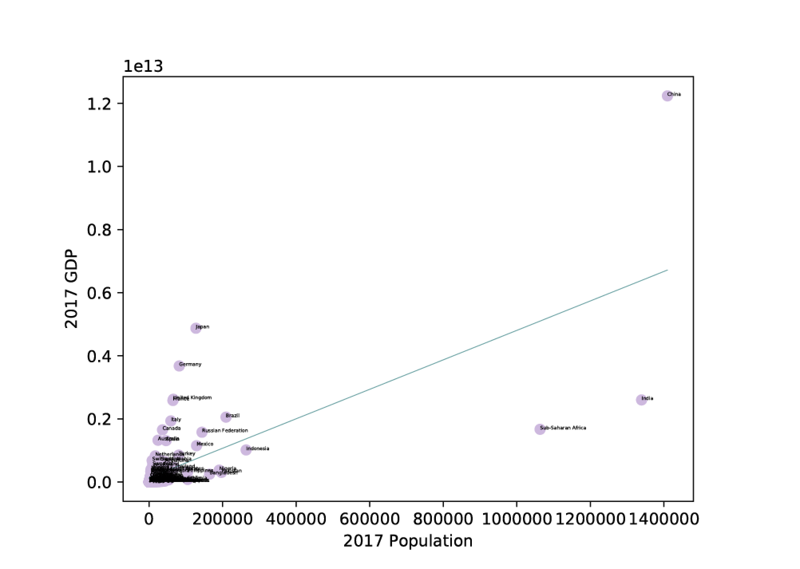

##### Week 11 TOC
- [Introduction](readme.md)
- [Datasets](datasets.md)
- [Homework](homework.md)

-----

### Migration Data

This week, let's prepare some complex data! The data is from several sources including the [World Bank](https://data.worldbank.org/indicator/ny.gdp.mktp.cd) as well as the incredibe [Migration Data Portal](https://migrationdataportal.org/?i=stock_abs_&t=2017).

We will be combining these datasets in order to analyze the degree to which they might be related.

### Statistical Significance and Variation

There are two synthetic metrics that can help us determine if datasets are related.

- *R2 values* are a useful measure of how correlated in *linear-space* two datapoints are. It's useful to imagine as a scatterplot. If all the points in the scatterplot could be placed on a line, the R2 coefficient would be 1. If none of the scattered points would fall on the regression line, the R2 coefficient would be 0. You can read more about how to interpret R2 values, and how to use them [at this useful explainer](https://blog.minitab.com/blog/adventures-in-statistics-2/regression-analysis-how-do-i-interpret-r-squared-and-assess-the-goodness-of-fit). Often, the term is written *r-square*.

- p values instead attempt to measure the *significance* of statistical sampling, and whether or not you can assume that the data in your model could actually represent a larger population and its expected parameters. Low p values reflect that the extremes of your sampled data has a low probability of being caused by generalized noisiness. High p values show that there is a high probablility that your sampled data is statistically *insignificant*, and that your sampling data is potentially too noisy or too limited, perhaps because we took a bad sample. This [explainer](https://blog.minitab.com/blog/adventures-in-statistics-2/how-to-correctly-interpret-p-values) helps, as does this more [tangible example](https://www.students4bestevidence.net/p-value-in-plain-english-2/). As useful as p values are for understanding if our work is rigorous, they are vulnerable to [manipulation](https://en.wikipedia.org/wiki/Data_dredging), which has led to an [ongoing crisis in public health analysis](https://www.npr.org/sections/thesalt/2018/09/26/651849441/cornell-food-researchers-downfall-raises-larger-questions-for-science).

As a simple way of summarizing, R2 values are a way to measure if modeled data are in some way related to one another, and p values tell us if we have looked at enough high quality data.

Given these two metrics, we can set up a 4 states.

- Low R-square and Low p-value : The model does not explain the variation in the data, but the data analyzed is good data (your data is better than your model)
- Low R-square and High p-value : The model does not explain the variation in the data, and the data is weird (worst!)
- High R-square and Low p-value : The model explains the variation in data, and the data is representative of larger populations (best!)
- High R-square and High p-value : The model explains the variation in the data, but the data is noisy (your model is better than your data)

