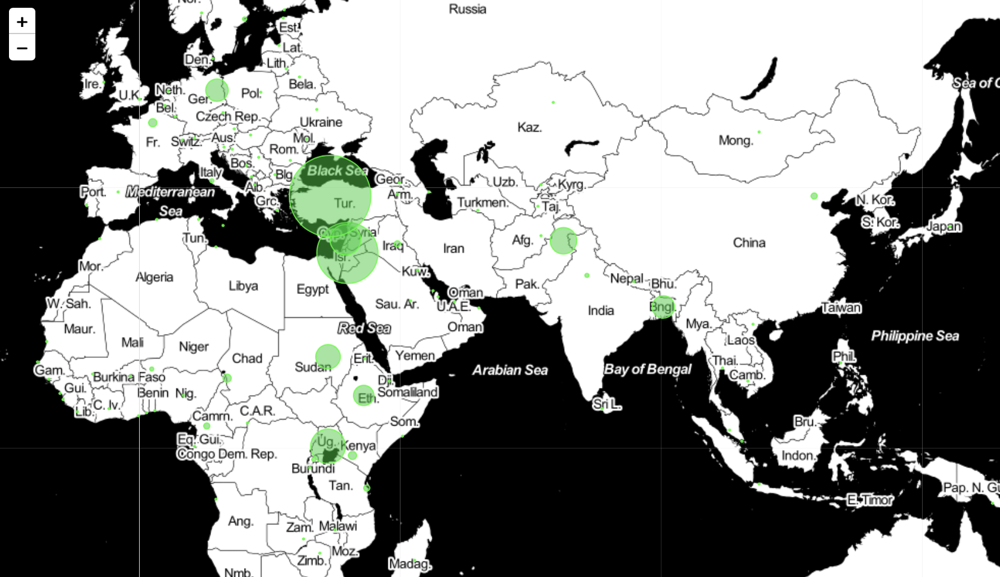

##### Week 13 TOC
- [Introduction](readme.md)
- [Datasets and Code](datasets.md)

-----

### ARIMA: Autoregressive, Integrated, Moving Averages

This week, let's create a predictive model based on ARIMA, along with several other useful datasets.

[ARIMA](https://en.wikipedia.org/wiki/Autoregressive_integrated_moving_average) is an incredibly powerful stastical tool that allows us to take a stream of sequenced values, and predict future values in the series. It is in practice very similar to linear regression, though significantly more powerful. ARIMA models [can be trained with machine learning approaches](https://towardsdatascience.com/forecasting-exchange-rates-using-arima-in-python-f032f313fc56), to increase the accuracy of their predictions.
